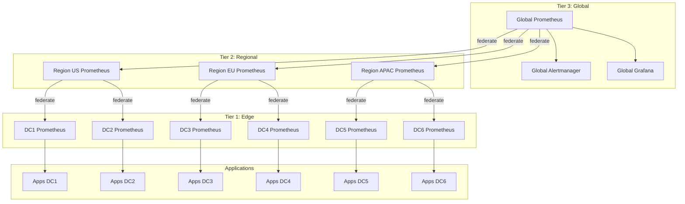
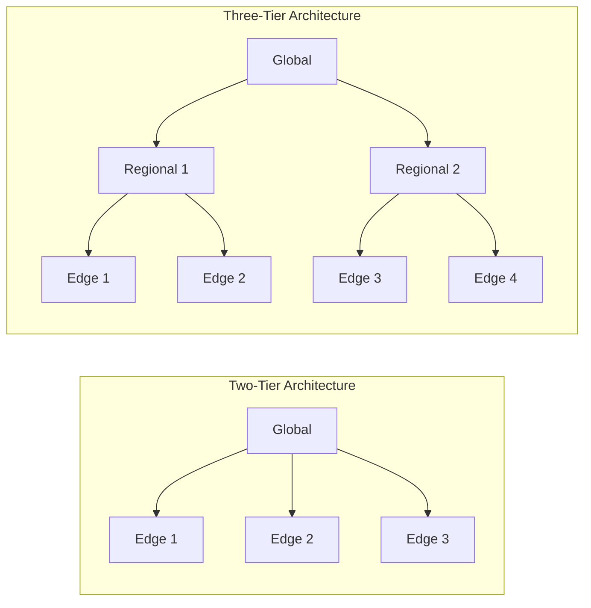
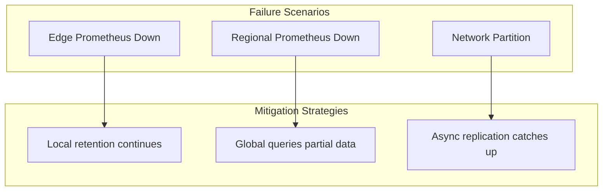

# How to Implement Prometheus Federation Hierarchies

Author: [nawazdhandala](https://www.github.com/nawazdhandala)

Tags: Prometheus, Federation, Monitoring, Hierarchical Architecture, Metrics Aggregation, Multi-Cluster, Observability, DevOps

Description: A deep dive into designing and implementing Prometheus federation hierarchies for enterprise-scale monitoring. Learn how to build multi-tier aggregation layers, optimize metric flow between tiers, and maintain observability across thousands of targets.

---

Managing metrics at scale requires more than a single Prometheus server. When your infrastructure spans multiple data centers, regions, or thousands of services, a hierarchical federation approach becomes essential. Federation hierarchies allow you to aggregate metrics at multiple levels, reducing cardinality at each tier while preserving the visibility you need for alerting and dashboards.

## Understanding Federation Hierarchies

A federation hierarchy organizes Prometheus instances into tiers. Each tier serves a specific purpose, from collecting raw metrics at the edge to providing global aggregates at the top. The key insight is that not every metric needs to flow to every level.



### Why Hierarchies Matter

Consider an organization with 50 data centers, each running 500 services. A single Prometheus server would need to scrape 25,000 targets directly and store millions of time series. Even if the server could handle the load, network latency and bandwidth consumption would become problematic.

A three-tier hierarchy solves these challenges:

| Tier | Purpose | Scrape Interval | Retention |
|------|---------|-----------------|-----------|
| Edge | Raw metrics from applications | 15s | 24h - 7d |
| Regional | Aggregated metrics from edge | 30s - 60s | 30d |
| Global | High-level aggregates from regional | 60s - 120s | 90d - 1y |

## Designing Your Hierarchy

Before writing configuration files, you need to answer several architectural questions.

### Question 1: How Many Tiers?

Two tiers work well for organizations with:
- Fewer than 10 locations
- Hundreds of services
- Centralized operations teams

Three or more tiers suit organizations with:
- Global presence across continents
- Thousands of services
- Distributed SRE teams with regional ownership



### Question 2: What Aggregates at Each Level?

Define recording rules that create progressively more aggregated metrics as you move up the hierarchy.

The following recording rules demonstrate aggregation at the edge tier, summing request rates by service and environment:

```yaml
# Edge tier recording rules - aggregate by service
groups:
  - name: edge_aggregations
    interval: 15s
    rules:
      # Sum request rate by service within the data center
      - record: dc:http_requests:rate5m
        expr: sum by (service, environment) (rate(http_requests_total[5m]))

      # Calculate error rate percentage by service
      - record: dc:http_errors:rate5m
        expr: |
          sum by (service, environment) (rate(http_requests_total{status_code=~"5.."}[5m]))
          /
          sum by (service, environment) (rate(http_requests_total[5m]))

      # P99 latency by service
      - record: dc:http_latency_p99:5m
        expr: |
          histogram_quantile(0.99,
            sum by (service, le) (rate(http_request_duration_seconds_bucket[5m]))
          )

      # Instance count per service (for capacity planning)
      - record: dc:service_instances:count
        expr: count by (service) (up{job=~".*-service"} == 1)
```

Regional recording rules further aggregate data from multiple data centers:

```yaml
# Regional tier recording rules - aggregate across data centers
groups:
  - name: regional_aggregations
    interval: 30s
    rules:
      # Sum request rate across all DCs in the region
      - record: region:http_requests:rate5m
        expr: sum by (service, environment, region) (dc:http_requests:rate5m)

      # Weighted average error rate across DCs
      - record: region:http_errors:rate5m
        expr: |
          sum by (service, environment, region) (dc:http_errors:rate5m * dc:http_requests:rate5m)
          /
          sum by (service, environment, region) (dc:http_requests:rate5m)

      # Regional P99 (approximation using max across DCs)
      - record: region:http_latency_p99:5m
        expr: max by (service, region) (dc:http_latency_p99:5m)

      # Total instances per service in the region
      - record: region:service_instances:count
        expr: sum by (service, region) (dc:service_instances:count)
```

### Question 3: What Flows Between Tiers?

Only federate what the higher tier actually needs. Each additional metric increases storage costs and query times at the parent level.

| Metric Type | Federate to Regional? | Federate to Global? |
|-------------|----------------------|---------------------|
| Raw application metrics | No | No |
| DC-level aggregates | Yes | No |
| Regional aggregates | N/A | Yes |
| Critical alerts metrics | Yes | Yes |
| up metric for targets | Selective | No |

## Implementing the Edge Tier

Edge Prometheus instances sit closest to your applications. They scrape raw metrics and create the first level of aggregation.

Below is a complete configuration for an edge Prometheus instance that scrapes local applications:

```yaml
# edge-prometheus.yml
# Deployed in each data center to collect raw metrics
global:
  scrape_interval: 15s
  evaluation_interval: 15s
  external_labels:
    datacenter: dc1
    region: us-east

# Load recording rules for local aggregation
rule_files:
  - /etc/prometheus/rules/edge_aggregations.yml
  - /etc/prometheus/rules/edge_alerts.yml

scrape_configs:
  # Scrape application pods in Kubernetes
  - job_name: 'kubernetes-pods'
    kubernetes_sd_configs:
      - role: pod
    relabel_configs:
      # Only scrape pods with prometheus.io/scrape annotation
      - source_labels: [__meta_kubernetes_pod_annotation_prometheus_io_scrape]
        action: keep
        regex: true
      # Use custom port if specified
      - source_labels: [__meta_kubernetes_pod_annotation_prometheus_io_port]
        action: replace
        target_label: __address__
        regex: (.+)
        replacement: ${1}
      # Add pod labels as metric labels
      - source_labels: [__meta_kubernetes_pod_label_app]
        action: replace
        target_label: service
      - source_labels: [__meta_kubernetes_namespace]
        action: replace
        target_label: namespace

  # Scrape node exporters for infrastructure metrics
  - job_name: 'node-exporter'
    kubernetes_sd_configs:
      - role: node
    relabel_configs:
      - source_labels: [__address__]
        regex: (.+):(.+)
        replacement: ${1}:9100
        target_label: __address__

  # Scrape kube-state-metrics for Kubernetes object metrics
  - job_name: 'kube-state-metrics'
    static_configs:
      - targets: ['kube-state-metrics.monitoring:8080']
```

### Exposing the Federation Endpoint

Every Prometheus instance automatically exposes a `/federate` endpoint. To make it accessible to the regional tier, deploy a service.

The following Kubernetes service exposes the federation endpoint for remote access:

```yaml
# prometheus-federation-svc.yml
apiVersion: v1
kind: Service
metadata:
  name: prometheus-federate
  namespace: monitoring
  labels:
    app: prometheus
    purpose: federation
  annotations:
    # Enable external DNS if using cross-cluster federation
    external-dns.alpha.kubernetes.io/hostname: prometheus-dc1.internal.example.com
spec:
  type: LoadBalancer
  selector:
    app.kubernetes.io/name: prometheus
    app.kubernetes.io/instance: edge
  ports:
    - name: web
      port: 9090
      targetPort: 9090
```

## Implementing the Regional Tier

Regional Prometheus instances pull aggregated metrics from multiple edge instances. They provide a unified view of a geographic region or logical grouping.

The regional Prometheus configuration federates from all edge instances in its region:

```yaml
# regional-prometheus.yml
# Deployed per region to aggregate metrics from edge instances
global:
  scrape_interval: 30s
  evaluation_interval: 30s
  external_labels:
    region: us-east
    tier: regional

rule_files:
  - /etc/prometheus/rules/regional_aggregations.yml
  - /etc/prometheus/rules/regional_alerts.yml

scrape_configs:
  # Federate from DC1 edge Prometheus
  - job_name: 'federate-dc1'
    honor_labels: true
    metrics_path: '/federate'
    scrape_interval: 30s
    scrape_timeout: 25s
    params:
      'match[]':
        # Only pull DC-level aggregates, not raw metrics
        - '{__name__=~"dc:.*"}'
        # Pull up metric for monitoring edge Prometheus health
        - 'up{job="prometheus"}'
    static_configs:
      - targets:
          - 'prometheus-dc1.internal.example.com:9090'
        labels:
          source_dc: dc1

  # Federate from DC2 edge Prometheus
  - job_name: 'federate-dc2'
    honor_labels: true
    metrics_path: '/federate'
    scrape_interval: 30s
    scrape_timeout: 25s
    params:
      'match[]':
        - '{__name__=~"dc:.*"}'
        - 'up{job="prometheus"}'
    static_configs:
      - targets:
          - 'prometheus-dc2.internal.example.com:9090'
        labels:
          source_dc: dc2

  # Federate from DC3 edge Prometheus
  - job_name: 'federate-dc3'
    honor_labels: true
    metrics_path: '/federate'
    scrape_interval: 30s
    scrape_timeout: 25s
    params:
      'match[]':
        - '{__name__=~"dc:.*"}'
        - 'up{job="prometheus"}'
    static_configs:
      - targets:
          - 'prometheus-dc3.internal.example.com:9090'
        labels:
          source_dc: dc3
```

### Dynamic Discovery for Edge Instances

Hard-coding edge instance addresses becomes unwieldy at scale. Use service discovery to automatically find federation targets.

Kubernetes-based service discovery configuration finds all edge Prometheus instances in the cluster:

```yaml
# regional-prometheus-dynamic.yml
scrape_configs:
  - job_name: 'federate-edge-instances'
    honor_labels: true
    metrics_path: '/federate'
    scrape_interval: 30s
    params:
      'match[]':
        - '{__name__=~"dc:.*"}'
        - 'up{job="prometheus"}'

    # Discover edge Prometheus instances via Kubernetes
    kubernetes_sd_configs:
      - role: service
        namespaces:
          names:
            - monitoring

    relabel_configs:
      # Only scrape services labeled for federation
      - source_labels: [__meta_kubernetes_service_label_federation]
        action: keep
        regex: 'edge'

      # Use the service name as the source datacenter label
      - source_labels: [__meta_kubernetes_service_name]
        action: replace
        target_label: source_dc

      # Extract region from service annotation
      - source_labels: [__meta_kubernetes_service_annotation_region]
        action: replace
        target_label: source_region
```

For multi-cluster scenarios, use file-based service discovery with an external configuration management system.

File-based service discovery allows external systems to update federation targets:

```yaml
# regional-prometheus-file-sd.yml
scrape_configs:
  - job_name: 'federate-edge-instances'
    honor_labels: true
    metrics_path: '/federate'
    scrape_interval: 30s
    params:
      'match[]':
        - '{__name__=~"dc:.*"}'

    # Load targets from file (updated by external process)
    file_sd_configs:
      - files:
          - /etc/prometheus/targets/edge-instances.json
        refresh_interval: 5m
```

The targets file should follow the Prometheus file_sd format:

```json
[
  {
    "targets": ["prometheus-dc1.internal.example.com:9090"],
    "labels": {
      "source_dc": "dc1",
      "source_region": "us-east"
    }
  },
  {
    "targets": ["prometheus-dc2.internal.example.com:9090"],
    "labels": {
      "source_dc": "dc2",
      "source_region": "us-east"
    }
  }
]
```

## Implementing the Global Tier

The global tier provides organization-wide visibility. It federates from regional instances and hosts global dashboards and alerts.

The global Prometheus configuration aggregates from all regional instances:

```yaml
# global-prometheus.yml
# Single instance (or HA pair) providing global view
global:
  scrape_interval: 60s
  evaluation_interval: 60s
  external_labels:
    tier: global

rule_files:
  - /etc/prometheus/rules/global_aggregations.yml
  - /etc/prometheus/rules/global_alerts.yml

scrape_configs:
  # Federate from US-East regional Prometheus
  - job_name: 'federate-us-east'
    honor_labels: true
    metrics_path: '/federate'
    scrape_interval: 60s
    scrape_timeout: 55s
    params:
      'match[]':
        # Only pull region-level aggregates
        - '{__name__=~"region:.*"}'
        # Pull critical metrics that need global alerting
        - '{__name__=~"dc:.*:critical"}'
    tls_config:
      ca_file: /etc/prometheus/certs/ca.crt
      cert_file: /etc/prometheus/certs/client.crt
      key_file: /etc/prometheus/certs/client.key
    static_configs:
      - targets:
          - 'prometheus-regional.us-east.example.com:9090'
        labels:
          source_region: us-east

  # Federate from EU-West regional Prometheus
  - job_name: 'federate-eu-west'
    honor_labels: true
    metrics_path: '/federate'
    scrape_interval: 60s
    scrape_timeout: 55s
    params:
      'match[]':
        - '{__name__=~"region:.*"}'
        - '{__name__=~"dc:.*:critical"}'
    tls_config:
      ca_file: /etc/prometheus/certs/ca.crt
      cert_file: /etc/prometheus/certs/client.crt
      key_file: /etc/prometheus/certs/client.key
    static_configs:
      - targets:
          - 'prometheus-regional.eu-west.example.com:9090'
        labels:
          source_region: eu-west

  # Federate from APAC regional Prometheus
  - job_name: 'federate-apac'
    honor_labels: true
    metrics_path: '/federate'
    scrape_interval: 60s
    scrape_timeout: 55s
    params:
      'match[]':
        - '{__name__=~"region:.*"}'
        - '{__name__=~"dc:.*:critical"}'
    tls_config:
      ca_file: /etc/prometheus/certs/ca.crt
      cert_file: /etc/prometheus/certs/client.crt
      key_file: /etc/prometheus/certs/client.key
    static_configs:
      - targets:
          - 'prometheus-regional.apac.example.com:9090'
        labels:
          source_region: apac
```

### Global Recording Rules

Create organization-wide aggregates at the global tier.

Global recording rules combine regional data into organization-wide metrics:

```yaml
# global_aggregations.yml
groups:
  - name: global_aggregations
    interval: 60s
    rules:
      # Total requests across all regions
      - record: global:http_requests:rate5m
        expr: sum by (service, environment) (region:http_requests:rate5m)

      # Global error rate (weighted average)
      - record: global:http_errors:rate5m
        expr: |
          sum by (service, environment) (region:http_errors:rate5m * region:http_requests:rate5m)
          /
          sum by (service, environment) (region:http_requests:rate5m)

      # Maximum latency across regions (worst case)
      - record: global:http_latency_p99_max:5m
        expr: max by (service) (region:http_latency_p99:5m)

      # Total instance count globally
      - record: global:service_instances:count
        expr: sum by (service) (region:service_instances:count)

      # Regional availability (percentage of edge instances reporting)
      - record: global:region_availability:ratio
        expr: |
          count by (region) (up{job=~"federate-.*"} == 1)
          /
          count by (region) (up{job=~"federate-.*"})
```

## Handling Authentication Between Tiers

Production deployments require authentication between federation endpoints.

### Using mTLS

mTLS configuration ensures only authorized Prometheus instances can federate:

```yaml
# On edge/regional Prometheus - enable TLS server
# prometheus.yml web configuration
web:
  tls_config:
    cert_file: /etc/prometheus/certs/server.crt
    key_file: /etc/prometheus/certs/server.key
    client_ca_file: /etc/prometheus/certs/ca.crt
    client_auth_type: RequireAndVerifyClientCert

# On regional/global Prometheus - configure TLS client
scrape_configs:
  - job_name: 'federate-secure'
    scheme: https
    tls_config:
      ca_file: /etc/prometheus/certs/ca.crt
      cert_file: /etc/prometheus/certs/client.crt
      key_file: /etc/prometheus/certs/client.key
```

### Using OAuth2

OAuth2 bearer token authentication for cloud-native environments:

```yaml
# scrape config with OAuth2
scrape_configs:
  - job_name: 'federate-oauth'
    honor_labels: true
    metrics_path: '/federate'
    oauth2:
      client_id: prometheus-federation
      client_secret_file: /etc/prometheus/oauth/client_secret
      token_url: https://auth.example.com/oauth/token
      scopes:
        - metrics:read
    params:
      'match[]':
        - '{__name__=~"region:.*"}'
```

## Monitoring the Hierarchy

Your federation hierarchy needs its own monitoring. Create dashboards and alerts for federation health.

The following alert rules detect problems in the federation hierarchy:

```yaml
# federation_alerts.yml
groups:
  - name: federation_health
    rules:
      # Alert when edge instance stops reporting to regional
      - alert: EdgeFederationDown
        expr: up{job=~"federate-dc.*"} == 0
        for: 5m
        labels:
          severity: warning
          tier: regional
        annotations:
          summary: "Edge federation from {{ $labels.source_dc }} is down"
          description: "Regional Prometheus cannot federate from {{ $labels.source_dc }} for more than 5 minutes"

      # Alert when regional instance stops reporting to global
      - alert: RegionalFederationDown
        expr: up{job=~"federate-.*-regional"} == 0
        for: 5m
        labels:
          severity: critical
          tier: global
        annotations:
          summary: "Regional federation from {{ $labels.source_region }} is down"
          description: "Global Prometheus cannot federate from {{ $labels.source_region }} for more than 5 minutes"

      # Alert on high federation scrape duration
      - alert: FederationScrapeSlow
        expr: scrape_duration_seconds{job=~"federate-.*"} > 30
        for: 10m
        labels:
          severity: warning
        annotations:
          summary: "Federation scrape taking too long"
          description: "Federation scrape for {{ $labels.job }} is taking {{ $value }}s"

      # Alert when too many samples are being federated
      - alert: FederationHighCardinality
        expr: scrape_samples_scraped{job=~"federate-.*"} > 100000
        for: 15m
        labels:
          severity: warning
        annotations:
          summary: "High cardinality in federation"
          description: "Federation job {{ $labels.job }} is pulling {{ $value }} samples per scrape"
```

### Key Metrics to Monitor

Use these PromQL queries to monitor your federation hierarchy:

```promql
# Federation scrape success rate
sum(up{job=~"federate-.*"}) / count(up{job=~"federate-.*"})

# Total samples being federated
sum(scrape_samples_scraped{job=~"federate-.*"})

# Federation latency by source
histogram_quantile(0.95, sum by (job, le) (scrape_duration_seconds_bucket{job=~"federate-.*"}))

# Data lag (time since last successful scrape)
time() - max by (job) (prometheus_target_metadata_cache_bytes{job=~"federate-.*"})
```

## Performance Optimization

Federation hierarchies can become bottlenecks without proper tuning.

### Scrape Timeout Tuning

Match timeout to interval to prevent overlapping scrapes:

```yaml
scrape_configs:
  - job_name: 'federate-large-dc'
    scrape_interval: 60s
    scrape_timeout: 55s  # Leave 5s buffer
```

### Limiting Match Patterns

Overly broad match patterns cause performance issues. Be specific:

```yaml
# Bad: pulls everything
params:
  'match[]':
    - '{job=~".+"}'

# Good: pulls only needed aggregates
params:
  'match[]':
    - '{__name__=~"dc:(http_requests|http_errors|http_latency):.*"}'
    - '{__name__="dc:service_instances:count"}'
```

### Memory Planning

Estimate memory requirements based on time series count. The following formula provides a rough estimate:

```
Memory (GB) = (time_series_count * 2KB * retention_chunks) / 1024^3

Example for regional tier:
- 500,000 time series from 5 DCs
- Average 120 chunks per series (30 day retention at 30s intervals)
- Memory = (500000 * 2048 * 120) / 1073741824 = ~114 GB
```

Reserve 30-50% additional memory for query processing and indexing overhead.

## Handling Failures

Design your hierarchy to gracefully handle failures at any tier.



### Edge Instance Failure

When an edge instance fails, the regional tier receives no updates but continues operating. Configure alerts to detect gaps.

Recording rule that detects stale data from edge instances:

```yaml
groups:
  - name: staleness_detection
    rules:
      - record: federation:data_age:seconds
        expr: time() - max by (source_dc) (timestamp(dc:http_requests:rate5m))

      - alert: StaleEdgeData
        expr: federation:data_age:seconds > 300
        for: 5m
        labels:
          severity: warning
        annotations:
          summary: "Stale data from {{ $labels.source_dc }}"
```

### Regional Instance Failure

Deploy regional Prometheus in high availability mode with shared storage or use Prometheus Operator's HA features.

Prometheus Operator configuration for HA regional deployment:

```yaml
# regional-prometheus-ha.yml
apiVersion: monitoring.coreos.com/v1
kind: Prometheus
metadata:
  name: regional-ha
  namespace: monitoring
spec:
  replicas: 2
  replicaExternalLabelName: replica
  # Both replicas scrape independently
  # Downstream deduplication handles duplicates

  retention: 30d

  storage:
    volumeClaimTemplate:
      spec:
        storageClassName: fast-ssd
        resources:
          requests:
            storage: 500Gi

  affinity:
    podAntiAffinity:
      requiredDuringSchedulingIgnoredDuringExecution:
        - labelSelector:
            matchLabels:
              app.kubernetes.io/name: prometheus
          topologyKey: kubernetes.io/hostname
```

## Advanced Patterns

### Cross-Region Queries Without Full Federation

For ad-hoc queries that span regions, configure remote_read instead of federating all data.

Remote read configuration enables cross-region queries without full data replication:

```yaml
# global-prometheus.yml with remote_read
remote_read:
  # Query US-East directly when needed
  - url: 'https://prometheus-regional.us-east.example.com:9090/api/v1/read'
    read_recent: true
    name: us-east
    tls_config:
      ca_file: /etc/prometheus/certs/ca.crt
      cert_file: /etc/prometheus/certs/client.crt
      key_file: /etc/prometheus/certs/client.key

  # Query EU-West directly when needed
  - url: 'https://prometheus-regional.eu-west.example.com:9090/api/v1/read'
    read_recent: true
    name: eu-west
    tls_config:
      ca_file: /etc/prometheus/certs/ca.crt
      cert_file: /etc/prometheus/certs/client.crt
      key_file: /etc/prometheus/certs/client.key
```

### Selective Critical Metric Federation

Some metrics need to bypass the normal aggregation path and flow directly to global.

Selective federation for critical metrics that need immediate global visibility:

```yaml
# edge-prometheus-critical-rules.yml
groups:
  - name: critical_passthrough
    rules:
      # Mark critical metrics for direct global federation
      - record: dc:service_down:critical
        expr: up{job=~".*-service", critical="true"} == 0
        labels:
          requires_global_alert: "true"
```

```yaml
# global-prometheus.yml - pull critical metrics from edge directly
scrape_configs:
  - job_name: 'critical-metrics-direct'
    honor_labels: true
    metrics_path: '/federate'
    scrape_interval: 15s  # Faster for critical metrics
    params:
      'match[]':
        - '{requires_global_alert="true"}'
    file_sd_configs:
      - files:
          - /etc/prometheus/targets/all-edge-instances.json
```

## Comparing Alternatives

Federation hierarchies work well but are not the only solution for scaling Prometheus.

| Solution | Best For | Trade-offs |
|----------|----------|------------|
| Federation Hierarchies | Control over aggregation, existing Prometheus | Complexity in configuration |
| Thanos | Long-term storage, deduplication | Additional infrastructure (sidecar, store, query) |
| Cortex/Mimir | Multi-tenant, massive scale | Operational complexity, cost |
| VictoriaMetrics | Cost-efficient storage, drop-in replacement | Fewer ecosystem integrations |

## Conclusion

Prometheus federation hierarchies provide a flexible approach to scaling metrics collection across large infrastructures. Start with clear tier boundaries, define aggregation rules at each level, and monitor the federation health as carefully as you monitor your applications. For organizations seeking a managed approach to multi-region monitoring with built-in hierarchy support, OneUptime offers integrated metrics aggregation alongside logs, traces, and incident management - eliminating the operational burden of maintaining federation infrastructure yourself.
