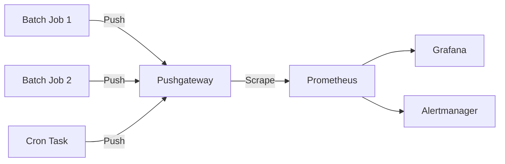
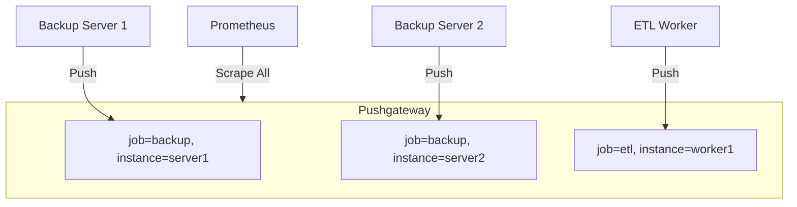
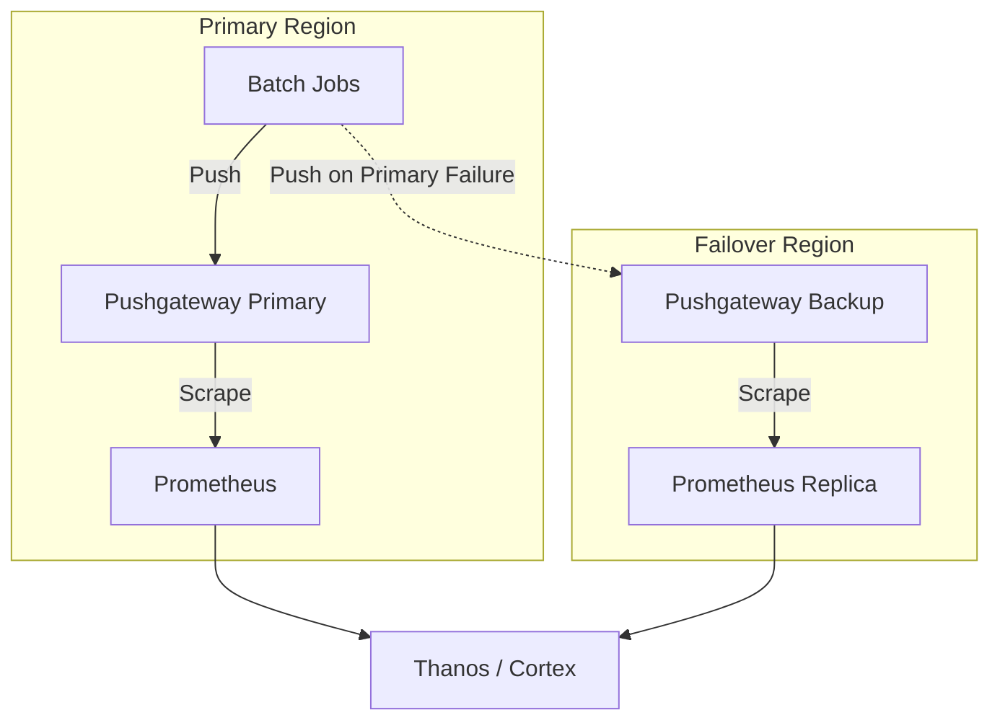

# How to Configure Prometheus Pushgateway for Batch Jobs

Author: [nawazdhandala](https://github.com/nawazdhandala)

Tags: Prometheus, Pushgateway, Batch Jobs, Monitoring, Metrics, DevOps, Cron Jobs, Observability

Description: A practical guide to configuring Prometheus Pushgateway for monitoring batch jobs, cron tasks, and short-lived processes that complete before Prometheus can scrape them.

---

Prometheus relies on a pull-based model where it scrapes metrics from running applications at regular intervals. Batch jobs, cron tasks, and short-lived processes often finish executing before Prometheus gets a chance to collect their metrics. Pushgateway solves this problem by acting as an intermediary that accepts pushed metrics and exposes them for Prometheus to scrape.

## Why Pushgateway?

| Problem | Solution with Pushgateway |
|---------|--------------------------|
| Job completes in 30 seconds, scrape interval is 60 seconds | Metrics persist in Pushgateway after job exits |
| No consistent endpoint for Prometheus to target | Single, stable endpoint for all batch job metrics |
| Missing visibility into nightly data processing | Duration, success/failure, and record counts available |
| No alerting on failed cron jobs | Alert on stale or failed job metrics |

## Architecture Overview

The following diagram shows how Pushgateway fits into the Prometheus ecosystem for batch job monitoring.



## Installing Pushgateway

### Docker Installation

Running Pushgateway as a Docker container provides quick setup and easy deployment. The container exposes port 9091 for receiving pushed metrics.

```bash
# Run Pushgateway with persistent storage for metrics
docker run -d \
  --name pushgateway \
  -p 9091:9091 \
  -v pushgateway-data:/data \
  prom/pushgateway:latest \
  --persistence.file=/data/metrics \
  --persistence.interval=5m
```

### Kubernetes Deployment

For production Kubernetes environments, deploy Pushgateway as a Deployment with a Service for internal access.

```yaml
# pushgateway-deployment.yaml
apiVersion: apps/v1
kind: Deployment
metadata:
  name: pushgateway
  namespace: monitoring
  labels:
    app: pushgateway
spec:
  replicas: 1
  selector:
    matchLabels:
      app: pushgateway
  template:
    metadata:
      labels:
        app: pushgateway
    spec:
      containers:
        - name: pushgateway
          image: prom/pushgateway:v1.6.2
          ports:
            - containerPort: 9091
              name: http
          args:
            # Persist metrics across restarts
            - --persistence.file=/data/metrics
            - --persistence.interval=5m
          volumeMounts:
            - name: data
              mountPath: /data
          resources:
            requests:
              memory: "64Mi"
              cpu: "50m"
            limits:
              memory: "128Mi"
              cpu: "100m"
          livenessProbe:
            httpGet:
              path: /-/healthy
              port: 9091
            initialDelaySeconds: 10
            periodSeconds: 30
          readinessProbe:
            httpGet:
              path: /-/ready
              port: 9091
            initialDelaySeconds: 5
            periodSeconds: 10
      volumes:
        - name: data
          emptyDir: {}
---
# Service for internal cluster access
apiVersion: v1
kind: Service
metadata:
  name: pushgateway
  namespace: monitoring
  labels:
    app: pushgateway
spec:
  selector:
    app: pushgateway
  ports:
    - port: 9091
      targetPort: 9091
      name: http
```

### Configuring Prometheus to Scrape Pushgateway

Add Pushgateway as a scrape target in your Prometheus configuration. The honor_labels setting preserves the job labels pushed by batch jobs.

```yaml
# prometheus.yml - Add to scrape_configs section
scrape_configs:
  - job_name: 'pushgateway'
    # Preserve job and instance labels from pushed metrics
    honor_labels: true
    static_configs:
      - targets: ['pushgateway:9091']
    # Scrape more frequently since batch jobs may run often
    scrape_interval: 15s
```

## Pushing Metrics from Batch Jobs

### Basic Shell Script Integration

Shell scripts can push metrics using curl. Each metric follows the Prometheus text format with a metric name, optional labels, and a numeric value.

```bash
#!/bin/bash
# daily-backup.sh - Backup script with Prometheus metrics

PUSHGATEWAY_URL="http://pushgateway:9091"
JOB_NAME="daily_backup"
INSTANCE="server-01"

# Record start time
START_TIME=$(date +%s)

# Initialize status as failed (0 = failure, 1 = success)
STATUS=0
RECORDS_PROCESSED=0

# Perform the backup operation
if pg_dump mydb | gzip > /backups/mydb-$(date +%Y%m%d).sql.gz; then
    STATUS=1
    RECORDS_PROCESSED=$(psql -t -c "SELECT COUNT(*) FROM important_table" mydb)
fi

# Calculate duration
END_TIME=$(date +%s)
DURATION=$((END_TIME - START_TIME))

# Push all metrics to Pushgateway in a single request
# The job and instance labels identify this specific job run
cat <<EOF | curl --data-binary @- "${PUSHGATEWAY_URL}/metrics/job/${JOB_NAME}/instance/${INSTANCE}"
# HELP batch_job_duration_seconds Duration of batch job in seconds
# TYPE batch_job_duration_seconds gauge
batch_job_duration_seconds ${DURATION}
# HELP batch_job_success Whether the batch job succeeded (1) or failed (0)
# TYPE batch_job_success gauge
batch_job_success ${STATUS}
# HELP batch_job_records_processed Number of records processed by batch job
# TYPE batch_job_records_processed gauge
batch_job_records_processed ${RECORDS_PROCESSED}
# HELP batch_job_last_run_timestamp Unix timestamp of last job run
# TYPE batch_job_last_run_timestamp gauge
batch_job_last_run_timestamp ${END_TIME}
EOF

echo "Metrics pushed to Pushgateway"
```

### Python Batch Job Integration

Python applications benefit from the prometheus_client library, which handles metric formatting and HTTP communication with Pushgateway.

```python
#!/usr/bin/env python3
"""
Data processing batch job with Prometheus metrics.
Pushes job duration, success status, and processing statistics to Pushgateway.
"""

import time
import os
from prometheus_client import CollectorRegistry, Gauge, Counter, push_to_gateway
from prometheus_client.exposition import basic_auth_handler

# Configuration from environment variables
PUSHGATEWAY_URL = os.getenv('PUSHGATEWAY_URL', 'localhost:9091')
JOB_NAME = 'data_processor'
INSTANCE = os.getenv('HOSTNAME', 'unknown')

# Create a dedicated registry for this job
# Using a separate registry avoids conflicts with default metrics
registry = CollectorRegistry()

# Define metrics with descriptive help text
job_duration = Gauge(
    'batch_job_duration_seconds',
    'Total duration of the batch job in seconds',
    ['job_name', 'status'],
    registry=registry
)

job_last_success = Gauge(
    'batch_job_last_success_timestamp',
    'Unix timestamp of the last successful job completion',
    ['job_name'],
    registry=registry
)

records_processed = Gauge(
    'batch_job_records_processed_total',
    'Total number of records processed in this job run',
    ['job_name', 'record_type'],
    registry=registry
)

errors_total = Gauge(
    'batch_job_errors_total',
    'Total number of errors encountered during job execution',
    ['job_name', 'error_type'],
    registry=registry
)


def process_data():
    """
    Main data processing logic.
    Returns a dictionary with processing statistics.
    """
    stats = {
        'users_processed': 0,
        'orders_processed': 0,
        'errors': {'validation': 0, 'database': 0}
    }

    # Simulate processing users from a data source
    users = fetch_users_to_process()
    for user in users:
        try:
            process_user(user)
            stats['users_processed'] += 1
        except ValidationError:
            stats['errors']['validation'] += 1
        except DatabaseError:
            stats['errors']['database'] += 1

    # Simulate processing orders
    orders = fetch_orders_to_process()
    for order in orders:
        try:
            process_order(order)
            stats['orders_processed'] += 1
        except ValidationError:
            stats['errors']['validation'] += 1
        except DatabaseError:
            stats['errors']['database'] += 1

    return stats


def run_job_with_metrics():
    """
    Execute the batch job and push metrics to Pushgateway.
    Captures duration, success/failure status, and processing statistics.
    """
    start_time = time.time()
    status = 'failure'

    try:
        # Execute the main processing logic
        stats = process_data()

        # Record processing statistics
        records_processed.labels(
            job_name=JOB_NAME,
            record_type='users'
        ).set(stats['users_processed'])

        records_processed.labels(
            job_name=JOB_NAME,
            record_type='orders'
        ).set(stats['orders_processed'])

        # Record error counts by type
        for error_type, count in stats['errors'].items():
            errors_total.labels(
                job_name=JOB_NAME,
                error_type=error_type
            ).set(count)

        # Mark job as successful
        status = 'success'
        job_last_success.labels(job_name=JOB_NAME).set(time.time())

    except Exception as e:
        print(f"Job failed with error: {e}")
        errors_total.labels(
            job_name=JOB_NAME,
            error_type='fatal'
        ).set(1)
        raise

    finally:
        # Always record duration, even on failure
        duration = time.time() - start_time
        job_duration.labels(
            job_name=JOB_NAME,
            status=status
        ).set(duration)

        # Push all metrics to Pushgateway
        # The grouping_key identifies this specific job instance
        push_to_gateway(
            PUSHGATEWAY_URL,
            job=JOB_NAME,
            registry=registry,
            grouping_key={'instance': INSTANCE}
        )
        print(f"Metrics pushed to {PUSHGATEWAY_URL}")


if __name__ == '__main__':
    run_job_with_metrics()
```

### Node.js Batch Job Integration

Node.js batch jobs use the prom-client library to create and push metrics. The Pushgateway class handles the HTTP push operation.

```javascript
/**
 * ETL batch job with Prometheus metrics integration.
 * Demonstrates pushing metrics from a Node.js process to Pushgateway.
 */

const client = require('prom-client');

// Configuration
const PUSHGATEWAY_URL = process.env.PUSHGATEWAY_URL || 'http://pushgateway:9091';
const JOB_NAME = 'etl_job';
const INSTANCE = process.env.HOSTNAME || 'local';

// Create a dedicated registry for batch job metrics
const registry = new client.Registry();

// Add default labels that apply to all metrics from this job
registry.setDefaultLabels({
  job_name: JOB_NAME,
  instance: INSTANCE
});

// Define job metrics
const jobDuration = new client.Gauge({
  name: 'batch_job_duration_seconds',
  help: 'Duration of the ETL job in seconds',
  labelNames: ['phase'],
  registers: [registry]
});

const jobSuccess = new client.Gauge({
  name: 'batch_job_success',
  help: 'Whether the job completed successfully (1) or failed (0)',
  registers: [registry]
});

const recordsExtracted = new client.Gauge({
  name: 'etl_records_extracted_total',
  help: 'Number of records extracted from source',
  labelNames: ['source'],
  registers: [registry]
});

const recordsLoaded = new client.Gauge({
  name: 'etl_records_loaded_total',
  help: 'Number of records loaded to destination',
  labelNames: ['destination'],
  registers: [registry]
});

const recordsRejected = new client.Gauge({
  name: 'etl_records_rejected_total',
  help: 'Number of records rejected during transformation',
  labelNames: ['reason'],
  registers: [registry]
});

// Initialize Pushgateway client
const gateway = new client.Pushgateway(PUSHGATEWAY_URL, {}, registry);

/**
 * Extract data from multiple sources.
 * Tracks extraction metrics per source.
 */
async function extract() {
  const startTime = process.hrtime.bigint();

  const sources = {
    postgres: await extractFromPostgres(),
    mongodb: await extractFromMongoDB(),
    api: await extractFromAPI()
  };

  // Record extraction counts per source
  for (const [source, records] of Object.entries(sources)) {
    recordsExtracted.labels({ source }).set(records.length);
  }

  const durationNs = process.hrtime.bigint() - startTime;
  jobDuration.labels({ phase: 'extract' }).set(Number(durationNs) / 1e9);

  return Object.values(sources).flat();
}

/**
 * Transform and validate records.
 * Tracks rejected records by rejection reason.
 */
async function transform(records) {
  const startTime = process.hrtime.bigint();
  const results = { valid: [], rejected: { validation: 0, duplicate: 0, format: 0 } };

  for (const record of records) {
    const validation = validateRecord(record);

    if (validation.valid) {
      results.valid.push(transformRecord(record));
    } else {
      results.rejected[validation.reason]++;
    }
  }

  // Record rejection counts
  for (const [reason, count] of Object.entries(results.rejected)) {
    recordsRejected.labels({ reason }).set(count);
  }

  const durationNs = process.hrtime.bigint() - startTime;
  jobDuration.labels({ phase: 'transform' }).set(Number(durationNs) / 1e9);

  return results.valid;
}

/**
 * Load transformed records to destinations.
 * Tracks loaded record counts per destination.
 */
async function load(records) {
  const startTime = process.hrtime.bigint();

  // Load to data warehouse
  const warehouseCount = await loadToWarehouse(records);
  recordsLoaded.labels({ destination: 'warehouse' }).set(warehouseCount);

  // Load to search index
  const searchCount = await loadToElasticsearch(records);
  recordsLoaded.labels({ destination: 'elasticsearch' }).set(searchCount);

  const durationNs = process.hrtime.bigint() - startTime;
  jobDuration.labels({ phase: 'load' }).set(Number(durationNs) / 1e9);
}

/**
 * Main ETL job runner.
 * Orchestrates extract, transform, load phases and pushes metrics.
 */
async function runETLJob() {
  const totalStartTime = process.hrtime.bigint();

  try {
    console.log('Starting ETL job...');

    // Execute ETL phases
    const extracted = await extract();
    console.log(`Extracted ${extracted.length} records`);

    const transformed = await transform(extracted);
    console.log(`Transformed ${transformed.length} records`);

    await load(transformed);
    console.log('Load complete');

    // Mark job as successful
    jobSuccess.set(1);

  } catch (error) {
    console.error('ETL job failed:', error.message);
    jobSuccess.set(0);
    throw error;

  } finally {
    // Record total duration
    const totalDurationNs = process.hrtime.bigint() - totalStartTime;
    jobDuration.labels({ phase: 'total' }).set(Number(totalDurationNs) / 1e9);

    // Push metrics to Pushgateway before exiting
    try {
      await gateway.pushAdd({ jobName: JOB_NAME });
      console.log('Metrics pushed successfully');
    } catch (pushError) {
      console.error('Failed to push metrics:', pushError.message);
    }
  }
}

// Run the job
runETLJob()
  .then(() => process.exit(0))
  .catch(() => process.exit(1));
```

### Go Batch Job Integration

Go programs use the prometheus/client_golang library. The push package provides functionality for pushing metrics to Pushgateway.

```go
// main.go - Data synchronization batch job with Prometheus metrics
package main

import (
	"fmt"
	"log"
	"os"
	"time"

	"github.com/prometheus/client_golang/prometheus"
	"github.com/prometheus/client_golang/prometheus/push"
)

var (
	// Configuration
	pushgatewayURL = getEnv("PUSHGATEWAY_URL", "http://pushgateway:9091")
	jobName        = "data_sync"
	instance       = getEnv("HOSTNAME", "unknown")

	// Metrics definitions with descriptive help text
	jobDuration = prometheus.NewGaugeVec(
		prometheus.GaugeOpts{
			Name: "batch_job_duration_seconds",
			Help: "Total duration of the sync job in seconds",
		},
		[]string{"source", "destination"},
	)

	jobSuccess = prometheus.NewGauge(prometheus.GaugeOpts{
		Name: "batch_job_success",
		Help: "Whether the sync job completed successfully (1) or failed (0)",
	})

	recordsSynced = prometheus.NewGaugeVec(
		prometheus.GaugeOpts{
			Name: "sync_records_total",
			Help: "Number of records synchronized",
		},
		[]string{"table", "operation"},
	)

	syncErrors = prometheus.NewGaugeVec(
		prometheus.GaugeOpts{
			Name: "sync_errors_total",
			Help: "Number of errors during synchronization",
		},
		[]string{"table", "error_type"},
	)
)

// getEnv returns environment variable value or default
func getEnv(key, defaultValue string) string {
	if value := os.Getenv(key); value != "" {
		return value
	}
	return defaultValue
}

// SyncStats holds statistics from the sync operation
type SyncStats struct {
	Table     string
	Inserted  int
	Updated   int
	Deleted   int
	Errors    map[string]int
}

// syncTable performs the actual data synchronization for a table
func syncTable(tableName string) (*SyncStats, error) {
	stats := &SyncStats{
		Table:  tableName,
		Errors: make(map[string]int),
	}

	// Fetch source records
	sourceRecords, err := fetchSourceRecords(tableName)
	if err != nil {
		stats.Errors["fetch"] = 1
		return stats, fmt.Errorf("failed to fetch source records: %w", err)
	}

	// Compare and sync each record
	for _, record := range sourceRecords {
		exists, err := checkDestinationRecord(tableName, record.ID)
		if err != nil {
			stats.Errors["lookup"]++
			continue
		}

		if exists {
			if err := updateDestinationRecord(tableName, record); err != nil {
				stats.Errors["update"]++
				continue
			}
			stats.Updated++
		} else {
			if err := insertDestinationRecord(tableName, record); err != nil {
				stats.Errors["insert"]++
				continue
			}
			stats.Inserted++
		}
	}

	// Handle deletions
	deletedCount, err := syncDeletions(tableName)
	if err != nil {
		stats.Errors["delete"]++
	} else {
		stats.Deleted = deletedCount
	}

	return stats, nil
}

// recordMetrics records sync statistics as Prometheus metrics
func recordMetrics(stats *SyncStats) {
	recordsSynced.WithLabelValues(stats.Table, "insert").Set(float64(stats.Inserted))
	recordsSynced.WithLabelValues(stats.Table, "update").Set(float64(stats.Updated))
	recordsSynced.WithLabelValues(stats.Table, "delete").Set(float64(stats.Deleted))

	for errorType, count := range stats.Errors {
		syncErrors.WithLabelValues(stats.Table, errorType).Set(float64(count))
	}
}

// pushMetrics sends all collected metrics to Pushgateway
func pushMetrics() error {
	// Create a pusher with job name and instance grouping
	pusher := push.New(pushgatewayURL, jobName).
		Grouping("instance", instance).
		Collector(jobDuration).
		Collector(jobSuccess).
		Collector(recordsSynced).
		Collector(syncErrors)

	// Push metrics (Add mode preserves existing metrics from other instances)
	if err := pusher.Add(); err != nil {
		return fmt.Errorf("failed to push metrics: %w", err)
	}

	log.Printf("Metrics pushed to %s", pushgatewayURL)
	return nil
}

func main() {
	startTime := time.Now()
	success := true

	// Tables to synchronize
	tables := []string{"users", "orders", "products", "inventory"}

	log.Println("Starting data synchronization job")

	for _, table := range tables {
		tableStart := time.Now()
		log.Printf("Syncing table: %s", table)

		stats, err := syncTable(table)
		if err != nil {
			log.Printf("Error syncing %s: %v", table, err)
			success = false
		}

		// Record metrics for this table
		recordMetrics(stats)

		// Record table sync duration
		duration := time.Since(tableStart).Seconds()
		jobDuration.WithLabelValues("postgres", "warehouse").Set(duration)

		log.Printf("Table %s: inserted=%d, updated=%d, deleted=%d",
			table, stats.Inserted, stats.Updated, stats.Deleted)
	}

	// Record overall job status
	if success {
		jobSuccess.Set(1)
	} else {
		jobSuccess.Set(0)
	}

	// Record total job duration
	totalDuration := time.Since(startTime).Seconds()
	jobDuration.WithLabelValues("all", "all").Set(totalDuration)

	log.Printf("Job completed in %.2f seconds, success=%v", totalDuration, success)

	// Push all metrics to Pushgateway
	if err := pushMetrics(); err != nil {
		log.Printf("Warning: %v", err)
	}

	if !success {
		os.Exit(1)
	}
}
```

## Metric Lifecycle Management

### Understanding Grouping Keys

Pushgateway organizes metrics by grouping keys (job and instance labels). Each unique combination creates a separate metric group that persists until explicitly deleted.



### Cleaning Up Stale Metrics

Batch jobs may leave stale metrics in Pushgateway. Implement cleanup to remove metrics from jobs that no longer run.

```bash
#!/bin/bash
# cleanup-pushgateway.sh - Remove stale job metrics

PUSHGATEWAY_URL="http://pushgateway:9091"

# Delete metrics for a specific job and instance combination
# Use when decommissioning a server or removing a job
delete_job_metrics() {
    local job_name=$1
    local instance=$2

    curl -X DELETE "${PUSHGATEWAY_URL}/metrics/job/${job_name}/instance/${instance}"
    echo "Deleted metrics for job=${job_name}, instance=${instance}"
}

# Delete all metrics for a job (all instances)
delete_all_job_instances() {
    local job_name=$1

    curl -X DELETE "${PUSHGATEWAY_URL}/metrics/job/${job_name}"
    echo "Deleted all metrics for job=${job_name}"
}

# Example usage
delete_job_metrics "old_backup" "decommissioned-server"
delete_all_job_instances "deprecated_etl_job"
```

### Using push vs pushAdd

The choice between push and pushAdd affects how metrics are stored. Understanding the difference prevents accidental metric loss.

```python
from prometheus_client import push_to_gateway, pushadd_to_gateway

# push_to_gateway REPLACES all metrics for the grouping key
# Use when you want to completely reset metrics for this job instance
# WARNING: Removes all previously pushed metrics for this job/instance
push_to_gateway(
    'pushgateway:9091',
    job='my_job',
    registry=registry,
    grouping_key={'instance': 'worker-1'}
)

# pushadd_to_gateway ADDS/UPDATES metrics without removing others
# Use when multiple processes push different metrics for the same job
# Preferred for most batch job scenarios
pushadd_to_gateway(
    'pushgateway:9091',
    job='my_job',
    registry=registry,
    grouping_key={'instance': 'worker-1'}
)
```

## Alerting on Batch Job Metrics

### Alert Rules for Job Monitoring

Create Prometheus alerting rules to detect failed jobs, long-running jobs, and jobs that stop running entirely.

```yaml
# prometheus-rules.yaml
groups:
  - name: batch_job_alerts
    rules:
      # Alert when a batch job fails
      - alert: BatchJobFailed
        expr: batch_job_success == 0
        for: 0m
        labels:
          severity: critical
        annotations:
          summary: "Batch job {{ $labels.job_name }} failed"
          description: "Job {{ $labels.job_name }} on instance {{ $labels.instance }} has failed. Check logs for details."

      # Alert when a job has not run recently (stale metrics)
      - alert: BatchJobNotRunning
        expr: time() - batch_job_last_success_timestamp > 86400
        for: 5m
        labels:
          severity: warning
        annotations:
          summary: "Batch job {{ $labels.job_name }} has not run in 24 hours"
          description: "Job {{ $labels.job_name }} last succeeded {{ $value | humanizeDuration }} ago. Expected to run daily."

      # Alert when a job takes too long
      - alert: BatchJobSlowExecution
        expr: batch_job_duration_seconds > 3600
        for: 0m
        labels:
          severity: warning
        annotations:
          summary: "Batch job {{ $labels.job_name }} running slowly"
          description: "Job {{ $labels.job_name }} took {{ $value | humanizeDuration }} to complete. Expected under 1 hour."

      # Alert on high error rate during job execution
      - alert: BatchJobHighErrorRate
        expr: |
          batch_job_errors_total / batch_job_records_processed_total > 0.05
        for: 0m
        labels:
          severity: warning
        annotations:
          summary: "Batch job {{ $labels.job_name }} has high error rate"
          description: "Job {{ $labels.job_name }} error rate is {{ $value | humanizePercentage }}. More than 5% of records failed processing."
```

### Recording Rules for Dashboards

Recording rules pre-compute frequently used queries, making dashboards more responsive.

```yaml
# prometheus-recording-rules.yaml
groups:
  - name: batch_job_recording_rules
    rules:
      # Calculate job success rate over the past 7 days
      - record: batch_job:success_rate:7d
        expr: |
          avg_over_time(batch_job_success[7d])
        labels:
          window: "7d"

      # Calculate average job duration
      - record: batch_job:avg_duration_seconds:24h
        expr: |
          avg_over_time(batch_job_duration_seconds[24h])

      # Track maximum records processed
      - record: batch_job:max_records_processed:24h
        expr: |
          max_over_time(batch_job_records_processed_total[24h])
```

## Grafana Dashboard Configuration

Create a comprehensive Grafana dashboard for monitoring batch job health and performance.

```json
{
  "dashboard": {
    "title": "Batch Jobs Overview",
    "panels": [
      {
        "title": "Job Success Rate (7 days)",
        "type": "stat",
        "targets": [
          {
            "expr": "avg(batch_job_success) by (job_name) * 100",
            "legendFormat": "{{ job_name }}"
          }
        ],
        "fieldConfig": {
          "defaults": {
            "unit": "percent",
            "thresholds": {
              "steps": [
                { "value": 0, "color": "red" },
                { "value": 90, "color": "yellow" },
                { "value": 99, "color": "green" }
              ]
            }
          }
        }
      },
      {
        "title": "Job Duration Trend",
        "type": "timeseries",
        "targets": [
          {
            "expr": "batch_job_duration_seconds",
            "legendFormat": "{{ job_name }} - {{ instance }}"
          }
        ],
        "fieldConfig": {
          "defaults": {
            "unit": "s"
          }
        }
      },
      {
        "title": "Records Processed per Job",
        "type": "bargauge",
        "targets": [
          {
            "expr": "sum(batch_job_records_processed_total) by (job_name)",
            "legendFormat": "{{ job_name }}"
          }
        ]
      },
      {
        "title": "Recent Job Runs",
        "type": "table",
        "targets": [
          {
            "expr": "batch_job_last_success_timestamp",
            "format": "table",
            "instant": true
          }
        ],
        "transformations": [
          {
            "id": "organize",
            "options": {
              "renameByName": {
                "job_name": "Job",
                "instance": "Instance",
                "Value": "Last Success"
              }
            }
          }
        ]
      }
    ]
  }
}
```

## Production Best Practices

### Metric Design Guidelines

| Practice | Recommendation |
|----------|---------------|
| **Naming** | Use `batch_job_` prefix for all batch metrics |
| **Labels** | Include `job_name` and `instance` for identification |
| **Duration** | Always track job duration with `_seconds` suffix |
| **Success** | Use gauge with 1 for success, 0 for failure |
| **Timestamps** | Include `_timestamp` gauge for last run time |
| **Counts** | Track records processed for capacity planning |

### High Availability Considerations

Pushgateway is a single point of failure. For production environments, consider these strategies.



### Security Configuration

Secure Pushgateway access in production environments using basic authentication and TLS.

```yaml
# docker-compose.yml with security configuration
version: '3.8'
services:
  pushgateway:
    image: prom/pushgateway:v1.6.2
    ports:
      - "9091:9091"
    command:
      - --web.enable-lifecycle
      - --web.enable-admin-api
      - --persistence.file=/data/metrics
    volumes:
      - pushgateway-data:/data
    environment:
      # Enable basic auth through reverse proxy
      - PUSHGATEWAY_AUTH_USER=${PUSHGATEWAY_USER}
      - PUSHGATEWAY_AUTH_PASSWORD=${PUSHGATEWAY_PASSWORD}
    networks:
      - monitoring

  # Nginx reverse proxy for TLS termination
  nginx:
    image: nginx:alpine
    ports:
      - "443:443"
    volumes:
      - ./nginx.conf:/etc/nginx/nginx.conf:ro
      - ./certs:/etc/nginx/certs:ro
    depends_on:
      - pushgateway
    networks:
      - monitoring

volumes:
  pushgateway-data:

networks:
  monitoring:
```

### Kubernetes CronJob Integration

Kubernetes CronJobs provide native scheduling for batch jobs. Integrate Pushgateway metrics directly in job containers.

```yaml
# cronjob-with-metrics.yaml
apiVersion: batch/v1
kind: CronJob
metadata:
  name: daily-report-generator
  namespace: batch-jobs
spec:
  schedule: "0 2 * * *"  # Run at 2 AM daily
  concurrencyPolicy: Forbid
  successfulJobsHistoryLimit: 3
  failedJobsHistoryLimit: 3
  jobTemplate:
    spec:
      backoffLimit: 2
      activeDeadlineSeconds: 3600
      template:
        metadata:
          labels:
            app: daily-report
        spec:
          restartPolicy: Never
          containers:
            - name: report-generator
              image: myregistry/report-generator:v1.2.0
              env:
                - name: PUSHGATEWAY_URL
                  value: "http://pushgateway.monitoring.svc:9091"
                - name: JOB_NAME
                  value: "daily_report_generator"
                - name: POD_NAME
                  valueFrom:
                    fieldRef:
                      fieldPath: metadata.name
              resources:
                requests:
                  memory: "256Mi"
                  cpu: "100m"
                limits:
                  memory: "512Mi"
                  cpu: "500m"
```

## Troubleshooting

### Common Issues and Solutions

| Issue | Cause | Solution |
|-------|-------|----------|
| Metrics not appearing | Wrong Pushgateway URL | Verify connectivity with `curl -s pushgateway:9091/metrics` |
| Stale metrics persisting | No cleanup mechanism | Implement TTL-based cleanup or delete on job completion |
| Duplicate metrics | Multiple instances same labels | Add unique instance label (hostname, pod name) |
| High memory usage | Too many metric groups | Limit cardinality, clean up old job groups |
| Metrics overwritten | Using push instead of pushAdd | Switch to pushAdd for multi-process jobs |

### Debugging Metric Push

Verify metrics are reaching Pushgateway by querying its API directly.

```bash
# List all metric groups in Pushgateway
curl -s http://pushgateway:9091/api/v1/metrics | jq .

# Check specific job metrics
curl -s "http://pushgateway:9091/metrics" | grep "batch_job"

# Verify Prometheus is scraping Pushgateway
curl -s "http://prometheus:9090/api/v1/targets" | jq '.data.activeTargets[] | select(.labels.job=="pushgateway")'

# Test metric push manually
echo "test_metric 123" | curl --data-binary @- http://pushgateway:9091/metrics/job/test_job
```

## Summary

Prometheus Pushgateway enables monitoring for workloads that do not fit the traditional pull-based model. Batch jobs, cron tasks, and short-lived processes can now expose metrics that persist beyond their execution lifetime.

Key takeaways for production deployments:

- Use pushAdd instead of push to avoid overwriting metrics from concurrent job runs
- Include meaningful labels like job_name and instance for filtering and alerting
- Implement metric cleanup to prevent stale data accumulation
- Create alerts for job failures, slow execution, and missing job runs
- Consider high availability for mission-critical batch job monitoring

For more information on Prometheus monitoring strategies, check out our guide on [custom metrics with Prometheus](https://oneuptime.com/blog/post/2026-01-06-nodejs-custom-metrics-prometheus/view).
