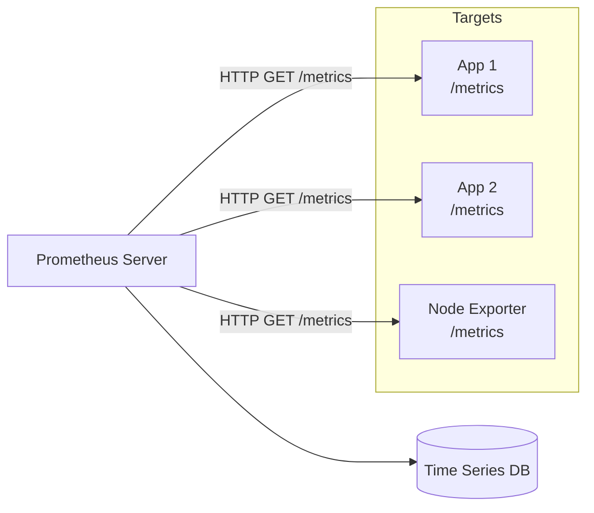
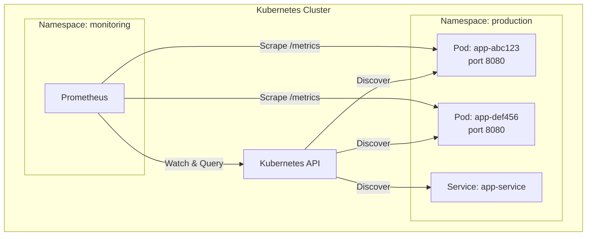
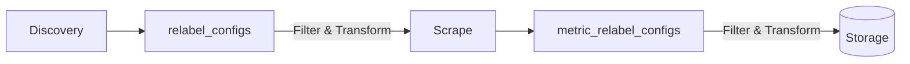
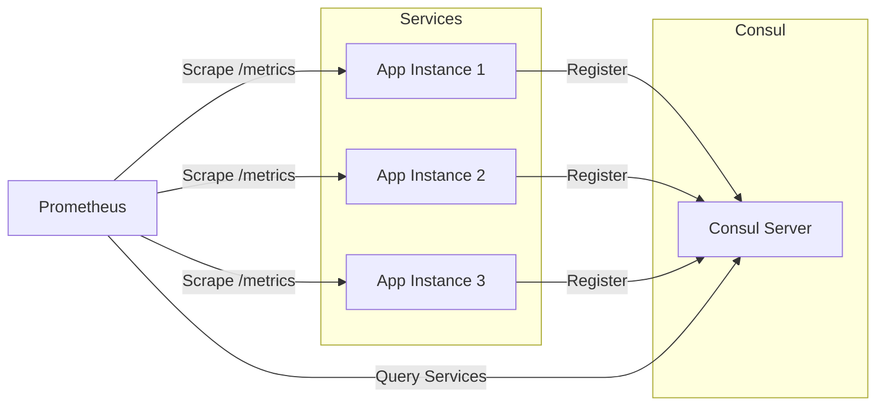

# How to Configure Prometheus Scrape Targets

Author: [nawazdhandala](https://www.github.com/nawazdhandala)

Tags: Prometheus, Monitoring, Observability, DevOps, Kubernetes, Metrics, Service Discovery

Description: A practical guide to configuring Prometheus scrape targets for collecting metrics from your applications and infrastructure. Covers static configuration, service discovery, relabeling, and production best practices.

---

> Prometheus pulls metrics from targets rather than having applications push to it. Understanding how to configure scrape targets effectively determines whether your monitoring covers all critical services or leaves blind spots.

Getting Prometheus to collect metrics from your services requires proper scrape configuration. Whether you're monitoring a handful of servers or thousands of Kubernetes pods, the scrape configuration defines what gets monitored and how. Let's walk through everything from basic static targets to advanced service discovery patterns.

---

## How Prometheus Scraping Works

Before diving into configuration, understanding the pull model helps clarify why certain configurations exist.



Prometheus periodically sends HTTP requests to each target's metrics endpoint. The target responds with current metric values in Prometheus exposition format. Prometheus then stores these values with timestamps in its time series database.

Key concepts:

- **Scrape interval**: How often Prometheus collects metrics from a target
- **Scrape timeout**: Maximum time to wait for a response before marking the scrape as failed
- **Metrics path**: URL path where metrics are exposed (default: /metrics)
- **Target**: A single endpoint that exposes metrics

---

## Basic Static Configuration

For environments with a fixed set of servers, static configuration works well. Define targets explicitly in the configuration file.

The following configuration sets up a basic Prometheus instance that scrapes itself and two application servers:

```yaml
# prometheus.yml - Basic configuration with static targets
global:
  # Default scrape interval applied to all jobs unless overridden
  scrape_interval: 15s
  # How long to wait before timing out a scrape request
  scrape_timeout: 10s
  # How often to evaluate alerting rules
  evaluation_interval: 15s

# Scrape configuration defines what endpoints to collect metrics from
scrape_configs:
  # Each job represents a group of similar targets
  - job_name: 'prometheus'
    # Scrape Prometheus's own metrics for self-monitoring
    static_configs:
      - targets: ['localhost:9090']

  - job_name: 'web-servers'
    # Override global settings for this specific job
    scrape_interval: 10s
    scrape_timeout: 5s
    # Specify a different metrics path if your app uses something other than /metrics
    metrics_path: /metrics
    # Scheme can be http or https
    scheme: http
    static_configs:
      # List of targets to scrape - each entry is host:port
      - targets:
          - 'web1.example.com:8080'
          - 'web2.example.com:8080'
          - 'web3.example.com:8080'
        # Labels added to all metrics from these targets
        labels:
          environment: 'production'
          team: 'platform'
```

---

## Organizing Multiple Services

Real-world deployments involve many different services. Organize them into logical job groups based on their function.

Here's a more comprehensive configuration covering typical infrastructure components:

```yaml
# prometheus.yml - Multi-service configuration
global:
  scrape_interval: 15s
  scrape_timeout: 10s
  evaluation_interval: 15s

scrape_configs:
  # Self-monitoring - always include this
  - job_name: 'prometheus'
    static_configs:
      - targets: ['localhost:9090']

  # Application servers grouped by service
  - job_name: 'api-gateway'
    static_configs:
      - targets:
          - 'api-gw-1.prod.internal:8080'
          - 'api-gw-2.prod.internal:8080'
        labels:
          service: 'api-gateway'
          tier: 'frontend'

  - job_name: 'user-service'
    static_configs:
      - targets:
          - 'user-svc-1.prod.internal:8080'
          - 'user-svc-2.prod.internal:8080'
          - 'user-svc-3.prod.internal:8080'
        labels:
          service: 'user-service'
          tier: 'backend'

  - job_name: 'order-service'
    metrics_path: /actuator/prometheus
    static_configs:
      - targets:
          - 'order-svc-1.prod.internal:8080'
          - 'order-svc-2.prod.internal:8080'
        labels:
          service: 'order-service'
          tier: 'backend'

  # Infrastructure monitoring with node_exporter
  - job_name: 'node'
    static_configs:
      - targets:
          - 'server1.prod.internal:9100'
          - 'server2.prod.internal:9100'
          - 'server3.prod.internal:9100'
          - 'server4.prod.internal:9100'
        labels:
          datacenter: 'us-east-1'

  # Database monitoring with exporters
  - job_name: 'postgres'
    static_configs:
      - targets:
          - 'postgres-exporter-1:9187'
          - 'postgres-exporter-2:9187'
        labels:
          database: 'postgresql'

  - job_name: 'redis'
    static_configs:
      - targets:
          - 'redis-exporter-1:9121'
        labels:
          database: 'redis'
```

---

## File-Based Service Discovery

When targets change frequently, maintaining static configurations becomes tedious. File-based service discovery watches JSON or YAML files for target updates.

Prometheus configuration pointing to target files:

```yaml
# prometheus.yml - File-based service discovery
global:
  scrape_interval: 15s

scrape_configs:
  - job_name: 'applications'
    # File service discovery watches these files for changes
    file_sd_configs:
      # Glob pattern to match target files
      - files:
          - '/etc/prometheus/targets/apps/*.json'
          - '/etc/prometheus/targets/apps/*.yml'
        # How often to re-read the files
        refresh_interval: 30s

  - job_name: 'infrastructure'
    file_sd_configs:
      - files:
          - '/etc/prometheus/targets/infra/*.json'
        refresh_interval: 1m
```

Target files define the endpoints. Prometheus automatically picks up changes without restart.

JSON format for target definitions:

```json
[
  {
    "targets": [
      "app1.example.com:8080",
      "app2.example.com:8080"
    ],
    "labels": {
      "environment": "production",
      "service": "checkout",
      "version": "2.1.0"
    }
  },
  {
    "targets": [
      "app3.example.com:8080"
    ],
    "labels": {
      "environment": "production",
      "service": "inventory",
      "version": "1.5.0"
    }
  }
]
```

YAML format offers the same capabilities with different syntax:

```yaml
# /etc/prometheus/targets/apps/web-services.yml
- targets:
    - 'web1.example.com:8080'
    - 'web2.example.com:8080'
    - 'web3.example.com:8080'
  labels:
    environment: 'production'
    service: 'web-frontend'
    region: 'us-east'

- targets:
    - 'api1.example.com:8080'
    - 'api2.example.com:8080'
  labels:
    environment: 'production'
    service: 'api-backend'
    region: 'us-east'
```

Automation tools like Ansible, Terraform, or custom scripts can update these files when infrastructure changes.

---

## Kubernetes Service Discovery

Kubernetes environments benefit from native service discovery. Prometheus can automatically find pods, services, and endpoints.



### Pod Discovery

Discovering pods directly provides the most granular control. Configure Prometheus to find all pods with specific annotations.

Complete Kubernetes scrape configuration for pod discovery:

```yaml
# prometheus.yml - Kubernetes pod discovery
scrape_configs:
  # Discover pods across all namespaces
  - job_name: 'kubernetes-pods'
    kubernetes_sd_configs:
      # Role determines what Kubernetes resources to discover
      - role: pod
        # Optionally restrict to specific namespaces
        namespaces:
          names:
            - production
            - staging

    # Relabeling filters and transforms discovered targets
    relabel_configs:
      # Only scrape pods with prometheus.io/scrape annotation set to true
      - source_labels: [__meta_kubernetes_pod_annotation_prometheus_io_scrape]
        action: keep
        regex: true

      # Use custom metrics path if specified via annotation
      - source_labels: [__meta_kubernetes_pod_annotation_prometheus_io_path]
        action: replace
        target_label: __metrics_path__
        regex: (.+)

      # Use custom port if specified via annotation
      - source_labels:
          - __address__
          - __meta_kubernetes_pod_annotation_prometheus_io_port
        action: replace
        regex: ([^:]+)(?::\d+)?;(\d+)
        replacement: $1:$2
        target_label: __address__

      # Use HTTPS if specified
      - source_labels: [__meta_kubernetes_pod_annotation_prometheus_io_scheme]
        action: replace
        target_label: __scheme__
        regex: (https?)

      # Add useful labels from Kubernetes metadata
      - source_labels: [__meta_kubernetes_namespace]
        action: replace
        target_label: namespace

      - source_labels: [__meta_kubernetes_pod_name]
        action: replace
        target_label: pod

      - source_labels: [__meta_kubernetes_pod_label_app]
        action: replace
        target_label: app

      - source_labels: [__meta_kubernetes_pod_label_version]
        action: replace
        target_label: version
```

Annotate your pods to enable scraping:

```yaml
# deployment.yaml - Pod with Prometheus annotations
apiVersion: apps/v1
kind: Deployment
metadata:
  name: my-application
spec:
  replicas: 3
  selector:
    matchLabels:
      app: my-application
  template:
    metadata:
      labels:
        app: my-application
        version: v1.2.0
      annotations:
        # Enable Prometheus scraping for this pod
        prometheus.io/scrape: "true"
        # Custom metrics path (default is /metrics)
        prometheus.io/path: "/actuator/prometheus"
        # Port where metrics are exposed
        prometheus.io/port: "8080"
    spec:
      containers:
        - name: app
          image: my-app:1.2.0
          ports:
            - containerPort: 8080
              name: http
            - containerPort: 8081
              name: metrics
```

### Service Discovery

Service-level discovery simplifies configuration when services have stable endpoints.

```yaml
# prometheus.yml - Kubernetes service discovery
scrape_configs:
  - job_name: 'kubernetes-services'
    kubernetes_sd_configs:
      - role: service

    relabel_configs:
      # Only scrape services with the annotation
      - source_labels: [__meta_kubernetes_service_annotation_prometheus_io_scrape]
        action: keep
        regex: true

      # Use the service port specified in annotation
      - source_labels: [__meta_kubernetes_service_annotation_prometheus_io_port]
        action: replace
        target_label: __port__
        regex: (.+)

      # Add service name as label
      - source_labels: [__meta_kubernetes_service_name]
        action: replace
        target_label: service

      - source_labels: [__meta_kubernetes_namespace]
        action: replace
        target_label: namespace
```

### Endpoints Discovery

Endpoints provide a balance between pods and services, discovering the actual backend pods behind services.

```yaml
# prometheus.yml - Kubernetes endpoints discovery
scrape_configs:
  - job_name: 'kubernetes-endpoints'
    kubernetes_sd_configs:
      - role: endpoints

    relabel_configs:
      # Only scrape endpoints from services with the scrape annotation
      - source_labels: [__meta_kubernetes_service_annotation_prometheus_io_scrape]
        action: keep
        regex: true

      # Keep only ready pods
      - source_labels: [__meta_kubernetes_endpoint_ready]
        action: keep
        regex: true

      # Set metrics path from annotation
      - source_labels: [__meta_kubernetes_service_annotation_prometheus_io_path]
        action: replace
        target_label: __metrics_path__
        regex: (.+)

      # Build the address from endpoint and port annotation
      - source_labels:
          - __address__
          - __meta_kubernetes_service_annotation_prometheus_io_port
        action: replace
        regex: ([^:]+)(?::\d+)?;(\d+)
        replacement: $1:$2
        target_label: __address__

      # Add metadata labels
      - source_labels: [__meta_kubernetes_namespace]
        action: replace
        target_label: namespace

      - source_labels: [__meta_kubernetes_service_name]
        action: replace
        target_label: service

      - source_labels: [__meta_kubernetes_pod_name]
        action: replace
        target_label: pod
```

---

## Relabeling Deep Dive

Relabeling transforms discovered targets before scraping. Understanding relabel actions unlocks powerful filtering and organization.



### Common Relabel Actions

The following configuration demonstrates all major relabeling actions:

```yaml
# prometheus.yml - Relabeling examples
scrape_configs:
  - job_name: 'relabel-examples'
    static_configs:
      - targets: ['app.example.com:8080']

    relabel_configs:
      # ACTION: keep - Only keep targets matching the regex
      # Drops all targets that don't match
      - source_labels: [__meta_environment]
        action: keep
        regex: production|staging

      # ACTION: drop - Remove targets matching the regex
      # Opposite of keep
      - source_labels: [__meta_status]
        action: drop
        regex: maintenance

      # ACTION: replace - Replace or create a label value
      # Most common action for transforming labels
      - source_labels: [__meta_kubernetes_pod_name]
        action: replace
        target_label: pod_name
        regex: (.+)
        replacement: $1

      # ACTION: labelmap - Copy labels matching regex with new names
      # Useful for bulk renaming of metadata labels
      - action: labelmap
        regex: __meta_kubernetes_pod_label_(.+)
        replacement: k8s_$1

      # ACTION: labeldrop - Remove labels matching regex
      # Clean up unwanted labels before storage
      - action: labeldrop
        regex: __meta_.+

      # ACTION: labelkeep - Keep only labels matching regex
      # Remove all labels except those matching
      - action: labelkeep
        regex: (job|instance|app|version)

      # ACTION: hashmod - Hash label value for sharding
      # Used for splitting targets across Prometheus instances
      - source_labels: [__address__]
        action: hashmod
        modulus: 3
        target_label: __tmp_hash

      # Keep only targets where hash equals specific value
      - source_labels: [__tmp_hash]
        action: keep
        regex: 0
```

### Combining Multiple Labels

Build complex label values from multiple source labels:

```yaml
relabel_configs:
  # Combine namespace and pod name into a single identifier
  - source_labels:
      - __meta_kubernetes_namespace
      - __meta_kubernetes_pod_name
    separator: '/'
    action: replace
    target_label: namespaced_pod

  # Create environment label from namespace prefix
  - source_labels: [__meta_kubernetes_namespace]
    action: replace
    target_label: environment
    regex: (prod|staging|dev)-.+
    replacement: $1

  # Build full address with custom port
  - source_labels:
      - __meta_kubernetes_pod_ip
      - __meta_kubernetes_pod_annotation_prometheus_io_port
    separator: ':'
    action: replace
    target_label: __address__
```

---

## Authentication and TLS

Production deployments often require authentication. Prometheus supports Basic Auth, Bearer tokens, and TLS client certificates.

### Basic Authentication

```yaml
# prometheus.yml - Basic auth configuration
scrape_configs:
  - job_name: 'authenticated-service'
    static_configs:
      - targets: ['secure-app.example.com:8443']
    scheme: https
    basic_auth:
      username: 'prometheus'
      # Password can be inline or from file
      password_file: '/etc/prometheus/secrets/password'
    tls_config:
      # Skip verification only in development
      insecure_skip_verify: false
      # CA certificate for verifying the server
      ca_file: '/etc/prometheus/certs/ca.crt'
```

### Bearer Token Authentication

```yaml
# prometheus.yml - Bearer token configuration
scrape_configs:
  - job_name: 'token-auth-service'
    static_configs:
      - targets: ['api.example.com:443']
    scheme: https
    authorization:
      type: Bearer
      credentials_file: '/etc/prometheus/secrets/token'
    tls_config:
      ca_file: '/etc/prometheus/certs/ca.crt'
```

### Mutual TLS (mTLS)

```yaml
# prometheus.yml - mTLS configuration
scrape_configs:
  - job_name: 'mtls-service'
    static_configs:
      - targets: ['secure-service.example.com:8443']
    scheme: https
    tls_config:
      # CA certificate to verify server
      ca_file: '/etc/prometheus/certs/ca.crt'
      # Client certificate for authentication
      cert_file: '/etc/prometheus/certs/client.crt'
      # Client private key
      key_file: '/etc/prometheus/certs/client.key'
      # Server name for verification (optional)
      server_name: 'secure-service.example.com'
```

---

## Consul Service Discovery

Consul provides dynamic service discovery for non-Kubernetes environments. Prometheus integrates natively with Consul's catalog.



Prometheus configuration for Consul discovery:

```yaml
# prometheus.yml - Consul service discovery
scrape_configs:
  - job_name: 'consul-services'
    consul_sd_configs:
      - server: 'consul.example.com:8500'
        # Optionally filter by datacenter
        datacenter: 'dc1'
        # Filter by service tags
        tags:
          - 'prometheus'
          - 'production'
        # Only discover healthy services
        allow_stale: false
        # Refresh service list interval
        refresh_interval: 30s

    relabel_configs:
      # Use Consul service name as job label
      - source_labels: [__meta_consul_service]
        action: replace
        target_label: job

      # Add datacenter label
      - source_labels: [__meta_consul_dc]
        action: replace
        target_label: datacenter

      # Add Consul tags as labels
      - source_labels: [__meta_consul_tags]
        action: replace
        target_label: tags
        regex: ',?([^,]+),?'
        replacement: $1

      # Use service metadata for metrics path
      - source_labels: [__meta_consul_service_metadata_metrics_path]
        action: replace
        target_label: __metrics_path__
        regex: (.+)
```

Register services in Consul with appropriate metadata:

```json
{
  "Name": "web-api",
  "ID": "web-api-1",
  "Address": "10.0.1.100",
  "Port": 8080,
  "Tags": ["prometheus", "production", "v2"],
  "Meta": {
    "metrics_path": "/metrics",
    "version": "2.1.0"
  },
  "Check": {
    "HTTP": "http://10.0.1.100:8080/health",
    "Interval": "10s"
  }
}
```

---

## EC2 Service Discovery

AWS EC2 instances can be discovered automatically based on tags and filters.

```yaml
# prometheus.yml - EC2 service discovery
scrape_configs:
  - job_name: 'ec2-instances'
    ec2_sd_configs:
      - region: 'us-east-1'
        # AWS credentials (or use IAM role)
        access_key: '${AWS_ACCESS_KEY_ID}'
        secret_key: '${AWS_SECRET_ACCESS_KEY}'
        # Refresh instance list every 60 seconds
        refresh_interval: 60s
        # Filter instances by tag
        filters:
          - name: 'tag:Environment'
            values: ['production']
          - name: 'tag:Monitor'
            values: ['true']
          - name: 'instance-state-name'
            values: ['running']
        # Port to scrape (node_exporter default)
        port: 9100

    relabel_configs:
      # Use private IP for scraping within VPC
      - source_labels: [__meta_ec2_private_ip]
        action: replace
        target_label: __address__
        regex: (.+)
        replacement: $1:9100

      # Add instance ID as label
      - source_labels: [__meta_ec2_instance_id]
        action: replace
        target_label: instance_id

      # Map EC2 tags to labels
      - source_labels: [__meta_ec2_tag_Name]
        action: replace
        target_label: instance_name

      - source_labels: [__meta_ec2_tag_Environment]
        action: replace
        target_label: environment

      - source_labels: [__meta_ec2_tag_Service]
        action: replace
        target_label: service

      - source_labels: [__meta_ec2_availability_zone]
        action: replace
        target_label: availability_zone
```

---

## DNS Service Discovery

DNS-based discovery works well for services registered in DNS SRV records.

```yaml
# prometheus.yml - DNS service discovery
scrape_configs:
  - job_name: 'dns-services'
    dns_sd_configs:
      # SRV record discovery
      - names:
          - '_prometheus._tcp.services.example.com'
        type: SRV
        refresh_interval: 30s

  - job_name: 'dns-a-records'
    dns_sd_configs:
      # A record discovery (requires port specification)
      - names:
          - 'web-servers.example.com'
        type: A
        port: 8080
        refresh_interval: 30s
```

---

## Metric Relabeling

After scraping, you can filter or modify metrics before storage using metric_relabel_configs.

```yaml
# prometheus.yml - Metric relabeling
scrape_configs:
  - job_name: 'application'
    static_configs:
      - targets: ['app.example.com:8080']

    metric_relabel_configs:
      # Drop high-cardinality metrics that consume too much storage
      - source_labels: [__name__]
        action: drop
        regex: 'http_request_duration_bucket'

      # Drop metrics with specific label values
      - source_labels: [path]
        action: drop
        regex: '/health|/ready|/metrics'

      # Rename a metric
      - source_labels: [__name__]
        action: replace
        target_label: __name__
        regex: 'old_metric_name'
        replacement: 'new_metric_name'

      # Remove an unwanted label from all metrics
      - action: labeldrop
        regex: 'internal_.*'

      # Keep only specific metrics (allowlist approach)
      - source_labels: [__name__]
        action: keep
        regex: 'http_.*|process_.*|go_.*'
```

---

## Scraping Best Practices

### 1. Set Appropriate Intervals

Balance between data granularity and resource usage:

```yaml
scrape_configs:
  # Critical services - shorter interval
  - job_name: 'payment-service'
    scrape_interval: 10s
    scrape_timeout: 5s
    static_configs:
      - targets: ['payment.example.com:8080']

  # Infrastructure - standard interval
  - job_name: 'node'
    scrape_interval: 15s
    scrape_timeout: 10s
    static_configs:
      - targets: ['node1:9100', 'node2:9100']

  # Batch jobs - longer interval acceptable
  - job_name: 'batch-workers'
    scrape_interval: 60s
    scrape_timeout: 30s
    static_configs:
      - targets: ['batch1:8080']
```

### 2. Use Labels Strategically

Add meaningful labels without creating high cardinality:

```yaml
relabel_configs:
  # Good: bounded labels for grouping
  - source_labels: [__meta_kubernetes_namespace]
    target_label: namespace
  - source_labels: [__meta_kubernetes_pod_label_app]
    target_label: app

  # Avoid: high cardinality labels
  # - source_labels: [__meta_kubernetes_pod_uid]  # Too many unique values
  #   target_label: pod_uid
```

### 3. Handle Target Health

Monitor scrape health to detect collection issues:

```yaml
# Prometheus provides these metrics automatically:
# up{job="...", instance="..."} - 1 if scrape succeeded, 0 if failed
# scrape_duration_seconds - how long the scrape took
# scrape_samples_scraped - number of samples collected

# Alert on scrape failures
groups:
  - name: scrape-health
    rules:
      - alert: TargetDown
        expr: up == 0
        for: 5m
        labels:
          severity: critical
        annotations:
          summary: "Target {{ $labels.instance }} is down"
```

### 4. Limit Scrape Samples

Protect Prometheus from targets exposing too many metrics:

```yaml
scrape_configs:
  - job_name: 'limited-scrape'
    static_configs:
      - targets: ['app.example.com:8080']
    # Limit samples per scrape (requires Prometheus 2.0+)
    sample_limit: 10000
    # Limit label name length
    label_limit: 100
    # Limit label value length
    label_value_length_limit: 2048
```

---

## Complete Production Configuration

Here's a comprehensive configuration combining multiple discovery methods:

```yaml
# prometheus.yml - Production configuration
global:
  scrape_interval: 15s
  scrape_timeout: 10s
  evaluation_interval: 15s
  # External labels added to all metrics (for federation)
  external_labels:
    cluster: 'production-us-east'
    environment: 'production'

# Alertmanager configuration
alerting:
  alertmanagers:
    - static_configs:
        - targets: ['alertmanager:9093']

# Rule files for recording and alerting rules
rule_files:
  - '/etc/prometheus/rules/*.yml'

scrape_configs:
  # Self-monitoring
  - job_name: 'prometheus'
    static_configs:
      - targets: ['localhost:9090']

  # Kubernetes pods with annotations
  - job_name: 'kubernetes-pods'
    kubernetes_sd_configs:
      - role: pod
    relabel_configs:
      - source_labels: [__meta_kubernetes_pod_annotation_prometheus_io_scrape]
        action: keep
        regex: true
      - source_labels: [__meta_kubernetes_pod_annotation_prometheus_io_path]
        action: replace
        target_label: __metrics_path__
        regex: (.+)
      - source_labels:
          - __address__
          - __meta_kubernetes_pod_annotation_prometheus_io_port
        action: replace
        regex: ([^:]+)(?::\d+)?;(\d+)
        replacement: $1:$2
        target_label: __address__
      - source_labels: [__meta_kubernetes_namespace]
        action: replace
        target_label: namespace
      - source_labels: [__meta_kubernetes_pod_name]
        action: replace
        target_label: pod
      - source_labels: [__meta_kubernetes_pod_label_app]
        action: replace
        target_label: app

  # Kubernetes API servers
  - job_name: 'kubernetes-apiservers'
    kubernetes_sd_configs:
      - role: endpoints
    scheme: https
    tls_config:
      ca_file: /var/run/secrets/kubernetes.io/serviceaccount/ca.crt
    bearer_token_file: /var/run/secrets/kubernetes.io/serviceaccount/token
    relabel_configs:
      - source_labels:
          - __meta_kubernetes_namespace
          - __meta_kubernetes_service_name
          - __meta_kubernetes_endpoint_port_name
        action: keep
        regex: default;kubernetes;https

  # Node exporters
  - job_name: 'node-exporter'
    kubernetes_sd_configs:
      - role: node
    relabel_configs:
      - source_labels: [__address__]
        regex: '(.+):10250'
        replacement: '$1:9100'
        target_label: __address__
      - source_labels: [__meta_kubernetes_node_name]
        target_label: node

  # External services via file discovery
  - job_name: 'external-services'
    file_sd_configs:
      - files:
          - '/etc/prometheus/targets/external/*.yml'
        refresh_interval: 5m

  # Consul services
  - job_name: 'consul-services'
    consul_sd_configs:
      - server: 'consul.service.consul:8500'
        tags: ['prometheus']
    relabel_configs:
      - source_labels: [__meta_consul_service]
        target_label: service
      - source_labels: [__meta_consul_dc]
        target_label: datacenter
```

---

## Troubleshooting Scrape Issues

### Verify Target Discovery

Check Prometheus UI for discovered targets at http://prometheus:9090/targets. Common issues include:

1. **Target shows as DOWN**: Check network connectivity and firewall rules
2. **Target not discovered**: Verify annotations/labels match your relabel rules
3. **Wrong port or path**: Check relabeling configuration

### Debug with Prometheus API

Query the Prometheus API for target information:

```bash
# List all active targets
curl -s http://localhost:9090/api/v1/targets | jq '.data.activeTargets[] | {instance: .scrapeUrl, health: .health}'

# Check specific job
curl -s http://localhost:9090/api/v1/targets | jq '.data.activeTargets[] | select(.labels.job=="my-service")'

# View dropped targets (filtered out by relabeling)
curl -s http://localhost:9090/api/v1/targets | jq '.data.droppedTargets'
```

### Test Scraping Manually

Verify a target exposes metrics correctly:

```bash
# Basic curl test
curl -s http://target:8080/metrics | head -20

# With authentication
curl -s -u prometheus:password https://target:8443/metrics

# Check response time
time curl -s http://target:8080/metrics > /dev/null
```

---

## Conclusion

Configuring Prometheus scrape targets effectively requires understanding your infrastructure and choosing the right discovery method:

- **Static configs** work for small, stable environments
- **File-based discovery** suits environments with automation tooling
- **Kubernetes SD** provides seamless container monitoring
- **Consul/EC2/DNS SD** handle dynamic cloud and datacenter infrastructure

Key takeaways:

1. Always monitor scrape health with the `up` metric
2. Use relabeling to create meaningful, low-cardinality labels
3. Set appropriate scrape intervals based on metric criticality
4. Protect Prometheus with sample limits on untrusted targets

Getting scrape configuration right ensures comprehensive coverage of your infrastructure without overwhelming your monitoring system.

---

*Need complete observability beyond just metrics? [OneUptime](https://oneuptime.com) provides integrated monitoring with Prometheus compatibility, combining metrics, logs, traces, and alerting in a single platform.*

**Related Reading:**
- [How to Add Custom Metrics to Python Applications with Prometheus](https://oneuptime.com/blog/post/2025-01-06-python-custom-metrics-prometheus/view)
- [What are Metrics in OpenTelemetry](https://oneuptime.com/blog/post/2025-08-26-what-are-metrics-in-opentelemetry/view)
- [P50 vs P95 vs P99 Latency Percentiles](https://oneuptime.com/blog/post/2025-09-15-p50-vs-p95-vs-p99-latency-percentiles/view)
