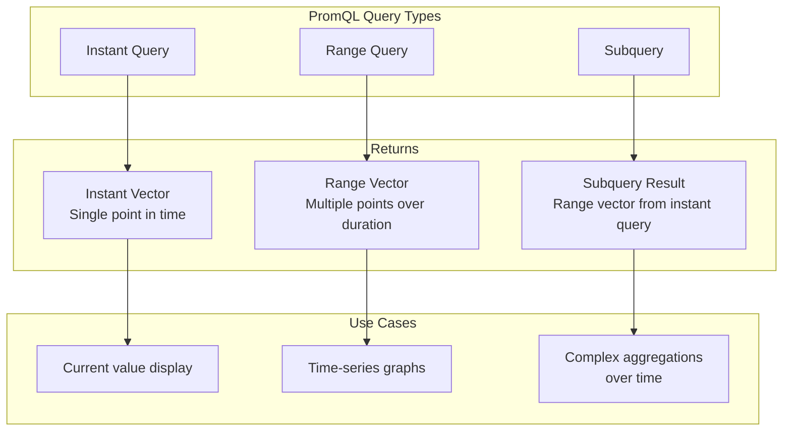
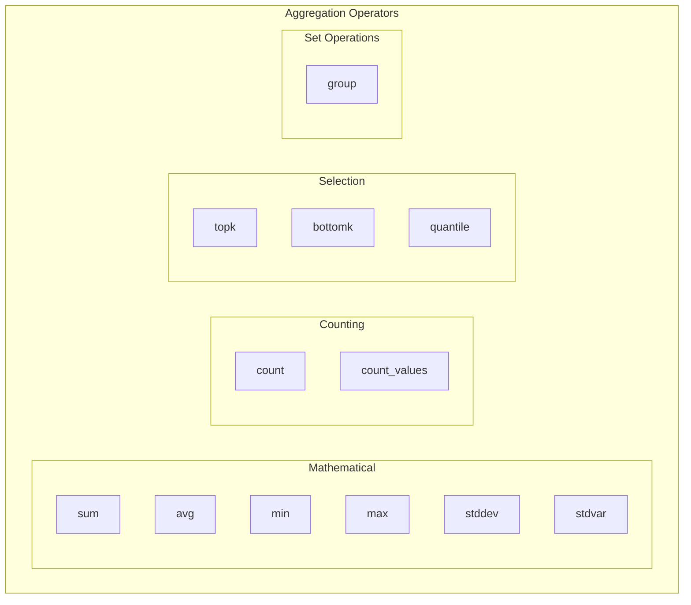
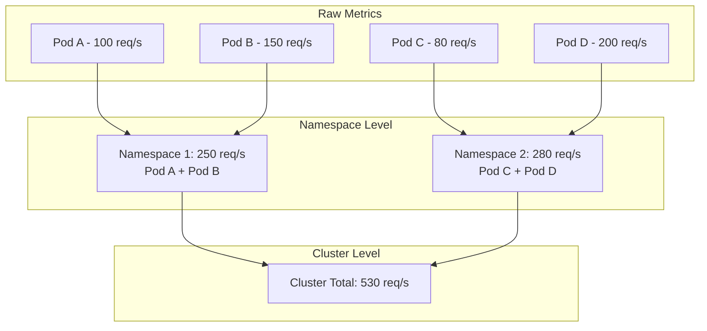
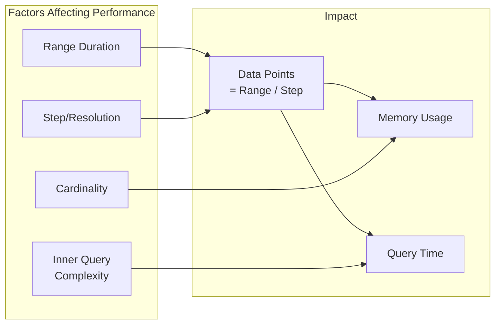

# How to Implement PromQL Subqueries and Aggregations

Author: [nawazdhandala](https://www.github.com/nawazdhandala)

Tags: PromQL, Prometheus, Monitoring, Observability, Metrics, Time Series, Aggregations

Description: A comprehensive guide to mastering PromQL subqueries and aggregation operators. Learn how to write complex queries for analyzing metrics over time, combining multiple data sources, and building powerful monitoring dashboards.

---

PromQL (Prometheus Query Language) becomes truly powerful when you combine subqueries with aggregation operators. While basic queries can fetch current metric values, subqueries let you analyze metric behavior over time windows, and aggregations help you summarize data across multiple dimensions.

## Understanding PromQL Query Types

Before diving into subqueries and aggregations, understanding the different query types in PromQL helps clarify when to use each approach.



### Instant Vectors vs Range Vectors

An instant vector contains a single sample value for each time series at a specific point in time. A range vector contains multiple samples for each time series over a specified time range.

The following example demonstrates the difference between fetching the current CPU usage and fetching CPU usage over the last 5 minutes.

```promql
# Instant vector - current value of http_requests_total
http_requests_total

# Range vector - values over the last 5 minutes
http_requests_total[5m]
```

## Introduction to Subqueries

Subqueries allow you to run an instant query over a range of time and produce a range vector. A subquery is the key feature for analyzing how metrics change over time and for applying functions that require historical data.

### Subquery Syntax

The subquery syntax follows a specific pattern that wraps an instant query and specifies the evaluation range and resolution.

```promql
# Basic subquery syntax:
# <instant_query>[<range>:<resolution>]

# Example: evaluate the rate of HTTP requests over 1 hour, sampling every 1 minute
rate(http_requests_total[5m])[1h:1m]
```

The components break down as follows:
- `<instant_query>` - any expression that returns an instant vector
- `<range>` - how far back in time to look (e.g., 1h, 30m, 2d)
- `<resolution>` - the step interval between evaluations (optional, defaults to global evaluation interval)

### Why Use Subqueries?

Subqueries solve several common monitoring challenges that regular queries cannot address.

```mermaid
flowchart LR
    subgraph "Problem"
        P1[Need max of an avg<br/>over time]
        P2[Aggregating rates<br/>over longer periods]
        P3[Finding trends in<br/>derived metrics]
    end

    subgraph "Solution: Subqueries"
        S1[max_over_time<br/>avg...[1h:5m]]
        S2[avg_over_time<br/>rate...[1d:5m]]
        S3[deriv<br/>metric[1h:1m]]
    end

    P1 --> S1
    P2 --> S2
    P3 --> S3
```

## Practical Subquery Examples

Let's explore real-world scenarios where subqueries shine.

### Analyzing Peak CPU Usage

To find the maximum average CPU usage over the past day, you need to first calculate the average at each point, then find the maximum. The subquery makes this possible by sampling the average calculation repeatedly.

```promql
# Find the peak 5-minute average CPU usage over the last 24 hours
# Step 1: avg calculates mean CPU across all cores at each sample
# Step 2: the subquery [24h:5m] evaluates this every 5 minutes for 24 hours
# Step 3: max_over_time finds the highest value from all samples

max_over_time(
  avg by (instance) (
    rate(node_cpu_seconds_total{mode!="idle"}[5m])
  )[24h:5m]
)
```

### Detecting Sustained High Error Rates

Instead of alerting on momentary spikes, you might want to alert only when error rates stay elevated. Subqueries enable analyzing the persistence of conditions over time.

```promql
# Check if error rate exceeded 5% for at least 80% of the last hour
# The subquery samples the error rate boolean every minute
# avg_over_time calculates what percentage of samples were true (1)

avg_over_time(
  (
    sum(rate(http_requests_total{status=~"5.."}[5m]))
    /
    sum(rate(http_requests_total[5m]))
    > 0.05
  )[1h:1m]
) > 0.8
```

### Smoothing Noisy Metrics

Network metrics often fluctuate rapidly. Subqueries help smooth out noise by averaging values over longer windows while preserving trend information.

```promql
# Smooth network bandwidth by averaging 5-minute rates over 30 minutes
# The inner rate calculates current throughput
# The subquery samples this rate every minute for 30 minutes
# avg_over_time produces a smoother trend line

avg_over_time(
  rate(node_network_receive_bytes_total[5m])[30m:1m]
)
```

## Aggregation Operators Deep Dive

PromQL provides powerful aggregation operators that work across label dimensions. Understanding these operators is essential for building meaningful dashboards and alerts.



### Basic Aggregation Syntax

Aggregations reduce multiple time series into fewer series by combining values. The by clause specifies which labels to preserve, while without specifies labels to remove.

```promql
# Sum all HTTP requests, keeping only the 'method' label
# All other labels are aggregated away

sum by (method) (http_requests_total)

# Equivalent using 'without' - remove specific labels instead
# Removes instance and job, keeps everything else

sum without (instance, job) (http_requests_total)
```

### Mathematical Aggregations

Mathematical aggregators compute statistics across all matching series.

The sum operator adds up all values, useful for calculating totals across instances or services.

```promql
# Total memory usage across all nodes in a cluster
# Each node reports its own memory metric
# sum combines them into a single cluster-wide value

sum(node_memory_MemTotal_bytes - node_memory_MemAvailable_bytes)
```

The avg operator calculates the mean, ideal for understanding typical behavior.

```promql
# Average request latency across all instances
# Divides the sum of all latencies by the number of instances
# Grouped by endpoint to see which APIs are slowest

avg by (endpoint) (http_request_duration_seconds)
```

Standard deviation helps identify metrics with high variability, which often indicates problems.

```promql
# Find services with inconsistent response times
# High stddev suggests unreliable performance
# Low stddev indicates stable, predictable behavior

stddev by (service) (
  rate(http_request_duration_seconds_sum[5m])
  /
  rate(http_request_duration_seconds_count[5m])
)
```

### Selection Aggregations

Selection operators help identify outliers and percentiles.

The topk operator returns the highest values, excellent for identifying problem areas.

```promql
# Find the 5 pods consuming the most CPU
# Useful for identifying resource-hungry workloads
# The result preserves all labels for the top 5 series

topk(5,
  sum by (pod, namespace) (
    rate(container_cpu_usage_seconds_total[5m])
  )
)
```

The quantile operator calculates percentiles, critical for understanding latency distributions.

```promql
# Calculate the 95th percentile of request latency
# 95% of requests complete faster than this value
# Better than average for understanding user experience

quantile(0.95,
  histogram_quantile(0.95,
    sum by (le) (
      rate(http_request_duration_seconds_bucket[5m])
    )
  )
)
```

## Combining Subqueries and Aggregations

The real power emerges when combining subqueries with aggregation operators.

### Finding Maximum Cluster Load

Determining peak cluster load requires aggregating across instances first, then finding the maximum over time.

```promql
# Maximum total cluster CPU usage over the past week
# First: rate calculates per-core usage at each point
# Second: sum aggregates across all cores and nodes
# Third: subquery samples this sum every 5 minutes for 7 days
# Fourth: max_over_time finds the peak value

max_over_time(
  sum(
    rate(node_cpu_seconds_total{mode!="idle"}[5m])
  )[7d:5m]
)
```

### Calculating Daily Averages

SLO calculations often require daily statistics. Subqueries make computing these straightforward.

```promql
# Daily average error rate for each service
# The error ratio is calculated per 5-minute window
# The subquery collects 24 hours of these ratios
# avg_over_time produces the daily average

avg_over_time(
  (
    sum by (service) (rate(http_errors_total[5m]))
    /
    sum by (service) (rate(http_requests_total[5m]))
  )[24h:5m]
)
```

### Trend Detection with Derivatives

Detecting whether metrics are trending up or down uses the deriv function with subqueries.

```promql
# Calculate the rate of change in memory usage
# Positive values indicate memory growing over time
# Negative values show memory being freed
# The subquery provides hourly samples for the derivative calculation

deriv(
  avg by (instance) (
    node_memory_MemTotal_bytes - node_memory_MemAvailable_bytes
  )[6h:1m]
)
```

## Advanced Aggregation Patterns

Complex monitoring scenarios require combining multiple aggregation techniques.

### Hierarchical Aggregations

Sometimes you need to aggregate at multiple levels, such as per-pod, then per-namespace, then cluster-wide.



The following query demonstrates hierarchical aggregation by preserving different label levels.

```promql
# First level: sum requests by pod within each namespace
# Second level: use the result with different grouping

# Namespace-level totals
sum by (namespace) (
  sum by (namespace, pod) (
    rate(http_requests_total[5m])
  )
)

# Alternative approach using label_replace for hierarchical views
sum by (namespace, tier) (
  label_replace(
    rate(http_requests_total[5m]),
    "tier", "$1", "pod", "(.*)-[0-9]+"
  )
)
```

### Group Aggregation for Existence Checks

The group aggregator creates a series of 1s for existing label combinations, useful for counting unique entities.

```promql
# Count unique services across all namespaces
# group creates a series with value 1 for each unique service
# count then counts how many such series exist

count(
  group by (service) (
    http_requests_total
  )
)
```

### Aggregating Across Multiple Metrics

Sometimes you need to combine aggregations from different metric names.

```promql
# Calculate memory utilization percentage per node
# Aggregates both total and available memory
# Both metrics must have matching labels for the division to work

sum by (instance) (node_memory_MemTotal_bytes - node_memory_MemAvailable_bytes)
/
sum by (instance) (node_memory_MemTotal_bytes)
* 100
```

## Subquery Performance Considerations

Subqueries can be expensive, so understanding performance implications helps write efficient queries.



### Choosing Appropriate Resolution

Larger step intervals reduce the number of data points calculated, improving performance.

```promql
# High resolution - may be slow for dashboards
# Calculates 8,640 data points (30 days * 24 hours * 60 minutes / 5 minutes)
rate(http_requests_total[5m])[30d:5m]

# Lower resolution - faster, still useful for trends
# Calculates 720 data points (30 days * 24 hours)
rate(http_requests_total[5m])[30d:1h]

# Very low resolution - best for long-term trend views
# Calculates 30 data points (one per day)
rate(http_requests_total[5m])[30d:1d]
```

### Avoiding Excessive Cardinality

High-cardinality labels multiplied by subquery duration can explode resource usage.

```promql
# BAD: High cardinality with long subquery
# If you have 10,000 unique request_id values, this creates millions of data points
max_over_time(
  http_request_duration_seconds{request_id=~".+"}[7d:1m]
)

# BETTER: Aggregate first to reduce cardinality
# Reduces to one series per endpoint before running the expensive subquery
max_over_time(
  avg by (endpoint) (
    http_request_duration_seconds
  )[7d:5m]
)
```

## Recording Rules for Common Aggregations

Recording rules pre-compute aggregations, making dashboards load faster and reducing query load.

The following recording rules configuration demonstrates how to precompute commonly used aggregations.

```yaml
# recording-rules.yaml
# Pre-compute expensive aggregations to improve dashboard performance

groups:
  - name: aggregation_rules
    interval: 1m
    rules:
      # Pre-compute cluster-wide request rate by service
      # Dashboards can query this directly instead of recalculating
      - record: service:http_requests:rate5m
        expr: |
          sum by (service) (
            rate(http_requests_total[5m])
          )

      # Pre-compute error ratios for SLO dashboards
      # Avoids repeated calculation of the same division
      - record: service:http_errors:ratio5m
        expr: |
          sum by (service) (rate(http_errors_total[5m]))
          /
          sum by (service) (rate(http_requests_total[5m]))

      # Pre-compute 95th percentile latency
      # Histogram calculations are expensive, so pre-computing helps
      - record: service:http_request_duration:p95_5m
        expr: |
          histogram_quantile(0.95,
            sum by (service, le) (
              rate(http_request_duration_seconds_bucket[5m])
            )
          )

      # Pre-compute daily aggregations using subqueries
      # Useful for SLO calculations that need 24-hour windows
      - record: service:http_requests:avg_rate_1d
        expr: |
          avg_over_time(
            sum by (service) (
              rate(http_requests_total[5m])
            )[1d:5m]
          )
```

### Using Recording Rules with Subqueries

Recording rules can include subqueries for complex pre-computations.

```yaml
# advanced-recording-rules.yaml
# Recording rules with subqueries for SLO and capacity planning

groups:
  - name: slo_rules
    interval: 5m
    rules:
      # Track the percentage of time services meet their latency SLO
      # A value of 0.99 means the service met its SLO 99% of the time
      - record: service:slo_latency:compliance_1h
        expr: |
          avg_over_time(
            (
              histogram_quantile(0.95,
                sum by (service, le) (
                  rate(http_request_duration_seconds_bucket[5m])
                )
              ) < 0.5
            )[1h:1m]
          )

      # Track peak resource utilization for capacity planning
      # Shows the highest CPU usage in the past week
      - record: instance:cpu:max_usage_7d
        expr: |
          max_over_time(
            avg by (instance) (
              rate(node_cpu_seconds_total{mode!="idle"}[5m])
            )[7d:1h]
          )
```

## Building Alert Rules with Subqueries

Subqueries enable sophisticated alerting conditions that look at metric behavior over time.

```yaml
# alert-rules.yaml
# Alert rules using subqueries for smarter alerting

groups:
  - name: smart_alerts
    rules:
      # Alert only if error rate is consistently high
      # Prevents alerting on brief spikes that auto-recover
      # The subquery checks the error rate every minute for an hour
      - alert: SustainedHighErrorRate
        expr: |
          avg_over_time(
            (
              sum by (service) (rate(http_errors_total[5m]))
              /
              sum by (service) (rate(http_requests_total[5m]))
            )[1h:1m]
          ) > 0.01
        for: 5m
        labels:
          severity: critical
        annotations:
          summary: "Service {{ $labels.service }} has sustained error rate above 1%"
          description: "Average error rate over the past hour is {{ $value | humanizePercentage }}"

      # Alert when memory usage trend predicts exhaustion
      # Uses derivative to detect growing memory usage
      - alert: MemoryExhaustionPredicted
        expr: |
          predict_linear(
            avg by (instance) (
              node_memory_MemAvailable_bytes
            )[6h:5m], 24 * 3600
          ) < 0
        for: 30m
        labels:
          severity: warning
        annotations:
          summary: "Instance {{ $labels.instance }} predicted to run out of memory"
          description: "Based on current trends, memory will be exhausted within 24 hours"

      # Alert when latency is degrading over time
      # Compares recent latency to baseline from 24 hours ago
      - alert: LatencyDegradation
        expr: |
          (
            avg_over_time(
              histogram_quantile(0.95,
                sum by (service, le) (
                  rate(http_request_duration_seconds_bucket[5m])
                )
              )[30m:5m]
            )
            /
            avg_over_time(
              histogram_quantile(0.95,
                sum by (service, le) (
                  rate(http_request_duration_seconds_bucket[5m])
                )
              )[30m:5m] offset 24h
            )
          ) > 2
        for: 15m
        labels:
          severity: warning
        annotations:
          summary: "Service {{ $labels.service }} latency has doubled compared to yesterday"
```

## Common Aggregation Patterns

Here are patterns frequently used in production monitoring.

### Request Rate by Response Code Class

Grouping HTTP status codes into classes (2xx, 4xx, 5xx) provides cleaner dashboards.

```promql
# Group HTTP requests by status code class
# Uses label_replace to create a new label from the first digit
# Then aggregates by this new class label

sum by (class) (
  label_replace(
    rate(http_requests_total[5m]),
    "class", "${1}xx", "status", "([0-9]).."
  )
)
```

### Percentage of Total

Calculating what percentage each component contributes to a total helps identify dominant consumers.

```promql
# Calculate each service's percentage of total traffic
# The denominator sums all services
# The numerator keeps individual service values
# Division produces the percentage for each service

sum by (service) (rate(http_requests_total[5m]))
/
ignoring(service) group_left()
sum(rate(http_requests_total[5m]))
* 100
```

### Rolling Window Statistics

Rolling statistics smooth out fluctuations while preserving trends.

```promql
# 1-hour rolling average of 5-minute request rates
# Provides a smoother line than raw rates
# Useful for identifying true trends vs momentary spikes

avg_over_time(
  sum by (service) (
    rate(http_requests_total[5m])
  )[1h:1m]
)

# 1-hour rolling maximum shows peak load during the window
max_over_time(
  sum by (service) (
    rate(http_requests_total[5m])
  )[1h:1m]
)
```

### Comparing to Historical Baseline

Detecting anomalies by comparing current values to historical baselines uses the offset modifier with subqueries.

```promql
# Compare current hourly average to same time last week
# Positive percentage means traffic is higher than last week
# Useful for detecting unexpected changes in patterns

(
  avg_over_time(
    sum by (service) (
      rate(http_requests_total[5m])
    )[1h:5m]
  )
  -
  avg_over_time(
    sum by (service) (
      rate(http_requests_total[5m])
    )[1h:5m] offset 7d
  )
)
/
avg_over_time(
  sum by (service) (
    rate(http_requests_total[5m])
  )[1h:5m] offset 7d
) * 100
```

## Debugging Subqueries and Aggregations

When queries produce unexpected results, systematic debugging helps identify the issue.

### Breaking Down Complex Queries

Test each component of a complex query separately before combining them.

```promql
# Original complex query
max_over_time(
  avg by (service) (
    rate(http_request_duration_seconds_sum[5m])
    /
    rate(http_request_duration_seconds_count[5m])
  )[1h:1m]
)

# Debug step 1: verify the rate calculations work
rate(http_request_duration_seconds_sum[5m])
rate(http_request_duration_seconds_count[5m])

# Debug step 2: verify the division produces valid results
rate(http_request_duration_seconds_sum[5m])
/
rate(http_request_duration_seconds_count[5m])

# Debug step 3: verify the aggregation works
avg by (service) (
  rate(http_request_duration_seconds_sum[5m])
  /
  rate(http_request_duration_seconds_count[5m])
)

# Debug step 4: verify the subquery produces expected data points
avg by (service) (
  rate(http_request_duration_seconds_sum[5m])
  /
  rate(http_request_duration_seconds_count[5m])
)[1h:1m]

# Debug step 5: final aggregation
# If previous steps work, the full query should work
```

### Checking Cardinality

High cardinality causes slow queries and memory issues.

```promql
# Count the number of series that will be processed
count(http_requests_total)

# Count series per label to find high-cardinality labels
count by (service) (http_requests_total)
count by (endpoint) (http_requests_total)
count by (instance) (http_requests_total)

# If a label has too many values, aggregate it away before using subqueries
```

---

Mastering PromQL subqueries and aggregations opens up powerful monitoring capabilities. Start with simple aggregations to understand how data flows through your queries, then gradually add subqueries for time-based analysis. Recording rules help offload expensive computations, and well-designed alerts catch issues before they impact users. Practice these patterns with your own metrics to build intuition for when each technique applies best.
