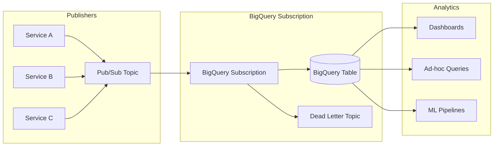
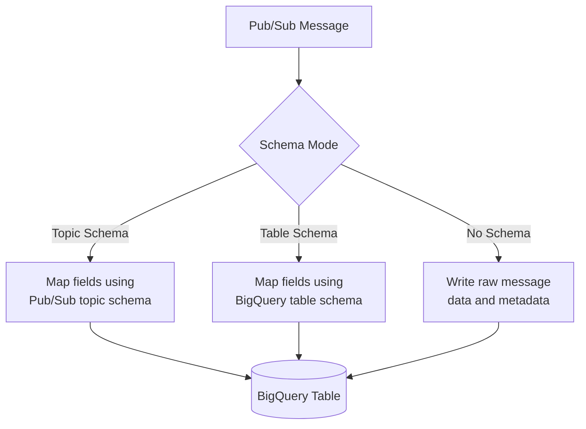
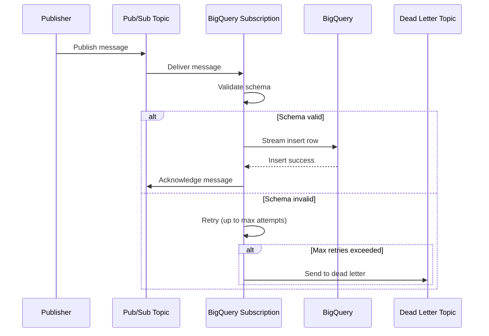
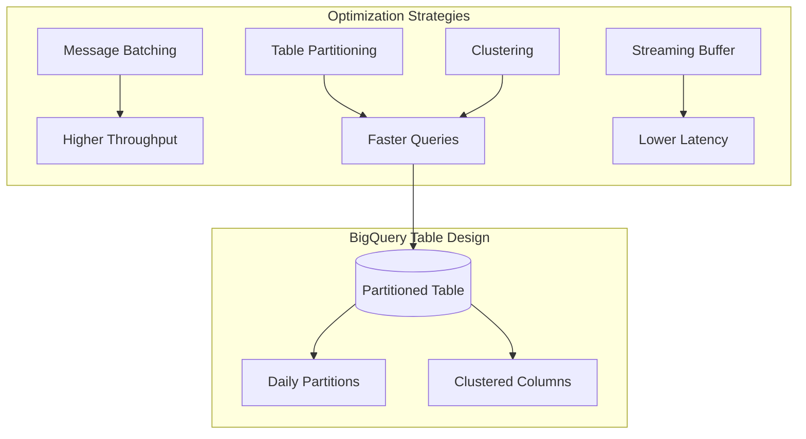

# How to Implement Pub/Sub BigQuery Subscriptions

Author: [nawazdhandala](https://www.github.com/nawazdhandala)

Tags: Google Cloud, Pub/Sub, BigQuery, Data Pipeline, Streaming, Event-Driven Architecture, Analytics

Description: Learn how to implement Google Cloud Pub/Sub BigQuery subscriptions for seamless real-time data streaming. Covers setup, schema configuration, dead-letter topics, monitoring, and production best practices.

---

> Streaming data directly from Pub/Sub to BigQuery eliminates the need for intermediate processing services, reducing complexity and operational overhead while enabling real-time analytics on your event data.

Google Cloud Pub/Sub BigQuery subscriptions provide a native integration that automatically writes messages to BigQuery tables without requiring any custom code or infrastructure. You can analyze streaming data within seconds of it being published, making it ideal for real-time dashboards, event analytics, and audit logging.

---

## Architecture Overview

BigQuery subscriptions create a direct pipeline from Pub/Sub topics to BigQuery tables. Messages flow through automatically, with built-in support for schema mapping, dead-letter handling, and exactly-once delivery semantics.



---

## Prerequisites

Before creating a BigQuery subscription, you need to set up the required infrastructure and permissions.

Enable the necessary APIs in your Google Cloud project using the gcloud CLI:

```bash
# Enable Pub/Sub and BigQuery APIs
gcloud services enable pubsub.googleapis.com
gcloud services enable bigquery.googleapis.com

# Verify the APIs are enabled
gcloud services list --enabled --filter="name:(pubsub OR bigquery)"
```

Grant the Pub/Sub service account permission to write to BigQuery:

```bash
# Get your project number
PROJECT_NUMBER=$(gcloud projects describe $PROJECT_ID --format="value(projectNumber)")

# Grant BigQuery Data Editor role to the Pub/Sub service account
gcloud projects add-iam-policy-binding $PROJECT_ID \
    --member="serviceAccount:service-${PROJECT_NUMBER}@gcp-sa-pubsub.iam.gserviceaccount.com" \
    --role="roles/bigquery.dataEditor"

# Grant BigQuery Metadata Viewer role for schema access
gcloud projects add-iam-policy-binding $PROJECT_ID \
    --member="serviceAccount:service-${PROJECT_NUMBER}@gcp-sa-pubsub.iam.gserviceaccount.com" \
    --role="roles/bigquery.metadataViewer"
```

---

## Creating the BigQuery Table

Your BigQuery table schema must match the structure of your Pub/Sub messages. Pub/Sub can write messages in two modes: using a user-defined schema or writing the raw message with metadata.

Create a BigQuery dataset and table using the bq command-line tool:

```bash
# Create a dataset for your streaming data
bq mk --dataset \
    --description "Dataset for Pub/Sub streaming data" \
    --location US \
    $PROJECT_ID:events_dataset

# Create a table with a schema matching your message structure
bq mk --table \
    --description "User activity events from Pub/Sub" \
    --time_partitioning_field timestamp \
    --time_partitioning_type DAY \
    $PROJECT_ID:events_dataset.user_events \
    user_id:STRING,event_type:STRING,timestamp:TIMESTAMP,metadata:JSON
```

For raw message storage with full metadata, use the Pub/Sub-provided schema:

```bash
# Create a table using the default Pub/Sub schema
# This captures the full message envelope including attributes and publish time
bq mk --table \
    --description "Raw Pub/Sub messages with metadata" \
    --time_partitioning_field publish_time \
    --time_partitioning_type DAY \
    $PROJECT_ID:events_dataset.raw_messages \
    subscription_name:STRING,message_id:STRING,publish_time:TIMESTAMP,data:BYTES,attributes:STRING
```

---

## Creating the Pub/Sub Topic and BigQuery Subscription

With the BigQuery table ready, create your Pub/Sub topic and configure the BigQuery subscription.

Create the topic and subscription using gcloud commands:

```bash
# Create the Pub/Sub topic
gcloud pubsub topics create user-events-topic

# Create a BigQuery subscription that writes to your table
gcloud pubsub subscriptions create user-events-bq-subscription \
    --topic=user-events-topic \
    --bigquery-table=$PROJECT_ID:events_dataset.user_events \
    --use-topic-schema \
    --write-metadata
```

The subscription configuration includes several important options:

```bash
# Full subscription creation with all options
gcloud pubsub subscriptions create user-events-bq-subscription \
    --topic=user-events-topic \
    --bigquery-table=$PROJECT_ID:events_dataset.user_events \
    --use-topic-schema \
    --write-metadata \
    --drop-unknown-fields \
    --dead-letter-topic=projects/$PROJECT_ID/topics/dead-letter-topic \
    --max-delivery-attempts=5 \
    --expiration-period=never
```

---

## Schema Configuration Options

Pub/Sub BigQuery subscriptions support multiple schema mapping strategies to accommodate different use cases.



### Using Topic Schema

When your topic has a defined schema, Pub/Sub automatically maps message fields to BigQuery columns:

```bash
# First, create a schema for your topic
gcloud pubsub schemas create user-event-schema \
    --type=AVRO \
    --definition='{
        "type": "record",
        "name": "UserEvent",
        "fields": [
            {"name": "user_id", "type": "string"},
            {"name": "event_type", "type": "string"},
            {"name": "timestamp", "type": {"type": "long", "logicalType": "timestamp-micros"}},
            {"name": "metadata", "type": {"type": "map", "values": "string"}}
        ]
    }'

# Create topic with the schema
gcloud pubsub topics create user-events-topic \
    --schema=user-event-schema \
    --message-encoding=JSON

# Create subscription using topic schema
gcloud pubsub subscriptions create user-events-bq-subscription \
    --topic=user-events-topic \
    --bigquery-table=$PROJECT_ID:events_dataset.user_events \
    --use-topic-schema
```

### Using Table Schema

Alternatively, let BigQuery table schema drive the mapping:

```bash
# Create subscription using BigQuery table schema for field mapping
gcloud pubsub subscriptions create user-events-bq-subscription \
    --topic=user-events-topic \
    --bigquery-table=$PROJECT_ID:events_dataset.user_events \
    --use-table-schema \
    --drop-unknown-fields
```

---

## Implementing with Terraform

For infrastructure-as-code deployments, Terraform provides a clean way to manage all components together.

Define your complete BigQuery subscription infrastructure in Terraform:

```hcl
# Configure the Google Cloud provider
provider "google" {
  project = var.project_id
  region  = var.region
}

# Create a BigQuery dataset for streaming data
resource "google_bigquery_dataset" "events" {
  dataset_id                 = "events_dataset"
  friendly_name              = "Events Dataset"
  description                = "Dataset for Pub/Sub streaming events"
  location                   = "US"
  delete_contents_on_destroy = false

  labels = {
    environment = var.environment
    managed_by  = "terraform"
  }
}

# Create the BigQuery table with partitioning and clustering
resource "google_bigquery_table" "user_events" {
  dataset_id          = google_bigquery_dataset.events.dataset_id
  table_id            = "user_events"
  deletion_protection = true

  # Partition by timestamp for efficient queries
  time_partitioning {
    type  = "DAY"
    field = "timestamp"
  }

  # Cluster by frequently filtered columns
  clustering = ["event_type", "user_id"]

  schema = jsonencode([
    {
      name = "user_id"
      type = "STRING"
      mode = "REQUIRED"
      description = "Unique identifier for the user"
    },
    {
      name = "event_type"
      type = "STRING"
      mode = "REQUIRED"
      description = "Type of user event"
    },
    {
      name = "timestamp"
      type = "TIMESTAMP"
      mode = "REQUIRED"
      description = "When the event occurred"
    },
    {
      name = "metadata"
      type = "JSON"
      mode = "NULLABLE"
      description = "Additional event metadata"
    },
    {
      name = "subscription_name"
      type = "STRING"
      mode = "NULLABLE"
      description = "Pub/Sub subscription that delivered this message"
    },
    {
      name = "message_id"
      type = "STRING"
      mode = "NULLABLE"
      description = "Unique Pub/Sub message ID"
    },
    {
      name = "publish_time"
      type = "TIMESTAMP"
      mode = "NULLABLE"
      description = "When the message was published to Pub/Sub"
    }
  ])
}

# Create the Pub/Sub topic
resource "google_pubsub_topic" "user_events" {
  name = "user-events-topic"

  labels = {
    environment = var.environment
  }

  # Optional: Configure message retention
  message_retention_duration = "86400s"  # 24 hours
}

# Create a dead-letter topic for failed messages
resource "google_pubsub_topic" "dead_letter" {
  name = "user-events-dead-letter"
}

# Create a subscription for the dead-letter topic to inspect failures
resource "google_pubsub_subscription" "dead_letter_sub" {
  name  = "user-events-dead-letter-sub"
  topic = google_pubsub_topic.dead_letter.name

  # Keep dead-letter messages for 7 days
  message_retention_duration = "604800s"
  retain_acked_messages      = true

  expiration_policy {
    ttl = ""  # Never expire
  }
}

# Create the BigQuery subscription
resource "google_pubsub_subscription" "bigquery" {
  name  = "user-events-bq-subscription"
  topic = google_pubsub_topic.user_events.name

  # BigQuery configuration
  bigquery_config {
    table               = "${var.project_id}.${google_bigquery_dataset.events.dataset_id}.${google_bigquery_table.user_events.table_id}"
    use_topic_schema    = false
    use_table_schema    = true
    write_metadata      = true
    drop_unknown_fields = true
  }

  # Dead-letter policy for handling failures
  dead_letter_policy {
    dead_letter_topic     = google_pubsub_topic.dead_letter.id
    max_delivery_attempts = 5
  }

  # Retry policy
  retry_policy {
    minimum_backoff = "10s"
    maximum_backoff = "600s"
  }

  # Never expire the subscription
  expiration_policy {
    ttl = ""
  }

  depends_on = [
    google_project_iam_member.pubsub_bigquery_editor,
    google_project_iam_member.pubsub_bigquery_viewer
  ]
}

# Grant Pub/Sub service account permissions to write to BigQuery
data "google_project" "current" {}

resource "google_project_iam_member" "pubsub_bigquery_editor" {
  project = var.project_id
  role    = "roles/bigquery.dataEditor"
  member  = "serviceAccount:service-${data.google_project.current.number}@gcp-sa-pubsub.iam.gserviceaccount.com"
}

resource "google_project_iam_member" "pubsub_bigquery_viewer" {
  project = var.project_id
  role    = "roles/bigquery.metadataViewer"
  member  = "serviceAccount:service-${data.google_project.current.number}@gcp-sa-pubsub.iam.gserviceaccount.com"
}

# Variables
variable "project_id" {
  description = "Google Cloud project ID"
  type        = string
}

variable "region" {
  description = "Google Cloud region"
  type        = string
  default     = "us-central1"
}

variable "environment" {
  description = "Environment name"
  type        = string
  default     = "production"
}

# Outputs
output "topic_name" {
  value = google_pubsub_topic.user_events.name
}

output "subscription_name" {
  value = google_pubsub_subscription.bigquery.name
}

output "bigquery_table" {
  value = "${google_bigquery_dataset.events.dataset_id}.${google_bigquery_table.user_events.table_id}"
}
```

---

## Publishing Messages

Once your subscription is configured, you can publish messages from any application or service.

Publish messages using Python with the google-cloud-pubsub library:

```python
# publisher.py - Publishing events to Pub/Sub for BigQuery ingestion
import json
from datetime import datetime, timezone
from google.cloud import pubsub_v1
from concurrent.futures import TimeoutError

# Initialize the publisher client
# The client automatically uses Application Default Credentials
publisher = pubsub_v1.PublisherClient()

# Define your project and topic
PROJECT_ID = "your-project-id"
TOPIC_ID = "user-events-topic"
topic_path = publisher.topic_path(PROJECT_ID, TOPIC_ID)


def publish_user_event(user_id: str, event_type: str, metadata: dict = None):
    """
    Publish a user event to Pub/Sub.

    The message structure must match the BigQuery table schema
    for successful ingestion via the BigQuery subscription.
    """
    # Build the event payload matching BigQuery schema
    event = {
        "user_id": user_id,
        "event_type": event_type,
        "timestamp": datetime.now(timezone.utc).isoformat(),
        "metadata": metadata or {}
    }

    # Encode the message as JSON bytes
    message_data = json.dumps(event).encode("utf-8")

    # Publish with optional attributes for filtering and debugging
    future = publisher.publish(
        topic_path,
        data=message_data,
        # Attributes are stored separately and can be used for filtering
        event_type=event_type,
        source="user-service"
    )

    # Wait for the publish to complete and get the message ID
    message_id = future.result(timeout=30)
    print(f"Published message {message_id} for user {user_id}")
    return message_id


def publish_batch_events(events: list):
    """
    Publish multiple events efficiently using batching.

    The publisher client automatically batches messages
    for improved throughput.
    """
    futures = []

    for event in events:
        message_data = json.dumps(event).encode("utf-8")
        future = publisher.publish(
            topic_path,
            data=message_data,
            event_type=event.get("event_type", "unknown")
        )
        futures.append(future)

    # Wait for all publishes to complete
    published_count = 0
    for future in futures:
        try:
            future.result(timeout=60)
            published_count += 1
        except TimeoutError:
            print("Publishing timed out")

    print(f"Published {published_count}/{len(events)} events")
    return published_count


# Example usage
if __name__ == "__main__":
    # Single event publish
    publish_user_event(
        user_id="user-123",
        event_type="page_view",
        metadata={"page": "/dashboard", "referrer": "/home"}
    )

    # Batch publish
    events = [
        {
            "user_id": f"user-{i}",
            "event_type": "login",
            "timestamp": datetime.now(timezone.utc).isoformat(),
            "metadata": {"method": "oauth"}
        }
        for i in range(100)
    ]
    publish_batch_events(events)
```

Publish messages using Node.js for JavaScript applications:

```javascript
// publisher.js - Publishing events to Pub/Sub for BigQuery ingestion
const { PubSub } = require("@google-cloud/pubsub");

// Initialize the Pub/Sub client
const pubsub = new PubSub();

const PROJECT_ID = "your-project-id";
const TOPIC_ID = "user-events-topic";

/**
 * Publish a single user event to Pub/Sub.
 *
 * The message structure must match the BigQuery table schema.
 * @param {string} userId - Unique user identifier
 * @param {string} eventType - Type of event being recorded
 * @param {Object} metadata - Additional event metadata
 * @returns {Promise<string>} - Published message ID
 */
async function publishUserEvent(userId, eventType, metadata = {}) {
  const topic = pubsub.topic(TOPIC_ID);

  // Build event payload matching BigQuery schema
  const event = {
    user_id: userId,
    event_type: eventType,
    timestamp: new Date().toISOString(),
    metadata: metadata,
  };

  // Convert to Buffer for publishing
  const messageBuffer = Buffer.from(JSON.stringify(event));

  // Publish with attributes for filtering
  const messageId = await topic.publishMessage({
    data: messageBuffer,
    attributes: {
      event_type: eventType,
      source: "user-service",
    },
  });

  console.log(`Published message ${messageId} for user ${userId}`);
  return messageId;
}

/**
 * Publish multiple events with batching enabled.
 *
 * Batching improves throughput by combining multiple
 * messages into a single network request.
 * @param {Array} events - Array of event objects
 * @returns {Promise<number>} - Count of published messages
 */
async function publishBatchEvents(events) {
  // Configure batching for high throughput
  const topic = pubsub.topic(TOPIC_ID, {
    batching: {
      maxMessages: 100,
      maxMilliseconds: 100,
    },
  });

  const publishPromises = events.map((event) => {
    const messageBuffer = Buffer.from(JSON.stringify(event));
    return topic.publishMessage({
      data: messageBuffer,
      attributes: {
        event_type: event.event_type || "unknown",
      },
    });
  });

  const messageIds = await Promise.all(publishPromises);
  console.log(`Published ${messageIds.length} events`);
  return messageIds.length;
}

// Example usage
async function main() {
  // Single event
  await publishUserEvent("user-456", "button_click", {
    button_id: "submit-form",
    page: "/checkout",
  });

  // Batch events
  const events = Array.from({ length: 100 }, (_, i) => ({
    user_id: `user-${i}`,
    event_type: "session_start",
    timestamp: new Date().toISOString(),
    metadata: { platform: "web" },
  }));

  await publishBatchEvents(events);
}

main().catch(console.error);
```

---

## Data Flow and Delivery Semantics

Understanding how messages flow from Pub/Sub to BigQuery helps with troubleshooting and optimization.



Key delivery guarantees include:

- **At-least-once delivery**: Messages may be written more than once in rare cases
- **Ordering**: Not guaranteed unless using ordering keys
- **Latency**: Typical end-to-end latency is under 10 seconds

---

## Handling Schema Evolution

As your application evolves, you may need to add new fields to your events. BigQuery subscriptions support schema evolution with proper planning.

Add new columns to your BigQuery table without breaking existing subscriptions:

```sql
-- Add new columns as NULLABLE to support schema evolution
-- Existing messages will have NULL values for new columns
ALTER TABLE `project_id.events_dataset.user_events`
ADD COLUMN IF NOT EXISTS device_type STRING,
ADD COLUMN IF NOT EXISTS session_id STRING,
ADD COLUMN IF NOT EXISTS geo_location STRUCT<
    country STRING,
    city STRING,
    latitude FLOAT64,
    longitude FLOAT64
>;
```

Update your publisher to include new fields:

```python
# Updated event structure with new fields
# Older messages without these fields will have NULL values in BigQuery
def publish_enriched_event(user_id: str, event_type: str, session_id: str,
                           device_type: str, geo_location: dict = None,
                           metadata: dict = None):
    """
    Publish an enriched user event with additional context.

    New fields are added as the schema evolves.
    The BigQuery subscription with drop_unknown_fields=true
    handles backward compatibility automatically.
    """
    event = {
        "user_id": user_id,
        "event_type": event_type,
        "timestamp": datetime.now(timezone.utc).isoformat(),
        "metadata": metadata or {},
        # New fields added in schema evolution
        "session_id": session_id,
        "device_type": device_type,
        "geo_location": geo_location
    }

    message_data = json.dumps(event).encode("utf-8")
    future = publisher.publish(topic_path, data=message_data)
    return future.result(timeout=30)
```

---

## Dead Letter Handling

Dead letter topics capture messages that fail to be written to BigQuery after multiple retries. Monitoring and processing these messages prevents data loss.

Create a Cloud Function to process dead letter messages:

```python
# dead_letter_processor.py - Cloud Function for handling failed messages
import base64
import json
import logging
from google.cloud import bigquery
from google.cloud import pubsub_v1

# Configure logging
logging.basicConfig(level=logging.INFO)
logger = logging.getLogger(__name__)

# Initialize clients
bigquery_client = bigquery.Client()
publisher = pubsub_v1.PublisherClient()

# Configuration
PROJECT_ID = "your-project-id"
ERROR_TABLE = "events_dataset.failed_events"
RETRY_TOPIC = "user-events-topic"


def process_dead_letter(event, context):
    """
    Cloud Function triggered by dead letter topic.

    Analyzes failed messages, logs the error, stores in an error table,
    and optionally retries after fixing common issues.
    """
    # Decode the Pub/Sub message
    if "data" in event:
        message_data = base64.b64decode(event["data"]).decode("utf-8")
    else:
        logger.error("No data field in event")
        return

    # Extract message attributes
    attributes = event.get("attributes", {})
    message_id = context.event_id
    publish_time = context.timestamp

    # Determine failure reason from attributes
    delivery_attempt = attributes.get("googclient_deliveryattempt", "unknown")
    original_subscription = attributes.get("CloudPubSubDeadLetterSourceSubscription", "unknown")

    logger.info(
        f"Processing dead letter message {message_id} "
        f"from {original_subscription} after {delivery_attempt} attempts"
    )

    # Attempt to parse and analyze the message
    try:
        parsed_message = json.loads(message_data)
        failure_reason = analyze_failure(parsed_message)
    except json.JSONDecodeError as e:
        failure_reason = f"Invalid JSON: {str(e)}"
        parsed_message = None

    # Store the failed message for analysis
    store_failed_message(
        message_id=message_id,
        publish_time=publish_time,
        raw_data=message_data,
        parsed_data=parsed_message,
        failure_reason=failure_reason,
        delivery_attempts=delivery_attempt,
        source_subscription=original_subscription
    )

    # Optionally retry if the issue is fixable
    if parsed_message and is_retriable(failure_reason):
        fixed_message = fix_message(parsed_message, failure_reason)
        retry_message(fixed_message)


def analyze_failure(message: dict) -> str:
    """
    Analyze why a message failed to be written to BigQuery.

    Common failure reasons include schema mismatches,
    invalid data types, and missing required fields.
    """
    required_fields = ["user_id", "event_type", "timestamp"]

    # Check for missing required fields
    missing = [f for f in required_fields if f not in message or message[f] is None]
    if missing:
        return f"Missing required fields: {', '.join(missing)}"

    # Check timestamp format
    try:
        from dateutil import parser
        parser.parse(message.get("timestamp", ""))
    except (ValueError, TypeError):
        return f"Invalid timestamp format: {message.get('timestamp')}"

    # Check for oversized fields
    if len(json.dumps(message)) > 10_000_000:  # 10MB limit
        return "Message exceeds size limit"

    return "Unknown failure reason"


def store_failed_message(message_id: str, publish_time: str, raw_data: str,
                        parsed_data: dict, failure_reason: str,
                        delivery_attempts: str, source_subscription: str):
    """
    Store failed message in BigQuery error table for analysis.
    """
    table_ref = bigquery_client.dataset("events_dataset").table("failed_events")

    row = {
        "message_id": message_id,
        "publish_time": publish_time,
        "raw_data": raw_data,
        "parsed_data": json.dumps(parsed_data) if parsed_data else None,
        "failure_reason": failure_reason,
        "delivery_attempts": delivery_attempts,
        "source_subscription": source_subscription,
        "processed_at": datetime.now(timezone.utc).isoformat()
    }

    errors = bigquery_client.insert_rows_json(table_ref, [row])
    if errors:
        logger.error(f"Failed to store error record: {errors}")


def is_retriable(failure_reason: str) -> bool:
    """
    Determine if a message can be fixed and retried.
    """
    non_retriable = ["exceeds size limit", "Unknown failure"]
    return not any(reason in failure_reason for reason in non_retriable)


def fix_message(message: dict, failure_reason: str) -> dict:
    """
    Attempt to fix common issues with messages.
    """
    fixed = message.copy()

    # Fix missing timestamp
    if "timestamp" not in fixed or not fixed["timestamp"]:
        fixed["timestamp"] = datetime.now(timezone.utc).isoformat()

    # Ensure required fields have default values
    if not fixed.get("user_id"):
        fixed["user_id"] = "unknown"
    if not fixed.get("event_type"):
        fixed["event_type"] = "unknown"

    return fixed


def retry_message(message: dict):
    """
    Republish a fixed message to the original topic.
    """
    topic_path = publisher.topic_path(PROJECT_ID, RETRY_TOPIC)
    message_data = json.dumps(message).encode("utf-8")

    future = publisher.publish(
        topic_path,
        data=message_data,
        retried="true"  # Mark as retried to prevent infinite loops
    )

    message_id = future.result(timeout=30)
    logger.info(f"Retried message published with ID: {message_id}")
```

---

## Monitoring and Alerting

Proper monitoring ensures your data pipeline operates reliably. Google Cloud provides built-in metrics for Pub/Sub subscriptions.

Create monitoring alerts using Terraform:

```hcl
# monitoring.tf - Alerting policies for BigQuery subscription health

# Alert when messages are being sent to dead letter topic
resource "google_monitoring_alert_policy" "dead_letter_alert" {
  display_name = "Pub/Sub Dead Letter Messages"
  combiner     = "OR"

  conditions {
    display_name = "Dead letter message rate"

    condition_threshold {
      filter          = "resource.type=\"pubsub_subscription\" AND metric.type=\"pubsub.googleapis.com/subscription/dead_letter_message_count\""
      duration        = "60s"
      comparison      = "COMPARISON_GT"
      threshold_value = 0

      aggregations {
        alignment_period   = "60s"
        per_series_aligner = "ALIGN_RATE"
      }
    }
  }

  notification_channels = [google_monitoring_notification_channel.email.name]

  documentation {
    content   = "Messages are failing to be written to BigQuery and being sent to the dead letter topic. Check the dead letter subscription for details."
    mime_type = "text/markdown"
  }
}

# Alert on high unacked message count indicating processing lag
resource "google_monitoring_alert_policy" "backlog_alert" {
  display_name = "Pub/Sub BigQuery Subscription Backlog"
  combiner     = "OR"

  conditions {
    display_name = "Unacked messages exceeds threshold"

    condition_threshold {
      filter          = "resource.type=\"pubsub_subscription\" AND resource.labels.subscription_id=\"user-events-bq-subscription\" AND metric.type=\"pubsub.googleapis.com/subscription/num_undelivered_messages\""
      duration        = "300s"
      comparison      = "COMPARISON_GT"
      threshold_value = 10000

      aggregations {
        alignment_period   = "60s"
        per_series_aligner = "ALIGN_MEAN"
      }
    }
  }

  notification_channels = [google_monitoring_notification_channel.email.name]

  documentation {
    content   = "The BigQuery subscription has a growing backlog of unprocessed messages. Investigate BigQuery write throughput or schema issues."
    mime_type = "text/markdown"
  }
}

# Alert on oldest unacked message age
resource "google_monitoring_alert_policy" "message_age_alert" {
  display_name = "Pub/Sub Message Age Alert"
  combiner     = "OR"

  conditions {
    display_name = "Oldest unacked message exceeds 5 minutes"

    condition_threshold {
      filter          = "resource.type=\"pubsub_subscription\" AND resource.labels.subscription_id=\"user-events-bq-subscription\" AND metric.type=\"pubsub.googleapis.com/subscription/oldest_unacked_message_age\""
      duration        = "60s"
      comparison      = "COMPARISON_GT"
      threshold_value = 300  # 5 minutes in seconds

      aggregations {
        alignment_period   = "60s"
        per_series_aligner = "ALIGN_MAX"
      }
    }
  }

  notification_channels = [google_monitoring_notification_channel.email.name]
}

# Email notification channel
resource "google_monitoring_notification_channel" "email" {
  display_name = "SRE Team Email"
  type         = "email"

  labels = {
    email_address = "sre-team@yourcompany.com"
  }
}
```

Query BigQuery to analyze data freshness and pipeline health:

```sql
-- Check data freshness: time between event and BigQuery write
SELECT
  DATE(timestamp) as event_date,
  AVG(TIMESTAMP_DIFF(publish_time, timestamp, SECOND)) as avg_publish_delay_seconds,
  MAX(TIMESTAMP_DIFF(publish_time, timestamp, SECOND)) as max_publish_delay_seconds,
  COUNT(*) as event_count
FROM `project_id.events_dataset.user_events`
WHERE timestamp >= TIMESTAMP_SUB(CURRENT_TIMESTAMP(), INTERVAL 24 HOUR)
GROUP BY event_date
ORDER BY event_date DESC;

-- Identify missing or duplicate messages by checking message_id uniqueness
SELECT
  message_id,
  COUNT(*) as occurrence_count
FROM `project_id.events_dataset.user_events`
WHERE publish_time >= TIMESTAMP_SUB(CURRENT_TIMESTAMP(), INTERVAL 1 HOUR)
GROUP BY message_id
HAVING COUNT(*) > 1
ORDER BY occurrence_count DESC
LIMIT 100;

-- Event type distribution for anomaly detection
SELECT
  event_type,
  COUNT(*) as event_count,
  COUNT(DISTINCT user_id) as unique_users
FROM `project_id.events_dataset.user_events`
WHERE timestamp >= TIMESTAMP_SUB(CURRENT_TIMESTAMP(), INTERVAL 1 HOUR)
GROUP BY event_type
ORDER BY event_count DESC;
```

---

## Performance Optimization

Optimize your BigQuery subscription for high throughput scenarios with these strategies.



Configure your BigQuery table for optimal streaming performance:

```sql
-- Create an optimized table for high-volume streaming
CREATE TABLE `project_id.events_dataset.user_events_optimized`
(
    user_id STRING NOT NULL,
    event_type STRING NOT NULL,
    timestamp TIMESTAMP NOT NULL,
    metadata JSON,
    subscription_name STRING,
    message_id STRING,
    publish_time TIMESTAMP,
    -- Add ingestion time for debugging
    _ingestion_time TIMESTAMP DEFAULT CURRENT_TIMESTAMP()
)
PARTITION BY DATE(timestamp)
CLUSTER BY event_type, user_id
OPTIONS(
    description = "Optimized user events table for streaming ingestion",
    -- Keep data for 90 days by default
    partition_expiration_days = 90,
    -- Enable streaming buffer results in queries
    require_partition_filter = false
);

-- Create a view that handles deduplication
CREATE VIEW `project_id.events_dataset.user_events_deduplicated` AS
SELECT * EXCEPT(row_num)
FROM (
    SELECT
        *,
        ROW_NUMBER() OVER (PARTITION BY message_id ORDER BY _ingestion_time DESC) as row_num
    FROM `project_id.events_dataset.user_events_optimized`
)
WHERE row_num = 1;
```

---

## Cost Management

BigQuery subscriptions incur costs from both Pub/Sub message delivery and BigQuery streaming inserts. Implement cost controls with these strategies.

Filter messages before they reach BigQuery using Pub/Sub filtering:

```bash
# Create a filtered subscription that only writes specific event types
gcloud pubsub subscriptions create high-value-events-bq-subscription \
    --topic=user-events-topic \
    --bigquery-table=$PROJECT_ID:events_dataset.high_value_events \
    --use-table-schema \
    --message-filter='attributes.event_type = "purchase" OR attributes.event_type = "signup"'
```

Implement message sampling for high-volume, low-priority events:

```python
# sampled_publisher.py - Publish with sampling for cost control
import random
import json
from datetime import datetime, timezone
from google.cloud import pubsub_v1

publisher = pubsub_v1.PublisherClient()
topic_path = publisher.topic_path("your-project-id", "user-events-topic")

# Sampling rates by event type
# Higher value events get 100% sampling, lower value get sampled
SAMPLING_RATES = {
    "purchase": 1.0,      # Keep all purchases
    "signup": 1.0,        # Keep all signups
    "page_view": 0.1,     # Sample 10% of page views
    "scroll": 0.01,       # Sample 1% of scroll events
    "default": 0.5        # Default 50% sampling
}


def publish_with_sampling(user_id: str, event_type: str, metadata: dict = None):
    """
    Publish events with intelligent sampling based on event type.

    High-value events are always published while high-volume,
    low-value events are sampled to reduce costs.
    """
    # Determine sampling rate for this event type
    sample_rate = SAMPLING_RATES.get(event_type, SAMPLING_RATES["default"])

    # Apply sampling - skip publishing if not selected
    if random.random() > sample_rate:
        return None

    event = {
        "user_id": user_id,
        "event_type": event_type,
        "timestamp": datetime.now(timezone.utc).isoformat(),
        "metadata": metadata or {},
        # Track sampling for accurate analytics
        "sample_rate": sample_rate
    }

    message_data = json.dumps(event).encode("utf-8")
    future = publisher.publish(
        topic_path,
        data=message_data,
        event_type=event_type
    )

    return future.result(timeout=30)
```

---

## Common Issues and Troubleshooting

When working with BigQuery subscriptions, you may encounter these common issues.

| Issue | Cause | Solution |
|-------|-------|----------|
| Messages going to dead letter | Schema mismatch | Verify message structure matches table schema |
| High latency | Backpressure | Check BigQuery quotas and subscription metrics |
| Duplicate rows | At-least-once delivery | Use message_id for deduplication in queries |
| Permission denied | Missing IAM roles | Grant dataEditor and metadataViewer to service account |
| Subscription not receiving | Topic/subscription mismatch | Verify subscription is attached to correct topic |

Debug subscription issues using gcloud commands:

```bash
# Check subscription configuration
gcloud pubsub subscriptions describe user-events-bq-subscription

# View recent subscription metrics
gcloud monitoring metrics list --filter="metric.type:pubsub"

# Pull a message to inspect format (for debugging only)
gcloud pubsub subscriptions pull user-events-bq-subscription --limit=1 --auto-ack

# Check dead letter topic for failed messages
gcloud pubsub subscriptions pull user-events-dead-letter-sub --limit=10
```

---

## Summary

Pub/Sub BigQuery subscriptions provide a powerful, zero-code solution for streaming event data into BigQuery for real-time analytics. Key takeaways include:

- **Design your schema carefully**: Plan for evolution by using NULLABLE columns and JSON fields for flexible metadata
- **Implement dead letter handling**: Never lose data by processing failed messages
- **Monitor proactively**: Set up alerts for backlog growth, message age, and dead letter activity
- **Optimize for cost**: Use message filtering, sampling, and table partitioning to control expenses
- **Plan for duplicates**: BigQuery subscriptions provide at-least-once delivery, so design queries to handle duplicate rows

With proper configuration and monitoring, BigQuery subscriptions can handle millions of events per day with minimal operational overhead, enabling real-time analytics on your event streams.

---

Need a comprehensive observability solution for your event-driven architecture? **OneUptime** provides unified monitoring for your Pub/Sub pipelines, BigQuery tables, and the services that power your data infrastructure.
