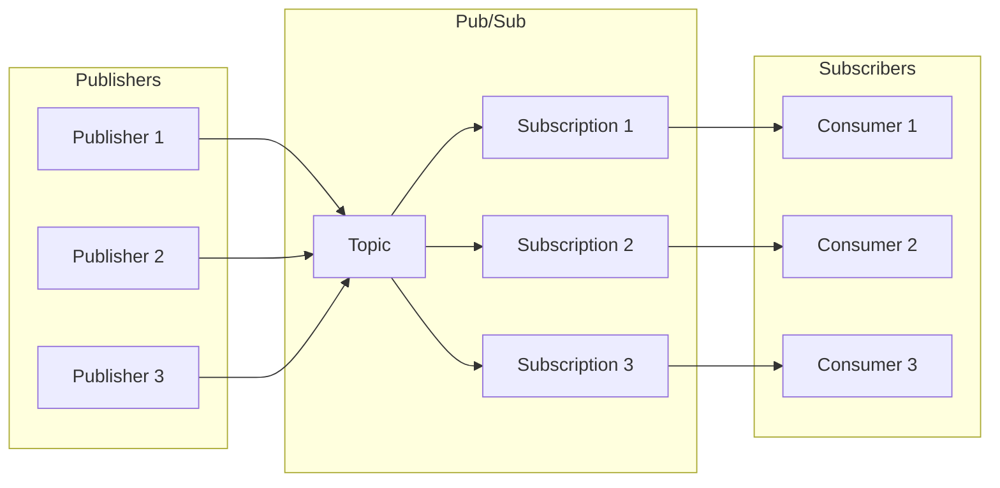
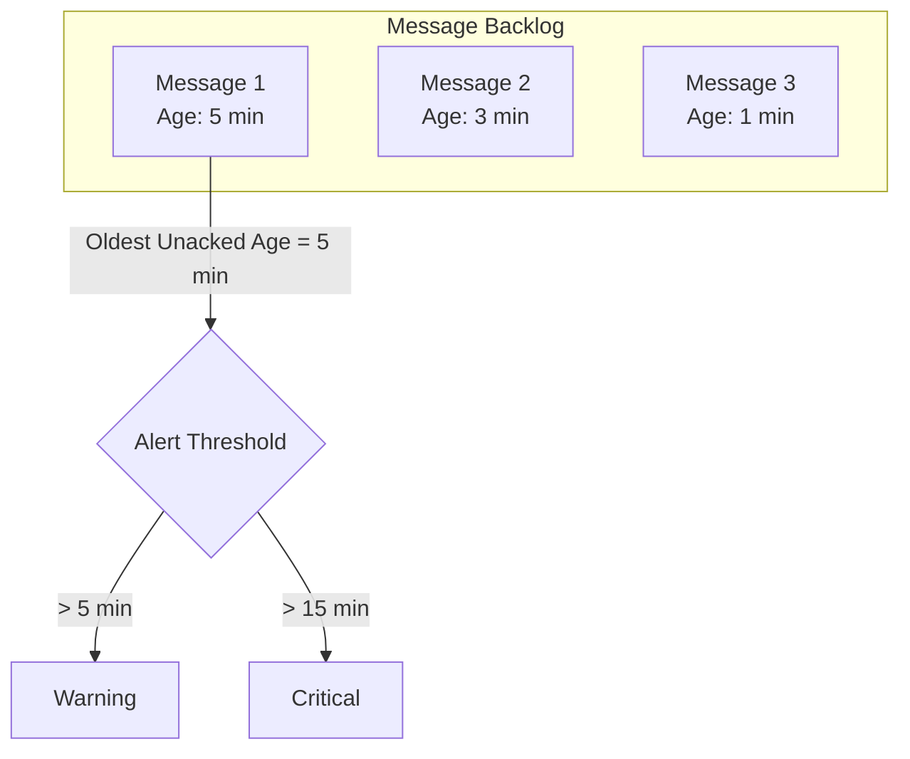
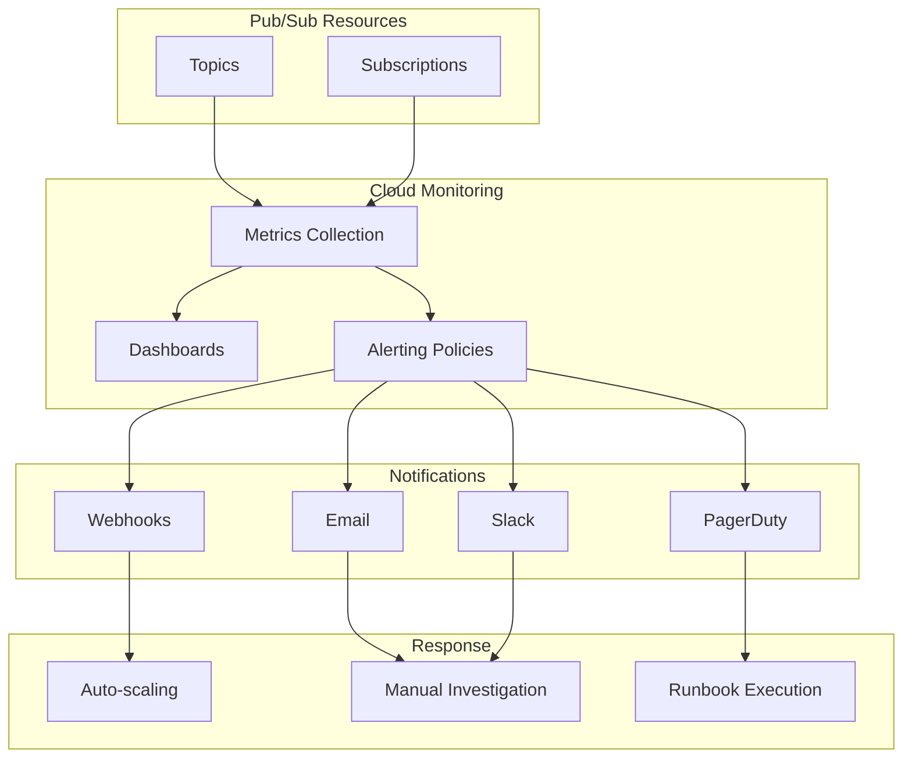
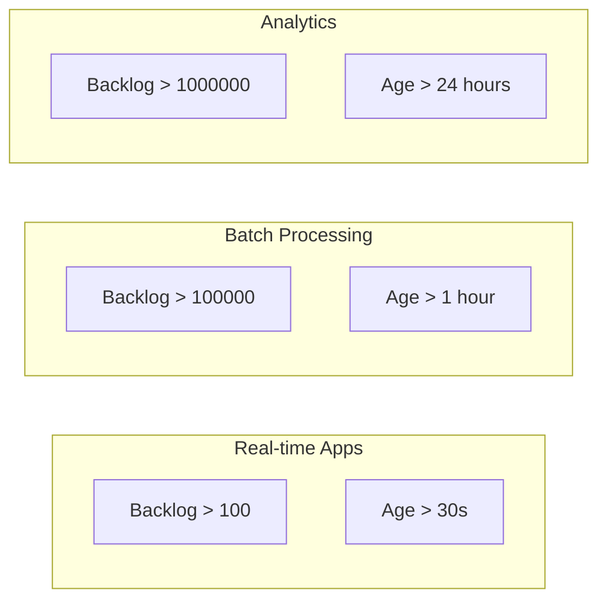

# How to Monitor Pub/Sub with Cloud Monitoring

Author: [nawazdhandala](https://www.github.com/nawazdhandala)

Tags: Google Cloud, Pub/Sub, Cloud Monitoring, Observability, Metrics, Alerting, GCP

Description: Learn how to monitor Google Cloud Pub/Sub using Cloud Monitoring. Covers key metrics, custom dashboards, alerting policies, and best practices for maintaining reliable message delivery.

---

Google Cloud Pub/Sub is a powerful messaging service, but without proper monitoring, issues can go unnoticed until they become critical. Cloud Monitoring provides deep visibility into Pub/Sub performance, enabling you to detect problems early and maintain reliable message delivery.

## Why Monitor Pub/Sub?

Message queues are the backbone of event-driven architectures. When Pub/Sub experiences issues, the effects cascade through your entire system:

- Messages pile up in subscriptions
- Consumers fall behind and miss SLAs
- Data pipelines stall
- End users experience delays or errors

Proactive monitoring helps you catch these issues before they impact your users.

## Pub/Sub Architecture Overview

Before diving into metrics, understanding the Pub/Sub architecture helps clarify what to monitor.



Key components to monitor:
- **Topics**: Where publishers send messages
- **Subscriptions**: How consumers receive messages
- **Publishers**: Applications that produce messages
- **Subscribers**: Applications that consume messages

## Key Metrics to Monitor

### Subscription Metrics

The most critical metrics relate to subscriptions because they indicate consumer health.

#### Oldest Unacked Message Age

The age of the oldest unacknowledged message reveals how far behind your consumers are.



The following command retrieves this metric using gcloud. The filter parameter specifies the metric type and subscription name.

```bash
# Query oldest unacked message age for a subscription
gcloud monitoring metrics list \
  --filter="metric.type=pubsub.googleapis.com/subscription/oldest_unacked_message_age"
```

#### Backlog Size

The number of undelivered messages shows the total work remaining for consumers.

Run this command to check the current backlog for a specific subscription. Replace SUBSCRIPTION_NAME and PROJECT_ID with your values.

```bash
# Get current backlog count
gcloud pubsub subscriptions describe SUBSCRIPTION_NAME \
  --project=PROJECT_ID \
  --format="value(numUndeliveredMessages)"
```

### Topic Metrics

Topic metrics help you understand publisher behavior and message flow.

#### Publish Request Count

Track how many publish requests succeed or fail. Sudden drops indicate publisher issues, while spikes may overwhelm consumers.

#### Publish Message Size

Monitor message sizes to detect anomalies and plan capacity.

## Setting Up Cloud Monitoring Dashboards

### Creating a Pub/Sub Dashboard

Navigate to Cloud Monitoring and create a custom dashboard with these essential charts.

The following configuration creates a chart showing the oldest unacked message age across all subscriptions. Save it as a JSON file.

```json
{
  "displayName": "Pub/Sub Health Dashboard",
  "gridLayout": {
    "columns": "2",
    "widgets": [
      {
        "title": "Oldest Unacked Message Age",
        "xyChart": {
          "dataSets": [{
            "timeSeriesQuery": {
              "timeSeriesFilter": {
                "filter": "metric.type=\"pubsub.googleapis.com/subscription/oldest_unacked_message_age\"",
                "aggregation": {
                  "alignmentPeriod": "60s",
                  "perSeriesAligner": "ALIGN_MAX"
                }
              }
            }
          }]
        }
      },
      {
        "title": "Backlog Size by Subscription",
        "xyChart": {
          "dataSets": [{
            "timeSeriesQuery": {
              "timeSeriesFilter": {
                "filter": "metric.type=\"pubsub.googleapis.com/subscription/num_undelivered_messages\"",
                "aggregation": {
                  "alignmentPeriod": "60s",
                  "perSeriesAligner": "ALIGN_MEAN"
                }
              }
            }
          }]
        }
      }
    ]
  }
}
```

### Using Terraform for Dashboard Automation

Automate dashboard creation with Terraform. The following resource creates a monitoring dashboard with Pub/Sub metrics widgets.

```hcl
# Define a Cloud Monitoring dashboard for Pub/Sub metrics
resource "google_monitoring_dashboard" "pubsub_dashboard" {
  dashboard_json = jsonencode({
    displayName = "Pub/Sub Monitoring"
    gridLayout = {
      columns = 2
      widgets = [
        {
          title = "Message Backlog"
          xyChart = {
            dataSets = [{
              timeSeriesQuery = {
                timeSeriesFilter = {
                  filter = "metric.type=\"pubsub.googleapis.com/subscription/num_undelivered_messages\""
                  aggregation = {
                    alignmentPeriod = "60s"
                    perSeriesAligner = "ALIGN_MEAN"
                  }
                }
              }
            }]
          }
        },
        {
          title = "Oldest Unacked Message"
          xyChart = {
            dataSets = [{
              timeSeriesQuery = {
                timeSeriesFilter = {
                  filter = "metric.type=\"pubsub.googleapis.com/subscription/oldest_unacked_message_age\""
                  aggregation = {
                    alignmentPeriod = "60s"
                    perSeriesAligner = "ALIGN_MAX"
                  }
                }
              }
            }]
          }
        }
      ]
    }
  })
}
```

## Creating Alerting Policies

Alerts notify you when Pub/Sub health degrades. Create policies for these critical scenarios.

### Alert: Backlog Growing

Create an alert when the message backlog exceeds a threshold. The condition monitors undelivered messages and triggers when the count grows too large.

```yaml
# alert-policy-backlog.yaml
# Alert when backlog exceeds 10000 messages for 5 minutes
displayName: "Pub/Sub Backlog Alert"
combiner: OR
conditions:
  - displayName: "High message backlog"
    conditionThreshold:
      filter: >
        metric.type="pubsub.googleapis.com/subscription/num_undelivered_messages"
        resource.type="pubsub_subscription"
      comparison: COMPARISON_GT
      thresholdValue: 10000
      duration: "300s"
      aggregations:
        - alignmentPeriod: "60s"
          perSeriesAligner: ALIGN_MEAN
notificationChannels:
  - projects/PROJECT_ID/notificationChannels/CHANNEL_ID
```

Apply the alert policy using gcloud. Replace PROJECT_ID with your project identifier.

```bash
# Create the alerting policy
gcloud alpha monitoring policies create \
  --policy-from-file=alert-policy-backlog.yaml \
  --project=PROJECT_ID
```

### Alert: Consumer Lag

Create an alert when consumers fall too far behind. The oldest unacked message age directly indicates consumer health.

```yaml
# alert-policy-consumer-lag.yaml
# Alert when oldest unacked message is older than 5 minutes
displayName: "Pub/Sub Consumer Lag Alert"
combiner: OR
conditions:
  - displayName: "High consumer lag"
    conditionThreshold:
      filter: >
        metric.type="pubsub.googleapis.com/subscription/oldest_unacked_message_age"
        resource.type="pubsub_subscription"
      comparison: COMPARISON_GT
      thresholdValue: 300
      duration: "60s"
      aggregations:
        - alignmentPeriod: "60s"
          perSeriesAligner: ALIGN_MAX
notificationChannels:
  - projects/PROJECT_ID/notificationChannels/CHANNEL_ID
```

### Alert: Dead Letter Queue Messages

Monitor messages sent to dead letter topics. These indicate processing failures that need investigation.

```yaml
# alert-policy-dlq.yaml
# Alert when messages are sent to dead letter topic
displayName: "Pub/Sub Dead Letter Alert"
combiner: OR
conditions:
  - displayName: "Messages in DLQ"
    conditionThreshold:
      filter: >
        metric.type="pubsub.googleapis.com/subscription/dead_letter_message_count"
        resource.type="pubsub_subscription"
      comparison: COMPARISON_GT
      thresholdValue: 0
      duration: "60s"
      aggregations:
        - alignmentPeriod: "60s"
          perSeriesAligner: ALIGN_SUM
notificationChannels:
  - projects/PROJECT_ID/notificationChannels/CHANNEL_ID
```

## Monitoring with Python Client Library

For programmatic access to Pub/Sub metrics, use the Cloud Monitoring client library.

### Querying Metrics

The following Python code queries the oldest unacked message age for all subscriptions. Install the google-cloud-monitoring package first.

```python
# query_pubsub_metrics.py
# Query Pub/Sub metrics using Cloud Monitoring API

from google.cloud import monitoring_v3
from google.protobuf import timestamp_pb2
import time

def get_oldest_unacked_age(project_id: str, subscription_id: str) -> float:
    """
    Query the oldest unacked message age for a subscription.
    Returns the age in seconds, or -1 if no data is available.
    """
    client = monitoring_v3.MetricServiceClient()
    project_name = f"projects/{project_id}"

    # Define the time range for the query - last 5 minutes
    now = time.time()
    seconds = int(now)
    nanos = int((now - seconds) * 10**9)

    interval = monitoring_v3.TimeInterval(
        end_time={"seconds": seconds, "nanos": nanos},
        start_time={"seconds": seconds - 300, "nanos": nanos},
    )

    # Build the filter for the specific subscription
    filter_str = (
        f'metric.type="pubsub.googleapis.com/subscription/oldest_unacked_message_age" '
        f'AND resource.labels.subscription_id="{subscription_id}"'
    )

    # Execute the query
    results = client.list_time_series(
        request={
            "name": project_name,
            "filter": filter_str,
            "interval": interval,
            "view": monitoring_v3.ListTimeSeriesRequest.TimeSeriesView.FULL,
        }
    )

    # Extract the latest value
    for result in results:
        for point in result.points:
            return point.value.double_value

    return -1


def get_backlog_size(project_id: str, subscription_id: str) -> int:
    """
    Query the number of undelivered messages for a subscription.
    Returns the count, or -1 if no data is available.
    """
    client = monitoring_v3.MetricServiceClient()
    project_name = f"projects/{project_id}"

    now = time.time()
    seconds = int(now)
    nanos = int((now - seconds) * 10**9)

    interval = monitoring_v3.TimeInterval(
        end_time={"seconds": seconds, "nanos": nanos},
        start_time={"seconds": seconds - 300, "nanos": nanos},
    )

    filter_str = (
        f'metric.type="pubsub.googleapis.com/subscription/num_undelivered_messages" '
        f'AND resource.labels.subscription_id="{subscription_id}"'
    )

    results = client.list_time_series(
        request={
            "name": project_name,
            "filter": filter_str,
            "interval": interval,
            "view": monitoring_v3.ListTimeSeriesRequest.TimeSeriesView.FULL,
        }
    )

    for result in results:
        for point in result.points:
            return int(point.value.int64_value)

    return -1


# Example usage
if __name__ == "__main__":
    project = "my-project-id"
    subscription = "my-subscription"

    age = get_oldest_unacked_age(project, subscription)
    backlog = get_backlog_size(project, subscription)

    print(f"Oldest unacked message age: {age} seconds")
    print(f"Backlog size: {backlog} messages")
```

### Creating Custom Metrics

Create custom metrics to track application-specific Pub/Sub behavior. The following code writes a custom metric for message processing latency.

```python
# custom_pubsub_metrics.py
# Create and write custom Pub/Sub metrics

from google.cloud import monitoring_v3
from google.api import metric_pb2
import time

def create_processing_latency_metric(project_id: str) -> None:
    """
    Create a custom metric descriptor for message processing latency.
    Run once to set up the metric.
    """
    client = monitoring_v3.MetricServiceClient()
    project_name = f"projects/{project_id}"

    # Define the metric descriptor
    descriptor = monitoring_v3.MetricDescriptor(
        type="custom.googleapis.com/pubsub/message_processing_latency",
        metric_kind=monitoring_v3.MetricDescriptor.MetricKind.GAUGE,
        value_type=monitoring_v3.MetricDescriptor.ValueType.DOUBLE,
        unit="s",
        description="Time taken to process a Pub/Sub message",
        display_name="Message Processing Latency",
        labels=[
            monitoring_v3.LabelDescriptor(
                key="subscription_id",
                value_type=monitoring_v3.LabelDescriptor.ValueType.STRING,
                description="The subscription that received the message",
            ),
        ],
    )

    # Create the metric descriptor
    created = client.create_metric_descriptor(
        name=project_name, metric_descriptor=descriptor
    )
    print(f"Created metric: {created.name}")


def write_processing_latency(
    project_id: str, subscription_id: str, latency_seconds: float
) -> None:
    """
    Write a processing latency data point to Cloud Monitoring.
    Call after processing each message or batch.
    """
    client = monitoring_v3.MetricServiceClient()
    project_name = f"projects/{project_id}"

    # Create the time series data point
    now = time.time()
    seconds = int(now)
    nanos = int((now - seconds) * 10**9)

    series = monitoring_v3.TimeSeries(
        metric=monitoring_v3.types.Metric(
            type="custom.googleapis.com/pubsub/message_processing_latency",
            labels={"subscription_id": subscription_id},
        ),
        resource=monitoring_v3.types.MonitoredResource(
            type="global",
            labels={"project_id": project_id},
        ),
        points=[
            monitoring_v3.Point(
                interval=monitoring_v3.TimeInterval(
                    end_time={"seconds": seconds, "nanos": nanos}
                ),
                value=monitoring_v3.TypedValue(double_value=latency_seconds),
            )
        ],
    )

    # Write the time series
    client.create_time_series(name=project_name, time_series=[series])


# Example usage in a message handler
def process_message(message, project_id: str, subscription_id: str) -> None:
    """
    Process a Pub/Sub message and record the latency.
    """
    start_time = time.time()

    # Process the message
    # ... your processing logic here ...

    # Record the processing latency
    latency = time.time() - start_time
    write_processing_latency(project_id, subscription_id, latency)
```

## Monitoring Flow Visualization

The following diagram shows the complete monitoring flow from Pub/Sub to alerts.



## Best Practices

### 1. Set Appropriate Thresholds

Thresholds depend on your application's requirements.



### 2. Monitor Publisher Health

Track publish success rates and latencies to catch issues early.

The following code snippet monitors publisher metrics in a Node.js application using the Pub/Sub client library.

```javascript
// publisher-monitoring.js
// Monitor Pub/Sub publisher health metrics

const { PubSub } = require("@google-cloud/pubsub");
const { Monitoring } = require("@google-cloud/monitoring");

const pubsub = new PubSub();
const monitoring = new Monitoring.MetricServiceClient();

// Track publish metrics
let publishSuccess = 0;
let publishFailure = 0;
let publishLatencySum = 0;
let publishCount = 0;

/**
 * Publish a message with monitoring
 * Tracks success rate and latency for each publish operation
 */
async function publishWithMonitoring(topicName, data) {
  const topic = pubsub.topic(topicName);
  const startTime = Date.now();

  try {
    const messageId = await topic.publishMessage({ data: Buffer.from(data) });
    publishSuccess++;
    publishLatencySum += Date.now() - startTime;
    publishCount++;
    return messageId;
  } catch (error) {
    publishFailure++;
    throw error;
  }
}

/**
 * Get current publisher metrics
 * Returns success rate and average latency
 */
function getPublisherMetrics() {
  const total = publishSuccess + publishFailure;
  return {
    successRate: total > 0 ? publishSuccess / total : 1,
    averageLatency: publishCount > 0 ? publishLatencySum / publishCount : 0,
    totalPublished: publishSuccess,
    totalFailed: publishFailure,
  };
}

/**
 * Report metrics periodically
 * Call from a setInterval to report metrics every minute
 */
async function reportMetrics(projectId) {
  const metrics = getPublisherMetrics();
  console.log("Publisher metrics:", metrics);

  // Reset counters after reporting
  publishSuccess = 0;
  publishFailure = 0;
  publishLatencySum = 0;
  publishCount = 0;
}

// Report metrics every minute
setInterval(() => reportMetrics("my-project"), 60000);

module.exports = { publishWithMonitoring, getPublisherMetrics };
```

### 3. Use Labels Effectively

Add labels to subscriptions for better metric grouping.

```bash
# Create subscription with labels for better metric filtering
gcloud pubsub subscriptions create my-subscription \
  --topic=my-topic \
  --labels=environment=production,team=platform,service=order-processor
```

### 4. Set Up Log-Based Metrics

Create metrics from Pub/Sub audit logs for additional visibility.

The following gcloud command creates a log-based metric that counts publish operations per topic.

```bash
# Create a log-based metric for publish operations
gcloud logging metrics create pubsub_publish_count \
  --description="Count of Pub/Sub publish operations" \
  --log-filter='resource.type="pubsub_topic" AND protoPayload.methodName="google.pubsub.v1.Publisher.Publish"'
```

## Troubleshooting Common Issues

### Issue: High Backlog Growth

When backlog grows faster than consumers can process:

1. Check consumer error rates
2. Verify consumer scaling
3. Review message processing time
4. Consider increasing ack deadline

```bash
# Increase ack deadline for slow consumers
gcloud pubsub subscriptions update my-subscription \
  --ack-deadline=120
```

### Issue: Messages Expiring

When messages expire before being processed:

1. Check message retention settings
2. Verify consumer connectivity
3. Review dead letter configuration

```bash
# Increase message retention to 7 days
gcloud pubsub subscriptions update my-subscription \
  --message-retention-duration=7d
```

### Issue: Duplicate Processing

When consumers process the same message multiple times:

1. Check ack deadline configuration
2. Verify exactly-once delivery settings
3. Implement idempotent message handlers

```bash
# Enable exactly-once delivery
gcloud pubsub subscriptions update my-subscription \
  --enable-exactly-once-delivery
```

## Complete Monitoring Checklist

Use this checklist to ensure comprehensive Pub/Sub monitoring:

| Metric | Alert Threshold | Priority |
|--------|-----------------|----------|
| Oldest unacked message age | > 5 minutes | High |
| Backlog size | > 10000 messages | High |
| Dead letter message count | > 0 | High |
| Publish error rate | > 1% | High |
| Consumer error rate | > 5% | Medium |
| Publish latency p99 | > 1 second | Medium |
| Subscription count | Sudden changes | Low |

## Summary

Effective Pub/Sub monitoring requires tracking both topic and subscription metrics. Focus on oldest unacked message age and backlog size for subscription health, and publish success rates for topic health. Set up alerts before issues become critical, and use dashboards for at-a-glance visibility.

Key takeaways:
- Monitor oldest unacked message age to detect consumer lag
- Track backlog size to identify processing bottlenecks
- Alert on dead letter queue messages for error detection
- Use custom metrics for application-specific monitoring
- Set thresholds based on your application's requirements

With proper monitoring in place, you can maintain reliable message delivery and catch issues before they impact your users.

---

Cloud Monitoring provides the visibility you need to operate Pub/Sub reliably at scale. Start with the essential metrics, add alerts for critical thresholds, and iterate based on your operational experience.
