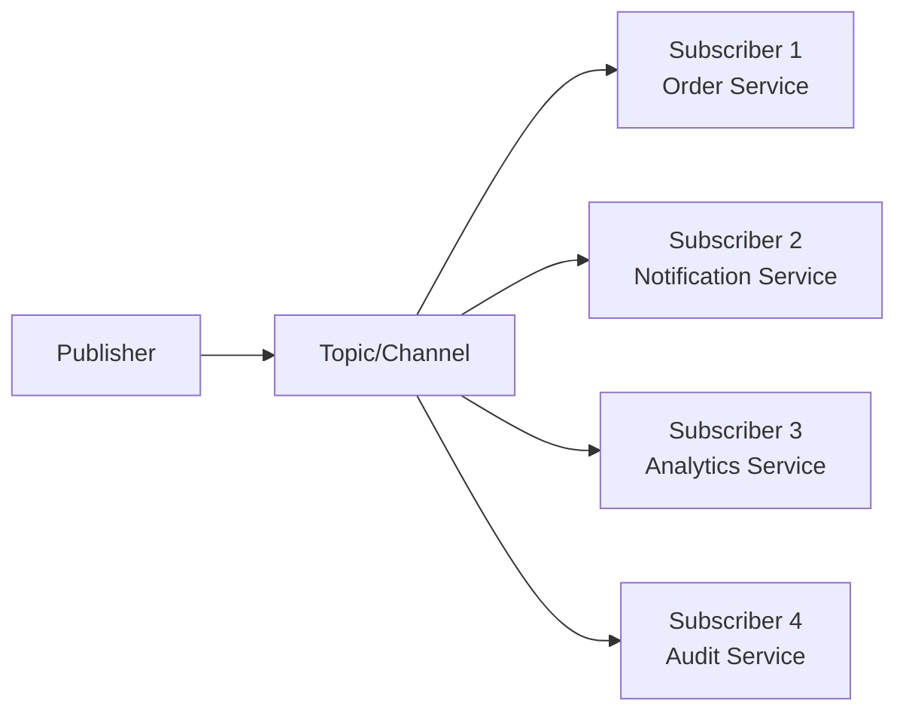
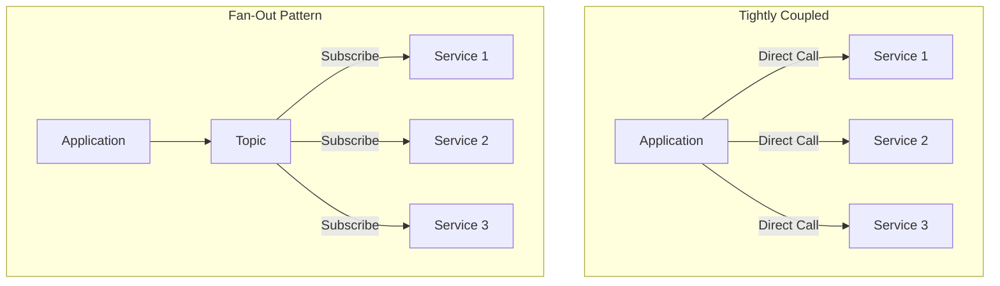
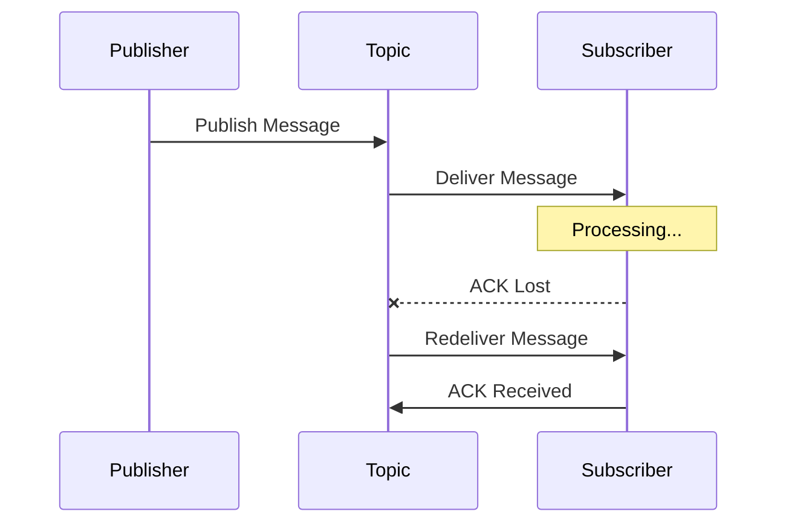
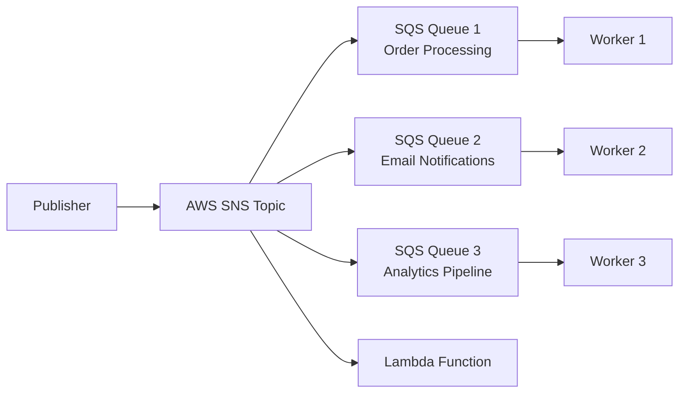
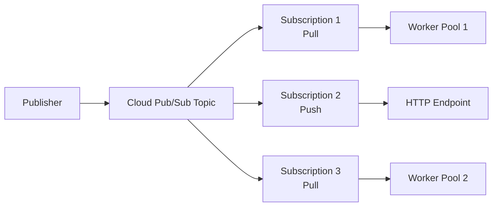
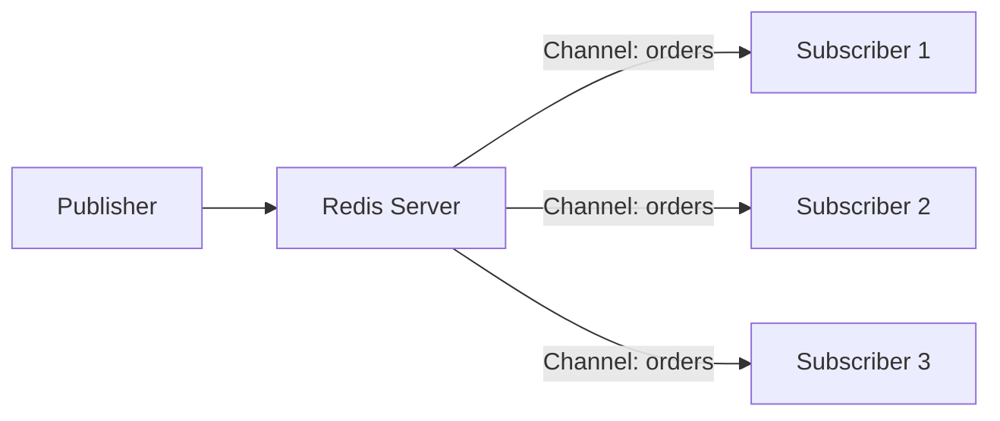
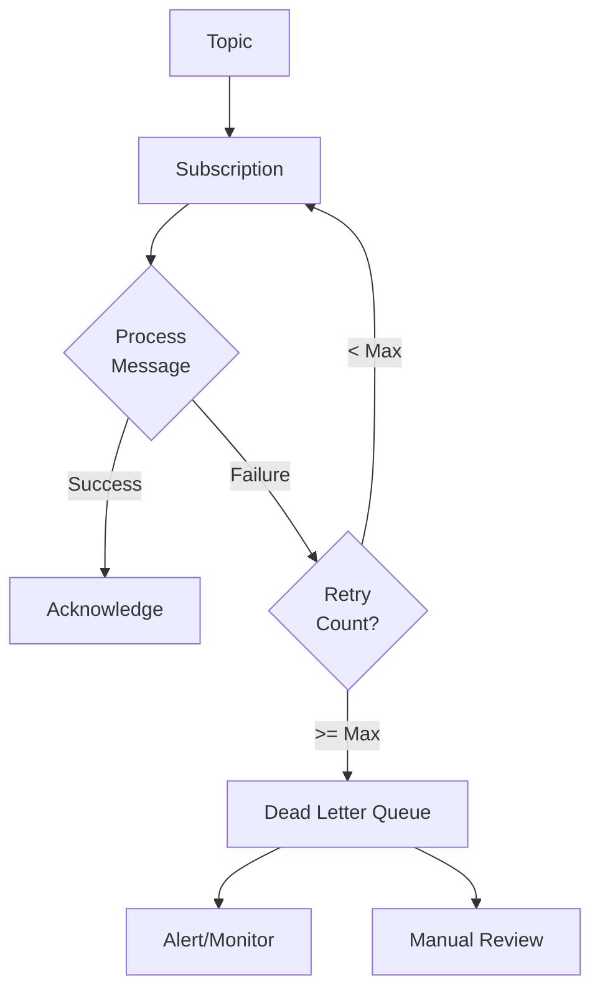
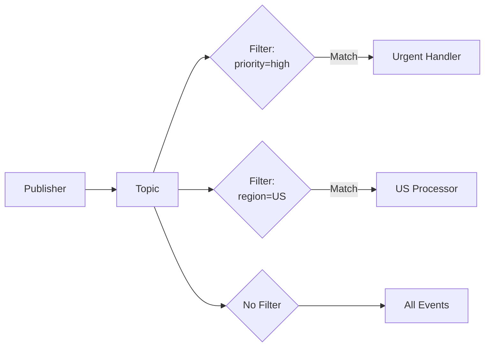
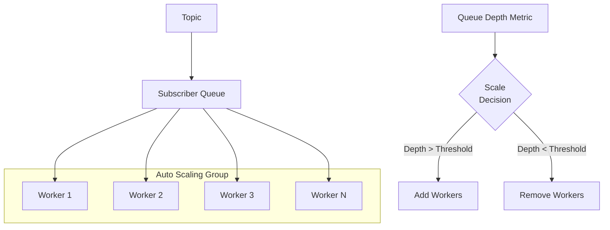
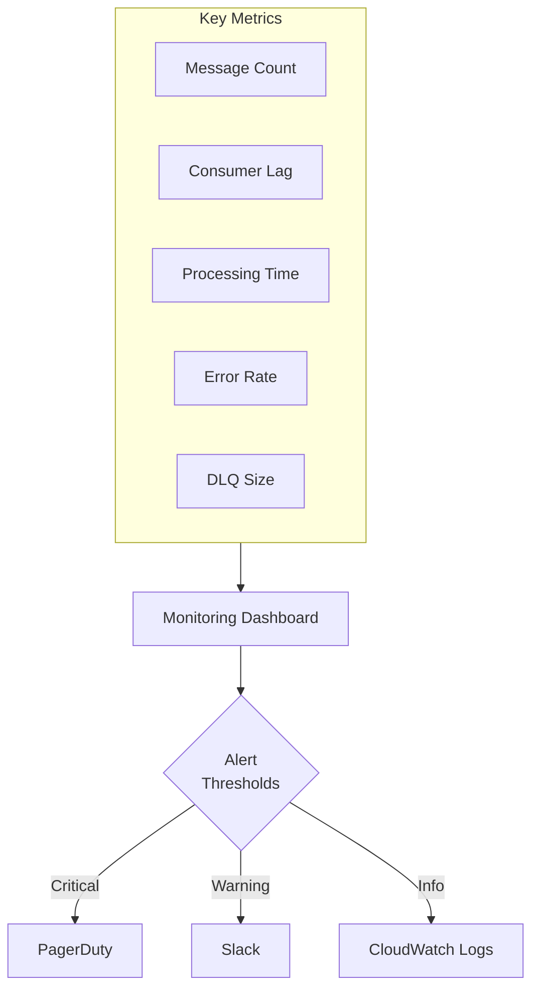

# How to Build Pub/Sub Event Fan-Out Architectures

Author: [nawazdhandala](https://www.github.com/nawazdhandala)

Tags: Pub/Sub, Event-Driven Architecture, Fan-Out, Messaging, Microservices, AWS SNS, Google Cloud Pub/Sub, Redis, Distributed Systems

Description: Learn how to design and implement Pub/Sub event fan-out architectures for distributing messages to multiple subscribers. Covers patterns, implementations with AWS SNS, Google Cloud Pub/Sub, and Redis, along with best practices for reliability and scale.

---

> Fan-out is a messaging pattern where a single event gets distributed to multiple consumers simultaneously. Mastering fan-out architectures enables you to build loosely coupled, scalable systems that can process events in parallel across multiple services.

Building efficient fan-out systems requires understanding message delivery guarantees, subscriber management, and failure handling strategies.

---

## Overview

Fan-out architectures enable a publisher to send a single message that gets delivered to multiple subscribers independently. Each subscriber receives its own copy of the message and processes it according to its own logic without affecting other subscribers.



---

## Why Use Fan-Out Architectures?

Fan-out patterns solve several common distributed system challenges:

| Benefit | Description |
|---------|-------------|
| Decoupling | Publishers don't need to know about subscribers |
| Scalability | Add new subscribers without modifying publishers |
| Reliability | Subscriber failures don't affect other subscribers |
| Parallel Processing | Multiple services process events simultaneously |
| Event Sourcing | Multiple systems react to the same business event |



---

## Fan-Out Delivery Patterns

Different use cases require different delivery guarantees. Understanding these patterns helps you choose the right approach.

### At-Least-Once Delivery

Messages are guaranteed to reach subscribers, but may arrive multiple times. Subscribers must handle duplicates.



### At-Most-Once Delivery

Messages are delivered once or not at all. Simpler but may lose messages during failures.

### Exactly-Once Delivery

Each message is processed exactly once. Requires idempotency or transaction support.

---

## Implementation with AWS SNS and SQS

AWS SNS (Simple Notification Service) combined with SQS (Simple Queue Service) provides a robust fan-out solution. SNS handles the fan-out distribution while SQS provides durable message queues for each subscriber.



### Setting Up SNS Topic and SQS Subscriptions

The following Python code demonstrates creating an SNS topic with multiple SQS queue subscriptions for fan-out:

```python
# aws_fanout_setup.py
import boto3
import json

def create_fanout_infrastructure():
    """
    Create an SNS topic with multiple SQS queue subscriptions
    for event fan-out distribution.
    """
    # Initialize AWS clients
    sns = boto3.client('sns', region_name='us-east-1')
    sqs = boto3.client('sqs', region_name='us-east-1')

    # Create the SNS topic for publishing events
    # All subscribers will receive messages published to this topic
    topic_response = sns.create_topic(
        Name='order-events',
        Tags=[
            {'Key': 'Environment', 'Value': 'production'},
            {'Key': 'Service', 'Value': 'order-fanout'}
        ]
    )
    topic_arn = topic_response['TopicArn']
    print(f"Created SNS topic: {topic_arn}")

    # Define subscriber queues with their specific purposes
    subscriber_queues = [
        {'name': 'order-fulfillment-queue', 'purpose': 'Process order fulfillment'},
        {'name': 'notification-queue', 'purpose': 'Send customer notifications'},
        {'name': 'analytics-queue', 'purpose': 'Track order analytics'},
        {'name': 'inventory-queue', 'purpose': 'Update inventory levels'}
    ]

    queue_urls = {}

    for queue_config in subscriber_queues:
        queue_name = queue_config['name']

        # Create SQS queue with appropriate settings
        # VisibilityTimeout should exceed your processing time
        queue_response = sqs.create_queue(
            QueueName=queue_name,
            Attributes={
                'VisibilityTimeout': '300',  # 5 minutes
                'MessageRetentionPeriod': '1209600',  # 14 days
                'ReceiveMessageWaitTimeSeconds': '20'  # Long polling
            }
        )
        queue_url = queue_response['QueueUrl']
        queue_urls[queue_name] = queue_url

        # Get queue ARN for subscription
        queue_attrs = sqs.get_queue_attributes(
            QueueUrl=queue_url,
            AttributeNames=['QueueArn']
        )
        queue_arn = queue_attrs['Attributes']['QueueArn']

        # Set queue policy to allow SNS to send messages
        # Without this policy, SNS cannot deliver messages to the queue
        policy = {
            "Version": "2012-10-17",
            "Statement": [{
                "Effect": "Allow",
                "Principal": {"Service": "sns.amazonaws.com"},
                "Action": "sqs:SendMessage",
                "Resource": queue_arn,
                "Condition": {
                    "ArnEquals": {"aws:SourceArn": topic_arn}
                }
            }]
        }

        sqs.set_queue_attributes(
            QueueUrl=queue_url,
            Attributes={'Policy': json.dumps(policy)}
        )

        # Subscribe the SQS queue to the SNS topic
        # raw_message_delivery preserves the original message format
        sns.subscribe(
            TopicArn=topic_arn,
            Protocol='sqs',
            Endpoint=queue_arn,
            Attributes={
                'RawMessageDelivery': 'true'
            }
        )

        print(f"Subscribed {queue_name} to topic")

    return topic_arn, queue_urls


def publish_order_event(topic_arn, order_data):
    """
    Publish an order event to SNS for fan-out distribution.
    All subscribed queues will receive this message.
    """
    sns = boto3.client('sns', region_name='us-east-1')

    # Add message attributes for filtering if needed
    # Subscribers can filter based on these attributes
    message_attributes = {
        'event_type': {
            'DataType': 'String',
            'StringValue': order_data.get('event_type', 'order.created')
        },
        'priority': {
            'DataType': 'String',
            'StringValue': order_data.get('priority', 'normal')
        }
    }

    # Publish the message to SNS
    # SNS automatically fans out to all subscribers
    response = sns.publish(
        TopicArn=topic_arn,
        Message=json.dumps(order_data),
        MessageAttributes=message_attributes
    )

    print(f"Published message ID: {response['MessageId']}")
    return response['MessageId']


# Example usage demonstrating the complete fan-out flow
if __name__ == '__main__':
    # Set up the infrastructure
    topic_arn, queues = create_fanout_infrastructure()

    # Publish a sample order event
    order_event = {
        'event_type': 'order.created',
        'order_id': 'ORD-12345',
        'customer_id': 'CUST-789',
        'total_amount': 99.99,
        'items': [
            {'sku': 'PROD-001', 'quantity': 2},
            {'sku': 'PROD-002', 'quantity': 1}
        ],
        'timestamp': '2026-02-02T10:30:00Z'
    }

    publish_order_event(topic_arn, order_event)
```

### Consuming Messages from Subscriber Queues

Each subscriber service processes messages from its dedicated queue independently:

```python
# aws_subscriber.py
import boto3
import json
import time

class OrderEventSubscriber:
    """
    Base class for processing fan-out events from SQS.
    Each subscriber service extends this class.
    """

    def __init__(self, queue_url, region='us-east-1'):
        self.sqs = boto3.client('sqs', region_name=region)
        self.queue_url = queue_url
        self.running = True

    def process_message(self, message_body):
        """
        Override this method in subclasses to implement
        service-specific message processing logic.
        """
        raise NotImplementedError("Subclasses must implement process_message")

    def start_consuming(self):
        """
        Start the message consumption loop.
        Uses long polling to efficiently wait for messages.
        """
        print(f"Starting consumer for queue: {self.queue_url}")

        while self.running:
            try:
                # Receive messages with long polling
                # WaitTimeSeconds=20 reduces empty responses and API calls
                response = self.sqs.receive_message(
                    QueueUrl=self.queue_url,
                    MaxNumberOfMessages=10,  # Batch up to 10 messages
                    WaitTimeSeconds=20,
                    AttributeNames=['All'],
                    MessageAttributeNames=['All']
                )

                messages = response.get('Messages', [])

                for message in messages:
                    try:
                        # Parse the message body
                        body = json.loads(message['Body'])

                        # Process the message using service-specific logic
                        self.process_message(body)

                        # Delete message after successful processing
                        # Failing to delete means the message will be redelivered
                        self.sqs.delete_message(
                            QueueUrl=self.queue_url,
                            ReceiptHandle=message['ReceiptHandle']
                        )

                    except Exception as e:
                        # Log error but don't delete message
                        # It will become visible again after VisibilityTimeout
                        print(f"Error processing message: {e}")

            except Exception as e:
                print(f"Error receiving messages: {e}")
                time.sleep(5)  # Brief pause before retry

    def stop(self):
        """Signal the consumer to stop gracefully."""
        self.running = False


class FulfillmentSubscriber(OrderEventSubscriber):
    """
    Subscriber that processes orders for fulfillment.
    """

    def process_message(self, message_body):
        order_id = message_body.get('order_id')
        items = message_body.get('items', [])

        print(f"Processing fulfillment for order: {order_id}")

        # Implement fulfillment logic here
        # Reserve inventory, create shipping labels, etc.
        for item in items:
            print(f"  - Reserving {item['quantity']}x {item['sku']}")


class NotificationSubscriber(OrderEventSubscriber):
    """
    Subscriber that sends customer notifications.
    """

    def process_message(self, message_body):
        order_id = message_body.get('order_id')
        customer_id = message_body.get('customer_id')

        print(f"Sending notification for order {order_id} to {customer_id}")

        # Implement notification logic here
        # Send email, SMS, push notification, etc.


# Run subscriber services independently
if __name__ == '__main__':
    import sys

    queue_url = sys.argv[1] if len(sys.argv) > 1 else 'YOUR_QUEUE_URL'
    subscriber_type = sys.argv[2] if len(sys.argv) > 2 else 'fulfillment'

    if subscriber_type == 'fulfillment':
        subscriber = FulfillmentSubscriber(queue_url)
    else:
        subscriber = NotificationSubscriber(queue_url)

    subscriber.start_consuming()
```

---

## Implementation with Google Cloud Pub/Sub

Google Cloud Pub/Sub provides a fully managed messaging service with built-in fan-out capabilities. Subscriptions automatically receive copies of messages published to topics.



### Setting Up Google Cloud Pub/Sub Fan-Out

The following code creates a Pub/Sub topic with multiple subscriptions for fan-out:

```python
# gcp_pubsub_fanout.py
from google.cloud import pubsub_v1
from google.api_core import retry
import json

def create_pubsub_fanout(project_id):
    """
    Create a Pub/Sub topic with multiple subscriptions
    for fan-out message distribution.
    """
    # Initialize Pub/Sub clients
    publisher = pubsub_v1.PublisherClient()
    subscriber = pubsub_v1.SubscriberClient()

    topic_id = 'order-events'
    topic_path = publisher.topic_path(project_id, topic_id)

    # Create the topic for publishing events
    try:
        topic = publisher.create_topic(request={"name": topic_path})
        print(f"Created topic: {topic.name}")
    except Exception as e:
        print(f"Topic may already exist: {e}")

    # Define subscriptions with their configurations
    subscriptions = [
        {
            'id': 'order-fulfillment-sub',
            'ack_deadline': 300,  # 5 minutes to process
            'retain_acked': False
        },
        {
            'id': 'notification-sub',
            'ack_deadline': 60,  # 1 minute for quick notifications
            'retain_acked': False
        },
        {
            'id': 'analytics-sub',
            'ack_deadline': 600,  # 10 minutes for batch processing
            'retain_acked': True  # Retain for replay capability
        }
    ]

    subscription_paths = []

    for sub_config in subscriptions:
        sub_path = subscriber.subscription_path(project_id, sub_config['id'])

        try:
            # Create subscription with specific configurations
            # Each subscription receives its own copy of every message
            subscription = subscriber.create_subscription(
                request={
                    "name": sub_path,
                    "topic": topic_path,
                    "ack_deadline_seconds": sub_config['ack_deadline'],
                    "retain_acked_messages": sub_config['retain_acked'],
                    "message_retention_duration": {
                        "seconds": 604800  # 7 days retention
                    },
                    "expiration_policy": {
                        "ttl": {"seconds": 0}  # Never expire
                    }
                }
            )
            print(f"Created subscription: {subscription.name}")
            subscription_paths.append(sub_path)

        except Exception as e:
            print(f"Subscription may already exist: {e}")
            subscription_paths.append(sub_path)

    return topic_path, subscription_paths


def publish_with_ordering(project_id, topic_id, messages, ordering_key):
    """
    Publish messages with ordering guarantee for related events.
    Messages with the same ordering key are delivered in order.
    """
    # Enable message ordering for the publisher
    publisher_options = pubsub_v1.types.PublisherOptions(
        enable_message_ordering=True
    )
    publisher = pubsub_v1.PublisherClient(publisher_options=publisher_options)

    topic_path = publisher.topic_path(project_id, topic_id)

    futures = []

    for message in messages:
        # Encode message data as bytes
        data = json.dumps(message).encode('utf-8')

        # Publish with ordering key to maintain sequence
        # All messages with the same key go to the same partition
        future = publisher.publish(
            topic_path,
            data,
            ordering_key=ordering_key
        )
        futures.append(future)

    # Wait for all publishes to complete
    for future in futures:
        message_id = future.result()
        print(f"Published message ID: {message_id}")


def subscribe_with_flow_control(project_id, subscription_id, callback):
    """
    Subscribe to messages with flow control to prevent overload.
    Flow control limits concurrent message processing.
    """
    subscriber = pubsub_v1.SubscriberClient()
    subscription_path = subscriber.subscription_path(project_id, subscription_id)

    # Configure flow control settings
    # Prevents subscriber from being overwhelmed
    flow_control = pubsub_v1.types.FlowControl(
        max_messages=100,  # Max outstanding messages
        max_bytes=10 * 1024 * 1024  # 10 MB max outstanding
    )

    # Start the subscriber with flow control
    streaming_pull_future = subscriber.subscribe(
        subscription_path,
        callback=callback,
        flow_control=flow_control
    )

    print(f"Listening for messages on {subscription_path}")

    return streaming_pull_future


def process_order_message(message):
    """
    Callback function for processing received messages.
    Must acknowledge messages after successful processing.
    """
    try:
        # Decode and parse the message
        data = json.loads(message.data.decode('utf-8'))

        order_id = data.get('order_id')
        event_type = data.get('event_type')

        print(f"Processing {event_type} for order {order_id}")
        print(f"  Publish time: {message.publish_time}")
        print(f"  Message ID: {message.message_id}")

        # Process the message based on event type
        if event_type == 'order.created':
            handle_order_created(data)
        elif event_type == 'order.updated':
            handle_order_updated(data)

        # Acknowledge successful processing
        # Unacknowledged messages are redelivered
        message.ack()

    except Exception as e:
        print(f"Error processing message: {e}")
        # Negative acknowledgment triggers immediate redelivery
        message.nack()


def handle_order_created(data):
    """Handle new order creation events."""
    print(f"  New order: {data.get('order_id')}, Amount: {data.get('total_amount')}")


def handle_order_updated(data):
    """Handle order update events."""
    print(f"  Updated order: {data.get('order_id')}")


# Example usage
if __name__ == '__main__':
    project_id = 'your-gcp-project'

    # Set up fan-out infrastructure
    topic_path, subs = create_pubsub_fanout(project_id)

    # Publish sample events
    messages = [
        {'event_type': 'order.created', 'order_id': 'ORD-001', 'total_amount': 150.00},
        {'event_type': 'order.updated', 'order_id': 'ORD-001', 'status': 'confirmed'}
    ]
    publish_with_ordering(project_id, 'order-events', messages, 'ORD-001')
```

---

## Implementation with Redis Pub/Sub

Redis provides a lightweight pub/sub mechanism suitable for real-time fan-out within a single cluster. Messages are delivered immediately to all connected subscribers.



### Redis Pub/Sub Fan-Out Implementation

The following code demonstrates Redis pub/sub for real-time event fan-out:

```python
# redis_fanout.py
import redis
import json
import threading
import time

class RedisFanoutPublisher:
    """
    Publisher for Redis Pub/Sub fan-out.
    Messages are instantly delivered to all subscribers.
    """

    def __init__(self, host='localhost', port=6379, db=0):
        # Create Redis connection for publishing
        self.redis_client = redis.Redis(
            host=host,
            port=port,
            db=db,
            decode_responses=True
        )

    def publish(self, channel, message):
        """
        Publish a message to a channel.
        Returns the number of subscribers that received the message.
        """
        # Serialize message to JSON
        message_json = json.dumps(message)

        # Publish to channel - instant delivery to all subscribers
        subscriber_count = self.redis_client.publish(channel, message_json)

        print(f"Published to {channel}, reached {subscriber_count} subscribers")
        return subscriber_count

    def publish_to_pattern(self, channels, message):
        """
        Publish the same message to multiple channels.
        Useful for targeting specific subscriber groups.
        """
        message_json = json.dumps(message)
        total_subscribers = 0

        for channel in channels:
            count = self.redis_client.publish(channel, message_json)
            total_subscribers += count

        return total_subscribers


class RedisFanoutSubscriber:
    """
    Subscriber for Redis Pub/Sub fan-out.
    Receives real-time messages from subscribed channels.
    """

    def __init__(self, host='localhost', port=6379, db=0):
        # Create dedicated Redis connection for subscribing
        # Pub/Sub requires its own connection
        self.redis_client = redis.Redis(
            host=host,
            port=port,
            db=db,
            decode_responses=True
        )
        self.pubsub = self.redis_client.pubsub()
        self.running = True
        self.handlers = {}

    def subscribe(self, channel, handler):
        """
        Subscribe to a channel with a message handler.
        Handler is called for each message received.
        """
        self.handlers[channel] = handler
        self.pubsub.subscribe(channel)
        print(f"Subscribed to channel: {channel}")

    def subscribe_pattern(self, pattern, handler):
        """
        Subscribe to channels matching a pattern.
        Patterns use glob-style matching (e.g., 'orders.*').
        """
        self.handlers[pattern] = handler
        self.pubsub.psubscribe(pattern)
        print(f"Subscribed to pattern: {pattern}")

    def start_listening(self):
        """
        Start the message listening loop.
        Runs in a separate thread to not block the main thread.
        """
        def listen():
            while self.running:
                try:
                    # Get next message with timeout
                    message = self.pubsub.get_message(timeout=1.0)

                    if message and message['type'] in ('message', 'pmessage'):
                        channel = message.get('channel', message.get('pattern'))
                        data = message['data']

                        # Parse JSON message
                        try:
                            parsed_data = json.loads(data)
                        except json.JSONDecodeError:
                            parsed_data = data

                        # Find and call the appropriate handler
                        handler = self.handlers.get(channel)
                        if handler:
                            handler(channel, parsed_data)

                except Exception as e:
                    print(f"Error in listener: {e}")
                    time.sleep(1)

        # Start listener in background thread
        self.listener_thread = threading.Thread(target=listen, daemon=True)
        self.listener_thread.start()
        return self.listener_thread

    def stop(self):
        """Stop the subscriber and clean up resources."""
        self.running = False
        self.pubsub.close()


def run_fanout_demo():
    """
    Demonstrate Redis Pub/Sub fan-out with multiple subscribers.
    """
    # Create publisher
    publisher = RedisFanoutPublisher()

    # Create multiple subscribers simulating different services
    fulfillment_sub = RedisFanoutSubscriber()
    notification_sub = RedisFanoutSubscriber()
    analytics_sub = RedisFanoutSubscriber()

    # Define message handlers for each subscriber
    def fulfillment_handler(channel, data):
        print(f"[Fulfillment] Processing order: {data.get('order_id')}")
        # Implement fulfillment logic

    def notification_handler(channel, data):
        print(f"[Notification] Sending alert for: {data.get('order_id')}")
        # Implement notification logic

    def analytics_handler(channel, data):
        print(f"[Analytics] Recording event: {data.get('event_type')}")
        # Implement analytics logic

    # Subscribe each service to the orders channel
    fulfillment_sub.subscribe('orders', fulfillment_handler)
    notification_sub.subscribe('orders', notification_handler)
    analytics_sub.subscribe('orders', analytics_handler)

    # Start all subscribers
    fulfillment_sub.start_listening()
    notification_sub.start_listening()
    analytics_sub.start_listening()

    # Allow subscriptions to establish
    time.sleep(0.5)

    # Publish events - all subscribers receive each message
    publisher.publish('orders', {
        'event_type': 'order.created',
        'order_id': 'ORD-12345',
        'total_amount': 299.99,
        'timestamp': '2026-02-02T15:30:00Z'
    })

    # Wait for processing
    time.sleep(1)

    # Clean up
    fulfillment_sub.stop()
    notification_sub.stop()
    analytics_sub.stop()


if __name__ == '__main__':
    run_fanout_demo()
```

---

## Handling Fan-Out Failures

Robust fan-out architectures must handle failures gracefully. Implementing dead letter queues and retry mechanisms ensures no messages are lost.



### Implementing Dead Letter Queue Pattern

The following code shows how to implement dead letter queue handling for failed messages:

```python
# dead_letter_handler.py
import boto3
import json
from datetime import datetime

class DeadLetterHandler:
    """
    Handles messages that failed processing multiple times.
    Moves failed messages to a dead letter queue for analysis.
    """

    def __init__(self, main_queue_url, dlq_url, max_retries=3):
        self.sqs = boto3.client('sqs', region_name='us-east-1')
        self.main_queue_url = main_queue_url
        self.dlq_url = dlq_url
        self.max_retries = max_retries

    def process_with_retry(self, message, processor_func):
        """
        Process a message with automatic retry handling.
        Moves to DLQ after max retries exceeded.
        """
        # Extract retry count from message attributes
        attributes = message.get('Attributes', {})
        receive_count = int(attributes.get('ApproximateReceiveCount', 1))

        try:
            # Attempt to process the message
            body = json.loads(message['Body'])
            processor_func(body)

            # Delete from queue on success
            self.sqs.delete_message(
                QueueUrl=self.main_queue_url,
                ReceiptHandle=message['ReceiptHandle']
            )
            return True

        except Exception as e:
            print(f"Processing failed (attempt {receive_count}): {e}")

            if receive_count >= self.max_retries:
                # Move to dead letter queue
                self.move_to_dlq(message, str(e))

                # Delete from main queue
                self.sqs.delete_message(
                    QueueUrl=self.main_queue_url,
                    ReceiptHandle=message['ReceiptHandle']
                )

            return False

    def move_to_dlq(self, message, error_reason):
        """
        Move a failed message to the dead letter queue.
        Adds metadata about the failure for debugging.
        """
        # Create DLQ message with failure context
        dlq_message = {
            'original_message': json.loads(message['Body']),
            'failure_reason': error_reason,
            'failed_at': datetime.utcnow().isoformat(),
            'original_message_id': message.get('MessageId'),
            'receive_count': message.get('Attributes', {}).get('ApproximateReceiveCount')
        }

        # Send to dead letter queue
        self.sqs.send_message(
            QueueUrl=self.dlq_url,
            MessageBody=json.dumps(dlq_message),
            MessageAttributes={
                'FailureReason': {
                    'DataType': 'String',
                    'StringValue': error_reason[:256]  # Truncate if too long
                }
            }
        )

        print(f"Moved message to DLQ: {message.get('MessageId')}")

    def replay_from_dlq(self, filter_func=None):
        """
        Replay messages from the dead letter queue back to main queue.
        Optional filter function to select specific messages.
        """
        replayed_count = 0

        while True:
            # Receive messages from DLQ
            response = self.sqs.receive_message(
                QueueUrl=self.dlq_url,
                MaxNumberOfMessages=10,
                WaitTimeSeconds=5
            )

            messages = response.get('Messages', [])
            if not messages:
                break

            for message in messages:
                body = json.loads(message['Body'])
                original_message = body.get('original_message')

                # Apply filter if provided
                if filter_func and not filter_func(original_message):
                    continue

                # Send back to main queue
                self.sqs.send_message(
                    QueueUrl=self.main_queue_url,
                    MessageBody=json.dumps(original_message)
                )

                # Delete from DLQ
                self.sqs.delete_message(
                    QueueUrl=self.dlq_url,
                    ReceiptHandle=message['ReceiptHandle']
                )

                replayed_count += 1

        print(f"Replayed {replayed_count} messages from DLQ")
        return replayed_count
```

---

## Message Filtering for Selective Fan-Out

Not all subscribers need every message. Implement filtering to route messages to relevant subscribers only.



### Implementing Message Filters

The following code demonstrates setting up SNS subscription filters for selective fan-out:

```python
# message_filtering.py
import boto3
import json

def setup_filtered_subscriptions(topic_arn, queue_arns):
    """
    Create SNS subscriptions with message filtering.
    Subscribers only receive messages matching their filter.
    """
    sns = boto3.client('sns', region_name='us-east-1')

    # Define filter policies for different subscriber needs
    filter_configs = [
        {
            'queue_arn': queue_arns['urgent'],
            'filter': {
                # Only receive high priority messages
                'priority': ['high', 'critical']
            }
        },
        {
            'queue_arn': queue_arns['us_region'],
            'filter': {
                # Only receive US region events
                'region': ['us-east', 'us-west']
            }
        },
        {
            'queue_arn': queue_arns['large_orders'],
            'filter': {
                # Only receive orders above threshold
                'order_value': [{'numeric': ['>=', 1000]}]
            }
        },
        {
            'queue_arn': queue_arns['all_events'],
            'filter': None  # Receives all messages
        }
    ]

    subscriptions = []

    for config in filter_configs:
        # Create subscription
        sub_response = sns.subscribe(
            TopicArn=topic_arn,
            Protocol='sqs',
            Endpoint=config['queue_arn'],
            Attributes={
                'RawMessageDelivery': 'true'
            }
        )

        subscription_arn = sub_response['SubscriptionArn']

        # Apply filter policy if defined
        if config['filter']:
            sns.set_subscription_attributes(
                SubscriptionArn=subscription_arn,
                AttributeName='FilterPolicy',
                AttributeValue=json.dumps(config['filter'])
            )
            print(f"Applied filter: {config['filter']}")

        subscriptions.append(subscription_arn)

    return subscriptions


def publish_with_attributes(topic_arn, message, attributes):
    """
    Publish a message with attributes for filtering.
    Filters match against message attributes, not body content.
    """
    sns = boto3.client('sns', region_name='us-east-1')

    # Convert attributes to SNS format
    message_attributes = {}
    for key, value in attributes.items():
        if isinstance(value, (int, float)):
            message_attributes[key] = {
                'DataType': 'Number',
                'StringValue': str(value)
            }
        else:
            message_attributes[key] = {
                'DataType': 'String',
                'StringValue': str(value)
            }

    response = sns.publish(
        TopicArn=topic_arn,
        Message=json.dumps(message),
        MessageAttributes=message_attributes
    )

    return response['MessageId']


# Example: Publishing messages that will be filtered
def demonstrate_filtering(topic_arn):
    """
    Show how different messages reach different subscribers
    based on their filter policies.
    """
    # High priority order - goes to urgent and all_events queues
    publish_with_attributes(
        topic_arn,
        {'order_id': 'ORD-001', 'amount': 500},
        {'priority': 'high', 'region': 'eu-west', 'order_value': 500}
    )

    # US region large order - goes to us_region, large_orders, and all_events
    publish_with_attributes(
        topic_arn,
        {'order_id': 'ORD-002', 'amount': 2500},
        {'priority': 'normal', 'region': 'us-east', 'order_value': 2500}
    )

    # Normal priority, small order - only goes to all_events
    publish_with_attributes(
        topic_arn,
        {'order_id': 'ORD-003', 'amount': 50},
        {'priority': 'low', 'region': 'ap-south', 'order_value': 50}
    )
```

---

## Scaling Fan-Out Subscribers

As message volume grows, subscribers must scale horizontally to keep up with demand.



### Implementing Auto-Scaling Based on Queue Depth

The following code shows how to implement auto-scaling for fan-out consumers based on queue metrics:

```python
# auto_scaling_consumer.py
import boto3
import time
from concurrent.futures import ThreadPoolExecutor

class AutoScalingConsumer:
    """
    Consumer that automatically scales worker threads
    based on queue depth and processing throughput.
    """

    def __init__(self, queue_url, min_workers=2, max_workers=20):
        self.sqs = boto3.client('sqs', region_name='us-east-1')
        self.queue_url = queue_url
        self.min_workers = min_workers
        self.max_workers = max_workers
        self.current_workers = min_workers
        self.running = True
        self.executor = None

    def get_queue_depth(self):
        """
        Get the current number of messages in the queue.
        Used to determine scaling decisions.
        """
        response = self.sqs.get_queue_attributes(
            QueueUrl=self.queue_url,
            AttributeNames=[
                'ApproximateNumberOfMessages',
                'ApproximateNumberOfMessagesNotVisible'
            ]
        )

        visible = int(response['Attributes']['ApproximateNumberOfMessages'])
        in_flight = int(response['Attributes']['ApproximateNumberOfMessagesNotVisible'])

        return visible + in_flight

    def calculate_desired_workers(self, queue_depth):
        """
        Calculate the optimal number of workers based on queue depth.
        Uses a simple linear scaling algorithm.
        """
        # Scale up: 1 worker per 100 messages, minimum of min_workers
        messages_per_worker = 100
        desired = max(self.min_workers, queue_depth // messages_per_worker)

        # Cap at maximum workers
        return min(desired, self.max_workers)

    def worker_loop(self, worker_id):
        """
        Main processing loop for each worker thread.
        Continuously polls for and processes messages.
        """
        print(f"Worker {worker_id} started")

        while self.running:
            try:
                # Receive messages
                response = self.sqs.receive_message(
                    QueueUrl=self.queue_url,
                    MaxNumberOfMessages=10,
                    WaitTimeSeconds=20,
                    VisibilityTimeout=300
                )

                messages = response.get('Messages', [])

                for message in messages:
                    try:
                        self.process_message(message)

                        # Delete on successful processing
                        self.sqs.delete_message(
                            QueueUrl=self.queue_url,
                            ReceiptHandle=message['ReceiptHandle']
                        )
                    except Exception as e:
                        print(f"Worker {worker_id} error: {e}")

            except Exception as e:
                print(f"Worker {worker_id} receive error: {e}")
                time.sleep(1)

        print(f"Worker {worker_id} stopped")

    def process_message(self, message):
        """Override in subclass to implement message processing."""
        import json
        body = json.loads(message['Body'])
        print(f"Processing: {body}")
        time.sleep(0.1)  # Simulate processing time

    def scaling_loop(self):
        """
        Background loop that monitors queue depth and adjusts workers.
        Runs continuously to adapt to changing load.
        """
        while self.running:
            try:
                queue_depth = self.get_queue_depth()
                desired_workers = self.calculate_desired_workers(queue_depth)

                if desired_workers != self.current_workers:
                    print(f"Scaling from {self.current_workers} to {desired_workers} workers")
                    print(f"Queue depth: {queue_depth}")
                    self.adjust_workers(desired_workers)

                time.sleep(30)  # Check every 30 seconds

            except Exception as e:
                print(f"Scaling loop error: {e}")
                time.sleep(10)

    def adjust_workers(self, desired_count):
        """
        Adjust the number of active worker threads.
        Gracefully handles scaling up and down.
        """
        # For simplicity, restart the executor with new worker count
        # In production, use more sophisticated thread management
        if self.executor:
            self.executor.shutdown(wait=False)

        self.current_workers = desired_count
        self.executor = ThreadPoolExecutor(max_workers=desired_count)

        # Submit worker tasks
        for i in range(desired_count):
            self.executor.submit(self.worker_loop, i)

    def start(self):
        """Start the auto-scaling consumer."""
        print(f"Starting auto-scaling consumer with {self.min_workers} workers")

        # Initialize with minimum workers
        self.executor = ThreadPoolExecutor(max_workers=self.min_workers)
        for i in range(self.min_workers):
            self.executor.submit(self.worker_loop, i)

        # Start scaling monitor in separate thread
        import threading
        scaling_thread = threading.Thread(target=self.scaling_loop, daemon=True)
        scaling_thread.start()

    def stop(self):
        """Stop all workers gracefully."""
        self.running = False
        if self.executor:
            self.executor.shutdown(wait=True)


# Usage example
if __name__ == '__main__':
    consumer = AutoScalingConsumer(
        queue_url='YOUR_QUEUE_URL',
        min_workers=2,
        max_workers=10
    )

    consumer.start()

    try:
        # Run until interrupted
        while True:
            time.sleep(1)
    except KeyboardInterrupt:
        consumer.stop()
```

---

## Monitoring Fan-Out Architectures

Effective monitoring is essential for maintaining healthy fan-out systems. Track key metrics to identify bottlenecks and failures.



### Essential Monitoring Metrics

The following code demonstrates collecting and publishing fan-out metrics:

```python
# fanout_monitoring.py
import boto3
import time
from datetime import datetime

class FanoutMonitor:
    """
    Monitor key metrics for fan-out architecture health.
    Publishes metrics to CloudWatch for dashboards and alerts.
    """

    def __init__(self, namespace='FanoutMetrics'):
        self.cloudwatch = boto3.client('cloudwatch', region_name='us-east-1')
        self.sqs = boto3.client('sqs', region_name='us-east-1')
        self.namespace = namespace

    def collect_queue_metrics(self, queue_url, queue_name):
        """
        Collect metrics for a subscriber queue.
        Tracks depth, age, and processing indicators.
        """
        # Get queue attributes
        response = self.sqs.get_queue_attributes(
            QueueUrl=queue_url,
            AttributeNames=['All']
        )
        attrs = response['Attributes']

        metrics = []

        # Queue depth - number of messages waiting
        metrics.append({
            'MetricName': 'QueueDepth',
            'Dimensions': [{'Name': 'QueueName', 'Value': queue_name}],
            'Value': int(attrs['ApproximateNumberOfMessages']),
            'Unit': 'Count'
        })

        # Messages in flight - currently being processed
        metrics.append({
            'MetricName': 'MessagesInFlight',
            'Dimensions': [{'Name': 'QueueName', 'Value': queue_name}],
            'Value': int(attrs['ApproximateNumberOfMessagesNotVisible']),
            'Unit': 'Count'
        })

        # Publish metrics to CloudWatch
        self.cloudwatch.put_metric_data(
            Namespace=self.namespace,
            MetricData=metrics
        )

        return metrics

    def record_processing_metrics(self, queue_name, processing_time, success):
        """
        Record metrics for individual message processing.
        Tracks latency and success/failure rates.
        """
        metrics = [
            {
                'MetricName': 'ProcessingTime',
                'Dimensions': [{'Name': 'QueueName', 'Value': queue_name}],
                'Value': processing_time,
                'Unit': 'Milliseconds'
            },
            {
                'MetricName': 'ProcessingSuccess' if success else 'ProcessingFailure',
                'Dimensions': [{'Name': 'QueueName', 'Value': queue_name}],
                'Value': 1,
                'Unit': 'Count'
            }
        ]

        self.cloudwatch.put_metric_data(
            Namespace=self.namespace,
            MetricData=metrics
        )

    def create_alarm(self, queue_name, threshold, alarm_name):
        """
        Create a CloudWatch alarm for queue depth.
        Triggers when queue depth exceeds threshold.
        """
        self.cloudwatch.put_metric_alarm(
            AlarmName=alarm_name,
            ComparisonOperator='GreaterThanThreshold',
            EvaluationPeriods=3,
            MetricName='QueueDepth',
            Namespace=self.namespace,
            Period=60,  # 1 minute
            Statistic='Average',
            Threshold=threshold,
            ActionsEnabled=True,
            AlarmDescription=f'Queue depth for {queue_name} exceeds {threshold}',
            Dimensions=[
                {'Name': 'QueueName', 'Value': queue_name}
            ],
            TreatMissingData='notBreaching'
        )

        print(f"Created alarm: {alarm_name}")

    def get_consumer_lag(self, queue_url):
        """
        Calculate consumer lag based on oldest message age.
        High lag indicates consumers cannot keep up with publishers.
        """
        response = self.sqs.receive_message(
            QueueUrl=queue_url,
            MaxNumberOfMessages=1,
            AttributeNames=['SentTimestamp'],
            VisibilityTimeout=0  # Don't hide the message
        )

        messages = response.get('Messages', [])
        if not messages:
            return 0

        sent_timestamp = int(messages[0]['Attributes']['SentTimestamp'])
        current_timestamp = int(time.time() * 1000)

        lag_ms = current_timestamp - sent_timestamp
        return lag_ms / 1000  # Return in seconds


def setup_monitoring_dashboard(monitor, queues):
    """
    Set up comprehensive monitoring for fan-out queues.
    Creates alarms for critical thresholds.
    """
    for queue_name, queue_url in queues.items():
        # Create queue depth alarm
        monitor.create_alarm(
            queue_name=queue_name,
            threshold=10000,
            alarm_name=f'{queue_name}-high-depth'
        )

        # Collect initial metrics
        metrics = monitor.collect_queue_metrics(queue_url, queue_name)
        print(f"Metrics for {queue_name}: {metrics}")


# Usage example
if __name__ == '__main__':
    monitor = FanoutMonitor(namespace='OrderFanout')

    queues = {
        'order-fulfillment': 'QUEUE_URL_1',
        'notifications': 'QUEUE_URL_2',
        'analytics': 'QUEUE_URL_3'
    }

    setup_monitoring_dashboard(monitor, queues)
```

---

## Best Practices

Follow these guidelines when building production fan-out architectures:

### Design Principles

| Principle | Implementation |
|-----------|----------------|
| Idempotency | Design subscribers to handle duplicate messages safely |
| Ordering | Use ordering keys when message sequence matters |
| Batching | Batch publish operations to improve throughput |
| Backpressure | Implement flow control to prevent subscriber overload |

### Operational Guidelines

| Area | Recommendation |
|------|----------------|
| Retention | Set appropriate message retention for replay needs |
| Dead Letters | Always configure dead letter queues for failed messages |
| Monitoring | Alert on queue depth, consumer lag, and error rates |
| Testing | Test subscriber failures to verify DLQ behavior |

---

## Conclusion

Pub/Sub event fan-out architectures provide a powerful pattern for building scalable, decoupled systems. By choosing the right messaging platform, implementing proper failure handling, and establishing comprehensive monitoring, you can build reliable event distribution systems that scale with your application's needs.

Key takeaways for building production fan-out systems:

1. Choose the right platform based on your delivery guarantees and scale requirements
2. Implement dead letter queues and retry mechanisms for handling failures
3. Use message filtering to reduce unnecessary processing
4. Monitor queue depth, consumer lag, and error rates
5. Design subscribers to be idempotent and handle duplicates gracefully
6. Scale consumers based on queue metrics and processing throughput

Start with a simple fan-out setup and add complexity only as your requirements demand. Most applications can achieve excellent results with basic SNS/SQS or Cloud Pub/Sub configurations before needing advanced patterns like ordering or exactly-once delivery.
