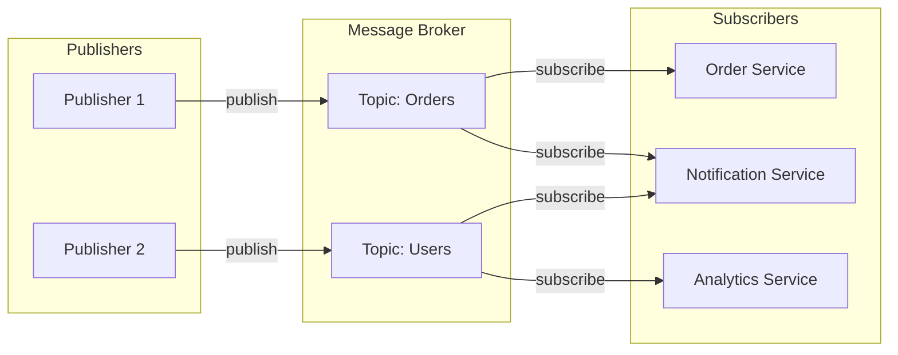
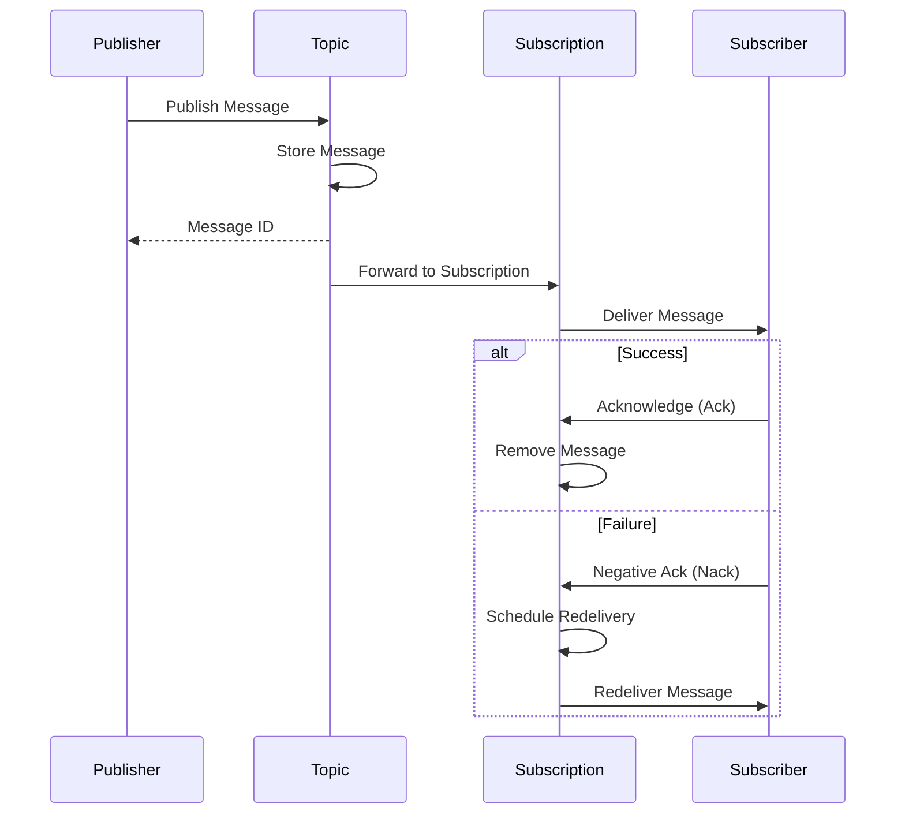
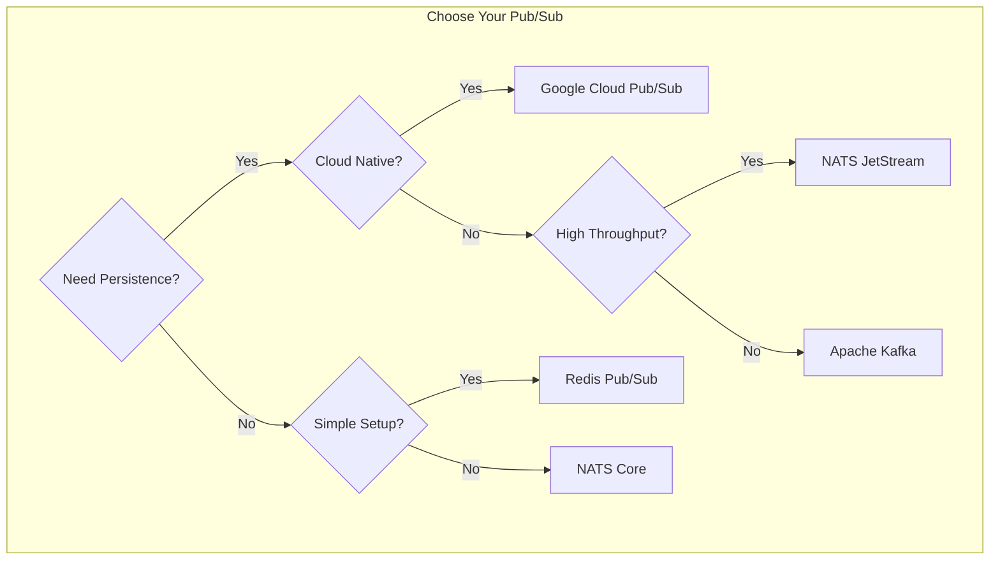

# How to Use Pub/Sub with Go

Author: [nawazdhandala](https://github.com/nawazdhandala)

Tags: Go, Pub/Sub, Messaging, Google Cloud, Event-Driven Architecture, Microservices

Description: Learn how to implement the Pub/Sub messaging pattern in Go using Google Cloud Pub/Sub, Redis, and NATS. Covers publishers, subscribers, error handling, and production best practices.

---

Pub/Sub (Publish/Subscribe) is a messaging pattern where publishers send messages to topics without knowing who will receive them, and subscribers receive messages from topics they are interested in. Go's concurrency model makes it an excellent choice for building Pub/Sub systems.

## Understanding Pub/Sub Architecture

The Pub/Sub pattern decouples message producers from consumers, enabling scalable and maintainable event-driven architectures.



## Google Cloud Pub/Sub

Google Cloud Pub/Sub is a fully managed messaging service that scales automatically. Below is a complete implementation showing how to publish and subscribe to messages.

### Installation

```bash
go get cloud.google.com/go/pubsub
```

### Publisher Implementation

The publisher creates a topic if it does not exist and sends messages with optional attributes for filtering and routing.

```go
package main

import (
    "context"
    "encoding/json"
    "fmt"
    "log"
    "time"

    "cloud.google.com/go/pubsub"
)

// OrderEvent represents an order-related event
type OrderEvent struct {
    OrderID   string    `json:"order_id"`
    UserID    string    `json:"user_id"`
    Amount    float64   `json:"amount"`
    Status    string    `json:"status"`
    CreatedAt time.Time `json:"created_at"`
}

// Publisher wraps the Pub/Sub client for publishing messages
type Publisher struct {
    client    *pubsub.Client
    projectID string
}

// NewPublisher creates a new Publisher instance with the given project ID
func NewPublisher(ctx context.Context, projectID string) (*Publisher, error) {
    // Create a Pub/Sub client - this handles authentication automatically
    // when running on GCP or with GOOGLE_APPLICATION_CREDENTIALS set
    client, err := pubsub.NewClient(ctx, projectID)
    if err != nil {
        return nil, fmt.Errorf("failed to create pubsub client: %w", err)
    }

    return &Publisher{
        client:    client,
        projectID: projectID,
    }, nil
}

// EnsureTopic creates a topic if it does not already exist
func (p *Publisher) EnsureTopic(ctx context.Context, topicID string) (*pubsub.Topic, error) {
    topic := p.client.Topic(topicID)

    // Check if topic exists
    exists, err := topic.Exists(ctx)
    if err != nil {
        return nil, fmt.Errorf("failed to check topic existence: %w", err)
    }

    if !exists {
        // Create the topic with default settings
        topic, err = p.client.CreateTopic(ctx, topicID)
        if err != nil {
            return nil, fmt.Errorf("failed to create topic: %w", err)
        }
        log.Printf("Topic %s created", topicID)
    }

    return topic, nil
}

// PublishOrder publishes an order event to the specified topic
func (p *Publisher) PublishOrder(ctx context.Context, topicID string, event OrderEvent) (string, error) {
    topic, err := p.EnsureTopic(ctx, topicID)
    if err != nil {
        return "", err
    }

    // Serialize the event to JSON
    data, err := json.Marshal(event)
    if err != nil {
        return "", fmt.Errorf("failed to marshal event: %w", err)
    }

    // Create the message with attributes for filtering
    msg := &pubsub.Message{
        Data: data,
        // Attributes enable subscribers to filter messages without parsing the body
        Attributes: map[string]string{
            "event_type": "order",
            "status":     event.Status,
            "user_id":    event.UserID,
        },
    }

    // Publish returns a future - call Get() to block until published
    result := topic.Publish(ctx, msg)

    // Get the message ID (blocks until the message is sent)
    messageID, err := result.Get(ctx)
    if err != nil {
        return "", fmt.Errorf("failed to publish message: %w", err)
    }

    log.Printf("Published message ID: %s to topic: %s", messageID, topicID)
    return messageID, nil
}

// Close releases resources held by the publisher
func (p *Publisher) Close() error {
    return p.client.Close()
}

func main() {
    ctx := context.Background()
    projectID := "your-gcp-project-id"

    publisher, err := NewPublisher(ctx, projectID)
    if err != nil {
        log.Fatal(err)
    }
    defer publisher.Close()

    // Create and publish an order event
    event := OrderEvent{
        OrderID:   "ord-12345",
        UserID:    "user-789",
        Amount:    99.99,
        Status:    "created",
        CreatedAt: time.Now(),
    }

    messageID, err := publisher.PublishOrder(ctx, "orders", event)
    if err != nil {
        log.Fatal(err)
    }

    fmt.Printf("Order event published with ID: %s\n", messageID)
}
```

### Subscriber Implementation

Subscribers receive messages asynchronously and must acknowledge them to prevent redelivery. Below is a robust subscriber with error handling and graceful shutdown.

```go
package main

import (
    "context"
    "encoding/json"
    "fmt"
    "log"
    "os"
    "os/signal"
    "sync"
    "syscall"
    "time"

    "cloud.google.com/go/pubsub"
)

// OrderEvent represents an order-related event
type OrderEvent struct {
    OrderID   string    `json:"order_id"`
    UserID    string    `json:"user_id"`
    Amount    float64   `json:"amount"`
    Status    string    `json:"status"`
    CreatedAt time.Time `json:"created_at"`
}

// MessageHandler processes received messages
type MessageHandler func(ctx context.Context, event OrderEvent) error

// Subscriber wraps the Pub/Sub client for receiving messages
type Subscriber struct {
    client    *pubsub.Client
    projectID string
}

// NewSubscriber creates a new Subscriber instance
func NewSubscriber(ctx context.Context, projectID string) (*Subscriber, error) {
    client, err := pubsub.NewClient(ctx, projectID)
    if err != nil {
        return nil, fmt.Errorf("failed to create pubsub client: %w", err)
    }

    return &Subscriber{
        client:    client,
        projectID: projectID,
    }, nil
}

// EnsureSubscription creates a subscription if it does not exist
func (s *Subscriber) EnsureSubscription(ctx context.Context, topicID, subscriptionID string) (*pubsub.Subscription, error) {
    sub := s.client.Subscription(subscriptionID)

    exists, err := sub.Exists(ctx)
    if err != nil {
        return nil, fmt.Errorf("failed to check subscription existence: %w", err)
    }

    if !exists {
        topic := s.client.Topic(topicID)

        // Configure the subscription with appropriate settings
        cfg := pubsub.SubscriptionConfig{
            Topic: topic,
            // How long to wait for ack before redelivering
            AckDeadline: 30 * time.Second,
            // Keep unacked messages for 7 days
            RetentionDuration: 7 * 24 * time.Hour,
            // Enable exactly-once delivery (requires ordering)
            EnableExactlyOnceDelivery: false,
        }

        sub, err = s.client.CreateSubscription(ctx, subscriptionID, cfg)
        if err != nil {
            return nil, fmt.Errorf("failed to create subscription: %w", err)
        }
        log.Printf("Subscription %s created", subscriptionID)
    }

    // Configure receive settings for optimal throughput
    sub.ReceiveSettings = pubsub.ReceiveSettings{
        // Maximum outstanding messages per subscriber
        MaxOutstandingMessages: 100,
        // Maximum outstanding bytes (10MB)
        MaxOutstandingBytes: 10 * 1024 * 1024,
        // Number of goroutines for processing
        NumGoroutines: 10,
    }

    return sub, nil
}

// Subscribe starts receiving messages and processes them with the handler
func (s *Subscriber) Subscribe(ctx context.Context, topicID, subscriptionID string, handler MessageHandler) error {
    sub, err := s.EnsureSubscription(ctx, topicID, subscriptionID)
    if err != nil {
        return err
    }

    log.Printf("Starting subscription %s...", subscriptionID)

    // Receive blocks and calls the callback for each message
    err = sub.Receive(ctx, func(ctx context.Context, msg *pubsub.Message) {
        // Parse the message data
        var event OrderEvent
        if err := json.Unmarshal(msg.Data, &event); err != nil {
            log.Printf("Failed to unmarshal message %s: %v", msg.ID, err)
            // Nack to requeue the message for retry
            msg.Nack()
            return
        }

        // Log message attributes for debugging
        log.Printf("Received message ID: %s, Attributes: %v", msg.ID, msg.Attributes)

        // Process the message with the handler
        if err := handler(ctx, event); err != nil {
            log.Printf("Failed to process message %s: %v", msg.ID, err)
            // Nack to requeue - message will be redelivered after ack deadline
            msg.Nack()
            return
        }

        // Acknowledge successful processing
        msg.Ack()
        log.Printf("Successfully processed message %s", msg.ID)
    })

    if err != nil && ctx.Err() == nil {
        return fmt.Errorf("subscription error: %w", err)
    }

    return nil
}

// Close releases resources held by the subscriber
func (s *Subscriber) Close() error {
    return s.client.Close()
}

func main() {
    ctx, cancel := context.WithCancel(context.Background())
    defer cancel()

    projectID := "your-gcp-project-id"

    subscriber, err := NewSubscriber(ctx, projectID)
    if err != nil {
        log.Fatal(err)
    }
    defer subscriber.Close()

    // Define the message handler
    handler := func(ctx context.Context, event OrderEvent) error {
        log.Printf("Processing order %s for user %s, amount: $%.2f",
            event.OrderID, event.UserID, event.Amount)

        // Simulate processing time
        time.Sleep(100 * time.Millisecond)

        return nil
    }

    // Handle graceful shutdown
    var wg sync.WaitGroup
    wg.Add(1)

    go func() {
        defer wg.Done()
        if err := subscriber.Subscribe(ctx, "orders", "order-processor", handler); err != nil {
            log.Printf("Subscription ended: %v", err)
        }
    }()

    // Wait for interrupt signal
    sigCh := make(chan os.Signal, 1)
    signal.Notify(sigCh, syscall.SIGINT, syscall.SIGTERM)
    <-sigCh

    log.Println("Shutting down...")
    cancel()
    wg.Wait()
    log.Println("Shutdown complete")
}
```

## Pub/Sub Message Flow

The following diagram illustrates how messages flow through Google Cloud Pub/Sub with acknowledgments.



## Redis Pub/Sub

Redis provides a lightweight Pub/Sub implementation suitable for simpler use cases. Messages are not persisted, so subscribers only receive messages published while they are connected.

### Installation

```bash
go get github.com/redis/go-redis/v9
```

### Redis Publisher and Subscriber

Below is a complete implementation showing both publishing and subscribing with Redis.

```go
package main

import (
    "context"
    "encoding/json"
    "fmt"
    "log"
    "os"
    "os/signal"
    "syscall"
    "time"

    "github.com/redis/go-redis/v9"
)

// Event represents a generic event structure
type Event struct {
    Type      string                 `json:"type"`
    Payload   map[string]interface{} `json:"payload"`
    Timestamp time.Time              `json:"timestamp"`
}

// RedisPubSub wraps the Redis client for Pub/Sub operations
type RedisPubSub struct {
    client *redis.Client
}

// NewRedisPubSub creates a new RedisPubSub instance
func NewRedisPubSub(addr, password string, db int) *RedisPubSub {
    client := redis.NewClient(&redis.Options{
        Addr:         addr,
        Password:     password,
        DB:           db,
        PoolSize:     10,              // Connection pool size
        MinIdleConns: 2,               // Minimum idle connections
        DialTimeout:  5 * time.Second, // Connection timeout
        ReadTimeout:  3 * time.Second, // Read timeout
        WriteTimeout: 3 * time.Second, // Write timeout
    })

    return &RedisPubSub{client: client}
}

// Publish sends an event to a channel
func (r *RedisPubSub) Publish(ctx context.Context, channel string, event Event) error {
    // Serialize the event to JSON
    data, err := json.Marshal(event)
    if err != nil {
        return fmt.Errorf("failed to marshal event: %w", err)
    }

    // Publish returns the number of subscribers that received the message
    result := r.client.Publish(ctx, channel, data)
    if err := result.Err(); err != nil {
        return fmt.Errorf("failed to publish: %w", err)
    }

    receivers := result.Val()
    log.Printf("Published to channel %s, received by %d subscribers", channel, receivers)

    return nil
}

// Subscribe listens for messages on the specified channels
func (r *RedisPubSub) Subscribe(ctx context.Context, handler func(channel string, event Event), channels ...string) error {
    // Create a subscription to multiple channels
    pubsub := r.client.Subscribe(ctx, channels...)
    defer pubsub.Close()

    // Wait for subscription confirmation
    _, err := pubsub.Receive(ctx)
    if err != nil {
        return fmt.Errorf("failed to subscribe: %w", err)
    }

    log.Printf("Subscribed to channels: %v", channels)

    // Get a channel for receiving messages
    ch := pubsub.Channel()

    // Process messages until context is cancelled
    for {
        select {
        case <-ctx.Done():
            log.Println("Subscription cancelled")
            return nil
        case msg := <-ch:
            if msg == nil {
                continue
            }

            // Parse the message payload
            var event Event
            if err := json.Unmarshal([]byte(msg.Payload), &event); err != nil {
                log.Printf("Failed to unmarshal message: %v", err)
                continue
            }

            // Call the handler with the parsed event
            handler(msg.Channel, event)
        }
    }
}

// SubscribePattern listens for messages matching a pattern (e.g., "orders.*")
func (r *RedisPubSub) SubscribePattern(ctx context.Context, handler func(channel string, event Event), pattern string) error {
    // PSubscribe allows glob-style patterns
    pubsub := r.client.PSubscribe(ctx, pattern)
    defer pubsub.Close()

    _, err := pubsub.Receive(ctx)
    if err != nil {
        return fmt.Errorf("failed to subscribe to pattern: %w", err)
    }

    log.Printf("Subscribed to pattern: %s", pattern)

    ch := pubsub.Channel()

    for {
        select {
        case <-ctx.Done():
            return nil
        case msg := <-ch:
            if msg == nil {
                continue
            }

            var event Event
            if err := json.Unmarshal([]byte(msg.Payload), &event); err != nil {
                log.Printf("Failed to unmarshal message: %v", err)
                continue
            }

            handler(msg.Channel, event)
        }
    }
}

// Ping checks the connection to Redis
func (r *RedisPubSub) Ping(ctx context.Context) error {
    return r.client.Ping(ctx).Err()
}

// Close closes the Redis connection
func (r *RedisPubSub) Close() error {
    return r.client.Close()
}

func main() {
    ctx, cancel := context.WithCancel(context.Background())
    defer cancel()

    // Create Redis Pub/Sub client
    rps := NewRedisPubSub("localhost:6379", "", 0)
    defer rps.Close()

    // Verify connection
    if err := rps.Ping(ctx); err != nil {
        log.Fatalf("Failed to connect to Redis: %v", err)
    }

    // Start subscriber in a goroutine
    go func() {
        handler := func(channel string, event Event) {
            log.Printf("Received on %s: type=%s, payload=%v",
                channel, event.Type, event.Payload)
        }

        if err := rps.Subscribe(ctx, handler, "orders", "users"); err != nil {
            log.Printf("Subscriber error: %v", err)
        }
    }()

    // Give subscriber time to connect
    time.Sleep(100 * time.Millisecond)

    // Publish some events
    event := Event{
        Type: "order.created",
        Payload: map[string]interface{}{
            "order_id": "ord-123",
            "amount":   49.99,
        },
        Timestamp: time.Now(),
    }

    if err := rps.Publish(ctx, "orders", event); err != nil {
        log.Printf("Publish error: %v", err)
    }

    // Wait for interrupt signal
    sigCh := make(chan os.Signal, 1)
    signal.Notify(sigCh, syscall.SIGINT, syscall.SIGTERM)
    <-sigCh

    cancel()
    time.Sleep(100 * time.Millisecond) // Allow graceful shutdown
}
```

## NATS Pub/Sub

NATS is a high-performance messaging system designed for cloud-native applications. It supports both simple Pub/Sub and persistent JetStream for durable messaging.

### Installation

```bash
go get github.com/nats-io/nats.go
```

### NATS Core Pub/Sub

NATS Core provides simple, fast Pub/Sub without message persistence. Messages are delivered to all current subscribers instantly.

```go
package main

import (
    "encoding/json"
    "log"
    "os"
    "os/signal"
    "syscall"
    "time"

    "github.com/nats-io/nats.go"
)

// Notification represents a notification event
type Notification struct {
    ID        string    `json:"id"`
    UserID    string    `json:"user_id"`
    Title     string    `json:"title"`
    Body      string    `json:"body"`
    CreatedAt time.Time `json:"created_at"`
}

// NATSPubSub wraps the NATS connection for Pub/Sub operations
type NATSPubSub struct {
    conn *nats.Conn
}

// NewNATSPubSub creates a new NATS connection with reconnection handling
func NewNATSPubSub(url string) (*NATSPubSub, error) {
    // Configure connection with automatic reconnection
    opts := []nats.Option{
        nats.Name("go-pubsub-client"),
        nats.ReconnectWait(2 * time.Second),  // Wait between reconnect attempts
        nats.MaxReconnects(10),                // Maximum reconnection attempts
        nats.PingInterval(20 * time.Second),   // Keepalive ping interval
        nats.MaxPingsOutstanding(3),           // Max pings before disconnect

        // Connection event handlers for observability
        nats.DisconnectErrHandler(func(nc *nats.Conn, err error) {
            log.Printf("Disconnected from NATS: %v", err)
        }),
        nats.ReconnectHandler(func(nc *nats.Conn) {
            log.Printf("Reconnected to NATS: %s", nc.ConnectedUrl())
        }),
        nats.ClosedHandler(func(nc *nats.Conn) {
            log.Println("NATS connection closed")
        }),
    }

    conn, err := nats.Connect(url, opts...)
    if err != nil {
        return nil, err
    }

    return &NATSPubSub{conn: conn}, nil
}

// Publish sends a notification to a subject
func (n *NATSPubSub) Publish(subject string, notification Notification) error {
    data, err := json.Marshal(notification)
    if err != nil {
        return err
    }

    // Publish is fire-and-forget in NATS Core
    return n.conn.Publish(subject, data)
}

// Subscribe creates a subscription to a subject
func (n *NATSPubSub) Subscribe(subject string, handler func(Notification)) (*nats.Subscription, error) {
    return n.conn.Subscribe(subject, func(msg *nats.Msg) {
        var notification Notification
        if err := json.Unmarshal(msg.Data, &notification); err != nil {
            log.Printf("Failed to unmarshal: %v", err)
            return
        }
        handler(notification)
    })
}

// QueueSubscribe creates a queue subscription for load balancing
// Messages are distributed among subscribers in the same queue group
func (n *NATSPubSub) QueueSubscribe(subject, queue string, handler func(Notification)) (*nats.Subscription, error) {
    return n.conn.QueueSubscribe(subject, queue, func(msg *nats.Msg) {
        var notification Notification
        if err := json.Unmarshal(msg.Data, &notification); err != nil {
            log.Printf("Failed to unmarshal: %v", err)
            return
        }
        handler(notification)
    })
}

// SubscribeWildcard subscribes to subjects matching a pattern
// Use ">" for multi-level wildcard, "*" for single-level
func (n *NATSPubSub) SubscribeWildcard(pattern string, handler func(subject string, data []byte)) (*nats.Subscription, error) {
    return n.conn.Subscribe(pattern, func(msg *nats.Msg) {
        handler(msg.Subject, msg.Data)
    })
}

// Close closes the NATS connection
func (n *NATSPubSub) Close() {
    n.conn.Drain() // Drain ensures all pending messages are processed
}

func main() {
    // Connect to NATS server
    nps, err := NewNATSPubSub(nats.DefaultURL)
    if err != nil {
        log.Fatalf("Failed to connect: %v", err)
    }
    defer nps.Close()

    // Subscribe to notifications with queue group for load balancing
    _, err = nps.QueueSubscribe("notifications.>", "notification-workers", func(n Notification) {
        log.Printf("Worker received notification %s for user %s: %s",
            n.ID, n.UserID, n.Title)
    })
    if err != nil {
        log.Fatalf("Failed to subscribe: %v", err)
    }

    // Publish a notification
    notification := Notification{
        ID:        "notif-001",
        UserID:    "user-123",
        Title:     "New Order",
        Body:      "Your order has been confirmed",
        CreatedAt: time.Now(),
    }

    if err := nps.Publish("notifications.user.user-123", notification); err != nil {
        log.Printf("Publish error: %v", err)
    }

    // Wait for interrupt
    sigCh := make(chan os.Signal, 1)
    signal.Notify(sigCh, syscall.SIGINT, syscall.SIGTERM)
    <-sigCh
}
```

### NATS JetStream for Durable Messaging

JetStream provides message persistence, replay, and exactly-once delivery semantics.

```go
package main

import (
    "context"
    "encoding/json"
    "log"
    "time"

    "github.com/nats-io/nats.go"
    "github.com/nats-io/nats.go/jetstream"
)

// Event represents a generic event
type Event struct {
    ID        string                 `json:"id"`
    Type      string                 `json:"type"`
    Data      map[string]interface{} `json:"data"`
    Timestamp time.Time              `json:"timestamp"`
}

// JetStreamPubSub provides durable Pub/Sub using NATS JetStream
type JetStreamPubSub struct {
    nc *nats.Conn
    js jetstream.JetStream
}

// NewJetStreamPubSub creates a JetStream client
func NewJetStreamPubSub(url string) (*JetStreamPubSub, error) {
    nc, err := nats.Connect(url)
    if err != nil {
        return nil, err
    }

    // Create JetStream context
    js, err := jetstream.New(nc)
    if err != nil {
        nc.Close()
        return nil, err
    }

    return &JetStreamPubSub{nc: nc, js: js}, nil
}

// CreateStream creates or updates a stream for the given subjects
func (j *JetStreamPubSub) CreateStream(ctx context.Context, name string, subjects []string) (jetstream.Stream, error) {
    // Configure the stream
    cfg := jetstream.StreamConfig{
        Name:        name,
        Description: "Event stream for " + name,
        Subjects:    subjects,
        // Store messages on disk for durability
        Storage: jetstream.FileStorage,
        // Keep messages for 7 days
        MaxAge: 7 * 24 * time.Hour,
        // Limit to 1GB of storage
        MaxBytes: 1024 * 1024 * 1024,
        // Replicate to 1 server (increase for HA)
        Replicas: 1,
        // Discard old messages when limits are reached
        Discard: jetstream.DiscardOld,
        // Allow duplicate detection within 2 minutes
        Duplicates: 2 * time.Minute,
    }

    // CreateOrUpdateStream is idempotent
    return j.js.CreateOrUpdateStream(ctx, cfg)
}

// Publish sends an event to JetStream with deduplication
func (j *JetStreamPubSub) Publish(ctx context.Context, subject string, event Event) (*jetstream.PubAck, error) {
    data, err := json.Marshal(event)
    if err != nil {
        return nil, err
    }

    // Publish with message ID for deduplication
    return j.js.Publish(ctx, subject, data,
        jetstream.WithMsgID(event.ID), // Enables deduplication
    )
}

// CreateConsumer creates a durable consumer for processing messages
func (j *JetStreamPubSub) CreateConsumer(ctx context.Context, stream, name string) (jetstream.Consumer, error) {
    cfg := jetstream.ConsumerConfig{
        Name:          name,
        Durable:       name, // Makes the consumer durable
        FilterSubject: "", // Empty means all subjects in stream
        // Deliver messages that arrive after consumer creation
        DeliverPolicy: jetstream.DeliverNewPolicy,
        // Acknowledge each message individually
        AckPolicy: jetstream.AckExplicitPolicy,
        // Wait up to 30 seconds for acknowledgment
        AckWait: 30 * time.Second,
        // Maximum delivery attempts before moving to dead letter
        MaxDeliver: 5,
        // Maximum pending unacknowledged messages
        MaxAckPending: 100,
    }

    s, err := j.js.Stream(ctx, stream)
    if err != nil {
        return nil, err
    }

    return s.CreateOrUpdateConsumer(ctx, cfg)
}

// Consume processes messages from a consumer with automatic redelivery on failure
func (j *JetStreamPubSub) Consume(ctx context.Context, consumer jetstream.Consumer, handler func(Event) error) error {
    // Create a message handler
    iter, err := consumer.Messages()
    if err != nil {
        return err
    }
    defer iter.Stop()

    for {
        select {
        case <-ctx.Done():
            return ctx.Err()
        default:
            // Fetch the next message with a timeout
            msg, err := iter.Next()
            if err != nil {
                log.Printf("Error fetching message: %v", err)
                continue
            }

            // Parse the event
            var event Event
            if err := json.Unmarshal(msg.Data(), &event); err != nil {
                log.Printf("Failed to unmarshal: %v", err)
                // Terminate the message - do not redeliver
                msg.Term()
                continue
            }

            // Process the event
            if err := handler(event); err != nil {
                log.Printf("Handler error: %v", err)
                // Negative ack - will be redelivered after AckWait
                msg.Nak()
                continue
            }

            // Acknowledge successful processing
            msg.Ack()
        }
    }
}

// Close closes the NATS connection
func (j *JetStreamPubSub) Close() {
    j.nc.Drain()
}

func main() {
    ctx := context.Background()

    js, err := NewJetStreamPubSub(nats.DefaultURL)
    if err != nil {
        log.Fatalf("Failed to connect: %v", err)
    }
    defer js.Close()

    // Create a stream for events
    _, err = js.CreateStream(ctx, "EVENTS", []string{"events.>"})
    if err != nil {
        log.Fatalf("Failed to create stream: %v", err)
    }

    // Create a durable consumer
    consumer, err := js.CreateConsumer(ctx, "EVENTS", "event-processor")
    if err != nil {
        log.Fatalf("Failed to create consumer: %v", err)
    }

    // Start consuming in a goroutine
    go func() {
        err := js.Consume(ctx, consumer, func(e Event) error {
            log.Printf("Processing event %s: type=%s", e.ID, e.Type)
            return nil
        })
        if err != nil {
            log.Printf("Consumer error: %v", err)
        }
    }()

    // Publish an event
    event := Event{
        ID:        "evt-001",
        Type:      "user.created",
        Data:      map[string]interface{}{"user_id": "123"},
        Timestamp: time.Now(),
    }

    ack, err := js.Publish(ctx, "events.user", event)
    if err != nil {
        log.Fatalf("Publish error: %v", err)
    }
    log.Printf("Published event, sequence: %d", ack.Sequence)

    // Keep running
    select {}
}
```

## Pub/Sub Comparison



## Error Handling and Retry Patterns

Robust error handling is essential for production Pub/Sub systems. Below is a reusable retry mechanism with exponential backoff.

```go
package main

import (
    "context"
    "errors"
    "fmt"
    "log"
    "math"
    "math/rand"
    "time"
)

// RetryConfig defines retry behavior
type RetryConfig struct {
    MaxAttempts  int
    InitialDelay time.Duration
    MaxDelay     time.Duration
    Multiplier   float64
}

// DefaultRetryConfig provides sensible defaults
var DefaultRetryConfig = RetryConfig{
    MaxAttempts:  5,
    InitialDelay: 100 * time.Millisecond,
    MaxDelay:     30 * time.Second,
    Multiplier:   2.0,
}

// RetryableError indicates an error that should trigger a retry
type RetryableError struct {
    Err error
}

func (e RetryableError) Error() string {
    return e.Err.Error()
}

func (e RetryableError) Unwrap() error {
    return e.Err
}

// WithRetry executes the operation with exponential backoff retry
func WithRetry(ctx context.Context, cfg RetryConfig, operation func() error) error {
    var lastErr error

    for attempt := 1; attempt <= cfg.MaxAttempts; attempt++ {
        // Execute the operation
        err := operation()
        if err == nil {
            return nil // Success
        }

        lastErr = err

        // Check if error is retryable
        var retryable RetryableError
        if !errors.As(err, &retryable) {
            // Non-retryable error, fail immediately
            return err
        }

        if attempt == cfg.MaxAttempts {
            break // No more retries
        }

        // Calculate delay with exponential backoff and jitter
        delay := calculateBackoff(cfg, attempt)

        log.Printf("Attempt %d failed: %v. Retrying in %v...", attempt, err, delay)

        // Wait before retry, respecting context cancellation
        select {
        case <-ctx.Done():
            return ctx.Err()
        case <-time.After(delay):
            // Continue to next attempt
        }
    }

    return fmt.Errorf("operation failed after %d attempts: %w", cfg.MaxAttempts, lastErr)
}

// calculateBackoff computes the delay for a given attempt with jitter
func calculateBackoff(cfg RetryConfig, attempt int) time.Duration {
    // Exponential backoff: initial * multiplier^(attempt-1)
    backoff := float64(cfg.InitialDelay) * math.Pow(cfg.Multiplier, float64(attempt-1))

    // Apply jitter (randomize +/- 25%)
    jitter := backoff * 0.25 * (rand.Float64()*2 - 1)
    backoff += jitter

    // Cap at max delay
    if backoff > float64(cfg.MaxDelay) {
        backoff = float64(cfg.MaxDelay)
    }

    return time.Duration(backoff)
}

// Example usage with a publisher
func publishWithRetry(ctx context.Context, publish func() error) error {
    return WithRetry(ctx, DefaultRetryConfig, func() error {
        err := publish()
        if err != nil {
            // Wrap transient errors as retryable
            if isTransientError(err) {
                return RetryableError{Err: err}
            }
        }
        return err
    })
}

// isTransientError determines if an error is transient and should be retried
func isTransientError(err error) bool {
    // Check for common transient error patterns
    errStr := err.Error()
    transientPatterns := []string{
        "connection refused",
        "timeout",
        "temporary failure",
        "unavailable",
        "deadline exceeded",
    }

    for _, pattern := range transientPatterns {
        if contains(errStr, pattern) {
            return true
        }
    }
    return false
}

func contains(s, substr string) bool {
    return len(s) >= len(substr) && (s == substr || len(s) > 0 && containsImpl(s, substr))
}

func containsImpl(s, substr string) bool {
    for i := 0; i <= len(s)-len(substr); i++ {
        if s[i:i+len(substr)] == substr {
            return true
        }
    }
    return false
}
```

## Dead Letter Queue Pattern

Messages that fail processing after multiple retries should be moved to a dead letter queue for investigation.

```go
package main

import (
    "context"
    "encoding/json"
    "log"
    "time"

    "cloud.google.com/go/pubsub"
)

// DeadLetterMessage wraps the original message with failure metadata
type DeadLetterMessage struct {
    OriginalData    []byte            `json:"original_data"`
    OriginalTopic   string            `json:"original_topic"`
    FailureReason   string            `json:"failure_reason"`
    AttemptCount    int               `json:"attempt_count"`
    FirstFailedAt   time.Time         `json:"first_failed_at"`
    LastFailedAt    time.Time         `json:"last_failed_at"`
    Attributes      map[string]string `json:"attributes"`
}

// DeadLetterHandler manages dead letter queue operations
type DeadLetterHandler struct {
    client      *pubsub.Client
    dlqTopicID  string
    maxAttempts int
}

// NewDeadLetterHandler creates a dead letter queue handler
func NewDeadLetterHandler(client *pubsub.Client, dlqTopicID string, maxAttempts int) *DeadLetterHandler {
    return &DeadLetterHandler{
        client:      client,
        dlqTopicID:  dlqTopicID,
        maxAttempts: maxAttempts,
    }
}

// SendToDeadLetter publishes a failed message to the dead letter queue
func (d *DeadLetterHandler) SendToDeadLetter(ctx context.Context, msg *pubsub.Message, reason string) error {
    dlqMsg := DeadLetterMessage{
        OriginalData:  msg.Data,
        OriginalTopic: msg.Attributes["original_topic"],
        FailureReason: reason,
        AttemptCount:  d.getAttemptCount(msg),
        LastFailedAt:  time.Now(),
        Attributes:    msg.Attributes,
    }

    data, err := json.Marshal(dlqMsg)
    if err != nil {
        return err
    }

    topic := d.client.Topic(d.dlqTopicID)
    result := topic.Publish(ctx, &pubsub.Message{
        Data: data,
        Attributes: map[string]string{
            "original_message_id": msg.ID,
            "failure_reason":      reason,
        },
    })

    _, err = result.Get(ctx)
    if err != nil {
        return err
    }

    log.Printf("Message %s sent to dead letter queue: %s", msg.ID, reason)
    return nil
}

// ShouldDeadLetter determines if a message should be moved to the dead letter queue
func (d *DeadLetterHandler) ShouldDeadLetter(msg *pubsub.Message) bool {
    return d.getAttemptCount(msg) >= d.maxAttempts
}

// getAttemptCount extracts the delivery attempt count from message attributes
func (d *DeadLetterHandler) getAttemptCount(msg *pubsub.Message) int {
    // Google Cloud Pub/Sub provides delivery attempt in message metadata
    // For demonstration, we use a custom attribute
    countStr, ok := msg.Attributes["delivery_attempt"]
    if !ok {
        return 1
    }

    var count int
    if _, err := json.Unmarshal([]byte(countStr), &count); err != nil {
        return 1
    }
    return count
}

// ProcessWithDeadLetter wraps message processing with dead letter handling
func ProcessWithDeadLetter(ctx context.Context, dlh *DeadLetterHandler, msg *pubsub.Message, process func() error) {
    err := process()
    if err != nil {
        if dlh.ShouldDeadLetter(msg) {
            // Move to dead letter queue
            if dlqErr := dlh.SendToDeadLetter(ctx, msg, err.Error()); dlqErr != nil {
                log.Printf("Failed to send to DLQ: %v", dlqErr)
                msg.Nack() // Retry later
                return
            }
            msg.Ack() // Acknowledge after moving to DLQ
        } else {
            msg.Nack() // Retry with backoff
        }
        return
    }
    msg.Ack()
}
```

## Summary

| Feature | Google Cloud Pub/Sub | Redis Pub/Sub | NATS Core | NATS JetStream |
|---------|---------------------|---------------|-----------|----------------|
| Persistence | Yes | No | No | Yes |
| Ordering | Optional | No | No | Yes |
| Replay | Yes | No | No | Yes |
| Scalability | Automatic | Manual | High | High |
| Setup | Managed | Simple | Simple | Moderate |
| Use Case | Production | Caching/Real-time | Real-time | Event Sourcing |

Pub/Sub provides a powerful pattern for building decoupled, scalable systems. Choose Google Cloud Pub/Sub for managed infrastructure, Redis for simple real-time messaging, NATS Core for high-throughput scenarios, and NATS JetStream when you need persistence and replay capabilities. Implement proper error handling with retry logic and dead letter queues to build resilient messaging systems.
