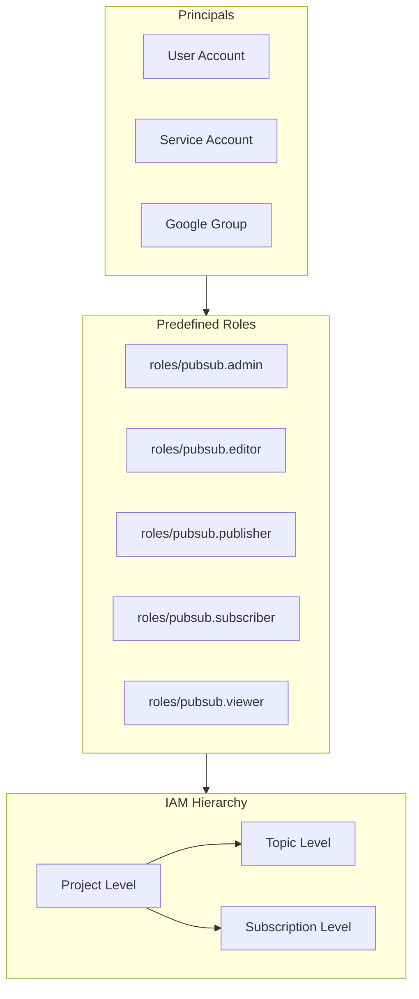
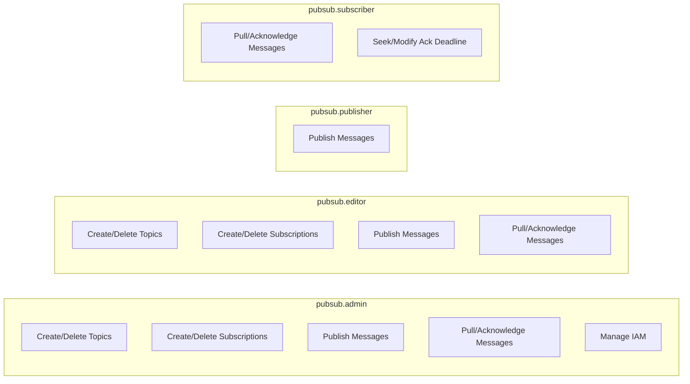
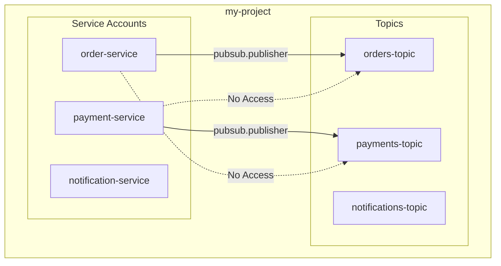
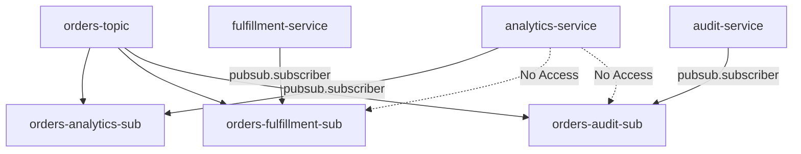
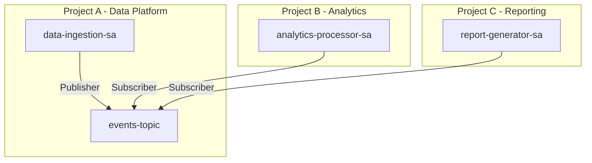

# How to Configure Pub/Sub IAM Permissions

Author: [nawazdhandala](https://www.github.com/nawazdhandala)

Tags: Google Cloud, Pub/Sub, IAM, Security, Permissions, GCP, Messaging, DevOps

Description: A practical guide to configuring IAM permissions for Google Cloud Pub/Sub, covering roles, service accounts, topic and subscription-level permissions, and security best practices.

---

Google Cloud Pub/Sub provides powerful messaging capabilities, but without proper IAM configuration, you risk either exposing sensitive data or blocking legitimate access. Properly configured permissions ensure that publishers can only publish, subscribers can only subscribe, and administrators have the control they need.

## Understanding Pub/Sub IAM Model

Pub/Sub uses Google Cloud's Identity and Access Management (IAM) to control access at multiple levels: project, topic, and subscription.



### Key Concepts

**Principals** are the identities that receive permissions:
- User accounts (individual Google accounts)
- Service accounts (for applications)
- Google Groups (for teams)
- Domains (for organization-wide access)

**Roles** are collections of permissions:
- Predefined roles provide common permission sets
- Custom roles allow fine-grained control

## Predefined Pub/Sub Roles

Google Cloud offers several predefined roles for Pub/Sub. Choosing the right role follows the principle of least privilege.

| Role | Description | Use Case |
|------|-------------|----------|
| `roles/pubsub.admin` | Full control over topics and subscriptions | Platform administrators |
| `roles/pubsub.editor` | Create, update, delete topics and subscriptions | DevOps teams |
| `roles/pubsub.publisher` | Publish messages to topics | Producer applications |
| `roles/pubsub.subscriber` | Consume messages from subscriptions | Consumer applications |
| `roles/pubsub.viewer` | Read-only access | Monitoring and auditing |



## Setting Up Service Accounts

Service accounts are the recommended way to authenticate applications. Each microservice should have its own service account with minimal permissions.

### Creating a Service Account for a Publisher

The following gcloud command creates a service account specifically for publishing messages.

```bash
# Create service account for the order service publisher
gcloud iam service-accounts create order-service-publisher \
    --display-name="Order Service Publisher" \
    --description="Service account for order service to publish events"
```

### Creating a Service Account for a Subscriber

Similarly, create a separate service account for consuming messages.

```bash
# Create service account for the notification service subscriber
gcloud iam service-accounts create notification-subscriber \
    --display-name="Notification Service Subscriber" \
    --description="Service account for notification service to consume events"
```

### Listing Service Accounts

Verify your service accounts were created correctly.

```bash
# List all service accounts in the project
gcloud iam service-accounts list --filter="displayName:Publisher OR displayName:Subscriber"
```

## Granting Project-Level Permissions

Project-level permissions apply to all topics and subscriptions within a project. Use these for broad access requirements.

### Grant Publisher Role at Project Level

The following command grants the publisher role to a service account across all topics in the project.

```bash
# Grant publisher role to order service
gcloud projects add-iam-policy-binding my-project-id \
    --member="serviceAccount:order-service-publisher@my-project-id.iam.gserviceaccount.com" \
    --role="roles/pubsub.publisher"
```

### Grant Subscriber Role at Project Level

Grant subscription access for services that need to consume from multiple subscriptions.

```bash
# Grant subscriber role to notification service
gcloud projects add-iam-policy-binding my-project-id \
    --member="serviceAccount:notification-subscriber@my-project-id.iam.gserviceaccount.com" \
    --role="roles/pubsub.subscriber"
```

### Grant Viewer Role for Monitoring

Monitoring tools need read-only access to observe metrics and configurations.

```bash
# Grant viewer role to monitoring service account
gcloud projects add-iam-policy-binding my-project-id \
    --member="serviceAccount:monitoring-sa@my-project-id.iam.gserviceaccount.com" \
    --role="roles/pubsub.viewer"
```

## Granting Topic-Level Permissions

Topic-level permissions provide fine-grained control over who can publish to specific topics. Use these when services should only access certain topics.



### Grant Publisher Permission on a Specific Topic

Limit a service account to publishing only on a designated topic.

```bash
# Grant publisher role only on orders topic
gcloud pubsub topics add-iam-policy-binding orders-topic \
    --member="serviceAccount:order-service-publisher@my-project-id.iam.gserviceaccount.com" \
    --role="roles/pubsub.publisher"
```

### Grant Multiple Publishers to a Topic

Multiple services may need to publish to the same topic. Add each service account separately.

```bash
# Allow inventory service to also publish to orders topic
gcloud pubsub topics add-iam-policy-binding orders-topic \
    --member="serviceAccount:inventory-service@my-project-id.iam.gserviceaccount.com" \
    --role="roles/pubsub.publisher"

# Allow shipping service to publish to orders topic
gcloud pubsub topics add-iam-policy-binding orders-topic \
    --member="serviceAccount:shipping-service@my-project-id.iam.gserviceaccount.com" \
    --role="roles/pubsub.publisher"
```

### View Topic IAM Policy

Audit the current permissions on a topic.

```bash
# Get the IAM policy for a topic
gcloud pubsub topics get-iam-policy orders-topic --format=yaml
```

## Granting Subscription-Level Permissions

Subscription-level permissions control who can consume messages from specific subscriptions. Multiple subscriptions can exist for a single topic, each with different access controls.



### Grant Subscriber Permission on a Specific Subscription

Restrict a service account to consuming from only its designated subscription.

```bash
# Grant subscriber role only on analytics subscription
gcloud pubsub subscriptions add-iam-policy-binding orders-analytics-sub \
    --member="serviceAccount:analytics-service@my-project-id.iam.gserviceaccount.com" \
    --role="roles/pubsub.subscriber"
```

### Grant Subscription Viewer for Monitoring

Allow monitoring tools to view subscription metrics without consuming messages.

```bash
# Grant viewer role for monitoring subscription health
gcloud pubsub subscriptions add-iam-policy-binding orders-analytics-sub \
    --member="serviceAccount:monitoring-sa@my-project-id.iam.gserviceaccount.com" \
    --role="roles/pubsub.viewer"
```

## Using Terraform for IAM Configuration

Infrastructure as Code ensures consistent and auditable IAM configurations. Terraform is an excellent choice for managing Pub/Sub IAM.

### Complete Terraform Configuration

The following Terraform configuration sets up topics, subscriptions, and IAM bindings with proper separation of concerns.

```hcl
# Provider configuration for Google Cloud
terraform {
  required_providers {
    google = {
      source  = "hashicorp/google"
      version = "~> 5.0"
    }
  }
}

provider "google" {
  project = var.project_id
  region  = var.region
}

# Variables for reusability
variable "project_id" {
  description = "The GCP project ID"
  type        = string
}

variable "region" {
  description = "The GCP region"
  type        = string
  default     = "us-central1"
}

# Create service accounts for different services
resource "google_service_account" "order_publisher" {
  account_id   = "order-service-publisher"
  display_name = "Order Service Publisher"
  description  = "Service account for order service to publish events"
}

resource "google_service_account" "analytics_subscriber" {
  account_id   = "analytics-subscriber"
  display_name = "Analytics Subscriber"
  description  = "Service account for analytics service to consume events"
}

resource "google_service_account" "fulfillment_subscriber" {
  account_id   = "fulfillment-subscriber"
  display_name = "Fulfillment Subscriber"
  description  = "Service account for fulfillment service to consume events"
}

# Create the orders topic
resource "google_pubsub_topic" "orders" {
  name = "orders-topic"

  labels = {
    environment = "production"
    team        = "platform"
  }

  # Message retention for replay capability
  message_retention_duration = "86400s"
}

# Create subscriptions for different consumers
resource "google_pubsub_subscription" "orders_analytics" {
  name  = "orders-analytics-sub"
  topic = google_pubsub_topic.orders.id

  # Acknowledge deadline of 60 seconds
  ack_deadline_seconds = 60

  # Retain acknowledged messages for 7 days
  retain_acked_messages = true
  message_retention_duration = "604800s"

  # Enable exactly-once delivery
  enable_exactly_once_delivery = true

  labels = {
    consumer = "analytics"
  }
}

resource "google_pubsub_subscription" "orders_fulfillment" {
  name  = "orders-fulfillment-sub"
  topic = google_pubsub_topic.orders.id

  ack_deadline_seconds = 30

  # Dead letter policy for failed messages
  dead_letter_policy {
    dead_letter_topic     = google_pubsub_topic.dead_letter.id
    max_delivery_attempts = 5
  }

  labels = {
    consumer = "fulfillment"
  }
}

# Dead letter topic for failed messages
resource "google_pubsub_topic" "dead_letter" {
  name = "orders-dead-letter"
}

# IAM binding for publisher on topic
resource "google_pubsub_topic_iam_binding" "orders_publishers" {
  topic = google_pubsub_topic.orders.name
  role  = "roles/pubsub.publisher"

  members = [
    "serviceAccount:${google_service_account.order_publisher.email}",
  ]
}

# IAM binding for analytics subscriber
resource "google_pubsub_subscription_iam_binding" "analytics_subscribers" {
  subscription = google_pubsub_subscription.orders_analytics.name
  role         = "roles/pubsub.subscriber"

  members = [
    "serviceAccount:${google_service_account.analytics_subscriber.email}",
  ]
}

# IAM binding for fulfillment subscriber
resource "google_pubsub_subscription_iam_binding" "fulfillment_subscribers" {
  subscription = google_pubsub_subscription.orders_fulfillment.name
  role         = "roles/pubsub.subscriber"

  members = [
    "serviceAccount:${google_service_account.fulfillment_subscriber.email}",
  ]
}

# Output the service account emails for application configuration
output "order_publisher_email" {
  value       = google_service_account.order_publisher.email
  description = "Email of the order publisher service account"
}

output "analytics_subscriber_email" {
  value       = google_service_account.analytics_subscriber.email
  description = "Email of the analytics subscriber service account"
}
```

### Using Terraform Modules for Reusability

Create a reusable module for consistent Pub/Sub configurations across projects.

```hcl
# modules/pubsub-topic/main.tf

variable "topic_name" {
  description = "Name of the Pub/Sub topic"
  type        = string
}

variable "publisher_service_accounts" {
  description = "List of service account emails allowed to publish"
  type        = list(string)
  default     = []
}

variable "subscriptions" {
  description = "Map of subscriptions with their subscriber service accounts"
  type = map(object({
    subscriber_service_accounts = list(string)
    ack_deadline_seconds        = number
    enable_dead_letter          = bool
  }))
  default = {}
}

resource "google_pubsub_topic" "main" {
  name                       = var.topic_name
  message_retention_duration = "86400s"
}

resource "google_pubsub_topic_iam_binding" "publishers" {
  count = length(var.publisher_service_accounts) > 0 ? 1 : 0

  topic = google_pubsub_topic.main.name
  role  = "roles/pubsub.publisher"

  members = [
    for sa in var.publisher_service_accounts : "serviceAccount:${sa}"
  ]
}

resource "google_pubsub_subscription" "subscriptions" {
  for_each = var.subscriptions

  name                 = each.key
  topic                = google_pubsub_topic.main.id
  ack_deadline_seconds = each.value.ack_deadline_seconds
}

resource "google_pubsub_subscription_iam_binding" "subscribers" {
  for_each = var.subscriptions

  subscription = google_pubsub_subscription.subscriptions[each.key].name
  role         = "roles/pubsub.subscriber"

  members = [
    for sa in each.value.subscriber_service_accounts : "serviceAccount:${sa}"
  ]
}
```

## Creating Custom IAM Roles

When predefined roles grant too many permissions, create custom roles with only the specific permissions needed.

### Identifying Required Permissions

Pub/Sub permissions follow a consistent naming pattern.

| Permission | Description |
|------------|-------------|
| `pubsub.topics.create` | Create new topics |
| `pubsub.topics.delete` | Delete topics |
| `pubsub.topics.get` | Get topic configuration |
| `pubsub.topics.list` | List topics |
| `pubsub.topics.publish` | Publish messages |
| `pubsub.subscriptions.create` | Create subscriptions |
| `pubsub.subscriptions.delete` | Delete subscriptions |
| `pubsub.subscriptions.consume` | Pull and acknowledge messages |
| `pubsub.subscriptions.get` | Get subscription configuration |

### Create a Custom Publisher Role

Create a role that only allows publishing and viewing topic configuration.

```bash
# Create custom role with limited permissions
gcloud iam roles create pubsubLimitedPublisher \
    --project=my-project-id \
    --title="Limited Pub/Sub Publisher" \
    --description="Can only publish messages and view topics" \
    --permissions="pubsub.topics.publish,pubsub.topics.get,pubsub.topics.list"
```

### Create a Custom Role with Terraform

Define custom roles as code for version control and consistency.

```hcl
# Custom role for message publishing without topic management
resource "google_project_iam_custom_role" "pubsub_message_publisher" {
  role_id     = "pubsubMessagePublisher"
  title       = "Pub/Sub Message Publisher"
  description = "Can publish messages but cannot manage topics"

  permissions = [
    "pubsub.topics.publish",
    "pubsub.topics.get",
    "pubsub.topics.list",
  ]
}

# Custom role for subscription consumption without management
resource "google_project_iam_custom_role" "pubsub_message_consumer" {
  role_id     = "pubsubMessageConsumer"
  title       = "Pub/Sub Message Consumer"
  description = "Can consume messages but cannot manage subscriptions"

  permissions = [
    "pubsub.subscriptions.consume",
    "pubsub.subscriptions.get",
    "pubsub.subscriptions.list",
  ]
}

# Assign custom role to service account
resource "google_project_iam_member" "order_publisher_custom" {
  project = var.project_id
  role    = google_project_iam_custom_role.pubsub_message_publisher.id
  member  = "serviceAccount:${google_service_account.order_publisher.email}"
}
```

## Cross-Project Access

In multi-project architectures, services in one project may need to access Pub/Sub resources in another project.



### Grant Cross-Project Publisher Access

Allow a service account from another project to publish to your topic.

```bash
# Grant publisher access to service account from project-b
gcloud pubsub topics add-iam-policy-binding events-topic \
    --project=project-a \
    --member="serviceAccount:analytics-processor@project-b.iam.gserviceaccount.com" \
    --role="roles/pubsub.publisher"
```

### Grant Cross-Project Subscriber Access

Allow a service account from another project to consume from your subscription.

```bash
# Create subscription in project-a for project-c consumer
gcloud pubsub subscriptions create reporting-sub \
    --project=project-a \
    --topic=events-topic

# Grant subscriber access to service account from project-c
gcloud pubsub subscriptions add-iam-policy-binding reporting-sub \
    --project=project-a \
    --member="serviceAccount:report-generator@project-c.iam.gserviceaccount.com" \
    --role="roles/pubsub.subscriber"
```

## Best Practices for Pub/Sub IAM

### 1. Follow the Principle of Least Privilege

Grant only the permissions required for each service to function. A publisher should not have subscriber permissions.

```bash
# Good: Grant only publisher role to publishing service
gcloud pubsub topics add-iam-policy-binding orders-topic \
    --member="serviceAccount:order-service@my-project.iam.gserviceaccount.com" \
    --role="roles/pubsub.publisher"

# Bad: Granting editor role when only publishing is needed
# gcloud projects add-iam-policy-binding my-project \
#     --member="serviceAccount:order-service@my-project.iam.gserviceaccount.com" \
#     --role="roles/pubsub.editor"
```

### 2. Use Resource-Level Permissions

Prefer topic and subscription-level permissions over project-level permissions for production workloads.

```bash
# Better: Topic-level permission
gcloud pubsub topics add-iam-policy-binding specific-topic \
    --member="serviceAccount:my-service@project.iam.gserviceaccount.com" \
    --role="roles/pubsub.publisher"

# Avoid for production: Project-level permission
# gcloud projects add-iam-policy-binding my-project \
#     --member="serviceAccount:my-service@project.iam.gserviceaccount.com" \
#     --role="roles/pubsub.publisher"
```

### 3. Use Service Accounts, Not User Accounts

Applications should always authenticate using service accounts, never user credentials.

```python
# Good: Using service account with explicit credentials
from google.cloud import pubsub_v1
from google.oauth2 import service_account

# Load credentials from file or environment
credentials = service_account.Credentials.from_service_account_file(
    '/path/to/service-account-key.json'
)

# Create publisher with service account credentials
publisher = pubsub_v1.PublisherClient(credentials=credentials)

# Publish a message
topic_path = publisher.topic_path('my-project', 'orders-topic')
future = publisher.publish(topic_path, b'Order created', order_id='12345')
print(f'Published message ID: {future.result()}')
```

### 4. Implement Service Account Key Rotation

Regularly rotate service account keys to minimize the impact of compromised credentials.

```bash
# Create a new key for the service account
gcloud iam service-accounts keys create new-key.json \
    --iam-account=order-service@my-project.iam.gserviceaccount.com

# List existing keys to identify old ones
gcloud iam service-accounts keys list \
    --iam-account=order-service@my-project.iam.gserviceaccount.com

# Delete old key after updating applications
gcloud iam service-accounts keys delete OLD_KEY_ID \
    --iam-account=order-service@my-project.iam.gserviceaccount.com
```

### 5. Use Workload Identity for GKE

When running on Google Kubernetes Engine, use Workload Identity instead of service account keys.

```yaml
# Kubernetes ServiceAccount with Workload Identity annotation
apiVersion: v1
kind: ServiceAccount
metadata:
  name: order-service
  namespace: production
  annotations:
    # Link Kubernetes SA to Google Cloud SA
    iam.gke.io/gcp-service-account: order-service-publisher@my-project.iam.gserviceaccount.com
```

Bind the Kubernetes service account to the Google Cloud service account.

```bash
# Allow Kubernetes SA to impersonate Google Cloud SA
gcloud iam service-accounts add-iam-policy-binding \
    order-service-publisher@my-project.iam.gserviceaccount.com \
    --role="roles/iam.workloadIdentityUser" \
    --member="serviceAccount:my-project.svc.id.goog[production/order-service]"
```

## Auditing and Monitoring IAM

### Enable Audit Logging

Configure Cloud Audit Logs to track IAM changes and access patterns.

```bash
# View IAM audit logs for Pub/Sub
gcloud logging read 'resource.type="pubsub_topic" AND protoPayload.methodName:"SetIamPolicy"' \
    --limit=10 \
    --format=json
```

### Create Alerts for IAM Changes

Set up alerts when IAM policies are modified unexpectedly.

```bash
# Create alerting policy for IAM changes
gcloud alpha monitoring policies create \
    --display-name="Pub/Sub IAM Policy Changes" \
    --condition-display-name="IAM Policy Modified" \
    --condition-filter='resource.type="pubsub_topic" AND protoPayload.methodName:"SetIamPolicy"' \
    --notification-channels=CHANNEL_ID
```

### Regular Permission Audits

Periodically review IAM bindings to ensure they remain appropriate.

```bash
#!/bin/bash
# Script to audit Pub/Sub IAM permissions

echo "=== Project-Level Pub/Sub Permissions ==="
gcloud projects get-iam-policy my-project \
    --filter="bindings.role:roles/pubsub" \
    --format="table(bindings.role,bindings.members)"

echo -e "\n=== Topic-Level Permissions ==="
for topic in $(gcloud pubsub topics list --format="value(name)"); do
    echo "Topic: $topic"
    gcloud pubsub topics get-iam-policy $topic --format=yaml
    echo "---"
done

echo -e "\n=== Subscription-Level Permissions ==="
for sub in $(gcloud pubsub subscriptions list --format="value(name)"); do
    echo "Subscription: $sub"
    gcloud pubsub subscriptions get-iam-policy $sub --format=yaml
    echo "---"
done
```

## Troubleshooting Permission Issues

### Common Error Messages

**PERMISSION_DENIED: User not authorized**

Check that the service account has the correct role and the role is bound at the appropriate level.

```bash
# Verify service account roles
gcloud projects get-iam-policy my-project \
    --flatten="bindings[].members" \
    --filter="bindings.members:order-service@my-project.iam.gserviceaccount.com" \
    --format="table(bindings.role)"
```

**Topic not found or access denied**

Ensure the service account has at least viewer permission on the topic.

```bash
# Check topic-level permissions
gcloud pubsub topics get-iam-policy orders-topic
```

### Testing Permissions

Use the `testIamPermissions` method to verify what actions a service account can perform.

```bash
# Test if service account can publish
gcloud pubsub topics test-iam-permissions orders-topic \
    --permissions="pubsub.topics.publish" \
    --impersonate-service-account=order-service@my-project.iam.gserviceaccount.com
```

---

Properly configured IAM permissions are essential for secure Pub/Sub deployments. By following the principle of least privilege, using resource-level permissions, and implementing regular audits, you can build a messaging infrastructure that is both functional and secure. Start with the predefined roles for simplicity, then create custom roles as your security requirements mature.
