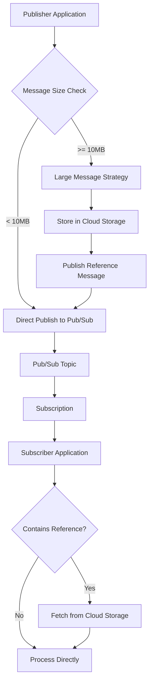
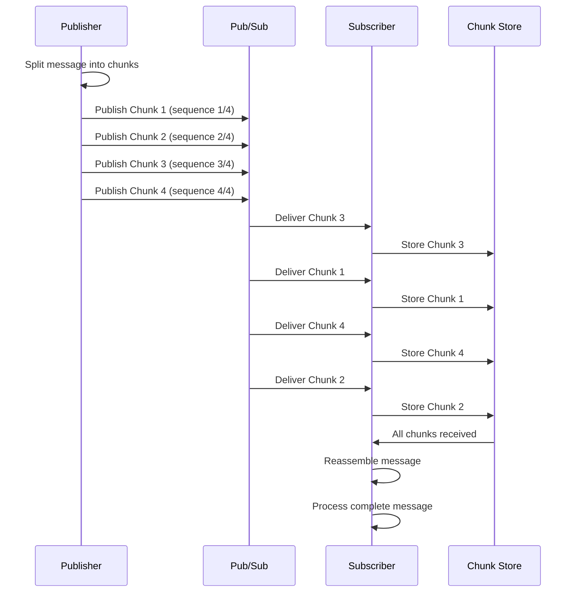
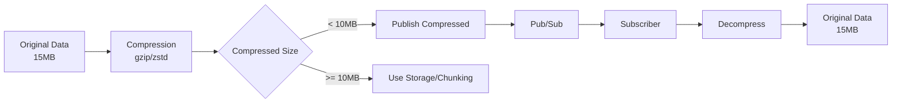
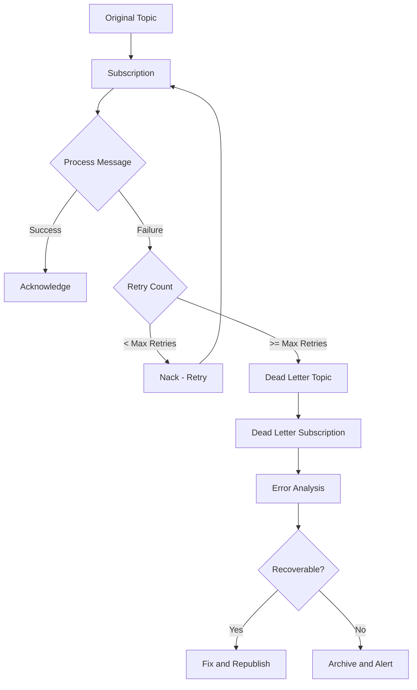

# How to Handle Large Messages in Pub/Sub

Author: [nicktackes](https://www.github.com/nicktackes)

Tags: Google Cloud, Pub/Sub, Large Messages, Cloud Storage, Messaging, Python

Description: Learn how to handle messages larger than Pub/Sub's 10MB limit using Cloud Storage references, chunking, and compression strategies.

Google Cloud Pub/Sub imposes a 10MB message size limit, which can be challenging when dealing with large payloads like images, documents, or extensive datasets. When your application needs to process messages exceeding these limits, you need strategies to work around the constraints while maintaining reliable message delivery and processing.

## Understanding Pub/Sub Message Limits

Pub/Sub enforces specific limits to ensure system reliability and performance. The maximum message size is 10MB, which includes both the message data and any attributes. Understanding these constraints helps you design systems that work efficiently within the boundaries.

The following diagram illustrates the message flow and size constraints in Pub/Sub:



## Strategy 1: Cloud Storage Reference Pattern

The most common approach for handling large messages involves storing the payload in Cloud Storage and sending a reference through Pub/Sub. Publishers upload large data to a bucket and publish a small message containing the object location.

### Publisher Implementation in Python

The following code demonstrates how to upload large data to Cloud Storage and publish a reference message containing the object location:

```python
from google.cloud import pubsub_v1
from google.cloud import storage
import json
import uuid
import hashlib
from datetime import datetime

class LargeMessagePublisher:
    """
    Handles publishing of large messages by storing payloads
    in Cloud Storage and sending references via Pub/Sub.
    """

    def __init__(self, project_id, topic_id, bucket_name):
        # Initialize Pub/Sub publisher client
        self.publisher = pubsub_v1.PublisherClient()
        self.topic_path = self.publisher.topic_path(project_id, topic_id)

        # Initialize Cloud Storage client
        self.storage_client = storage.Client()
        self.bucket = self.storage_client.bucket(bucket_name)

        # Define threshold for large messages (8MB to leave room for metadata)
        self.size_threshold = 8 * 1024 * 1024

    def publish(self, data, attributes=None):
        """
        Publish message, automatically handling large payloads
        by storing them in Cloud Storage when necessary.
        """
        attributes = attributes or {}

        # Convert data to bytes if needed
        if isinstance(data, str):
            data_bytes = data.encode('utf-8')
        elif isinstance(data, dict):
            data_bytes = json.dumps(data).encode('utf-8')
        else:
            data_bytes = data

        # Check if message exceeds size threshold
        if len(data_bytes) > self.size_threshold:
            return self._publish_large_message(data_bytes, attributes)
        else:
            return self._publish_direct(data_bytes, attributes)

    def _publish_large_message(self, data_bytes, attributes):
        """
        Store large payload in Cloud Storage and publish reference.
        """
        # Generate unique object name with timestamp for organization
        timestamp = datetime.utcnow().strftime('%Y/%m/%d/%H')
        unique_id = str(uuid.uuid4())
        object_name = f"pubsub-large-messages/{timestamp}/{unique_id}.bin"

        # Calculate checksum for data integrity verification
        checksum = hashlib.sha256(data_bytes).hexdigest()

        # Upload payload to Cloud Storage with metadata
        blob = self.bucket.blob(object_name)
        blob.metadata = {
            'original_size': str(len(data_bytes)),
            'checksum': checksum,
            'content_type': attributes.get('content_type', 'application/octet-stream')
        }
        blob.upload_from_string(data_bytes)

        # Create reference message with storage location
        reference_message = {
            'type': 'large_message_reference',
            'bucket': self.bucket.name,
            'object': object_name,
            'size': len(data_bytes),
            'checksum': checksum
        }

        # Add marker attribute to indicate large message
        attributes['large_message'] = 'true'
        attributes['storage_bucket'] = self.bucket.name
        attributes['storage_object'] = object_name

        # Publish the reference message
        message_data = json.dumps(reference_message).encode('utf-8')
        future = self.publisher.publish(
            self.topic_path,
            message_data,
            **attributes
        )

        print(f"Large message stored at gs://{self.bucket.name}/{object_name}")
        return future.result()

    def _publish_direct(self, data_bytes, attributes):
        """
        Publish message directly when within size limits.
        """
        future = self.publisher.publish(
            self.topic_path,
            data_bytes,
            **attributes
        )
        return future.result()


# Example usage demonstrating large message publishing
if __name__ == '__main__':
    publisher = LargeMessagePublisher(
        project_id='my-project',
        topic_id='large-messages-topic',
        bucket_name='my-large-messages-bucket'
    )

    # Simulate a large payload (15MB of data)
    large_data = b'x' * (15 * 1024 * 1024)

    message_id = publisher.publish(
        large_data,
        attributes={'content_type': 'application/octet-stream'}
    )
    print(f"Published message with ID: {message_id}")
```

### Subscriber Implementation in Python

Subscribers must detect reference messages and fetch the actual payload from Cloud Storage before processing:

```python
from google.cloud import pubsub_v1
from google.cloud import storage
import json
import hashlib
from concurrent.futures import TimeoutError

class LargeMessageSubscriber:
    """
    Handles consumption of messages, automatically fetching
    large payloads from Cloud Storage when references are detected.
    """

    def __init__(self, project_id, subscription_id):
        # Initialize Pub/Sub subscriber client
        self.subscriber = pubsub_v1.SubscriberClient()
        self.subscription_path = self.subscriber.subscription_path(
            project_id, subscription_id
        )

        # Initialize Cloud Storage client for fetching large messages
        self.storage_client = storage.Client()

    def process_message(self, message):
        """
        Process incoming message, fetching from Cloud Storage
        if it contains a large message reference.
        """
        try:
            # Check if message is a large message reference
            if message.attributes.get('large_message') == 'true':
                data = self._fetch_large_message(message)
            else:
                data = message.data

            # Process the actual payload
            self._handle_payload(data, message.attributes)

            # Acknowledge successful processing
            message.ack()
            print(f"Successfully processed message {message.message_id}")

        except Exception as e:
            print(f"Error processing message: {e}")
            # Negative acknowledgment for retry
            message.nack()

    def _fetch_large_message(self, message):
        """
        Fetch large message payload from Cloud Storage
        and verify data integrity using checksum.
        """
        # Parse the reference message
        reference = json.loads(message.data.decode('utf-8'))

        bucket_name = reference['bucket']
        object_name = reference['object']
        expected_checksum = reference['checksum']

        # Fetch the payload from Cloud Storage
        bucket = self.storage_client.bucket(bucket_name)
        blob = bucket.blob(object_name)
        data = blob.download_as_bytes()

        # Verify data integrity with checksum
        actual_checksum = hashlib.sha256(data).hexdigest()
        if actual_checksum != expected_checksum:
            raise ValueError(
                f"Checksum mismatch: expected {expected_checksum}, "
                f"got {actual_checksum}"
            )

        print(f"Fetched large message ({len(data)} bytes) from Cloud Storage")
        return data

    def _handle_payload(self, data, attributes):
        """
        Process the actual message payload.
        Override this method with your business logic.
        """
        content_type = attributes.get('content_type', 'unknown')
        print(f"Processing payload of {len(data)} bytes, type: {content_type}")

        # Your processing logic here
        # Example: save to database, process image, etc.

    def start(self, timeout=None):
        """
        Start listening for messages with optional timeout.
        """
        streaming_pull_future = self.subscriber.subscribe(
            self.subscription_path,
            callback=self.process_message
        )

        print(f"Listening for messages on {self.subscription_path}")

        try:
            streaming_pull_future.result(timeout=timeout)
        except TimeoutError:
            streaming_pull_future.cancel()
            streaming_pull_future.result()


# Example usage for subscribing to large messages
if __name__ == '__main__':
    subscriber = LargeMessageSubscriber(
        project_id='my-project',
        subscription_id='large-messages-subscription'
    )

    # Start listening for messages
    subscriber.start(timeout=300)
```

## Strategy 2: Message Chunking

When Cloud Storage is not available or you need to keep data within Pub/Sub, message chunking splits large payloads into smaller pieces that are reassembled by subscribers.



### Chunking Publisher Implementation

The following implementation splits large messages into ordered chunks with metadata for reassembly:

```python
from google.cloud import pubsub_v1
import json
import uuid
import hashlib
import math

class ChunkingPublisher:
    """
    Splits large messages into chunks that fit within
    Pub/Sub message size limits.
    """

    def __init__(self, project_id, topic_id, chunk_size=5 * 1024 * 1024):
        # Initialize publisher client
        self.publisher = pubsub_v1.PublisherClient()
        self.topic_path = self.publisher.topic_path(project_id, topic_id)

        # Set chunk size (default 5MB to leave room for metadata)
        self.chunk_size = chunk_size

    def publish_chunked(self, data, attributes=None):
        """
        Split large data into chunks and publish each with
        sequencing metadata for reassembly.
        """
        attributes = attributes or {}

        # Convert to bytes if necessary
        if isinstance(data, str):
            data_bytes = data.encode('utf-8')
        else:
            data_bytes = data

        # Generate unique message ID for correlating chunks
        message_id = str(uuid.uuid4())

        # Calculate total number of chunks needed
        total_chunks = math.ceil(len(data_bytes) / self.chunk_size)

        # Calculate checksum of complete message for verification
        full_checksum = hashlib.sha256(data_bytes).hexdigest()

        published_ids = []

        # Split and publish each chunk
        for i in range(total_chunks):
            # Extract chunk data
            start = i * self.chunk_size
            end = min(start + self.chunk_size, len(data_bytes))
            chunk_data = data_bytes[start:end]

            # Create chunk metadata for reassembly
            chunk_attributes = {
                **attributes,
                'chunked_message': 'true',
                'message_id': message_id,
                'chunk_index': str(i),
                'total_chunks': str(total_chunks),
                'chunk_checksum': hashlib.sha256(chunk_data).hexdigest(),
                'full_checksum': full_checksum,
                'total_size': str(len(data_bytes))
            }

            # Publish the chunk
            future = self.publisher.publish(
                self.topic_path,
                chunk_data,
                **chunk_attributes
            )
            published_ids.append(future.result())

            print(f"Published chunk {i + 1}/{total_chunks} for message {message_id}")

        return {
            'message_id': message_id,
            'total_chunks': total_chunks,
            'published_ids': published_ids
        }


# Example of publishing a chunked message
if __name__ == '__main__':
    publisher = ChunkingPublisher(
        project_id='my-project',
        topic_id='chunked-messages-topic',
        chunk_size=5 * 1024 * 1024  # 5MB chunks
    )

    # Create a 25MB payload to be chunked
    large_payload = b'Sample data block ' * (25 * 1024 * 1024 // 18)

    result = publisher.publish_chunked(
        large_payload,
        attributes={'content_type': 'application/octet-stream'}
    )

    print(f"Message {result['message_id']} split into {result['total_chunks']} chunks")
```

### Chunking Subscriber with Reassembly

The subscriber must collect all chunks, store them temporarily, and reassemble when complete:

```python
from google.cloud import pubsub_v1
import json
import hashlib
import threading
from collections import defaultdict
from datetime import datetime, timedelta

class ChunkingSubscriber:
    """
    Reassembles chunked messages by collecting all chunks
    and verifying data integrity before processing.
    """

    def __init__(self, project_id, subscription_id, chunk_timeout=300):
        # Initialize subscriber client
        self.subscriber = pubsub_v1.SubscriberClient()
        self.subscription_path = self.subscriber.subscription_path(
            project_id, subscription_id
        )

        # Storage for incomplete messages (message_id -> chunks dict)
        self.pending_messages = defaultdict(dict)

        # Track message metadata
        self.message_metadata = {}

        # Lock for thread-safe chunk storage
        self.lock = threading.Lock()

        # Timeout for incomplete messages (seconds)
        self.chunk_timeout = chunk_timeout

        # Start cleanup thread for expired incomplete messages
        self._start_cleanup_thread()

    def _start_cleanup_thread(self):
        """
        Background thread to clean up incomplete messages
        that have exceeded the timeout period.
        """
        def cleanup():
            while True:
                threading.Event().wait(60)  # Check every minute
                self._cleanup_expired_messages()

        thread = threading.Thread(target=cleanup, daemon=True)
        thread.start()

    def _cleanup_expired_messages(self):
        """
        Remove incomplete messages that have timed out.
        """
        now = datetime.utcnow()
        expired = []

        with self.lock:
            for message_id, metadata in self.message_metadata.items():
                if now - metadata['first_chunk_time'] > timedelta(seconds=self.chunk_timeout):
                    expired.append(message_id)

            for message_id in expired:
                del self.pending_messages[message_id]
                del self.message_metadata[message_id]
                print(f"Cleaned up expired incomplete message: {message_id}")

    def process_message(self, message):
        """
        Process incoming chunk and reassemble when all chunks received.
        """
        try:
            # Check if message is a chunk
            if message.attributes.get('chunked_message') == 'true':
                self._handle_chunk(message)
            else:
                # Regular message, process directly
                self._process_complete_message(message.data, message.attributes)
                message.ack()

        except Exception as e:
            print(f"Error processing message: {e}")
            message.nack()

    def _handle_chunk(self, message):
        """
        Store chunk and check if all chunks have been received.
        """
        message_id = message.attributes['message_id']
        chunk_index = int(message.attributes['chunk_index'])
        total_chunks = int(message.attributes['total_chunks'])
        chunk_checksum = message.attributes['chunk_checksum']
        full_checksum = message.attributes['full_checksum']

        # Verify chunk integrity
        actual_checksum = hashlib.sha256(message.data).hexdigest()
        if actual_checksum != chunk_checksum:
            print(f"Chunk checksum mismatch for message {message_id}, chunk {chunk_index}")
            message.nack()
            return

        with self.lock:
            # Initialize metadata for new messages
            if message_id not in self.message_metadata:
                self.message_metadata[message_id] = {
                    'total_chunks': total_chunks,
                    'full_checksum': full_checksum,
                    'attributes': dict(message.attributes),
                    'first_chunk_time': datetime.utcnow()
                }

            # Store the chunk data
            self.pending_messages[message_id][chunk_index] = message.data

            # Check if all chunks received
            if len(self.pending_messages[message_id]) == total_chunks:
                # Reassemble and process
                self._reassemble_and_process(message_id)

        # Acknowledge the chunk
        message.ack()

    def _reassemble_and_process(self, message_id):
        """
        Reassemble chunks into complete message and verify integrity.
        """
        metadata = self.message_metadata[message_id]
        chunks = self.pending_messages[message_id]

        # Sort chunks by index and concatenate
        sorted_indices = sorted(chunks.keys())
        complete_data = b''.join(chunks[i] for i in sorted_indices)

        # Verify complete message checksum
        actual_checksum = hashlib.sha256(complete_data).hexdigest()
        expected_checksum = metadata['full_checksum']

        if actual_checksum != expected_checksum:
            print(f"Complete message checksum mismatch for {message_id}")
            # Clean up and let chunks be redelivered
            del self.pending_messages[message_id]
            del self.message_metadata[message_id]
            return

        print(f"Successfully reassembled message {message_id} ({len(complete_data)} bytes)")

        # Process the complete message
        self._process_complete_message(complete_data, metadata['attributes'])

        # Clean up stored chunks
        del self.pending_messages[message_id]
        del self.message_metadata[message_id]

    def _process_complete_message(self, data, attributes):
        """
        Process the reassembled message payload.
        Override this method with your business logic.
        """
        print(f"Processing complete message of {len(data)} bytes")
        # Your processing logic here

    def start(self, timeout=None):
        """
        Start listening for chunked messages.
        """
        streaming_pull_future = self.subscriber.subscribe(
            self.subscription_path,
            callback=self.process_message
        )

        print(f"Listening for chunked messages on {self.subscription_path}")

        try:
            streaming_pull_future.result(timeout=timeout)
        except Exception as e:
            streaming_pull_future.cancel()
            print(f"Subscriber stopped: {e}")


# Example usage
if __name__ == '__main__':
    subscriber = ChunkingSubscriber(
        project_id='my-project',
        subscription_id='chunked-messages-subscription',
        chunk_timeout=600  # 10 minute timeout for incomplete messages
    )

    subscriber.start()
```

## Strategy 3: Message Compression

Compression reduces message size, potentially bringing large payloads under the 10MB limit without external storage:



### Compression Publisher Implementation

The following code compresses data before publishing and falls back to the reference pattern when compression is insufficient:

```python
from google.cloud import pubsub_v1
from google.cloud import storage
import gzip
import json
import uuid
import hashlib

class CompressingPublisher:
    """
    Compresses messages before publishing to reduce size.
    Falls back to Cloud Storage for data that cannot be
    compressed below the size limit.
    """

    def __init__(self, project_id, topic_id, bucket_name):
        # Initialize clients
        self.publisher = pubsub_v1.PublisherClient()
        self.topic_path = self.publisher.topic_path(project_id, topic_id)
        self.storage_client = storage.Client()
        self.bucket = self.storage_client.bucket(bucket_name)

        # Size limit with buffer for metadata (9MB)
        self.size_limit = 9 * 1024 * 1024

    def publish(self, data, attributes=None, compression_level=6):
        """
        Compress and publish data, using Cloud Storage
        as fallback for incompressible data.
        """
        attributes = attributes or {}

        # Convert to bytes
        if isinstance(data, str):
            data_bytes = data.encode('utf-8')
        elif isinstance(data, dict):
            data_bytes = json.dumps(data).encode('utf-8')
        else:
            data_bytes = data

        original_size = len(data_bytes)

        # Compress the data using gzip
        compressed_data = gzip.compress(data_bytes, compresslevel=compression_level)
        compressed_size = len(compressed_data)

        # Calculate compression ratio
        compression_ratio = (1 - compressed_size / original_size) * 100
        print(f"Compression: {original_size} -> {compressed_size} bytes ({compression_ratio:.1f}% reduction)")

        # Check if compressed data fits within limit
        if compressed_size <= self.size_limit:
            return self._publish_compressed(
                compressed_data,
                original_size,
                attributes
            )
        else:
            # Fall back to Cloud Storage for large compressed data
            print("Compressed data still too large, using Cloud Storage")
            return self._publish_to_storage(data_bytes, attributes)

    def _publish_compressed(self, compressed_data, original_size, attributes):
        """
        Publish compressed data with decompression metadata.
        """
        # Add compression metadata for subscriber
        attributes['compressed'] = 'true'
        attributes['compression_algorithm'] = 'gzip'
        attributes['original_size'] = str(original_size)
        attributes['compressed_size'] = str(len(compressed_data))

        # Publish compressed data
        future = self.publisher.publish(
            self.topic_path,
            compressed_data,
            **attributes
        )

        return future.result()

    def _publish_to_storage(self, data_bytes, attributes):
        """
        Store in Cloud Storage when compression is insufficient.
        """
        object_name = f"large-messages/{uuid.uuid4()}.bin"
        checksum = hashlib.sha256(data_bytes).hexdigest()

        # Upload to Cloud Storage
        blob = self.bucket.blob(object_name)
        blob.upload_from_string(data_bytes)

        # Create reference message
        reference = {
            'bucket': self.bucket.name,
            'object': object_name,
            'size': len(data_bytes),
            'checksum': checksum
        }

        attributes['large_message'] = 'true'

        future = self.publisher.publish(
            self.topic_path,
            json.dumps(reference).encode('utf-8'),
            **attributes
        )

        return future.result()


# Example demonstrating compression effectiveness
if __name__ == '__main__':
    publisher = CompressingPublisher(
        project_id='my-project',
        topic_id='compressed-messages',
        bucket_name='fallback-bucket'
    )

    # Text data compresses very well
    text_data = "Repeating pattern for demonstration. " * 500000
    publisher.publish(text_data, attributes={'type': 'text'})

    # Binary data may not compress as effectively
    import os
    binary_data = os.urandom(15 * 1024 * 1024)  # Random bytes, poor compression
    publisher.publish(binary_data, attributes={'type': 'binary'})
```

### Decompressing Subscriber Implementation

Subscribers must detect compressed messages and decompress before processing:

```python
from google.cloud import pubsub_v1
from google.cloud import storage
import gzip
import json
import hashlib

class DecompressingSubscriber:
    """
    Handles both compressed and Cloud Storage reference messages,
    decompressing or fetching as needed before processing.
    """

    def __init__(self, project_id, subscription_id):
        self.subscriber = pubsub_v1.SubscriberClient()
        self.subscription_path = self.subscriber.subscription_path(
            project_id, subscription_id
        )
        self.storage_client = storage.Client()

    def process_message(self, message):
        """
        Detect message type and decompress or fetch as needed.
        """
        try:
            data = self._extract_data(message)
            self._handle_payload(data, message.attributes)
            message.ack()

        except Exception as e:
            print(f"Error processing message: {e}")
            message.nack()

    def _extract_data(self, message):
        """
        Extract original data from compressed or reference messages.
        """
        # Check for compressed message
        if message.attributes.get('compressed') == 'true':
            return self._decompress(message)

        # Check for Cloud Storage reference
        if message.attributes.get('large_message') == 'true':
            return self._fetch_from_storage(message)

        # Regular message
        return message.data

    def _decompress(self, message):
        """
        Decompress gzip-compressed message data.
        """
        algorithm = message.attributes.get('compression_algorithm', 'gzip')
        original_size = int(message.attributes.get('original_size', 0))

        if algorithm == 'gzip':
            decompressed = gzip.decompress(message.data)
        else:
            raise ValueError(f"Unsupported compression algorithm: {algorithm}")

        # Verify decompressed size matches original
        if original_size and len(decompressed) != original_size:
            raise ValueError(
                f"Decompressed size mismatch: expected {original_size}, "
                f"got {len(decompressed)}"
            )

        print(f"Decompressed message: {len(message.data)} -> {len(decompressed)} bytes")
        return decompressed

    def _fetch_from_storage(self, message):
        """
        Fetch large message from Cloud Storage reference.
        """
        reference = json.loads(message.data.decode('utf-8'))

        bucket = self.storage_client.bucket(reference['bucket'])
        blob = bucket.blob(reference['object'])
        data = blob.download_as_bytes()

        # Verify checksum if provided
        if 'checksum' in reference:
            actual = hashlib.sha256(data).hexdigest()
            if actual != reference['checksum']:
                raise ValueError("Checksum verification failed")

        print(f"Fetched {len(data)} bytes from Cloud Storage")
        return data

    def _handle_payload(self, data, attributes):
        """
        Process the extracted message payload.
        """
        print(f"Processing {len(data)} bytes of data")
        # Your processing logic here

    def start(self, timeout=None):
        """
        Start listening for messages.
        """
        streaming_pull_future = self.subscriber.subscribe(
            self.subscription_path,
            callback=self.process_message
        )

        print(f"Listening on {self.subscription_path}")

        try:
            streaming_pull_future.result(timeout=timeout)
        except Exception:
            streaming_pull_future.cancel()


# Example usage
if __name__ == '__main__':
    subscriber = DecompressingSubscriber(
        project_id='my-project',
        subscription_id='compressed-messages-sub'
    )
    subscriber.start()
```

## Implementing Dead Letter Handling for Large Messages

Failed large messages require special handling to prevent data loss and enable debugging:



### Dead Letter Configuration in Python

The following code sets up dead letter handling with retry tracking for large messages:

```python
from google.cloud import pubsub_v1
from google.cloud import storage
import json
import logging

logging.basicConfig(level=logging.INFO)
logger = logging.getLogger(__name__)

class DeadLetterHandler:
    """
    Handles failed large messages by archiving them
    and providing recovery mechanisms.
    """

    def __init__(self, project_id, dead_letter_subscription_id, archive_bucket):
        self.subscriber = pubsub_v1.SubscriberClient()
        self.subscription_path = self.subscriber.subscription_path(
            project_id, dead_letter_subscription_id
        )
        self.storage_client = storage.Client()
        self.archive_bucket = self.storage_client.bucket(archive_bucket)

    def process_dead_letter(self, message):
        """
        Handle messages that have exhausted retries.
        Archive for analysis and potential recovery.
        """
        try:
            # Extract failure information
            delivery_attempt = message.delivery_attempt
            original_message_id = message.attributes.get('original_message_id', 'unknown')

            logger.warning(
                f"Dead letter received: {message.message_id}, "
                f"original: {original_message_id}, "
                f"delivery attempts: {delivery_attempt}"
            )

            # Archive the failed message for analysis
            self._archive_failed_message(message)

            # Send alert for investigation
            self._send_alert(message)

            message.ack()

        except Exception as e:
            logger.error(f"Error handling dead letter: {e}")
            message.nack()

    def _archive_failed_message(self, message):
        """
        Store failed message in Cloud Storage for later analysis.
        """
        from datetime import datetime

        timestamp = datetime.utcnow().strftime('%Y/%m/%d/%H%M%S')
        object_name = f"dead-letters/{timestamp}/{message.message_id}.json"

        # Create archive record with all message details
        archive_record = {
            'message_id': message.message_id,
            'publish_time': message.publish_time.isoformat() if message.publish_time else None,
            'delivery_attempt': message.delivery_attempt,
            'attributes': dict(message.attributes),
            'data_size': len(message.data),
            'data_preview': message.data[:1000].decode('utf-8', errors='replace')
        }

        # Check if original data is in Cloud Storage
        if message.attributes.get('large_message') == 'true':
            # Parse reference to include storage location
            try:
                reference = json.loads(message.data.decode('utf-8'))
                archive_record['storage_reference'] = reference
            except json.JSONDecodeError:
                archive_record['storage_reference'] = 'Unable to parse reference'

        # Store archive record
        blob = self.archive_bucket.blob(object_name)
        blob.upload_from_string(
            json.dumps(archive_record, indent=2),
            content_type='application/json'
        )

        logger.info(f"Archived dead letter to gs://{self.archive_bucket.name}/{object_name}")

    def _send_alert(self, message):
        """
        Send notification about failed message for investigation.
        """
        # Integration with alerting system (PagerDuty, Slack, etc.)
        alert_data = {
            'message_id': message.message_id,
            'delivery_attempts': message.delivery_attempt,
            'attributes': dict(message.attributes)
        }

        logger.error(f"ALERT: Dead letter requires investigation: {json.dumps(alert_data)}")

        # Example: Send to Slack webhook
        # requests.post(SLACK_WEBHOOK_URL, json={'text': f'Dead letter alert: {alert_data}'})

    def start(self):
        """
        Start processing dead letters.
        """
        streaming_pull_future = self.subscriber.subscribe(
            self.subscription_path,
            callback=self.process_dead_letter
        )

        logger.info(f"Dead letter handler listening on {self.subscription_path}")

        try:
            streaming_pull_future.result()
        except Exception as e:
            streaming_pull_future.cancel()
            logger.error(f"Dead letter handler stopped: {e}")


# Example usage
if __name__ == '__main__':
    handler = DeadLetterHandler(
        project_id='my-project',
        dead_letter_subscription_id='dead-letter-sub',
        archive_bucket='dead-letter-archive'
    )
    handler.start()
```

## Setting Up Infrastructure with Terraform

The following Terraform configuration creates the necessary Pub/Sub topics, subscriptions, and Cloud Storage buckets:

```hcl
# Configure the Google Cloud provider
provider "google" {
  project = var.project_id
  region  = var.region
}

variable "project_id" {
  description = "GCP project ID"
  type        = string
}

variable "region" {
  description = "GCP region"
  type        = string
  default     = "us-central1"
}

# Cloud Storage bucket for large message payloads
resource "google_storage_bucket" "large_messages" {
  name     = "${var.project_id}-large-messages"
  location = var.region

  # Lifecycle rule to clean up old messages
  lifecycle_rule {
    condition {
      age = 7  # Delete after 7 days
    }
    action {
      type = "Delete"
    }
  }

  # Enable versioning for data protection
  versioning {
    enabled = true
  }

  # Uniform bucket-level access for security
  uniform_bucket_level_access = true
}

# Dead letter archive bucket
resource "google_storage_bucket" "dead_letter_archive" {
  name     = "${var.project_id}-dead-letter-archive"
  location = var.region

  # Retain dead letters for 30 days for analysis
  lifecycle_rule {
    condition {
      age = 30
    }
    action {
      type = "Delete"
    }
  }

  uniform_bucket_level_access = true
}

# Main topic for large messages
resource "google_pubsub_topic" "large_messages" {
  name = "large-messages-topic"

  # Enable message retention for replay
  message_retention_duration = "604800s"  # 7 days
}

# Dead letter topic
resource "google_pubsub_topic" "dead_letter" {
  name = "large-messages-dead-letter"
}

# Main subscription with dead letter configuration
resource "google_pubsub_subscription" "large_messages" {
  name  = "large-messages-subscription"
  topic = google_pubsub_topic.large_messages.name

  # Acknowledge deadline for processing large messages
  ack_deadline_seconds = 600  # 10 minutes

  # Retry policy for transient failures
  retry_policy {
    minimum_backoff = "10s"
    maximum_backoff = "600s"
  }

  # Dead letter configuration
  dead_letter_policy {
    dead_letter_topic     = google_pubsub_topic.dead_letter.id
    max_delivery_attempts = 5
  }

  # Message retention for unacknowledged messages
  message_retention_duration = "604800s"  # 7 days

  # Enable exactly-once delivery for data integrity
  enable_exactly_once_delivery = true
}

# Dead letter subscription
resource "google_pubsub_subscription" "dead_letter" {
  name  = "large-messages-dead-letter-sub"
  topic = google_pubsub_topic.dead_letter.name

  ack_deadline_seconds = 300

  # Retain dead letters for analysis
  message_retention_duration = "604800s"
}

# IAM binding for Pub/Sub to publish to dead letter topic
resource "google_pubsub_topic_iam_binding" "dead_letter_publisher" {
  topic = google_pubsub_topic.dead_letter.name
  role  = "roles/pubsub.publisher"

  members = [
    "serviceAccount:service-${data.google_project.current.number}@gcp-sa-pubsub.iam.gserviceaccount.com"
  ]
}

# IAM binding for Pub/Sub to subscribe from dead letter topic
resource "google_pubsub_subscription_iam_binding" "dead_letter_subscriber" {
  subscription = google_pubsub_subscription.dead_letter.name
  role         = "roles/pubsub.subscriber"

  members = [
    "serviceAccount:service-${data.google_project.current.number}@gcp-sa-pubsub.iam.gserviceaccount.com"
  ]
}

data "google_project" "current" {}

# Output important values
output "topic_name" {
  value = google_pubsub_topic.large_messages.name
}

output "subscription_name" {
  value = google_pubsub_subscription.large_messages.name
}

output "large_messages_bucket" {
  value = google_storage_bucket.large_messages.name
}
```

## Monitoring Large Message Processing

Proper monitoring helps identify issues with large message handling:

```python
from google.cloud import monitoring_v3
from google.protobuf import timestamp_pb2
import time

class LargeMessageMonitor:
    """
    Creates custom metrics for monitoring large message processing.
    """

    def __init__(self, project_id):
        self.project_id = project_id
        self.client = monitoring_v3.MetricServiceClient()
        self.project_name = f"projects/{project_id}"

    def record_message_size(self, size_bytes, message_type='standard'):
        """
        Record message size metric for analysis.
        """
        series = monitoring_v3.TimeSeries()
        series.metric.type = "custom.googleapis.com/pubsub/large_message_size_bytes"
        series.metric.labels["message_type"] = message_type

        series.resource.type = "global"
        series.resource.labels["project_id"] = self.project_id

        now = time.time()
        seconds = int(now)
        nanos = int((now - seconds) * 10**9)

        interval = monitoring_v3.TimeInterval(
            end_time={"seconds": seconds, "nanos": nanos}
        )

        point = monitoring_v3.Point(
            interval=interval,
            value={"int64_value": size_bytes}
        )

        series.points = [point]

        self.client.create_time_series(
            request={"name": self.project_name, "time_series": [series]}
        )

    def record_processing_time(self, duration_ms, operation='fetch'):
        """
        Record processing time for large message operations.
        """
        series = monitoring_v3.TimeSeries()
        series.metric.type = "custom.googleapis.com/pubsub/large_message_processing_ms"
        series.metric.labels["operation"] = operation

        series.resource.type = "global"
        series.resource.labels["project_id"] = self.project_id

        now = time.time()
        seconds = int(now)
        nanos = int((now - seconds) * 10**9)

        interval = monitoring_v3.TimeInterval(
            end_time={"seconds": seconds, "nanos": nanos}
        )

        point = monitoring_v3.Point(
            interval=interval,
            value={"double_value": duration_ms}
        )

        series.points = [point]

        self.client.create_time_series(
            request={"name": self.project_name, "time_series": [series]}
        )


# Example integration with subscriber
class MonitoredLargeMessageSubscriber:
    """
    Subscriber with integrated monitoring for large messages.
    """

    def __init__(self, project_id, subscription_id):
        self.monitor = LargeMessageMonitor(project_id)
        # ... rest of initialization

    def _fetch_large_message(self, message):
        """
        Fetch with timing metrics.
        """
        import time

        start_time = time.time()

        # Fetch from Cloud Storage
        # ... fetch logic

        duration_ms = (time.time() - start_time) * 1000

        # Record metrics
        self.monitor.record_processing_time(duration_ms, operation='fetch')
        self.monitor.record_message_size(len(data), message_type='large')

        return data
```

## Best Practices Summary

| Strategy | Use Case | Pros | Cons |
|----------|----------|------|------|
| Cloud Storage Reference | Messages > 10MB | Simple, reliable | Additional storage costs |
| Message Chunking | No external storage available | Self-contained | Complex reassembly logic |
| Compression | Compressible data | Reduces costs | CPU overhead |
| Combination | Variable message sizes | Flexible | More complex implementation |

Key recommendations for handling large messages in Pub/Sub:

1. **Choose the right strategy** based on your data characteristics and infrastructure constraints
2. **Implement checksums** to verify data integrity across all transfer methods
3. **Set appropriate timeouts** for large message processing (increase ack deadline)
4. **Configure dead letter queues** to prevent data loss from processing failures
5. **Monitor message sizes** and processing times to identify bottlenecks
6. **Clean up Cloud Storage objects** after successful processing to control costs
7. **Use compression** for text-heavy payloads to potentially avoid external storage
8. **Test with realistic data sizes** to validate your implementation handles edge cases

By implementing these patterns, your Pub/Sub-based applications can reliably handle messages of any size while maintaining performance and data integrity.
