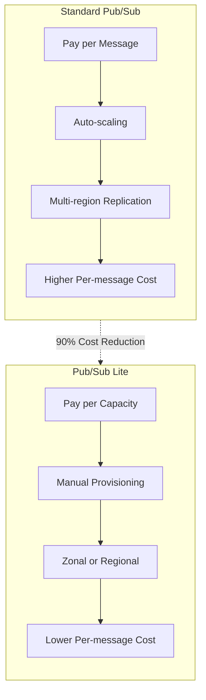
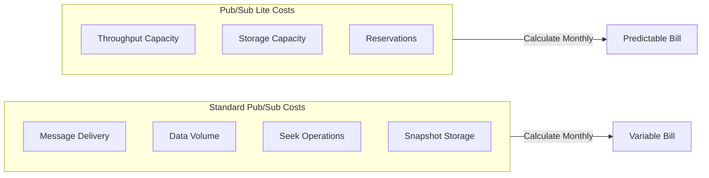
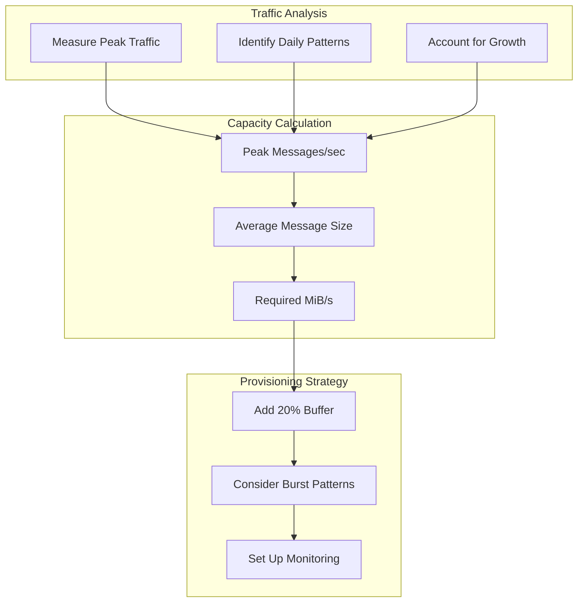
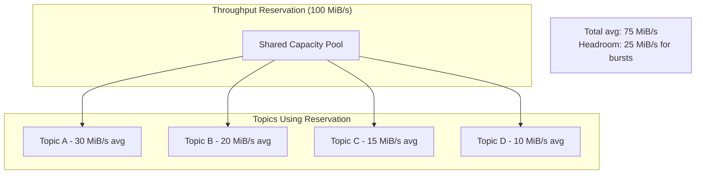
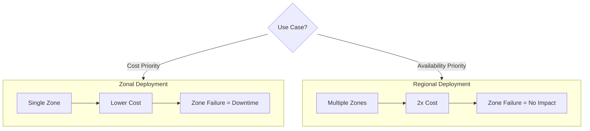
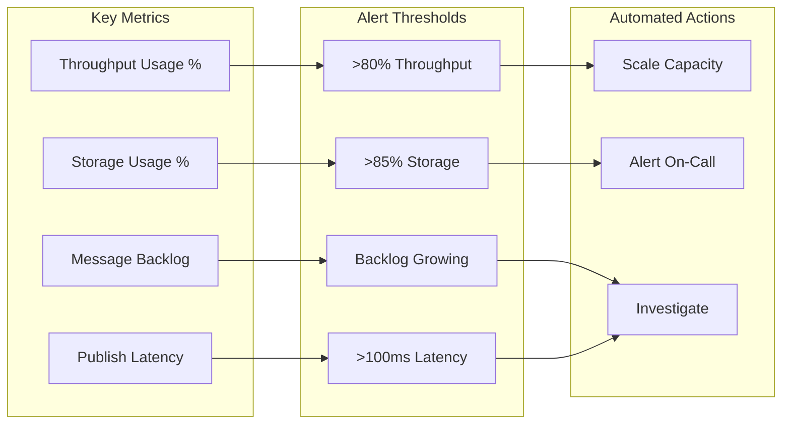
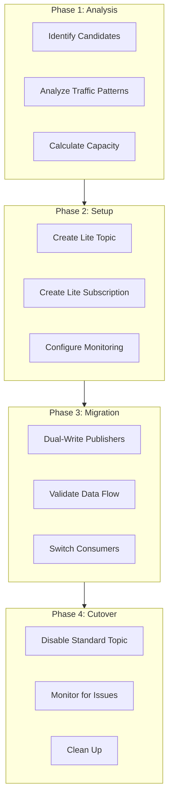

# How to Use Pub/Sub Lite for Cost Optimization

Author: [nawazdhandala](https://www.github.com/nawazdhandala)

Tags: Google Cloud, Pub/Sub Lite, Cost Optimization, Messaging, Event-Driven Architecture, Cloud Infrastructure

Description: Learn how to leverage Google Cloud Pub/Sub Lite to significantly reduce messaging costs while maintaining high throughput. A practical guide covering capacity planning, zonal vs regional deployments, reservation management, and cost optimization strategies.

---

Google Cloud Pub/Sub Lite offers a cost-effective alternative to standard Pub/Sub for high-volume messaging workloads. By requiring you to provision capacity upfront, Pub/Sub Lite can reduce messaging costs by up to 90% compared to standard Pub/Sub. Organizations processing billions of messages daily find substantial savings by migrating latency-tolerant workloads to Pub/Sub Lite.

## Understanding Pub/Sub Lite vs Standard Pub/Sub

Standard Pub/Sub charges per message and per data volume with automatic scaling. Pub/Sub Lite flips this model by requiring pre-provisioned throughput and storage capacity at predictable rates.



### When to Choose Pub/Sub Lite

Pub/Sub Lite works best for specific use cases where cost savings outweigh operational complexity:

- **High-volume event streaming**: Analytics pipelines processing millions of events per second
- **Log aggregation**: Centralized logging where occasional message loss is acceptable
- **IoT data ingestion**: Sensor data collection with predictable throughput patterns
- **Batch processing**: Workloads that can tolerate minutes of latency

### When to Stay with Standard Pub/Sub

Standard Pub/Sub remains the better choice for:

- **Unpredictable traffic**: Workloads with significant traffic spikes
- **Low latency requirements**: Sub-100ms end-to-end latency needs
- **Global distribution**: Applications requiring multi-region replication
- **Operational simplicity**: Teams without dedicated infrastructure management

## Cost Comparison Analysis

Understanding the cost model helps you calculate potential savings before migration.



### Cost Calculation Example

A typical high-volume workload comparison demonstrates the potential savings. The following Python script helps you estimate costs for both services.

```python
# cost_calculator.py
# Calculate and compare costs between Standard Pub/Sub and Pub/Sub Lite
# Usage: python cost_calculator.py

def calculate_standard_pubsub_cost(
    messages_per_day: int,
    avg_message_size_kb: float,
    retention_days: int = 7
) -> dict:
    """
    Calculate monthly cost for Standard Pub/Sub.

    Pricing (as of 2026):
    - First 10GB/month free
    - $40 per TiB for message delivery
    - Seek and snapshot costs additional
    """
    # Convert to monthly figures
    messages_per_month = messages_per_day * 30

    # Calculate data volume in TiB
    data_per_month_kb = messages_per_month * avg_message_size_kb
    data_per_month_tib = data_per_month_kb / (1024 * 1024 * 1024)

    # Standard Pub/Sub pricing: $40/TiB for delivery
    # Both publish and subscribe count as delivery
    delivery_cost = data_per_month_tib * 40 * 2  # publish + subscribe

    return {
        "messages_per_month": messages_per_month,
        "data_per_month_tib": round(data_per_month_tib, 2),
        "monthly_cost": round(delivery_cost, 2),
        "cost_per_million_messages": round(delivery_cost / (messages_per_month / 1_000_000), 4)
    }


def calculate_pubsub_lite_cost(
    throughput_mibps: int,
    storage_gib: int,
    is_regional: bool = False
) -> dict:
    """
    Calculate monthly cost for Pub/Sub Lite.

    Pricing (as of 2026):
    - Zonal: $0.0375/MiB/s throughput, $0.03/GiB storage
    - Regional: 2x zonal pricing for redundancy
    """
    # Base pricing for zonal deployment
    throughput_price_per_mibps = 0.0375
    storage_price_per_gib = 0.03

    # Regional deployments cost 2x
    multiplier = 2 if is_regional else 1

    # Calculate hourly costs, then monthly (730 hours)
    throughput_cost_hourly = throughput_mibps * throughput_price_per_mibps * multiplier
    storage_cost_hourly = storage_gib * storage_price_per_gib * multiplier

    monthly_cost = (throughput_cost_hourly + storage_cost_hourly) * 730

    return {
        "throughput_mibps": throughput_mibps,
        "storage_gib": storage_gib,
        "deployment_type": "regional" if is_regional else "zonal",
        "monthly_cost": round(monthly_cost, 2),
        "throughput_cost": round(throughput_cost_hourly * 730, 2),
        "storage_cost": round(storage_cost_hourly * 730, 2)
    }


def compare_costs(
    messages_per_day: int,
    avg_message_size_kb: float,
    retention_days: int = 7
) -> None:
    """
    Compare costs between Standard Pub/Sub and Pub/Sub Lite.
    Automatically calculates required Pub/Sub Lite capacity.
    """
    # Calculate Standard Pub/Sub costs
    standard = calculate_standard_pubsub_cost(
        messages_per_day,
        avg_message_size_kb,
        retention_days
    )

    # Calculate required Pub/Sub Lite capacity
    # Throughput: messages per second * message size
    messages_per_second = messages_per_day / 86400
    throughput_mibps = int((messages_per_second * avg_message_size_kb) / 1024) + 1

    # Storage: daily data * retention days
    daily_data_gib = (messages_per_day * avg_message_size_kb) / (1024 * 1024)
    storage_gib = int(daily_data_gib * retention_days) + 10  # Add buffer

    # Calculate Pub/Sub Lite costs for both zonal and regional
    lite_zonal = calculate_pubsub_lite_cost(throughput_mibps, storage_gib, False)
    lite_regional = calculate_pubsub_lite_cost(throughput_mibps, storage_gib, True)

    # Print comparison
    print("=" * 60)
    print("COST COMPARISON: Standard Pub/Sub vs Pub/Sub Lite")
    print("=" * 60)
    print(f"\nWorkload: {messages_per_day:,} messages/day")
    print(f"Message size: {avg_message_size_kb} KB")
    print(f"Retention: {retention_days} days")
    print(f"\nStandard Pub/Sub: ${standard['monthly_cost']:,.2f}/month")
    print(f"Pub/Sub Lite (Zonal): ${lite_zonal['monthly_cost']:,.2f}/month")
    print(f"Pub/Sub Lite (Regional): ${lite_regional['monthly_cost']:,.2f}/month")
    print(f"\nSavings with Lite Zonal: {((standard['monthly_cost'] - lite_zonal['monthly_cost']) / standard['monthly_cost'] * 100):.1f}%")
    print(f"Savings with Lite Regional: {((standard['monthly_cost'] - lite_regional['monthly_cost']) / standard['monthly_cost'] * 100):.1f}%")


# Example usage
if __name__ == "__main__":
    # Example: 100 million messages per day, 1KB average size
    compare_costs(
        messages_per_day=100_000_000,
        avg_message_size_kb=1.0,
        retention_days=7
    )
```

## Setting Up Pub/Sub Lite

### Creating a Lite Topic

Pub/Sub Lite requires explicit capacity provisioning when creating topics. The following steps walk through creating a zonal topic with the gcloud CLI.

```bash
#!/bin/bash
# create_lite_topic.sh
# Create a Pub/Sub Lite topic with provisioned capacity

# Set your project and location variables
PROJECT_ID="your-project-id"
ZONE="us-central1-a"
TOPIC_NAME="analytics-events"

# Create a zonal Lite topic
# - throughput-capacity: MiB/s for both publish and subscribe
# - per-partition-bytes: Storage per partition
# - message-retention-period: How long messages are retained
gcloud pubsub lite-topics create $TOPIC_NAME \
    --project=$PROJECT_ID \
    --zone=$ZONE \
    --partitions=4 \
    --per-partition-bytes=30GiB \
    --per-partition-publish-mib=4 \
    --per-partition-subscribe-mib=8 \
    --message-retention-period=7d

# Verify the topic was created
gcloud pubsub lite-topics describe $TOPIC_NAME \
    --project=$PROJECT_ID \
    --zone=$ZONE
```

### Creating a Lite Subscription

Subscriptions in Pub/Sub Lite connect consumers to topics. Create a subscription with delivery configuration suited for your use case.

```bash
#!/bin/bash
# create_lite_subscription.sh
# Create a Pub/Sub Lite subscription

PROJECT_ID="your-project-id"
ZONE="us-central1-a"
TOPIC_NAME="analytics-events"
SUBSCRIPTION_NAME="analytics-processor"

# Create the subscription
# - delivery-requirement: Options are deliver-immediately or deliver-after-stored
# - deliver-after-stored provides better durability guarantees
gcloud pubsub lite-subscriptions create $SUBSCRIPTION_NAME \
    --project=$PROJECT_ID \
    --zone=$ZONE \
    --topic=$TOPIC_NAME \
    --delivery-requirement=deliver-after-stored

# Verify the subscription
gcloud pubsub lite-subscriptions describe $SUBSCRIPTION_NAME \
    --project=$PROJECT_ID \
    --zone=$ZONE
```

### Python Publisher Example

Publishing to Pub/Sub Lite uses the dedicated client library. Below is a Python publisher with batching optimizations for cost efficiency.

```python
# lite_publisher.py
# Pub/Sub Lite publisher with batching for cost optimization

from google.cloud.pubsublite.cloudpubsub import PublisherClient
from google.cloud.pubsublite.types import (
    CloudRegion,
    CloudZone,
    TopicPath,
)
from google.cloud.pubsublite import AdminClient
from concurrent.futures import TimeoutError
import json
import time

# Configuration for your Pub/Sub Lite topic
PROJECT_NUMBER = 123456789  # Use project number, not project ID
CLOUD_REGION = "us-central1"
ZONE_ID = "a"
TOPIC_ID = "analytics-events"

# Construct the topic path
location = CloudZone(CloudRegion(CLOUD_REGION), ZONE_ID)
topic_path = TopicPath(PROJECT_NUMBER, location, TOPIC_ID)


def create_publisher_client():
    """
    Create a Pub/Sub Lite publisher client.
    The client handles batching and connection management internally.
    """
    return PublisherClient()


def publish_messages(messages: list[dict], ordering_key: str = None):
    """
    Publish messages to Pub/Sub Lite with batching.

    Args:
        messages: List of message payloads to publish
        ordering_key: Optional key for ordered delivery within a partition

    Returns:
        List of message IDs for published messages
    """
    publisher = create_publisher_client()
    futures = []

    # Use context manager to ensure proper cleanup
    with publisher:
        for message in messages:
            # Convert message to bytes
            data = json.dumps(message).encode("utf-8")

            # Publish with optional ordering key
            # Ordering key determines partition assignment
            if ordering_key:
                future = publisher.publish(
                    topic_path,
                    data,
                    ordering_key=ordering_key
                )
            else:
                future = publisher.publish(topic_path, data)

            futures.append(future)

        # Wait for all publishes to complete
        message_ids = []
        for future in futures:
            try:
                # Timeout after 60 seconds
                message_id = future.result(timeout=60)
                message_ids.append(message_id)
            except TimeoutError:
                print(f"Publishing timed out for message")

    return message_ids


def publish_with_batching_config():
    """
    Demonstrate batching configuration for cost optimization.
    Larger batches reduce per-message overhead.
    """
    from google.cloud.pubsublite.cloudpubsub import PublisherClient
    from google.cloud.pubsublite.types import PublishBatchSettings

    # Configure batching for throughput optimization
    # Larger batches improve efficiency but add latency
    batch_settings = PublishBatchSettings(
        max_bytes=1024 * 1024,  # 1 MiB max batch size
        max_messages=1000,      # Max messages per batch
        max_latency=0.1,        # Max 100ms wait for batching
    )

    # Create publisher with custom batch settings
    publisher = PublisherClient(
        per_partition_batching_settings=batch_settings
    )

    return publisher


# Example usage demonstrating high-throughput publishing
if __name__ == "__main__":
    # Generate sample analytics events
    events = [
        {
            "event_type": "page_view",
            "user_id": f"user_{i}",
            "page": "/products",
            "timestamp": time.time()
        }
        for i in range(1000)
    ]

    print(f"Publishing {len(events)} events to Pub/Sub Lite...")
    start = time.time()

    message_ids = publish_messages(events)

    elapsed = time.time() - start
    print(f"Published {len(message_ids)} messages in {elapsed:.2f} seconds")
    print(f"Throughput: {len(message_ids) / elapsed:.0f} messages/second")
```

### Python Subscriber Example

Subscribing to Pub/Sub Lite requires handling partition assignments. The subscriber below demonstrates efficient message processing.

```python
# lite_subscriber.py
# Pub/Sub Lite subscriber with flow control for cost optimization

from google.cloud.pubsublite.cloudpubsub import SubscriberClient
from google.cloud.pubsublite.types import (
    CloudRegion,
    CloudZone,
    SubscriptionPath,
    FlowControlSettings,
)
from concurrent.futures import TimeoutError
import json
import time

# Configuration matching the publisher
PROJECT_NUMBER = 123456789
CLOUD_REGION = "us-central1"
ZONE_ID = "a"
SUBSCRIPTION_ID = "analytics-processor"

# Construct the subscription path
location = CloudZone(CloudRegion(CLOUD_REGION), ZONE_ID)
subscription_path = SubscriptionPath(PROJECT_NUMBER, location, SUBSCRIPTION_ID)


def process_message(message):
    """
    Process a single message from Pub/Sub Lite.
    Acknowledge after successful processing.
    """
    try:
        # Decode message data
        data = json.loads(message.data.decode("utf-8"))

        # Process the message (replace with your business logic)
        print(f"Processing event: {data.get('event_type')} for user {data.get('user_id')}")

        # Acknowledge the message after successful processing
        # Failing to ack will cause redelivery
        message.ack()

    except Exception as e:
        # Nack the message to trigger redelivery
        print(f"Error processing message: {e}")
        message.nack()


def subscribe_with_flow_control():
    """
    Subscribe to Pub/Sub Lite with flow control settings.
    Flow control prevents overwhelming your application.
    """
    # Configure flow control to match your processing capacity
    # Higher values increase throughput but use more memory
    flow_control = FlowControlSettings(
        messages_outstanding=1000,      # Max unacked messages
        bytes_outstanding=10 * 1024 * 1024,  # 10 MiB max outstanding bytes
    )

    subscriber = SubscriberClient()

    # Subscribe and process messages
    streaming_pull_future = subscriber.subscribe(
        subscription_path,
        callback=process_message,
        per_partition_flow_control_settings=flow_control,
    )

    print(f"Listening for messages on {subscription_path}...")

    # Run subscriber for specified duration or until interrupted
    try:
        # Block for 300 seconds (5 minutes) then stop
        streaming_pull_future.result(timeout=300)
    except TimeoutError:
        streaming_pull_future.cancel()
        print("Subscriber stopped after timeout")
    except KeyboardInterrupt:
        streaming_pull_future.cancel()
        print("Subscriber stopped by user")


def subscribe_with_batch_processing():
    """
    Batch process messages for improved efficiency.
    Useful for bulk database writes or API calls.
    """
    from collections import defaultdict
    import threading

    # Batch accumulator
    batch = defaultdict(list)
    batch_lock = threading.Lock()
    BATCH_SIZE = 100

    def batched_callback(message):
        """Accumulate messages into batches before processing."""
        with batch_lock:
            partition = message.message_id.partition.value
            batch[partition].append(message)

            # Process batch when threshold reached
            if len(batch[partition]) >= BATCH_SIZE:
                process_batch(batch[partition])
                batch[partition] = []

    def process_batch(messages):
        """Process a batch of messages together."""
        try:
            # Decode all messages
            data_list = [
                json.loads(m.data.decode("utf-8"))
                for m in messages
            ]

            # Bulk process (e.g., batch insert to database)
            print(f"Processing batch of {len(data_list)} messages")

            # Ack all messages after successful batch processing
            for message in messages:
                message.ack()

        except Exception as e:
            print(f"Batch processing failed: {e}")
            for message in messages:
                message.nack()

    # Start subscriber with batched callback
    subscriber = SubscriberClient()
    streaming_pull_future = subscriber.subscribe(
        subscription_path,
        callback=batched_callback,
    )

    return streaming_pull_future


if __name__ == "__main__":
    subscribe_with_flow_control()
```

## Capacity Planning and Optimization

### Throughput Capacity Planning

Properly sizing your throughput capacity prevents both over-provisioning waste and under-provisioning throttling.



Use the following script to analyze your current Pub/Sub usage and calculate required Pub/Sub Lite capacity.

```python
# capacity_analyzer.py
# Analyze existing Pub/Sub metrics to calculate Pub/Sub Lite capacity requirements

from google.cloud import monitoring_v3
from datetime import datetime, timedelta
import statistics

def get_pubsub_metrics(project_id: str, topic_name: str, days: int = 7):
    """
    Fetch Pub/Sub metrics from Cloud Monitoring to analyze traffic patterns.

    Args:
        project_id: GCP project ID
        topic_name: Name of the Pub/Sub topic to analyze
        days: Number of days of historical data to analyze

    Returns:
        Dictionary containing traffic analysis results
    """
    client = monitoring_v3.MetricServiceClient()
    project_name = f"projects/{project_id}"

    # Define time range for analysis
    now = datetime.utcnow()
    start_time = now - timedelta(days=days)

    # Build the time interval
    interval = monitoring_v3.TimeInterval(
        start_time=start_time,
        end_time=now,
    )

    # Query for message count metric
    message_count_filter = (
        f'metric.type="pubsub.googleapis.com/topic/send_message_operation_count" '
        f'AND resource.labels.topic_id="{topic_name}"'
    )

    # Query for byte count metric
    byte_count_filter = (
        f'metric.type="pubsub.googleapis.com/topic/send_byte_count" '
        f'AND resource.labels.topic_id="{topic_name}"'
    )

    # Aggregate by hour for pattern analysis
    aggregation = monitoring_v3.Aggregation(
        alignment_period={"seconds": 3600},  # 1 hour
        per_series_aligner=monitoring_v3.Aggregation.Aligner.ALIGN_RATE,
    )

    # Fetch message counts
    message_results = client.list_time_series(
        request={
            "name": project_name,
            "filter": message_count_filter,
            "interval": interval,
            "aggregation": aggregation,
        }
    )

    # Process message count data
    message_rates = []
    for series in message_results:
        for point in series.points:
            message_rates.append(point.value.double_value)

    # Fetch byte counts
    byte_results = client.list_time_series(
        request={
            "name": project_name,
            "filter": byte_count_filter,
            "interval": interval,
            "aggregation": aggregation,
        }
    )

    # Process byte count data
    byte_rates = []
    for series in byte_results:
        for point in series.points:
            byte_rates.append(point.value.double_value)

    # Calculate statistics
    if message_rates and byte_rates:
        avg_message_size = statistics.mean(byte_rates) / statistics.mean(message_rates)

        return {
            "avg_messages_per_second": statistics.mean(message_rates),
            "peak_messages_per_second": max(message_rates),
            "p95_messages_per_second": statistics.quantiles(message_rates, n=20)[18],
            "avg_bytes_per_second": statistics.mean(byte_rates),
            "peak_bytes_per_second": max(byte_rates),
            "avg_message_size_bytes": avg_message_size,
        }

    return None


def calculate_lite_capacity(metrics: dict, buffer_percent: float = 0.2):
    """
    Calculate required Pub/Sub Lite capacity based on traffic metrics.

    Args:
        metrics: Traffic metrics from get_pubsub_metrics
        buffer_percent: Additional capacity buffer (default 20%)

    Returns:
        Recommended capacity configuration
    """
    # Use P95 traffic with buffer for capacity planning
    target_throughput = metrics["p95_messages_per_second"] * (1 + buffer_percent)
    target_bytes = target_throughput * metrics["avg_message_size_bytes"]

    # Convert to MiB/s (Pub/Sub Lite unit)
    throughput_mibps = target_bytes / (1024 * 1024)

    # Round up to nearest whole number
    publish_mibps = max(1, int(throughput_mibps) + 1)

    # Subscribe capacity should be higher to handle catch-up scenarios
    subscribe_mibps = publish_mibps * 2

    return {
        "recommended_publish_mibps": publish_mibps,
        "recommended_subscribe_mibps": subscribe_mibps,
        "calculated_from_p95": True,
        "buffer_applied": buffer_percent,
        "note": "Subscribe capacity doubled to handle catch-up scenarios"
    }


def print_capacity_recommendation(project_id: str, topic_name: str):
    """Generate and print capacity recommendations."""
    print(f"Analyzing topic: {topic_name}")
    print("Fetching 7 days of metrics...")

    metrics = get_pubsub_metrics(project_id, topic_name)

    if not metrics:
        print("No metrics found. Ensure the topic exists and has recent traffic.")
        return

    print("\n--- Traffic Analysis ---")
    print(f"Average messages/sec: {metrics['avg_messages_per_second']:.2f}")
    print(f"Peak messages/sec: {metrics['peak_messages_per_second']:.2f}")
    print(f"P95 messages/sec: {metrics['p95_messages_per_second']:.2f}")
    print(f"Average message size: {metrics['avg_message_size_bytes']:.0f} bytes")

    capacity = calculate_lite_capacity(metrics)

    print("\n--- Pub/Sub Lite Capacity Recommendation ---")
    print(f"Publish throughput: {capacity['recommended_publish_mibps']} MiB/s")
    print(f"Subscribe throughput: {capacity['recommended_subscribe_mibps']} MiB/s")
    print(f"\nNote: {capacity['note']}")


if __name__ == "__main__":
    print_capacity_recommendation("your-project-id", "your-topic-name")
```

### Storage Capacity Planning

Storage capacity depends on message retention and throughput. Calculate storage needs based on your data volume and retention requirements.

```python
# storage_calculator.py
# Calculate Pub/Sub Lite storage requirements

def calculate_storage_requirements(
    throughput_mibps: float,
    retention_hours: int,
    peak_multiplier: float = 1.5
) -> dict:
    """
    Calculate storage capacity needed for Pub/Sub Lite.

    Args:
        throughput_mibps: Expected throughput in MiB/s
        retention_hours: Message retention period in hours
        peak_multiplier: Factor to account for traffic peaks

    Returns:
        Storage recommendations in GiB
    """
    # Calculate base storage need
    # throughput * seconds_in_retention_period
    seconds_in_retention = retention_hours * 3600
    base_storage_mib = throughput_mibps * seconds_in_retention

    # Apply peak multiplier for burst handling
    peak_storage_mib = base_storage_mib * peak_multiplier

    # Convert to GiB
    base_storage_gib = base_storage_mib / 1024
    peak_storage_gib = peak_storage_mib / 1024

    # Round up to nearest 10 GiB for provisioning
    recommended_storage_gib = ((int(peak_storage_gib) // 10) + 1) * 10

    return {
        "base_storage_gib": round(base_storage_gib, 2),
        "peak_storage_gib": round(peak_storage_gib, 2),
        "recommended_storage_gib": recommended_storage_gib,
        "retention_hours": retention_hours,
        "note": "Recommended storage includes headroom for traffic spikes"
    }


def calculate_partition_storage(
    total_storage_gib: int,
    num_partitions: int
) -> dict:
    """
    Calculate per-partition storage for topic creation.

    Args:
        total_storage_gib: Total storage needed
        num_partitions: Number of partitions in the topic

    Returns:
        Per-partition storage configuration
    """
    # Per-partition storage must be between 30 GiB and 10 TiB
    MIN_PARTITION_STORAGE = 30
    MAX_PARTITION_STORAGE = 10 * 1024  # 10 TiB

    per_partition_gib = total_storage_gib / num_partitions

    # Enforce minimum
    if per_partition_gib < MIN_PARTITION_STORAGE:
        per_partition_gib = MIN_PARTITION_STORAGE
        total_storage_gib = per_partition_gib * num_partitions

    # Enforce maximum
    if per_partition_gib > MAX_PARTITION_STORAGE:
        recommended_partitions = (total_storage_gib // MAX_PARTITION_STORAGE) + 1
        return {
            "error": "Per-partition storage exceeds maximum",
            "recommended_partitions": recommended_partitions,
            "per_partition_gib": MAX_PARTITION_STORAGE
        }

    return {
        "per_partition_gib": int(per_partition_gib),
        "total_storage_gib": int(per_partition_gib * num_partitions),
        "num_partitions": num_partitions
    }


# Example calculation
if __name__ == "__main__":
    # Scenario: 10 MiB/s throughput, 7 days retention
    storage = calculate_storage_requirements(
        throughput_mibps=10,
        retention_hours=7 * 24,
        peak_multiplier=1.5
    )

    print("Storage Requirements:")
    print(f"  Base storage: {storage['base_storage_gib']} GiB")
    print(f"  With peak buffer: {storage['peak_storage_gib']} GiB")
    print(f"  Recommended: {storage['recommended_storage_gib']} GiB")

    # Calculate per-partition storage for 4 partitions
    partition_config = calculate_partition_storage(
        storage['recommended_storage_gib'],
        num_partitions=4
    )

    print(f"\nPartition Configuration:")
    print(f"  Partitions: {partition_config['num_partitions']}")
    print(f"  Per-partition: {partition_config['per_partition_gib']} GiB")
```

## Using Reservations for Cost Optimization

Reservations allow you to pool throughput capacity across multiple topics, reducing waste from over-provisioning individual topics.



### Creating and Managing Reservations

Reservations provide regional throughput capacity that multiple topics can share.

```bash
#!/bin/bash
# manage_reservations.sh
# Create and manage Pub/Sub Lite reservations

PROJECT_ID="your-project-id"
REGION="us-central1"
RESERVATION_NAME="shared-analytics-reservation"

# Create a reservation with 100 MiB/s throughput
# Topics using this reservation share the capacity pool
gcloud pubsub lite-reservations create $RESERVATION_NAME \
    --project=$PROJECT_ID \
    --location=$REGION \
    --throughput-capacity=100

# List all reservations
gcloud pubsub lite-reservations list \
    --project=$PROJECT_ID \
    --location=$REGION

# Update reservation capacity (scale up for increased traffic)
gcloud pubsub lite-reservations update $RESERVATION_NAME \
    --project=$PROJECT_ID \
    --location=$REGION \
    --throughput-capacity=150

# Describe reservation to see current configuration
gcloud pubsub lite-reservations describe $RESERVATION_NAME \
    --project=$PROJECT_ID \
    --location=$REGION
```

### Creating Topics with Reservations

Topics created with a reservation share throughput capacity, enabling more efficient resource utilization.

```bash
#!/bin/bash
# create_topic_with_reservation.sh
# Create topics that use a shared reservation

PROJECT_ID="your-project-id"
ZONE="us-central1-a"
RESERVATION_NAME="shared-analytics-reservation"

# Create a topic that uses the shared reservation
# No per-partition throughput needed when using reservation
gcloud pubsub lite-topics create analytics-events \
    --project=$PROJECT_ID \
    --zone=$ZONE \
    --partitions=4 \
    --per-partition-bytes=100GiB \
    --throughput-reservation=projects/$PROJECT_ID/locations/us-central1/reservations/$RESERVATION_NAME \
    --message-retention-period=7d

# Create another topic using the same reservation
gcloud pubsub lite-topics create user-activity \
    --project=$PROJECT_ID \
    --zone=$ZONE \
    --partitions=2 \
    --per-partition-bytes=50GiB \
    --throughput-reservation=projects/$PROJECT_ID/locations/us-central1/reservations/$RESERVATION_NAME \
    --message-retention-period=3d

# List topics using the reservation
gcloud pubsub lite-topics list \
    --project=$PROJECT_ID \
    --zone=$ZONE \
    --filter="throughputReservation:$RESERVATION_NAME"
```

## Zonal vs Regional Deployments

Choosing between zonal and regional deployments impacts both cost and availability.



### Zonal Deployment Configuration

Zonal deployments cost less but lack zone-level redundancy.

```bash
#!/bin/bash
# create_zonal_topic.sh
# Create a cost-optimized zonal Pub/Sub Lite topic

PROJECT_ID="your-project-id"
ZONE="us-central1-a"

# Zonal topics are specified with a zone location
gcloud pubsub lite-topics create logs-collector \
    --project=$PROJECT_ID \
    --zone=$ZONE \
    --partitions=2 \
    --per-partition-bytes=50GiB \
    --per-partition-publish-mib=4 \
    --per-partition-subscribe-mib=8 \
    --message-retention-period=24h

echo "Created zonal topic in $ZONE"
echo "Note: Topic unavailable if zone experiences an outage"
```

### Regional Deployment Configuration

Regional deployments replicate across zones for higher availability.

```bash
#!/bin/bash
# create_regional_topic.sh
# Create a highly available regional Pub/Sub Lite topic

PROJECT_ID="your-project-id"
REGION="us-central1"

# Regional topics use region location instead of zone
gcloud pubsub lite-topics create critical-events \
    --project=$PROJECT_ID \
    --location=$REGION \
    --partitions=4 \
    --per-partition-bytes=100GiB \
    --per-partition-publish-mib=8 \
    --per-partition-subscribe-mib=16 \
    --message-retention-period=7d

echo "Created regional topic in $REGION"
echo "Topic remains available during single-zone failures"
```

### Cost-Availability Matrix

Use the following decision framework to choose deployment type.

```python
# deployment_advisor.py
# Recommend zonal vs regional deployment based on requirements

def recommend_deployment(
    monthly_message_volume: int,
    requires_high_availability: bool,
    max_acceptable_downtime_hours: float,
    budget_monthly_usd: float
) -> dict:
    """
    Recommend Pub/Sub Lite deployment type based on requirements.

    Args:
        monthly_message_volume: Expected messages per month
        requires_high_availability: Whether HA is a hard requirement
        max_acceptable_downtime_hours: Maximum tolerable downtime per month
        budget_monthly_usd: Monthly budget in USD

    Returns:
        Deployment recommendation with reasoning
    """
    # GCP zone availability is typically 99.9% (about 43 minutes downtime/month)
    # Regional deployments offer 99.99% (about 4 minutes downtime/month)
    ZONAL_UPTIME = 0.999
    REGIONAL_UPTIME = 0.9999
    HOURS_PER_MONTH = 730

    zonal_downtime_hours = HOURS_PER_MONTH * (1 - ZONAL_UPTIME)
    regional_downtime_hours = HOURS_PER_MONTH * (1 - REGIONAL_UPTIME)

    recommendation = {
        "deployment_type": None,
        "reasoning": [],
        "estimated_cost_factor": None
    }

    # Hard requirement check
    if requires_high_availability:
        recommendation["deployment_type"] = "regional"
        recommendation["reasoning"].append(
            "High availability is a hard requirement"
        )
        recommendation["estimated_cost_factor"] = 2.0
        return recommendation

    # Downtime tolerance check
    if max_acceptable_downtime_hours < zonal_downtime_hours:
        recommendation["deployment_type"] = "regional"
        recommendation["reasoning"].append(
            f"Max acceptable downtime ({max_acceptable_downtime_hours}h) is less than "
            f"expected zonal downtime ({zonal_downtime_hours:.2f}h)"
        )
        recommendation["estimated_cost_factor"] = 2.0
        return recommendation

    # Default to zonal for cost optimization
    recommendation["deployment_type"] = "zonal"
    recommendation["reasoning"].append(
        "Downtime tolerance allows zonal deployment"
    )
    recommendation["reasoning"].append(
        f"Expected downtime ({zonal_downtime_hours:.2f}h) within tolerance "
        f"({max_acceptable_downtime_hours}h)"
    )
    recommendation["estimated_cost_factor"] = 1.0

    # Cost check
    estimated_regional_cost = budget_monthly_usd * 2
    if estimated_regional_cost <= budget_monthly_usd:
        recommendation["alternative"] = {
            "type": "regional",
            "note": "Budget allows regional deployment for improved reliability"
        }

    return recommendation


# Example usage
if __name__ == "__main__":
    # Scenario: Log aggregation with moderate availability needs
    result = recommend_deployment(
        monthly_message_volume=1_000_000_000,
        requires_high_availability=False,
        max_acceptable_downtime_hours=2.0,
        budget_monthly_usd=500
    )

    print(f"Recommended deployment: {result['deployment_type']}")
    print(f"Cost factor: {result['estimated_cost_factor']}x")
    print("Reasoning:")
    for reason in result['reasoning']:
        print(f"  - {reason}")
```

## Monitoring and Alerting for Cost Control

Set up monitoring to track capacity usage and prevent unexpected costs.



### Setting Up Cloud Monitoring Alerts

Create alerts to proactively manage capacity before hitting limits.

```bash
#!/bin/bash
# create_monitoring_alerts.sh
# Set up Cloud Monitoring alerts for Pub/Sub Lite

PROJECT_ID="your-project-id"

# Create notification channel (email)
NOTIFICATION_CHANNEL=$(gcloud alpha monitoring channels create \
    --display-name="Pub/Sub Lite Alerts" \
    --type=email \
    --channel-labels=email_address=team@example.com \
    --format="value(name)")

# Create throughput usage alert
# Triggers when publish throughput exceeds 80% of capacity
gcloud alpha monitoring policies create \
    --display-name="Pub/Sub Lite High Throughput Usage" \
    --condition-filter='metric.type="pubsublite.googleapis.com/topic/publish_throughput" resource.type="pubsublite_topic"' \
    --condition-threshold-value=0.8 \
    --condition-threshold-comparison=COMPARISON_GT \
    --condition-threshold-aggregations-aligner=ALIGN_RATE \
    --condition-threshold-aggregations-per-series-aligner=ALIGN_MEAN \
    --condition-threshold-duration=300s \
    --notification-channels=$NOTIFICATION_CHANNEL \
    --documentation="Pub/Sub Lite topic approaching throughput capacity. Consider scaling up."

# Create storage usage alert
# Triggers when storage usage exceeds 85%
gcloud alpha monitoring policies create \
    --display-name="Pub/Sub Lite High Storage Usage" \
    --condition-filter='metric.type="pubsublite.googleapis.com/topic/storage_utilized_bytes" resource.type="pubsublite_topic"' \
    --condition-threshold-value=0.85 \
    --condition-threshold-comparison=COMPARISON_GT \
    --condition-threshold-aggregations-aligner=ALIGN_NONE \
    --condition-threshold-aggregations-per-series-aligner=ALIGN_MEAN \
    --condition-threshold-duration=300s \
    --notification-channels=$NOTIFICATION_CHANNEL \
    --documentation="Pub/Sub Lite topic storage nearing capacity. Increase storage or reduce retention."
```

### Custom Monitoring Dashboard

Create a dashboard for real-time visibility into Pub/Sub Lite usage.

```python
# create_dashboard.py
# Create a Cloud Monitoring dashboard for Pub/Sub Lite

from google.cloud import monitoring_dashboard_v1
import json

def create_pubsub_lite_dashboard(project_id: str):
    """
    Create a comprehensive monitoring dashboard for Pub/Sub Lite.

    Args:
        project_id: GCP project ID
    """
    client = monitoring_dashboard_v1.DashboardsServiceClient()

    # Dashboard configuration with key metrics
    dashboard_config = {
        "displayName": "Pub/Sub Lite Cost Optimization",
        "gridLayout": {
            "columns": 2,
            "widgets": [
                # Throughput usage widget
                {
                    "title": "Publish Throughput (MiB/s)",
                    "xyChart": {
                        "dataSets": [{
                            "timeSeriesQuery": {
                                "timeSeriesFilter": {
                                    "filter": 'metric.type="pubsublite.googleapis.com/topic/publish_throughput"',
                                    "aggregation": {
                                        "alignmentPeriod": "60s",
                                        "perSeriesAligner": "ALIGN_RATE"
                                    }
                                }
                            },
                            "plotType": "LINE"
                        }]
                    }
                },
                # Subscribe throughput widget
                {
                    "title": "Subscribe Throughput (MiB/s)",
                    "xyChart": {
                        "dataSets": [{
                            "timeSeriesQuery": {
                                "timeSeriesFilter": {
                                    "filter": 'metric.type="pubsublite.googleapis.com/subscription/subscribe_throughput"',
                                    "aggregation": {
                                        "alignmentPeriod": "60s",
                                        "perSeriesAligner": "ALIGN_RATE"
                                    }
                                }
                            },
                            "plotType": "LINE"
                        }]
                    }
                },
                # Storage usage widget
                {
                    "title": "Storage Used (GiB)",
                    "xyChart": {
                        "dataSets": [{
                            "timeSeriesQuery": {
                                "timeSeriesFilter": {
                                    "filter": 'metric.type="pubsublite.googleapis.com/topic/storage_utilized_bytes"',
                                    "aggregation": {
                                        "alignmentPeriod": "60s",
                                        "perSeriesAligner": "ALIGN_MEAN"
                                    }
                                }
                            },
                            "plotType": "STACKED_AREA"
                        }]
                    }
                },
                # Message backlog widget
                {
                    "title": "Subscription Backlog (Messages)",
                    "xyChart": {
                        "dataSets": [{
                            "timeSeriesQuery": {
                                "timeSeriesFilter": {
                                    "filter": 'metric.type="pubsublite.googleapis.com/subscription/backlog_message_count"',
                                    "aggregation": {
                                        "alignmentPeriod": "60s",
                                        "perSeriesAligner": "ALIGN_MEAN"
                                    }
                                }
                            },
                            "plotType": "LINE"
                        }]
                    }
                }
            ]
        }
    }

    # Create the dashboard
    parent = f"projects/{project_id}"
    dashboard = monitoring_dashboard_v1.Dashboard(dashboard_config)

    response = client.create_dashboard(
        parent=parent,
        dashboard=dashboard
    )

    print(f"Created dashboard: {response.name}")
    return response


if __name__ == "__main__":
    create_pubsub_lite_dashboard("your-project-id")
```

## Migration Strategy from Standard Pub/Sub

Migrate workloads from Standard Pub/Sub to Pub/Sub Lite with minimal disruption.



### Migration Script

Automate the migration process with a structured approach.

```python
# migration_manager.py
# Manage migration from Standard Pub/Sub to Pub/Sub Lite

from google.cloud import pubsub_v1
from google.cloud.pubsublite.cloudpubsub import PublisherClient as LitePublisher
from google.cloud.pubsublite.types import CloudZone, CloudRegion, TopicPath
from dataclasses import dataclass
from enum import Enum
import time

class MigrationPhase(Enum):
    ANALYSIS = "analysis"
    SETUP = "setup"
    DUAL_WRITE = "dual_write"
    CUTOVER = "cutover"
    COMPLETE = "complete"


@dataclass
class MigrationConfig:
    """Configuration for Pub/Sub to Pub/Sub Lite migration."""
    project_id: str
    project_number: int
    standard_topic: str
    lite_topic: str
    lite_zone: str
    region: str


class MigrationManager:
    """
    Manage the migration from Standard Pub/Sub to Pub/Sub Lite.
    Implements a phased approach with validation at each step.
    """

    def __init__(self, config: MigrationConfig):
        self.config = config
        self.phase = MigrationPhase.ANALYSIS
        self.standard_publisher = pubsub_v1.PublisherClient()
        self.lite_publisher = None

        # Construct paths
        self.standard_topic_path = self.standard_publisher.topic_path(
            config.project_id,
            config.standard_topic
        )

        location = CloudZone(CloudRegion(config.region), config.lite_zone.split("-")[-1])
        self.lite_topic_path = TopicPath(
            config.project_number,
            location,
            config.lite_topic
        )

    def validate_phase_transition(self, target_phase: MigrationPhase) -> bool:
        """Validate that the migration can proceed to the next phase."""
        valid_transitions = {
            MigrationPhase.ANALYSIS: [MigrationPhase.SETUP],
            MigrationPhase.SETUP: [MigrationPhase.DUAL_WRITE],
            MigrationPhase.DUAL_WRITE: [MigrationPhase.CUTOVER],
            MigrationPhase.CUTOVER: [MigrationPhase.COMPLETE],
        }

        return target_phase in valid_transitions.get(self.phase, [])

    def dual_write_publish(self, data: bytes, **attributes):
        """
        Publish to both Standard Pub/Sub and Pub/Sub Lite.
        Used during migration to validate data flow.
        """
        results = {"standard": None, "lite": None}

        # Publish to Standard Pub/Sub
        try:
            future = self.standard_publisher.publish(
                self.standard_topic_path,
                data,
                **attributes
            )
            results["standard"] = future.result(timeout=30)
        except Exception as e:
            results["standard_error"] = str(e)

        # Publish to Pub/Sub Lite
        if self.lite_publisher is None:
            self.lite_publisher = LitePublisher()

        try:
            with self.lite_publisher:
                future = self.lite_publisher.publish(
                    self.lite_topic_path,
                    data
                )
                results["lite"] = future.result(timeout=30)
        except Exception as e:
            results["lite_error"] = str(e)

        return results

    def validate_dual_write(self, num_messages: int = 100) -> dict:
        """
        Validate dual-write is working correctly.
        Publishes test messages and verifies delivery to both systems.
        """
        successes = {"standard": 0, "lite": 0}
        failures = {"standard": 0, "lite": 0}

        for i in range(num_messages):
            data = f"validation_message_{i}_{time.time()}".encode()
            results = self.dual_write_publish(data)

            if results.get("standard"):
                successes["standard"] += 1
            else:
                failures["standard"] += 1

            if results.get("lite"):
                successes["lite"] += 1
            else:
                failures["lite"] += 1

        # Calculate success rates
        standard_rate = successes["standard"] / num_messages
        lite_rate = successes["lite"] / num_messages

        return {
            "standard_success_rate": standard_rate,
            "lite_success_rate": lite_rate,
            "validation_passed": standard_rate > 0.99 and lite_rate > 0.99,
            "details": {
                "standard_successes": successes["standard"],
                "lite_successes": successes["lite"],
                "standard_failures": failures["standard"],
                "lite_failures": failures["lite"]
            }
        }

    def execute_cutover(self) -> dict:
        """
        Execute the final cutover to Pub/Sub Lite.
        Returns status and any warnings.
        """
        if not self.validate_phase_transition(MigrationPhase.CUTOVER):
            return {"error": "Invalid phase transition"}

        # Validate dual-write is stable
        validation = self.validate_dual_write(num_messages=1000)

        if not validation["validation_passed"]:
            return {
                "error": "Validation failed, cutover aborted",
                "validation_results": validation
            }

        self.phase = MigrationPhase.CUTOVER

        return {
            "status": "cutover_ready",
            "instructions": [
                "1. Update publishers to use Pub/Sub Lite only",
                "2. Monitor Lite topic for expected message volume",
                "3. Verify consumers are processing from Lite subscription",
                "4. After 24h stable operation, decommission Standard topic"
            ],
            "validation_results": validation
        }


def run_migration(config: MigrationConfig):
    """Execute a guided migration process."""
    manager = MigrationManager(config)

    print("=" * 60)
    print("Pub/Sub to Pub/Sub Lite Migration")
    print("=" * 60)

    print("\nPhase 1: Validating dual-write capability...")
    validation = manager.validate_dual_write(num_messages=100)

    print(f"Standard Pub/Sub success rate: {validation['standard_success_rate']:.1%}")
    print(f"Pub/Sub Lite success rate: {validation['lite_success_rate']:.1%}")

    if validation['validation_passed']:
        print("\nValidation PASSED - Ready for cutover")
        cutover = manager.execute_cutover()

        print("\nCutover Instructions:")
        for instruction in cutover.get("instructions", []):
            print(f"  {instruction}")
    else:
        print("\nValidation FAILED - Investigate before proceeding")


if __name__ == "__main__":
    config = MigrationConfig(
        project_id="your-project-id",
        project_number=123456789,
        standard_topic="original-topic",
        lite_topic="migrated-topic",
        lite_zone="us-central1-a",
        region="us-central1"
    )

    run_migration(config)
```

## Best Practices for Cost Optimization

### Right-sizing Capacity

Avoid over-provisioning by regularly reviewing capacity utilization.

```python
# capacity_optimizer.py
# Identify opportunities to right-size Pub/Sub Lite capacity

from google.cloud import monitoring_v3
from datetime import datetime, timedelta

def analyze_capacity_utilization(
    project_id: str,
    topic_name: str,
    days: int = 30
) -> dict:
    """
    Analyze capacity utilization to identify right-sizing opportunities.

    Args:
        project_id: GCP project ID
        topic_name: Pub/Sub Lite topic name
        days: Analysis period in days

    Returns:
        Utilization analysis with recommendations
    """
    client = monitoring_v3.MetricServiceClient()
    project_name = f"projects/{project_id}"

    # Time range for analysis
    now = datetime.utcnow()
    start_time = now - timedelta(days=days)

    interval = monitoring_v3.TimeInterval(
        start_time=start_time,
        end_time=now,
    )

    # Fetch throughput utilization
    throughput_filter = (
        f'metric.type="pubsublite.googleapis.com/topic/publish_throughput" '
        f'AND resource.labels.topic_id="{topic_name}"'
    )

    aggregation = monitoring_v3.Aggregation(
        alignment_period={"seconds": 3600},
        per_series_aligner=monitoring_v3.Aggregation.Aligner.ALIGN_MEAN,
    )

    results = client.list_time_series(
        request={
            "name": project_name,
            "filter": throughput_filter,
            "interval": interval,
            "aggregation": aggregation,
        }
    )

    utilization_values = []
    for series in results:
        for point in series.points:
            utilization_values.append(point.value.double_value)

    if not utilization_values:
        return {"error": "No utilization data found"}

    # Calculate statistics
    avg_utilization = sum(utilization_values) / len(utilization_values)
    max_utilization = max(utilization_values)
    min_utilization = min(utilization_values)

    # Generate recommendations
    recommendations = []

    if max_utilization < 0.5:
        recommendations.append({
            "type": "reduce_capacity",
            "reason": f"Peak utilization ({max_utilization:.1%}) well below capacity",
            "potential_savings": "Up to 50%"
        })
    elif avg_utilization < 0.3:
        recommendations.append({
            "type": "reduce_capacity",
            "reason": f"Average utilization ({avg_utilization:.1%}) significantly below capacity",
            "potential_savings": "Up to 30%"
        })
    elif max_utilization > 0.9:
        recommendations.append({
            "type": "increase_capacity",
            "reason": f"Peak utilization ({max_utilization:.1%}) approaching limit",
            "risk": "Potential throttling during peaks"
        })
    else:
        recommendations.append({
            "type": "optimal",
            "reason": "Capacity well-matched to workload"
        })

    return {
        "average_utilization": avg_utilization,
        "peak_utilization": max_utilization,
        "minimum_utilization": min_utilization,
        "analysis_period_days": days,
        "recommendations": recommendations
    }


if __name__ == "__main__":
    analysis = analyze_capacity_utilization(
        project_id="your-project-id",
        topic_name="analytics-events",
        days=30
    )

    print("Capacity Utilization Analysis")
    print("-" * 40)
    print(f"Average: {analysis['average_utilization']:.1%}")
    print(f"Peak: {analysis['peak_utilization']:.1%}")
    print(f"Minimum: {analysis['minimum_utilization']:.1%}")
    print("\nRecommendations:")
    for rec in analysis['recommendations']:
        print(f"  - {rec['type']}: {rec['reason']}")
```

### Cost Optimization Checklist

Follow these practices to maximize cost savings with Pub/Sub Lite:

- [ ] **Analyze traffic patterns** before provisioning to avoid over-allocation
- [ ] **Use reservations** for multiple topics to share capacity efficiently
- [ ] **Choose zonal deployment** for non-critical workloads to halve costs
- [ ] **Set appropriate retention** based on actual consumer lag, not arbitrary periods
- [ ] **Monitor utilization weekly** and right-size capacity based on actual usage
- [ ] **Batch messages** on the publisher side to reduce per-message overhead
- [ ] **Use flow control** on subscribers to prevent wasted pull operations
- [ ] **Implement backpressure** to avoid accumulating unprocessed messages
- [ ] **Review partition count** as fewer partitions reduce management overhead
- [ ] **Schedule capacity reviews** quarterly to catch drift from optimal configuration

---

Pub/Sub Lite delivers substantial cost savings for high-volume messaging workloads that can tolerate the operational model of pre-provisioned capacity. Starting with careful capacity planning, choosing the right deployment type for your availability requirements, and implementing ongoing monitoring ensures you capture the full cost benefits while maintaining reliable message delivery. Migrate workloads incrementally, validate thoroughly, and continuously optimize capacity to maximize your return on investment.
