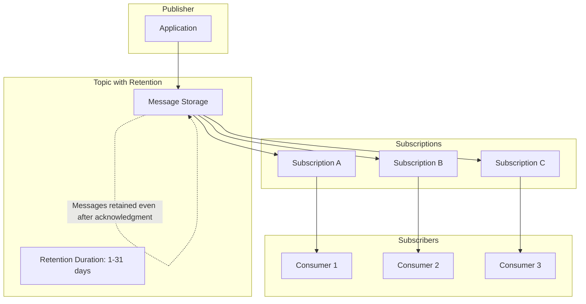
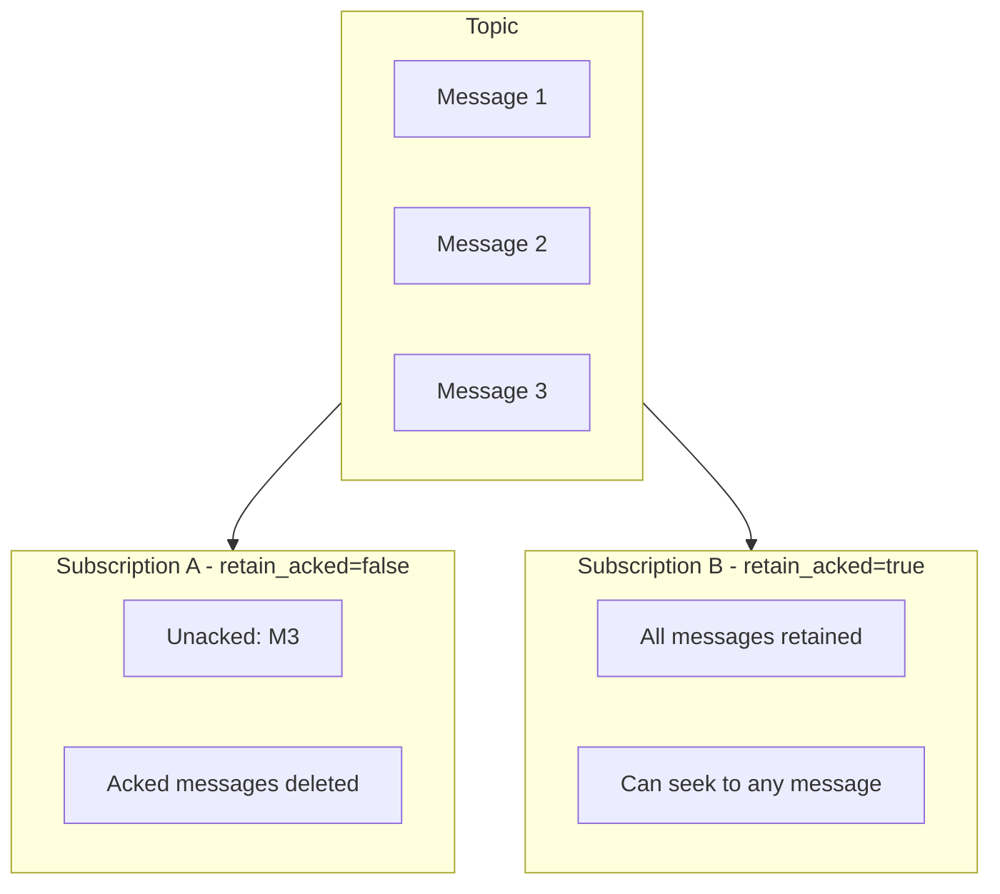
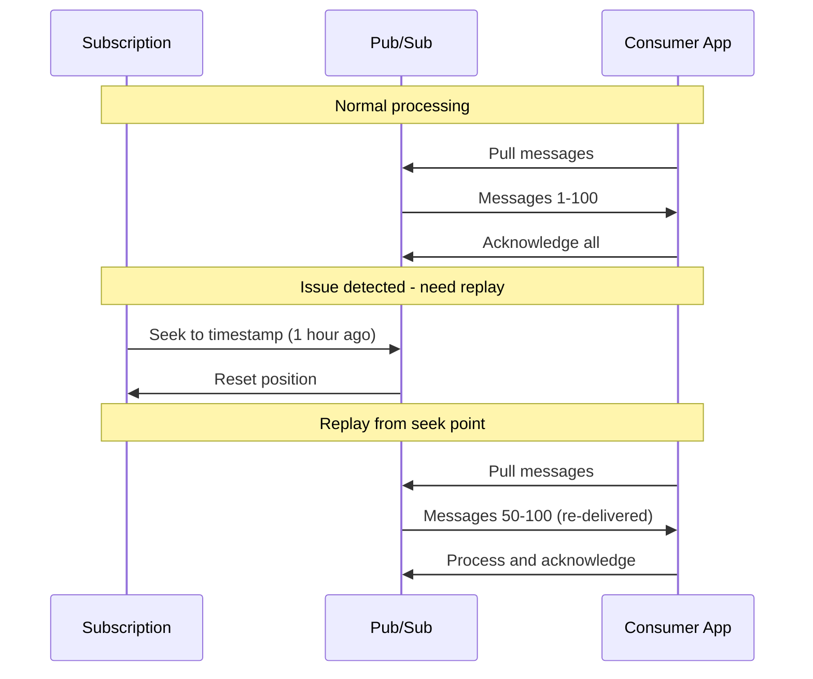
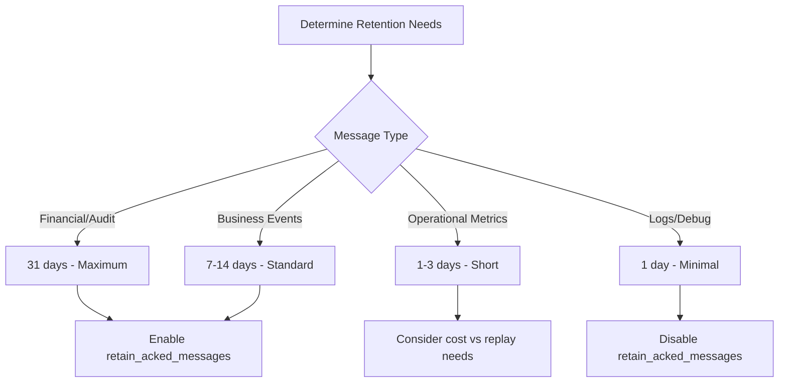
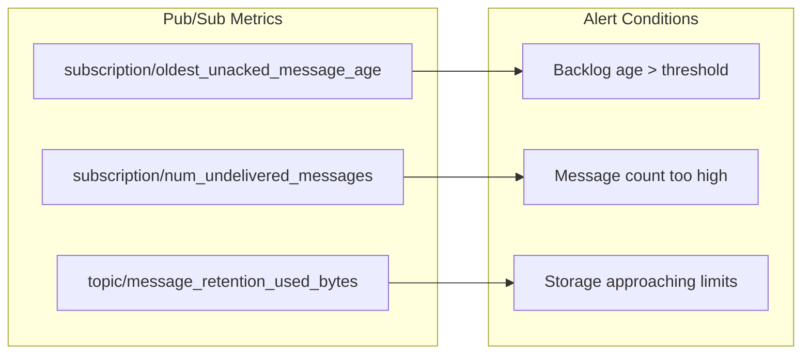

# How to Configure Message Retention in Pub/Sub

Author: [nawazdhandala](https://github.com/nawazdhandala)

Tags: Google Cloud, Pub/Sub, Messaging, Message Retention, Cloud Architecture, Event-Driven

Description: Learn how to configure message retention in Google Cloud Pub/Sub to ensure messages are preserved for replay, auditing, and disaster recovery scenarios.

---

Google Cloud Pub/Sub provides a powerful messaging service for building event-driven architectures. Message retention is a critical feature that allows you to keep messages in a topic for a specified duration, enabling message replay, auditing, and recovery from consumer failures. Understanding how to properly configure retention settings ensures your messaging infrastructure meets reliability and compliance requirements.

## Understanding Message Retention in Pub/Sub

Pub/Sub offers two types of retention that work together to provide flexible message durability.



### Topic-Level Retention

Topic-level retention stores messages at the topic level for a configurable duration. Even after all subscribers acknowledge a message, Pub/Sub keeps it available for replay. Configuring topic retention enables:

- **Message replay**: Reprocess historical messages without republishing
- **New subscriber catch-up**: New subscriptions can access messages published before their creation
- **Disaster recovery**: Recover from subscriber failures by replaying messages

### Subscription-Level Retention

Subscription-level retention determines how long Pub/Sub retains unacknowledged messages for a specific subscription. The key differences include:

| Feature | Topic Retention | Subscription Retention |
|---------|-----------------|------------------------|
| Scope | All subscriptions | Single subscription |
| Acknowledged messages | Retained | Not retained |
| Default duration | Disabled | 7 days |
| Maximum duration | 31 days | 31 days |
| Use case | Replay, audit | Backlog management |

## Configuring Topic-Level Retention

### Using Google Cloud Console

Navigate to the Pub/Sub section in the Google Cloud Console and follow these steps:

1. Select your topic or create a new one
2. Click "Edit" to modify topic settings
3. Enable "Message retention" and set the duration
4. Save your changes

### Using gcloud CLI

The following command creates a new topic with message retention enabled. Retention duration uses Go-style duration format.

```bash
# Create a topic with 7-day message retention
# Duration format: XdYhZm (days, hours, minutes)
gcloud pubsub topics create orders-topic \
    --message-retention-duration=7d \
    --project=my-project-id

# Update an existing topic to enable retention
gcloud pubsub topics update orders-topic \
    --message-retention-duration=7d \
    --project=my-project-id

# Set maximum retention (31 days)
gcloud pubsub topics update orders-topic \
    --message-retention-duration=31d \
    --project=my-project-id

# Remove retention (messages deleted after acknowledgment)
gcloud pubsub topics update orders-topic \
    --clear-message-retention-duration \
    --project=my-project-id
```

### Using Terraform

Infrastructure as code provides reproducible configuration. The following Terraform example sets up a topic with retention.

```hcl
# Configure the Google Cloud provider
provider "google" {
  project = "my-project-id"
  region  = "us-central1"
}

# Create a Pub/Sub topic with message retention enabled
# Retention allows replaying messages even after acknowledgment
resource "google_pubsub_topic" "orders" {
  name    = "orders-topic"
  project = "my-project-id"

  # Retain messages for 7 days (604800 seconds)
  # Minimum: 600 seconds (10 minutes)
  # Maximum: 2678400 seconds (31 days)
  message_retention_duration = "604800s"

  # Optional: Add labels for organization
  labels = {
    environment = "production"
    team        = "platform"
  }
}

# Create a subscription that can seek to any retained message
resource "google_pubsub_subscription" "orders_subscription" {
  name    = "orders-subscription"
  topic   = google_pubsub_topic.orders.name
  project = "my-project-id"

  # Subscription-level retention for unacknowledged messages
  # Independent of topic-level retention
  message_retention_duration = "604800s"

  # Enable seeking to timestamps or snapshots
  # Required for message replay functionality
  retain_acked_messages = true

  # Acknowledgment deadline in seconds
  ack_deadline_seconds = 60

  # Expiration policy - subscription deleted if inactive
  expiration_policy {
    ttl = "2592000s"  # 30 days
  }
}
```

### Using Python Client Library

The Python client provides programmatic control over topic configuration.

```python
from google.cloud import pubsub_v1
from google.protobuf import duration_pb2

def create_topic_with_retention(
    project_id: str,
    topic_id: str,
    retention_days: int = 7
) -> None:
    """
    Create a Pub/Sub topic with message retention enabled.

    Args:
        project_id: Google Cloud project ID
        topic_id: Name for the new topic
        retention_days: Number of days to retain messages (1-31)
    """
    # Initialize the publisher client
    publisher = pubsub_v1.PublisherClient()

    # Construct the fully qualified topic path
    topic_path = publisher.topic_path(project_id, topic_id)

    # Convert retention days to seconds for the duration
    # Pub/Sub accepts retention as a Duration protobuf message
    retention_seconds = retention_days * 24 * 60 * 60
    retention_duration = duration_pb2.Duration(seconds=retention_seconds)

    # Define the topic configuration
    topic = {
        "name": topic_path,
        "message_retention_duration": retention_duration,
    }

    # Create the topic with retention settings
    created_topic = publisher.create_topic(request=topic)

    print(f"Created topic: {created_topic.name}")
    print(f"Retention: {retention_days} days")


def update_topic_retention(
    project_id: str,
    topic_id: str,
    retention_days: int
) -> None:
    """
    Update message retention for an existing topic.

    Args:
        project_id: Google Cloud project ID
        topic_id: Existing topic name
        retention_days: New retention period in days
    """
    from google.cloud.pubsub_v1.types import Topic, UpdateTopicRequest
    from google.protobuf import field_mask_pb2

    publisher = pubsub_v1.PublisherClient()
    topic_path = publisher.topic_path(project_id, topic_id)

    # Calculate retention duration
    retention_seconds = retention_days * 24 * 60 * 60

    # Create the update request with field mask
    # Field mask specifies which fields to update
    topic = Topic(
        name=topic_path,
        message_retention_duration=duration_pb2.Duration(seconds=retention_seconds)
    )

    update_mask = field_mask_pb2.FieldMask(
        paths=["message_retention_duration"]
    )

    request = UpdateTopicRequest(
        topic=topic,
        update_mask=update_mask
    )

    updated_topic = publisher.update_topic(request=request)
    print(f"Updated retention for {updated_topic.name}")


def get_topic_retention(project_id: str, topic_id: str) -> int:
    """
    Get the current retention duration for a topic.

    Args:
        project_id: Google Cloud project ID
        topic_id: Topic name

    Returns:
        Retention duration in days, or 0 if not configured
    """
    publisher = pubsub_v1.PublisherClient()
    topic_path = publisher.topic_path(project_id, topic_id)

    topic = publisher.get_topic(request={"topic": topic_path})

    # Extract retention duration
    if topic.message_retention_duration:
        retention_seconds = topic.message_retention_duration.seconds
        retention_days = retention_seconds // (24 * 60 * 60)
        return retention_days

    return 0


# Example usage
if __name__ == "__main__":
    project = "my-project-id"

    # Create topic with 14-day retention
    create_topic_with_retention(project, "events-topic", retention_days=14)

    # Check current retention
    days = get_topic_retention(project, "events-topic")
    print(f"Current retention: {days} days")

    # Update to 31-day retention
    update_topic_retention(project, "events-topic", retention_days=31)
```

### Using Node.js Client Library

Node.js applications can manage Pub/Sub retention through the official client library.

```javascript
const { PubSub } = require('@google-cloud/pubsub');

// Initialize the Pub/Sub client
// Credentials are automatically loaded from GOOGLE_APPLICATION_CREDENTIALS
const pubsub = new PubSub({ projectId: 'my-project-id' });

/**
 * Create a new topic with message retention enabled.
 * Retained messages can be replayed by seeking subscriptions.
 *
 * @param {string} topicName - Name for the new topic
 * @param {number} retentionDays - Retention period in days (1-31)
 */
async function createTopicWithRetention(topicName, retentionDays = 7) {
    // Convert days to seconds for the API
    // Pub/Sub expects duration in seconds
    const retentionSeconds = retentionDays * 24 * 60 * 60;

    // Create topic with retention configuration
    const [topic] = await pubsub.createTopic({
        name: topicName,
        messageRetentionDuration: {
            seconds: retentionSeconds,
        },
    });

    console.log(`Topic ${topic.name} created with ${retentionDays}-day retention`);
    return topic;
}

/**
 * Update the retention duration for an existing topic.
 * Changes take effect immediately for new messages.
 *
 * @param {string} topicName - Existing topic name
 * @param {number} retentionDays - New retention period in days
 */
async function updateTopicRetention(topicName, retentionDays) {
    const topic = pubsub.topic(topicName);
    const retentionSeconds = retentionDays * 24 * 60 * 60;

    // Update metadata to change retention
    await topic.setMetadata({
        messageRetentionDuration: {
            seconds: retentionSeconds,
        },
    });

    console.log(`Updated ${topicName} retention to ${retentionDays} days`);
}

/**
 * Remove message retention from a topic.
 * After removal, messages are deleted once acknowledged.
 *
 * @param {string} topicName - Topic to modify
 */
async function removeTopicRetention(topicName) {
    const topic = pubsub.topic(topicName);

    // Setting to null or empty removes retention
    await topic.setMetadata({
        messageRetentionDuration: null,
    });

    console.log(`Removed retention from ${topicName}`);
}

/**
 * Get current retention settings for a topic.
 *
 * @param {string} topicName - Topic to query
 * @returns {number} Retention in days, or 0 if not configured
 */
async function getTopicRetention(topicName) {
    const topic = pubsub.topic(topicName);
    const [metadata] = await topic.getMetadata();

    if (metadata.messageRetentionDuration) {
        const seconds = parseInt(metadata.messageRetentionDuration.seconds, 10);
        const days = Math.floor(seconds / (24 * 60 * 60));
        return days;
    }

    return 0;
}

// Example usage
async function main() {
    try {
        // Create topic with 7-day retention
        await createTopicWithRetention('orders-topic', 7);

        // Check current retention
        const days = await getTopicRetention('orders-topic');
        console.log(`Current retention: ${days} days`);

        // Update to maximum retention
        await updateTopicRetention('orders-topic', 31);

    } catch (error) {
        console.error('Error:', error.message);
        process.exit(1);
    }
}

main();
```

### Using Go Client Library

Go applications benefit from strong typing when working with Pub/Sub configuration.

```go
package main

import (
	"context"
	"fmt"
	"log"
	"time"

	"cloud.google.com/go/pubsub"
	"google.golang.org/protobuf/types/known/durationpb"
)

// PubSubManager handles Pub/Sub topic operations
type PubSubManager struct {
	client    *pubsub.Client
	projectID string
}

// NewPubSubManager creates a new manager instance
func NewPubSubManager(ctx context.Context, projectID string) (*PubSubManager, error) {
	client, err := pubsub.NewClient(ctx, projectID)
	if err != nil {
		return nil, fmt.Errorf("failed to create client: %w", err)
	}

	return &PubSubManager{
		client:    client,
		projectID: projectID,
	}, nil
}

// CreateTopicWithRetention creates a topic with message retention enabled
// retentionDays must be between 1 and 31
func (m *PubSubManager) CreateTopicWithRetention(ctx context.Context, topicID string, retentionDays int) (*pubsub.Topic, error) {
	// Validate retention period
	if retentionDays < 1 || retentionDays > 31 {
		return nil, fmt.Errorf("retention days must be between 1 and 31, got %d", retentionDays)
	}

	// Convert days to duration
	retention := time.Duration(retentionDays) * 24 * time.Hour

	// Configure the topic with retention
	config := &pubsub.TopicConfig{
		RetentionDuration: retention,
	}

	topic, err := m.client.CreateTopicWithConfig(ctx, topicID, config)
	if err != nil {
		return nil, fmt.Errorf("failed to create topic: %w", err)
	}

	log.Printf("Created topic %s with %d-day retention", topicID, retentionDays)
	return topic, nil
}

// UpdateTopicRetention modifies the retention period for an existing topic
func (m *PubSubManager) UpdateTopicRetention(ctx context.Context, topicID string, retentionDays int) error {
	topic := m.client.Topic(topicID)

	// Convert days to duration
	retention := time.Duration(retentionDays) * 24 * time.Hour

	// Update the topic configuration
	// TopicConfigToUpdate specifies which fields to modify
	config := pubsub.TopicConfigToUpdate{
		RetentionDuration: retention,
	}

	_, err := topic.Update(ctx, config)
	if err != nil {
		return fmt.Errorf("failed to update topic: %w", err)
	}

	log.Printf("Updated %s retention to %d days", topicID, retentionDays)
	return nil
}

// GetTopicRetention retrieves the current retention setting
func (m *PubSubManager) GetTopicRetention(ctx context.Context, topicID string) (int, error) {
	topic := m.client.Topic(topicID)

	config, err := topic.Config(ctx)
	if err != nil {
		return 0, fmt.Errorf("failed to get topic config: %w", err)
	}

	// Convert duration back to days
	if config.RetentionDuration > 0 {
		days := int(config.RetentionDuration.Hours() / 24)
		return days, nil
	}

	return 0, nil
}

// RemoveTopicRetention disables retention for a topic
func (m *PubSubManager) RemoveTopicRetention(ctx context.Context, topicID string) error {
	topic := m.client.Topic(topicID)

	// Setting to zero removes retention
	config := pubsub.TopicConfigToUpdate{
		RetentionDuration: 0,
	}

	_, err := topic.Update(ctx, config)
	if err != nil {
		return fmt.Errorf("failed to remove retention: %w", err)
	}

	log.Printf("Removed retention from %s", topicID)
	return nil
}

// Close releases resources
func (m *PubSubManager) Close() error {
	return m.client.Close()
}

func main() {
	ctx := context.Background()
	projectID := "my-project-id"

	// Create manager
	manager, err := NewPubSubManager(ctx, projectID)
	if err != nil {
		log.Fatalf("Failed to create manager: %v", err)
	}
	defer manager.Close()

	// Create topic with 14-day retention
	_, err = manager.CreateTopicWithRetention(ctx, "events-topic", 14)
	if err != nil {
		log.Printf("Create topic error: %v", err)
	}

	// Check retention
	days, err := manager.GetTopicRetention(ctx, "events-topic")
	if err != nil {
		log.Printf("Get retention error: %v", err)
	} else {
		log.Printf("Current retention: %d days", days)
	}

	// Update retention
	err = manager.UpdateTopicRetention(ctx, "events-topic", 31)
	if err != nil {
		log.Printf("Update retention error: %v", err)
	}
}
```

## Configuring Subscription-Level Retention

Subscription retention controls how long unacknowledged messages remain available. Combined with the `retain_acked_messages` setting, you can enable message replay for individual subscriptions.

### Subscription Retention Architecture



### Creating Subscriptions with Retention

The following gcloud commands demonstrate subscription retention configuration.

```bash
# Create subscription with 7-day retention for unacknowledged messages
# retain_acked_messages enables seeking even for acknowledged messages
gcloud pubsub subscriptions create orders-sub \
    --topic=orders-topic \
    --message-retention-duration=7d \
    --retain-acked-messages \
    --ack-deadline=60 \
    --project=my-project-id

# Create subscription without acked message retention
# Useful for high-throughput scenarios where replay is not needed
gcloud pubsub subscriptions create metrics-sub \
    --topic=metrics-topic \
    --message-retention-duration=1d \
    --no-retain-acked-messages \
    --project=my-project-id

# Update existing subscription retention
gcloud pubsub subscriptions update orders-sub \
    --message-retention-duration=14d \
    --project=my-project-id
```

### Python Example for Subscription Retention

Configure subscription retention programmatically with full control over all settings.

```python
from google.cloud import pubsub_v1
from google.protobuf import duration_pb2

def create_subscription_with_retention(
    project_id: str,
    topic_id: str,
    subscription_id: str,
    retention_days: int = 7,
    retain_acked: bool = True,
    ack_deadline_seconds: int = 60
) -> None:
    """
    Create a subscription with retention settings for message replay.

    Args:
        project_id: Google Cloud project ID
        topic_id: Topic to subscribe to
        subscription_id: Name for the new subscription
        retention_days: How long to retain unacked messages
        retain_acked: Whether to keep acknowledged messages for replay
        ack_deadline_seconds: Time limit for message acknowledgment
    """
    subscriber = pubsub_v1.SubscriberClient()

    topic_path = subscriber.topic_path(project_id, topic_id)
    subscription_path = subscriber.subscription_path(project_id, subscription_id)

    # Calculate retention duration
    retention_seconds = retention_days * 24 * 60 * 60

    # Build subscription configuration
    subscription = {
        "name": subscription_path,
        "topic": topic_path,
        "message_retention_duration": duration_pb2.Duration(seconds=retention_seconds),
        "retain_acked_messages": retain_acked,
        "ack_deadline_seconds": ack_deadline_seconds,
        # Enable exactly-once delivery for critical messages
        "enable_exactly_once_delivery": False,
    }

    # Create the subscription
    created = subscriber.create_subscription(request=subscription)

    print(f"Created subscription: {created.name}")
    print(f"  Retention: {retention_days} days")
    print(f"  Retain acked: {retain_acked}")
    print(f"  Ack deadline: {ack_deadline_seconds}s")


def update_subscription_retention(
    project_id: str,
    subscription_id: str,
    retention_days: int,
    retain_acked: bool
) -> None:
    """
    Update retention settings for an existing subscription.

    Args:
        project_id: Google Cloud project ID
        subscription_id: Subscription to update
        retention_days: New retention period
        retain_acked: Whether to retain acknowledged messages
    """
    from google.cloud.pubsub_v1.types import Subscription, UpdateSubscriptionRequest
    from google.protobuf import field_mask_pb2

    subscriber = pubsub_v1.SubscriberClient()
    subscription_path = subscriber.subscription_path(project_id, subscription_id)

    retention_seconds = retention_days * 24 * 60 * 60

    subscription = Subscription(
        name=subscription_path,
        message_retention_duration=duration_pb2.Duration(seconds=retention_seconds),
        retain_acked_messages=retain_acked,
    )

    update_mask = field_mask_pb2.FieldMask(
        paths=["message_retention_duration", "retain_acked_messages"]
    )

    request = UpdateSubscriptionRequest(
        subscription=subscription,
        update_mask=update_mask,
    )

    updated = subscriber.update_subscription(request=request)
    print(f"Updated subscription: {updated.name}")


# Example usage
if __name__ == "__main__":
    # Create subscription with replay capability
    create_subscription_with_retention(
        project_id="my-project-id",
        topic_id="orders-topic",
        subscription_id="orders-replay-sub",
        retention_days=14,
        retain_acked=True
    )

    # Create high-throughput subscription without replay
    create_subscription_with_retention(
        project_id="my-project-id",
        topic_id="metrics-topic",
        subscription_id="metrics-sub",
        retention_days=1,
        retain_acked=False
    )
```

## Message Replay with Seek Operations

Retention enables the seek feature, allowing you to replay messages from a specific point in time or snapshot.



### Seeking to a Timestamp

Replay messages published after a specific time.

```python
from google.cloud import pubsub_v1
from datetime import datetime, timedelta, timezone

def seek_to_timestamp(
    project_id: str,
    subscription_id: str,
    hours_ago: int = 1
) -> None:
    """
    Seek subscription to replay messages from a specific time.
    Requires topic-level retention or retain_acked_messages=true.

    Args:
        project_id: Google Cloud project ID
        subscription_id: Subscription to seek
        hours_ago: How many hours back to seek
    """
    subscriber = pubsub_v1.SubscriberClient()
    subscription_path = subscriber.subscription_path(project_id, subscription_id)

    # Calculate the target timestamp
    seek_time = datetime.now(timezone.utc) - timedelta(hours=hours_ago)

    # Perform the seek operation
    # All messages published after this time will be re-delivered
    subscriber.seek(
        request={
            "subscription": subscription_path,
            "time": seek_time,
        }
    )

    print(f"Seeked {subscription_id} to {seek_time.isoformat()}")
    print("Messages after this time will be re-delivered")


def seek_to_snapshot(
    project_id: str,
    subscription_id: str,
    snapshot_id: str
) -> None:
    """
    Seek subscription to a previously created snapshot.
    Snapshots capture the acknowledgment state at a point in time.

    Args:
        project_id: Google Cloud project ID
        subscription_id: Subscription to seek
        snapshot_id: Snapshot to restore
    """
    subscriber = pubsub_v1.SubscriberClient()
    subscription_path = subscriber.subscription_path(project_id, subscription_id)
    snapshot_path = subscriber.snapshot_path(project_id, snapshot_id)

    subscriber.seek(
        request={
            "subscription": subscription_path,
            "snapshot": snapshot_path,
        }
    )

    print(f"Seeked {subscription_id} to snapshot {snapshot_id}")


def create_snapshot(
    project_id: str,
    subscription_id: str,
    snapshot_id: str
) -> None:
    """
    Create a snapshot of the subscription's current state.
    Snapshots capture which messages have been acknowledged.

    Args:
        project_id: Google Cloud project ID
        subscription_id: Subscription to snapshot
        snapshot_id: Name for the new snapshot
    """
    subscriber = pubsub_v1.SubscriberClient()
    subscription_path = subscriber.subscription_path(project_id, subscription_id)
    snapshot_path = subscriber.snapshot_path(project_id, snapshot_id)

    snapshot = subscriber.create_snapshot(
        request={
            "name": snapshot_path,
            "subscription": subscription_path,
        }
    )

    print(f"Created snapshot: {snapshot.name}")
    print(f"Expires: {snapshot.expire_time}")
```

### Seeking with gcloud CLI

Quick seek operations for operational tasks.

```bash
# Seek to a specific timestamp (ISO 8601 format)
gcloud pubsub subscriptions seek orders-sub \
    --time="2024-01-15T10:00:00Z" \
    --project=my-project-id

# Seek to 2 hours ago
gcloud pubsub subscriptions seek orders-sub \
    --time="-P0DT2H0M0S" \
    --project=my-project-id

# Create a snapshot before major changes
gcloud pubsub snapshots create orders-snapshot \
    --subscription=orders-sub \
    --project=my-project-id

# Seek to snapshot for recovery
gcloud pubsub subscriptions seek orders-sub \
    --snapshot=orders-snapshot \
    --project=my-project-id
```

## Best Practices for Message Retention

### Retention Duration Guidelines



### Cost Considerations

Message retention incurs storage costs. Balance retention duration against your replay requirements.

| Retention Period | Typical Use Case | Cost Impact |
|------------------|------------------|-------------|
| 1 day | Real-time processing | Minimal |
| 7 days | Standard replay needs | Moderate |
| 14 days | Extended debugging | Higher |
| 31 days | Compliance, audit | Maximum |

### Recommended Configuration by Use Case

The following examples show recommended retention settings for common scenarios.

```python
# Financial transactions - maximum durability and replay
FINANCIAL_CONFIG = {
    "topic_retention_days": 31,
    "subscription_retention_days": 31,
    "retain_acked_messages": True,
    "enable_exactly_once_delivery": True,
}

# E-commerce orders - balance between replay and cost
ORDERS_CONFIG = {
    "topic_retention_days": 14,
    "subscription_retention_days": 7,
    "retain_acked_messages": True,
    "enable_exactly_once_delivery": False,
}

# Real-time analytics - prioritize throughput
ANALYTICS_CONFIG = {
    "topic_retention_days": 3,
    "subscription_retention_days": 1,
    "retain_acked_messages": False,
    "enable_exactly_once_delivery": False,
}

# Debug logging - minimal retention
LOGGING_CONFIG = {
    "topic_retention_days": 1,
    "subscription_retention_days": 1,
    "retain_acked_messages": False,
    "enable_exactly_once_delivery": False,
}
```

## Monitoring Retention and Backlog

Track message backlog and retention metrics to ensure your configuration meets requirements.

### Key Metrics to Monitor



### Setting Up Monitoring with Cloud Monitoring

Create alerts to detect retention and backlog issues.

```python
from google.cloud import monitoring_v3
from google.protobuf import duration_pb2

def create_backlog_alert(
    project_id: str,
    subscription_id: str,
    max_age_seconds: int = 3600
) -> None:
    """
    Create an alert policy for subscription backlog age.
    Triggers when oldest unacked message exceeds threshold.

    Args:
        project_id: Google Cloud project ID
        subscription_id: Subscription to monitor
        max_age_seconds: Alert threshold in seconds
    """
    client = monitoring_v3.AlertPolicyServiceClient()
    project_name = f"projects/{project_id}"

    # Define the alert condition
    condition = monitoring_v3.AlertPolicy.Condition(
        display_name=f"Backlog age for {subscription_id}",
        condition_threshold=monitoring_v3.AlertPolicy.Condition.MetricThreshold(
            filter=f'''
                resource.type="pubsub_subscription"
                AND resource.labels.subscription_id="{subscription_id}"
                AND metric.type="pubsub.googleapis.com/subscription/oldest_unacked_message_age"
            ''',
            comparison=monitoring_v3.ComparisonType.COMPARISON_GT,
            threshold_value=max_age_seconds,
            duration=duration_pb2.Duration(seconds=300),
            aggregations=[
                monitoring_v3.Aggregation(
                    alignment_period=duration_pb2.Duration(seconds=60),
                    per_series_aligner=monitoring_v3.Aggregation.Aligner.ALIGN_MAX,
                )
            ],
        ),
    )

    # Create the alert policy
    alert_policy = monitoring_v3.AlertPolicy(
        display_name=f"Pub/Sub Backlog Alert - {subscription_id}",
        conditions=[condition],
        combiner=monitoring_v3.AlertPolicy.ConditionCombinerType.OR,
        notification_channels=[],  # Add your notification channels
    )

    created = client.create_alert_policy(
        request={
            "name": project_name,
            "alert_policy": alert_policy,
        }
    )

    print(f"Created alert policy: {created.name}")
```

## Troubleshooting Common Issues

### Messages Not Being Retained

If messages disappear before the retention period expires, check these common causes:

1. **Topic retention not enabled**: Verify topic configuration
2. **Retention duration too short**: Increase the retention period
3. **Subscription without retain_acked_messages**: Enable for replay capability

```bash
# Verify topic retention configuration
gcloud pubsub topics describe orders-topic \
    --format="yaml(messageRetentionDuration)" \
    --project=my-project-id

# Verify subscription retention settings
gcloud pubsub subscriptions describe orders-sub \
    --format="yaml(messageRetentionDuration,retainAckedMessages)" \
    --project=my-project-id
```

### Seek Operation Fails

Seek failures typically indicate configuration issues:

```bash
# Check if subscription has retain_acked_messages enabled
gcloud pubsub subscriptions describe my-sub \
    --format="value(retainAckedMessages)" \
    --project=my-project-id

# Verify topic has retention for the seek timestamp
gcloud pubsub topics describe my-topic \
    --format="value(messageRetentionDuration)" \
    --project=my-project-id
```

### High Storage Costs

Reduce retention costs by adjusting configuration based on actual needs:

```bash
# Reduce topic retention
gcloud pubsub topics update high-volume-topic \
    --message-retention-duration=3d \
    --project=my-project-id

# Disable acked message retention for subscriptions that do not need replay
gcloud pubsub subscriptions update metrics-sub \
    --no-retain-acked-messages \
    --project=my-project-id
```

## Summary

Configuring message retention in Google Cloud Pub/Sub provides essential capabilities for building reliable event-driven systems:

- **Topic-level retention** keeps messages available for all subscriptions, enabling replay and new subscriber catch-up
- **Subscription-level retention** with `retain_acked_messages` enables per-subscription replay through seek operations
- **Snapshots** capture acknowledgment state for precise recovery points
- **Seek operations** allow replaying messages from timestamps or snapshots

Key recommendations for production deployments:

1. Enable topic retention for any topic where message replay might be needed
2. Set retention duration based on your recovery time objectives
3. Use `retain_acked_messages` on subscriptions that require replay capability
4. Monitor backlog age and storage usage to optimize costs
5. Create snapshots before major deployments for quick rollback capability

Properly configured retention transforms Pub/Sub from a simple messaging system into a durable event store that supports sophisticated replay and recovery scenarios.
