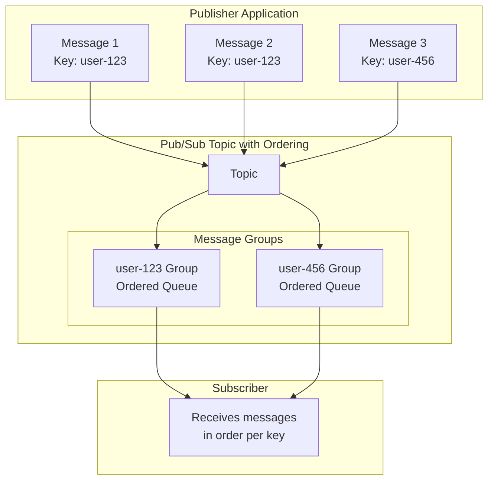
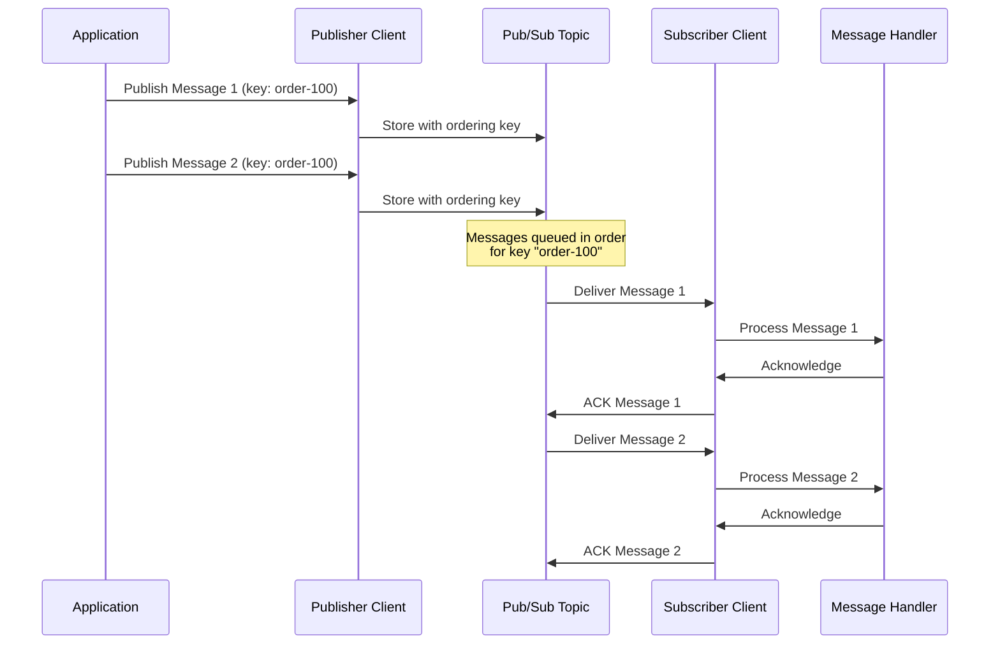
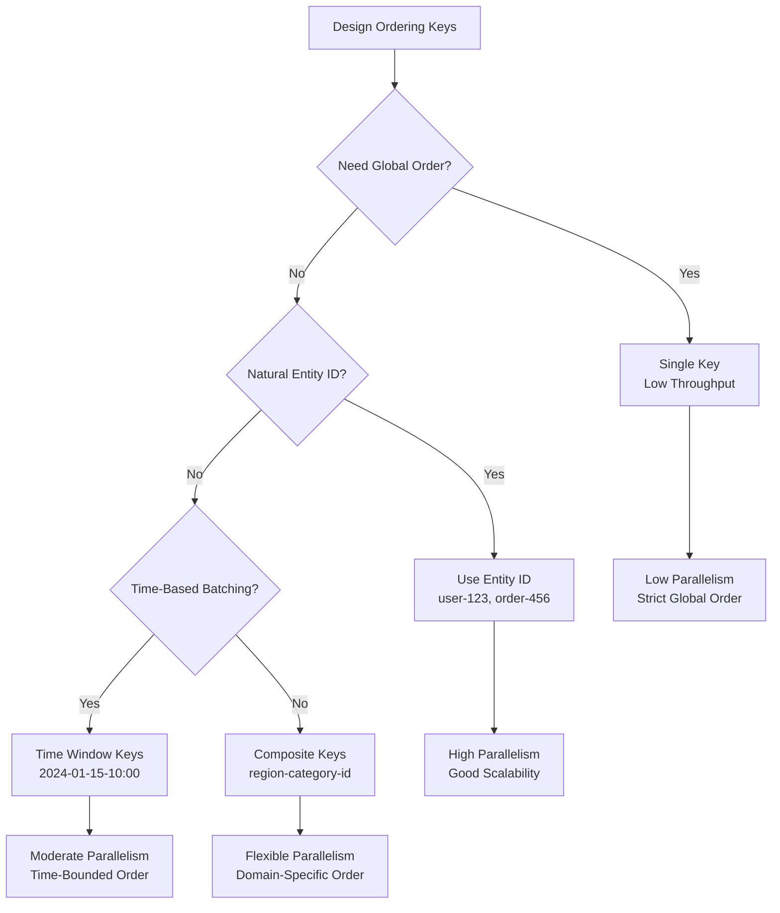
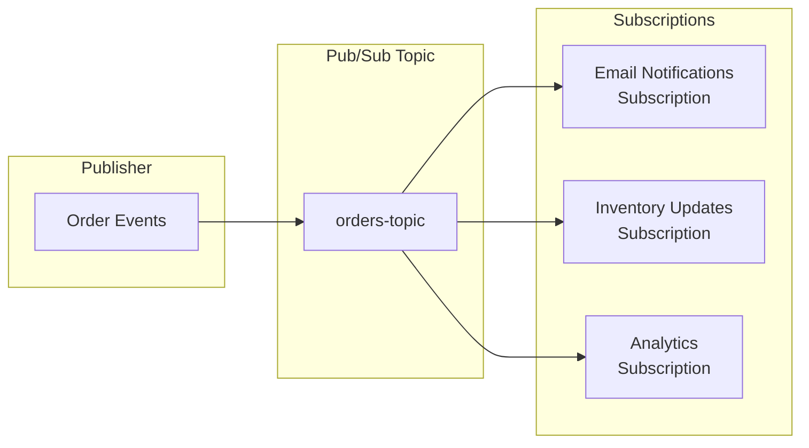
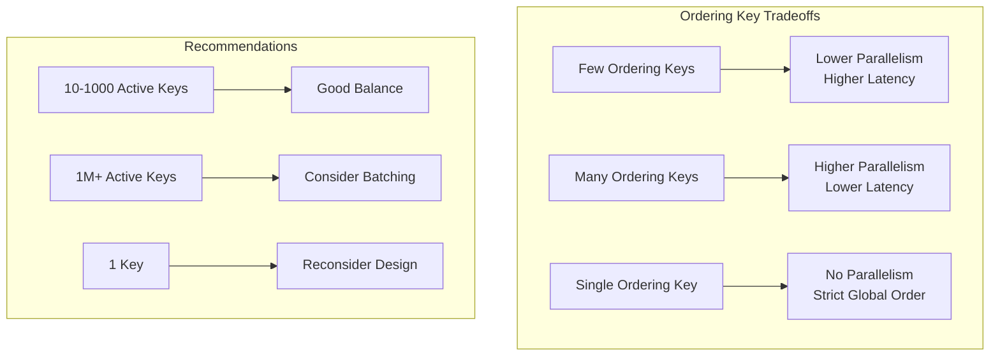

# How to Implement Pub/Sub Ordering Keys for Message Sequencing

Author: [nawazdhandala](https://github.com/nawazdhandala)

Tags: Google Cloud, Pub/Sub, Messaging, Event-Driven Architecture, Message Ordering, Distributed Systems

Description: Learn how to implement ordering keys in Google Cloud Pub/Sub to guarantee message sequencing. Covers configuration, best practices, error handling, and production patterns for maintaining message order in distributed systems.

---

Google Cloud Pub/Sub is a fully managed messaging service that provides reliable, scalable message delivery between applications. By default, Pub/Sub does not guarantee message ordering, which works well for many use cases. However, certain scenarios require strict message sequencing, such as processing financial transactions, maintaining state consistency, or handling event sourcing patterns. Ordering keys solve precisely these challenges.

## Understanding Message Ordering in Pub/Sub

Without ordering keys, Pub/Sub delivers messages in a best-effort manner optimized for throughput and low latency. Messages may arrive at subscribers out of order relative to their publish time. Ordering keys introduce a mechanism to maintain sequence for related messages.



Messages sharing the same ordering key are delivered in the exact order they were published. Different ordering keys operate independently, allowing parallel processing while maintaining order within each key group.

## Prerequisites and Setup

Before implementing ordering keys, ensure your environment is properly configured. Ordering requires specific settings on both the topic and subscription.

### Creating a Topic with Message Ordering Support

Topics must have message ordering enabled at creation time. You cannot enable ordering on existing topics, so plan accordingly.

The following command creates a topic with ordering enabled using the gcloud CLI.

```bash
# Create a topic with message ordering enabled
# The --message-ordering-enabled flag is required for ordering key support
gcloud pubsub topics create orders-topic \
    --message-ordering-enabled \
    --project=your-project-id

# Verify the topic was created with ordering enabled
gcloud pubsub topics describe orders-topic \
    --project=your-project-id
```

### Creating an Ordered Subscription

Subscriptions must also explicitly enable message ordering to receive messages in sequence.

```bash
# Create a subscription with message ordering enabled
# Both topic and subscription must have ordering enabled
gcloud pubsub subscriptions create orders-subscription \
    --topic=orders-topic \
    --enable-message-ordering \
    --ack-deadline=60 \
    --project=your-project-id

# For exactly-once delivery with ordering, add the flag
gcloud pubsub subscriptions create orders-exactly-once \
    --topic=orders-topic \
    --enable-message-ordering \
    --enable-exactly-once-delivery \
    --ack-deadline=60 \
    --project=your-project-id
```

## Message Ordering Flow

Understanding the internal flow helps you design better applications and troubleshoot issues effectively.



## Publishing Messages with Ordering Keys in Python

Python provides robust client libraries for Pub/Sub with full ordering key support. The publisher client handles batching and retries automatically.

### Basic Publisher Setup

The following example demonstrates publishing ordered messages. Each message includes an ordering key that determines its sequence group.

```python
from google.cloud import pubsub_v1
from google.cloud.pubsub_v1 import types
import json
from typing import Callable

# Project and topic configuration
PROJECT_ID = "your-project-id"
TOPIC_ID = "orders-topic"

def create_publisher_with_ordering() -> pubsub_v1.PublisherClient:
    """
    Create a publisher client configured for ordered message delivery.

    The client automatically handles batching and connection pooling.
    Ordering is enabled per-message via the ordering_key parameter.
    """
    # Configure batch settings for ordered publishing
    # Smaller batches reduce latency for time-sensitive ordered messages
    batch_settings = types.BatchSettings(
        max_messages=100,        # Maximum messages per batch
        max_bytes=1024 * 1024,   # Maximum batch size: 1MB
        max_latency=0.01,        # Maximum wait time: 10ms
    )

    # Publisher settings with retry configuration
    publisher_options = types.PublisherOptions(
        enable_message_ordering=True,  # Required for ordering key support
    )

    # Create the publisher client with custom settings
    publisher = pubsub_v1.PublisherClient(
        batch_settings=batch_settings,
        publisher_options=publisher_options,
    )

    return publisher


def publish_ordered_message(
    publisher: pubsub_v1.PublisherClient,
    ordering_key: str,
    message_data: dict
) -> str:
    """
    Publish a single message with an ordering key.

    Args:
        publisher: The configured publisher client
        ordering_key: Key that groups related messages for ordering
        message_data: Dictionary containing the message payload

    Returns:
        The message ID assigned by Pub/Sub

    Messages with the same ordering key are delivered in publish order.
    Different ordering keys are processed independently.
    """
    # Construct the fully qualified topic path
    topic_path = publisher.topic_path(PROJECT_ID, TOPIC_ID)

    # Serialize the message data to JSON bytes
    # Pub/Sub requires message data as bytes
    data = json.dumps(message_data).encode("utf-8")

    # Publish with the ordering key
    # The ordering_key parameter enables sequential delivery
    future = publisher.publish(
        topic_path,
        data=data,
        ordering_key=ordering_key,  # Messages with same key delivered in order
        # Optional attributes for filtering or metadata
        event_type="order_update",
        source_system="order-service",
    )

    # Wait for the publish to complete and get the message ID
    # For high-throughput scenarios, collect futures and wait in batches
    message_id = future.result(timeout=30)

    return message_id


def publish_order_events():
    """
    Example: Publishing a sequence of order lifecycle events.

    All events for the same order use the same ordering key,
    ensuring they are processed in the correct sequence.
    """
    publisher = create_publisher_with_ordering()

    # Order ID serves as the ordering key
    # All events for order-12345 will be delivered in sequence
    order_id = "order-12345"

    # Sequence of events that must be processed in order
    events = [
        {"event": "order_created", "order_id": order_id, "items": ["item1", "item2"]},
        {"event": "payment_received", "order_id": order_id, "amount": 99.99},
        {"event": "order_shipped", "order_id": order_id, "tracking": "TRACK123"},
        {"event": "order_delivered", "order_id": order_id, "signature": "John Doe"},
    ]

    print(f"Publishing {len(events)} ordered events for {order_id}")

    for event in events:
        message_id = publish_ordered_message(publisher, order_id, event)
        print(f"Published {event['event']} with ID: {message_id}")

    # Clean up publisher resources
    publisher.stop()


if __name__ == "__main__":
    publish_order_events()
```

### Handling Publish Failures with Ordering Keys

When a message fails to publish, subsequent messages with the same ordering key are blocked to maintain order. You must resume publishing explicitly after handling the failure.

```python
from google.cloud import pubsub_v1
from google.cloud.pubsub_v1 import types
from google.api_core import exceptions
import json
import time

PROJECT_ID = "your-project-id"
TOPIC_ID = "orders-topic"


class OrderedPublisher:
    """
    Publisher class with robust error handling for ordered messages.

    Maintains ordering guarantees even when publish failures occur.
    Automatically resumes publishing after transient errors.
    """

    def __init__(self, project_id: str, topic_id: str):
        self.project_id = project_id
        self.topic_id = topic_id

        # Configure publisher with ordering enabled
        publisher_options = types.PublisherOptions(
            enable_message_ordering=True,
        )

        self.publisher = pubsub_v1.PublisherClient(
            publisher_options=publisher_options,
        )

        self.topic_path = self.publisher.topic_path(project_id, topic_id)

    def publish_with_retry(
        self,
        ordering_key: str,
        data: dict,
        max_retries: int = 3
    ) -> str:
        """
        Publish a message with automatic retry on failure.

        Args:
            ordering_key: Key for message ordering
            data: Message payload as dictionary
            max_retries: Maximum retry attempts

        Returns:
            Message ID on success

        Raises:
            Exception: If all retries are exhausted

        When a publish fails, the ordering key becomes blocked.
        We must call resume_publish() before retrying to clear the block.
        """
        encoded_data = json.dumps(data).encode("utf-8")
        last_exception = None

        for attempt in range(max_retries):
            try:
                # Attempt to publish the message
                future = self.publisher.publish(
                    self.topic_path,
                    data=encoded_data,
                    ordering_key=ordering_key,
                )

                # Wait for confirmation with timeout
                message_id = future.result(timeout=30)
                return message_id

            except exceptions.GoogleAPICallError as e:
                last_exception = e
                print(f"Publish attempt {attempt + 1} failed: {e}")

                # Resume publishing for this ordering key
                # Without this, all future publishes for this key will fail
                self.publisher.resume_publish(self.topic_path, ordering_key)

                # Exponential backoff before retry
                if attempt < max_retries - 1:
                    sleep_time = (2 ** attempt) * 0.1  # 0.1s, 0.2s, 0.4s
                    time.sleep(sleep_time)

        # All retries exhausted
        raise last_exception

    def publish_batch_ordered(
        self,
        ordering_key: str,
        messages: list[dict]
    ) -> list[str]:
        """
        Publish multiple messages in order with a single ordering key.

        Args:
            ordering_key: Shared ordering key for all messages
            messages: List of message payloads

        Returns:
            List of message IDs in publish order

        Publishes messages sequentially to maintain strict ordering.
        If any message fails, subsequent messages are not published.
        """
        message_ids = []

        for i, message in enumerate(messages):
            try:
                message_id = self.publish_with_retry(ordering_key, message)
                message_ids.append(message_id)
                print(f"Published message {i + 1}/{len(messages)}: {message_id}")

            except Exception as e:
                print(f"Failed at message {i + 1}: {e}")
                print(f"Successfully published {len(message_ids)} messages before failure")
                raise

        return message_ids

    def close(self):
        """Clean up publisher resources."""
        self.publisher.stop()


def demonstrate_error_handling():
    """
    Example demonstrating ordered publishing with error recovery.
    """
    publisher = OrderedPublisher(PROJECT_ID, TOPIC_ID)

    try:
        # Publish a sequence of user activity events
        user_id = "user-789"
        events = [
            {"action": "login", "user_id": user_id, "timestamp": "2024-01-15T10:00:00Z"},
            {"action": "view_product", "user_id": user_id, "product_id": "prod-123"},
            {"action": "add_to_cart", "user_id": user_id, "product_id": "prod-123"},
            {"action": "checkout", "user_id": user_id, "cart_total": 149.99},
        ]

        message_ids = publisher.publish_batch_ordered(user_id, events)
        print(f"Successfully published {len(message_ids)} events")

    finally:
        publisher.close()


if __name__ == "__main__":
    demonstrate_error_handling()
```

## Subscribing to Ordered Messages in Python

Subscribers receiving ordered messages must acknowledge them in order. Failing to acknowledge a message blocks delivery of subsequent messages with the same ordering key.

```python
from google.cloud import pubsub_v1
from google.cloud.pubsub_v1 import types
import json
from concurrent.futures import TimeoutError
from typing import Callable

PROJECT_ID = "your-project-id"
SUBSCRIPTION_ID = "orders-subscription"


def create_ordered_subscriber() -> pubsub_v1.SubscriberClient:
    """
    Create a subscriber client for receiving ordered messages.

    The client handles connection management and message streaming.
    Flow control settings prevent memory issues during high throughput.
    """
    subscriber = pubsub_v1.SubscriberClient()
    return subscriber


def process_ordered_messages(
    message_handler: Callable[[dict, str], bool],
    timeout_seconds: float = None
):
    """
    Subscribe to and process ordered messages.

    Args:
        message_handler: Function to process each message
            Takes (message_data: dict, ordering_key: str) -> bool
            Returns True to acknowledge, False to nack
        timeout_seconds: How long to run (None for indefinite)

    Messages are delivered in order per ordering key.
    Acknowledgment order matters - nacking a message blocks subsequent
    messages with the same ordering key until it is acknowledged.
    """
    subscriber = create_ordered_subscriber()
    subscription_path = subscriber.subscription_path(PROJECT_ID, SUBSCRIPTION_ID)

    def callback(message: pubsub_v1.subscriber.message.Message):
        """
        Internal callback invoked for each received message.

        Parses the message and delegates to the handler.
        Handles ack/nack based on handler result.
        """
        try:
            # Extract ordering key from message attributes
            ordering_key = message.ordering_key

            # Parse message data from JSON
            data = json.loads(message.data.decode("utf-8"))

            print(f"Received message for key '{ordering_key}': {data}")

            # Delegate processing to the handler
            success = message_handler(data, ordering_key)

            if success:
                # Acknowledge successful processing
                # Next message for this ordering key can now be delivered
                message.ack()
                print(f"Acknowledged message for key: {ordering_key}")
            else:
                # Negative acknowledgment - message will be redelivered
                # Blocks subsequent messages for this ordering key
                message.nack()
                print(f"Nacked message for key: {ordering_key}")

        except json.JSONDecodeError as e:
            print(f"Failed to parse message: {e}")
            # Ack malformed messages to prevent blocking
            # Consider sending to a dead letter topic instead
            message.ack()

        except Exception as e:
            print(f"Processing error: {e}")
            # Nack to retry - be careful of infinite loops
            message.nack()

    # Configure flow control to manage memory usage
    flow_control = types.FlowControl(
        max_messages=100,           # Maximum outstanding messages
        max_bytes=10 * 1024 * 1024, # Maximum outstanding bytes: 10MB
    )

    # Start receiving messages
    streaming_pull_future = subscriber.subscribe(
        subscription_path,
        callback=callback,
        flow_control=flow_control,
    )

    print(f"Listening for messages on {subscription_path}")

    try:
        # Block until timeout or cancellation
        streaming_pull_future.result(timeout=timeout_seconds)
    except TimeoutError:
        print("Subscriber timed out")
        streaming_pull_future.cancel()
        streaming_pull_future.result()  # Wait for clean shutdown
    except KeyboardInterrupt:
        print("Subscriber interrupted")
        streaming_pull_future.cancel()


def example_message_handler(data: dict, ordering_key: str) -> bool:
    """
    Example handler that processes order events in sequence.

    Returns True if processing succeeded, False to retry.
    """
    event_type = data.get("event", "unknown")

    # Simulate processing based on event type
    if event_type == "order_created":
        print(f"Creating order record for {ordering_key}")
        # Insert into database

    elif event_type == "payment_received":
        print(f"Recording payment for {ordering_key}")
        # Update order status

    elif event_type == "order_shipped":
        print(f"Updating shipping status for {ordering_key}")
        # Send notification

    elif event_type == "order_delivered":
        print(f"Completing order {ordering_key}")
        # Finalize order

    else:
        print(f"Unknown event type: {event_type}")

    return True  # Acknowledge message


if __name__ == "__main__":
    # Process messages for 60 seconds
    process_ordered_messages(example_message_handler, timeout_seconds=60)
```

## Implementing Ordering Keys in Node.js

Node.js applications can leverage the official Google Cloud Pub/Sub library with async/await patterns for clean, readable code.

### Publisher Implementation

The following example shows a complete TypeScript implementation for publishing ordered messages with proper error handling.

```typescript
import { PubSub, Topic, PublishOptions } from "@google-cloud/pubsub";

// Configuration constants
const PROJECT_ID = "your-project-id";
const TOPIC_ID = "orders-topic";

/**
 * OrderedPublisher handles publishing messages with ordering guarantees.
 *
 * Manages the publisher lifecycle and provides retry logic for
 * transient failures while maintaining message ordering.
 */
class OrderedPublisher {
  private pubsub: PubSub;
  private topic: Topic;

  constructor(projectId: string, topicId: string) {
    // Initialize the Pub/Sub client
    this.pubsub = new PubSub({ projectId });

    // Get a reference to the topic with ordering enabled
    // The topic must have been created with ordering support
    this.topic = this.pubsub.topic(topicId, {
      // Enable message ordering for this topic reference
      enableMessageOrdering: true,
      // Configure batching for ordered messages
      batching: {
        maxMessages: 100,
        maxMilliseconds: 10,
      },
    });
  }

  /**
   * Publish a single message with an ordering key.
   *
   * @param orderingKey - Groups related messages for ordering
   * @param data - Message payload object
   * @param attributes - Optional message attributes
   * @returns Promise resolving to the message ID
   *
   * Messages with the same ordering key are delivered in publish order.
   */
  async publish(
    orderingKey: string,
    data: Record<string, unknown>,
    attributes?: Record<string, string>
  ): Promise<string> {
    // Serialize the data to a Buffer
    const dataBuffer = Buffer.from(JSON.stringify(data));

    try {
      // Publish with ordering key
      const messageId = await this.topic.publishMessage({
        data: dataBuffer,
        orderingKey: orderingKey,
        attributes: attributes,
      });

      console.log(`Published message ${messageId} with key: ${orderingKey}`);
      return messageId;
    } catch (error) {
      console.error(`Failed to publish: ${error}`);

      // Resume publishing for this ordering key after failure
      // Required to unblock subsequent messages
      this.topic.resumePublishing(orderingKey);

      throw error;
    }
  }

  /**
   * Publish multiple messages in sequence with the same ordering key.
   *
   * @param orderingKey - Shared ordering key for all messages
   * @param messages - Array of message payloads
   * @returns Promise resolving to array of message IDs
   *
   * Publishes messages sequentially, stopping on first failure.
   */
  async publishBatch(
    orderingKey: string,
    messages: Record<string, unknown>[]
  ): Promise<string[]> {
    const messageIds: string[] = [];

    for (const message of messages) {
      const messageId = await this.publish(orderingKey, message);
      messageIds.push(messageId);
    }

    return messageIds;
  }

  /**
   * Publish with retry logic for transient failures.
   *
   * @param orderingKey - Ordering key for the message
   * @param data - Message payload
   * @param maxRetries - Maximum retry attempts (default: 3)
   * @returns Promise resolving to message ID
   */
  async publishWithRetry(
    orderingKey: string,
    data: Record<string, unknown>,
    maxRetries: number = 3
  ): Promise<string> {
    let lastError: Error | null = null;

    for (let attempt = 0; attempt < maxRetries; attempt++) {
      try {
        return await this.publish(orderingKey, data);
      } catch (error) {
        lastError = error as Error;
        console.warn(`Attempt ${attempt + 1} failed: ${error}`);

        // Exponential backoff
        if (attempt < maxRetries - 1) {
          const delay = Math.pow(2, attempt) * 100;
          await new Promise((resolve) => setTimeout(resolve, delay));
        }
      }
    }

    throw lastError;
  }

  /**
   * Flush pending messages and close the publisher.
   */
  async close(): Promise<void> {
    await this.topic.flush();
    await this.pubsub.close();
  }
}

/**
 * Example: Publishing order lifecycle events.
 */
async function main(): Promise<void> {
  const publisher = new OrderedPublisher(PROJECT_ID, TOPIC_ID);

  try {
    const orderId = "order-67890";

    // Order events that must be processed in sequence
    const events = [
      { event: "order_created", orderId, items: ["widget", "gadget"] },
      { event: "payment_processed", orderId, amount: 249.99 },
      { event: "inventory_reserved", orderId, warehouse: "west-1" },
      { event: "order_shipped", orderId, carrier: "fedex" },
    ];

    console.log(`Publishing ${events.length} events for ${orderId}`);

    const messageIds = await publisher.publishBatch(orderId, events);

    console.log(`Successfully published ${messageIds.length} messages`);
    console.log("Message IDs:", messageIds);
  } finally {
    await publisher.close();
  }
}

main().catch(console.error);
```

### Subscriber Implementation

Receiving ordered messages requires careful acknowledgment handling to maintain ordering guarantees.

```typescript
import { PubSub, Subscription, Message } from "@google-cloud/pubsub";

const PROJECT_ID = "your-project-id";
const SUBSCRIPTION_ID = "orders-subscription";

/**
 * MessageHandler processes received messages.
 * Returns true if processing succeeded, false to retry.
 */
type MessageHandler = (
  data: Record<string, unknown>,
  orderingKey: string,
  attributes: Record<string, string>
) => Promise<boolean>;

/**
 * OrderedSubscriber receives and processes messages in order.
 *
 * Handles message delivery, acknowledgment, and flow control
 * while maintaining ordering guarantees per ordering key.
 */
class OrderedSubscriber {
  private pubsub: PubSub;
  private subscription: Subscription;
  private handler: MessageHandler;

  constructor(
    projectId: string,
    subscriptionId: string,
    handler: MessageHandler
  ) {
    this.pubsub = new PubSub({ projectId });
    this.subscription = this.pubsub.subscription(subscriptionId, {
      // Flow control prevents memory exhaustion
      flowControl: {
        maxMessages: 100,
        maxBytes: 10 * 1024 * 1024, // 10MB
        allowExcessMessages: false,
      },
    });
    this.handler = handler;
  }

  /**
   * Start receiving messages.
   *
   * Messages are delivered in order per ordering key.
   * Acknowledgment must happen in order to receive next message.
   */
  start(): void {
    // Handle incoming messages
    this.subscription.on("message", this.onMessage.bind(this));

    // Handle errors
    this.subscription.on("error", (error) => {
      console.error("Subscription error:", error);
    });

    console.log(`Listening for messages on ${SUBSCRIPTION_ID}`);
  }

  /**
   * Internal message handler.
   *
   * Parses the message, delegates to the handler, and manages ack/nack.
   */
  private async onMessage(message: Message): Promise<void> {
    const orderingKey = message.orderingKey || "";

    try {
      // Parse message data
      const data = JSON.parse(message.data.toString());
      const attributes = message.attributes || {};

      console.log(`Received message for key '${orderingKey}':`, data);

      // Delegate processing to handler
      const success = await this.handler(data, orderingKey, attributes);

      if (success) {
        // Acknowledge successful processing
        message.ack();
        console.log(`Acknowledged message for key: ${orderingKey}`);
      } else {
        // Nack for retry - blocks subsequent messages for this key
        message.nack();
        console.log(`Nacked message for key: ${orderingKey}`);
      }
    } catch (error) {
      console.error(`Error processing message: ${error}`);
      // Nack to retry
      message.nack();
    }
  }

  /**
   * Stop receiving messages and clean up.
   */
  async stop(): Promise<void> {
    await this.subscription.close();
    await this.pubsub.close();
  }
}

/**
 * Example message handler for order events.
 */
async function handleOrderEvent(
  data: Record<string, unknown>,
  orderingKey: string,
  attributes: Record<string, string>
): Promise<boolean> {
  const eventType = data.event as string;
  const orderId = data.orderId as string;

  console.log(`Processing ${eventType} for ${orderId}`);

  // Simulate event-specific processing
  switch (eventType) {
    case "order_created":
      // Create order record in database
      console.log("Creating order record...");
      break;

    case "payment_processed":
      // Update payment status
      console.log("Recording payment...");
      break;

    case "inventory_reserved":
      // Reserve inventory items
      console.log("Reserving inventory...");
      break;

    case "order_shipped":
      // Update shipping status and notify customer
      console.log("Updating shipping status...");
      break;

    default:
      console.log(`Unknown event type: ${eventType}`);
  }

  // Return true to acknowledge
  return true;
}

/**
 * Main entry point.
 */
async function main(): Promise<void> {
  const subscriber = new OrderedSubscriber(
    PROJECT_ID,
    SUBSCRIPTION_ID,
    handleOrderEvent
  );

  subscriber.start();

  // Run for 60 seconds then stop
  await new Promise((resolve) => setTimeout(resolve, 60000));
  await subscriber.stop();

  console.log("Subscriber stopped");
}

main().catch(console.error);
```

## Best Practices for Ordering Key Design

Choosing appropriate ordering keys significantly impacts performance and scalability. Consider these guidelines when designing your ordering key strategy.



### Key Design Recommendations

Follow these principles for effective ordering key design.

```python
# Example: Different ordering key strategies

# Strategy 1: Entity-based keys (recommended for most cases)
# High parallelism with per-entity ordering
def entity_based_key(entity_type: str, entity_id: str) -> str:
    """
    Create ordering key based on entity identity.

    Good for: user events, order processing, account updates
    Parallelism: High (one stream per entity)
    """
    return f"{entity_type}-{entity_id}"

# Examples:
# - "user-12345" for user activity tracking
# - "order-67890" for order lifecycle events
# - "account-abc123" for account state changes


# Strategy 2: Composite keys for domain-specific ordering
# Balances ordering scope with parallelism
def composite_key(region: str, category: str, entity_id: str) -> str:
    """
    Create ordering key with multiple dimensions.

    Good for: regional processing, category-based workflows
    Parallelism: Moderate (one stream per combination)
    """
    return f"{region}-{category}-{entity_id}"

# Examples:
# - "us-west-electronics-12345" for regional inventory
# - "eu-payments-acc-789" for regional payment processing


# Strategy 3: Time-window keys for batch ordering
# Groups events within time windows
def time_window_key(entity_id: str, window_minutes: int = 5) -> str:
    """
    Create ordering key with time-based grouping.

    Good for: batch processing, time-series aggregation
    Parallelism: Changes over time (new key each window)
    """
    from datetime import datetime

    now = datetime.utcnow()
    window_start = now.replace(
        minute=(now.minute // window_minutes) * window_minutes,
        second=0,
        microsecond=0
    )
    window_str = window_start.strftime("%Y%m%d-%H%M")

    return f"{entity_id}-{window_str}"

# Examples:
# - "sensor-001-20240115-1030" for 5-minute sensor windows
# - "metrics-app1-20240115-1000" for hourly metric batches


# Strategy 4: Avoid single global key (anti-pattern)
def global_key() -> str:
    """
    Single key for all messages - AVOID THIS.

    Problems:
    - No parallelism at all
    - Single point of failure
    - Severe throughput limitations
    """
    return "global"  # Don't do this!


# Strategy 5: Cardinality considerations
def balanced_key(entity_id: str, max_partitions: int = 1000) -> str:
    """
    Limit key cardinality for predictable resource usage.

    Very high cardinality (millions of keys) can increase
    memory usage and reduce batching efficiency.
    """
    # Hash to bounded partition space
    partition = hash(entity_id) % max_partitions
    return f"partition-{partition}-{entity_id}"
```

## Handling Common Scenarios

Several scenarios require special consideration when using ordering keys.

### Scenario 1: Ordered Fan-Out

Multiple subscribers need to process the same ordered stream independently.



Each subscription maintains independent ordering. Create multiple subscriptions to the same topic for different processing pipelines.

```bash
# Create multiple ordered subscriptions for different consumers
gcloud pubsub subscriptions create order-notifications \
    --topic=orders-topic \
    --enable-message-ordering \
    --project=your-project-id

gcloud pubsub subscriptions create order-inventory \
    --topic=orders-topic \
    --enable-message-ordering \
    --project=your-project-id

gcloud pubsub subscriptions create order-analytics \
    --topic=orders-topic \
    --enable-message-ordering \
    --project=your-project-id
```

### Scenario 2: Dead Letter Handling with Ordering

Failed messages need special handling to prevent blocking the entire ordering key stream.

```python
from google.cloud import pubsub_v1
import json

PROJECT_ID = "your-project-id"
SUBSCRIPTION_ID = "orders-subscription"
DLQ_TOPIC_ID = "orders-dlq"


class OrderedSubscriberWithDLQ:
    """
    Subscriber that routes failed messages to a dead letter topic
    after maximum retry attempts.

    Prevents permanent blocking of ordering key streams while
    preserving failed messages for investigation.
    """

    def __init__(
        self,
        project_id: str,
        subscription_id: str,
        dlq_topic_id: str,
        max_delivery_attempts: int = 5
    ):
        self.subscriber = pubsub_v1.SubscriberClient()
        self.publisher = pubsub_v1.PublisherClient()

        self.subscription_path = self.subscriber.subscription_path(
            project_id, subscription_id
        )
        self.dlq_topic_path = self.publisher.topic_path(
            project_id, dlq_topic_id
        )

        self.max_delivery_attempts = max_delivery_attempts

    def process_message(self, message: pubsub_v1.subscriber.message.Message):
        """
        Process a message with dead letter queue routing.

        Tracks delivery attempts and routes to DLQ after threshold.
        """
        ordering_key = message.ordering_key
        delivery_attempt = message.delivery_attempt or 1

        try:
            data = json.loads(message.data.decode("utf-8"))

            # Attempt to process the message
            success = self.handle_event(data, ordering_key)

            if success:
                message.ack()
                print(f"Processed message for key: {ordering_key}")
            else:
                # Check if max attempts exceeded
                if delivery_attempt >= self.max_delivery_attempts:
                    # Route to dead letter queue
                    self.send_to_dlq(message, "Processing failed after retries")
                    message.ack()  # Ack to unblock ordering key
                else:
                    # Nack for retry
                    message.nack()
                    print(f"Retry {delivery_attempt} for key: {ordering_key}")

        except Exception as e:
            if delivery_attempt >= self.max_delivery_attempts:
                self.send_to_dlq(message, str(e))
                message.ack()
            else:
                message.nack()

    def send_to_dlq(
        self,
        original_message: pubsub_v1.subscriber.message.Message,
        error_reason: str
    ):
        """
        Send a failed message to the dead letter queue.

        Preserves original message data and adds error metadata.
        """
        dlq_data = {
            "original_data": original_message.data.decode("utf-8"),
            "ordering_key": original_message.ordering_key,
            "error_reason": error_reason,
            "delivery_attempts": original_message.delivery_attempt,
            "original_attributes": dict(original_message.attributes),
        }

        self.publisher.publish(
            self.dlq_topic_path,
            data=json.dumps(dlq_data).encode("utf-8"),
            original_ordering_key=original_message.ordering_key,
        )

        print(f"Sent to DLQ: {original_message.ordering_key}")

    def handle_event(self, data: dict, ordering_key: str) -> bool:
        """
        Business logic for processing events.
        Override in subclass for specific handling.
        """
        # Implement your processing logic
        return True
```

## Monitoring Ordered Message Delivery

Tracking metrics helps ensure ordering is working correctly and identify issues early.

```python
from google.cloud import monitoring_v3
from google.protobuf import timestamp_pb2
import time

PROJECT_ID = "your-project-id"
SUBSCRIPTION_ID = "orders-subscription"


def get_subscription_metrics():
    """
    Query Pub/Sub metrics to monitor ordered message delivery.

    Key metrics for ordering:
    - oldest_unacked_message_age: Indicates blocking issues
    - num_undelivered_messages: Backlog size
    - ack_message_count: Processing throughput
    """
    client = monitoring_v3.MetricServiceClient()
    project_name = f"projects/{PROJECT_ID}"

    # Time range for query (last 10 minutes)
    now = time.time()
    start_time = timestamp_pb2.Timestamp()
    start_time.FromSeconds(int(now - 600))
    end_time = timestamp_pb2.Timestamp()
    end_time.FromSeconds(int(now))

    interval = monitoring_v3.TimeInterval(
        start_time=start_time,
        end_time=end_time,
    )

    # Query oldest unacked message age
    # High values indicate potential ordering key blocking
    results = client.list_time_series(
        request={
            "name": project_name,
            "filter": f'''
                metric.type="pubsub.googleapis.com/subscription/oldest_unacked_message_age"
                AND resource.labels.subscription_id="{SUBSCRIPTION_ID}"
            ''',
            "interval": interval,
            "view": monitoring_v3.ListTimeSeriesRequest.TimeSeriesView.FULL,
        }
    )

    for series in results:
        for point in series.points:
            age_seconds = point.value.double_value
            print(f"Oldest unacked message age: {age_seconds:.2f}s")

            # Alert if messages are stuck (potential ordering issue)
            if age_seconds > 300:  # 5 minutes
                print("WARNING: Messages may be blocked due to ordering key issues")


def create_alerting_policy():
    """
    Create an alerting policy for ordered message delivery issues.

    Alerts when messages are stuck for too long, which often
    indicates a blocked ordering key.
    """
    client = monitoring_v3.AlertPolicyServiceClient()
    project_name = f"projects/{PROJECT_ID}"

    # Alert if oldest unacked message exceeds threshold
    condition = monitoring_v3.AlertPolicy.Condition(
        display_name="Ordered messages stuck",
        condition_threshold=monitoring_v3.AlertPolicy.Condition.MetricThreshold(
            filter=f'''
                metric.type="pubsub.googleapis.com/subscription/oldest_unacked_message_age"
                AND resource.labels.subscription_id="{SUBSCRIPTION_ID}"
            ''',
            comparison=monitoring_v3.ComparisonType.COMPARISON_GT,
            threshold_value=300.0,  # 5 minutes
            duration={"seconds": 60},
            aggregations=[
                monitoring_v3.Aggregation(
                    alignment_period={"seconds": 60},
                    per_series_aligner=monitoring_v3.Aggregation.Aligner.ALIGN_MAX,
                )
            ],
        ),
    )

    policy = monitoring_v3.AlertPolicy(
        display_name="Pub/Sub Ordering Key Blocked Alert",
        conditions=[condition],
        combiner=monitoring_v3.AlertPolicy.ConditionCombinerType.OR,
        notification_channels=[
            # Add your notification channel names here
        ],
    )

    created_policy = client.create_alert_policy(
        request={"name": project_name, "alert_policy": policy}
    )

    print(f"Created alert policy: {created_policy.name}")
```

## Performance Considerations

Ordering keys impact throughput and latency. Understanding these tradeoffs helps you design systems that balance ordering requirements with performance needs.



### Performance Tips

Apply these recommendations for optimal performance with ordering keys.

1. **Use fine-grained ordering keys**: More unique keys enable greater parallelism
2. **Batch related messages**: Reduce per-message overhead by batching logically related messages
3. **Acknowledge promptly**: Slow acknowledgment blocks the entire ordering key stream
4. **Monitor backlog**: Growing backlogs indicate processing cannot keep up with publish rate
5. **Use exactly-once sparingly**: Exactly-once delivery adds latency overhead

## Summary

Pub/Sub ordering keys provide a powerful mechanism for maintaining message sequence in distributed systems. Key takeaways include:

- Topics and subscriptions must both enable message ordering
- Messages with the same ordering key are delivered in publish order
- Publish failures block subsequent messages until the publisher resumes
- Subscriber acknowledgment order matters for maintaining ordering
- Design ordering keys for appropriate parallelism and your domain needs
- Monitor for blocked ordering keys to catch issues early

Ordering keys work best when you need per-entity ordering rather than global ordering. For strict global ordering across all messages, consider using a single partition or a different messaging system designed for that use case.
