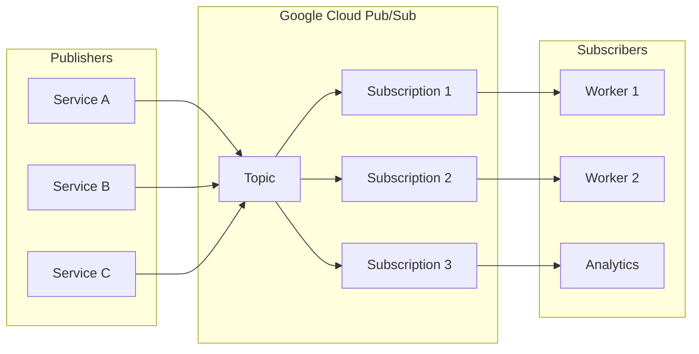
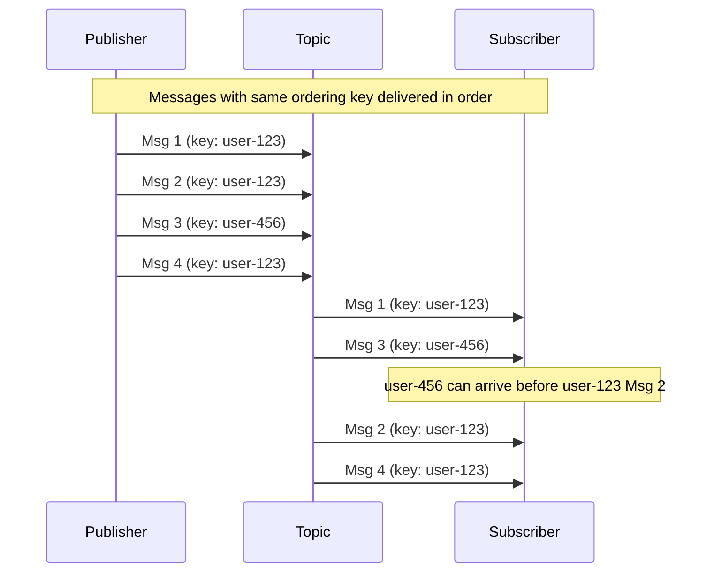
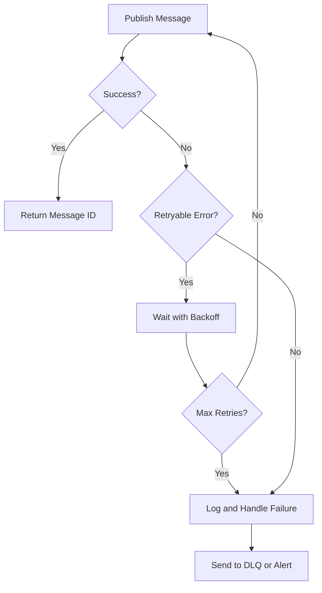
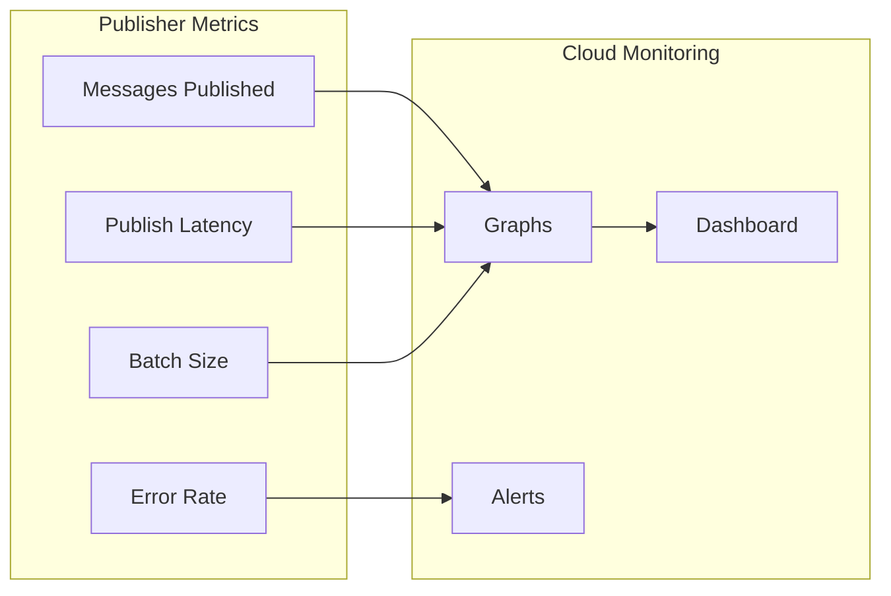

# How to Publish Messages to Pub/Sub

Author: [nawazdhandala](https://github.com/nawazdhandala)

Tags: Google Cloud, Pub/Sub, Messaging, Event-Driven Architecture, Node.js, Python, Go, Backend

Description: Learn how to publish messages to Google Cloud Pub/Sub with practical examples in Node.js, Python, and Go. Covers basic publishing, batch operations, message ordering, error handling, and production best practices.

---

Google Cloud Pub/Sub provides a scalable, durable messaging service for building event-driven systems. Publishing messages to Pub/Sub topics enables decoupled communication between services, making it ideal for microservices architectures, real-time analytics pipelines, and asynchronous workloads.

## Understanding Pub/Sub Publishing

Pub/Sub follows a publisher-subscriber pattern where publishers send messages to topics, and subscribers receive messages from subscriptions attached to those topics. Publishers do not need to know which subscribers exist, enabling loose coupling between system components.



## Prerequisites

Before publishing messages, you need to set up your Google Cloud project and create a topic.

Creating a topic using the gcloud CLI:

```bash
# Set your project ID
export PROJECT_ID="your-project-id"

# Create a new Pub/Sub topic
gcloud pubsub topics create orders-topic --project=$PROJECT_ID

# Create a subscription for testing
gcloud pubsub subscriptions create orders-subscription \
    --topic=orders-topic \
    --project=$PROJECT_ID

# List existing topics
gcloud pubsub topics list --project=$PROJECT_ID
```

## Basic Publishing with Node.js

The Google Cloud Pub/Sub client library provides a straightforward API for publishing messages. Each message consists of data (the payload) and optional attributes (metadata key-value pairs).

```javascript
// Import the Pub/Sub client library
const { PubSub } = require('@google-cloud/pubsub');

// Create a client instance - credentials are automatically detected
// from GOOGLE_APPLICATION_CREDENTIALS environment variable
const pubsub = new PubSub({
    projectId: 'your-project-id',
});

async function publishMessage(topicName, data) {
    // Get a reference to the topic
    const topic = pubsub.topic(topicName);

    // Convert the message data to a Buffer
    // Pub/Sub messages must be sent as binary data
    const messageBuffer = Buffer.from(JSON.stringify(data));

    try {
        // Publish the message and get the message ID
        const messageId = await topic.publishMessage({
            data: messageBuffer,
        });

        console.log(`Message ${messageId} published to ${topicName}`);
        return messageId;
    } catch (error) {
        console.error(`Error publishing message: ${error.message}`);
        throw error;
    }
}

// Example usage: publish an order event
const orderData = {
    orderId: 'ORD-12345',
    customerId: 'CUST-67890',
    items: [
        { productId: 'PROD-001', quantity: 2, price: 29.99 },
        { productId: 'PROD-002', quantity: 1, price: 49.99 },
    ],
    total: 109.97,
    timestamp: new Date().toISOString(),
};

publishMessage('orders-topic', orderData);
```

## Publishing with Attributes

Message attributes provide metadata that subscribers can use for filtering or routing without parsing the message body. Attributes are string key-value pairs attached to each message.

```javascript
const { PubSub } = require('@google-cloud/pubsub');

const pubsub = new PubSub();

async function publishWithAttributes(topicName, data, attributes) {
    const topic = pubsub.topic(topicName);
    const messageBuffer = Buffer.from(JSON.stringify(data));

    try {
        // Include attributes with the message
        // Attributes enable filtering at the subscription level
        const messageId = await topic.publishMessage({
            data: messageBuffer,
            attributes: attributes,
        });

        console.log(`Message ${messageId} published with attributes`);
        return messageId;
    } catch (error) {
        console.error(`Error publishing: ${error.message}`);
        throw error;
    }
}

// Publish with routing and filtering attributes
const eventData = {
    eventType: 'ORDER_CREATED',
    payload: {
        orderId: 'ORD-12345',
        amount: 99.99,
    },
};

// Attributes can be used for subscription filters
const attributes = {
    eventType: 'ORDER_CREATED',
    region: 'us-east-1',
    priority: 'high',
    source: 'checkout-service',
};

publishWithAttributes('events-topic', eventData, attributes);
```

## Batch Publishing for High Throughput

When publishing many messages, batching improves throughput by combining multiple messages into single API calls. Configure batch settings based on your latency and throughput requirements.

```javascript
const { PubSub } = require('@google-cloud/pubsub');

// Configure batching settings for optimal throughput
const pubsub = new PubSub();

async function createBatchPublisher(topicName) {
    const topic = pubsub.topic(topicName, {
        batching: {
            // Maximum number of messages in a batch
            maxMessages: 100,
            // Maximum size of a batch in bytes
            maxBytes: 1024 * 1024, // 1 MB
            // Maximum time to wait before sending a batch (milliseconds)
            maxMilliseconds: 10,
        },
    });

    return topic;
}

async function publishBatch(topic, messages) {
    // Track all publish promises
    const publishPromises = [];

    for (const message of messages) {
        // Each publish call adds to the current batch
        // Messages are automatically batched and sent together
        const promise = topic.publishMessage({
            data: Buffer.from(JSON.stringify(message.data)),
            attributes: message.attributes || {},
        });

        publishPromises.push(promise);
    }

    try {
        // Wait for all messages to be published
        const messageIds = await Promise.all(publishPromises);
        console.log(`Published ${messageIds.length} messages in batch`);
        return messageIds;
    } catch (error) {
        console.error(`Batch publishing error: ${error.message}`);
        throw error;
    }
}

// Example: publish 1000 messages efficiently
async function publishManyOrders() {
    const topic = await createBatchPublisher('orders-topic');

    const messages = [];
    for (let i = 0; i < 1000; i++) {
        messages.push({
            data: {
                orderId: `ORD-${i}`,
                amount: Math.random() * 100,
                timestamp: new Date().toISOString(),
            },
            attributes: {
                batchId: 'batch-001',
                index: String(i),
            },
        });
    }

    const startTime = Date.now();
    await publishBatch(topic, messages);
    console.log(`Completed in ${Date.now() - startTime}ms`);
}

publishManyOrders();
```

## Message Ordering

Pub/Sub supports ordered message delivery using ordering keys. Messages with the same ordering key are delivered to subscribers in the order they were published.



Implementing ordered publishing requires enabling message ordering on the topic and providing ordering keys.

```javascript
const { PubSub } = require('@google-cloud/pubsub');

const pubsub = new PubSub();

async function publishOrderedMessages(topicName, messages) {
    // Enable message ordering on the topic
    const topic = pubsub.topic(topicName, {
        enableMessageOrdering: true,
    });

    const results = [];

    for (const message of messages) {
        try {
            // Include orderingKey to ensure ordered delivery
            // Messages with the same orderingKey are delivered in order
            const messageId = await topic.publishMessage({
                data: Buffer.from(JSON.stringify(message.data)),
                orderingKey: message.orderingKey,
                attributes: message.attributes || {},
            });

            results.push({ success: true, messageId });
        } catch (error) {
            // If ordering is enabled and a publish fails,
            // subsequent messages with the same key will fail
            // until you resume publishing
            console.error(`Failed to publish: ${error.message}`);

            // Resume publishing for this ordering key
            topic.resumePublishing(message.orderingKey);

            results.push({ success: false, error: error.message });
        }
    }

    return results;
}

// Example: publish user activity events in order
const userActivityMessages = [
    {
        orderingKey: 'user-12345',
        data: { action: 'login', timestamp: Date.now() },
    },
    {
        orderingKey: 'user-12345',
        data: { action: 'view_product', productId: 'P001', timestamp: Date.now() + 1 },
    },
    {
        orderingKey: 'user-12345',
        data: { action: 'add_to_cart', productId: 'P001', timestamp: Date.now() + 2 },
    },
    {
        orderingKey: 'user-67890',
        data: { action: 'login', timestamp: Date.now() },
    },
];

publishOrderedMessages('user-activity-topic', userActivityMessages);
```

## Python Implementation

Python provides an equally powerful client library for Pub/Sub publishing with support for async operations and batching.

```python
from google.cloud import pubsub_v1
from google.api_core import retry
import json
from typing import Dict, List, Optional
from concurrent import futures

# Create a publisher client with custom batch settings
batch_settings = pubsub_v1.types.BatchSettings(
    max_messages=100,      # Maximum messages per batch
    max_bytes=1024 * 1024, # Maximum batch size (1 MB)
    max_latency=0.01,      # Maximum wait time (10 ms)
)

publisher = pubsub_v1.PublisherClient(batch_settings=batch_settings)


def publish_message(
    project_id: str,
    topic_id: str,
    data: Dict,
    attributes: Optional[Dict[str, str]] = None
) -> str:
    """
    Publish a single message to a Pub/Sub topic.

    Args:
        project_id: Google Cloud project ID
        topic_id: Name of the Pub/Sub topic
        data: Message payload (will be JSON serialized)
        attributes: Optional message attributes

    Returns:
        Message ID of the published message
    """
    # Construct the topic path
    topic_path = publisher.topic_path(project_id, topic_id)

    # Encode the message data as bytes
    message_data = json.dumps(data).encode('utf-8')

    # Prepare attributes (must be string values)
    attrs = attributes or {}

    # Publish the message
    # Returns a future that resolves to the message ID
    future = publisher.publish(
        topic_path,
        data=message_data,
        **attrs  # Attributes are passed as keyword arguments
    )

    # Wait for the publish to complete and get the message ID
    message_id = future.result()
    print(f"Published message {message_id} to {topic_id}")

    return message_id


def publish_with_retry(
    project_id: str,
    topic_id: str,
    data: Dict,
    attributes: Optional[Dict[str, str]] = None
) -> str:
    """
    Publish a message with custom retry settings.
    Automatically retries on transient errors.
    """
    topic_path = publisher.topic_path(project_id, topic_id)
    message_data = json.dumps(data).encode('utf-8')

    # Configure retry behavior for transient failures
    custom_retry = retry.Retry(
        initial=0.1,        # Initial delay (seconds)
        maximum=60.0,       # Maximum delay (seconds)
        multiplier=2.0,     # Delay multiplier
        deadline=300.0,     # Total retry deadline (seconds)
    )

    future = publisher.publish(
        topic_path,
        data=message_data,
        retry=custom_retry,
        **(attributes or {})
    )

    return future.result()


# Example usage
if __name__ == '__main__':
    PROJECT_ID = 'your-project-id'
    TOPIC_ID = 'orders-topic'

    order_data = {
        'orderId': 'ORD-12345',
        'customerId': 'CUST-67890',
        'items': [
            {'productId': 'PROD-001', 'quantity': 2, 'price': 29.99},
        ],
        'total': 59.98,
    }

    message_id = publish_message(
        PROJECT_ID,
        TOPIC_ID,
        order_data,
        attributes={'eventType': 'ORDER_CREATED', 'priority': 'high'}
    )
```

## Batch Publishing in Python

For high-volume scenarios, Python supports efficient batch publishing with callbacks for tracking publish results.

```python
from google.cloud import pubsub_v1
from concurrent import futures
import json
from typing import List, Dict, Callable
import time


class BatchPublisher:
    """
    High-throughput batch publisher for Pub/Sub.
    Tracks publish results and handles errors.
    """

    def __init__(self, project_id: str, topic_id: str):
        self.project_id = project_id
        self.topic_id = topic_id

        # Configure batch settings for high throughput
        batch_settings = pubsub_v1.types.BatchSettings(
            max_messages=1000,
            max_bytes=10 * 1024 * 1024,  # 10 MB
            max_latency=0.05,  # 50 ms
        )

        self.publisher = pubsub_v1.PublisherClient(
            batch_settings=batch_settings
        )
        self.topic_path = self.publisher.topic_path(project_id, topic_id)

        # Track publish futures
        self.publish_futures: List[futures.Future] = []

    def publish(self, data: Dict, attributes: Dict[str, str] = None) -> None:
        """Add a message to the batch."""
        message_data = json.dumps(data).encode('utf-8')

        future = self.publisher.publish(
            self.topic_path,
            data=message_data,
            **(attributes or {})
        )

        # Add callback for tracking
        future.add_done_callback(self._callback)
        self.publish_futures.append(future)

    def _callback(self, future: futures.Future) -> None:
        """Handle publish completion or failure."""
        try:
            message_id = future.result()
            # Successfully published
        except Exception as e:
            print(f"Publish failed: {e}")

    def wait_for_completion(self, timeout: float = 60.0) -> Dict:
        """
        Wait for all pending publishes to complete.
        Returns statistics about the batch.
        """
        done, not_done = futures.wait(
            self.publish_futures,
            timeout=timeout,
            return_when=futures.ALL_COMPLETED
        )

        successful = sum(1 for f in done if not f.exception())
        failed = len(done) - successful
        pending = len(not_done)

        self.publish_futures.clear()

        return {
            'successful': successful,
            'failed': failed,
            'pending': pending,
        }


def publish_batch_example():
    """Example of high-throughput batch publishing."""
    publisher = BatchPublisher('your-project-id', 'events-topic')

    # Publish 10,000 messages
    start_time = time.time()

    for i in range(10000):
        publisher.publish(
            data={
                'eventId': f'EVT-{i}',
                'timestamp': time.time(),
                'value': i * 1.5,
            },
            attributes={
                'eventType': 'METRIC',
                'source': 'batch-publisher',
            }
        )

    # Wait for all messages to be sent
    results = publisher.wait_for_completion()

    elapsed = time.time() - start_time
    print(f"Published {results['successful']} messages in {elapsed:.2f}s")
    print(f"Throughput: {results['successful'] / elapsed:.0f} msgs/sec")


if __name__ == '__main__':
    publish_batch_example()
```

## Go Implementation

Go provides a highly efficient Pub/Sub client with excellent concurrency support.

```go
package main

import (
    "context"
    "encoding/json"
    "fmt"
    "log"
    "sync"
    "sync/atomic"
    "time"

    "cloud.google.com/go/pubsub"
)

// OrderEvent represents an order message
type OrderEvent struct {
    OrderID    string    `json:"orderId"`
    CustomerID string    `json:"customerId"`
    Amount     float64   `json:"amount"`
    Timestamp  time.Time `json:"timestamp"`
}

// PublishMessage sends a single message to a Pub/Sub topic
func PublishMessage(ctx context.Context, projectID, topicID string, data interface{}, attributes map[string]string) (string, error) {
    // Create a client
    client, err := pubsub.NewClient(ctx, projectID)
    if err != nil {
        return "", fmt.Errorf("failed to create client: %w", err)
    }
    defer client.Close()

    // Get topic reference
    topic := client.Topic(topicID)
    defer topic.Stop()

    // Serialize the message data to JSON
    messageData, err := json.Marshal(data)
    if err != nil {
        return "", fmt.Errorf("failed to marshal data: %w", err)
    }

    // Create and publish the message
    result := topic.Publish(ctx, &pubsub.Message{
        Data:       messageData,
        Attributes: attributes,
    })

    // Block until the result is returned
    // Get returns the server-generated message ID
    messageID, err := result.Get(ctx)
    if err != nil {
        return "", fmt.Errorf("failed to publish: %w", err)
    }

    log.Printf("Published message %s to %s", messageID, topicID)
    return messageID, nil
}

func main() {
    ctx := context.Background()

    order := OrderEvent{
        OrderID:    "ORD-12345",
        CustomerID: "CUST-67890",
        Amount:     99.99,
        Timestamp:  time.Now(),
    }

    attributes := map[string]string{
        "eventType": "ORDER_CREATED",
        "priority":  "high",
    }

    messageID, err := PublishMessage(ctx, "your-project-id", "orders-topic", order, attributes)
    if err != nil {
        log.Fatalf("Failed to publish: %v", err)
    }

    fmt.Printf("Published message: %s\n", messageID)
}
```

## High-Throughput Publishing in Go

Go excels at concurrent publishing with goroutines. Configure batch settings and use concurrent publishing for maximum throughput.

```go
package main

import (
    "context"
    "encoding/json"
    "fmt"
    "log"
    "sync"
    "sync/atomic"
    "time"

    "cloud.google.com/go/pubsub"
)

// BatchPublisher handles high-throughput message publishing
type BatchPublisher struct {
    client *pubsub.Client
    topic  *pubsub.Topic
}

// NewBatchPublisher creates a publisher with optimized batch settings
func NewBatchPublisher(ctx context.Context, projectID, topicID string) (*BatchPublisher, error) {
    client, err := pubsub.NewClient(ctx, projectID)
    if err != nil {
        return nil, fmt.Errorf("failed to create client: %w", err)
    }

    topic := client.Topic(topicID)

    // Configure batch settings for high throughput
    topic.PublishSettings = pubsub.PublishSettings{
        ByteThreshold:  10 * 1024 * 1024, // 10 MB
        CountThreshold: 1000,              // 1000 messages
        DelayThreshold: 10 * time.Millisecond,
        NumGoroutines:  10, // Concurrent publish goroutines
    }

    return &BatchPublisher{
        client: client,
        topic:  topic,
    }, nil
}

// PublishBatch sends multiple messages concurrently
func (p *BatchPublisher) PublishBatch(ctx context.Context, messages []interface{}, attributes map[string]string) error {
    var wg sync.WaitGroup
    var successCount, failCount int64
    errors := make(chan error, len(messages))

    for _, msg := range messages {
        wg.Add(1)

        go func(data interface{}) {
            defer wg.Done()

            // Serialize message
            msgData, err := json.Marshal(data)
            if err != nil {
                atomic.AddInt64(&failCount, 1)
                errors <- err
                return
            }

            // Publish asynchronously
            result := p.topic.Publish(ctx, &pubsub.Message{
                Data:       msgData,
                Attributes: attributes,
            })

            // Wait for server acknowledgment
            _, err = result.Get(ctx)
            if err != nil {
                atomic.AddInt64(&failCount, 1)
                errors <- err
                return
            }

            atomic.AddInt64(&successCount, 1)
        }(msg)
    }

    // Wait for all publishes to complete
    wg.Wait()
    close(errors)

    log.Printf("Published %d messages, %d failures", successCount, failCount)

    if failCount > 0 {
        return fmt.Errorf("%d messages failed to publish", failCount)
    }

    return nil
}

// Close releases resources
func (p *BatchPublisher) Close() {
    p.topic.Stop()
    p.client.Close()
}

func main() {
    ctx := context.Background()

    publisher, err := NewBatchPublisher(ctx, "your-project-id", "events-topic")
    if err != nil {
        log.Fatalf("Failed to create publisher: %v", err)
    }
    defer publisher.Close()

    // Generate 10,000 messages
    messages := make([]interface{}, 10000)
    for i := 0; i < 10000; i++ {
        messages[i] = map[string]interface{}{
            "eventId":   fmt.Sprintf("EVT-%d", i),
            "timestamp": time.Now().Unix(),
            "value":     float64(i) * 1.5,
        }
    }

    start := time.Now()

    err = publisher.PublishBatch(ctx, messages, map[string]string{
        "eventType": "METRIC",
        "source":    "batch-publisher",
    })

    elapsed := time.Since(start)
    throughput := float64(len(messages)) / elapsed.Seconds()

    fmt.Printf("Published %d messages in %v\n", len(messages), elapsed)
    fmt.Printf("Throughput: %.0f msgs/sec\n", throughput)
}
```

## Error Handling and Retries

Robust error handling ensures message delivery even during transient failures. Implement exponential backoff for retries.



Implementing retry logic with exponential backoff in Node.js:

```javascript
const { PubSub } = require('@google-cloud/pubsub');

class ResilientPublisher {
    constructor(projectId, topicName) {
        this.pubsub = new PubSub({ projectId });
        this.topic = this.pubsub.topic(topicName);
        this.maxRetries = 5;
        this.baseDelay = 100; // milliseconds
    }

    // Sleep utility for delays between retries
    sleep(ms) {
        return new Promise(resolve => setTimeout(resolve, ms));
    }

    // Calculate exponential backoff delay with jitter
    getBackoffDelay(attempt) {
        const exponentialDelay = this.baseDelay * Math.pow(2, attempt);
        const jitter = Math.random() * exponentialDelay * 0.1;
        return Math.min(exponentialDelay + jitter, 30000); // Max 30 seconds
    }

    // Check if an error is retryable
    isRetryableError(error) {
        const retryableCodes = [
            'UNAVAILABLE',
            'RESOURCE_EXHAUSTED',
            'DEADLINE_EXCEEDED',
            'ABORTED',
            'INTERNAL',
        ];

        return retryableCodes.some(code =>
            error.code === code || error.message?.includes(code)
        );
    }

    // Publish with automatic retry on transient failures
    async publishWithRetry(data, attributes = {}) {
        let lastError;

        for (let attempt = 0; attempt < this.maxRetries; attempt++) {
            try {
                const messageBuffer = Buffer.from(JSON.stringify(data));

                const messageId = await this.topic.publishMessage({
                    data: messageBuffer,
                    attributes,
                });

                if (attempt > 0) {
                    console.log(`Published after ${attempt + 1} attempts`);
                }

                return messageId;
            } catch (error) {
                lastError = error;

                if (!this.isRetryableError(error)) {
                    // Non-retryable error, fail immediately
                    throw error;
                }

                if (attempt < this.maxRetries - 1) {
                    const delay = this.getBackoffDelay(attempt);
                    console.log(`Retry ${attempt + 1}/${this.maxRetries} after ${delay}ms`);
                    await this.sleep(delay);
                }
            }
        }

        // All retries exhausted
        throw new Error(`Failed after ${this.maxRetries} attempts: ${lastError.message}`);
    }

    // Publish with dead letter queue fallback
    async publishWithDLQ(data, attributes = {}, dlqTopicName = 'dead-letter-topic') {
        try {
            return await this.publishWithRetry(data, attributes);
        } catch (error) {
            console.error(`Publishing to DLQ: ${error.message}`);

            // Send to dead letter queue with error metadata
            const dlqTopic = this.pubsub.topic(dlqTopicName);
            const dlqAttributes = {
                ...attributes,
                originalError: error.message,
                failedAt: new Date().toISOString(),
                originalTopic: this.topic.name,
            };

            await dlqTopic.publishMessage({
                data: Buffer.from(JSON.stringify(data)),
                attributes: dlqAttributes,
            });

            throw error;
        }
    }
}

// Usage example
async function main() {
    const publisher = new ResilientPublisher('your-project-id', 'orders-topic');

    const orderData = {
        orderId: 'ORD-12345',
        amount: 99.99,
    };

    try {
        const messageId = await publisher.publishWithRetry(orderData, {
            eventType: 'ORDER_CREATED',
        });
        console.log(`Published: ${messageId}`);
    } catch (error) {
        console.error(`Failed to publish: ${error.message}`);
    }
}

main();
```

## Schema Validation

Pub/Sub supports schema validation to ensure messages conform to a defined structure. Use Protocol Buffers, Avro, or JSON schemas.

```javascript
const { PubSub, SchemaTypes } = require('@google-cloud/pubsub');

async function createSchemaAndTopic(projectId) {
    const pubsub = new PubSub({ projectId });

    // Define an Avro schema for order events
    const schemaDefinition = JSON.stringify({
        type: 'record',
        name: 'OrderEvent',
        fields: [
            { name: 'orderId', type: 'string' },
            { name: 'customerId', type: 'string' },
            { name: 'amount', type: 'double' },
            { name: 'timestamp', type: 'long' },
        ],
    });

    // Create the schema
    const schema = await pubsub.createSchema(
        'order-schema',
        SchemaTypes.Avro,
        schemaDefinition
    );

    console.log(`Created schema: ${schema.name}`);

    // Create a topic that uses the schema
    const [topic] = await pubsub.createTopic({
        name: 'validated-orders-topic',
        schemaSettings: {
            schema: `projects/${projectId}/schemas/order-schema`,
            encoding: 'JSON',
        },
    });

    console.log(`Created topic with schema: ${topic.name}`);
    return topic;
}

async function publishValidatedMessage(projectId, topicName, data) {
    const pubsub = new PubSub({ projectId });
    const topic = pubsub.topic(topicName);

    // Messages must conform to the schema
    // Invalid messages will be rejected by Pub/Sub
    const messageId = await topic.publishMessage({
        data: Buffer.from(JSON.stringify(data)),
    });

    console.log(`Published validated message: ${messageId}`);
    return messageId;
}

// Valid message matching the schema
const validOrder = {
    orderId: 'ORD-12345',
    customerId: 'CUST-67890',
    amount: 99.99,
    timestamp: Date.now(),
};

publishValidatedMessage('your-project-id', 'validated-orders-topic', validOrder);
```

## Monitoring and Metrics

Track publishing metrics to ensure reliability and identify bottlenecks.



Implementing custom metrics for publisher monitoring:

```javascript
const { PubSub } = require('@google-cloud/pubsub');
const { Monitoring } = require('@google-cloud/monitoring');

class MonitoredPublisher {
    constructor(projectId, topicName) {
        this.pubsub = new PubSub({ projectId });
        this.topic = this.pubsub.topic(topicName);
        this.projectId = projectId;
        this.topicName = topicName;

        // Metrics tracking
        this.metrics = {
            publishedCount: 0,
            failedCount: 0,
            totalLatency: 0,
            batchSizes: [],
        };
    }

    async publish(data, attributes = {}) {
        const startTime = Date.now();

        try {
            const messageId = await this.topic.publishMessage({
                data: Buffer.from(JSON.stringify(data)),
                attributes,
            });

            // Track success metrics
            this.metrics.publishedCount++;
            this.metrics.totalLatency += Date.now() - startTime;

            return messageId;
        } catch (error) {
            // Track failure metrics
            this.metrics.failedCount++;
            throw error;
        }
    }

    getMetrics() {
        const avgLatency = this.metrics.publishedCount > 0
            ? this.metrics.totalLatency / this.metrics.publishedCount
            : 0;

        return {
            topic: this.topicName,
            published: this.metrics.publishedCount,
            failed: this.metrics.failedCount,
            successRate: this.metrics.publishedCount /
                (this.metrics.publishedCount + this.metrics.failedCount) * 100,
            averageLatencyMs: avgLatency.toFixed(2),
        };
    }

    resetMetrics() {
        this.metrics = {
            publishedCount: 0,
            failedCount: 0,
            totalLatency: 0,
            batchSizes: [],
        };
    }
}

// Usage with periodic metrics reporting
async function main() {
    const publisher = new MonitoredPublisher('your-project-id', 'orders-topic');

    // Report metrics every 60 seconds
    setInterval(() => {
        const metrics = publisher.getMetrics();
        console.log('Publisher Metrics:', metrics);

        // Send to monitoring system or logging
        // cloudMonitoring.writeMetrics(metrics);

        publisher.resetMetrics();
    }, 60000);

    // Publish messages
    for (let i = 0; i < 100; i++) {
        await publisher.publish({
            orderId: `ORD-${i}`,
            amount: Math.random() * 100,
        });
    }

    console.log('Final Metrics:', publisher.getMetrics());
}

main();
```

## Production Best Practices

Follow these practices for reliable Pub/Sub publishing in production environments.

| Practice | Description | Benefit |
|----------|-------------|---------|
| Enable batching | Combine messages into batches | Higher throughput, lower costs |
| Use message ordering | Set ordering keys for related messages | Guaranteed order delivery |
| Implement retries | Retry transient failures with backoff | Improved reliability |
| Validate schemas | Use Pub/Sub schemas for validation | Data quality assurance |
| Monitor metrics | Track latency, throughput, errors | Operational visibility |
| Set appropriate timeouts | Configure publish timeouts | Prevent hanging requests |
| Use service accounts | Authenticate with service accounts | Secure access control |

## Configuration Checklist

Essential configuration settings for production publishers:

```javascript
// Production publisher configuration
const productionConfig = {
    // Batching - balance throughput vs latency
    batching: {
        maxMessages: 1000,           // Messages per batch
        maxBytes: 10 * 1024 * 1024,  // 10 MB max batch size
        maxMilliseconds: 10,          // Max wait time before sending
    },

    // Message ordering (if needed)
    enableMessageOrdering: true,

    // Flow control - prevent memory exhaustion
    flowControlOptions: {
        maxOutstandingMessages: 10000,
        maxOutstandingBytes: 100 * 1024 * 1024, // 100 MB
    },

    // gRPC settings
    grpc: {
        keepalive: {
            keepaliveTimeMs: 60000,
            keepaliveTimeoutMs: 20000,
        },
    },
};
```

## Summary

Publishing messages to Google Cloud Pub/Sub involves several key concepts and best practices:

| Concept | Key Points |
|---------|------------|
| Basic Publishing | Convert data to Buffer, use publishMessage API |
| Attributes | Add metadata for filtering and routing |
| Batching | Configure batch settings for throughput optimization |
| Message Ordering | Use ordering keys for sequential delivery |
| Error Handling | Implement retries with exponential backoff |
| Schema Validation | Enforce message structure with schemas |
| Monitoring | Track publish metrics for operational visibility |

By implementing proper batching, error handling, and monitoring, you can build robust event-driven systems that reliably deliver messages at scale. Choose the appropriate language client library based on your stack and configure settings to match your throughput and latency requirements.
