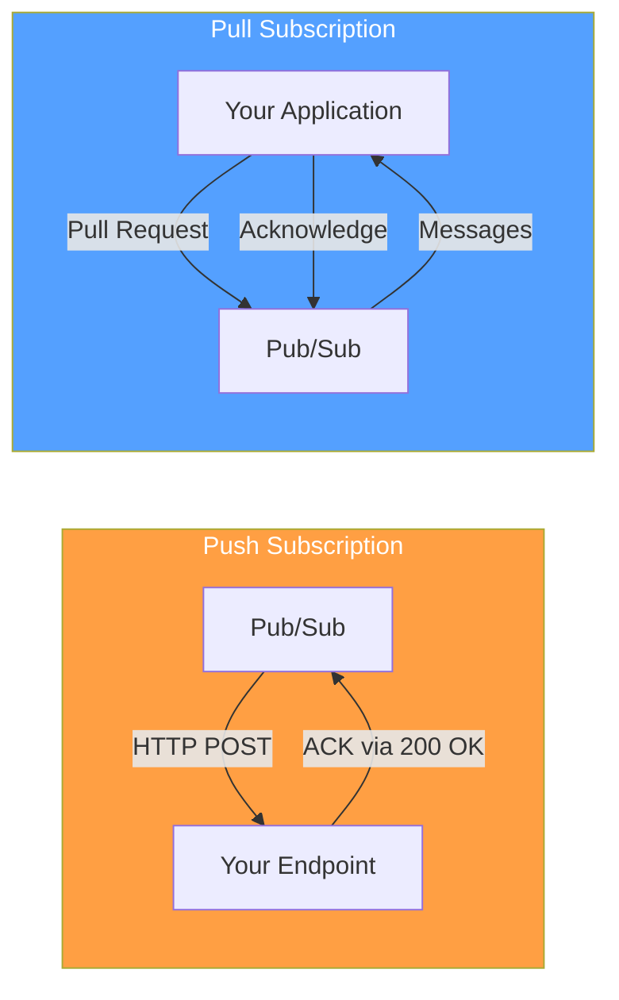
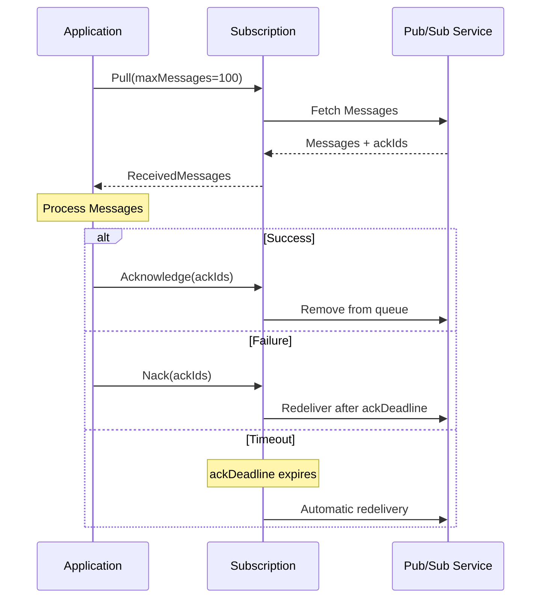
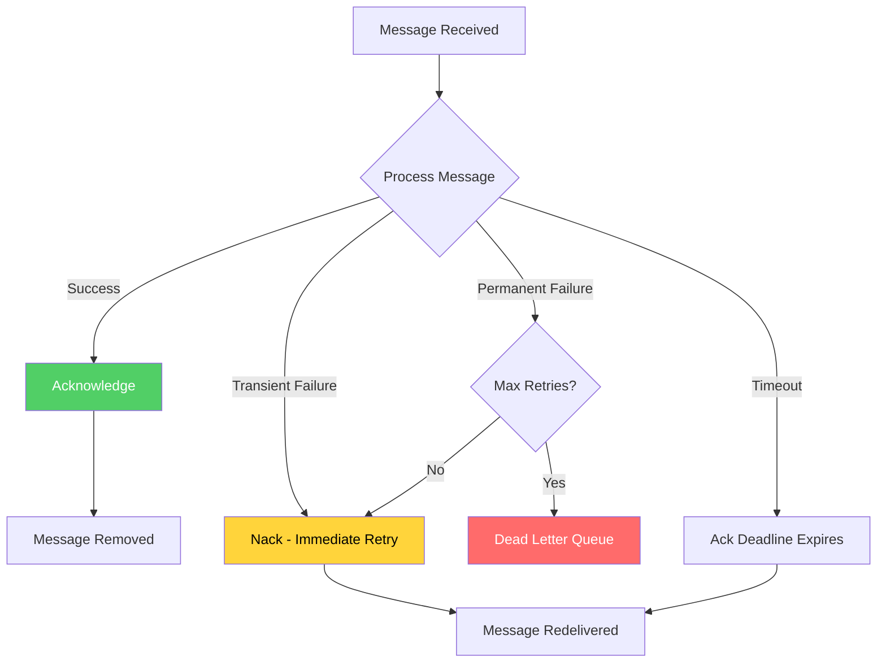
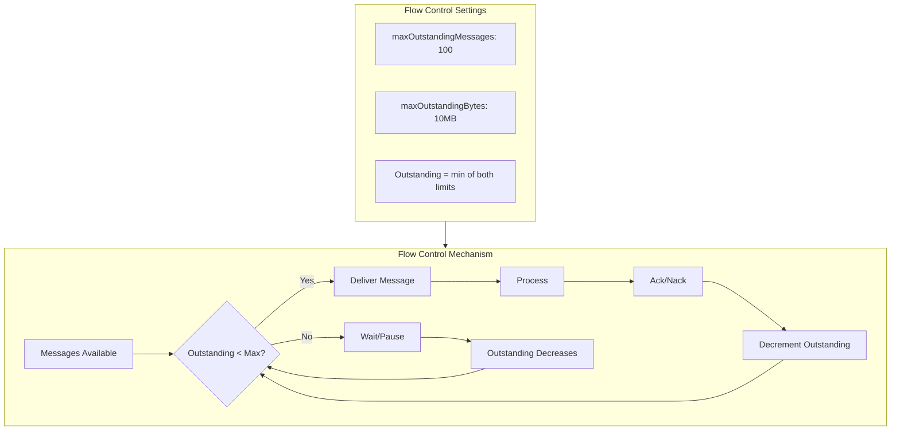
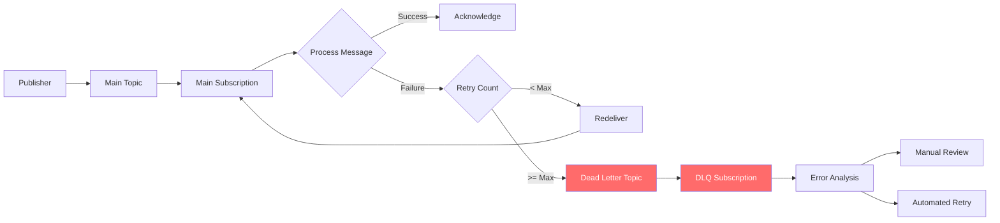

# How to Implement Pull Subscriptions in Pub/Sub

Author: [nawazdhandala](https://github.com/nawazdhandala)

Tags: Pub/Sub, Google Cloud, Messaging, Event-Driven Architecture, Python, Node.js, Java, Backend

Description: A comprehensive guide to implementing pull subscriptions in Google Cloud Pub/Sub. Learn how to create subscriptions, pull messages synchronously and asynchronously, handle acknowledgments, and build resilient message processing pipelines.

---

Google Cloud Pub/Sub offers two delivery methods for consuming messages: push subscriptions and pull subscriptions. Pull subscriptions give your application control over when and how messages are retrieved, making them ideal for batch processing, rate-controlled consumption, and scenarios where your service cannot expose a public endpoint.

## Pull vs Push Subscriptions

Understanding when to use pull subscriptions helps you design better messaging architectures. Pull subscriptions work best when you need fine-grained control over message consumption.



| Aspect | Pull Subscription | Push Subscription |
|--------|------------------|-------------------|
| Control | Application controls rate | Pub/Sub controls rate |
| Endpoint | No public endpoint needed | Requires HTTPS endpoint |
| Scaling | Manual scaling decisions | Auto-scales with load |
| Batching | Native batch support | Single message per request |
| Use Case | Batch processing, workers | Webhooks, real-time events |

## Creating a Pull Subscription

Before pulling messages, you need a topic and subscription. Use the Google Cloud SDK or client libraries to create them.

The following command creates a topic and a pull subscription using the gcloud CLI.

```bash
# Create a topic for order events
gcloud pubsub topics create order-events

# Create a pull subscription with default settings
gcloud pubsub subscriptions create order-processor \
    --topic=order-events \
    --ack-deadline=60

# Create a subscription with message retention and dead letter topic
gcloud pubsub subscriptions create order-processor-durable \
    --topic=order-events \
    --ack-deadline=120 \
    --message-retention-duration=7d \
    --retain-acked-messages \
    --dead-letter-topic=order-events-dlq \
    --max-delivery-attempts=5
```

## Message Flow Architecture

Understanding the message flow helps you design proper acknowledgment strategies and handle failures correctly.



## Synchronous Pull in Python

Synchronous pulling provides simple, blocking message retrieval suitable for batch processing scenarios.

```python
from google.cloud import pubsub_v1
from google.api_core import retry
import json
from typing import List, Callable
import logging

logging.basicConfig(level=logging.INFO)
logger = logging.getLogger(__name__)


class SynchronousPullConsumer:
    """
    A synchronous Pub/Sub consumer that pulls messages in batches.
    Best suited for batch processing and cron jobs.
    """

    def __init__(self, project_id: str, subscription_id: str):
        # Initialize the subscriber client
        self.subscriber = pubsub_v1.SubscriberClient()
        self.subscription_path = self.subscriber.subscription_path(
            project_id, subscription_id
        )
        self.project_id = project_id
        self.subscription_id = subscription_id

    def pull_messages(
        self,
        max_messages: int = 100,
        timeout: float = 30.0
    ) -> List[pubsub_v1.types.ReceivedMessage]:
        """
        Pull a batch of messages synchronously.

        Args:
            max_messages: Maximum number of messages to pull (1-1000)
            timeout: How long to wait for messages in seconds

        Returns:
            List of received messages
        """
        # Configure the pull request
        request = pubsub_v1.types.PullRequest(
            subscription=self.subscription_path,
            max_messages=max_messages,
        )

        # Pull with retry for transient failures
        response = self.subscriber.pull(
            request=request,
            timeout=timeout,
            retry=retry.Retry(deadline=timeout)
        )

        logger.info(f"Pulled {len(response.received_messages)} messages")
        return list(response.received_messages)

    def process_batch(
        self,
        processor: Callable[[bytes], bool],
        max_messages: int = 100
    ) -> dict:
        """
        Pull and process a batch of messages.

        Args:
            processor: Function that processes message data, returns True on success
            max_messages: Maximum messages to process

        Returns:
            Dictionary with success and failure counts
        """
        messages = self.pull_messages(max_messages)

        if not messages:
            logger.info("No messages to process")
            return {"processed": 0, "failed": 0}

        ack_ids = []
        nack_ids = []

        for message in messages:
            try:
                # Extract message data and attributes
                data = message.message.data
                attributes = dict(message.message.attributes)
                message_id = message.message.message_id

                logger.info(f"Processing message {message_id}")

                # Call the processor function
                success = processor(data)

                if success:
                    ack_ids.append(message.ack_id)
                else:
                    nack_ids.append(message.ack_id)

            except Exception as e:
                logger.error(f"Error processing message: {e}")
                nack_ids.append(message.ack_id)

        # Acknowledge successful messages
        if ack_ids:
            self.subscriber.acknowledge(
                request={
                    "subscription": self.subscription_path,
                    "ack_ids": ack_ids
                }
            )
            logger.info(f"Acknowledged {len(ack_ids)} messages")

        # Negative acknowledge failed messages for redelivery
        if nack_ids:
            self.subscriber.modify_ack_deadline(
                request={
                    "subscription": self.subscription_path,
                    "ack_ids": nack_ids,
                    "ack_deadline_seconds": 0  # Immediate redelivery
                }
            )
            logger.info(f"Nacked {len(nack_ids)} messages for redelivery")

        return {"processed": len(ack_ids), "failed": len(nack_ids)}


def process_order(data: bytes) -> bool:
    """Example processor function for order messages."""
    try:
        order = json.loads(data.decode('utf-8'))
        order_id = order.get('order_id')
        logger.info(f"Processing order: {order_id}")
        # Add your business logic here
        return True
    except json.JSONDecodeError as e:
        logger.error(f"Invalid JSON: {e}")
        return False


# Usage example
if __name__ == '__main__':
    consumer = SynchronousPullConsumer(
        project_id='my-project',
        subscription_id='order-processor'
    )

    # Process messages in batches
    results = consumer.process_batch(
        processor=process_order,
        max_messages=50
    )
    print(f"Results: {results}")
```

## Asynchronous Pull with Streaming

Asynchronous streaming pull provides continuous message delivery with automatic flow control, ideal for long-running services.

```python
from google.cloud import pubsub_v1
from concurrent.futures import TimeoutError
import json
import signal
import sys
from typing import Optional
import logging

logging.basicConfig(level=logging.INFO)
logger = logging.getLogger(__name__)


class AsyncStreamingConsumer:
    """
    An asynchronous streaming Pub/Sub consumer.
    Provides continuous message delivery with automatic flow control.
    """

    def __init__(
        self,
        project_id: str,
        subscription_id: str,
        max_messages: int = 100,
        max_bytes: int = 10 * 1024 * 1024  # 10 MB
    ):
        self.project_id = project_id
        self.subscription_id = subscription_id
        self.subscriber = pubsub_v1.SubscriberClient()
        self.subscription_path = self.subscriber.subscription_path(
            project_id, subscription_id
        )

        # Configure flow control to prevent memory issues
        self.flow_control = pubsub_v1.types.FlowControl(
            max_messages=max_messages,
            max_bytes=max_bytes,
        )

        self.streaming_pull_future: Optional[pubsub_v1.subscriber.futures.StreamingPullFuture] = None

    def callback(self, message: pubsub_v1.subscriber.message.Message) -> None:
        """
        Callback function invoked for each received message.
        Must call message.ack() or message.nack() to complete processing.
        """
        try:
            # Extract message metadata
            message_id = message.message_id
            publish_time = message.publish_time
            attributes = dict(message.attributes)

            logger.info(
                f"Received message: id={message_id}, "
                f"published={publish_time}, "
                f"attributes={attributes}"
            )

            # Decode and process the message data
            data = json.loads(message.data.decode('utf-8'))
            self.process_message(data)

            # Acknowledge successful processing
            message.ack()
            logger.info(f"Acknowledged message {message_id}")

        except json.JSONDecodeError as e:
            logger.error(f"Invalid JSON in message {message.message_id}: {e}")
            # Acknowledge malformed messages to prevent infinite redelivery
            message.ack()

        except Exception as e:
            logger.error(f"Error processing message {message.message_id}: {e}")
            # Negative acknowledge to trigger redelivery
            message.nack()

    def process_message(self, data: dict) -> None:
        """Process the decoded message data."""
        # Implement your business logic here
        event_type = data.get('event_type')
        logger.info(f"Processing event: {event_type}")

    def start(self) -> None:
        """Start the streaming pull consumer."""
        logger.info(f"Starting consumer for {self.subscription_path}")

        # Subscribe with flow control settings
        self.streaming_pull_future = self.subscriber.subscribe(
            self.subscription_path,
            callback=self.callback,
            flow_control=self.flow_control,
        )

        logger.info("Consumer started, waiting for messages...")

    def stop(self) -> None:
        """Gracefully stop the consumer."""
        if self.streaming_pull_future:
            logger.info("Stopping consumer...")
            self.streaming_pull_future.cancel()
            # Wait for outstanding messages to be processed
            try:
                self.streaming_pull_future.result(timeout=30)
            except TimeoutError:
                logger.warning("Timeout waiting for consumer to stop")
            except Exception as e:
                logger.info(f"Consumer stopped: {e}")

    def run_forever(self) -> None:
        """Run the consumer until interrupted."""
        self.start()

        # Handle graceful shutdown
        def signal_handler(sig, frame):
            logger.info("Received shutdown signal")
            self.stop()
            sys.exit(0)

        signal.signal(signal.SIGINT, signal_handler)
        signal.signal(signal.SIGTERM, signal_handler)

        # Block until the consumer is cancelled
        try:
            self.streaming_pull_future.result()
        except Exception as e:
            logger.error(f"Consumer error: {e}")
            self.stop()


# Usage example
if __name__ == '__main__':
    consumer = AsyncStreamingConsumer(
        project_id='my-project',
        subscription_id='order-processor',
        max_messages=100
    )
    consumer.run_forever()
```

## Node.js Implementation

Node.js provides excellent async support for Pub/Sub consumers, making it well-suited for high-throughput message processing.

```javascript
const { PubSub } = require('@google-cloud/pubsub');

/**
 * PullSubscriptionConsumer provides both synchronous and streaming
 * message consumption from Google Cloud Pub/Sub.
 */
class PullSubscriptionConsumer {
  constructor(projectId, subscriptionId, options = {}) {
    this.pubsub = new PubSub({ projectId });
    this.subscription = this.pubsub.subscription(subscriptionId, {
      // Flow control settings
      flowControl: {
        maxMessages: options.maxMessages || 100,
        maxBytes: options.maxBytes || 10 * 1024 * 1024, // 10 MB
        allowExcessMessages: false,
      },
      // Acknowledgement deadline in seconds
      ackDeadline: options.ackDeadline || 60,
    });

    this.isRunning = false;
    this.messageHandler = null;
  }

  /**
   * Pull messages synchronously in a batch.
   * Useful for cron jobs and batch processing.
   */
  async pullBatch(maxMessages = 100) {
    const [messages] = await this.subscription.pull({
      maxMessages,
      returnImmediately: false,
    });

    console.log(`Pulled ${messages.length} messages`);
    return messages;
  }

  /**
   * Process a batch of messages with a handler function.
   * Returns counts of processed and failed messages.
   */
  async processBatch(handler, maxMessages = 100) {
    const messages = await this.pullBatch(maxMessages);

    if (messages.length === 0) {
      console.log('No messages to process');
      return { processed: 0, failed: 0 };
    }

    const results = { processed: 0, failed: 0 };
    const ackIds = [];
    const nackIds = [];

    // Process each message
    for (const message of messages) {
      try {
        const data = JSON.parse(message.data.toString());
        const attributes = message.attributes;

        console.log(`Processing message ${message.id}`);

        // Call the handler function
        await handler(data, attributes);

        ackIds.push(message.ackId);
        results.processed++;
      } catch (error) {
        console.error(`Error processing message ${message.id}:`, error.message);
        nackIds.push(message.ackId);
        results.failed++;
      }
    }

    // Acknowledge successful messages
    if (ackIds.length > 0) {
      await this.subscription.ack(ackIds);
      console.log(`Acknowledged ${ackIds.length} messages`);
    }

    // Negative acknowledge failed messages
    if (nackIds.length > 0) {
      await this.subscription.modifyAckDeadline(nackIds, 0);
      console.log(`Nacked ${nackIds.length} messages`);
    }

    return results;
  }

  /**
   * Start streaming pull for continuous message processing.
   * Messages are delivered asynchronously via the callback.
   */
  startStreaming(messageHandler) {
    this.isRunning = true;
    this.messageHandler = messageHandler;

    // Handle incoming messages
    this.subscription.on('message', async (message) => {
      try {
        const data = JSON.parse(message.data.toString());
        const attributes = message.attributes;

        console.log(`Received message ${message.id}`);

        // Process the message
        await this.messageHandler(data, attributes, message);

        // Acknowledge on success
        message.ack();
        console.log(`Acknowledged message ${message.id}`);
      } catch (error) {
        console.error(`Error processing message ${message.id}:`, error.message);

        // Negative acknowledge for redelivery
        message.nack();
      }
    });

    // Handle errors
    this.subscription.on('error', (error) => {
      console.error('Subscription error:', error);
    });

    // Handle close events
    this.subscription.on('close', () => {
      console.log('Subscription closed');
      this.isRunning = false;
    });

    console.log('Started streaming pull consumer');
  }

  /**
   * Stop the streaming consumer gracefully.
   */
  async stopStreaming() {
    if (!this.isRunning) {
      return;
    }

    console.log('Stopping streaming consumer...');
    this.isRunning = false;

    // Remove all listeners
    this.subscription.removeAllListeners('message');
    this.subscription.removeAllListeners('error');

    // Close the subscription
    await this.subscription.close();
    console.log('Consumer stopped');
  }
}

// Example message handler function
async function handleOrderMessage(data, attributes, message) {
  const { orderId, customerId, items } = data;

  console.log(`Processing order ${orderId} for customer ${customerId}`);
  console.log(`Order contains ${items?.length || 0} items`);

  // Simulate processing time
  await new Promise((resolve) => setTimeout(resolve, 100));

  // Add your business logic here
}

// Batch processing example
async function runBatchProcessor() {
  const consumer = new PullSubscriptionConsumer(
    'my-project',
    'order-processor'
  );

  const results = await consumer.processBatch(
    async (data, attributes) => {
      console.log('Processing:', data);
    },
    50
  );

  console.log('Batch results:', results);
}

// Streaming consumer example
async function runStreamingConsumer() {
  const consumer = new PullSubscriptionConsumer(
    'my-project',
    'order-processor',
    { maxMessages: 100 }
  );

  // Start streaming
  consumer.startStreaming(handleOrderMessage);

  // Handle graceful shutdown
  process.on('SIGINT', async () => {
    console.log('Shutting down...');
    await consumer.stopStreaming();
    process.exit(0);
  });

  process.on('SIGTERM', async () => {
    console.log('Shutting down...');
    await consumer.stopStreaming();
    process.exit(0);
  });
}

module.exports = { PullSubscriptionConsumer };

// Run streaming consumer if executed directly
if (require.main === module) {
  runStreamingConsumer().catch(console.error);
}
```

## Java Implementation

Java provides robust threading and concurrency support for building high-performance Pub/Sub consumers.

```java
import com.google.cloud.pubsub.v1.AckReplyConsumer;
import com.google.cloud.pubsub.v1.MessageReceiver;
import com.google.cloud.pubsub.v1.Subscriber;
import com.google.cloud.pubsub.v1.stub.GrpcSubscriberStub;
import com.google.cloud.pubsub.v1.stub.SubscriberStubSettings;
import com.google.pubsub.v1.*;
import com.google.api.gax.core.ExecutorProvider;
import com.google.api.gax.core.InstantiatingExecutorProvider;
import org.threeten.bp.Duration;
import java.io.IOException;
import java.util.ArrayList;
import java.util.List;
import java.util.concurrent.*;
import java.util.concurrent.atomic.AtomicBoolean;

/**
 * A comprehensive Pub/Sub pull consumer supporting both
 * synchronous batch pulling and asynchronous streaming.
 */
public class PubSubPullConsumer {

    private final String projectId;
    private final String subscriptionId;
    private final ProjectSubscriptionName subscriptionName;
    private Subscriber subscriber;
    private final AtomicBoolean isRunning = new AtomicBoolean(false);

    public PubSubPullConsumer(String projectId, String subscriptionId) {
        this.projectId = projectId;
        this.subscriptionId = subscriptionId;
        this.subscriptionName = ProjectSubscriptionName.of(projectId, subscriptionId);
    }

    /**
     * Pull messages synchronously in a batch.
     * Suitable for batch processing and scheduled jobs.
     */
    public List<ReceivedMessage> pullBatch(int maxMessages) throws IOException {
        // Configure the subscriber stub for synchronous pulls
        SubscriberStubSettings subscriberStubSettings = SubscriberStubSettings.newBuilder()
            .setTransportChannelProvider(
                SubscriberStubSettings.defaultGrpcTransportProviderBuilder()
                    .setMaxInboundMessageSize(20 * 1024 * 1024) // 20 MB
                    .build()
            )
            .build();

        try (GrpcSubscriberStub subscriberStub =
                GrpcSubscriberStub.create(subscriberStubSettings)) {

            // Build the pull request
            PullRequest pullRequest = PullRequest.newBuilder()
                .setSubscription(subscriptionName.toString())
                .setMaxMessages(maxMessages)
                .build();

            // Execute the pull
            PullResponse pullResponse = subscriberStub.pullCallable().call(pullRequest);

            System.out.printf("Pulled %d messages%n",
                pullResponse.getReceivedMessagesCount());

            return pullResponse.getReceivedMessagesList();
        }
    }

    /**
     * Process a batch of messages with acknowledgement handling.
     */
    public BatchResult processBatch(MessageProcessor processor, int maxMessages)
            throws IOException {

        List<ReceivedMessage> messages = pullBatch(maxMessages);
        BatchResult result = new BatchResult();

        if (messages.isEmpty()) {
            System.out.println("No messages to process");
            return result;
        }

        List<String> ackIds = new ArrayList<>();
        List<String> nackIds = new ArrayList<>();

        for (ReceivedMessage message : messages) {
            try {
                String messageId = message.getMessage().getMessageId();
                String data = message.getMessage().getData().toStringUtf8();

                System.out.printf("Processing message %s%n", messageId);

                // Process the message
                boolean success = processor.process(data,
                    message.getMessage().getAttributesMap());

                if (success) {
                    ackIds.add(message.getAckId());
                    result.incrementProcessed();
                } else {
                    nackIds.add(message.getAckId());
                    result.incrementFailed();
                }

            } catch (Exception e) {
                System.err.printf("Error processing message: %s%n", e.getMessage());
                nackIds.add(message.getAckId());
                result.incrementFailed();
            }
        }

        // Acknowledge and nack messages
        acknowledgeMessages(ackIds, nackIds);

        return result;
    }

    /**
     * Acknowledge successful messages and nack failed ones.
     */
    private void acknowledgeMessages(List<String> ackIds, List<String> nackIds)
            throws IOException {

        SubscriberStubSettings settings = SubscriberStubSettings.newBuilder().build();

        try (GrpcSubscriberStub stub = GrpcSubscriberStub.create(settings)) {
            // Acknowledge successful messages
            if (!ackIds.isEmpty()) {
                AcknowledgeRequest ackRequest = AcknowledgeRequest.newBuilder()
                    .setSubscription(subscriptionName.toString())
                    .addAllAckIds(ackIds)
                    .build();

                stub.acknowledgeCallable().call(ackRequest);
                System.out.printf("Acknowledged %d messages%n", ackIds.size());
            }

            // Nack failed messages for immediate redelivery
            if (!nackIds.isEmpty()) {
                ModifyAckDeadlineRequest nackRequest = ModifyAckDeadlineRequest.newBuilder()
                    .setSubscription(subscriptionName.toString())
                    .addAllAckIds(nackIds)
                    .setAckDeadlineSeconds(0) // Immediate redelivery
                    .build();

                stub.modifyAckDeadlineCallable().call(nackRequest);
                System.out.printf("Nacked %d messages for redelivery%n", nackIds.size());
            }
        }
    }

    /**
     * Start asynchronous streaming pull for continuous processing.
     */
    public void startStreaming(MessageReceiver receiver) {
        if (isRunning.get()) {
            System.out.println("Consumer is already running");
            return;
        }

        // Configure executor for parallel processing
        ExecutorProvider executorProvider = InstantiatingExecutorProvider.newBuilder()
            .setExecutorThreadCount(4)
            .build();

        // Build the subscriber with flow control
        subscriber = Subscriber.newBuilder(subscriptionName, receiver)
            .setFlowControlSettings(
                com.google.api.gax.batching.FlowControlSettings.newBuilder()
                    .setMaxOutstandingElementCount(100L)
                    .setMaxOutstandingRequestBytes(10L * 1024L * 1024L) // 10 MB
                    .build()
            )
            .setMaxAckExtensionPeriod(Duration.ofMinutes(10))
            .setParallelPullCount(1)
            .setExecutorProvider(executorProvider)
            .build();

        // Add listener for lifecycle events
        subscriber.addListener(new Subscriber.Listener() {
            @Override
            public void failed(Subscriber.State from, Throwable failure) {
                System.err.printf("Subscriber failed from %s: %s%n",
                    from, failure.getMessage());
                isRunning.set(false);
            }
        }, MoreExecutors.directExecutor());

        // Start the subscriber
        subscriber.startAsync().awaitRunning();
        isRunning.set(true);
        System.out.println("Started streaming pull consumer");
    }

    /**
     * Stop the streaming consumer gracefully.
     */
    public void stopStreaming() {
        if (subscriber != null && isRunning.get()) {
            System.out.println("Stopping streaming consumer...");
            subscriber.stopAsync().awaitTerminated();
            isRunning.set(false);
            System.out.println("Consumer stopped");
        }
    }

    /**
     * Check if the consumer is currently running.
     */
    public boolean isRunning() {
        return isRunning.get();
    }

    // Functional interface for message processing
    @FunctionalInterface
    public interface MessageProcessor {
        boolean process(String data, java.util.Map<String, String> attributes);
    }

    // Result class for batch processing
    public static class BatchResult {
        private int processed = 0;
        private int failed = 0;

        public void incrementProcessed() { processed++; }
        public void incrementFailed() { failed++; }
        public int getProcessed() { return processed; }
        public int getFailed() { return failed; }

        @Override
        public String toString() {
            return String.format("BatchResult{processed=%d, failed=%d}",
                processed, failed);
        }
    }

    // Main method demonstrating usage
    public static void main(String[] args) throws Exception {
        PubSubPullConsumer consumer = new PubSubPullConsumer(
            "my-project", "order-processor"
        );

        // Create a message receiver for streaming
        MessageReceiver receiver = (PubsubMessage message, AckReplyConsumer ackConsumer) -> {
            try {
                String messageId = message.getMessageId();
                String data = message.getData().toStringUtf8();

                System.out.printf("Received message %s: %s%n", messageId, data);

                // Process the message
                // Add your business logic here

                // Acknowledge success
                ackConsumer.ack();
                System.out.printf("Acknowledged message %s%n", messageId);

            } catch (Exception e) {
                System.err.printf("Error processing message: %s%n", e.getMessage());
                // Nack for redelivery
                ackConsumer.nack();
            }
        };

        // Start streaming
        consumer.startStreaming(receiver);

        // Add shutdown hook for graceful termination
        Runtime.getRuntime().addShutdownHook(new Thread(() -> {
            System.out.println("Shutting down...");
            consumer.stopStreaming();
        }));

        // Keep the main thread alive
        Thread.currentThread().join();
    }
}
```

## Handling Message Acknowledgement

Proper acknowledgement handling ensures reliable message processing without duplicates or message loss.



The following Python example demonstrates advanced acknowledgement patterns including deadline extension.

```python
from google.cloud import pubsub_v1
from google.api_core import retry
import threading
import time
from typing import Dict, Optional
import logging

logging.basicConfig(level=logging.INFO)
logger = logging.getLogger(__name__)


class AckDeadlineManager:
    """
    Manages acknowledgement deadlines for long-running message processing.
    Extends deadlines automatically to prevent message redelivery during processing.
    """

    def __init__(
        self,
        subscriber: pubsub_v1.SubscriberClient,
        subscription_path: str,
        extension_seconds: int = 60
    ):
        self.subscriber = subscriber
        self.subscription_path = subscription_path
        self.extension_seconds = extension_seconds

        # Track messages being processed
        self.active_messages: Dict[str, threading.Event] = {}
        self.lock = threading.Lock()

    def start_tracking(self, ack_id: str) -> None:
        """
        Start tracking a message and extending its deadline.
        Call when beginning to process a message.
        """
        stop_event = threading.Event()

        with self.lock:
            self.active_messages[ack_id] = stop_event

        # Start background thread to extend deadline
        thread = threading.Thread(
            target=self._extend_deadline_loop,
            args=(ack_id, stop_event),
            daemon=True
        )
        thread.start()
        logger.debug(f"Started deadline tracking for {ack_id[:8]}...")

    def stop_tracking(self, ack_id: str) -> None:
        """
        Stop tracking a message.
        Call after acknowledging or nacking a message.
        """
        with self.lock:
            stop_event = self.active_messages.pop(ack_id, None)

        if stop_event:
            stop_event.set()
            logger.debug(f"Stopped deadline tracking for {ack_id[:8]}...")

    def _extend_deadline_loop(self, ack_id: str, stop_event: threading.Event) -> None:
        """Background loop to periodically extend the ack deadline."""
        # Extend every half the deadline period
        interval = self.extension_seconds / 2

        while not stop_event.is_set():
            # Wait for interval or stop signal
            if stop_event.wait(timeout=interval):
                break

            # Extend the deadline
            try:
                self.subscriber.modify_ack_deadline(
                    request={
                        "subscription": self.subscription_path,
                        "ack_ids": [ack_id],
                        "ack_deadline_seconds": self.extension_seconds
                    }
                )
                logger.debug(f"Extended deadline for {ack_id[:8]}...")
            except Exception as e:
                logger.warning(f"Failed to extend deadline: {e}")
                break


class RobustPullConsumer:
    """
    A pull consumer with robust acknowledgement handling.
    Includes deadline extension, retry tracking, and dead letter handling.
    """

    def __init__(
        self,
        project_id: str,
        subscription_id: str,
        max_retries: int = 5
    ):
        self.subscriber = pubsub_v1.SubscriberClient()
        self.subscription_path = self.subscriber.subscription_path(
            project_id, subscription_id
        )
        self.max_retries = max_retries

        # Initialize deadline manager
        self.deadline_manager = AckDeadlineManager(
            self.subscriber,
            self.subscription_path,
            extension_seconds=60
        )

        # Track delivery attempts (in production, use external storage)
        self.delivery_counts: Dict[str, int] = {}

    def process_message_with_deadline_extension(
        self,
        message: pubsub_v1.types.ReceivedMessage,
        processor
    ) -> bool:
        """
        Process a message with automatic deadline extension.
        Returns True if processing succeeded.
        """
        ack_id = message.ack_id
        message_id = message.message.message_id

        # Start deadline tracking
        self.deadline_manager.start_tracking(ack_id)

        try:
            # Track delivery attempts
            delivery_attempt = int(
                message.message.attributes.get('delivery_attempt', '1')
            )
            self.delivery_counts[message_id] = delivery_attempt

            logger.info(
                f"Processing message {message_id} "
                f"(attempt {delivery_attempt})"
            )

            # Process the message
            result = processor(message.message.data)

            if result:
                # Acknowledge on success
                self.subscriber.acknowledge(
                    request={
                        "subscription": self.subscription_path,
                        "ack_ids": [ack_id]
                    }
                )
                logger.info(f"Acknowledged message {message_id}")
                return True
            else:
                # Processing returned failure
                return self._handle_failure(message, "Processing returned False")

        except Exception as e:
            return self._handle_failure(message, str(e))

        finally:
            # Always stop deadline tracking
            self.deadline_manager.stop_tracking(ack_id)
            self.delivery_counts.pop(message_id, None)

    def _handle_failure(
        self,
        message: pubsub_v1.types.ReceivedMessage,
        error: str
    ) -> bool:
        """Handle message processing failure."""
        message_id = message.message.message_id
        delivery_count = self.delivery_counts.get(message_id, 1)

        logger.error(f"Message {message_id} failed: {error}")

        if delivery_count >= self.max_retries:
            # Max retries exceeded - send to dead letter queue
            logger.warning(
                f"Message {message_id} exceeded max retries, "
                f"will be sent to DLQ"
            )
            # Acknowledge to remove from main subscription
            # Pub/Sub will automatically route to dead letter topic
            self.subscriber.acknowledge(
                request={
                    "subscription": self.subscription_path,
                    "ack_ids": [message.ack_id]
                }
            )
        else:
            # Nack for retry with backoff
            backoff_seconds = min(300, 10 * (2 ** delivery_count))
            logger.info(
                f"Nacking message {message_id}, "
                f"retry in {backoff_seconds}s"
            )
            self.subscriber.modify_ack_deadline(
                request={
                    "subscription": self.subscription_path,
                    "ack_ids": [message.ack_id],
                    "ack_deadline_seconds": backoff_seconds
                }
            )

        return False


# Example usage
if __name__ == '__main__':
    consumer = RobustPullConsumer(
        project_id='my-project',
        subscription_id='order-processor',
        max_retries=5
    )

    def slow_processor(data: bytes) -> bool:
        """Simulate slow processing that needs deadline extension."""
        import json
        order = json.loads(data.decode('utf-8'))
        logger.info(f"Processing order {order.get('order_id')}...")

        # Simulate long processing
        time.sleep(45)

        return True

    # Pull and process messages
    messages = consumer.deadline_manager.subscriber.pull(
        request={
            "subscription": consumer.subscription_path,
            "max_messages": 10
        }
    ).received_messages

    for message in messages:
        consumer.process_message_with_deadline_extension(
            message, slow_processor
        )
```

## Flow Control and Backpressure

Managing flow control prevents your consumer from being overwhelmed by high message volumes.



The following example shows how to configure and monitor flow control in your consumer.

```python
from google.cloud import pubsub_v1
from google.cloud.pubsub_v1 import types
import threading
import time
from dataclasses import dataclass
from typing import Callable
import logging

logging.basicConfig(level=logging.INFO)
logger = logging.getLogger(__name__)


@dataclass
class FlowControlConfig:
    """Configuration for flow control settings."""
    max_messages: int = 100
    max_bytes: int = 10 * 1024 * 1024  # 10 MB
    max_lease_duration: int = 3600  # 1 hour


class FlowControlledConsumer:
    """
    A Pub/Sub consumer with configurable flow control and monitoring.
    Prevents memory exhaustion under high load.
    """

    def __init__(
        self,
        project_id: str,
        subscription_id: str,
        config: FlowControlConfig = None
    ):
        self.project_id = project_id
        self.subscription_id = subscription_id
        self.config = config or FlowControlConfig()

        self.subscriber = pubsub_v1.SubscriberClient()
        self.subscription_path = self.subscriber.subscription_path(
            project_id, subscription_id
        )

        # Monitoring counters
        self.messages_received = 0
        self.messages_processed = 0
        self.messages_failed = 0
        self.bytes_received = 0

        self._lock = threading.Lock()
        self._streaming_pull_future = None

    def _create_flow_control(self) -> types.FlowControl:
        """Create flow control settings from config."""
        return types.FlowControl(
            max_messages=self.config.max_messages,
            max_bytes=self.config.max_bytes,
            max_lease_duration=self.config.max_lease_duration,
        )

    def _update_metrics(
        self,
        received: int = 0,
        processed: int = 0,
        failed: int = 0,
        bytes_count: int = 0
    ) -> None:
        """Thread-safe metric updates."""
        with self._lock:
            self.messages_received += received
            self.messages_processed += processed
            self.messages_failed += failed
            self.bytes_received += bytes_count

    def get_metrics(self) -> dict:
        """Get current consumer metrics."""
        with self._lock:
            return {
                "messages_received": self.messages_received,
                "messages_processed": self.messages_processed,
                "messages_failed": self.messages_failed,
                "bytes_received": self.bytes_received,
                "success_rate": (
                    self.messages_processed / max(1, self.messages_received)
                ) * 100
            }

    def start_with_flow_control(
        self,
        message_handler: Callable[[pubsub_v1.subscriber.message.Message], None]
    ) -> None:
        """
        Start consuming with flow control.
        Messages are delivered up to the configured limits.
        """

        def callback(message: pubsub_v1.subscriber.message.Message) -> None:
            message_size = len(message.data)
            self._update_metrics(received=1, bytes_count=message_size)

            try:
                # Call the user's handler
                message_handler(message)

                # Acknowledge on success
                message.ack()
                self._update_metrics(processed=1)

            except Exception as e:
                logger.error(f"Handler error: {e}")
                message.nack()
                self._update_metrics(failed=1)

        # Create subscriber with flow control
        flow_control = self._create_flow_control()

        self._streaming_pull_future = self.subscriber.subscribe(
            self.subscription_path,
            callback=callback,
            flow_control=flow_control,
        )

        logger.info(
            f"Started consumer with flow control: "
            f"max_messages={self.config.max_messages}, "
            f"max_bytes={self.config.max_bytes}"
        )

    def start_metrics_reporter(self, interval: int = 30) -> threading.Thread:
        """Start a background thread to report metrics periodically."""

        def report_loop():
            while self._streaming_pull_future and not self._streaming_pull_future.done():
                metrics = self.get_metrics()
                logger.info(
                    f"Consumer metrics: "
                    f"received={metrics['messages_received']}, "
                    f"processed={metrics['messages_processed']}, "
                    f"failed={metrics['messages_failed']}, "
                    f"success_rate={metrics['success_rate']:.1f}%"
                )
                time.sleep(interval)

        thread = threading.Thread(target=report_loop, daemon=True)
        thread.start()
        return thread

    def stop(self) -> None:
        """Stop the consumer gracefully."""
        if self._streaming_pull_future:
            logger.info("Stopping consumer...")
            self._streaming_pull_future.cancel()

            try:
                self._streaming_pull_future.result(timeout=30)
            except Exception:
                pass

            logger.info("Consumer stopped")
            logger.info(f"Final metrics: {self.get_metrics()}")


# Example demonstrating adaptive flow control
class AdaptiveFlowController:
    """
    Dynamically adjusts flow control based on processing performance.
    Increases limits when processing is fast, decreases when slow.
    """

    def __init__(
        self,
        initial_max_messages: int = 50,
        min_messages: int = 10,
        max_messages: int = 500
    ):
        self.current_max = initial_max_messages
        self.min_messages = min_messages
        self.max_messages = max_messages

        self.processing_times = []
        self.target_latency_ms = 100  # Target processing time

    def record_processing_time(self, duration_ms: float) -> None:
        """Record a message processing duration."""
        self.processing_times.append(duration_ms)

        # Keep last 100 samples
        if len(self.processing_times) > 100:
            self.processing_times.pop(0)

    def get_recommended_max_messages(self) -> int:
        """Calculate recommended max messages based on performance."""
        if len(self.processing_times) < 10:
            return self.current_max

        avg_latency = sum(self.processing_times) / len(self.processing_times)

        if avg_latency < self.target_latency_ms * 0.5:
            # Processing is fast - increase limit
            self.current_max = min(
                self.max_messages,
                int(self.current_max * 1.2)
            )
        elif avg_latency > self.target_latency_ms * 2:
            # Processing is slow - decrease limit
            self.current_max = max(
                self.min_messages,
                int(self.current_max * 0.8)
            )

        return self.current_max


# Usage example
if __name__ == '__main__':
    # Configure flow control
    config = FlowControlConfig(
        max_messages=100,
        max_bytes=10 * 1024 * 1024,
        max_lease_duration=3600
    )

    consumer = FlowControlledConsumer(
        project_id='my-project',
        subscription_id='order-processor',
        config=config
    )

    def handle_message(message):
        """Example message handler."""
        data = message.data.decode('utf-8')
        logger.info(f"Processing: {message.message_id}")
        # Simulate processing
        time.sleep(0.1)

    # Start consumer and metrics reporter
    consumer.start_with_flow_control(handle_message)
    consumer.start_metrics_reporter(interval=30)

    # Run until interrupted
    try:
        while True:
            time.sleep(1)
    except KeyboardInterrupt:
        consumer.stop()
```

## Dead Letter Queue Configuration

Dead letter queues capture messages that fail processing repeatedly, preventing them from blocking the main subscription.



The following commands configure a dead letter queue for a subscription.

```bash
# Create the dead letter topic
gcloud pubsub topics create order-events-dlq

# Create subscription for monitoring dead letters
gcloud pubsub subscriptions create order-events-dlq-sub \
    --topic=order-events-dlq \
    --message-retention-duration=14d

# Update main subscription to use dead letter topic
gcloud pubsub subscriptions update order-processor \
    --dead-letter-topic=order-events-dlq \
    --max-delivery-attempts=5

# Grant Pub/Sub permission to publish to DLQ
gcloud pubsub topics add-iam-policy-binding order-events-dlq \
    --member="serviceAccount:service-PROJECT_NUMBER@gcp-sa-pubsub.iam.gserviceaccount.com" \
    --role="roles/pubsub.publisher"

# Grant permission to acknowledge from main subscription
gcloud pubsub subscriptions add-iam-policy-binding order-processor \
    --member="serviceAccount:service-PROJECT_NUMBER@gcp-sa-pubsub.iam.gserviceaccount.com" \
    --role="roles/pubsub.subscriber"
```

## Subscription Configuration Options

Understanding subscription options helps you tune performance and reliability for your use case.

| Option | Default | Description | Use Case |
|--------|---------|-------------|----------|
| ackDeadlineSeconds | 10 | Time to acknowledge before redelivery | Increase for slow processing |
| messageRetentionDuration | 7 days | How long unacked messages are kept | Disaster recovery |
| retainAckedMessages | false | Keep acknowledged messages | Replay, debugging |
| expirationPolicy | 31 days | Delete subscription if unused | Cleanup unused subscriptions |
| deadLetterPolicy | none | Route failed messages | Error handling |
| retryPolicy | immediate | Delay between redeliveries | Backoff for transient failures |
| enableMessageOrdering | false | Deliver messages in order | Event sourcing |
| filter | none | Only deliver matching messages | Multi-tenant filtering |

Creating a subscription with advanced options requires the following configuration.

```bash
# Create a fully configured subscription
gcloud pubsub subscriptions create order-processor-advanced \
    --topic=order-events \
    --ack-deadline=120 \
    --message-retention-duration=7d \
    --retain-acked-messages \
    --expiration-period=never \
    --dead-letter-topic=order-events-dlq \
    --max-delivery-attempts=5 \
    --min-retry-delay=10s \
    --max-retry-delay=600s \
    --enable-message-ordering \
    --filter='attributes.priority="high"'
```

## Monitoring and Observability

Monitoring your pull subscriptions helps identify bottlenecks and ensure reliable message delivery.

```python
from google.cloud import monitoring_v3
from google.cloud import pubsub_v1
import time
from datetime import datetime, timedelta
from typing import Dict, List
import logging

logging.basicConfig(level=logging.INFO)
logger = logging.getLogger(__name__)


class PubSubMonitor:
    """
    Monitor Pub/Sub subscription health and performance.
    Tracks backlog, delivery latency, and error rates.
    """

    def __init__(self, project_id: str):
        self.project_id = project_id
        self.monitoring_client = monitoring_v3.MetricServiceClient()
        self.project_name = f"projects/{project_id}"

    def get_subscription_backlog(
        self,
        subscription_id: str,
        minutes: int = 5
    ) -> List[Dict]:
        """
        Get the message backlog for a subscription.
        Returns the number of unacknowledged messages.
        """
        interval = monitoring_v3.TimeInterval(
            end_time={"seconds": int(time.time())},
            start_time={"seconds": int(time.time()) - (minutes * 60)}
        )

        # Query for unacked message count
        results = self.monitoring_client.list_time_series(
            request={
                "name": self.project_name,
                "filter": (
                    f'metric.type="pubsub.googleapis.com/subscription/num_undelivered_messages" '
                    f'AND resource.labels.subscription_id="{subscription_id}"'
                ),
                "interval": interval,
                "view": monitoring_v3.ListTimeSeriesRequest.TimeSeriesView.FULL
            }
        )

        backlog_data = []
        for series in results:
            for point in series.points:
                backlog_data.append({
                    "timestamp": point.interval.end_time.timestamp(),
                    "backlog": point.value.int64_value
                })

        return backlog_data

    def get_oldest_unacked_message_age(
        self,
        subscription_id: str,
        minutes: int = 5
    ) -> List[Dict]:
        """
        Get the age of the oldest unacknowledged message.
        High values indicate processing bottlenecks.
        """
        interval = monitoring_v3.TimeInterval(
            end_time={"seconds": int(time.time())},
            start_time={"seconds": int(time.time()) - (minutes * 60)}
        )

        results = self.monitoring_client.list_time_series(
            request={
                "name": self.project_name,
                "filter": (
                    f'metric.type="pubsub.googleapis.com/subscription/oldest_unacked_message_age" '
                    f'AND resource.labels.subscription_id="{subscription_id}"'
                ),
                "interval": interval,
                "view": monitoring_v3.ListTimeSeriesRequest.TimeSeriesView.FULL
            }
        )

        age_data = []
        for series in results:
            for point in series.points:
                age_data.append({
                    "timestamp": point.interval.end_time.timestamp(),
                    "age_seconds": point.value.int64_value
                })

        return age_data

    def check_subscription_health(
        self,
        subscription_id: str
    ) -> Dict:
        """
        Perform a health check on the subscription.
        Returns status and recommendations.
        """
        backlog = self.get_subscription_backlog(subscription_id)
        age = self.get_oldest_unacked_message_age(subscription_id)

        health = {
            "subscription_id": subscription_id,
            "status": "healthy",
            "warnings": [],
            "recommendations": []
        }

        # Check backlog
        if backlog:
            latest_backlog = backlog[-1]["backlog"]
            health["current_backlog"] = latest_backlog

            if latest_backlog > 10000:
                health["status"] = "warning"
                health["warnings"].append(
                    f"High backlog: {latest_backlog} messages"
                )
                health["recommendations"].append(
                    "Consider scaling up consumers or increasing flow control limits"
                )

        # Check message age
        if age:
            latest_age = age[-1]["age_seconds"]
            health["oldest_message_age_seconds"] = latest_age

            if latest_age > 3600:  # 1 hour
                health["status"] = "critical"
                health["warnings"].append(
                    f"Old unacked messages: {latest_age}s"
                )
                health["recommendations"].append(
                    "Check for stuck consumers or processing errors"
                )

        return health


class ConsumerHealthChecker:
    """
    Monitor consumer application health.
    Exposes metrics for external monitoring systems.
    """

    def __init__(self):
        self.start_time = time.time()
        self.messages_processed = 0
        self.messages_failed = 0
        self.last_message_time = None
        self.processing_times = []

    def record_success(self, processing_time_ms: float) -> None:
        """Record a successful message processing."""
        self.messages_processed += 1
        self.last_message_time = time.time()
        self.processing_times.append(processing_time_ms)

        # Keep last 1000 samples
        if len(self.processing_times) > 1000:
            self.processing_times.pop(0)

    def record_failure(self) -> None:
        """Record a failed message processing."""
        self.messages_failed += 1
        self.last_message_time = time.time()

    def get_health_status(self) -> Dict:
        """Get current health status for monitoring."""
        uptime = time.time() - self.start_time
        total_messages = self.messages_processed + self.messages_failed

        status = {
            "status": "healthy",
            "uptime_seconds": uptime,
            "messages_processed": self.messages_processed,
            "messages_failed": self.messages_failed,
            "error_rate": (
                self.messages_failed / max(1, total_messages)
            ) * 100,
            "last_message_seconds_ago": (
                time.time() - self.last_message_time
                if self.last_message_time else None
            )
        }

        # Calculate processing time percentiles
        if self.processing_times:
            sorted_times = sorted(self.processing_times)
            status["processing_time_p50_ms"] = sorted_times[
                len(sorted_times) // 2
            ]
            status["processing_time_p99_ms"] = sorted_times[
                int(len(sorted_times) * 0.99)
            ]

        # Determine health status
        if status["error_rate"] > 10:
            status["status"] = "degraded"
        if status["error_rate"] > 50:
            status["status"] = "unhealthy"
        if (
            status["last_message_seconds_ago"] and
            status["last_message_seconds_ago"] > 300
        ):
            status["status"] = "idle"

        return status


# Example usage with health endpoint
if __name__ == '__main__':
    from flask import Flask, jsonify

    app = Flask(__name__)
    health_checker = ConsumerHealthChecker()
    monitor = PubSubMonitor('my-project')

    @app.route('/health')
    def health():
        """Health check endpoint for load balancers."""
        status = health_checker.get_health_status()
        code = 200 if status["status"] in ["healthy", "idle"] else 503
        return jsonify(status), code

    @app.route('/metrics')
    def metrics():
        """Metrics endpoint for monitoring systems."""
        consumer_health = health_checker.get_health_status()
        subscription_health = monitor.check_subscription_health(
            'order-processor'
        )

        return jsonify({
            "consumer": consumer_health,
            "subscription": subscription_health
        })

    # Start Flask in background
    # app.run(host='0.0.0.0', port=8080)
```

## Best Practices Summary

Following best practices ensures reliable and efficient message processing.

| Practice | Recommendation | Rationale |
|----------|---------------|-----------|
| Acknowledgement | Ack after processing, not before | Prevents message loss on failure |
| Flow Control | Set appropriate limits | Prevents memory exhaustion |
| Dead Letters | Configure DLQ with max attempts | Isolates poison messages |
| Idempotency | Design for duplicate delivery | Handles redelivery gracefully |
| Monitoring | Track backlog and latency | Early detection of issues |
| Graceful Shutdown | Finish processing before exit | Prevents unnecessary redelivery |
| Error Handling | Distinguish transient vs permanent | Appropriate retry behavior |
| Batching | Process in batches when possible | Improved throughput |

Pull subscriptions provide powerful control over message consumption in Google Cloud Pub/Sub. By implementing proper flow control, acknowledgement handling, and monitoring, you can build resilient message processing pipelines that scale with your application needs. Combine these patterns with dead letter queues and appropriate retry strategies to handle failures gracefully and maintain high availability.
