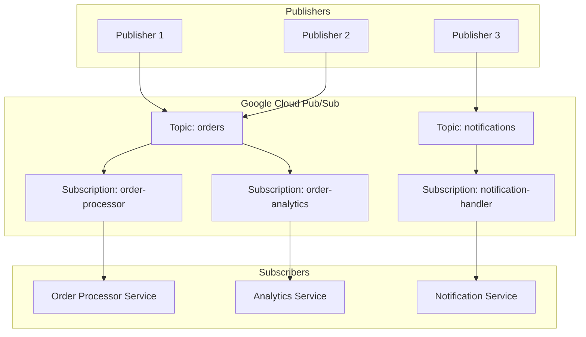
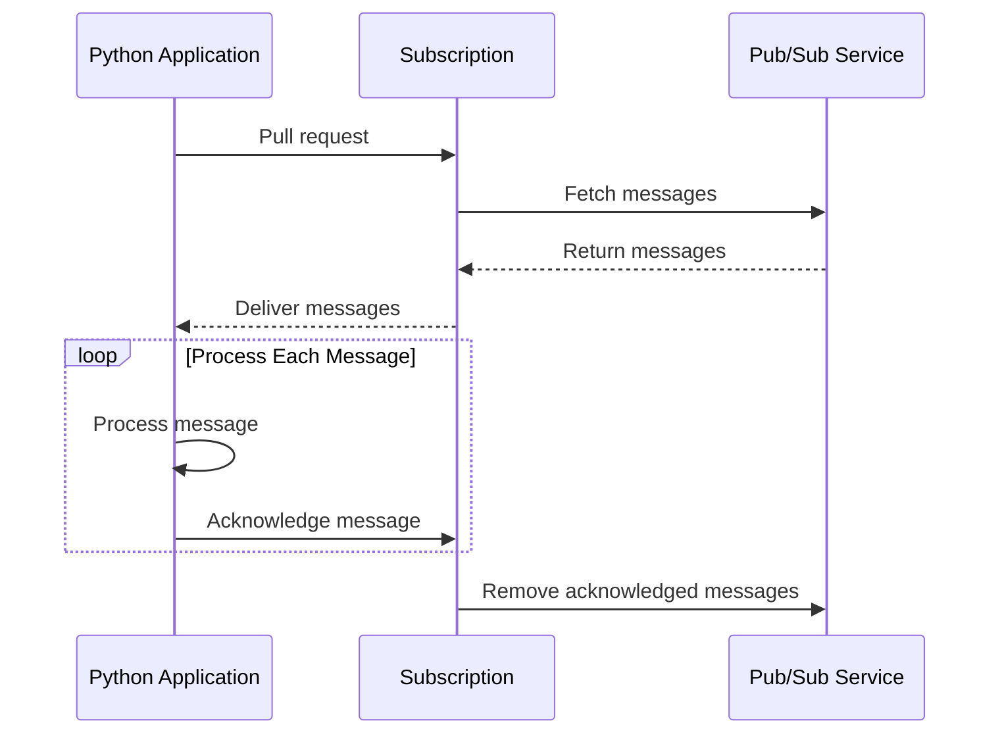
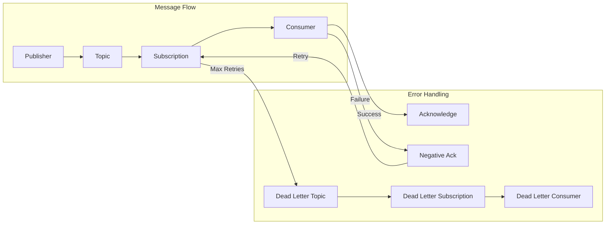
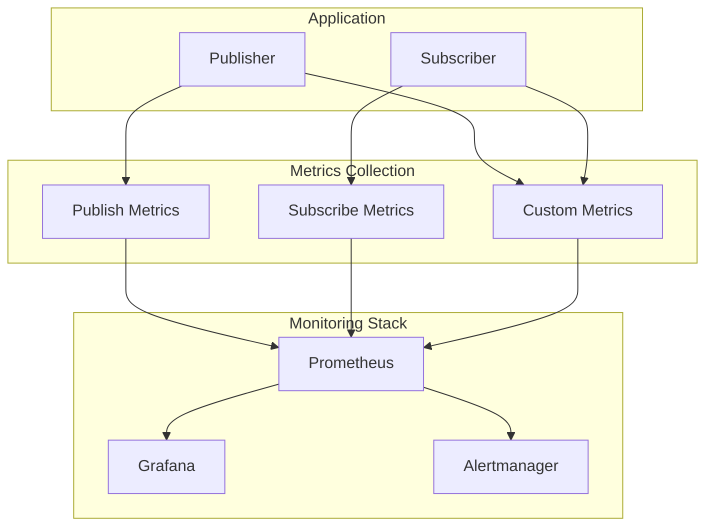

# How to Use Pub/Sub with Python

Author: [nawazdhandala](https://www.github.com/nawazdhandala)

Tags: Python, Pub/Sub, Google Cloud, Messaging, Event-Driven Architecture, Microservices

Description: A comprehensive guide to implementing Pub/Sub messaging in Python, covering Google Cloud Pub/Sub setup, message publishing, subscription handling, error management, and production best practices.

---

Pub/Sub (Publish/Subscribe) is a messaging pattern that decouples services by allowing publishers to send messages without knowing who will receive them. Subscribers express interest in specific topics and receive messages asynchronously. Google Cloud Pub/Sub provides a fully managed, real-time messaging service that scales automatically.

## Understanding Pub/Sub Architecture

The Pub/Sub model separates message producers from message consumers, enabling flexible and scalable event-driven architectures.



### Key Pub/Sub Concepts

| Concept | Description |
|---------|-------------|
| Topic | A named resource to which publishers send messages |
| Subscription | A named resource representing the stream of messages from a topic |
| Message | The data that passes through the system, including attributes |
| Publisher | An application that creates and sends messages to a topic |
| Subscriber | An application that receives messages from a subscription |
| Acknowledgment | Confirmation that a message has been successfully processed |

## Prerequisites

Before working with Pub/Sub in Python, ensure you have the following:

- Python 3.8 or higher installed
- A Google Cloud Platform account with billing enabled
- Google Cloud SDK (gcloud CLI) installed
- A GCP project with Pub/Sub API enabled

## Setting Up Google Cloud Pub/Sub

### Enable the Pub/Sub API

Enable the Pub/Sub API in your GCP project using the gcloud CLI.

```bash
# Set your project ID
export PROJECT_ID="your-project-id"

# Set the project
gcloud config set project $PROJECT_ID

# Enable the Pub/Sub API
gcloud services enable pubsub.googleapis.com

# Verify the API is enabled
gcloud services list --enabled | grep pubsub
```

### Create Topics and Subscriptions

Create the necessary Pub/Sub resources for your application.

```bash
# Create a topic for order events
gcloud pubsub topics create orders

# Create a push subscription that delivers messages to an endpoint
gcloud pubsub subscriptions create order-processor \
    --topic=orders \
    --ack-deadline=60 \
    --message-retention-duration=7d

# Create a pull subscription for batch processing
gcloud pubsub subscriptions create order-analytics \
    --topic=orders \
    --ack-deadline=120 \
    --message-retention-duration=7d

# List all topics
gcloud pubsub topics list

# List all subscriptions
gcloud pubsub subscriptions list
```

### Authentication Setup

Configure authentication for your Python application.

```bash
# Create a service account for your application
gcloud iam service-accounts create pubsub-app \
    --display-name="Pub/Sub Application"

# Grant Pub/Sub publisher role
gcloud projects add-iam-policy-binding $PROJECT_ID \
    --member="serviceAccount:pubsub-app@$PROJECT_ID.iam.gserviceaccount.com" \
    --role="roles/pubsub.publisher"

# Grant Pub/Sub subscriber role
gcloud projects add-iam-policy-binding $PROJECT_ID \
    --member="serviceAccount:pubsub-app@$PROJECT_ID.iam.gserviceaccount.com" \
    --role="roles/pubsub.subscriber"

# Create and download the service account key
gcloud iam service-accounts keys create ~/pubsub-key.json \
    --iam-account=pubsub-app@$PROJECT_ID.iam.gserviceaccount.com

# Set the environment variable for authentication
export GOOGLE_APPLICATION_CREDENTIALS=~/pubsub-key.json
```

## Installing the Python Client Library

Install the Google Cloud Pub/Sub client library and its dependencies.

```bash
# Create a virtual environment
python -m venv pubsub-env
source pubsub-env/bin/activate

# Install the Pub/Sub client library
pip install google-cloud-pubsub

# Install additional helpful packages
pip install python-dotenv pydantic

# Verify installation
pip show google-cloud-pubsub
```

## Publishing Messages

### Basic Publisher

Create a simple publisher that sends messages to a topic.

```python
# publisher_basic.py
# Basic Pub/Sub publisher demonstrating message publication
from google.cloud import pubsub_v1
import json
from typing import Dict, Any

def create_publisher() -> pubsub_v1.PublisherClient:
    """
    Create a Pub/Sub publisher client.
    The client handles connection pooling and batching automatically.
    """
    return pubsub_v1.PublisherClient()

def publish_message(
    publisher: pubsub_v1.PublisherClient,
    project_id: str,
    topic_id: str,
    data: Dict[str, Any],
    attributes: Dict[str, str] = None
) -> str:
    """
    Publish a single message to a Pub/Sub topic.

    Args:
        publisher: The Pub/Sub publisher client
        project_id: GCP project ID
        topic_id: Name of the topic
        data: Message payload as a dictionary
        attributes: Optional message attributes for filtering

    Returns:
        The message ID assigned by Pub/Sub
    """
    # Build the full topic path
    topic_path = publisher.topic_path(project_id, topic_id)

    # Convert data to JSON bytes - Pub/Sub requires bytes
    message_data = json.dumps(data).encode("utf-8")

    # Publish the message with optional attributes
    if attributes:
        future = publisher.publish(topic_path, message_data, **attributes)
    else:
        future = publisher.publish(topic_path, message_data)

    # Wait for the publish to complete and get the message ID
    message_id = future.result()

    return message_id

def main():
    # Initialize the publisher
    publisher = create_publisher()

    # Define the project and topic
    project_id = "your-project-id"
    topic_id = "orders"

    # Create an order message
    order_data = {
        "order_id": "ORD-12345",
        "customer_id": "CUST-789",
        "items": [
            {"sku": "WIDGET-001", "quantity": 2, "price": 29.99},
            {"sku": "GADGET-002", "quantity": 1, "price": 49.99}
        ],
        "total": 109.97,
        "status": "pending"
    }

    # Add attributes for message filtering
    attributes = {
        "event_type": "order_created",
        "priority": "high"
    }

    # Publish the message
    message_id = publish_message(
        publisher,
        project_id,
        topic_id,
        order_data,
        attributes
    )

    print(f"Published message with ID: {message_id}")

if __name__ == "__main__":
    main()
```

### Batch Publisher with Error Handling

Implement a production-ready publisher with batching and retry logic.

```python
# publisher_batch.py
# Production-ready batch publisher with error handling and retry logic
from google.cloud import pubsub_v1
from google.cloud.pubsub_v1.types import BatchSettings
from google.api_core import retry
from google.api_core.exceptions import GoogleAPIError
import json
import logging
from typing import Dict, Any, List, Callable
from dataclasses import dataclass
from concurrent import futures

# Configure logging
logging.basicConfig(level=logging.INFO)
logger = logging.getLogger(__name__)

@dataclass
class PublishResult:
    """Container for publish operation results."""
    message_id: str
    success: bool
    error: str = None

class BatchPublisher:
    """
    A batch publisher that efficiently sends multiple messages to Pub/Sub.
    Messages are automatically batched based on size, count, and latency settings.
    """

    def __init__(
        self,
        project_id: str,
        topic_id: str,
        max_messages: int = 100,
        max_bytes: int = 1024 * 1024,  # 1 MB
        max_latency: float = 0.01  # 10 ms
    ):
        """
        Initialize the batch publisher with custom batch settings.

        Args:
            project_id: GCP project ID
            topic_id: Pub/Sub topic name
            max_messages: Maximum messages per batch
            max_bytes: Maximum batch size in bytes
            max_latency: Maximum time to wait before sending a batch
        """
        self.project_id = project_id
        self.topic_id = topic_id

        # Configure batch settings for optimal throughput
        batch_settings = BatchSettings(
            max_messages=max_messages,
            max_bytes=max_bytes,
            max_latency=max_latency
        )

        # Create publisher with custom batch settings
        self.publisher = pubsub_v1.PublisherClient(
            batch_settings=batch_settings
        )

        # Build the topic path once
        self.topic_path = self.publisher.topic_path(project_id, topic_id)

        # Track pending futures for batch operations
        self.pending_futures: List[futures.Future] = []

    def _get_callback(
        self,
        data: Dict[str, Any]
    ) -> Callable[[futures.Future], None]:
        """
        Create a callback function to handle publish results.

        Args:
            data: The original message data for logging purposes

        Returns:
            A callback function for the publish future
        """
        def callback(future: futures.Future) -> None:
            try:
                message_id = future.result()
                logger.info(f"Published message {message_id}")
            except GoogleAPIError as e:
                logger.error(f"Failed to publish message: {data}. Error: {e}")

        return callback

    def publish_async(
        self,
        data: Dict[str, Any],
        attributes: Dict[str, str] = None
    ) -> futures.Future:
        """
        Publish a message asynchronously without waiting for confirmation.

        Args:
            data: Message payload
            attributes: Optional message attributes

        Returns:
            A future representing the publish operation
        """
        message_bytes = json.dumps(data).encode("utf-8")

        if attributes:
            future = self.publisher.publish(
                self.topic_path,
                message_bytes,
                **attributes
            )
        else:
            future = self.publisher.publish(self.topic_path, message_bytes)

        # Add callback for logging
        future.add_done_callback(self._get_callback(data))

        self.pending_futures.append(future)
        return future

    def publish_batch(
        self,
        messages: List[Dict[str, Any]],
        common_attributes: Dict[str, str] = None
    ) -> List[PublishResult]:
        """
        Publish multiple messages and wait for all to complete.

        Args:
            messages: List of message payloads
            common_attributes: Attributes to apply to all messages

        Returns:
            List of publish results with message IDs or errors
        """
        publish_futures = []

        # Submit all messages for publishing
        for message in messages:
            future = self.publish_async(message, common_attributes)
            publish_futures.append((message, future))

        # Wait for all publishes to complete
        results = []
        for message, future in publish_futures:
            try:
                message_id = future.result(timeout=30)
                results.append(PublishResult(
                    message_id=message_id,
                    success=True
                ))
            except Exception as e:
                logger.error(f"Batch publish failed for message: {e}")
                results.append(PublishResult(
                    message_id=None,
                    success=False,
                    error=str(e)
                ))

        return results

    def wait_for_pending(self, timeout: float = 60) -> int:
        """
        Wait for all pending publish operations to complete.

        Args:
            timeout: Maximum time to wait in seconds

        Returns:
            Number of successfully published messages
        """
        completed = 0

        for future in futures.as_completed(self.pending_futures, timeout=timeout):
            try:
                future.result()
                completed += 1
            except Exception as e:
                logger.error(f"Pending publish failed: {e}")

        # Clear pending futures
        self.pending_futures.clear()

        return completed

    def close(self):
        """Shutdown the publisher and wait for pending messages."""
        self.wait_for_pending()
        self.publisher.transport.close()

def main():
    # Create a batch publisher
    publisher = BatchPublisher(
        project_id="your-project-id",
        topic_id="orders",
        max_messages=50,
        max_latency=0.05  # 50ms
    )

    # Generate sample order messages
    orders = [
        {
            "order_id": f"ORD-{i:05d}",
            "customer_id": f"CUST-{i % 100:03d}",
            "total": round(19.99 + i * 0.5, 2),
            "status": "pending"
        }
        for i in range(100)
    ]

    # Publish all orders in a batch
    results = publisher.publish_batch(
        orders,
        common_attributes={"event_type": "order_created"}
    )

    # Report results
    successful = sum(1 for r in results if r.success)
    failed = sum(1 for r in results if not r.success)

    print(f"Published {successful} messages successfully, {failed} failed")

    # Clean up
    publisher.close()

if __name__ == "__main__":
    main()
```

## Subscribing to Messages

### Pull Subscription

Implement a pull subscriber that fetches messages on demand.



Create a pull subscriber for batch processing scenarios.

```python
# subscriber_pull.py
# Pull-based subscriber for batch message processing
from google.cloud import pubsub_v1
from google.cloud.pubsub_v1.types import PullRequest
import json
import logging
from typing import Callable, Dict, Any, List
from dataclasses import dataclass

logging.basicConfig(level=logging.INFO)
logger = logging.getLogger(__name__)

@dataclass
class Message:
    """Parsed Pub/Sub message with data and metadata."""
    message_id: str
    data: Dict[str, Any]
    attributes: Dict[str, str]
    publish_time: str
    ack_id: str

class PullSubscriber:
    """
    A pull-based subscriber that fetches messages in batches.
    Ideal for batch processing, scheduled jobs, and worker patterns.
    """

    def __init__(self, project_id: str, subscription_id: str):
        """
        Initialize the pull subscriber.

        Args:
            project_id: GCP project ID
            subscription_id: Name of the subscription
        """
        self.project_id = project_id
        self.subscription_id = subscription_id
        self.subscriber = pubsub_v1.SubscriberClient()
        self.subscription_path = self.subscriber.subscription_path(
            project_id, subscription_id
        )

    def pull_messages(self, max_messages: int = 10) -> List[Message]:
        """
        Pull a batch of messages from the subscription.

        Args:
            max_messages: Maximum number of messages to pull

        Returns:
            List of parsed messages
        """
        # Pull messages from the subscription
        response = self.subscriber.pull(
            request={
                "subscription": self.subscription_path,
                "max_messages": max_messages
            }
        )

        messages = []
        for received_message in response.received_messages:
            try:
                # Parse the message data from JSON
                data = json.loads(received_message.message.data.decode("utf-8"))

                message = Message(
                    message_id=received_message.message.message_id,
                    data=data,
                    attributes=dict(received_message.message.attributes),
                    publish_time=str(received_message.message.publish_time),
                    ack_id=received_message.ack_id
                )
                messages.append(message)

            except json.JSONDecodeError as e:
                logger.error(f"Failed to parse message: {e}")
                # Still include the message for acknowledgment handling
                messages.append(Message(
                    message_id=received_message.message.message_id,
                    data={"raw": received_message.message.data.decode("utf-8")},
                    attributes=dict(received_message.message.attributes),
                    publish_time=str(received_message.message.publish_time),
                    ack_id=received_message.ack_id
                ))

        return messages

    def acknowledge(self, ack_ids: List[str]) -> None:
        """
        Acknowledge processed messages to remove them from the subscription.

        Args:
            ack_ids: List of acknowledgment IDs from processed messages
        """
        if not ack_ids:
            return

        self.subscriber.acknowledge(
            request={
                "subscription": self.subscription_path,
                "ack_ids": ack_ids
            }
        )
        logger.info(f"Acknowledged {len(ack_ids)} messages")

    def nack(self, ack_ids: List[str]) -> None:
        """
        Negative acknowledge messages to make them available for redelivery.

        Args:
            ack_ids: List of acknowledgment IDs for messages to retry
        """
        if not ack_ids:
            return

        # Modify ack deadline to 0 to immediately redeliver
        self.subscriber.modify_ack_deadline(
            request={
                "subscription": self.subscription_path,
                "ack_ids": ack_ids,
                "ack_deadline_seconds": 0
            }
        )
        logger.info(f"Nacked {len(ack_ids)} messages for redelivery")

    def process_batch(
        self,
        processor: Callable[[Message], bool],
        max_messages: int = 10
    ) -> Dict[str, int]:
        """
        Pull and process a batch of messages.

        Args:
            processor: Function that processes a message and returns success status
            max_messages: Maximum messages to process

        Returns:
            Dictionary with counts of processed and failed messages
        """
        messages = self.pull_messages(max_messages)

        if not messages:
            logger.info("No messages available")
            return {"processed": 0, "failed": 0}

        successful_acks = []
        failed_acks = []

        for message in messages:
            try:
                success = processor(message)
                if success:
                    successful_acks.append(message.ack_id)
                else:
                    failed_acks.append(message.ack_id)
            except Exception as e:
                logger.error(f"Error processing message {message.message_id}: {e}")
                failed_acks.append(message.ack_id)

        # Acknowledge successful messages
        self.acknowledge(successful_acks)

        # Nack failed messages for retry
        self.nack(failed_acks)

        return {
            "processed": len(successful_acks),
            "failed": len(failed_acks)
        }

    def close(self):
        """Close the subscriber client."""
        self.subscriber.close()

def process_order(message: Message) -> bool:
    """
    Process an order message.

    Args:
        message: The order message to process

    Returns:
        True if processing succeeded, False otherwise
    """
    logger.info(f"Processing order: {message.data.get('order_id')}")

    # Simulate order processing logic
    order_id = message.data.get("order_id")
    total = message.data.get("total", 0)

    # Validate the order
    if total <= 0:
        logger.error(f"Invalid order total: {total}")
        return False

    # Process the order (database operations, etc.)
    logger.info(f"Order {order_id} processed successfully")
    return True

def main():
    subscriber = PullSubscriber(
        project_id="your-project-id",
        subscription_id="order-processor"
    )

    try:
        # Process messages in a loop
        while True:
            results = subscriber.process_batch(
                processor=process_order,
                max_messages=10
            )

            print(f"Batch complete: {results}")

            # Exit if no messages were processed
            if results["processed"] == 0 and results["failed"] == 0:
                break

    finally:
        subscriber.close()

if __name__ == "__main__":
    main()
```

### Streaming Pull Subscription

Implement a streaming subscriber for real-time message processing.

```python
# subscriber_streaming.py
# Streaming pull subscriber for real-time message processing
from google.cloud import pubsub_v1
from google.cloud.pubsub_v1.subscriber.message import Message
from concurrent.futures import TimeoutError
import json
import logging
import signal
import sys
from typing import Callable, Dict, Any, Optional
from dataclasses import dataclass, field
from threading import Event

logging.basicConfig(level=logging.INFO)
logger = logging.getLogger(__name__)

@dataclass
class SubscriberConfig:
    """Configuration for the streaming subscriber."""
    project_id: str
    subscription_id: str
    max_messages: int = 100
    ack_deadline: int = 60
    flow_control_max_messages: int = 100
    flow_control_max_bytes: int = 10 * 1024 * 1024  # 10 MB

class StreamingSubscriber:
    """
    A streaming subscriber that processes messages in real-time.
    Uses asynchronous message delivery for high-throughput scenarios.
    """

    def __init__(self, config: SubscriberConfig):
        """
        Initialize the streaming subscriber.

        Args:
            config: Subscriber configuration settings
        """
        self.config = config
        self.subscriber = pubsub_v1.SubscriberClient()
        self.subscription_path = self.subscriber.subscription_path(
            config.project_id,
            config.subscription_id
        )
        self.streaming_pull_future = None
        self.shutdown_event = Event()
        self.message_count = 0

        # Configure flow control to prevent memory issues
        self.flow_control = pubsub_v1.types.FlowControl(
            max_messages=config.flow_control_max_messages,
            max_bytes=config.flow_control_max_bytes
        )

    def _create_callback(
        self,
        processor: Callable[[Dict[str, Any], Dict[str, str]], bool]
    ) -> Callable[[Message], None]:
        """
        Create a message callback that processes and acknowledges messages.

        Args:
            processor: Function to process message data and attributes

        Returns:
            A callback function for the subscriber
        """
        def callback(message: Message) -> None:
            try:
                # Parse message data
                data = json.loads(message.data.decode("utf-8"))
                attributes = dict(message.attributes)

                logger.debug(
                    f"Received message {message.message_id} "
                    f"published at {message.publish_time}"
                )

                # Process the message
                success = processor(data, attributes)

                if success:
                    # Acknowledge successful processing
                    message.ack()
                    self.message_count += 1
                    logger.info(
                        f"Processed and acknowledged message {message.message_id}"
                    )
                else:
                    # Negative acknowledge to retry later
                    message.nack()
                    logger.warning(
                        f"Processing failed, nacked message {message.message_id}"
                    )

            except json.JSONDecodeError as e:
                logger.error(f"Invalid JSON in message: {e}")
                # Acknowledge invalid messages to prevent infinite retry
                message.ack()

            except Exception as e:
                logger.error(f"Error processing message: {e}")
                message.nack()

        return callback

    def start(
        self,
        processor: Callable[[Dict[str, Any], Dict[str, str]], bool]
    ) -> None:
        """
        Start the streaming subscriber.

        Args:
            processor: Function to process each message
        """
        callback = self._create_callback(processor)

        # Start streaming pull
        self.streaming_pull_future = self.subscriber.subscribe(
            self.subscription_path,
            callback=callback,
            flow_control=self.flow_control
        )

        logger.info(f"Started streaming subscriber on {self.subscription_path}")

    def run_forever(
        self,
        processor: Callable[[Dict[str, Any], Dict[str, str]], bool],
        timeout: Optional[float] = None
    ) -> None:
        """
        Start the subscriber and block until shutdown.

        Args:
            processor: Function to process each message
            timeout: Optional timeout in seconds
        """
        self.start(processor)

        try:
            # Block until timeout or shutdown
            self.streaming_pull_future.result(timeout=timeout)
        except TimeoutError:
            logger.info("Subscriber timeout reached")
        except Exception as e:
            logger.error(f"Subscriber error: {e}")
        finally:
            self.stop()

    def stop(self) -> None:
        """Stop the streaming subscriber gracefully."""
        if self.streaming_pull_future:
            self.streaming_pull_future.cancel()
            # Wait for the subscriber to finish
            try:
                self.streaming_pull_future.result(timeout=30)
            except Exception:
                pass

        self.subscriber.close()
        logger.info(f"Subscriber stopped. Processed {self.message_count} messages.")

    def setup_signal_handlers(self) -> None:
        """Set up signal handlers for graceful shutdown."""
        def signal_handler(signum, frame):
            logger.info(f"Received signal {signum}, shutting down...")
            self.stop()
            sys.exit(0)

        signal.signal(signal.SIGINT, signal_handler)
        signal.signal(signal.SIGTERM, signal_handler)

def process_order_realtime(data: Dict[str, Any], attributes: Dict[str, str]) -> bool:
    """
    Process an order message in real-time.

    Args:
        data: The order data
        attributes: Message attributes

    Returns:
        True if processing succeeded
    """
    order_id = data.get("order_id", "unknown")
    event_type = attributes.get("event_type", "unknown")

    logger.info(f"Processing {event_type} for order {order_id}")

    # Implement your processing logic here
    # Examples: update database, send notifications, trigger workflows

    return True

def main():
    config = SubscriberConfig(
        project_id="your-project-id",
        subscription_id="order-processor",
        flow_control_max_messages=50
    )

    subscriber = StreamingSubscriber(config)
    subscriber.setup_signal_handlers()

    print("Starting streaming subscriber. Press Ctrl+C to stop.")

    # Run the subscriber until interrupted
    subscriber.run_forever(process_order_realtime)

if __name__ == "__main__":
    main()
```

## Error Handling and Dead Letter Queues

### Dead Letter Queue Configuration

Configure a dead letter topic to capture messages that fail processing.



Set up a dead letter queue using gcloud commands.

```bash
# Create the dead letter topic
gcloud pubsub topics create orders-dlq

# Create a subscription for the dead letter topic
gcloud pubsub subscriptions create orders-dlq-processor \
    --topic=orders-dlq \
    --ack-deadline=60

# Grant the Pub/Sub service account permission to publish to DLQ
PROJECT_NUMBER=$(gcloud projects describe $PROJECT_ID --format="value(projectNumber)")

gcloud pubsub topics add-iam-policy-binding orders-dlq \
    --member="serviceAccount:service-${PROJECT_NUMBER}@gcp-sa-pubsub.iam.gserviceaccount.com" \
    --role="roles/pubsub.publisher"

# Update the main subscription to use the dead letter topic
gcloud pubsub subscriptions update order-processor \
    --dead-letter-topic=orders-dlq \
    --max-delivery-attempts=5
```

### Dead Letter Queue Processor

Implement a processor for dead letter queue messages.

```python
# dlq_processor.py
# Dead letter queue processor for handling failed messages
from google.cloud import pubsub_v1
import json
import logging
from typing import Dict, Any, Optional
from datetime import datetime
from dataclasses import dataclass

logging.basicConfig(level=logging.INFO)
logger = logging.getLogger(__name__)

@dataclass
class DeadLetterMessage:
    """A message from the dead letter queue with failure metadata."""
    message_id: str
    original_data: Dict[str, Any]
    attributes: Dict[str, str]
    delivery_attempt: int
    original_subscription: str
    failure_time: datetime

class DeadLetterProcessor:
    """
    Processor for handling messages in the dead letter queue.
    Provides analysis, alerting, and manual intervention capabilities.
    """

    def __init__(self, project_id: str, dlq_subscription_id: str):
        """
        Initialize the dead letter processor.

        Args:
            project_id: GCP project ID
            dlq_subscription_id: Subscription ID for the DLQ
        """
        self.project_id = project_id
        self.dlq_subscription_id = dlq_subscription_id
        self.subscriber = pubsub_v1.SubscriberClient()
        self.subscription_path = self.subscriber.subscription_path(
            project_id, dlq_subscription_id
        )

    def parse_dlq_message(self, message) -> DeadLetterMessage:
        """
        Parse a dead letter queue message and extract metadata.

        Args:
            message: The raw Pub/Sub message

        Returns:
            Parsed dead letter message with metadata
        """
        # Extract delivery attempt count from attributes
        delivery_attempt = int(
            message.attributes.get("googclient_deliveryattempt", 0)
        )

        # Get the original subscription from attributes
        original_subscription = message.attributes.get(
            "googclient_subscription", "unknown"
        )

        try:
            data = json.loads(message.data.decode("utf-8"))
        except json.JSONDecodeError:
            data = {"raw": message.data.decode("utf-8", errors="replace")}

        return DeadLetterMessage(
            message_id=message.message_id,
            original_data=data,
            attributes=dict(message.attributes),
            delivery_attempt=delivery_attempt,
            original_subscription=original_subscription,
            failure_time=datetime.utcnow()
        )

    def analyze_failure(self, dlq_message: DeadLetterMessage) -> Dict[str, Any]:
        """
        Analyze why a message ended up in the dead letter queue.

        Args:
            dlq_message: The dead letter message

        Returns:
            Analysis results including potential causes
        """
        analysis = {
            "message_id": dlq_message.message_id,
            "delivery_attempts": dlq_message.delivery_attempt,
            "original_subscription": dlq_message.original_subscription,
            "potential_causes": []
        }

        # Check for common issues
        data = dlq_message.original_data

        # Check for missing required fields
        required_fields = ["order_id", "customer_id", "total"]
        missing_fields = [f for f in required_fields if f not in data]
        if missing_fields:
            analysis["potential_causes"].append(
                f"Missing required fields: {missing_fields}"
            )

        # Check for invalid data types
        if "total" in data:
            try:
                float(data["total"])
            except (ValueError, TypeError):
                analysis["potential_causes"].append(
                    f"Invalid total value: {data['total']}"
                )

        # Check for processing timeout indicators
        if dlq_message.delivery_attempt >= 5:
            analysis["potential_causes"].append(
                "Maximum delivery attempts reached - possible processing timeout"
            )

        return analysis

    def process_dlq_messages(
        self,
        max_messages: int = 10,
        log_only: bool = False
    ) -> Dict[str, int]:
        """
        Process messages from the dead letter queue.

        Args:
            max_messages: Maximum messages to process
            log_only: If True, only log messages without further processing

        Returns:
            Processing statistics
        """
        response = self.subscriber.pull(
            request={
                "subscription": self.subscription_path,
                "max_messages": max_messages
            }
        )

        stats = {"processed": 0, "logged": 0, "republished": 0}
        ack_ids = []

        for received_message in response.received_messages:
            dlq_message = self.parse_dlq_message(received_message.message)
            analysis = self.analyze_failure(dlq_message)

            # Log the failure for investigation
            logger.warning(
                f"DLQ Message: {dlq_message.message_id}\n"
                f"Data: {json.dumps(dlq_message.original_data, indent=2)}\n"
                f"Analysis: {json.dumps(analysis, indent=2)}"
            )
            stats["logged"] += 1

            if not log_only:
                # Implement custom handling logic
                # Examples: store in database, send alert, retry with fixes
                self._store_failed_message(dlq_message, analysis)
                self._send_alert(dlq_message, analysis)

            ack_ids.append(received_message.ack_id)
            stats["processed"] += 1

        # Acknowledge processed messages
        if ack_ids:
            self.subscriber.acknowledge(
                request={
                    "subscription": self.subscription_path,
                    "ack_ids": ack_ids
                }
            )

        return stats

    def _store_failed_message(
        self,
        dlq_message: DeadLetterMessage,
        analysis: Dict[str, Any]
    ) -> None:
        """
        Store failed message details for later analysis.

        Args:
            dlq_message: The failed message
            analysis: Failure analysis results
        """
        # Implement storage logic (database, cloud storage, etc.)
        logger.info(f"Stored failed message {dlq_message.message_id}")

    def _send_alert(
        self,
        dlq_message: DeadLetterMessage,
        analysis: Dict[str, Any]
    ) -> None:
        """
        Send an alert for critical failures.

        Args:
            dlq_message: The failed message
            analysis: Failure analysis results
        """
        # Implement alerting logic (Slack, email, PagerDuty, etc.)
        if len(analysis["potential_causes"]) > 0:
            logger.warning(
                f"ALERT: Message {dlq_message.message_id} failed processing. "
                f"Causes: {analysis['potential_causes']}"
            )

    def close(self):
        """Close the subscriber client."""
        self.subscriber.close()

def main():
    processor = DeadLetterProcessor(
        project_id="your-project-id",
        dlq_subscription_id="orders-dlq-processor"
    )

    try:
        stats = processor.process_dlq_messages(max_messages=10)
        print(f"DLQ processing complete: {stats}")
    finally:
        processor.close()

if __name__ == "__main__":
    main()
```

## Message Ordering and Exactly-Once Delivery

### Ordered Message Processing

Configure message ordering to ensure messages are processed in sequence.

```python
# ordered_publisher.py
# Publisher with message ordering for sequential processing
from google.cloud import pubsub_v1
from google.cloud.pubsub_v1.types import PublisherOptions
from google.cloud.pubsub_v1.types import Encoding
import json
import logging
from typing import Dict, Any

logging.basicConfig(level=logging.INFO)
logger = logging.getLogger(__name__)

class OrderedPublisher:
    """
    Publisher that guarantees message ordering within ordering keys.
    Messages with the same ordering key are delivered in publish order.
    """

    def __init__(self, project_id: str, topic_id: str):
        """
        Initialize the ordered publisher.

        Args:
            project_id: GCP project ID
            topic_id: Topic name
        """
        self.project_id = project_id
        self.topic_id = topic_id

        # Enable message ordering in publisher options
        publisher_options = PublisherOptions(
            enable_message_ordering=True
        )

        self.publisher = pubsub_v1.PublisherClient(
            publisher_options=publisher_options
        )
        self.topic_path = self.publisher.topic_path(project_id, topic_id)

    def publish_ordered(
        self,
        data: Dict[str, Any],
        ordering_key: str,
        attributes: Dict[str, str] = None
    ) -> str:
        """
        Publish a message with an ordering key.

        Args:
            data: Message payload
            ordering_key: Key to group related messages for ordering
            attributes: Optional message attributes

        Returns:
            The message ID
        """
        message_bytes = json.dumps(data).encode("utf-8")

        # Publish with ordering key to guarantee sequence
        future = self.publisher.publish(
            self.topic_path,
            message_bytes,
            ordering_key=ordering_key,
            **(attributes or {})
        )

        message_id = future.result()
        logger.info(f"Published ordered message {message_id} with key {ordering_key}")

        return message_id

    def publish_order_events(self, order_id: str, events: list) -> list:
        """
        Publish a sequence of order events that must be processed in order.

        Args:
            order_id: The order ID used as ordering key
            events: List of events to publish in sequence

        Returns:
            List of message IDs
        """
        message_ids = []

        for event in events:
            event_data = {
                "order_id": order_id,
                "event_type": event["type"],
                "timestamp": event["timestamp"],
                "data": event.get("data", {})
            }

            message_id = self.publish_ordered(
                data=event_data,
                ordering_key=order_id,
                attributes={"event_type": event["type"]}
            )
            message_ids.append(message_id)

        return message_ids

    def close(self):
        """Shutdown the publisher."""
        self.publisher.transport.close()

def main():
    publisher = OrderedPublisher(
        project_id="your-project-id",
        topic_id="orders"
    )

    # Create a sequence of order events
    order_events = [
        {"type": "created", "timestamp": "2024-01-15T10:00:00Z"},
        {"type": "payment_received", "timestamp": "2024-01-15T10:01:00Z"},
        {"type": "shipped", "timestamp": "2024-01-15T14:00:00Z"},
        {"type": "delivered", "timestamp": "2024-01-16T09:00:00Z"}
    ]

    # Publish events with ordering guarantee
    message_ids = publisher.publish_order_events("ORD-12345", order_events)

    print(f"Published {len(message_ids)} ordered messages")

    publisher.close()

if __name__ == "__main__":
    main()
```

### Exactly-Once Subscriber

Implement a subscriber with exactly-once processing semantics.

```python
# exactly_once_subscriber.py
# Subscriber with exactly-once processing using message deduplication
from google.cloud import pubsub_v1
from google.cloud.pubsub_v1.subscriber.message import Message
import json
import logging
import hashlib
from typing import Dict, Any, Set, Optional
from dataclasses import dataclass
from threading import Lock
import time

logging.basicConfig(level=logging.INFO)
logger = logging.getLogger(__name__)

class ExactlyOnceSubscriber:
    """
    Subscriber implementing exactly-once processing semantics.
    Uses message deduplication to prevent duplicate processing.
    """

    def __init__(
        self,
        project_id: str,
        subscription_id: str,
        dedup_window_seconds: int = 600
    ):
        """
        Initialize the exactly-once subscriber.

        Args:
            project_id: GCP project ID
            subscription_id: Subscription name
            dedup_window_seconds: Time window for deduplication
        """
        self.project_id = project_id
        self.subscription_id = subscription_id
        self.dedup_window = dedup_window_seconds

        # In-memory deduplication cache
        # Production: use Redis or a database
        self.processed_messages: Dict[str, float] = {}
        self.dedup_lock = Lock()

        self.subscriber = pubsub_v1.SubscriberClient()
        self.subscription_path = self.subscriber.subscription_path(
            project_id, subscription_id
        )
        self.streaming_pull_future = None

    def _generate_dedup_key(self, data: Dict[str, Any]) -> str:
        """
        Generate a deduplication key for a message.

        Args:
            data: Message data

        Returns:
            A unique hash for the message content
        """
        # Create a deterministic hash of the message content
        content = json.dumps(data, sort_keys=True)
        return hashlib.sha256(content.encode()).hexdigest()

    def _is_duplicate(self, dedup_key: str) -> bool:
        """
        Check if a message has been processed recently.

        Args:
            dedup_key: The deduplication key

        Returns:
            True if the message is a duplicate
        """
        current_time = time.time()

        with self.dedup_lock:
            # Clean up old entries
            expired_keys = [
                k for k, v in self.processed_messages.items()
                if current_time - v > self.dedup_window
            ]
            for key in expired_keys:
                del self.processed_messages[key]

            # Check if message was already processed
            if dedup_key in self.processed_messages:
                return True

            # Mark message as processed
            self.processed_messages[dedup_key] = current_time
            return False

    def _create_callback(self, processor):
        """Create a callback with exactly-once processing."""
        def callback(message: Message):
            try:
                data = json.loads(message.data.decode("utf-8"))
                dedup_key = self._generate_dedup_key(data)

                # Check for duplicate
                if self._is_duplicate(dedup_key):
                    logger.info(
                        f"Skipping duplicate message {message.message_id}"
                    )
                    message.ack()
                    return

                # Process the message
                success = processor(data, dict(message.attributes))

                if success:
                    message.ack()
                    logger.info(f"Processed message {message.message_id}")
                else:
                    # Remove from dedup cache on failure to allow retry
                    with self.dedup_lock:
                        self.processed_messages.pop(dedup_key, None)
                    message.nack()

            except Exception as e:
                logger.error(f"Error processing message: {e}")
                message.nack()

        return callback

    def start(self, processor) -> None:
        """Start the exactly-once subscriber."""
        # Request exactly-once delivery if subscription supports it
        self.streaming_pull_future = self.subscriber.subscribe(
            self.subscription_path,
            callback=self._create_callback(processor),
            flow_control=pubsub_v1.types.FlowControl(max_messages=100)
        )

        logger.info("Started exactly-once subscriber")

    def stop(self) -> None:
        """Stop the subscriber."""
        if self.streaming_pull_future:
            self.streaming_pull_future.cancel()
        self.subscriber.close()

def process_payment(data: Dict[str, Any], attributes: Dict[str, str]) -> bool:
    """Process a payment - must happen exactly once."""
    payment_id = data.get("payment_id")
    amount = data.get("amount")

    logger.info(f"Processing payment {payment_id} for ${amount}")

    # Implement idempotent payment processing
    # Check if payment already exists in database before processing

    return True

def main():
    subscriber = ExactlyOnceSubscriber(
        project_id="your-project-id",
        subscription_id="payment-processor"
    )

    subscriber.start(process_payment)

    try:
        print("Exactly-once subscriber running. Press Ctrl+C to stop.")
        while True:
            time.sleep(1)
    except KeyboardInterrupt:
        subscriber.stop()

if __name__ == "__main__":
    main()
```

## Testing Pub/Sub Applications

### Unit Testing with Mocks

Test Pub/Sub code without connecting to Google Cloud.

```python
# test_pubsub.py
# Unit tests for Pub/Sub publisher and subscriber
import unittest
from unittest.mock import Mock, patch, MagicMock
import json
from concurrent import futures

# Import your modules
# from publisher_batch import BatchPublisher
# from subscriber_streaming import StreamingSubscriber

class TestPublisher(unittest.TestCase):
    """Unit tests for the Pub/Sub publisher."""

    @patch('google.cloud.pubsub_v1.PublisherClient')
    def test_publish_single_message(self, mock_client_class):
        """Test publishing a single message."""
        # Set up the mock
        mock_client = MagicMock()
        mock_client_class.return_value = mock_client

        # Configure the mock to return a message ID
        mock_future = MagicMock()
        mock_future.result.return_value = "test-message-id"
        mock_client.publish.return_value = mock_future
        mock_client.topic_path.return_value = "projects/test/topics/orders"

        # Test the publish operation
        from publisher_basic import create_publisher, publish_message

        publisher = create_publisher()
        message_id = publish_message(
            publisher,
            "test-project",
            "orders",
            {"order_id": "ORD-001", "total": 99.99}
        )

        # Verify the result
        self.assertEqual(message_id, "test-message-id")
        mock_client.publish.assert_called_once()

    @patch('google.cloud.pubsub_v1.PublisherClient')
    def test_publish_with_attributes(self, mock_client_class):
        """Test publishing a message with attributes."""
        mock_client = MagicMock()
        mock_client_class.return_value = mock_client

        mock_future = MagicMock()
        mock_future.result.return_value = "test-message-id"
        mock_client.publish.return_value = mock_future
        mock_client.topic_path.return_value = "projects/test/topics/orders"

        from publisher_basic import create_publisher, publish_message

        publisher = create_publisher()
        message_id = publish_message(
            publisher,
            "test-project",
            "orders",
            {"order_id": "ORD-002"},
            attributes={"event_type": "order_created", "priority": "high"}
        )

        # Verify attributes were passed
        call_kwargs = mock_client.publish.call_args[1]
        self.assertEqual(call_kwargs["event_type"], "order_created")
        self.assertEqual(call_kwargs["priority"], "high")

class TestSubscriber(unittest.TestCase):
    """Unit tests for the Pub/Sub subscriber."""

    def test_message_processing_success(self):
        """Test successful message processing."""
        # Create a mock message
        mock_message = MagicMock()
        mock_message.data = json.dumps({
            "order_id": "ORD-001",
            "total": 99.99
        }).encode("utf-8")
        mock_message.attributes = {"event_type": "order_created"}
        mock_message.message_id = "msg-001"

        # Define a test processor
        processed_messages = []

        def test_processor(data, attributes):
            processed_messages.append(data)
            return True

        # Simulate callback execution
        data = json.loads(mock_message.data.decode("utf-8"))
        attributes = dict(mock_message.attributes)
        result = test_processor(data, attributes)

        # Verify processing
        self.assertTrue(result)
        self.assertEqual(len(processed_messages), 1)
        self.assertEqual(processed_messages[0]["order_id"], "ORD-001")

    def test_message_processing_failure(self):
        """Test message processing failure handling."""
        mock_message = MagicMock()
        mock_message.data = json.dumps({
            "order_id": "ORD-002",
            "total": -10  # Invalid total
        }).encode("utf-8")

        def failing_processor(data, attributes):
            if data.get("total", 0) <= 0:
                return False
            return True

        data = json.loads(mock_message.data.decode("utf-8"))
        result = failing_processor(data, {})

        self.assertFalse(result)

class TestDeduplication(unittest.TestCase):
    """Test message deduplication logic."""

    def test_duplicate_detection(self):
        """Test that duplicate messages are detected."""
        from exactly_once_subscriber import ExactlyOnceSubscriber

        with patch('google.cloud.pubsub_v1.SubscriberClient'):
            subscriber = ExactlyOnceSubscriber(
                project_id="test",
                subscription_id="test-sub"
            )

            # Generate key for same data
            data = {"order_id": "ORD-001", "amount": 100}
            key1 = subscriber._generate_dedup_key(data)
            key2 = subscriber._generate_dedup_key(data)

            # Same data should produce same key
            self.assertEqual(key1, key2)

            # First check should not be duplicate
            self.assertFalse(subscriber._is_duplicate(key1))

            # Second check should be duplicate
            self.assertTrue(subscriber._is_duplicate(key1))

if __name__ == "__main__":
    unittest.main()
```

### Integration Testing with Emulator

Use the Pub/Sub emulator for integration testing.

```bash
# Start the Pub/Sub emulator
gcloud beta emulators pubsub start --project=test-project

# In another terminal, set the environment variable
$(gcloud beta emulators pubsub env-init)

# Verify the emulator is running
curl http://localhost:8085
```

Create integration tests that use the emulator.

```python
# test_integration.py
# Integration tests using the Pub/Sub emulator
import os
import unittest
import json
import time
from google.cloud import pubsub_v1

# Set emulator environment variable
os.environ["PUBSUB_EMULATOR_HOST"] = "localhost:8085"

class PubSubIntegrationTest(unittest.TestCase):
    """Integration tests for Pub/Sub using the emulator."""

    @classmethod
    def setUpClass(cls):
        """Set up test topics and subscriptions."""
        cls.project_id = "test-project"
        cls.topic_id = "test-orders"
        cls.subscription_id = "test-order-processor"

        # Create publisher and subscriber clients
        cls.publisher = pubsub_v1.PublisherClient()
        cls.subscriber = pubsub_v1.SubscriberClient()

        # Create topic
        topic_path = cls.publisher.topic_path(cls.project_id, cls.topic_id)
        try:
            cls.publisher.create_topic(request={"name": topic_path})
        except Exception:
            pass  # Topic may already exist

        # Create subscription
        subscription_path = cls.subscriber.subscription_path(
            cls.project_id, cls.subscription_id
        )
        try:
            cls.subscriber.create_subscription(
                request={
                    "name": subscription_path,
                    "topic": topic_path
                }
            )
        except Exception:
            pass  # Subscription may already exist

    def test_publish_and_receive_message(self):
        """Test end-to-end message flow."""
        topic_path = self.publisher.topic_path(
            self.project_id, self.topic_id
        )
        subscription_path = self.subscriber.subscription_path(
            self.project_id, self.subscription_id
        )

        # Publish a test message
        test_data = {"order_id": "INT-001", "total": 50.00}
        future = self.publisher.publish(
            topic_path,
            json.dumps(test_data).encode("utf-8"),
            event_type="order_created"
        )
        message_id = future.result()
        self.assertIsNotNone(message_id)

        # Wait briefly for message propagation
        time.sleep(0.5)

        # Pull and verify the message
        response = self.subscriber.pull(
            request={
                "subscription": subscription_path,
                "max_messages": 1
            }
        )

        self.assertEqual(len(response.received_messages), 1)

        received = response.received_messages[0]
        received_data = json.loads(received.message.data.decode("utf-8"))

        self.assertEqual(received_data["order_id"], "INT-001")
        self.assertEqual(received_data["total"], 50.00)
        self.assertEqual(
            received.message.attributes["event_type"],
            "order_created"
        )

        # Acknowledge the message
        self.subscriber.acknowledge(
            request={
                "subscription": subscription_path,
                "ack_ids": [received.ack_id]
            }
        )

    def test_batch_publish(self):
        """Test batch message publishing."""
        topic_path = self.publisher.topic_path(
            self.project_id, self.topic_id
        )
        subscription_path = self.subscriber.subscription_path(
            self.project_id, self.subscription_id
        )

        # Publish multiple messages
        publish_futures = []
        for i in range(5):
            data = {"order_id": f"BATCH-{i:03d}", "total": 10.00 * i}
            future = self.publisher.publish(
                topic_path,
                json.dumps(data).encode("utf-8")
            )
            publish_futures.append(future)

        # Wait for all publishes
        for future in publish_futures:
            future.result()

        time.sleep(0.5)

        # Pull all messages
        response = self.subscriber.pull(
            request={
                "subscription": subscription_path,
                "max_messages": 10
            }
        )

        self.assertGreaterEqual(len(response.received_messages), 5)

        # Acknowledge all
        ack_ids = [msg.ack_id for msg in response.received_messages]
        self.subscriber.acknowledge(
            request={
                "subscription": subscription_path,
                "ack_ids": ack_ids
            }
        )

    @classmethod
    def tearDownClass(cls):
        """Clean up test resources."""
        try:
            subscription_path = cls.subscriber.subscription_path(
                cls.project_id, cls.subscription_id
            )
            cls.subscriber.delete_subscription(
                request={"subscription": subscription_path}
            )
        except Exception:
            pass

        try:
            topic_path = cls.publisher.topic_path(
                cls.project_id, cls.topic_id
            )
            cls.publisher.delete_topic(request={"topic": topic_path})
        except Exception:
            pass

        cls.publisher.transport.close()
        cls.subscriber.close()

if __name__ == "__main__":
    unittest.main()
```

## Monitoring and Observability

### Metrics and Logging

Set up comprehensive monitoring for your Pub/Sub application.



Implement metrics collection for your Pub/Sub operations.

```python
# metrics.py
# Metrics collection for Pub/Sub operations
from prometheus_client import Counter, Histogram, Gauge, start_http_server
import time
import functools
from typing import Callable, Any

# Define Prometheus metrics
MESSAGES_PUBLISHED = Counter(
    'pubsub_messages_published_total',
    'Total messages published',
    ['topic', 'status']
)

MESSAGES_RECEIVED = Counter(
    'pubsub_messages_received_total',
    'Total messages received',
    ['subscription', 'status']
)

PUBLISH_LATENCY = Histogram(
    'pubsub_publish_latency_seconds',
    'Message publish latency',
    ['topic'],
    buckets=[0.001, 0.005, 0.01, 0.025, 0.05, 0.1, 0.25, 0.5, 1.0]
)

PROCESS_LATENCY = Histogram(
    'pubsub_process_latency_seconds',
    'Message processing latency',
    ['subscription'],
    buckets=[0.01, 0.05, 0.1, 0.25, 0.5, 1.0, 2.5, 5.0, 10.0]
)

PENDING_MESSAGES = Gauge(
    'pubsub_pending_messages',
    'Number of messages pending processing',
    ['subscription']
)

def track_publish(topic: str) -> Callable:
    """
    Decorator to track publish metrics.

    Args:
        topic: Topic name for labeling metrics

    Returns:
        Decorator function
    """
    def decorator(func: Callable) -> Callable:
        @functools.wraps(func)
        def wrapper(*args, **kwargs) -> Any:
            start_time = time.time()
            try:
                result = func(*args, **kwargs)
                MESSAGES_PUBLISHED.labels(topic=topic, status='success').inc()
                return result
            except Exception as e:
                MESSAGES_PUBLISHED.labels(topic=topic, status='error').inc()
                raise
            finally:
                PUBLISH_LATENCY.labels(topic=topic).observe(
                    time.time() - start_time
                )
        return wrapper
    return decorator

def track_process(subscription: str) -> Callable:
    """
    Decorator to track message processing metrics.

    Args:
        subscription: Subscription name for labeling metrics

    Returns:
        Decorator function
    """
    def decorator(func: Callable) -> Callable:
        @functools.wraps(func)
        def wrapper(*args, **kwargs) -> Any:
            start_time = time.time()
            PENDING_MESSAGES.labels(subscription=subscription).inc()
            try:
                result = func(*args, **kwargs)
                status = 'success' if result else 'failure'
                MESSAGES_RECEIVED.labels(
                    subscription=subscription,
                    status=status
                ).inc()
                return result
            except Exception as e:
                MESSAGES_RECEIVED.labels(
                    subscription=subscription,
                    status='error'
                ).inc()
                raise
            finally:
                PENDING_MESSAGES.labels(subscription=subscription).dec()
                PROCESS_LATENCY.labels(subscription=subscription).observe(
                    time.time() - start_time
                )
        return wrapper
    return decorator

def start_metrics_server(port: int = 8000) -> None:
    """
    Start the Prometheus metrics HTTP server.

    Args:
        port: Port number for the metrics endpoint
    """
    start_http_server(port)
    print(f"Metrics server started on port {port}")

# Example usage with decorators
@track_publish("orders")
def publish_order(publisher, topic_path, order_data):
    """Publish an order with metrics tracking."""
    import json
    future = publisher.publish(
        topic_path,
        json.dumps(order_data).encode("utf-8")
    )
    return future.result()

@track_process("order-processor")
def process_order(data, attributes):
    """Process an order with metrics tracking."""
    # Processing logic here
    return True

if __name__ == "__main__":
    # Start metrics server for Prometheus scraping
    start_metrics_server(8000)
    print("Metrics available at http://localhost:8000/metrics")
```

## Best Practices

### Production Checklist

Follow these recommendations for production Pub/Sub deployments:

1. **Message Design**
   - Keep messages small (under 1 MB)
   - Use message attributes for routing and filtering
   - Include correlation IDs for tracing
   - Design idempotent message handlers

2. **Error Handling**
   - Configure dead letter queues for all subscriptions
   - Implement exponential backoff for retries
   - Log failed messages with context for debugging
   - Set appropriate acknowledgment deadlines

3. **Performance Optimization**
   - Use batch publishing for high-throughput scenarios
   - Configure flow control to prevent memory issues
   - Enable message ordering only when necessary
   - Use asynchronous subscribers for real-time processing

4. **Security**
   - Use service accounts with minimal permissions
   - Enable VPC Service Controls for sensitive data
   - Encrypt message payloads for sensitive information
   - Rotate service account keys regularly

5. **Monitoring**
   - Track publish and subscribe latencies
   - Monitor subscription backlog size
   - Alert on dead letter queue growth
   - Log message processing outcomes

### Common Pitfalls to Avoid

| Pitfall | Solution |
|---------|----------|
| Forgetting to acknowledge messages | Always ack/nack in finally blocks |
| Processing messages multiple times | Implement idempotency in handlers |
| Memory exhaustion from large backlogs | Configure flow control settings |
| Losing messages during failures | Use dead letter queues |
| Slow subscribers blocking publishers | Decouple with appropriate subscription types |

---

Pub/Sub provides a powerful foundation for building event-driven architectures in Python. Start with basic publishing and subscribing patterns, then add error handling, monitoring, and exactly-once semantics as your application grows. Remember to test thoroughly using the emulator before deploying to production, and monitor your message flows to catch issues early.
