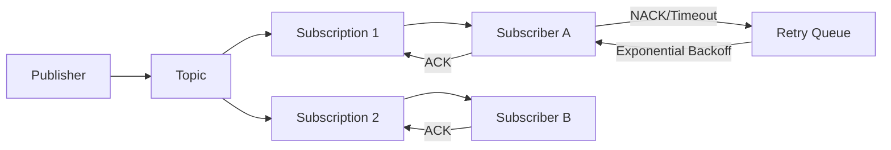
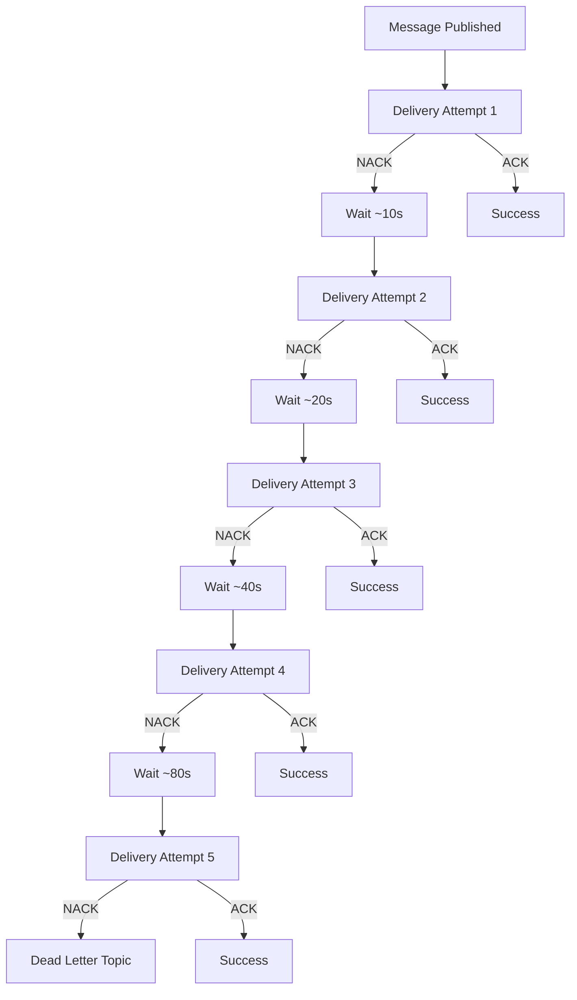
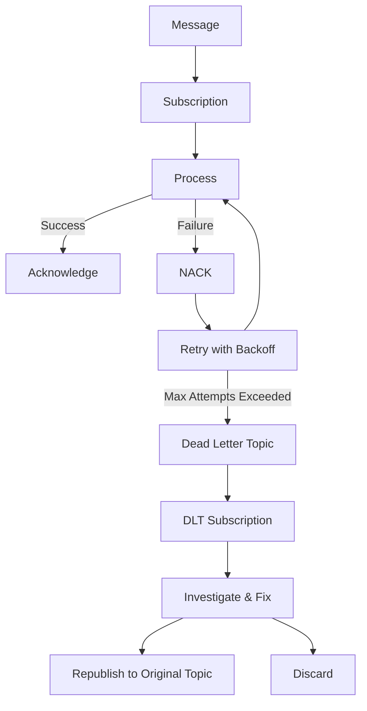

# How to Configure Pub/Sub Retry Policies with Exponential Backoff

Author: [nawazdhandala](https://github.com/nawazdhandala)

Tags: Google Cloud, Pub/Sub, Messaging, Retry Policies, Distributed Systems, DevOps

Description: Learn how to configure Google Cloud Pub/Sub retry policies with exponential backoff, dead letter topics, and best practices for building reliable message-driven applications.

---

Message delivery in distributed systems is inherently unreliable. Network partitions, service outages, and transient errors can all prevent successful message processing. Google Cloud Pub/Sub provides built-in retry mechanisms with exponential backoff to handle these failures gracefully, ensuring your messages eventually reach their destination without overwhelming your subscribers.

## Understanding Pub/Sub Message Flow

Before diving into retry configuration, understanding how messages flow through Pub/Sub helps clarify where retries occur and why they matter.



## Why Exponential Backoff?

| Retry Strategy | Behavior | Problem |
|----------------|----------|---------|
| **Immediate retry** | Retry instantly on failure | Overwhelms failing services |
| **Fixed interval** | Wait fixed time between retries | Synchronized retries cause spikes |
| **Linear backoff** | Increase wait time linearly | Still too aggressive for long outages |
| **Exponential backoff** | Double wait time each retry | Gradually reduces pressure |

Exponential backoff multiplies the delay between each retry attempt, giving failing services time to recover while still ensuring eventual delivery.

## Retry Policy Configuration

### Basic Retry Policy with gcloud

The following command creates a subscription with a retry policy. Minimum backoff starts at 10 seconds and maximum backoff caps at 600 seconds (10 minutes). Pub/Sub will exponentially increase delays between these bounds.

```bash
# Create a subscription with exponential backoff retry policy
# minimum-backoff: Initial delay before first retry (10s-600s)
# maximum-backoff: Maximum delay between retries (10s-600s)
gcloud pubsub subscriptions create my-subscription \
    --topic=my-topic \
    --ack-deadline=60 \
    --min-retry-delay=10s \
    --max-retry-delay=600s
```

### Retry Policy with Terraform

Infrastructure as code ensures consistent retry policies across environments. The following Terraform configuration creates a topic, subscription, and dead letter topic for messages that exhaust all retry attempts.

```hcl
# Configure Pub/Sub with retry policy and dead letter handling
# The retry_policy block controls exponential backoff behavior
resource "google_pubsub_topic" "main" {
  name = "orders-topic"
}

resource "google_pubsub_topic" "dead_letter" {
  name = "orders-dead-letter"
}

resource "google_pubsub_subscription" "orders" {
  name  = "orders-subscription"
  topic = google_pubsub_topic.main.name

  # How long Pub/Sub waits for acknowledgment before redelivery
  ack_deadline_seconds = 60

  # Retry policy with exponential backoff
  retry_policy {
    minimum_backoff = "10s"   # Start with 10 second delay
    maximum_backoff = "600s"  # Cap at 10 minutes
  }

  # Dead letter policy for messages that fail repeatedly
  dead_letter_policy {
    dead_letter_topic     = google_pubsub_topic.dead_letter.id
    max_delivery_attempts = 5  # Move to DLQ after 5 failures
  }

  # Message retention if no subscribers are connected
  message_retention_duration = "604800s"  # 7 days

  # Retain acknowledged messages for replay capability
  retain_acked_messages = true
}

# Subscription for processing dead letter messages
resource "google_pubsub_subscription" "dead_letter_sub" {
  name  = "orders-dead-letter-subscription"
  topic = google_pubsub_topic.dead_letter.name

  ack_deadline_seconds = 120  # Longer deadline for investigation
}
```

## Retry Behavior Visualization

Understanding how exponential backoff progresses helps when tuning your retry policy for specific use cases.



## Configuring Retry Policy with Client Libraries

### Python Client

The Python client library allows programmatic subscription creation with retry policies. The following example demonstrates creating a subscription with custom backoff settings and dead letter configuration.

```python
from google.cloud import pubsub_v1
from google.protobuf import duration_pb2

def create_subscription_with_retry(
    project_id: str,
    topic_id: str,
    subscription_id: str,
    dead_letter_topic_id: str,
) -> None:
    """
    Create a Pub/Sub subscription with exponential backoff retry policy.

    Args:
        project_id: GCP project ID
        topic_id: Source topic name
        subscription_id: New subscription name
        dead_letter_topic_id: Topic for failed messages
    """
    subscriber = pubsub_v1.SubscriberClient()

    topic_path = subscriber.topic_path(project_id, topic_id)
    subscription_path = subscriber.subscription_path(project_id, subscription_id)
    dead_letter_topic_path = subscriber.topic_path(project_id, dead_letter_topic_id)

    # Configure retry policy with exponential backoff
    # minimum_backoff: Initial delay (must be between 10s and 600s)
    # maximum_backoff: Maximum delay cap (must be between 10s and 600s)
    retry_policy = pubsub_v1.types.RetryPolicy(
        minimum_backoff=duration_pb2.Duration(seconds=10),
        maximum_backoff=duration_pb2.Duration(seconds=600),
    )

    # Configure dead letter policy for exhausted retries
    # max_delivery_attempts: Number of attempts before moving to DLQ
    dead_letter_policy = pubsub_v1.types.DeadLetterPolicy(
        dead_letter_topic=dead_letter_topic_path,
        max_delivery_attempts=5,
    )

    # Build subscription request with all configurations
    subscription = pubsub_v1.types.Subscription(
        name=subscription_path,
        topic=topic_path,
        ack_deadline_seconds=60,
        retry_policy=retry_policy,
        dead_letter_policy=dead_letter_policy,
        # Enable exactly-once delivery for critical workloads
        enable_exactly_once_delivery=True,
    )

    # Create the subscription
    created_subscription = subscriber.create_subscription(request=subscription)

    print(f"Created subscription: {created_subscription.name}")
    print(f"Retry policy: {created_subscription.retry_policy}")
    print(f"Dead letter policy: {created_subscription.dead_letter_policy}")


# Usage example
create_subscription_with_retry(
    project_id="my-project",
    topic_id="orders",
    subscription_id="orders-processor",
    dead_letter_topic_id="orders-dead-letter",
)
```

### Node.js Client

Node.js applications can configure retry policies using the official client library. The following example shows subscription creation with retry configuration and proper error handling.

```javascript
const { PubSub } = require('@google-cloud/pubsub');

/**
 * Create a Pub/Sub subscription with exponential backoff retry policy.
 *
 * @param {string} projectId - GCP project ID
 * @param {string} topicName - Source topic name
 * @param {string} subscriptionName - New subscription name
 * @param {string} deadLetterTopicName - Topic for failed messages
 */
async function createSubscriptionWithRetry(
  projectId,
  topicName,
  subscriptionName,
  deadLetterTopicName
) {
  const pubsub = new PubSub({ projectId });

  // Subscription configuration with retry policy
  // minimumBackoff/maximumBackoff control exponential backoff bounds
  const options = {
    // Acknowledgment deadline in seconds
    ackDeadlineSeconds: 60,

    // Retry policy configuration
    retryPolicy: {
      minimumBackoff: { seconds: 10 },  // Start at 10 seconds
      maximumBackoff: { seconds: 600 }, // Cap at 10 minutes
    },

    // Dead letter policy for failed messages
    deadLetterPolicy: {
      deadLetterTopic: `projects/${projectId}/topics/${deadLetterTopicName}`,
      maxDeliveryAttempts: 5,
    },

    // Enable message ordering if needed
    enableMessageOrdering: false,

    // Retain messages for replay capability
    retainAckedMessages: true,
    messageRetentionDuration: { seconds: 604800 }, // 7 days
  };

  try {
    const [subscription] = await pubsub
      .topic(topicName)
      .createSubscription(subscriptionName, options);

    console.log(`Created subscription: ${subscription.name}`);
    console.log(`Retry policy configured with backoff: 10s - 600s`);
    console.log(`Dead letter topic: ${deadLetterTopicName}`);

    return subscription;
  } catch (error) {
    // Handle already exists error gracefully
    if (error.code === 6) {
      console.log(`Subscription ${subscriptionName} already exists`);
      return pubsub.subscription(subscriptionName);
    }
    throw error;
  }
}

// Usage
createSubscriptionWithRetry(
  'my-project',
  'orders',
  'orders-processor',
  'orders-dead-letter'
);
```

### Go Client

Go applications can leverage the Pub/Sub client library for subscription management. The following code demonstrates creating a subscription with retry policy and dead letter configuration.

```go
package main

import (
    "context"
    "fmt"
    "log"
    "time"

    "cloud.google.com/go/pubsub"
)

// CreateSubscriptionWithRetry creates a Pub/Sub subscription with exponential
// backoff retry policy and dead letter handling.
func CreateSubscriptionWithRetry(
    projectID string,
    topicID string,
    subscriptionID string,
    deadLetterTopicID string,
) error {
    ctx := context.Background()

    // Initialize Pub/Sub client
    client, err := pubsub.NewClient(ctx, projectID)
    if err != nil {
        return fmt.Errorf("failed to create client: %w", err)
    }
    defer client.Close()

    topic := client.Topic(topicID)
    deadLetterTopic := client.Topic(deadLetterTopicID)

    // Configure subscription with retry policy
    // RetryPolicy controls exponential backoff between redelivery attempts
    cfg := pubsub.SubscriptionConfig{
        Topic: topic,

        // Time Pub/Sub waits for acknowledgment
        AckDeadline: 60 * time.Second,

        // Retry policy with exponential backoff
        // MinimumBackoff: Starting delay (10s minimum)
        // MaximumBackoff: Maximum delay cap (600s maximum)
        RetryPolicy: &pubsub.RetryPolicy{
            MinimumBackoff: 10 * time.Second,
            MaximumBackoff: 600 * time.Second,
        },

        // Dead letter policy for exhausted retries
        DeadLetterPolicy: &pubsub.DeadLetterPolicy{
            DeadLetterTopic:     deadLetterTopic.String(),
            MaxDeliveryAttempts: 5,
        },

        // Message retention configuration
        RetentionDuration:    7 * 24 * time.Hour, // 7 days
        RetainAckedMessages:  true,

        // Enable exactly-once delivery for critical workloads
        EnableExactlyOnceDelivery: true,
    }

    subscription, err := client.CreateSubscription(ctx, subscriptionID, cfg)
    if err != nil {
        return fmt.Errorf("failed to create subscription: %w", err)
    }

    log.Printf("Created subscription: %s", subscription.String())
    log.Printf("Retry policy: MinBackoff=%v, MaxBackoff=%v",
        cfg.RetryPolicy.MinimumBackoff,
        cfg.RetryPolicy.MaximumBackoff)

    return nil
}

func main() {
    err := CreateSubscriptionWithRetry(
        "my-project",
        "orders",
        "orders-processor",
        "orders-dead-letter",
    )
    if err != nil {
        log.Fatalf("Error: %v", err)
    }
}
```

## Subscriber Implementation with Proper ACK/NACK Handling

Configuring retry policy is only half the solution. Your subscriber code must properly acknowledge or negatively acknowledge messages to trigger the retry behavior.

### Python Subscriber with Error Handling

The following subscriber implementation demonstrates proper ACK/NACK handling with error classification. Transient errors trigger NACK for retry, while permanent errors ACK the message and log for manual investigation.

```python
from google.cloud import pubsub_v1
from google.api_core.exceptions import DeadlineExceeded
import json
import logging

logging.basicConfig(level=logging.INFO)
logger = logging.getLogger(__name__)


class TransientError(Exception):
    """Error that may succeed on retry."""
    pass


class PermanentError(Exception):
    """Error that will never succeed, skip retries."""
    pass


def process_message(message_data: dict) -> None:
    """
    Process the message payload.
    Raises TransientError for retryable failures.
    Raises PermanentError for non-retryable failures.
    """
    # Validate message format
    if "order_id" not in message_data:
        raise PermanentError("Missing required field: order_id")

    # Simulate processing that might fail transiently
    # In production, replace with actual business logic
    try:
        # Database operation, API call, etc.
        result = external_api_call(message_data)
        logger.info(f"Processed order: {message_data['order_id']}")
        return result
    except ConnectionError as e:
        # Network errors are transient, retry
        raise TransientError(f"Connection failed: {e}")
    except ValueError as e:
        # Validation errors are permanent, don't retry
        raise PermanentError(f"Invalid data: {e}")


def callback(message: pubsub_v1.subscriber.message.Message) -> None:
    """
    Message callback with proper ACK/NACK handling.

    ACK: Message processed successfully or has permanent error
    NACK: Message should be retried (transient error)
    """
    delivery_attempt = message.delivery_attempt or 1
    logger.info(
        f"Received message {message.message_id}, "
        f"delivery attempt: {delivery_attempt}"
    )

    try:
        # Parse message data
        data = json.loads(message.data.decode("utf-8"))

        # Process the message
        process_message(data)

        # Success - acknowledge to remove from queue
        message.ack()
        logger.info(f"Message {message.message_id} acknowledged")

    except TransientError as e:
        # Transient error - NACK to trigger retry with backoff
        logger.warning(
            f"Transient error processing {message.message_id}: {e}. "
            f"Will retry (attempt {delivery_attempt})"
        )
        message.nack()

    except PermanentError as e:
        # Permanent error - ACK to prevent infinite retries
        # Log for manual investigation
        logger.error(
            f"Permanent error processing {message.message_id}: {e}. "
            f"Message will not be retried."
        )
        message.ack()

    except Exception as e:
        # Unexpected error - NACK for retry, may need investigation
        logger.exception(
            f"Unexpected error processing {message.message_id}: {e}"
        )
        message.nack()


def subscribe(project_id: str, subscription_id: str) -> None:
    """
    Start subscribing to messages with flow control.
    """
    subscriber = pubsub_v1.SubscriberClient()
    subscription_path = subscriber.subscription_path(project_id, subscription_id)

    # Flow control prevents pulling too many messages at once
    # Helps avoid memory issues and timeout problems
    flow_control = pubsub_v1.types.FlowControl(
        max_messages=100,           # Max outstanding messages
        max_bytes=10 * 1024 * 1024, # 10 MB max outstanding bytes
    )

    streaming_pull_future = subscriber.subscribe(
        subscription_path,
        callback=callback,
        flow_control=flow_control,
    )

    logger.info(f"Listening for messages on {subscription_path}")

    try:
        # Block and process messages
        streaming_pull_future.result()
    except KeyboardInterrupt:
        streaming_pull_future.cancel()
        streaming_pull_future.result()


# External API call simulation
def external_api_call(data):
    """Simulated external API call."""
    return {"status": "processed", "order_id": data["order_id"]}


if __name__ == "__main__":
    subscribe("my-project", "orders-processor")
```

### Node.js Subscriber with Error Classification

Node.js subscribers should implement similar error classification to determine which failures warrant retry attempts.

```javascript
const { PubSub } = require('@google-cloud/pubsub');

// Custom error classes for retry classification
class TransientError extends Error {
  constructor(message) {
    super(message);
    this.name = 'TransientError';
    this.retryable = true;
  }
}

class PermanentError extends Error {
  constructor(message) {
    super(message);
    this.name = 'PermanentError';
    this.retryable = false;
  }
}

/**
 * Process a message payload.
 * Throws TransientError for retryable failures.
 * Throws PermanentError for non-retryable failures.
 */
async function processMessage(data) {
  // Validate required fields
  if (!data.orderId) {
    throw new PermanentError('Missing required field: orderId');
  }

  try {
    // Simulate external API call or database operation
    const result = await externalApiCall(data);
    console.log(`Processed order: ${data.orderId}`);
    return result;
  } catch (error) {
    // Classify errors for retry decisions
    if (error.code === 'ECONNREFUSED' || error.code === 'ETIMEDOUT') {
      throw new TransientError(`Connection failed: ${error.message}`);
    }
    if (error.code === 'INVALID_ARGUMENT') {
      throw new PermanentError(`Invalid data: ${error.message}`);
    }
    // Unknown errors are treated as transient by default
    throw new TransientError(`Unknown error: ${error.message}`);
  }
}

/**
 * Message handler with proper ACK/NACK logic.
 * Determines retry behavior based on error classification.
 */
async function messageHandler(message) {
  const deliveryAttempt = message.deliveryAttempt || 1;
  console.log(
    `Received message ${message.id}, delivery attempt: ${deliveryAttempt}`
  );

  try {
    // Parse message data
    const data = JSON.parse(message.data.toString());

    // Process the message
    await processMessage(data);

    // Success - acknowledge message
    message.ack();
    console.log(`Message ${message.id} acknowledged`);

  } catch (error) {
    if (error instanceof PermanentError) {
      // Permanent error - ACK to prevent infinite retries
      console.error(
        `Permanent error for ${message.id}: ${error.message}. ` +
        `Message will not be retried.`
      );
      message.ack();

    } else if (error instanceof TransientError) {
      // Transient error - NACK for retry with backoff
      console.warn(
        `Transient error for ${message.id}: ${error.message}. ` +
        `Will retry (attempt ${deliveryAttempt})`
      );
      message.nack();

    } else {
      // Unexpected error - NACK for retry
      console.error(`Unexpected error for ${message.id}:`, error);
      message.nack();
    }
  }
}

/**
 * Start subscription with flow control.
 */
async function subscribe(projectId, subscriptionName) {
  const pubsub = new PubSub({ projectId });
  const subscription = pubsub.subscription(subscriptionName);

  // Configure flow control to prevent overwhelming the subscriber
  subscription.setOptions({
    flowControl: {
      maxMessages: 100,           // Max outstanding messages
      maxBytes: 10 * 1024 * 1024, // 10 MB max
    },
  });

  subscription.on('message', messageHandler);

  subscription.on('error', (error) => {
    console.error('Subscription error:', error);
  });

  console.log(`Listening for messages on ${subscriptionName}`);
}

// Simulated external API call
async function externalApiCall(data) {
  return { status: 'processed', orderId: data.orderId };
}

// Start subscriber
subscribe('my-project', 'orders-processor');
```

## Dead Letter Topic Processing

Messages that exceed the maximum delivery attempts land in the dead letter topic. Processing these messages requires different handling since they represent persistent failures that need investigation.



### Dead Letter Processor

The following Python script processes dead letter messages, logs them for investigation, and provides options for republishing or archiving.

```python
from google.cloud import pubsub_v1
from google.cloud import storage
import json
import logging
from datetime import datetime

logging.basicConfig(level=logging.INFO)
logger = logging.getLogger(__name__)


class DeadLetterProcessor:
    """
    Process messages from dead letter topic.
    Provides investigation tools and remediation options.
    """

    def __init__(self, project_id: str, original_topic_id: str, bucket_name: str):
        self.project_id = project_id
        self.original_topic_id = original_topic_id
        self.bucket_name = bucket_name
        self.publisher = pubsub_v1.PublisherClient()
        self.storage_client = storage.Client()

    def process_dead_letter(self, message: pubsub_v1.subscriber.message.Message):
        """
        Process a dead letter message.
        Options: investigate, republish, or archive.
        """
        # Extract message metadata for investigation
        metadata = {
            "message_id": message.message_id,
            "publish_time": message.publish_time.isoformat(),
            "delivery_attempt": message.delivery_attempt,
            "attributes": dict(message.attributes),
            "data": message.data.decode("utf-8"),
        }

        logger.info(f"Processing dead letter: {json.dumps(metadata, indent=2)}")

        try:
            data = json.loads(message.data.decode("utf-8"))

            # Attempt to determine failure reason
            failure_reason = self.analyze_failure(data, metadata)

            if failure_reason == "transient":
                # Transient issues resolved, republish
                self.republish_message(message)
                logger.info(f"Republished message {message.message_id}")

            elif failure_reason == "fixable":
                # Data issue that can be corrected
                fixed_data = self.fix_message(data)
                self.republish_fixed_message(fixed_data, message.attributes)
                logger.info(f"Fixed and republished message {message.message_id}")

            else:
                # Archive for manual investigation
                self.archive_message(metadata)
                logger.info(f"Archived message {message.message_id}")

            message.ack()

        except Exception as e:
            logger.exception(f"Error processing dead letter: {e}")
            # Archive failed processing attempts
            self.archive_message(metadata)
            message.ack()

    def analyze_failure(self, data: dict, metadata: dict) -> str:
        """
        Analyze why the message failed processing.
        Returns: 'transient', 'fixable', or 'manual'
        """
        # Check for known transient error patterns
        if metadata.get("delivery_attempt", 0) < 10:
            # May have been a temporary outage
            return "transient"

        # Check for fixable data issues
        if "order_id" not in data and "orderId" in data:
            return "fixable"  # Field name mismatch

        return "manual"  # Requires human investigation

    def fix_message(self, data: dict) -> dict:
        """Apply automatic fixes to message data."""
        fixed = data.copy()

        # Fix common field name issues
        if "orderId" in fixed and "order_id" not in fixed:
            fixed["order_id"] = fixed.pop("orderId")

        return fixed

    def republish_message(self, message):
        """Republish original message to the source topic."""
        topic_path = self.publisher.topic_path(
            self.project_id, self.original_topic_id
        )

        future = self.publisher.publish(
            topic_path,
            message.data,
            **message.attributes,
            republished_from_dlq="true",
            original_message_id=message.message_id,
        )
        future.result()  # Wait for publish to complete

    def republish_fixed_message(self, data: dict, attributes: dict):
        """Republish fixed message to the source topic."""
        topic_path = self.publisher.topic_path(
            self.project_id, self.original_topic_id
        )

        attrs = dict(attributes)
        attrs["fixed_by_dlq_processor"] = "true"

        future = self.publisher.publish(
            topic_path,
            json.dumps(data).encode("utf-8"),
            **attrs,
        )
        future.result()

    def archive_message(self, metadata: dict):
        """Archive message to Cloud Storage for investigation."""
        bucket = self.storage_client.bucket(self.bucket_name)

        # Organize by date for easy browsing
        date_prefix = datetime.now().strftime("%Y/%m/%d")
        blob_name = f"dead-letters/{date_prefix}/{metadata['message_id']}.json"

        blob = bucket.blob(blob_name)
        blob.upload_from_string(
            json.dumps(metadata, indent=2),
            content_type="application/json",
        )


def run_dead_letter_processor(
    project_id: str,
    dlq_subscription_id: str,
    original_topic_id: str,
    archive_bucket: str,
):
    """Start the dead letter processor."""
    processor = DeadLetterProcessor(project_id, original_topic_id, archive_bucket)

    subscriber = pubsub_v1.SubscriberClient()
    subscription_path = subscriber.subscription_path(project_id, dlq_subscription_id)

    streaming_pull_future = subscriber.subscribe(
        subscription_path,
        callback=processor.process_dead_letter,
    )

    logger.info(f"Processing dead letters from {subscription_path}")

    try:
        streaming_pull_future.result()
    except KeyboardInterrupt:
        streaming_pull_future.cancel()


if __name__ == "__main__":
    run_dead_letter_processor(
        project_id="my-project",
        dlq_subscription_id="orders-dead-letter-subscription",
        original_topic_id="orders",
        archive_bucket="my-project-dlq-archive",
    )
```

## Monitoring Retry Behavior

Effective monitoring helps identify when retry policies need adjustment. High retry rates may indicate upstream issues, while messages reaching the dead letter topic signal persistent problems.

### Cloud Monitoring Alerts

Set up alerts for retry-related metrics using the following Terraform configuration.

```hcl
# Alert when dead letter messages accumulate
resource "google_monitoring_alert_policy" "dlq_messages" {
  display_name = "Dead Letter Queue Messages Accumulating"

  conditions {
    display_name = "DLQ message count"

    condition_threshold {
      filter = <<-EOT
        resource.type = "pubsub_subscription"
        AND resource.labels.subscription_id = "orders-dead-letter-subscription"
        AND metric.type = "pubsub.googleapis.com/subscription/num_undelivered_messages"
      EOT

      duration        = "300s"
      comparison      = "COMPARISON_GT"
      threshold_value = 10

      aggregations {
        alignment_period   = "60s"
        per_series_aligner = "ALIGN_MEAN"
      }
    }
  }

  notification_channels = [google_monitoring_notification_channel.email.name]

  documentation {
    content = "Dead letter queue has accumulated messages. Check for systematic processing failures."
  }
}

# Alert on high message age indicating delivery delays
resource "google_monitoring_alert_policy" "old_messages" {
  display_name = "Pub/Sub Message Delivery Delayed"

  conditions {
    display_name = "Old unacked messages"

    condition_threshold {
      filter = <<-EOT
        resource.type = "pubsub_subscription"
        AND resource.labels.subscription_id = "orders-processor"
        AND metric.type = "pubsub.googleapis.com/subscription/oldest_unacked_message_age"
      EOT

      duration        = "300s"
      comparison      = "COMPARISON_GT"
      threshold_value = 600  # 10 minutes

      aggregations {
        alignment_period   = "60s"
        per_series_aligner = "ALIGN_MAX"
      }
    }
  }

  notification_channels = [google_monitoring_notification_channel.email.name]
}
```

### Custom Metrics for Retry Analysis

Publishing custom metrics helps track retry patterns specific to your application.

```python
from google.cloud import monitoring_v3
from google.api import metric_pb2
import time


class RetryMetrics:
    """
    Publish custom metrics for retry behavior analysis.
    """

    def __init__(self, project_id: str):
        self.client = monitoring_v3.MetricServiceClient()
        self.project_name = f"projects/{project_id}"

    def record_processing_attempt(
        self,
        subscription_id: str,
        delivery_attempt: int,
        success: bool,
        error_type: str = None,
    ):
        """
        Record a message processing attempt for analysis.

        Args:
            subscription_id: Subscription being processed
            delivery_attempt: Which attempt number (1, 2, 3, etc.)
            success: Whether processing succeeded
            error_type: Error classification if failed
        """
        series = monitoring_v3.TimeSeries()

        # Custom metric type
        series.metric.type = "custom.googleapis.com/pubsub/processing_attempts"
        series.metric.labels["subscription_id"] = subscription_id
        series.metric.labels["delivery_attempt"] = str(delivery_attempt)
        series.metric.labels["result"] = "success" if success else "failure"
        if error_type:
            series.metric.labels["error_type"] = error_type

        # Resource labels
        series.resource.type = "global"

        # Data point
        now = time.time()
        point = monitoring_v3.Point()
        point.value.int64_value = 1
        point.interval.end_time.seconds = int(now)
        series.points.append(point)

        self.client.create_time_series(
            name=self.project_name,
            time_series=[series],
        )

    def record_dlq_message(
        self,
        subscription_id: str,
        failure_reason: str,
        total_attempts: int,
    ):
        """
        Record when a message reaches the dead letter queue.

        Args:
            subscription_id: Original subscription
            failure_reason: Why the message failed
            total_attempts: Total delivery attempts made
        """
        series = monitoring_v3.TimeSeries()

        series.metric.type = "custom.googleapis.com/pubsub/dead_letter_messages"
        series.metric.labels["subscription_id"] = subscription_id
        series.metric.labels["failure_reason"] = failure_reason
        series.metric.labels["total_attempts"] = str(total_attempts)

        series.resource.type = "global"

        now = time.time()
        point = monitoring_v3.Point()
        point.value.int64_value = 1
        point.interval.end_time.seconds = int(now)
        series.points.append(point)

        self.client.create_time_series(
            name=self.project_name,
            time_series=[series],
        )
```

## Best Practices

### Choosing Backoff Values

| Scenario | Min Backoff | Max Backoff | Rationale |
|----------|-------------|-------------|-----------|
| **API rate limits** | 30s | 600s | Match rate limit windows |
| **Database failover** | 10s | 300s | Allow failover to complete |
| **Network blips** | 1s | 60s | Quick recovery expected |
| **Batch processing** | 60s | 600s | Allow batch cycles to complete |

### Configuration Checklist

```yaml
# Pub/Sub Retry Policy Checklist

subscription_settings:
  # Ack deadline should exceed your processing time with margin
  ack_deadline_seconds: 60

  # Retry policy bounds
  retry_policy:
    minimum_backoff: "10s"  # Start conservative
    maximum_backoff: "600s" # Cap to prevent infinite waits

  # Dead letter handling
  dead_letter_policy:
    max_delivery_attempts: 5  # Balance between retry and giving up
    dead_letter_topic: "configured" # Always have a DLT

subscriber_code:
  # Error classification
  - classify_transient_errors: true
  - classify_permanent_errors: true

  # ACK/NACK handling
  - ack_on_success: true
  - ack_on_permanent_error: true
  - nack_on_transient_error: true

  # Flow control
  - max_outstanding_messages: 100
  - max_outstanding_bytes: "10MB"

monitoring:
  # Essential metrics
  - num_undelivered_messages: "alert on accumulation"
  - oldest_unacked_message_age: "alert on delays"
  - dead_letter_message_count: "alert on any increase"
```

## Summary

| Configuration | Purpose | Recommendation |
|--------------|---------|----------------|
| **minimum_backoff** | Initial retry delay | Start at 10s for most workloads |
| **maximum_backoff** | Retry delay cap | 600s (10 min) balances persistence and resource usage |
| **max_delivery_attempts** | Retries before DLQ | 5 attempts covers most transient failures |
| **ack_deadline** | Processing timeout | Set to 2x your maximum expected processing time |
| **Dead letter topic** | Failed message handling | Always configure for visibility |

Proper retry policy configuration transforms unreliable message delivery into a robust, self-healing system. Combining exponential backoff with dead letter handling and comprehensive monitoring ensures your Pub/Sub-based applications handle failures gracefully while maintaining visibility into system health.
