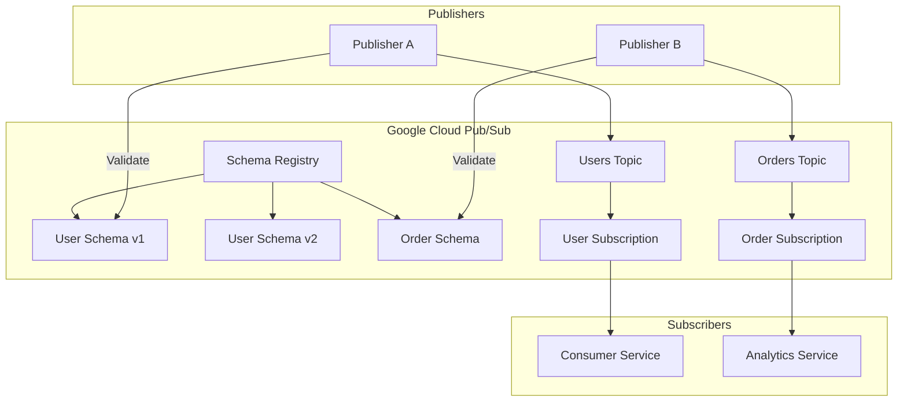
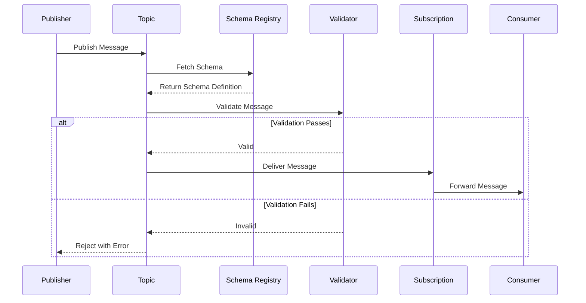
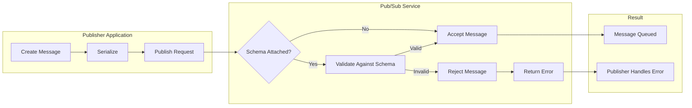
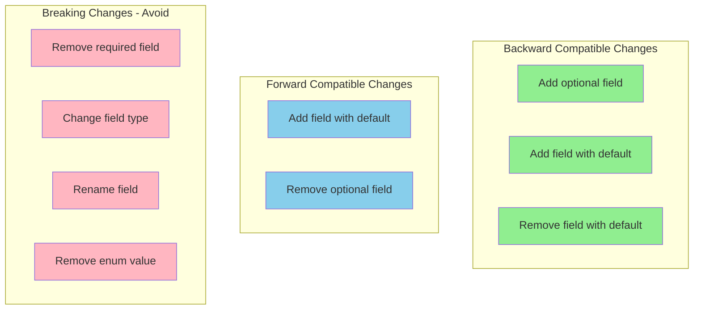
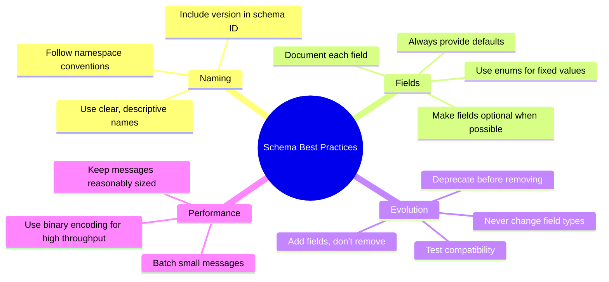

# How to Configure Pub/Sub Schemas

Author: [nawazdhandala](https://www.github.com/nawazdhandala)

Tags: Google Cloud, Pub/Sub, Schemas, Event-Driven Architecture, Data Validation, Avro, Protocol Buffers, Messaging

Description: Learn how to configure and manage schemas in Google Cloud Pub/Sub for data validation and governance. Covers Avro and Protocol Buffer schemas, schema versioning, topic bindings, and best practices for building reliable messaging systems.

---

> Google Cloud Pub/Sub schemas provide a mechanism to define and enforce the structure of messages flowing through your messaging system. By configuring schemas, you ensure data quality, enable schema evolution, and create self-documenting event contracts between producers and consumers.

Schema validation at the messaging layer catches malformed data early, before it propagates through your system and causes downstream failures. Pub/Sub supports both Apache Avro and Protocol Buffers, giving you flexibility to choose the format that best fits your organization's needs.

---

## Schema Architecture in Pub/Sub

Pub/Sub schemas act as contracts between message producers and consumers. When you attach a schema to a topic, every published message must conform to that schema.



---

## Setting Up Your Environment

### Installing the Google Cloud SDK

Before working with Pub/Sub schemas, you need the Google Cloud SDK installed and configured.

```bash
# Install Google Cloud SDK on macOS using Homebrew
brew install google-cloud-sdk

# Authenticate with your Google Cloud account
gcloud auth login

# Set your default project
gcloud config set project your-project-id

# Enable the Pub/Sub API if not already enabled
gcloud services enable pubsub.googleapis.com
```

### Installing Python Client Libraries

Install the Python client library to interact with Pub/Sub programmatically.

```bash
# Install the Pub/Sub client library
pip install google-cloud-pubsub

# Install Avro library for schema handling
pip install avro-python3

# Install Protocol Buffers compiler and library
pip install protobuf grpcio-tools
```

---

## Creating Avro Schemas

### Understanding Avro Schema Structure

Avro schemas use JSON to define data structures. The following example creates a schema for user events with required and optional fields.

```json
{
  "type": "record",
  "name": "UserEvent",
  "namespace": "com.example.events",
  "doc": "Represents a user activity event in the system",
  "fields": [
    {
      "name": "user_id",
      "type": "string",
      "doc": "Unique identifier for the user"
    },
    {
      "name": "event_type",
      "type": {
        "type": "enum",
        "name": "EventType",
        "symbols": ["CREATED", "UPDATED", "DELETED", "LOGIN", "LOGOUT"]
      },
      "doc": "Type of user event"
    },
    {
      "name": "timestamp",
      "type": "long",
      "doc": "Unix timestamp in milliseconds when the event occurred"
    },
    {
      "name": "email",
      "type": ["null", "string"],
      "default": null,
      "doc": "User email address, optional field"
    },
    {
      "name": "metadata",
      "type": {
        "type": "map",
        "values": "string"
      },
      "default": {},
      "doc": "Additional key-value metadata for the event"
    }
  ]
}
```

### Creating a Schema with gcloud CLI

Use the gcloud command-line tool to create schemas in your Pub/Sub project.

```bash
# Create an Avro schema from a local file
gcloud pubsub schemas create user-events-schema \
    --type=AVRO \
    --definition-file=./schemas/user-event.avsc \
    --project=your-project-id

# Verify the schema was created successfully
gcloud pubsub schemas describe user-events-schema \
    --project=your-project-id

# List all schemas in the project
gcloud pubsub schemas list --project=your-project-id
```

### Creating a Schema Programmatically with Python

The Python client library allows you to create and manage schemas programmatically within your application code.

```python
# schema_manager.py
# Programmatic schema creation and management for Pub/Sub
from google.cloud import pubsub_v1
from google.pubsub_v1.types import Schema
from google.api_core.exceptions import AlreadyExists, NotFound
import json

class PubSubSchemaManager:
    """
    Manages Pub/Sub schemas including creation, validation, and versioning.
    Provides methods for common schema operations.
    """

    def __init__(self, project_id: str):
        # Initialize the schema service client
        self.project_id = project_id
        self.client = pubsub_v1.SchemaServiceClient()
        self.project_path = f"projects/{project_id}"

    def create_avro_schema(self, schema_id: str, avro_definition: dict) -> Schema:
        """
        Create a new Avro schema in Pub/Sub.

        Args:
            schema_id: Unique identifier for the schema
            avro_definition: Dictionary containing the Avro schema definition

        Returns:
            The created Schema object
        """
        # Build the full schema path
        schema_path = f"{self.project_path}/schemas/{schema_id}"

        # Convert the definition to a JSON string
        definition_str = json.dumps(avro_definition)

        # Create the schema configuration
        schema = Schema(
            name=schema_path,
            type_=Schema.Type.AVRO,
            definition=definition_str
        )

        try:
            # Attempt to create the schema
            created_schema = self.client.create_schema(
                parent=self.project_path,
                schema=schema,
                schema_id=schema_id
            )
            print(f"Created schema: {created_schema.name}")
            return created_schema

        except AlreadyExists:
            print(f"Schema {schema_id} already exists, retrieving existing schema")
            return self.client.get_schema(name=schema_path)

    def validate_message(self, schema_id: str, message: dict) -> bool:
        """
        Validate a message against an existing schema.

        Args:
            schema_id: The schema to validate against
            message: The message dictionary to validate

        Returns:
            True if validation passes, raises exception otherwise
        """
        schema_path = f"{self.project_path}/schemas/{schema_id}"

        # Convert message to JSON bytes for validation
        message_data = json.dumps(message).encode('utf-8')

        # Validate the message against the schema
        response = self.client.validate_message(
            parent=self.project_path,
            name=schema_path,
            message=message_data,
            encoding="JSON"
        )

        print(f"Message validation successful for schema {schema_id}")
        return True

    def delete_schema(self, schema_id: str) -> None:
        """
        Delete a schema from the registry.
        Note: Schema must not be attached to any topics.
        """
        schema_path = f"{self.project_path}/schemas/{schema_id}"

        try:
            self.client.delete_schema(name=schema_path)
            print(f"Deleted schema: {schema_id}")
        except NotFound:
            print(f"Schema {schema_id} not found")


# Example usage demonstrating schema creation workflow
if __name__ == "__main__":
    # Define the Avro schema for user events
    user_event_schema = {
        "type": "record",
        "name": "UserEvent",
        "namespace": "com.example.events",
        "fields": [
            {"name": "user_id", "type": "string"},
            {"name": "event_type", "type": "string"},
            {"name": "timestamp", "type": "long"},
            {"name": "email", "type": ["null", "string"], "default": None}
        ]
    }

    # Initialize the schema manager
    manager = PubSubSchemaManager("your-project-id")

    # Create the schema
    schema = manager.create_avro_schema("user-events-v1", user_event_schema)

    # Validate a sample message
    sample_message = {
        "user_id": "usr_12345",
        "event_type": "CREATED",
        "timestamp": 1706745600000,
        "email": "user@example.com"
    }

    manager.validate_message("user-events-v1", sample_message)
```

---

## Creating Protocol Buffer Schemas

### Defining a Protocol Buffer Schema

Protocol Buffers provide a more compact binary format with strong typing. Create a .proto file with your message definitions.

```protobuf
// order_event.proto
// Protocol Buffer schema for order processing events

syntax = "proto3";

package com.example.orders;

// Represents a line item within an order
message OrderItem {
  string product_id = 1;
  string product_name = 2;
  int32 quantity = 3;
  // Price in cents to avoid floating point issues
  int64 price_cents = 4;
}

// Represents the complete order event
message OrderEvent {
  // Unique order identifier
  string order_id = 1;

  // Customer who placed the order
  string customer_id = 2;

  // Current status of the order
  enum OrderStatus {
    PENDING = 0;
    CONFIRMED = 1;
    PROCESSING = 2;
    SHIPPED = 3;
    DELIVERED = 4;
    CANCELLED = 5;
  }
  OrderStatus status = 3;

  // List of items in the order
  repeated OrderItem items = 4;

  // Total amount in cents
  int64 total_cents = 5;

  // Unix timestamp in milliseconds
  int64 created_at = 6;
  int64 updated_at = 7;

  // Shipping address components
  message Address {
    string street = 1;
    string city = 2;
    string state = 3;
    string postal_code = 4;
    string country = 5;
  }
  Address shipping_address = 8;
}
```

### Creating a Protocol Buffer Schema in Pub/Sub

Register the Protocol Buffer schema with Pub/Sub using the gcloud CLI.

```bash
# Create a Protocol Buffer schema from the .proto file
gcloud pubsub schemas create order-events-schema \
    --type=PROTOCOL_BUFFER \
    --definition-file=./schemas/order_event.proto \
    --project=your-project-id

# Validate that the schema was created correctly
gcloud pubsub schemas validate-schema \
    --type=PROTOCOL_BUFFER \
    --definition-file=./schemas/order_event.proto

# Get detailed information about the schema
gcloud pubsub schemas describe order-events-schema \
    --project=your-project-id \
    --format="yaml"
```

---

## Binding Schemas to Topics

### Schema Binding Workflow

When binding a schema to a topic, you define how messages are encoded and validated.



### Creating a Topic with Schema Binding

Create a topic that enforces schema validation on all published messages.

```bash
# Create a topic with an Avro schema binding
# Messages must be encoded as JSON that conforms to the schema
gcloud pubsub topics create user-events \
    --schema=user-events-schema \
    --message-encoding=JSON \
    --project=your-project-id

# Create a topic with binary encoding for Protocol Buffers
gcloud pubsub topics create order-events \
    --schema=order-events-schema \
    --message-encoding=BINARY \
    --project=your-project-id

# Verify the topic configuration
gcloud pubsub topics describe user-events \
    --project=your-project-id
```

### Programmatic Topic Creation with Schema Binding

Create schema-bound topics using the Python client for integration in your deployment scripts.

```python
# topic_manager.py
# Create and manage Pub/Sub topics with schema bindings
from google.cloud import pubsub_v1
from google.pubsub_v1.types import Topic, SchemaSettings
from google.api_core.exceptions import AlreadyExists, NotFound
from typing import Optional


class PubSubTopicManager:
    """
    Manages Pub/Sub topics including schema binding configuration.
    Handles topic lifecycle operations and schema associations.
    """

    def __init__(self, project_id: str):
        self.project_id = project_id
        self.publisher = pubsub_v1.PublisherClient()
        self.project_path = f"projects/{project_id}"

    def create_topic_with_schema(
        self,
        topic_id: str,
        schema_id: str,
        encoding: str = "JSON"
    ) -> Topic:
        """
        Create a topic with schema validation enabled.

        Args:
            topic_id: Unique identifier for the topic
            schema_id: ID of the schema to bind
            encoding: Message encoding format - JSON or BINARY

        Returns:
            The created Topic object
        """
        topic_path = self.publisher.topic_path(self.project_id, topic_id)
        schema_path = f"{self.project_path}/schemas/{schema_id}"

        # Configure schema settings for the topic
        # Encoding determines how messages are serialized
        schema_settings = SchemaSettings(
            schema=schema_path,
            encoding=SchemaSettings.Encoding[encoding]
        )

        # Build the topic configuration
        topic = Topic(
            name=topic_path,
            schema_settings=schema_settings
        )

        try:
            created_topic = self.publisher.create_topic(request=topic)
            print(f"Created topic with schema: {created_topic.name}")
            print(f"Schema binding: {schema_path}")
            print(f"Encoding: {encoding}")
            return created_topic

        except AlreadyExists:
            print(f"Topic {topic_id} already exists")
            return self.publisher.get_topic(topic=topic_path)

    def update_topic_schema(
        self,
        topic_id: str,
        new_schema_id: str,
        encoding: Optional[str] = None
    ) -> Topic:
        """
        Update the schema binding for an existing topic.
        Useful for schema version upgrades.

        Args:
            topic_id: The topic to update
            new_schema_id: The new schema to bind
            encoding: Optional new encoding format
        """
        topic_path = self.publisher.topic_path(self.project_id, topic_id)
        schema_path = f"{self.project_path}/schemas/{new_schema_id}"

        # Get current topic to preserve other settings
        current_topic = self.publisher.get_topic(topic=topic_path)

        # Update schema settings
        current_encoding = encoding or current_topic.schema_settings.encoding.name

        schema_settings = SchemaSettings(
            schema=schema_path,
            encoding=SchemaSettings.Encoding[current_encoding]
        )

        # Build update request
        topic = Topic(
            name=topic_path,
            schema_settings=schema_settings
        )

        from google.protobuf import field_mask_pb2
        update_mask = field_mask_pb2.FieldMask(paths=["schema_settings"])

        updated_topic = self.publisher.update_topic(
            topic=topic,
            update_mask=update_mask
        )

        print(f"Updated topic schema to: {new_schema_id}")
        return updated_topic

    def remove_schema_from_topic(self, topic_id: str) -> Topic:
        """
        Remove schema binding from a topic.
        Messages will no longer be validated.
        """
        topic_path = self.publisher.topic_path(self.project_id, topic_id)

        # Empty schema settings removes the binding
        topic = Topic(
            name=topic_path,
            schema_settings=SchemaSettings()
        )

        from google.protobuf import field_mask_pb2
        update_mask = field_mask_pb2.FieldMask(paths=["schema_settings"])

        updated_topic = self.publisher.update_topic(
            topic=topic,
            update_mask=update_mask
        )

        print(f"Removed schema from topic: {topic_id}")
        return updated_topic


# Demonstration of topic management operations
if __name__ == "__main__":
    manager = PubSubTopicManager("your-project-id")

    # Create a topic with JSON-encoded Avro schema
    manager.create_topic_with_schema(
        topic_id="user-activity",
        schema_id="user-events-v1",
        encoding="JSON"
    )

    # Create a topic with binary-encoded Protocol Buffer schema
    manager.create_topic_with_schema(
        topic_id="order-processing",
        schema_id="order-events-schema",
        encoding="BINARY"
    )
```

---

## Publishing Messages with Schema Validation

### Message Flow with Schema Validation

Understanding how messages flow through the validation process helps you build robust publishing logic.



### Publishing Schema-Validated Messages

Implement a publisher that properly handles schema validation errors and retries.

```python
# publisher.py
# Publish messages to schema-validated Pub/Sub topics
from google.cloud import pubsub_v1
from google.api_core.exceptions import InvalidArgument
from google.protobuf.json_format import MessageToJson
import json
import time
from typing import Dict, Any, Optional
from concurrent import futures


class SchemaValidatedPublisher:
    """
    Publisher that handles schema-validated Pub/Sub topics.
    Includes error handling for validation failures and retry logic.
    """

    def __init__(self, project_id: str):
        self.project_id = project_id

        # Configure batch settings for optimal throughput
        batch_settings = pubsub_v1.types.BatchSettings(
            max_messages=100,
            max_bytes=1024 * 1024,  # 1 MB
            max_latency=0.01,  # 10 milliseconds
        )

        self.publisher = pubsub_v1.PublisherClient(batch_settings)
        self.futures: Dict[str, futures.Future] = {}

    def publish_json_message(
        self,
        topic_id: str,
        message: Dict[str, Any],
        ordering_key: Optional[str] = None
    ) -> str:
        """
        Publish a JSON-encoded message to a schema-validated topic.

        Args:
            topic_id: The target topic
            message: Dictionary to publish as JSON
            ordering_key: Optional key for ordered delivery

        Returns:
            The published message ID
        """
        topic_path = self.publisher.topic_path(self.project_id, topic_id)

        # Serialize the message to JSON bytes
        # Ensure proper encoding for the schema validator
        message_data = json.dumps(message).encode("utf-8")

        try:
            # Publish with optional ordering key
            if ordering_key:
                future = self.publisher.publish(
                    topic_path,
                    data=message_data,
                    ordering_key=ordering_key
                )
            else:
                future = self.publisher.publish(topic_path, data=message_data)

            # Wait for the publish to complete and get the message ID
            message_id = future.result(timeout=30)
            print(f"Published message {message_id} to {topic_id}")
            return message_id

        except InvalidArgument as e:
            # Schema validation failure - message does not match schema
            print(f"Schema validation failed: {e}")
            raise SchemaValidationError(f"Message failed schema validation: {e}")

    def publish_batch(
        self,
        topic_id: str,
        messages: list,
        on_success: callable = None,
        on_failure: callable = None
    ) -> Dict[str, futures.Future]:
        """
        Publish multiple messages asynchronously with callbacks.

        Args:
            topic_id: The target topic
            messages: List of message dictionaries
            on_success: Callback for successful publishes
            on_failure: Callback for failed publishes

        Returns:
            Dictionary mapping message index to future
        """
        topic_path = self.publisher.topic_path(self.project_id, topic_id)
        publish_futures = {}

        def get_callback(message_index: int, message: dict):
            """Create a callback to handle publish result"""
            def callback(future: futures.Future):
                try:
                    message_id = future.result()
                    if on_success:
                        on_success(message_index, message_id, message)
                except Exception as e:
                    if on_failure:
                        on_failure(message_index, e, message)
            return callback

        # Submit all messages for publishing
        for idx, message in enumerate(messages):
            message_data = json.dumps(message).encode("utf-8")
            future = self.publisher.publish(topic_path, data=message_data)
            future.add_done_callback(get_callback(idx, message))
            publish_futures[idx] = future

        return publish_futures

    def wait_for_batch(
        self,
        publish_futures: Dict[int, futures.Future],
        timeout: float = 60.0
    ) -> Dict[str, Any]:
        """
        Wait for all batch publishes to complete.

        Returns:
            Summary of publish results
        """
        results = {"successful": 0, "failed": 0, "errors": []}

        for idx, future in publish_futures.items():
            try:
                future.result(timeout=timeout)
                results["successful"] += 1
            except Exception as e:
                results["failed"] += 1
                results["errors"].append({"index": idx, "error": str(e)})

        return results


class SchemaValidationError(Exception):
    """Raised when a message fails schema validation"""
    pass


# Example usage demonstrating publishing workflow
if __name__ == "__main__":
    publisher = SchemaValidatedPublisher("your-project-id")

    # Publish a single user event
    user_event = {
        "user_id": "usr_abc123",
        "event_type": "LOGIN",
        "timestamp": int(time.time() * 1000),
        "email": "user@example.com",
        "metadata": {
            "ip_address": "192.168.1.1",
            "user_agent": "Mozilla/5.0"
        }
    }

    try:
        message_id = publisher.publish_json_message("user-events", user_event)
        print(f"Successfully published: {message_id}")
    except SchemaValidationError as e:
        print(f"Failed to publish: {e}")

    # Publish a batch of events
    events = [
        {"user_id": f"usr_{i}", "event_type": "UPDATED", "timestamp": int(time.time() * 1000)}
        for i in range(10)
    ]

    def on_success(idx, msg_id, msg):
        print(f"Message {idx} published: {msg_id}")

    def on_failure(idx, error, msg):
        print(f"Message {idx} failed: {error}")

    batch_futures = publisher.publish_batch(
        "user-events",
        events,
        on_success=on_success,
        on_failure=on_failure
    )

    results = publisher.wait_for_batch(batch_futures)
    print(f"Batch results: {results}")
```

---

## Schema Evolution and Versioning

### Schema Compatibility Rules

Pub/Sub supports schema evolution while maintaining compatibility. Understanding these rules prevents breaking changes.



### Managing Schema Versions

Implement a versioning strategy that allows safe schema evolution.

```python
# schema_versioning.py
# Schema versioning and evolution management
from google.cloud import pubsub_v1
from google.pubsub_v1.types import Schema
from google.api_core.exceptions import InvalidArgument
import json
from datetime import datetime
from typing import List, Dict, Optional


class SchemaVersionManager:
    """
    Manages schema versions with compatibility checking.
    Supports rollback and version history tracking.
    """

    def __init__(self, project_id: str):
        self.project_id = project_id
        self.client = pubsub_v1.SchemaServiceClient()
        self.project_path = f"projects/{project_id}"

    def create_versioned_schema(
        self,
        schema_name: str,
        version: int,
        definition: dict
    ) -> Schema:
        """
        Create a schema with version suffix for tracking.

        Args:
            schema_name: Base name for the schema
            version: Version number
            definition: Schema definition dictionary

        Returns:
            Created schema
        """
        # Append version to schema ID for clear tracking
        schema_id = f"{schema_name}-v{version}"
        schema_path = f"{self.project_path}/schemas/{schema_id}"

        # Add version metadata to the schema definition
        definition_with_meta = definition.copy()
        if "doc" in definition_with_meta:
            definition_with_meta["doc"] += f" (Version {version})"

        schema = Schema(
            name=schema_path,
            type_=Schema.Type.AVRO,
            definition=json.dumps(definition_with_meta)
        )

        created = self.client.create_schema(
            parent=self.project_path,
            schema=schema,
            schema_id=schema_id
        )

        print(f"Created schema version: {schema_id}")
        return created

    def validate_schema_compatibility(
        self,
        old_definition: dict,
        new_definition: dict
    ) -> Dict[str, any]:
        """
        Check if a new schema version is compatible with the old one.
        Analyzes field changes to determine compatibility level.

        Returns:
            Compatibility report with warnings and errors
        """
        report = {
            "compatible": True,
            "backward_compatible": True,
            "forward_compatible": True,
            "warnings": [],
            "errors": []
        }

        old_fields = {f["name"]: f for f in old_definition.get("fields", [])}
        new_fields = {f["name"]: f for f in new_definition.get("fields", [])}

        # Check for removed fields
        for field_name, field_def in old_fields.items():
            if field_name not in new_fields:
                # Field was removed
                is_optional = self._is_optional_field(field_def)
                has_default = "default" in field_def

                if not is_optional and not has_default:
                    report["errors"].append(
                        f"Breaking change: Required field '{field_name}' was removed"
                    )
                    report["compatible"] = False
                    report["backward_compatible"] = False
                else:
                    report["warnings"].append(
                        f"Field '{field_name}' was removed (had default or was optional)"
                    )

        # Check for added fields
        for field_name, field_def in new_fields.items():
            if field_name not in old_fields:
                is_optional = self._is_optional_field(field_def)
                has_default = "default" in field_def

                if not is_optional and not has_default:
                    report["warnings"].append(
                        f"New required field '{field_name}' added - not backward compatible"
                    )
                    report["backward_compatible"] = False
                else:
                    report["warnings"].append(
                        f"New optional field '{field_name}' added"
                    )

        # Check for type changes
        for field_name in old_fields.keys() & new_fields.keys():
            old_type = old_fields[field_name].get("type")
            new_type = new_fields[field_name].get("type")

            if old_type != new_type:
                report["errors"].append(
                    f"Breaking change: Field '{field_name}' type changed from {old_type} to {new_type}"
                )
                report["compatible"] = False

        return report

    def _is_optional_field(self, field_def: dict) -> bool:
        """Check if a field is optional (nullable)"""
        field_type = field_def.get("type")
        if isinstance(field_type, list):
            return "null" in field_type
        return False

    def list_schema_versions(self, schema_name: str) -> List[Dict]:
        """
        List all versions of a schema by name pattern.

        Returns:
            List of schema versions with metadata
        """
        versions = []

        # List all schemas and filter by name pattern
        for schema in self.client.list_schemas(parent=self.project_path):
            if schema_name in schema.name:
                # Extract version from schema name
                parts = schema.name.split("/")[-1]
                version_info = {
                    "name": parts,
                    "full_path": schema.name,
                    "type": schema.type_.name,
                    "revision_id": schema.revision_id,
                    "revision_create_time": schema.revision_create_time
                }
                versions.append(version_info)

        # Sort by version number
        versions.sort(key=lambda x: x["name"])
        return versions

    def rollback_topic_schema(
        self,
        topic_id: str,
        target_schema_id: str
    ) -> None:
        """
        Rollback a topic to use a previous schema version.

        Args:
            topic_id: The topic to update
            target_schema_id: The schema version to rollback to
        """
        publisher = pubsub_v1.PublisherClient()
        topic_path = publisher.topic_path(self.project_id, topic_id)
        schema_path = f"{self.project_path}/schemas/{target_schema_id}"

        # Get current topic configuration
        topic = publisher.get_topic(topic=topic_path)
        current_encoding = topic.schema_settings.encoding

        # Update with target schema
        from google.pubsub_v1.types import Topic, SchemaSettings
        from google.protobuf import field_mask_pb2

        updated_topic = Topic(
            name=topic_path,
            schema_settings=SchemaSettings(
                schema=schema_path,
                encoding=current_encoding
            )
        )

        update_mask = field_mask_pb2.FieldMask(paths=["schema_settings"])

        publisher.update_topic(topic=updated_topic, update_mask=update_mask)
        print(f"Rolled back topic {topic_id} to schema {target_schema_id}")


# Demonstration of schema evolution workflow
if __name__ == "__main__":
    manager = SchemaVersionManager("your-project-id")

    # Original schema version
    v1_schema = {
        "type": "record",
        "name": "UserEvent",
        "fields": [
            {"name": "user_id", "type": "string"},
            {"name": "event_type", "type": "string"},
            {"name": "timestamp", "type": "long"}
        ]
    }

    # New schema version with additional optional field
    v2_schema = {
        "type": "record",
        "name": "UserEvent",
        "fields": [
            {"name": "user_id", "type": "string"},
            {"name": "event_type", "type": "string"},
            {"name": "timestamp", "type": "long"},
            {"name": "session_id", "type": ["null", "string"], "default": None}
        ]
    }

    # Check compatibility before deploying
    report = manager.validate_schema_compatibility(v1_schema, v2_schema)
    print(f"Compatibility report: {json.dumps(report, indent=2)}")

    if report["compatible"]:
        manager.create_versioned_schema("user-events", 2, v2_schema)
```

---

## Consuming Schema-Validated Messages

### Subscriber Implementation

Build a consumer that deserializes messages according to the schema encoding.

```python
# subscriber.py
# Consume messages from schema-validated Pub/Sub subscriptions
from google.cloud import pubsub_v1
from google.cloud.pubsub_v1.subscriber.message import Message
import json
import avro.schema
import avro.io
import io
from typing import Callable, Optional
from concurrent.futures import TimeoutError


class SchemaValidatedSubscriber:
    """
    Subscriber for schema-validated Pub/Sub messages.
    Handles both JSON and binary encoded messages.
    """

    def __init__(self, project_id: str):
        self.project_id = project_id
        self.subscriber = pubsub_v1.SubscriberClient()
        self.streaming_pull_future = None

    def subscribe_json(
        self,
        subscription_id: str,
        callback: Callable[[dict, Message], None],
        error_handler: Optional[Callable[[Exception, Message], None]] = None
    ) -> None:
        """
        Subscribe to a topic with JSON-encoded messages.

        Args:
            subscription_id: The subscription to pull from
            callback: Function to process decoded messages
            error_handler: Optional handler for decode errors
        """
        subscription_path = self.subscriber.subscription_path(
            self.project_id,
            subscription_id
        )

        def message_handler(message: Message):
            """Process incoming messages with JSON decoding"""
            try:
                # Decode the JSON message data
                message_data = json.loads(message.data.decode("utf-8"))

                # Call the user's callback with decoded data
                callback(message_data, message)

                # Acknowledge successful processing
                message.ack()

            except json.JSONDecodeError as e:
                print(f"Failed to decode message: {e}")
                if error_handler:
                    error_handler(e, message)
                # Negative acknowledge to retry later
                message.nack()
            except Exception as e:
                print(f"Error processing message: {e}")
                if error_handler:
                    error_handler(e, message)
                message.nack()

        # Configure flow control to prevent memory issues
        flow_control = pubsub_v1.types.FlowControl(
            max_messages=100,
            max_bytes=10 * 1024 * 1024  # 10 MB
        )

        # Start the streaming pull
        self.streaming_pull_future = self.subscriber.subscribe(
            subscription_path,
            callback=message_handler,
            flow_control=flow_control
        )

        print(f"Listening for messages on {subscription_path}")

    def subscribe_with_schema(
        self,
        subscription_id: str,
        avro_schema_str: str,
        callback: Callable[[dict, Message], None]
    ) -> None:
        """
        Subscribe with explicit Avro schema for binary decoding.

        Args:
            subscription_id: The subscription to pull from
            avro_schema_str: JSON string of the Avro schema
            callback: Function to process decoded messages
        """
        subscription_path = self.subscriber.subscription_path(
            self.project_id,
            subscription_id
        )

        # Parse the Avro schema for decoding
        schema = avro.schema.parse(avro_schema_str)

        def message_handler(message: Message):
            """Process binary Avro-encoded messages"""
            try:
                # Create a bytes reader from the message data
                bytes_reader = io.BytesIO(message.data)

                # Create an Avro decoder
                decoder = avro.io.BinaryDecoder(bytes_reader)
                reader = avro.io.DatumReader(schema)

                # Decode the message
                decoded_data = reader.read(decoder)

                # Process the decoded message
                callback(decoded_data, message)
                message.ack()

            except Exception as e:
                print(f"Failed to decode Avro message: {e}")
                message.nack()

        self.streaming_pull_future = self.subscriber.subscribe(
            subscription_path,
            callback=message_handler
        )

        print(f"Listening for Avro messages on {subscription_path}")

    def run(self, timeout: Optional[float] = None) -> None:
        """
        Block and process messages until timeout or interruption.

        Args:
            timeout: Optional timeout in seconds, None for indefinite
        """
        if not self.streaming_pull_future:
            raise RuntimeError("No active subscription. Call subscribe_* first.")

        try:
            self.streaming_pull_future.result(timeout=timeout)
        except TimeoutError:
            self.streaming_pull_future.cancel()
            print("Subscription timed out")
        except KeyboardInterrupt:
            self.streaming_pull_future.cancel()
            print("Subscription cancelled")

    def stop(self) -> None:
        """Stop the active subscription"""
        if self.streaming_pull_future:
            self.streaming_pull_future.cancel()
            self.streaming_pull_future = None


# Example usage demonstrating subscription patterns
if __name__ == "__main__":
    subscriber = SchemaValidatedSubscriber("your-project-id")

    def process_user_event(data: dict, message: Message):
        """Handle user event messages"""
        print(f"Received user event:")
        print(f"  User ID: {data.get('user_id')}")
        print(f"  Event Type: {data.get('event_type')}")
        print(f"  Timestamp: {data.get('timestamp')}")
        print(f"  Message ID: {message.message_id}")
        print(f"  Publish Time: {message.publish_time}")

    def handle_error(error: Exception, message: Message):
        """Handle processing errors"""
        print(f"Error processing message {message.message_id}: {error}")
        # Could send to dead letter topic here

    # Start consuming messages
    subscriber.subscribe_json(
        subscription_id="user-events-sub",
        callback=process_user_event,
        error_handler=handle_error
    )

    # Run until timeout or interrupt
    try:
        subscriber.run(timeout=300)  # Run for 5 minutes
    finally:
        subscriber.stop()
```

---

## Best Practices and Monitoring

### Schema Design Guidelines

Follow these guidelines when designing your Pub/Sub schemas.



### Monitoring Schema Operations

Set up monitoring to track schema validation failures and message flow.

```python
# monitoring.py
# Monitor Pub/Sub schema validation and message flow
from google.cloud import monitoring_v3
from google.cloud import pubsub_v1
from google.protobuf import timestamp_pb2
import time
from datetime import datetime, timedelta
from typing import Dict, List


class PubSubSchemaMonitor:
    """
    Monitor schema validation metrics and topic health.
    Tracks validation failures, throughput, and latency.
    """

    def __init__(self, project_id: str):
        self.project_id = project_id
        self.monitoring_client = monitoring_v3.MetricServiceClient()
        self.project_name = f"projects/{project_id}"

    def get_validation_failure_count(
        self,
        topic_id: str,
        hours: int = 1
    ) -> Dict[str, any]:
        """
        Retrieve schema validation failure metrics for a topic.

        Args:
            topic_id: The topic to monitor
            hours: Lookback period in hours

        Returns:
            Metrics summary with failure counts
        """
        # Define the time interval
        now = time.time()
        interval = monitoring_v3.TimeInterval(
            end_time=timestamp_pb2.Timestamp(seconds=int(now)),
            start_time=timestamp_pb2.Timestamp(seconds=int(now - hours * 3600))
        )

        # Build the metric filter for publish request errors
        # Specifically filtering for schema validation failures
        filter_str = (
            f'metric.type="pubsub.googleapis.com/topic/send_request_count" '
            f'AND resource.label.topic_id="{topic_id}" '
            f'AND metric.label.response_code!="success"'
        )

        results = self.monitoring_client.list_time_series(
            request={
                "name": self.project_name,
                "filter": filter_str,
                "interval": interval,
                "view": monitoring_v3.ListTimeSeriesRequest.TimeSeriesView.FULL
            }
        )

        # Aggregate the results
        total_failures = 0
        failure_breakdown = {}

        for series in results:
            response_code = series.metric.labels.get("response_code", "unknown")
            for point in series.points:
                count = point.value.int64_value
                total_failures += count
                failure_breakdown[response_code] = failure_breakdown.get(response_code, 0) + count

        return {
            "topic": topic_id,
            "period_hours": hours,
            "total_failures": total_failures,
            "breakdown": failure_breakdown
        }

    def create_validation_alert(
        self,
        topic_id: str,
        threshold: int = 10,
        notification_channels: List[str] = None
    ) -> str:
        """
        Create an alerting policy for schema validation failures.

        Args:
            topic_id: The topic to monitor
            threshold: Failure count threshold to trigger alert
            notification_channels: List of notification channel IDs

        Returns:
            Created alert policy name
        """
        alert_client = monitoring_v3.AlertPolicyServiceClient()

        # Define the condition for validation failures
        condition = monitoring_v3.AlertPolicy.Condition(
            display_name=f"Schema validation failures for {topic_id}",
            condition_threshold=monitoring_v3.AlertPolicy.Condition.MetricThreshold(
                filter=(
                    f'metric.type="pubsub.googleapis.com/topic/send_request_count" '
                    f'AND resource.label.topic_id="{topic_id}" '
                    f'AND metric.label.response_code="invalid_argument"'
                ),
                comparison=monitoring_v3.ComparisonType.COMPARISON_GT,
                threshold_value=threshold,
                duration={"seconds": 300},  # 5 minute window
                aggregations=[
                    monitoring_v3.Aggregation(
                        alignment_period={"seconds": 60},
                        per_series_aligner=monitoring_v3.Aggregation.Aligner.ALIGN_SUM
                    )
                ]
            )
        )

        # Create the alert policy
        policy = monitoring_v3.AlertPolicy(
            display_name=f"Pub/Sub Schema Validation Alert - {topic_id}",
            conditions=[condition],
            combiner=monitoring_v3.AlertPolicy.ConditionCombinerType.OR,
            notification_channels=notification_channels or [],
            documentation=monitoring_v3.AlertPolicy.Documentation(
                content=(
                    f"Schema validation failures exceeded {threshold} "
                    f"for topic {topic_id}. Check publisher message format."
                ),
                mime_type="text/markdown"
            )
        )

        created_policy = alert_client.create_alert_policy(
            name=self.project_name,
            alert_policy=policy
        )

        print(f"Created alert policy: {created_policy.name}")
        return created_policy.name

    def get_topic_health_summary(self, topic_id: str) -> Dict[str, any]:
        """
        Generate a health summary for a schema-validated topic.

        Returns:
            Comprehensive health metrics
        """
        # Get validation failures
        failures = self.get_validation_failure_count(topic_id, hours=24)

        # Get successful publishes
        now = time.time()
        interval = monitoring_v3.TimeInterval(
            end_time=timestamp_pb2.Timestamp(seconds=int(now)),
            start_time=timestamp_pb2.Timestamp(seconds=int(now - 24 * 3600))
        )

        success_filter = (
            f'metric.type="pubsub.googleapis.com/topic/send_request_count" '
            f'AND resource.label.topic_id="{topic_id}" '
            f'AND metric.label.response_code="success"'
        )

        success_results = self.monitoring_client.list_time_series(
            request={
                "name": self.project_name,
                "filter": success_filter,
                "interval": interval,
                "view": monitoring_v3.ListTimeSeriesRequest.TimeSeriesView.FULL
            }
        )

        total_success = 0
        for series in success_results:
            for point in series.points:
                total_success += point.value.int64_value

        # Calculate health score
        total_requests = total_success + failures["total_failures"]
        success_rate = (total_success / total_requests * 100) if total_requests > 0 else 100

        return {
            "topic": topic_id,
            "period": "24h",
            "total_requests": total_requests,
            "successful": total_success,
            "failed": failures["total_failures"],
            "success_rate_percent": round(success_rate, 2),
            "failure_breakdown": failures["breakdown"],
            "health_status": "healthy" if success_rate > 99 else "degraded" if success_rate > 95 else "unhealthy"
        }


# Example monitoring setup
if __name__ == "__main__":
    monitor = PubSubSchemaMonitor("your-project-id")

    # Check validation failures for a topic
    failures = monitor.get_validation_failure_count("user-events", hours=24)
    print(f"Validation failures: {failures}")

    # Get comprehensive health summary
    health = monitor.get_topic_health_summary("user-events")
    print(f"Topic health: {health}")

    # Create an alert for high failure rates
    monitor.create_validation_alert(
        topic_id="user-events",
        threshold=50,
        notification_channels=["projects/your-project-id/notificationChannels/123456"]
    )
```

---

## Troubleshooting Common Issues

### Debugging Schema Validation Errors

When messages fail schema validation, use these techniques to diagnose the issue.

```bash
# Validate a message against a schema without publishing
gcloud pubsub schemas validate-message \
    --message-encoding=JSON \
    --message='{"user_id": "123", "event_type": "LOGIN", "timestamp": 1706745600}' \
    --schema-name=user-events-schema \
    --project=your-project-id

# View schema definition to check expected format
gcloud pubsub schemas describe user-events-schema \
    --project=your-project-id \
    --format="json"

# Check topic schema configuration
gcloud pubsub topics describe user-events \
    --project=your-project-id \
    --format="yaml(schemaSettings)"

# View recent publish errors in Cloud Logging
gcloud logging read \
    'resource.type="pubsub_topic" AND severity>=ERROR' \
    --limit=50 \
    --project=your-project-id
```

### Common Validation Errors and Solutions

| Error | Cause | Solution |
|-------|-------|----------|
| INVALID_ARGUMENT: Message failed schema validation | Message structure does not match schema | Verify field names, types, and required fields match schema |
| Schema not found | Topic references non-existent schema | Create the schema or update topic configuration |
| Encoding mismatch | Publishing JSON to binary-encoded topic | Match publisher encoding to topic configuration |
| Missing required field | Required field absent in message | Add the missing field or make it optional in schema |
| Type mismatch | Field value type differs from schema | Convert value to correct type before publishing |

---

## Conclusion

Configuring Pub/Sub schemas provides data governance and validation at the messaging layer, catching errors before they propagate through your system. Key takeaways include:

- Use Avro for human-readable JSON encoding or Protocol Buffers for efficient binary serialization
- Design schemas with evolution in mind by making fields optional and providing defaults
- Implement versioning strategies that maintain backward compatibility
- Monitor validation failures to catch publisher issues early
- Test schema changes against compatibility rules before deploying

Schema validation adds minimal latency to message publishing while significantly improving data quality and system reliability. Combined with proper monitoring and alerting, Pub/Sub schemas help you build robust event-driven architectures with confidence in your data contracts.
