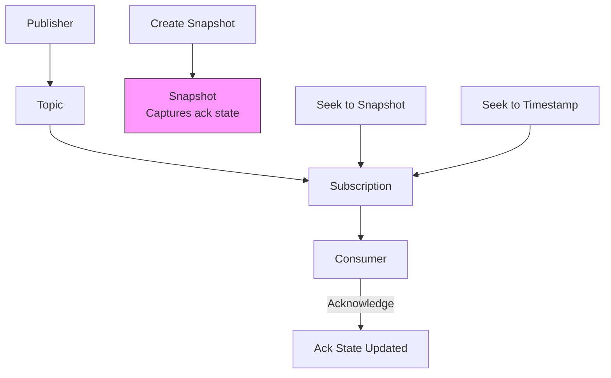
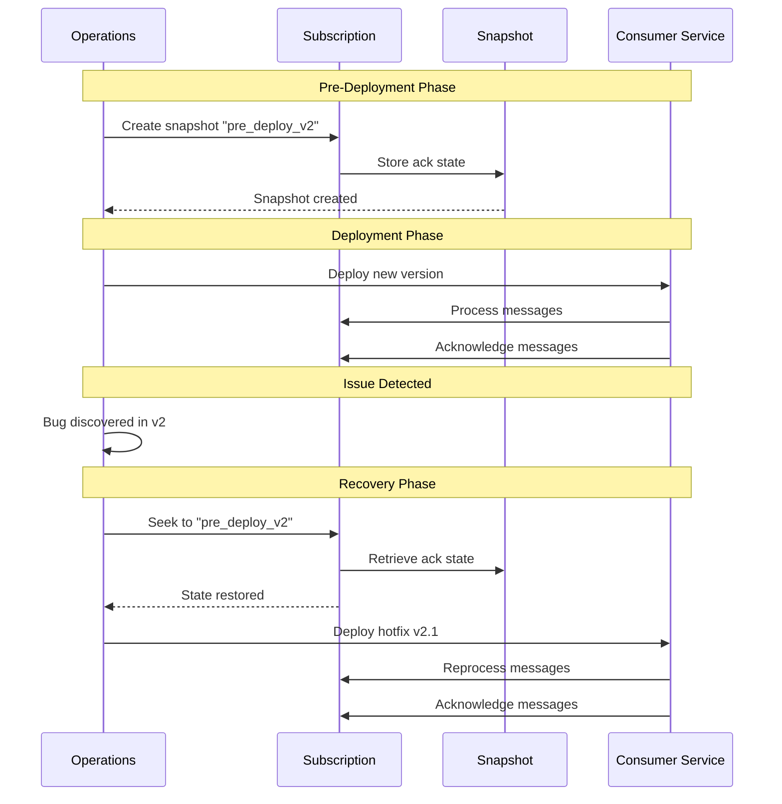

# How to Implement Pub/Sub Snapshot and Seek for Replay

Author: [nawazdhandala](https://github.com/nawazdhandala)

Tags: Google Cloud, Pub/Sub, Message Queue, Event Streaming, Snapshots, Replay, Disaster Recovery, Python, Node.js

Description: Learn how to implement Google Cloud Pub/Sub snapshot and seek functionality for message replay. Covers creating snapshots, seeking to timestamps or snapshots, recovery strategies, and production best practices.

---

Message replay is a critical capability for event-driven systems. When downstream services fail, bugs are discovered in processing logic, or audit requirements demand reprocessing, you need the ability to replay messages from a specific point in time. Google Cloud Pub/Sub provides snapshot and seek functionality to address these scenarios without requiring custom infrastructure or message storage.

## Why Snapshot and Seek Matter

| Scenario | Without Snapshot/Seek | With Snapshot/Seek |
|----------|----------------------|-------------------|
| Bug in consumer logic | Lost messages, manual recovery | Seek back and reprocess |
| Downstream outage | Messages acknowledged but not processed | Seek to pre-outage point |
| New service deployment | Starts from current messages only | Replay historical messages |
| Audit and compliance | External message storage required | Native replay capability |

## Understanding Snapshots and Seek

Pub/Sub snapshots capture the acknowledgment state of a subscription at a specific moment. When you create a snapshot, Pub/Sub records which messages have been acknowledged and which are still pending. Seeking allows you to reset the subscription state to a snapshot or a specific timestamp, effectively "rewinding" message delivery.



## Key Concepts

Before diving into implementation, understanding these concepts will help you use snapshots effectively.

**Acknowledgment State**: Pub/Sub tracks which messages have been acknowledged by subscribers. A snapshot preserves this state at a point in time.

**Message Retention**: Topics retain messages for a configurable period (default 7 days, max 31 days). Snapshots can only replay messages within this retention window.

**Seek Operations**: Seeking resets the acknowledgment state, causing previously acknowledged messages to be redelivered. All pending messages are also dropped.

**Snapshot Expiration**: Snapshots expire after 7 days by default but can retain messages for up to 7 days beyond the oldest unacknowledged message.

## Creating Snapshots with Python

The following Python code demonstrates how to create a snapshot of a subscription's current state. Snapshots should be created before deployments, at regular intervals, or before risky operations.

```python
from google.cloud import pubsub_v1
from google.api_core import exceptions
import datetime

def create_snapshot(
    project_id: str,
    subscription_id: str,
    snapshot_id: str
) -> str:
    """
    Create a snapshot of a subscription's current acknowledgment state.

    Args:
        project_id: Google Cloud project ID
        subscription_id: Name of the subscription to snapshot
        snapshot_id: Name for the new snapshot

    Returns:
        The full snapshot path
    """
    # Initialize the subscriber client
    subscriber = pubsub_v1.SubscriberClient()

    # Construct the full resource paths
    subscription_path = subscriber.subscription_path(project_id, subscription_id)
    snapshot_path = subscriber.snapshot_path(project_id, snapshot_id)

    try:
        # Create the snapshot capturing current ack state
        snapshot = subscriber.create_snapshot(
            request={
                "name": snapshot_path,
                "subscription": subscription_path,
                # Optional: Add labels for organization
                "labels": {
                    "created_by": "automated_backup",
                    "environment": "production"
                }
            }
        )

        print(f"Snapshot created: {snapshot.name}")
        print(f"Expiration time: {snapshot.expire_time}")

        return snapshot.name

    except exceptions.AlreadyExists:
        print(f"Snapshot {snapshot_id} already exists")
        return snapshot_path

    except exceptions.NotFound:
        print(f"Subscription {subscription_id} not found")
        raise

    finally:
        subscriber.close()


def create_timestamped_snapshot(project_id: str, subscription_id: str) -> str:
    """
    Create a snapshot with a timestamp-based name for easy identification.
    Useful for automated snapshot creation.
    """
    # Generate a unique snapshot name using current timestamp
    timestamp = datetime.datetime.now().strftime("%Y%m%d_%H%M%S")
    snapshot_id = f"{subscription_id}_snapshot_{timestamp}"

    return create_snapshot(project_id, subscription_id, snapshot_id)


# Example usage
if __name__ == "__main__":
    PROJECT_ID = "my-project"
    SUBSCRIPTION_ID = "orders-subscription"

    # Create a named snapshot before deployment
    snapshot_path = create_snapshot(
        PROJECT_ID,
        SUBSCRIPTION_ID,
        "pre_deployment_v2_5_0"
    )

    # Or create an automated timestamped snapshot
    automated_snapshot = create_timestamped_snapshot(
        PROJECT_ID,
        SUBSCRIPTION_ID
    )
```

## Seeking to a Snapshot

After creating a snapshot, you can seek the subscription back to that point to replay messages. Seeking resets the acknowledgment state, causing all messages published after the snapshot to be redelivered.

```python
from google.cloud import pubsub_v1
from google.api_core import exceptions
from google.protobuf import timestamp_pb2
import datetime

def seek_to_snapshot(
    project_id: str,
    subscription_id: str,
    snapshot_id: str
) -> None:
    """
    Seek a subscription to a previously created snapshot.
    All messages acknowledged after the snapshot will be redelivered.

    Args:
        project_id: Google Cloud project ID
        subscription_id: Name of the subscription
        snapshot_id: Name of the snapshot to seek to
    """
    subscriber = pubsub_v1.SubscriberClient()

    subscription_path = subscriber.subscription_path(project_id, subscription_id)
    snapshot_path = subscriber.snapshot_path(project_id, snapshot_id)

    try:
        # Seek to the snapshot - this resets ack state
        subscriber.seek(
            request={
                "subscription": subscription_path,
                "snapshot": snapshot_path
            }
        )

        print(f"Successfully seeked {subscription_id} to snapshot {snapshot_id}")
        print("Messages acknowledged after the snapshot will be redelivered")

    except exceptions.NotFound as e:
        print(f"Resource not found: {e}")
        raise

    except exceptions.FailedPrecondition as e:
        # Snapshot may have expired or be from a different subscription
        print(f"Seek failed - precondition error: {e}")
        raise

    finally:
        subscriber.close()


def seek_to_timestamp(
    project_id: str,
    subscription_id: str,
    target_time: datetime.datetime
) -> None:
    """
    Seek a subscription to a specific timestamp.
    Messages published after this time will be redelivered.

    Args:
        project_id: Google Cloud project ID
        subscription_id: Name of the subscription
        target_time: The timestamp to seek to (must be within retention period)
    """
    subscriber = pubsub_v1.SubscriberClient()

    subscription_path = subscriber.subscription_path(project_id, subscription_id)

    # Convert datetime to protobuf Timestamp
    timestamp = timestamp_pb2.Timestamp()
    timestamp.FromDatetime(target_time)

    try:
        # Seek to the timestamp
        subscriber.seek(
            request={
                "subscription": subscription_path,
                "time": timestamp
            }
        )

        print(f"Successfully seeked {subscription_id} to {target_time}")
        print("Messages published after this time will be redelivered")

    except exceptions.InvalidArgument as e:
        # Timestamp may be outside the retention window
        print(f"Invalid timestamp: {e}")
        raise

    finally:
        subscriber.close()


# Example usage
if __name__ == "__main__":
    PROJECT_ID = "my-project"
    SUBSCRIPTION_ID = "orders-subscription"

    # Seek to a named snapshot after discovering a bug
    seek_to_snapshot(
        PROJECT_ID,
        SUBSCRIPTION_ID,
        "pre_deployment_v2_5_0"
    )

    # Or seek to a specific timestamp (e.g., 2 hours ago)
    two_hours_ago = datetime.datetime.now(datetime.timezone.utc) - datetime.timedelta(hours=2)
    seek_to_timestamp(
        PROJECT_ID,
        SUBSCRIPTION_ID,
        two_hours_ago
    )
```

## Node.js Implementation

For Node.js applications, the Google Cloud Pub/Sub client library provides similar functionality for snapshot and seek operations.

```javascript
const { PubSub } = require('@google-cloud/pubsub');

// Initialize the Pub/Sub client
const pubsub = new PubSub();

/**
 * Create a snapshot of a subscription's current state
 * @param {string} subscriptionName - Name of the subscription
 * @param {string} snapshotName - Name for the new snapshot
 * @returns {Promise<object>} - The created snapshot metadata
 */
async function createSnapshot(subscriptionName, snapshotName) {
  const subscription = pubsub.subscription(subscriptionName);

  try {
    // Create the snapshot with optional labels
    const [snapshot] = await subscription.createSnapshot(snapshotName, {
      labels: {
        created_by: 'automated_backup',
        environment: process.env.NODE_ENV || 'development'
      }
    });

    console.log(`Snapshot ${snapshot.name} created`);

    // Get snapshot metadata
    const [metadata] = await snapshot.getMetadata();
    console.log(`Expiration: ${metadata.expireTime}`);
    console.log(`Topic: ${metadata.topic}`);

    return metadata;

  } catch (error) {
    if (error.code === 6) {
      // ALREADY_EXISTS
      console.log(`Snapshot ${snapshotName} already exists`);
      return pubsub.snapshot(snapshotName);
    }
    throw error;
  }
}

/**
 * Seek a subscription to a previously created snapshot
 * @param {string} subscriptionName - Name of the subscription
 * @param {string} snapshotName - Name of the snapshot to seek to
 */
async function seekToSnapshot(subscriptionName, snapshotName) {
  const subscription = pubsub.subscription(subscriptionName);
  const snapshot = pubsub.snapshot(snapshotName);

  try {
    await subscription.seek(snapshot);
    console.log(`Subscription ${subscriptionName} seeked to snapshot ${snapshotName}`);
    console.log('Messages acknowledged after the snapshot will be redelivered');

  } catch (error) {
    if (error.code === 5) {
      // NOT_FOUND
      console.error('Snapshot or subscription not found');
    } else if (error.code === 9) {
      // FAILED_PRECONDITION
      console.error('Snapshot may have expired or belongs to different subscription');
    }
    throw error;
  }
}

/**
 * Seek a subscription to a specific timestamp
 * @param {string} subscriptionName - Name of the subscription
 * @param {Date} targetTime - The timestamp to seek to
 */
async function seekToTimestamp(subscriptionName, targetTime) {
  const subscription = pubsub.subscription(subscriptionName);

  try {
    await subscription.seek(targetTime);
    console.log(`Subscription ${subscriptionName} seeked to ${targetTime.toISOString()}`);
    console.log('Messages published after this time will be redelivered');

  } catch (error) {
    if (error.code === 3) {
      // INVALID_ARGUMENT
      console.error('Timestamp is outside the message retention window');
    }
    throw error;
  }
}

/**
 * Create a timestamped snapshot for automated backups
 * @param {string} subscriptionName - Name of the subscription
 * @returns {Promise<object>} - The created snapshot metadata
 */
async function createTimestampedSnapshot(subscriptionName) {
  const timestamp = new Date().toISOString()
    .replace(/[:.]/g, '-')
    .replace('T', '_')
    .slice(0, 19);

  const snapshotName = `${subscriptionName}_snapshot_${timestamp}`;

  return createSnapshot(subscriptionName, snapshotName);
}

// Example usage with async/await
async function main() {
  const SUBSCRIPTION_NAME = 'orders-subscription';

  // Create a pre-deployment snapshot
  await createSnapshot(SUBSCRIPTION_NAME, 'pre_deployment_v2_5_0');

  // Simulate processing messages...
  console.log('Processing messages...');

  // If something goes wrong, seek back to the snapshot
  await seekToSnapshot(SUBSCRIPTION_NAME, 'pre_deployment_v2_5_0');

  // Or seek to a specific time (2 hours ago)
  const twoHoursAgo = new Date(Date.now() - 2 * 60 * 60 * 1000);
  await seekToTimestamp(SUBSCRIPTION_NAME, twoHoursAgo);
}

main().catch(console.error);
```

## Snapshot and Seek Workflow

The following diagram illustrates a typical workflow for using snapshots during deployments and recovery scenarios.



## Automated Snapshot Management

Production systems benefit from automated snapshot creation and cleanup. The following implementation provides a snapshot management class that handles lifecycle operations.

```python
from google.cloud import pubsub_v1
from google.api_core import exceptions
import datetime
from typing import List, Optional
import logging

logging.basicConfig(level=logging.INFO)
logger = logging.getLogger(__name__)


class SnapshotManager:
    """
    Manages Pub/Sub snapshots with automated creation and cleanup.
    """

    def __init__(self, project_id: str):
        self.project_id = project_id
        self.subscriber = pubsub_v1.SubscriberClient()

    def __enter__(self):
        return self

    def __exit__(self, exc_type, exc_val, exc_tb):
        self.subscriber.close()

    def create_snapshot(
        self,
        subscription_id: str,
        snapshot_id: Optional[str] = None,
        labels: Optional[dict] = None
    ) -> str:
        """Create a new snapshot with optional custom naming and labels."""

        # Generate timestamp-based name if not provided
        if snapshot_id is None:
            timestamp = datetime.datetime.now().strftime("%Y%m%d_%H%M%S")
            snapshot_id = f"{subscription_id}_snap_{timestamp}"

        subscription_path = self.subscriber.subscription_path(
            self.project_id, subscription_id
        )
        snapshot_path = self.subscriber.snapshot_path(
            self.project_id, snapshot_id
        )

        # Merge default labels with provided labels
        default_labels = {
            "subscription": subscription_id,
            "created_at": datetime.datetime.now().isoformat()
        }
        if labels:
            default_labels.update(labels)

        snapshot = self.subscriber.create_snapshot(
            request={
                "name": snapshot_path,
                "subscription": subscription_path,
                "labels": default_labels
            }
        )

        logger.info(f"Created snapshot: {snapshot.name}")
        return snapshot.name

    def list_snapshots(self, subscription_id: Optional[str] = None) -> List[dict]:
        """List all snapshots, optionally filtered by subscription."""

        project_path = f"projects/{self.project_id}"
        snapshots = []

        for snapshot in self.subscriber.list_snapshots(
            request={"project": project_path}
        ):
            # Extract subscription name from the topic
            snap_info = {
                "name": snapshot.name,
                "topic": snapshot.topic,
                "expire_time": snapshot.expire_time,
                "labels": dict(snapshot.labels)
            }

            # Filter by subscription if specified
            if subscription_id:
                if snapshot.labels.get("subscription") == subscription_id:
                    snapshots.append(snap_info)
            else:
                snapshots.append(snap_info)

        return snapshots

    def delete_snapshot(self, snapshot_id: str) -> None:
        """Delete a specific snapshot."""

        snapshot_path = self.subscriber.snapshot_path(
            self.project_id, snapshot_id
        )

        try:
            self.subscriber.delete_snapshot(
                request={"snapshot": snapshot_path}
            )
            logger.info(f"Deleted snapshot: {snapshot_id}")

        except exceptions.NotFound:
            logger.warning(f"Snapshot not found: {snapshot_id}")

    def cleanup_old_snapshots(
        self,
        subscription_id: str,
        keep_count: int = 5
    ) -> int:
        """
        Delete old snapshots, keeping only the most recent ones.

        Args:
            subscription_id: Filter snapshots by subscription
            keep_count: Number of recent snapshots to retain

        Returns:
            Number of snapshots deleted
        """
        snapshots = self.list_snapshots(subscription_id)

        # Sort by expiration time (oldest first)
        snapshots.sort(key=lambda s: s["expire_time"])

        # Calculate how many to delete
        delete_count = max(0, len(snapshots) - keep_count)

        deleted = 0
        for snapshot in snapshots[:delete_count]:
            # Extract snapshot ID from full path
            snapshot_id = snapshot["name"].split("/")[-1]
            self.delete_snapshot(snapshot_id)
            deleted += 1

        logger.info(
            f"Cleanup complete: deleted {deleted} snapshots, "
            f"retained {len(snapshots) - deleted}"
        )

        return deleted

    def seek_to_snapshot(
        self,
        subscription_id: str,
        snapshot_id: str
    ) -> None:
        """Seek a subscription to a snapshot."""

        subscription_path = self.subscriber.subscription_path(
            self.project_id, subscription_id
        )
        snapshot_path = self.subscriber.snapshot_path(
            self.project_id, snapshot_id
        )

        self.subscriber.seek(
            request={
                "subscription": subscription_path,
                "snapshot": snapshot_path
            }
        )

        logger.info(f"Seeked {subscription_id} to snapshot {snapshot_id}")

    def seek_to_timestamp(
        self,
        subscription_id: str,
        target_time: datetime.datetime
    ) -> None:
        """Seek a subscription to a specific timestamp."""

        subscription_path = self.subscriber.subscription_path(
            self.project_id, subscription_id
        )

        from google.protobuf import timestamp_pb2
        timestamp = timestamp_pb2.Timestamp()
        timestamp.FromDatetime(target_time)

        self.subscriber.seek(
            request={
                "subscription": subscription_path,
                "time": timestamp
            }
        )

        logger.info(f"Seeked {subscription_id} to {target_time}")


# Example usage with context manager
def deployment_workflow():
    PROJECT_ID = "my-project"
    SUBSCRIPTION_ID = "orders-subscription"

    with SnapshotManager(PROJECT_ID) as manager:
        # Create pre-deployment snapshot
        snapshot_name = manager.create_snapshot(
            SUBSCRIPTION_ID,
            snapshot_id="pre_deploy_v2_5_0",
            labels={
                "deployment": "v2.5.0",
                "created_by": "ci_pipeline"
            }
        )

        # Clean up old snapshots, keeping the 5 most recent
        manager.cleanup_old_snapshots(SUBSCRIPTION_ID, keep_count=5)

        # If deployment fails, seek back to the snapshot
        # manager.seek_to_snapshot(SUBSCRIPTION_ID, "pre_deploy_v2_5_0")


if __name__ == "__main__":
    deployment_workflow()
```

## Recovery Scenarios

The following diagram shows different recovery scenarios and how snapshot/seek can address them.

```mermaid
flowchart TD
    subgraph Scenario1[Bug in Consumer Logic]
        A1[Messages processed<br/>with bug] --> B1[Create hotfix]
        B1 --> C1[Seek to pre-bug<br/>snapshot]
        C1 --> D1[Deploy hotfix]
        D1 --> E1[Reprocess messages<br/>correctly]
    end

    subgraph Scenario2[Downstream Outage]
        A2[Messages acked but<br/>not persisted] --> B2[Downstream service<br/>recovers]
        B2 --> C2[Seek to timestamp<br/>before outage]
        C2 --> D2[Reprocess failed<br/>messages]
    end

    subgraph Scenario3[New Service Onboarding]
        A3[New analytics<br/>service deployed] --> B3[Seek to beginning<br/>of retention]
        B3 --> C3[Backfill historical<br/>data]
    end
```



## Handling Idempotency During Replay

When replaying messages, your consumers must handle duplicates gracefully. Implement idempotency checks to prevent duplicate processing.

```python
import hashlib
import json
from typing import Optional
import redis

class IdempotentConsumer:
    """
    Consumer wrapper that ensures idempotent message processing.
    Uses Redis to track processed message IDs.
    """

    def __init__(
        self,
        redis_client: redis.Redis,
        key_prefix: str = "pubsub_processed",
        ttl_seconds: int = 86400 * 7  # 7 days to match retention
    ):
        self.redis = redis_client
        self.key_prefix = key_prefix
        self.ttl_seconds = ttl_seconds

    def _generate_message_id(self, message) -> str:
        """
        Generate a unique ID for the message.
        Uses message_id from Pub/Sub or falls back to content hash.
        """
        # Pub/Sub provides a unique message_id
        if hasattr(message, 'message_id') and message.message_id:
            return message.message_id

        # Fallback: hash the message content
        content = message.data.decode('utf-8') if message.data else ''
        return hashlib.sha256(content.encode()).hexdigest()

    def _get_redis_key(self, message_id: str) -> str:
        """Generate the Redis key for tracking processed messages."""
        return f"{self.key_prefix}:{message_id}"

    def is_processed(self, message) -> bool:
        """Check if a message has already been processed."""
        message_id = self._generate_message_id(message)
        key = self._get_redis_key(message_id)
        return self.redis.exists(key) > 0

    def mark_processed(
        self,
        message,
        metadata: Optional[dict] = None
    ) -> None:
        """Mark a message as successfully processed."""
        message_id = self._generate_message_id(message)
        key = self._get_redis_key(message_id)

        # Store processing metadata
        value = json.dumps({
            "processed_at": datetime.datetime.now().isoformat(),
            "message_id": message_id,
            **(metadata or {})
        })

        self.redis.setex(key, self.ttl_seconds, value)

    def process_message(self, message, handler_func) -> bool:
        """
        Process a message with idempotency checks.

        Args:
            message: The Pub/Sub message
            handler_func: Function to process the message

        Returns:
            True if message was processed, False if skipped (duplicate)
        """
        # Check for duplicate
        if self.is_processed(message):
            logger.info(
                f"Skipping duplicate message: {self._generate_message_id(message)}"
            )
            return False

        try:
            # Process the message
            result = handler_func(message)

            # Mark as processed only after successful handling
            self.mark_processed(message, {"result": str(result)})

            return True

        except Exception as e:
            # Do not mark as processed - allow retry
            logger.error(f"Error processing message: {e}")
            raise


# Usage example with Pub/Sub subscriber
from google.cloud import pubsub_v1
import redis

def create_idempotent_subscriber():
    PROJECT_ID = "my-project"
    SUBSCRIPTION_ID = "orders-subscription"

    # Initialize Redis client for idempotency tracking
    redis_client = redis.Redis(host='localhost', port=6379, db=0)
    idempotent_consumer = IdempotentConsumer(redis_client)

    subscriber = pubsub_v1.SubscriberClient()
    subscription_path = subscriber.subscription_path(PROJECT_ID, SUBSCRIPTION_ID)

    def callback(message):
        """Callback that processes messages idempotently."""

        def process_order(msg):
            # Actual business logic here
            order_data = json.loads(msg.data.decode('utf-8'))
            logger.info(f"Processing order: {order_data.get('order_id')}")
            # Process the order...
            return order_data.get('order_id')

        try:
            # Process with idempotency check
            was_processed = idempotent_consumer.process_message(
                message, process_order
            )

            if was_processed:
                logger.info("Message processed successfully")
            else:
                logger.info("Duplicate message skipped")

            # Always acknowledge - either processed or duplicate
            message.ack()

        except Exception as e:
            logger.error(f"Processing failed: {e}")
            # Negative ack to retry later
            message.nack()

    # Start streaming pull
    streaming_pull = subscriber.subscribe(subscription_path, callback=callback)

    logger.info(f"Listening for messages on {subscription_path}")

    try:
        streaming_pull.result()
    except KeyboardInterrupt:
        streaming_pull.cancel()
        streaming_pull.result()
```

## CI/CD Integration

Integrate snapshot creation into your deployment pipeline to ensure safe rollbacks are always possible.

```yaml
# GitHub Actions workflow for deployment with Pub/Sub snapshots
name: Deploy with Snapshot

on:
  push:
    branches: [main]

env:
  PROJECT_ID: my-project
  SUBSCRIPTION_ID: orders-subscription

jobs:
  deploy:
    runs-on: ubuntu-latest

    steps:
      - name: Checkout code
        uses: actions/checkout@v4

      - name: Authenticate to Google Cloud
        uses: google-github-actions/auth@v2
        with:
          credentials_json: ${{ secrets.GCP_SA_KEY }}

      - name: Set up Cloud SDK
        uses: google-github-actions/setup-gcloud@v2

      - name: Create pre-deployment snapshot
        id: snapshot
        run: |
          SNAPSHOT_NAME="${{ env.SUBSCRIPTION_ID }}_pre_deploy_${{ github.sha }}"
          gcloud pubsub snapshots create $SNAPSHOT_NAME \
            --subscription=${{ env.SUBSCRIPTION_ID }} \
            --labels="commit=${{ github.sha }},pipeline=${{ github.run_id }}"
          echo "snapshot_name=$SNAPSHOT_NAME" >> $GITHUB_OUTPUT

      - name: Deploy application
        run: |
          # Your deployment commands here
          kubectl apply -f k8s/
          kubectl rollout status deployment/order-service

      - name: Run smoke tests
        id: smoke_tests
        run: |
          # Run integration tests
          npm run test:smoke

      - name: Rollback on failure
        if: failure() && steps.smoke_tests.outcome == 'failure'
        run: |
          echo "Smoke tests failed, seeking to pre-deployment snapshot"
          gcloud pubsub subscriptions seek ${{ env.SUBSCRIPTION_ID }} \
            --snapshot=${{ steps.snapshot.outputs.snapshot_name }}
          kubectl rollout undo deployment/order-service

      - name: Cleanup old snapshots
        if: success()
        run: |
          # Keep only the 10 most recent snapshots
          SNAPSHOTS=$(gcloud pubsub snapshots list \
            --filter="labels.subscription=${{ env.SUBSCRIPTION_ID }}" \
            --sort-by="~expireTime" \
            --format="value(name)" | tail -n +11)

          for SNAPSHOT in $SNAPSHOTS; do
            echo "Deleting old snapshot: $SNAPSHOT"
            gcloud pubsub snapshots delete $SNAPSHOT --quiet
          done
```

## Monitoring and Alerting

Set up monitoring to track snapshot operations and alert on potential issues.

```python
from google.cloud import monitoring_v3
from google.cloud import pubsub_v1
import time

class SnapshotMonitor:
    """
    Monitor Pub/Sub subscription metrics relevant to snapshot/seek operations.
    """

    def __init__(self, project_id: str):
        self.project_id = project_id
        self.monitoring_client = monitoring_v3.MetricServiceClient()
        self.project_name = f"projects/{project_id}"

    def get_unacked_message_count(self, subscription_id: str) -> int:
        """Get the count of unacknowledged messages in a subscription."""

        interval = monitoring_v3.TimeInterval(
            end_time={"seconds": int(time.time())},
            start_time={"seconds": int(time.time()) - 300}  # Last 5 minutes
        )

        results = self.monitoring_client.list_time_series(
            request={
                "name": self.project_name,
                "filter": f'''
                    metric.type="pubsub.googleapis.com/subscription/num_undelivered_messages"
                    AND resource.labels.subscription_id="{subscription_id}"
                ''',
                "interval": interval,
                "view": monitoring_v3.ListTimeSeriesRequest.TimeSeriesView.FULL
            }
        )

        for result in results:
            if result.points:
                return result.points[0].value.int64_value

        return 0

    def get_oldest_unacked_message_age(self, subscription_id: str) -> float:
        """Get the age in seconds of the oldest unacknowledged message."""

        interval = monitoring_v3.TimeInterval(
            end_time={"seconds": int(time.time())},
            start_time={"seconds": int(time.time()) - 300}
        )

        results = self.monitoring_client.list_time_series(
            request={
                "name": self.project_name,
                "filter": f'''
                    metric.type="pubsub.googleapis.com/subscription/oldest_unacked_message_age"
                    AND resource.labels.subscription_id="{subscription_id}"
                ''',
                "interval": interval,
                "view": monitoring_v3.ListTimeSeriesRequest.TimeSeriesView.FULL
            }
        )

        for result in results:
            if result.points:
                return result.points[0].value.double_value

        return 0.0

    def check_snapshot_health(self, subscription_id: str) -> dict:
        """
        Check if conditions are favorable for creating a snapshot.

        Returns a health report with recommendations.
        """
        unacked_count = self.get_unacked_message_count(subscription_id)
        oldest_age = self.get_oldest_unacked_message_age(subscription_id)

        health = {
            "subscription": subscription_id,
            "unacked_messages": unacked_count,
            "oldest_message_age_seconds": oldest_age,
            "healthy": True,
            "warnings": []
        }

        # Check for concerning conditions
        if unacked_count > 10000:
            health["warnings"].append(
                f"High unacked message count: {unacked_count}"
            )
            health["healthy"] = False

        if oldest_age > 3600:  # More than 1 hour
            health["warnings"].append(
                f"Old unacked messages: {oldest_age/3600:.1f} hours"
            )

        # Approaching retention limit (7 days = 604800 seconds)
        if oldest_age > 518400:  # 6 days
            health["warnings"].append(
                "Messages approaching retention limit - create snapshot soon"
            )
            health["healthy"] = False

        return health


# Usage example
def pre_deployment_check():
    PROJECT_ID = "my-project"
    SUBSCRIPTION_ID = "orders-subscription"

    monitor = SnapshotMonitor(PROJECT_ID)
    health = monitor.check_snapshot_health(SUBSCRIPTION_ID)

    print(f"Subscription health check: {SUBSCRIPTION_ID}")
    print(f"  Unacked messages: {health['unacked_messages']}")
    print(f"  Oldest message age: {health['oldest_message_age_seconds']:.0f}s")

    if health["warnings"]:
        print("  Warnings:")
        for warning in health["warnings"]:
            print(f"    - {warning}")

    if not health["healthy"]:
        print("  Status: UNHEALTHY - address warnings before proceeding")
        return False
    else:
        print("  Status: HEALTHY - safe to create snapshot")
        return True
```

## Best Practices

| Practice | Description |
|----------|-------------|
| **Create snapshots before deployments** | Always snapshot before releasing new consumer code |
| **Use descriptive snapshot names** | Include version numbers, timestamps, or ticket IDs |
| **Implement idempotent consumers** | Ensure message replay does not cause duplicate side effects |
| **Configure adequate retention** | Set topic retention to cover your recovery window needs |
| **Automate snapshot cleanup** | Delete old snapshots to avoid hitting quota limits |
| **Monitor subscription lag** | High lag may indicate need for immediate snapshot |
| **Test seek operations** | Include snapshot/seek in disaster recovery drills |
| **Document recovery procedures** | Maintain runbooks for common replay scenarios |

## Limitations and Considerations

Understanding the limitations helps you design systems that work effectively with snapshot and seek.

**Retention Window**: You can only seek within the message retention period. Messages older than the retention window cannot be replayed.

**Snapshot Quota**: Each project has limits on the number of snapshots. Plan your snapshot retention strategy accordingly.

**Cross-Subscription Seek**: A snapshot can only be used with the subscription it was created from.

**Consumer Coordination**: When seeking, all consumers of the subscription will receive replayed messages. Coordinate with all consuming services.

**Ordering Impact**: Seeking may affect message ordering guarantees. Messages may be delivered in a different order during replay.

## Summary

Google Cloud Pub/Sub snapshot and seek functionality provides a powerful mechanism for message replay without requiring external storage or complex infrastructure. By creating snapshots before deployments, implementing idempotent consumers, and integrating snapshot management into your CI/CD pipeline, you can build resilient event-driven systems with robust recovery capabilities. Key takeaways include always creating pre-deployment snapshots, implementing idempotency to handle replays gracefully, automating snapshot lifecycle management, and monitoring subscription health to anticipate recovery needs.
