# How to Subscribe and Receive Messages from Pub/Sub

Author: [nawazdhandala](https://github.com/nawazdhandala)

Tags: Pub/Sub, Google Cloud, Messaging, Event-Driven Architecture, Node.js, Python, Distributed Systems

Description: Learn how to subscribe and receive messages from Google Cloud Pub/Sub with practical examples in Node.js and Python. Covers pull and push subscriptions, message acknowledgment, flow control, and best practices for building reliable event-driven systems.

---

Google Cloud Pub/Sub provides a reliable, scalable messaging service for building event-driven architectures. Subscribers receive messages asynchronously from topics, enabling loose coupling between services and supporting various messaging patterns like fan-out, work queues, and event streaming.

## Understanding Pub/Sub Architecture

Pub/Sub separates message publishers from subscribers through topics and subscriptions. Publishers send messages to topics, and subscribers receive messages through subscriptions attached to those topics. Each subscription independently tracks message delivery and acknowledgment.


## Subscription Types

Pub/Sub offers two delivery mechanisms for receiving messages, each suited to different use cases.

| Type | Description | Best For |
|------|-------------|----------|
| Pull | Subscriber requests messages from Pub/Sub | Long-running processes, batch processing, controlled consumption |
| Push | Pub/Sub delivers messages to an HTTPS endpoint | Serverless functions, webhooks, event-driven microservices |

## Setting Up Your Environment

Before subscribing to messages, configure your Google Cloud credentials and install the required client library.

```bash
# Set up authentication with Google Cloud
export GOOGLE_APPLICATION_CREDENTIALS="/path/to/service-account-key.json"

# Install the Pub/Sub client library for Node.js
npm install @google-cloud/pubsub

# Or for Python
pip install google-cloud-pubsub
```

## Creating a Subscription

Subscriptions must be created before you can receive messages. You can create them using the Cloud Console, gcloud CLI, or programmatically.

Creating a subscription with gcloud CLI provides a quick way to set up message delivery.

```bash
# Create a pull subscription
gcloud pubsub subscriptions create my-subscription \
    --topic=my-topic \
    --ack-deadline=60 \
    --message-retention-duration=7d

# Create a push subscription
gcloud pubsub subscriptions create my-push-subscription \
    --topic=my-topic \
    --push-endpoint=https://example.com/push-handler \
    --ack-deadline=60
```

## Basic Pull Subscription in Node.js

Pull subscriptions give you complete control over when and how messages are received. Your application explicitly requests messages from Pub/Sub.

```javascript
// Import the Pub/Sub client library
const { PubSub } = require('@google-cloud/pubsub');

// Create a client instance with your project ID
const pubsub = new PubSub({ projectId: 'your-project-id' });

async function pullMessages() {
    // Get a reference to your subscription
    const subscription = pubsub.subscription('my-subscription');

    // Set up the message handler that processes each received message
    const messageHandler = (message) => {
        // Extract message data - Pub/Sub delivers data as a Buffer
        const data = message.data.toString();

        // Access message attributes for metadata
        const attributes = message.attributes;

        console.log(`Received message ${message.id}:`);
        console.log(`  Data: ${data}`);
        console.log(`  Attributes: ${JSON.stringify(attributes)}`);
        console.log(`  Published at: ${message.publishTime}`);

        // Acknowledge the message to prevent redelivery
        // Only acknowledge after successful processing
        message.ack();
    };

    // Set up error handler for subscription-level errors
    const errorHandler = (error) => {
        console.error('Subscription error:', error);
    };

    // Register the handlers with the subscription
    subscription.on('message', messageHandler);
    subscription.on('error', errorHandler);

    console.log('Listening for messages...');

    // Keep the process running
    // In production, implement proper shutdown handling
}

pullMessages().catch(console.error);
```

## Basic Pull Subscription in Python

Python applications can receive messages using the synchronous or asynchronous streaming pull API.

```python
from google.cloud import pubsub_v1
from concurrent.futures import TimeoutError
import json

# Create a subscriber client
subscriber = pubsub_v1.SubscriberClient()

# Build the subscription path from project and subscription name
subscription_path = subscriber.subscription_path(
    'your-project-id',
    'my-subscription'
)

def callback(message: pubsub_v1.subscriber.message.Message) -> None:
    """
    Process received Pub/Sub messages.

    Args:
        message: The received Pub/Sub message containing data and metadata.
    """
    # Decode the message data from bytes to string
    data = message.data.decode('utf-8')

    # Parse JSON data if your messages use JSON format
    try:
        payload = json.loads(data)
        print(f"Received JSON payload: {payload}")
    except json.JSONDecodeError:
        print(f"Received raw data: {data}")

    # Access message attributes
    print(f"Message ID: {message.message_id}")
    print(f"Publish time: {message.publish_time}")
    print(f"Attributes: {dict(message.attributes)}")

    # Acknowledge the message after successful processing
    # Unacknowledged messages will be redelivered after the ack deadline
    message.ack()


def subscribe_with_streaming_pull():
    """Subscribe to messages using streaming pull."""

    # Start receiving messages asynchronously
    streaming_pull_future = subscriber.subscribe(
        subscription_path,
        callback=callback
    )

    print(f"Listening for messages on {subscription_path}...")

    # Keep the main thread alive while processing messages
    try:
        # Block indefinitely, or set a timeout in seconds
        streaming_pull_future.result()
    except TimeoutError:
        streaming_pull_future.cancel()
        # Wait for the pull to terminate gracefully
        streaming_pull_future.result()
    except KeyboardInterrupt:
        streaming_pull_future.cancel()
        print("Subscription cancelled by user")


if __name__ == '__main__':
    subscribe_with_streaming_pull()
```

## Message Acknowledgment Patterns

Proper acknowledgment handling ensures messages are processed exactly once and prevents message loss or duplicate processing.


Implementing proper acknowledgment with error handling prevents message loss during failures.

```javascript
const { PubSub } = require('@google-cloud/pubsub');

const pubsub = new PubSub();
const subscription = pubsub.subscription('my-subscription');

async function processWithAcknowledgment() {
    const messageHandler = async (message) => {
        console.log(`Processing message ${message.id}`);

        try {
            // Attempt to process the message
            await processMessage(message.data.toString());

            // Only acknowledge after successful processing
            message.ack();
            console.log(`Message ${message.id} acknowledged`);

        } catch (error) {
            console.error(`Failed to process message ${message.id}:`, error);

            // Negative acknowledgment triggers immediate redelivery
            // Use this for transient errors that might succeed on retry
            message.nack();
            console.log(`Message ${message.id} nacked for redelivery`);
        }
    };

    subscription.on('message', messageHandler);
}

async function processMessage(data) {
    // Implement your message processing logic here
    // Throw an error if processing fails
    const payload = JSON.parse(data);

    // Simulate processing
    if (!payload.valid) {
        throw new Error('Invalid payload');
    }

    console.log('Processed payload:', payload);
}

processWithAcknowledgment();
```

## Flow Control Configuration

Flow control prevents your subscriber from being overwhelmed by too many messages. Configure these settings based on your processing capacity and memory constraints.

```javascript
const { PubSub } = require('@google-cloud/pubsub');

const pubsub = new PubSub();

async function subscribeWithFlowControl() {
    // Configure flow control to limit concurrent message processing
    const subscriptionOptions = {
        flowControl: {
            // Maximum number of messages to process simultaneously
            maxMessages: 100,

            // Maximum total size of messages in bytes
            maxBytes: 100 * 1024 * 1024, // 100 MB

            // Allow messages to be processed after subscription is closed
            allowExcessMessages: false
        },

        // Extend ack deadline for long-running processing
        ackDeadline: 60, // seconds

        // Number of connections to Pub/Sub (increase for high throughput)
        streamingOptions: {
            maxStreams: 4
        }
    };

    const subscription = pubsub.subscription(
        'my-subscription',
        subscriptionOptions
    );

    const messageHandler = async (message) => {
        console.log(`Processing message ${message.id}`);

        // Simulate long-running processing
        await longRunningProcess(message);

        message.ack();
    };

    subscription.on('message', messageHandler);
    console.log('Subscribed with flow control enabled');
}

async function longRunningProcess(message) {
    // Simulate processing time
    return new Promise(resolve => setTimeout(resolve, 5000));
}

subscribeWithFlowControl();
```

## Modifying Acknowledgment Deadline

For messages that require extended processing time, modify the ack deadline to prevent premature redelivery.

```python
from google.cloud import pubsub_v1
from google.cloud.pubsub_v1.subscriber.message import Message
import time

subscriber = pubsub_v1.SubscriberClient()
subscription_path = subscriber.subscription_path('your-project-id', 'my-subscription')

def process_with_deadline_extension(message: Message) -> None:
    """
    Process message with deadline extension for long-running tasks.

    Extends the acknowledgment deadline periodically to prevent
    redelivery while processing is still in progress.
    """
    print(f"Starting processing of message {message.message_id}")

    # Track whether message has been acknowledged
    acknowledged = False

    try:
        # Simulate long-running processing in chunks
        for i in range(10):
            # Perform a chunk of work
            time.sleep(6)  # 6 seconds per chunk

            # Extend the deadline by 30 seconds before it expires
            # Default ack deadline is 10 seconds
            message.modify_ack_deadline(30)
            print(f"Extended deadline for message {message.message_id}")

        # Processing complete, acknowledge the message
        message.ack()
        acknowledged = True
        print(f"Message {message.message_id} processed and acknowledged")

    except Exception as e:
        print(f"Error processing message: {e}")

        if not acknowledged:
            # Negative acknowledge for redelivery
            message.nack()


# Configure subscriber with appropriate settings
flow_control = pubsub_v1.types.FlowControl(
    max_messages=10,
    max_bytes=10 * 1024 * 1024  # 10 MB
)

streaming_pull_future = subscriber.subscribe(
    subscription_path,
    callback=process_with_deadline_extension,
    flow_control=flow_control
)

print(f"Listening with deadline extension on {subscription_path}")
streaming_pull_future.result()
```

## Push Subscription Handler

Push subscriptions deliver messages to an HTTPS endpoint. Your application must respond with a success status code to acknowledge the message.

```javascript
const express = require('express');
const app = express();

// Parse JSON request bodies
app.use(express.json());

// Push endpoint must handle POST requests
app.post('/push-handler', async (req, res) => {
    // Pub/Sub sends the message in the request body
    const pubsubMessage = req.body.message;

    if (!pubsubMessage) {
        console.error('No Pub/Sub message received');
        // Return 400 for malformed requests
        return res.status(400).send('No message received');
    }

    try {
        // Decode the message data from base64
        const data = Buffer.from(pubsubMessage.data, 'base64').toString();
        const payload = JSON.parse(data);

        console.log('Received push message:');
        console.log(`  Message ID: ${pubsubMessage.messageId}`);
        console.log(`  Data: ${JSON.stringify(payload)}`);
        console.log(`  Attributes: ${JSON.stringify(pubsubMessage.attributes)}`);

        // Process the message
        await processMessage(payload);

        // Return 200-299 status to acknowledge the message
        // Pub/Sub will not redeliver acknowledged messages
        res.status(200).send('Message processed');

    } catch (error) {
        console.error('Failed to process message:', error);

        // Return 4xx or 5xx to trigger redelivery
        // 4xx: Message is invalid, will still be retried
        // 5xx: Server error, will be retried with backoff
        res.status(500).send('Processing failed');
    }
});

async function processMessage(payload) {
    // Implement your message processing logic
    console.log('Processing payload:', payload);
}

// Start the server
const PORT = process.env.PORT || 8080;
app.listen(PORT, () => {
    console.log(`Push handler listening on port ${PORT}`);
});
```

## Push Subscription with Authentication

Secure your push endpoint by verifying the JWT token sent by Pub/Sub.

```javascript
const express = require('express');
const { OAuth2Client } = require('google-auth-library');

const app = express();
app.use(express.json());

// Initialize the OAuth2 client for token verification
const authClient = new OAuth2Client();

// Your service account email that Pub/Sub uses
const EXPECTED_AUDIENCE = 'https://example.com/push-handler';

async function verifyPubSubToken(req, res, next) {
    // Extract the Bearer token from Authorization header
    const authHeader = req.headers.authorization;

    if (!authHeader || !authHeader.startsWith('Bearer ')) {
        console.error('Missing or invalid Authorization header');
        return res.status(401).send('Unauthorized');
    }

    const token = authHeader.substring(7);

    try {
        // Verify the JWT token
        const ticket = await authClient.verifyIdToken({
            idToken: token,
            audience: EXPECTED_AUDIENCE
        });

        const payload = ticket.getPayload();

        // Verify the token issuer
        if (payload.iss !== 'accounts.google.com' &&
            payload.iss !== 'https://accounts.google.com') {
            throw new Error('Invalid token issuer');
        }

        // Verify the email matches your Pub/Sub service account
        console.log(`Verified token for: ${payload.email}`);

        // Attach verified payload to request for downstream use
        req.pubsubAuth = payload;
        next();

    } catch (error) {
        console.error('Token verification failed:', error);
        res.status(401).send('Unauthorized');
    }
}

// Apply authentication middleware to the push endpoint
app.post('/push-handler', verifyPubSubToken, async (req, res) => {
    const pubsubMessage = req.body.message;

    if (!pubsubMessage) {
        return res.status(400).send('No message received');
    }

    try {
        const data = Buffer.from(pubsubMessage.data, 'base64').toString();
        console.log(`Authenticated message from ${req.pubsubAuth.email}`);
        console.log(`Data: ${data}`);

        // Process the message
        await processMessage(JSON.parse(data));

        res.status(200).send('OK');

    } catch (error) {
        console.error('Processing error:', error);
        res.status(500).send('Error');
    }
});

const PORT = process.env.PORT || 8080;
app.listen(PORT);
```

## Handling Ordered Messages

Pub/Sub supports message ordering using ordering keys. Messages with the same ordering key are delivered in the order they were published.

```mermaid
flowchart TD
    subgraph Publisher
        P[Publish Messages]
    end

    subgraph Topic["Topic with Ordering"]
        M1["Message 1<br/>Key: user-123"]
        M2["Message 2<br/>Key: user-456"]
        M3["Message 3<br/>Key: user-123"]
    end

    subgraph Subscription["Ordered Subscription"]
        Q1["Queue for user-123<br/>Message 1 → Message 3"]
        Q2["Queue for user-456<br/>Message 2"]
    end

    subgraph Subscriber
        S[Process in Order]
    end

    P --> Topic
    Topic --> Subscription
    Subscription --> Subscriber
```



Subscribing to ordered messages requires enabling message ordering on the subscription.

```javascript
const { PubSub } = require('@google-cloud/pubsub');

const pubsub = new PubSub();

async function subscribeToOrderedMessages() {
    // Create a subscription with message ordering enabled
    // Messages with the same ordering key will be delivered in order
    const [subscription] = await pubsub
        .topic('my-ordered-topic')
        .createSubscription('my-ordered-subscription', {
            enableMessageOrdering: true
        });

    console.log(`Created ordered subscription: ${subscription.name}`);

    // Subscribe to messages
    const messageHandler = (message) => {
        const data = message.data.toString();
        const orderingKey = message.orderingKey;

        console.log(`Received ordered message:`);
        console.log(`  Ordering Key: ${orderingKey}`);
        console.log(`  Data: ${data}`);
        console.log(`  Message ID: ${message.id}`);

        // Process messages with the same ordering key sequentially
        // Do not process messages out of order within the same key
        processInOrder(orderingKey, data)
            .then(() => message.ack())
            .catch((error) => {
                console.error('Processing failed:', error);
                message.nack();
            });
    };

    subscription.on('message', messageHandler);
}

// Track processing state per ordering key
const processingState = new Map();

async function processInOrder(orderingKey, data) {
    // Ensure sequential processing for the same ordering key
    if (!processingState.has(orderingKey)) {
        processingState.set(orderingKey, Promise.resolve());
    }

    // Chain this message's processing after the previous one
    const previousPromise = processingState.get(orderingKey);
    const currentPromise = previousPromise.then(async () => {
        console.log(`Processing message for key ${orderingKey}: ${data}`);
        // Simulate processing
        await new Promise(resolve => setTimeout(resolve, 100));
    });

    processingState.set(orderingKey, currentPromise);
    return currentPromise;
}

subscribeToOrderedMessages();
```

## Dead Letter Queues

Dead letter queues capture messages that fail processing repeatedly. Configure a dead letter topic to prevent poison messages from blocking your subscription.

```javascript
const { PubSub } = require('@google-cloud/pubsub');

const pubsub = new PubSub();

async function setupDeadLetterSubscription() {
    const topicName = 'my-topic';
    const subscriptionName = 'my-subscription';
    const deadLetterTopicName = 'my-dead-letter-topic';

    // First, create the dead letter topic if it does not exist
    const [deadLetterTopic] = await pubsub
        .topic(deadLetterTopicName)
        .get({ autoCreate: true });

    console.log(`Dead letter topic ready: ${deadLetterTopic.name}`);

    // Create or update subscription with dead letter policy
    const subscriptionOptions = {
        deadLetterPolicy: {
            deadLetterTopic: deadLetterTopic.name,
            // Messages are sent to dead letter after this many delivery attempts
            maxDeliveryAttempts: 5
        }
    };

    const topic = pubsub.topic(topicName);

    // Check if subscription exists
    const [subscriptionExists] = await topic
        .subscription(subscriptionName)
        .exists();

    if (subscriptionExists) {
        // Update existing subscription
        await topic.subscription(subscriptionName).setMetadata({
            deadLetterPolicy: subscriptionOptions.deadLetterPolicy
        });
        console.log('Updated subscription with dead letter policy');
    } else {
        // Create new subscription
        await topic.createSubscription(subscriptionName, subscriptionOptions);
        console.log('Created subscription with dead letter policy');
    }

    // Subscribe to the main subscription
    const subscription = pubsub.subscription(subscriptionName);

    subscription.on('message', async (message) => {
        const deliveryAttempt = message.deliveryAttempt;
        console.log(`Processing message (attempt ${deliveryAttempt}): ${message.id}`);

        try {
            await processMessage(message.data.toString());
            message.ack();
        } catch (error) {
            console.error(`Processing failed (attempt ${deliveryAttempt}):`, error);
            // Nack to trigger redelivery or dead letter after max attempts
            message.nack();
        }
    });

    // Also subscribe to the dead letter topic to handle failed messages
    const [deadLetterSub] = await deadLetterTopic
        .subscription('dead-letter-handler')
        .get({ autoCreate: true });

    deadLetterSub.on('message', (message) => {
        console.log('Dead letter message received:');
        console.log(`  Original message ID: ${message.id}`);
        console.log(`  Data: ${message.data.toString()}`);
        console.log(`  Attributes: ${JSON.stringify(message.attributes)}`);

        // Log for investigation, alert, or store for manual review
        handleDeadLetter(message);
        message.ack();
    });

    console.log('Subscriptions active with dead letter handling');
}

async function processMessage(data) {
    // Simulate processing that might fail
    const payload = JSON.parse(data);
    if (payload.fail) {
        throw new Error('Simulated processing failure');
    }
    console.log('Successfully processed:', payload);
}

function handleDeadLetter(message) {
    // Store failed messages for analysis
    // Alert operations team
    // Implement recovery logic
    console.log('Handling dead letter message for manual review');
}

setupDeadLetterSubscription();
```

## Filtering Messages

Subscription filters allow you to receive only messages matching specific criteria, reducing processing overhead.

```javascript
const { PubSub } = require('@google-cloud/pubsub');

const pubsub = new PubSub();

async function createFilteredSubscription() {
    const topic = pubsub.topic('events-topic');

    // Create a subscription that only receives high-priority messages
    const [highPrioritySubscription] = await topic.createSubscription(
        'high-priority-events',
        {
            // Filter using Pub/Sub filter syntax
            // Filter on message attributes
            filter: 'attributes.priority = "high"'
        }
    );

    console.log(`Created filtered subscription: ${highPrioritySubscription.name}`);

    // Create another subscription for a specific region
    const [regionSubscription] = await topic.createSubscription(
        'us-east-events',
        {
            // Filter on multiple attributes
            filter: 'attributes.region = "us-east" AND attributes.type = "order"'
        }
    );

    console.log(`Created region subscription: ${regionSubscription.name}`);

    // Subscribe to high priority messages only
    highPrioritySubscription.on('message', (message) => {
        console.log('High priority message:', message.data.toString());
        console.log('Attributes:', message.attributes);
        message.ack();
    });

    // Subscribe to US East order messages
    regionSubscription.on('message', (message) => {
        console.log('US East order:', message.data.toString());
        message.ack();
    });
}

// Example: Publishing messages with attributes for filtering
async function publishWithAttributes() {
    const topic = pubsub.topic('events-topic');

    // High priority message - will be received by high-priority-events subscription
    await topic.publishMessage({
        data: Buffer.from(JSON.stringify({ event: 'critical-alert' })),
        attributes: {
            priority: 'high',
            region: 'us-west',
            type: 'alert'
        }
    });

    // US East order - will be received by us-east-events subscription
    await topic.publishMessage({
        data: Buffer.from(JSON.stringify({ orderId: '12345' })),
        attributes: {
            priority: 'normal',
            region: 'us-east',
            type: 'order'
        }
    });

    console.log('Messages published with attributes');
}

createFilteredSubscription();
```

## Batch Processing with Synchronous Pull

For batch processing scenarios, use synchronous pull to fetch multiple messages at once.

```python
from google.cloud import pubsub_v1
from google.cloud.pubsub_v1.types import PullRequest
from typing import List
import time

def synchronous_pull_batch(
    project_id: str,
    subscription_id: str,
    batch_size: int = 100
) -> List[dict]:
    """
    Pull a batch of messages synchronously.

    Useful for batch processing, scheduled jobs, or
    when you need precise control over message fetching.
    """
    subscriber = pubsub_v1.SubscriberClient()
    subscription_path = subscriber.subscription_path(project_id, subscription_id)

    # Pull messages in a batch
    response = subscriber.pull(
        request={
            "subscription": subscription_path,
            "max_messages": batch_size,
            # Return immediately if fewer messages are available
            "return_immediately": False
        },
        timeout=30  # Wait up to 30 seconds for messages
    )

    received_messages = response.received_messages

    if not received_messages:
        print("No messages received")
        return []

    print(f"Received {len(received_messages)} messages")

    processed_messages = []
    ack_ids = []

    for received_message in received_messages:
        message = received_message.message

        # Decode and process the message
        data = message.data.decode('utf-8')

        processed_messages.append({
            'message_id': message.message_id,
            'data': data,
            'attributes': dict(message.attributes),
            'publish_time': message.publish_time
        })

        # Collect ack IDs for batch acknowledgment
        ack_ids.append(received_message.ack_id)

        print(f"Processed: {message.message_id}")

    # Acknowledge all messages in a single batch call
    if ack_ids:
        subscriber.acknowledge(
            request={
                "subscription": subscription_path,
                "ack_ids": ack_ids
            }
        )
        print(f"Acknowledged {len(ack_ids)} messages")

    return processed_messages


def batch_processing_loop(
    project_id: str,
    subscription_id: str,
    batch_size: int = 100,
    processing_interval: int = 60
):
    """
    Continuously process messages in batches at regular intervals.

    Useful for scheduled batch jobs that process accumulated messages.
    """
    print(f"Starting batch processor (interval: {processing_interval}s)")

    while True:
        try:
            messages = synchronous_pull_batch(
                project_id,
                subscription_id,
                batch_size
            )

            if messages:
                # Process the batch
                process_batch(messages)

            # Wait before next batch
            time.sleep(processing_interval)

        except KeyboardInterrupt:
            print("Batch processor stopped")
            break
        except Exception as e:
            print(f"Error in batch processing: {e}")
            time.sleep(10)  # Back off on errors


def process_batch(messages: List[dict]):
    """Process a batch of messages."""
    print(f"Processing batch of {len(messages)} messages")

    # Implement batch processing logic
    # For example: bulk insert to database, batch API calls, etc.
    for message in messages:
        print(f"  - {message['message_id']}: {message['data'][:50]}...")


if __name__ == '__main__':
    batch_processing_loop(
        project_id='your-project-id',
        subscription_id='my-subscription',
        batch_size=100,
        processing_interval=30
    )
```

## Graceful Shutdown Handling

Proper shutdown handling ensures all in-flight messages are processed before the application terminates.

```javascript
const { PubSub } = require('@google-cloud/pubsub');

const pubsub = new PubSub();
let subscription;
let isShuttingDown = false;
let activeMessages = 0;

async function startSubscriber() {
    subscription = pubsub.subscription('my-subscription');

    const messageHandler = async (message) => {
        if (isShuttingDown) {
            // During shutdown, nack new messages for redelivery
            message.nack();
            return;
        }

        activeMessages++;
        console.log(`Processing message ${message.id} (active: ${activeMessages})`);

        try {
            await processMessage(message.data.toString());
            message.ack();
        } catch (error) {
            console.error('Processing failed:', error);
            message.nack();
        } finally {
            activeMessages--;

            // Check if shutdown is waiting for this message
            if (isShuttingDown && activeMessages === 0) {
                console.log('All messages processed, completing shutdown');
                process.exit(0);
            }
        }
    };

    subscription.on('message', messageHandler);
    console.log('Subscriber started');
}

async function gracefulShutdown(signal) {
    console.log(`Received ${signal}, starting graceful shutdown...`);
    isShuttingDown = true;

    // Stop receiving new messages
    if (subscription) {
        subscription.removeAllListeners('message');
    }

    // Wait for active messages to complete
    if (activeMessages > 0) {
        console.log(`Waiting for ${activeMessages} messages to complete...`);

        // Set a maximum wait time
        const maxWait = 30000; // 30 seconds
        const startTime = Date.now();

        while (activeMessages > 0 && (Date.now() - startTime) < maxWait) {
            await new Promise(resolve => setTimeout(resolve, 100));
        }

        if (activeMessages > 0) {
            console.log(`Timeout: ${activeMessages} messages still processing`);
        }
    }

    // Close the subscription
    if (subscription) {
        await subscription.close();
    }

    console.log('Shutdown complete');
    process.exit(0);
}

async function processMessage(data) {
    // Simulate processing time
    await new Promise(resolve => setTimeout(resolve, 1000));
    console.log('Processed:', data);
}

// Register shutdown handlers
process.on('SIGTERM', () => gracefulShutdown('SIGTERM'));
process.on('SIGINT', () => gracefulShutdown('SIGINT'));

startSubscriber().catch(console.error);
```

## Monitoring Subscription Health

Track subscription metrics to detect backlog growth, delivery failures, and performance issues.


Query subscription metrics using the Cloud Monitoring API.

```python
from google.cloud import monitoring_v3
from google.protobuf import timestamp_pb2
import time

def get_subscription_metrics(project_id: str, subscription_id: str):
    """
    Retrieve Pub/Sub subscription metrics from Cloud Monitoring.

    Useful for building custom dashboards and alerting.
    """
    client = monitoring_v3.MetricServiceClient()
    project_name = f"projects/{project_id}"

    # Calculate time interval for the query
    now = time.time()
    seconds = int(now)
    nanos = int((now - seconds) * 10**9)

    interval = monitoring_v3.TimeInterval({
        "end_time": {"seconds": seconds, "nanos": nanos},
        "start_time": {"seconds": seconds - 3600, "nanos": nanos}  # Last hour
    })

    # Query unacked message count
    results = client.list_time_series(
        request={
            "name": project_name,
            "filter": f'''
                metric.type = "pubsub.googleapis.com/subscription/num_undelivered_messages"
                AND resource.labels.subscription_id = "{subscription_id}"
            ''',
            "interval": interval,
            "view": monitoring_v3.ListTimeSeriesRequest.TimeSeriesView.FULL
        }
    )

    print(f"Metrics for subscription: {subscription_id}")

    for series in results:
        print(f"\nMetric: {series.metric.type}")
        for point in series.points:
            print(f"  Value: {point.value.int64_value}")
            print(f"  Time: {point.interval.end_time}")

    # Query oldest unacked message age
    age_results = client.list_time_series(
        request={
            "name": project_name,
            "filter": f'''
                metric.type = "pubsub.googleapis.com/subscription/oldest_unacked_message_age"
                AND resource.labels.subscription_id = "{subscription_id}"
            ''',
            "interval": interval,
            "view": monitoring_v3.ListTimeSeriesRequest.TimeSeriesView.FULL
        }
    )

    for series in age_results:
        print(f"\nOldest Unacked Message Age:")
        for point in series.points:
            age_seconds = point.value.int64_value
            print(f"  Age: {age_seconds} seconds ({age_seconds/60:.1f} minutes)")


if __name__ == '__main__':
    get_subscription_metrics('your-project-id', 'my-subscription')
```

## Best Practices

Following these guidelines ensures reliable and efficient message processing.

| Practice | Description |
|----------|-------------|
| Acknowledge after processing | Only ack messages after successful processing to prevent data loss |
| Use appropriate ack deadlines | Set deadlines based on your processing time, extend if needed |
| Implement idempotent handlers | Handle duplicate messages gracefully since at-least-once delivery is guaranteed |
| Configure flow control | Prevent memory issues by limiting concurrent message processing |
| Set up dead letter queues | Capture poison messages that repeatedly fail processing |
| Monitor subscription backlog | Alert on growing backlog to prevent message accumulation |
| Use message filtering | Filter at subscription level to reduce unnecessary processing |
| Handle shutdown gracefully | Process in-flight messages before terminating |

## Summary

Google Cloud Pub/Sub provides flexible options for receiving messages through pull and push subscriptions. Pull subscriptions offer control over message fetching and are ideal for long-running worker processes. Push subscriptions simplify deployment for serverless architectures and webhook-based integrations. Proper acknowledgment handling, flow control, and dead letter queues ensure reliable message processing in production environments. Monitoring subscription metrics helps maintain healthy message flow and detect issues early.
