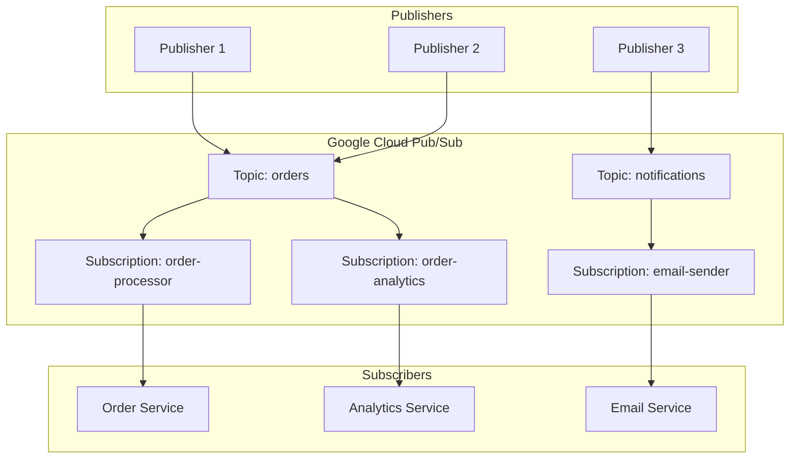
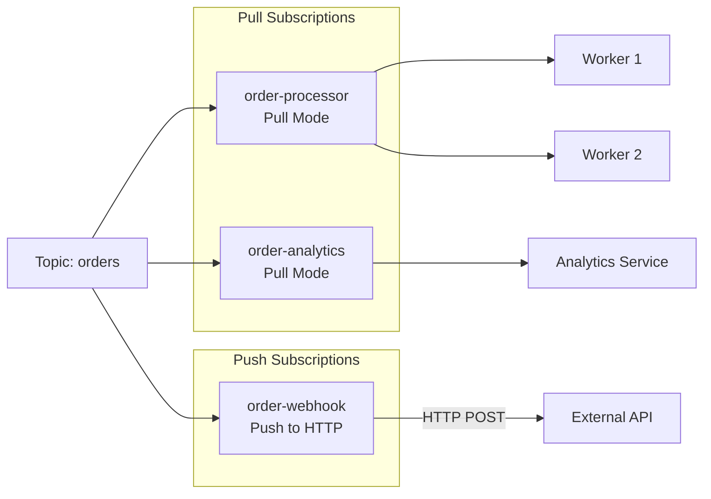
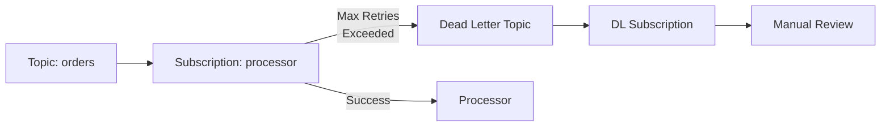
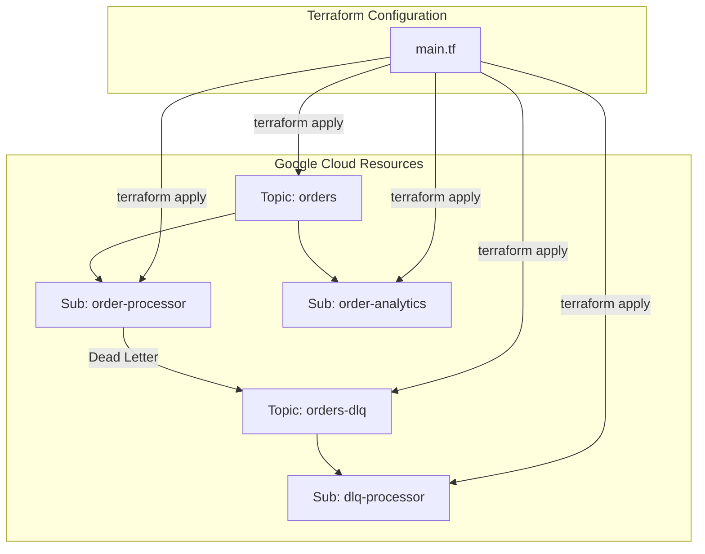
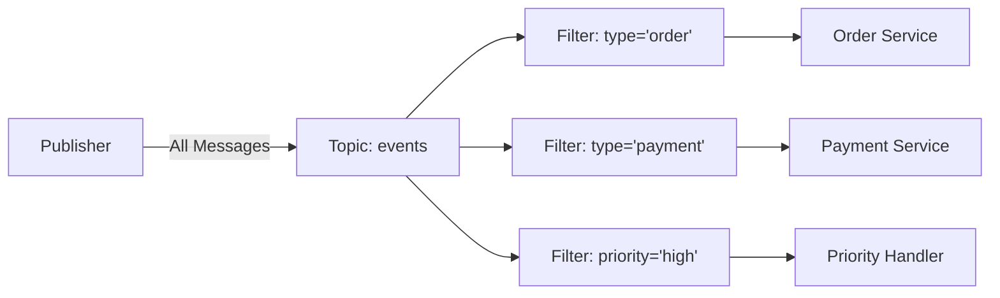

# How to Create Topics and Subscriptions in Google Pub/Sub

Author: [nawazdhandala](https://github.com/nawazdhandala)

Tags: Google Cloud, Pub/Sub, Messaging, Event-Driven Architecture, Cloud, Node.js, Python

Description: Learn how to create and manage topics and subscriptions in Google Cloud Pub/Sub. Covers topic creation, subscription types, message publishing, consuming patterns, dead letter queues, and production best practices.

---

Google Cloud Pub/Sub is a fully managed messaging service that enables asynchronous communication between applications. It decouples services that produce events from services that process events, making it ideal for building event-driven architectures. In this guide, you will learn how to create topics, configure subscriptions, and implement reliable messaging patterns.

## Understanding Pub/Sub Architecture

Before diving into implementation, understanding the core components and how they interact is essential.



## Prerequisites

Setting up your environment requires the Google Cloud SDK and proper authentication.

The following commands install the gcloud CLI and configure your project.

```bash
# Install Google Cloud SDK (macOS with Homebrew)
brew install google-cloud-sdk

# Authenticate with your Google account
gcloud auth login

# Set your project ID - replace with your actual project ID
gcloud config set project my-project-id

# Enable the Pub/Sub API for your project
gcloud services enable pubsub.googleapis.com

# Verify the API is enabled
gcloud services list --enabled | grep pubsub
```

## Creating Topics with gcloud CLI

Topics are the central resource in Pub/Sub where publishers send messages. Each topic can have multiple subscriptions.

The following commands demonstrate topic creation and management.

```bash
# Create a new topic named 'orders'
# Topics are global resources within a project
gcloud pubsub topics create orders

# Create a topic with message retention enabled
# Messages are retained for the specified duration even after acknowledgment
gcloud pubsub topics create events \
  --message-retention-duration=7d

# Create a topic with a schema for message validation
# Schema ensures all messages conform to a predefined structure
gcloud pubsub topics create validated-orders \
  --schema=order-schema \
  --message-encoding=json

# List all topics in your project
gcloud pubsub topics list

# Describe a specific topic to view its configuration
gcloud pubsub topics describe orders

# Delete a topic (also removes all subscriptions)
gcloud pubsub topics delete orders
```

## Creating Subscriptions with gcloud CLI

Subscriptions define how subscribers receive messages from a topic. You can create multiple subscriptions per topic.



The following commands create different types of subscriptions.

```bash
# Create a basic pull subscription
# Pull subscriptions require the subscriber to request messages
gcloud pubsub subscriptions create order-processor \
  --topic=orders

# Create a pull subscription with message retention
# Unacknowledged messages are retained for the specified duration
gcloud pubsub subscriptions create order-analytics \
  --topic=orders \
  --retain-acked-messages \
  --message-retention-duration=7d

# Create a subscription with acknowledgment deadline
# If not acknowledged within this time, messages are redelivered
gcloud pubsub subscriptions create slow-processor \
  --topic=orders \
  --ack-deadline=120

# Create a push subscription that sends messages to an HTTP endpoint
# Pub/Sub will POST messages to the specified URL
gcloud pubsub subscriptions create order-webhook \
  --topic=orders \
  --push-endpoint=https://api.example.com/orders/webhook

# Create a subscription with filtering
# Only messages matching the filter are delivered
gcloud pubsub subscriptions create high-value-orders \
  --topic=orders \
  --filter='attributes.priority="high"'

# List all subscriptions for a topic
gcloud pubsub topics list-subscriptions orders

# Describe a subscription to view its configuration
gcloud pubsub subscriptions describe order-processor

# Delete a subscription
gcloud pubsub subscriptions delete order-processor
```

## Dead Letter Topics

Dead letter topics capture messages that cannot be processed successfully after multiple attempts.



The following commands set up dead letter handling.

```bash
# First create the dead letter topic
gcloud pubsub topics create orders-dead-letter

# Create a subscription for reviewing dead letters
gcloud pubsub subscriptions create orders-dead-letter-sub \
  --topic=orders-dead-letter

# Create a subscription with dead letter topic configured
# After 5 failed delivery attempts, messages go to dead letter topic
gcloud pubsub subscriptions create order-processor \
  --topic=orders \
  --dead-letter-topic=orders-dead-letter \
  --max-delivery-attempts=5

# Grant Pub/Sub service account permission to publish to dead letter topic
PROJECT_ID=$(gcloud config get-value project)
PROJECT_NUMBER=$(gcloud projects describe $PROJECT_ID --format='value(projectNumber)')

gcloud pubsub topics add-iam-policy-binding orders-dead-letter \
  --member="serviceAccount:service-${PROJECT_NUMBER}@gcp-sa-pubsub.iam.gserviceaccount.com" \
  --role="roles/pubsub.publisher"
```

## Publishing Messages with Node.js

Publishing messages programmatically allows integration with your applications.

The following Node.js code demonstrates various publishing patterns with proper error handling.

```javascript
// publisher.js
// Pub/Sub publisher with batching and error handling
const { PubSub } = require('@google-cloud/pubsub');

// Initialize the Pub/Sub client
// Credentials are automatically loaded from GOOGLE_APPLICATION_CREDENTIALS
const pubsub = new PubSub({
  projectId: 'my-project-id',
});

/**
 * Publish a single message to a topic.
 * Returns the message ID for tracking.
 */
async function publishMessage(topicName, data, attributes = {}) {
  // Get a reference to the topic
  const topic = pubsub.topic(topicName);

  // Convert data to Buffer - Pub/Sub requires binary data
  const dataBuffer = Buffer.from(JSON.stringify(data));

  try {
    // Publish the message and get the message ID
    const messageId = await topic.publishMessage({
      data: dataBuffer,
      attributes: attributes, // Optional key-value metadata
    });

    console.log(`Message ${messageId} published to ${topicName}`);
    return messageId;
  } catch (error) {
    console.error(`Error publishing message: ${error.message}`);
    throw error;
  }
}

/**
 * Publish multiple messages with batching for better throughput.
 * Batching reduces the number of API calls.
 */
async function publishBatch(topicName, messages) {
  // Configure batching settings for optimal throughput
  const topic = pubsub.topic(topicName, {
    batching: {
      maxMessages: 100,        // Batch up to 100 messages
      maxMilliseconds: 100,    // Or wait max 100ms
      maxBytes: 1024 * 1024,   // Or until 1MB of data
    },
  });

  const publishPromises = messages.map(async (msg) => {
    const dataBuffer = Buffer.from(JSON.stringify(msg.data));
    return topic.publishMessage({
      data: dataBuffer,
      attributes: msg.attributes || {},
    });
  });

  try {
    const messageIds = await Promise.all(publishPromises);
    console.log(`Published ${messageIds.length} messages`);
    return messageIds;
  } catch (error) {
    console.error(`Batch publish error: ${error.message}`);
    throw error;
  }
}

/**
 * Publish with ordering key to ensure message ordering.
 * Messages with the same ordering key are delivered in order.
 */
async function publishWithOrdering(topicName, data, orderingKey) {
  // Enable message ordering on the topic
  const topic = pubsub.topic(topicName, {
    enableMessageOrdering: true,
  });

  const dataBuffer = Buffer.from(JSON.stringify(data));

  try {
    const messageId = await topic.publishMessage({
      data: dataBuffer,
      orderingKey: orderingKey, // Messages with same key maintain order
    });

    console.log(`Ordered message ${messageId} published with key: ${orderingKey}`);
    return messageId;
  } catch (error) {
    console.error(`Ordered publish error: ${error.message}`);
    // Resume publishing for this ordering key after error
    topic.resumePublishing(orderingKey);
    throw error;
  }
}

// Example usage
async function main() {
  // Publish a single order
  await publishMessage('orders', {
    orderId: 'ORD-12345',
    customerId: 'CUST-001',
    amount: 299.99,
    items: ['item1', 'item2'],
  }, {
    priority: 'high',
    source: 'web-app',
  });

  // Publish batch of events
  await publishBatch('events', [
    { data: { event: 'user_login', userId: '123' } },
    { data: { event: 'page_view', page: '/products' } },
    { data: { event: 'add_to_cart', productId: 'P100' } },
  ]);

  // Publish ordered messages for a specific customer
  await publishWithOrdering('orders', { action: 'create', orderId: 'ORD-001' }, 'customer-123');
  await publishWithOrdering('orders', { action: 'update', orderId: 'ORD-001' }, 'customer-123');
  await publishWithOrdering('orders', { action: 'complete', orderId: 'ORD-001' }, 'customer-123');
}

main().catch(console.error);
```

## Consuming Messages with Node.js

Subscribers pull or receive pushed messages from subscriptions.

The following code demonstrates pull-based message consumption with acknowledgment handling.

```javascript
// subscriber.js
// Pub/Sub subscriber with graceful shutdown and error handling
const { PubSub } = require('@google-cloud/pubsub');

const pubsub = new PubSub({
  projectId: 'my-project-id',
});

/**
 * Create a streaming pull subscriber.
 * Messages are delivered automatically as they arrive.
 */
function subscribeWithStreamingPull(subscriptionName) {
  const subscription = pubsub.subscription(subscriptionName, {
    // Flow control prevents subscriber from being overwhelmed
    flowControl: {
      maxMessages: 10,         // Process max 10 messages concurrently
      allowExcessMessages: false,
    },
  });

  // Handle incoming messages
  subscription.on('message', async (message) => {
    console.log(`Received message ${message.id}:`);
    console.log(`  Data: ${message.data.toString()}`);
    console.log(`  Attributes: ${JSON.stringify(message.attributes)}`);
    console.log(`  Published: ${message.publishTime}`);

    try {
      // Parse and process the message
      const data = JSON.parse(message.data.toString());
      await processMessage(data);

      // Acknowledge successful processing
      // Message will not be redelivered
      message.ack();
      console.log(`Message ${message.id} acknowledged`);
    } catch (error) {
      console.error(`Error processing message ${message.id}: ${error.message}`);
      // Negative acknowledgment - message will be redelivered
      message.nack();
    }
  });

  // Handle subscription errors
  subscription.on('error', (error) => {
    console.error(`Subscription error: ${error.message}`);
  });

  console.log(`Listening for messages on ${subscriptionName}...`);
  return subscription;
}

/**
 * Pull messages synchronously with a specific limit.
 * Useful for batch processing or serverless functions.
 */
async function pullMessages(subscriptionName, maxMessages = 10) {
  const subscription = pubsub.subscription(subscriptionName);

  // Pull messages with a specified limit
  const [messages] = await subscription.pull({
    maxMessages: maxMessages,
  });

  if (messages.length === 0) {
    console.log('No messages to process');
    return [];
  }

  console.log(`Pulled ${messages.length} messages`);

  const processedMessages = [];
  const ackIds = [];

  for (const message of messages) {
    try {
      const data = JSON.parse(message.message.data.toString());
      await processMessage(data);
      ackIds.push(message.ackId);
      processedMessages.push(data);
    } catch (error) {
      console.error(`Failed to process message: ${error.message}`);
      // Skip this message - it will be redelivered after ack deadline
    }
  }

  // Acknowledge all successfully processed messages
  if (ackIds.length > 0) {
    await subscription.acknowledge(ackIds);
    console.log(`Acknowledged ${ackIds.length} messages`);
  }

  return processedMessages;
}

/**
 * Modify acknowledgment deadline for long-running processing.
 * Prevents message redelivery while still processing.
 */
async function processWithExtendedDeadline(subscriptionName, processingTimeMs = 60000) {
  const subscription = pubsub.subscription(subscriptionName);

  subscription.on('message', async (message) => {
    console.log(`Processing message ${message.id}...`);

    // Extend deadline every 30 seconds during processing
    const deadlineExtender = setInterval(() => {
      message.modifyAckDeadline(60); // Extend by 60 seconds
      console.log(`Extended deadline for message ${message.id}`);
    }, 30000);

    try {
      // Simulate long-running processing
      await longRunningProcess(message.data.toString());
      message.ack();
    } catch (error) {
      message.nack();
    } finally {
      clearInterval(deadlineExtender);
    }
  });

  return subscription;
}

/**
 * Process a message - implement your business logic here.
 */
async function processMessage(data) {
  console.log('Processing:', data);
  // Add your message processing logic
  // Throw an error to trigger nack and redelivery
}

async function longRunningProcess(data) {
  // Simulate long processing
  await new Promise(resolve => setTimeout(resolve, 45000));
}

// Graceful shutdown handling
function setupGracefulShutdown(subscription) {
  const shutdown = async () => {
    console.log('Shutting down gracefully...');
    await subscription.close();
    process.exit(0);
  };

  process.on('SIGINT', shutdown);
  process.on('SIGTERM', shutdown);
}

// Example usage
async function main() {
  const subscription = subscribeWithStreamingPull('order-processor');
  setupGracefulShutdown(subscription);
}

main().catch(console.error);
```

## Publishing Messages with Python

Python provides an equally robust client library for Pub/Sub operations.

The following code demonstrates message publishing with Python.

```python
# publisher.py
# Pub/Sub publisher with batching and retry configuration
from google.cloud import pubsub_v1
from google.api_core import retry
import json
import logging

logging.basicConfig(level=logging.INFO)
logger = logging.getLogger(__name__)

# Configure batch settings for optimal throughput
batch_settings = pubsub_v1.types.BatchSettings(
    max_messages=100,        # Maximum messages per batch
    max_bytes=1024 * 1024,   # Maximum batch size in bytes (1MB)
    max_latency=0.1,         # Maximum wait time in seconds
)

# Configure publisher retry settings
publisher_options = pubsub_v1.types.PublisherOptions(
    enable_message_ordering=True,  # Enable ordered delivery
)

# Initialize the publisher client with custom settings
publisher = pubsub_v1.PublisherClient(
    batch_settings=batch_settings,
    publisher_options=publisher_options,
)

def publish_message(project_id: str, topic_id: str, data: dict,
                   attributes: dict = None, ordering_key: str = None) -> str:
    """
    Publish a single message to a Pub/Sub topic.

    Args:
        project_id: GCP project ID
        topic_id: Name of the topic
        data: Message data as dictionary
        attributes: Optional message attributes
        ordering_key: Optional key for message ordering

    Returns:
        Published message ID
    """
    # Construct the topic path
    topic_path = publisher.topic_path(project_id, topic_id)

    # Encode data as JSON bytes
    data_bytes = json.dumps(data).encode('utf-8')

    # Build publish arguments
    publish_kwargs = {
        'data': data_bytes,
    }

    if attributes:
        publish_kwargs['attributes'] = attributes

    if ordering_key:
        publish_kwargs['ordering_key'] = ordering_key

    # Publish the message
    future = publisher.publish(topic_path, **publish_kwargs)

    # Wait for the publish to complete
    message_id = future.result()
    logger.info(f"Published message {message_id} to {topic_id}")

    return message_id


def publish_batch(project_id: str, topic_id: str, messages: list) -> list:
    """
    Publish multiple messages efficiently using batching.

    Args:
        project_id: GCP project ID
        topic_id: Name of the topic
        messages: List of dicts with 'data' and optional 'attributes'

    Returns:
        List of published message IDs
    """
    topic_path = publisher.topic_path(project_id, topic_id)
    futures = []

    for msg in messages:
        data_bytes = json.dumps(msg['data']).encode('utf-8')
        attributes = msg.get('attributes', {})

        future = publisher.publish(
            topic_path,
            data=data_bytes,
            **attributes
        )
        futures.append(future)

    # Wait for all publishes to complete
    message_ids = [f.result() for f in futures]
    logger.info(f"Published {len(message_ids)} messages to {topic_id}")

    return message_ids


def publish_with_retry(project_id: str, topic_id: str, data: dict) -> str:
    """
    Publish a message with custom retry configuration.
    Useful for handling transient failures.
    """
    topic_path = publisher.topic_path(project_id, topic_id)
    data_bytes = json.dumps(data).encode('utf-8')

    # Configure custom retry behavior
    custom_retry = retry.Retry(
        initial=0.1,           # Initial retry delay in seconds
        maximum=60.0,          # Maximum retry delay
        multiplier=2.0,        # Delay multiplier per retry
        deadline=300.0,        # Total retry deadline in seconds
        predicate=retry.if_exception_type(
            Exception,         # Retry on any exception
        ),
    )

    future = publisher.publish(
        topic_path,
        data=data_bytes,
        retry=custom_retry,
    )

    return future.result()


if __name__ == "__main__":
    PROJECT_ID = "my-project-id"

    # Publish a single order
    publish_message(
        PROJECT_ID,
        "orders",
        data={
            "order_id": "ORD-12345",
            "customer_id": "CUST-001",
            "amount": 299.99,
        },
        attributes={
            "priority": "high",
            "source": "python-app",
        }
    )

    # Publish batch of events
    publish_batch(PROJECT_ID, "events", [
        {"data": {"event": "user_login", "user_id": "123"}},
        {"data": {"event": "page_view", "page": "/products"}},
        {"data": {"event": "purchase", "amount": 99.99}},
    ])
```

## Consuming Messages with Python

The Python subscriber supports both streaming and synchronous pull modes.

```python
# subscriber.py
# Pub/Sub subscriber with concurrent processing and graceful shutdown
from google.cloud import pubsub_v1
from concurrent.futures import TimeoutError
import json
import logging
import signal
import sys

logging.basicConfig(level=logging.INFO)
logger = logging.getLogger(__name__)

# Global flag for graceful shutdown
shutdown_requested = False

def subscribe_with_streaming(project_id: str, subscription_id: str,
                            timeout: float = None):
    """
    Subscribe to messages using streaming pull.
    Messages are delivered automatically as they arrive.

    Args:
        project_id: GCP project ID
        subscription_id: Name of the subscription
        timeout: Optional timeout in seconds (None for indefinite)
    """
    subscriber = pubsub_v1.SubscriberClient()
    subscription_path = subscriber.subscription_path(project_id, subscription_id)

    # Configure flow control to manage message processing rate
    flow_control = pubsub_v1.types.FlowControl(
        max_messages=10,           # Max concurrent messages
        max_bytes=10 * 1024 * 1024, # Max 10MB in memory
    )

    def callback(message: pubsub_v1.subscriber.message.Message):
        """Process received messages."""
        logger.info(f"Received message {message.message_id}")
        logger.info(f"  Data: {message.data.decode('utf-8')}")
        logger.info(f"  Attributes: {message.attributes}")

        try:
            data = json.loads(message.data.decode('utf-8'))
            process_message(data)

            # Acknowledge successful processing
            message.ack()
            logger.info(f"Message {message.message_id} acknowledged")

        except Exception as e:
            logger.error(f"Error processing message: {e}")
            # Negative acknowledgment - message will be redelivered
            message.nack()

    # Start the streaming pull
    streaming_pull_future = subscriber.subscribe(
        subscription_path,
        callback=callback,
        flow_control=flow_control,
    )

    logger.info(f"Listening for messages on {subscription_path}...")

    # Handle graceful shutdown
    def shutdown_handler(signum, frame):
        global shutdown_requested
        shutdown_requested = True
        logger.info("Shutdown requested, closing subscriber...")
        streaming_pull_future.cancel()

    signal.signal(signal.SIGINT, shutdown_handler)
    signal.signal(signal.SIGTERM, shutdown_handler)

    # Block until timeout or shutdown
    try:
        streaming_pull_future.result(timeout=timeout)
    except TimeoutError:
        logger.info("Timeout reached, stopping subscriber")
        streaming_pull_future.cancel()
        streaming_pull_future.result()
    except Exception as e:
        logger.info(f"Subscriber stopped: {e}")


def pull_messages_sync(project_id: str, subscription_id: str,
                       max_messages: int = 10) -> list:
    """
    Pull messages synchronously.
    Useful for batch processing or Cloud Functions.

    Args:
        project_id: GCP project ID
        subscription_id: Name of the subscription
        max_messages: Maximum number of messages to pull

    Returns:
        List of processed message data
    """
    subscriber = pubsub_v1.SubscriberClient()
    subscription_path = subscriber.subscription_path(project_id, subscription_id)

    # Pull messages
    response = subscriber.pull(
        request={
            "subscription": subscription_path,
            "max_messages": max_messages,
        }
    )

    if not response.received_messages:
        logger.info("No messages to process")
        return []

    logger.info(f"Pulled {len(response.received_messages)} messages")

    processed = []
    ack_ids = []

    for received_message in response.received_messages:
        message = received_message.message
        try:
            data = json.loads(message.data.decode('utf-8'))
            process_message(data)
            ack_ids.append(received_message.ack_id)
            processed.append(data)
        except Exception as e:
            logger.error(f"Failed to process message: {e}")

    # Acknowledge processed messages
    if ack_ids:
        subscriber.acknowledge(
            request={
                "subscription": subscription_path,
                "ack_ids": ack_ids,
            }
        )
        logger.info(f"Acknowledged {len(ack_ids)} messages")

    return processed


def process_message(data: dict):
    """
    Process a message - implement your business logic here.
    Raise an exception to trigger message redelivery.
    """
    logger.info(f"Processing: {data}")
    # Add your processing logic here


if __name__ == "__main__":
    PROJECT_ID = "my-project-id"

    # Start streaming subscriber
    subscribe_with_streaming(PROJECT_ID, "order-processor")
```

## Creating Topics and Subscriptions with Terraform

Infrastructure as Code enables reproducible and version-controlled Pub/Sub configuration.



The following Terraform configuration creates a complete Pub/Sub setup with dead letter handling.

```hcl
# main.tf
# Terraform configuration for Google Cloud Pub/Sub

terraform {
  required_providers {
    google = {
      source  = "hashicorp/google"
      version = "~> 5.0"
    }
  }
}

provider "google" {
  project = var.project_id
  region  = var.region
}

variable "project_id" {
  description = "GCP project ID"
  type        = string
}

variable "region" {
  description = "GCP region"
  type        = string
  default     = "us-central1"
}

# Main topic for order events
resource "google_pubsub_topic" "orders" {
  name = "orders"

  # Enable message retention for replay capability
  message_retention_duration = "604800s" # 7 days

  # Labels for organization and cost tracking
  labels = {
    environment = "production"
    team        = "orders"
  }
}

# Dead letter topic for failed messages
resource "google_pubsub_topic" "orders_dlq" {
  name = "orders-dead-letter"

  labels = {
    environment = "production"
    team        = "orders"
    type        = "dead-letter"
  }
}

# Main subscription for order processing
resource "google_pubsub_subscription" "order_processor" {
  name  = "order-processor"
  topic = google_pubsub_topic.orders.id

  # Acknowledgment deadline in seconds
  ack_deadline_seconds = 60

  # Retain acknowledged messages for replay
  retain_acked_messages = true
  message_retention_duration = "604800s" # 7 days

  # Enable exactly-once delivery for critical processing
  enable_exactly_once_delivery = true

  # Configure dead letter policy
  dead_letter_policy {
    dead_letter_topic     = google_pubsub_topic.orders_dlq.id
    max_delivery_attempts = 5
  }

  # Retry policy for transient failures
  retry_policy {
    minimum_backoff = "10s"
    maximum_backoff = "600s"
  }

  # Expiration policy - subscription never expires
  expiration_policy {
    ttl = ""
  }

  labels = {
    environment = "production"
    team        = "orders"
  }
}

# Analytics subscription with filtering
resource "google_pubsub_subscription" "order_analytics" {
  name  = "order-analytics"
  topic = google_pubsub_topic.orders.id

  ack_deadline_seconds = 30

  # Filter to receive only completed orders
  filter = "attributes.status = \"completed\""

  labels = {
    environment = "production"
    team        = "analytics"
  }
}

# Push subscription for webhook integration
resource "google_pubsub_subscription" "order_webhook" {
  name  = "order-webhook"
  topic = google_pubsub_topic.orders.id

  # Configure push delivery to HTTP endpoint
  push_config {
    push_endpoint = "https://api.example.com/orders/webhook"

    # Add authentication header
    oidc_token {
      service_account_email = google_service_account.pubsub_invoker.email
      audience              = "https://api.example.com"
    }

    # Custom attributes to include in HTTP request
    attributes = {
      x-custom-header = "pubsub-push"
    }
  }

  labels = {
    environment = "production"
    team        = "integrations"
  }
}

# Dead letter subscription for manual review
resource "google_pubsub_subscription" "dlq_processor" {
  name  = "orders-dlq-processor"
  topic = google_pubsub_topic.orders_dlq.id

  ack_deadline_seconds = 120
  retain_acked_messages = true
  message_retention_duration = "2592000s" # 30 days

  labels = {
    environment = "production"
    team        = "orders"
    type        = "dead-letter"
  }
}

# Service account for push subscription authentication
resource "google_service_account" "pubsub_invoker" {
  account_id   = "pubsub-invoker"
  display_name = "Pub/Sub Push Invoker"
}

# Grant Pub/Sub permission to publish to dead letter topic
resource "google_pubsub_topic_iam_member" "dlq_publisher" {
  topic  = google_pubsub_topic.orders_dlq.id
  role   = "roles/pubsub.publisher"
  member = "serviceAccount:service-${data.google_project.current.number}@gcp-sa-pubsub.iam.gserviceaccount.com"
}

# Grant Pub/Sub permission to subscribe from main subscription
resource "google_pubsub_subscription_iam_member" "dlq_subscriber" {
  subscription = google_pubsub_subscription.order_processor.id
  role         = "roles/pubsub.subscriber"
  member       = "serviceAccount:service-${data.google_project.current.number}@gcp-sa-pubsub.iam.gserviceaccount.com"
}

# Data source for project number
data "google_project" "current" {
  project_id = var.project_id
}

# Outputs for reference
output "orders_topic" {
  description = "Orders topic name"
  value       = google_pubsub_topic.orders.name
}

output "order_processor_subscription" {
  description = "Order processor subscription name"
  value       = google_pubsub_subscription.order_processor.name
}
```

Apply the Terraform configuration using these commands.

```bash
# Initialize Terraform and download providers
terraform init

# Preview the changes
terraform plan -var="project_id=my-project-id"

# Apply the configuration
terraform apply -var="project_id=my-project-id"

# View created resources
terraform output
```

## Message Filtering

Subscription filters reduce message processing by delivering only relevant messages to subscribers.



The following examples demonstrate various filter expressions.

```bash
# Filter by exact attribute value
gcloud pubsub subscriptions create order-events \
  --topic=events \
  --filter='attributes.type = "order"'

# Filter by multiple conditions (AND)
gcloud pubsub subscriptions create high-priority-orders \
  --topic=events \
  --filter='attributes.type = "order" AND attributes.priority = "high"'

# Filter by prefix match
gcloud pubsub subscriptions create us-orders \
  --topic=events \
  --filter='hasPrefix(attributes.region, "us-")'

# Filter by checking attribute existence
gcloud pubsub subscriptions create tagged-events \
  --topic=events \
  --filter='attributes:important'

# Filter by numeric comparison (attributes are strings, use carefully)
gcloud pubsub subscriptions create large-orders \
  --topic=events \
  --filter='attributes.amount_cents > "10000"'
```

## Monitoring and Alerting

Effective monitoring helps identify issues before they impact your application.

```bash
# View subscription metrics
gcloud pubsub subscriptions describe order-processor --format='yaml(ackDeadlineSeconds,messageRetentionDuration)'

# Check undelivered message count
gcloud monitoring metrics list --filter='metric.type=pubsub.googleapis.com/subscription/num_undelivered_messages'

# Create an alerting policy for message backlog
gcloud alpha monitoring policies create \
  --display-name="Pub/Sub Message Backlog Alert" \
  --condition-display-name="High message backlog" \
  --condition-filter='resource.type="pubsub_subscription" AND metric.type="pubsub.googleapis.com/subscription/num_undelivered_messages"' \
  --condition-threshold-value=1000 \
  --condition-threshold-comparison=COMPARISON_GT \
  --condition-threshold-duration=300s \
  --notification-channels=projects/my-project/notificationChannels/123456
```

## Best Practices

Following best practices ensures reliable and efficient Pub/Sub implementations.

### Topic Design

- Use descriptive names that reflect the message content
- Create separate topics for different event types
- Enable message retention for replay capability
- Consider message schema validation for data quality

### Subscription Configuration

- Set appropriate acknowledgment deadlines based on processing time
- Configure dead letter topics for all production subscriptions
- Use message filtering to reduce unnecessary processing
- Enable exactly-once delivery for critical workflows

### Publisher Guidelines

- Use batching for high-throughput scenarios
- Implement retry logic with exponential backoff
- Use ordering keys only when message order matters
- Include relevant attributes for filtering and debugging

### Subscriber Guidelines

- Process messages idempotently to handle redeliveries
- Extend acknowledgment deadlines for long-running tasks
- Implement graceful shutdown to avoid message loss
- Monitor consumer lag and scale accordingly

## Summary

Google Cloud Pub/Sub provides a robust foundation for building event-driven architectures. Key takeaways include:

- Topics serve as channels where publishers send messages
- Subscriptions define how and where messages are delivered
- Dead letter topics capture messages that fail processing repeatedly
- Message filtering reduces unnecessary processing at the subscriber
- Terraform enables infrastructure-as-code for reproducible deployments
- Proper acknowledgment handling ensures reliable message delivery
- Monitoring and alerting help maintain healthy message pipelines

Start with simple topic and subscription configurations, then add advanced features like filtering, dead letter queues, and exactly-once delivery as your requirements evolve.

