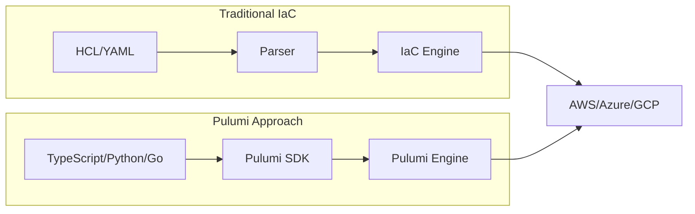
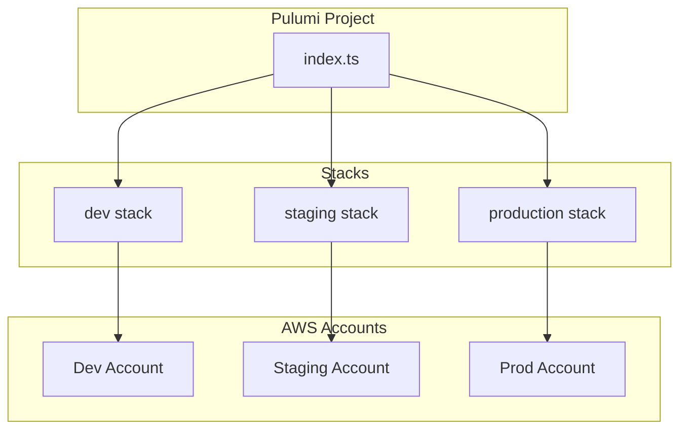

# How to Use Pulumi with AWS

Author: [nawazdhandala](https://www.github.com/nawazdhandala)

Tags: Pulumi, AWS, Infrastructure as Code, DevOps, Cloud

Description: A practical guide to provisioning and managing AWS infrastructure using Pulumi with TypeScript, from basic resources to production-ready patterns.

---

Pulumi lets you write infrastructure code using real programming languages instead of domain-specific ones like HCL. If you already know TypeScript, Python, or Go, you can start provisioning AWS resources without learning another syntax. This guide walks you through setting up Pulumi with AWS and building real infrastructure.

## Why Pulumi for AWS?

Traditional Infrastructure as Code tools use their own configuration languages. Pulumi takes a different approach - you use languages you already know.



Benefits of using Pulumi with AWS:

- **Familiar languages**: Use TypeScript, Python, Go, C#, or Java
- **Real programming constructs**: Loops, conditions, functions, and classes
- **IDE support**: Autocomplete, type checking, and refactoring
- **Testing**: Use standard testing frameworks like Jest or pytest
- **Package management**: npm, pip, or Go modules for sharing infrastructure code

## Prerequisites

Before starting, make sure you have:

- Node.js 18+ installed
- An AWS account with programmatic access
- AWS CLI configured with credentials

## Installing Pulumi

Install the Pulumi CLI on your system.

```bash
# macOS
brew install pulumi

# Linux
curl -fsSL https://get.pulumi.com | sh

# Windows (PowerShell)
choco install pulumi
```

Verify the installation:

```bash
pulumi version
```

## Setting Up AWS Credentials

Pulumi uses the same credentials as the AWS CLI. Configure them if you haven't already.

```bash
# Configure AWS credentials
aws configure

# Or export environment variables
export AWS_ACCESS_KEY_ID="your-access-key"
export AWS_SECRET_ACCESS_KEY="your-secret-key"
export AWS_REGION="us-east-1"
```

## Creating Your First Pulumi Project

Initialize a new Pulumi project with TypeScript and AWS.

```bash
# Create a new directory
mkdir pulumi-aws-demo && cd pulumi-aws-demo

# Initialize a new Pulumi project
pulumi new aws-typescript
```

The CLI will prompt you for:
- Project name
- Project description
- Stack name (use `dev` for development)
- AWS region

This creates several files:

```
pulumi-aws-demo/
├── Pulumi.yaml         # Project configuration
├── Pulumi.dev.yaml     # Stack-specific configuration
├── index.ts            # Main infrastructure code
├── package.json        # Node.js dependencies
└── tsconfig.json       # TypeScript configuration
```

## Your First AWS Resource: S3 Bucket

Let's create an S3 bucket. Open `index.ts` and replace its contents.

```typescript
// index.ts
// Import Pulumi AWS SDK for accessing AWS resources
import * as pulumi from "@pulumi/pulumi";
import * as aws from "@pulumi/aws";

// Create an S3 bucket with versioning enabled
// Pulumi automatically generates a unique name using the logical name "my-bucket"
const bucket = new aws.s3.Bucket("my-bucket", {
    // Enable versioning for data protection
    versioning: {
        enabled: true,
    },
    // Apply tags for cost tracking and organization
    tags: {
        Environment: "development",
        ManagedBy: "pulumi",
    },
});

// Export the bucket name so we can reference it later
// Exports are visible in the Pulumi console and CLI output
export const bucketName = bucket.id;
export const bucketArn = bucket.arn;
```

Deploy the infrastructure:

```bash
# Preview changes before applying
pulumi preview

# Deploy the stack
pulumi up
```

Pulumi shows you what will be created and asks for confirmation. After deployment, you'll see the exported values.

## Building a VPC from Scratch

Real applications need proper networking. Here's how to create a complete VPC setup.

```typescript
// vpc.ts
// This module creates a production-ready VPC with public and private subnets
import * as pulumi from "@pulumi/pulumi";
import * as aws from "@pulumi/aws";

// Configuration for the VPC
const config = new pulumi.Config();
const vpcCidr = config.get("vpcCidr") || "10.0.0.0/16";

// Create the main VPC
// The VPC is the foundation of your AWS network infrastructure
const vpc = new aws.ec2.Vpc("main-vpc", {
    cidrBlock: vpcCidr,
    enableDnsHostnames: true,
    enableDnsSupport: true,
    tags: {
        Name: "main-vpc",
    },
});

// Create an Internet Gateway for public internet access
// Required for resources in public subnets to reach the internet
const internetGateway = new aws.ec2.InternetGateway("main-igw", {
    vpcId: vpc.id,
    tags: {
        Name: "main-igw",
    },
});

// Define availability zones to use
// Using multiple AZs provides high availability
const availabilityZones = ["us-east-1a", "us-east-1b", "us-east-1c"];

// Create public subnets - one per availability zone
// Public subnets have routes to the internet gateway
const publicSubnets = availabilityZones.map((az, index) => {
    return new aws.ec2.Subnet(`public-subnet-${index}`, {
        vpcId: vpc.id,
        cidrBlock: `10.0.${index}.0/24`,
        availabilityZone: az,
        mapPublicIpOnLaunch: true,
        tags: {
            Name: `public-subnet-${az}`,
            Type: "public",
        },
    });
});

// Create private subnets - one per availability zone
// Private subnets don't have direct internet access
const privateSubnets = availabilityZones.map((az, index) => {
    return new aws.ec2.Subnet(`private-subnet-${index}`, {
        vpcId: vpc.id,
        cidrBlock: `10.0.${index + 10}.0/24`,
        availabilityZone: az,
        tags: {
            Name: `private-subnet-${az}`,
            Type: "private",
        },
    });
});

// Create Elastic IPs for NAT Gateways
// Each NAT Gateway needs a static public IP
const natEips = availabilityZones.map((az, index) => {
    return new aws.ec2.Eip(`nat-eip-${index}`, {
        domain: "vpc",
        tags: {
            Name: `nat-eip-${az}`,
        },
    });
});

// Create NAT Gateways - one per AZ for high availability
// NAT Gateways allow private subnets to access the internet
const natGateways = availabilityZones.map((az, index) => {
    return new aws.ec2.NatGateway(`nat-gw-${index}`, {
        allocationId: natEips[index].id,
        subnetId: publicSubnets[index].id,
        tags: {
            Name: `nat-gw-${az}`,
        },
    }, { dependsOn: [internetGateway] });
});

// Create public route table with internet access
const publicRouteTable = new aws.ec2.RouteTable("public-rt", {
    vpcId: vpc.id,
    routes: [
        {
            cidrBlock: "0.0.0.0/0",
            gatewayId: internetGateway.id,
        },
    ],
    tags: {
        Name: "public-rt",
    },
});

// Associate public subnets with the public route table
publicSubnets.forEach((subnet, index) => {
    new aws.ec2.RouteTableAssociation(`public-rta-${index}`, {
        subnetId: subnet.id,
        routeTableId: publicRouteTable.id,
    });
});

// Create private route tables - one per AZ for isolated routing through NAT
const privateRouteTables = availabilityZones.map((az, index) => {
    const rt = new aws.ec2.RouteTable(`private-rt-${index}`, {
        vpcId: vpc.id,
        routes: [
            {
                cidrBlock: "0.0.0.0/0",
                natGatewayId: natGateways[index].id,
            },
        ],
        tags: {
            Name: `private-rt-${az}`,
        },
    });

    // Associate private subnet with its route table
    new aws.ec2.RouteTableAssociation(`private-rta-${index}`, {
        subnetId: privateSubnets[index].id,
        routeTableId: rt.id,
    });

    return rt;
});

// Export VPC outputs for use by other stacks or modules
export const vpcId = vpc.id;
export const publicSubnetIds = publicSubnets.map(s => s.id);
export const privateSubnetIds = privateSubnets.map(s => s.id);
```

## Deploying an EC2 Instance

With the VPC in place, let's deploy an EC2 instance.

```typescript
// ec2.ts
// Deploy an EC2 instance with proper security group configuration
import * as pulumi from "@pulumi/pulumi";
import * as aws from "@pulumi/aws";

// Assume vpc module exports are available
// In practice, you'd import these from a separate file or stack

// Create a security group for the web server
// Security groups act as virtual firewalls for EC2 instances
const webSecurityGroup = new aws.ec2.SecurityGroup("web-sg", {
    vpcId: vpc.id,
    description: "Security group for web servers",
    // Ingress rules - what traffic is allowed in
    ingress: [
        {
            description: "HTTP from anywhere",
            fromPort: 80,
            toPort: 80,
            protocol: "tcp",
            cidrBlocks: ["0.0.0.0/0"],
        },
        {
            description: "HTTPS from anywhere",
            fromPort: 443,
            toPort: 443,
            protocol: "tcp",
            cidrBlocks: ["0.0.0.0/0"],
        },
        {
            description: "SSH from VPC",
            fromPort: 22,
            toPort: 22,
            protocol: "tcp",
            cidrBlocks: [vpcCidr],
        },
    ],
    // Egress rules - what traffic is allowed out
    egress: [
        {
            description: "Allow all outbound",
            fromPort: 0,
            toPort: 0,
            protocol: "-1",
            cidrBlocks: ["0.0.0.0/0"],
        },
    ],
    tags: {
        Name: "web-sg",
    },
});

// Look up the latest Amazon Linux 2023 AMI
// Using data sources to find the right AMI for your region
const amazonLinuxAmi = aws.ec2.getAmi({
    mostRecent: true,
    owners: ["amazon"],
    filters: [
        {
            name: "name",
            values: ["al2023-ami-*-x86_64"],
        },
        {
            name: "virtualization-type",
            values: ["hvm"],
        },
    ],
});

// User data script to configure the instance on boot
// This installs and starts a simple web server
const userData = `#!/bin/bash
yum update -y
yum install -y httpd
systemctl start httpd
systemctl enable httpd
echo "<h1>Hello from Pulumi!</h1>" > /var/www/html/index.html
`;

// Create the EC2 instance
const webServer = new aws.ec2.Instance("web-server", {
    ami: amazonLinuxAmi.then(ami => ami.id),
    instanceType: "t3.micro",
    subnetId: publicSubnets[0].id,
    vpcSecurityGroupIds: [webSecurityGroup.id],
    userData: userData,
    // Enable detailed monitoring for better observability
    monitoring: true,
    // Root volume configuration
    rootBlockDevice: {
        volumeSize: 20,
        volumeType: "gp3",
        encrypted: true,
    },
    tags: {
        Name: "web-server",
    },
});

// Export the public IP for easy access
export const webServerPublicIp = webServer.publicIp;
export const webServerPublicDns = webServer.publicDns;
```

## Creating an RDS Database

Most applications need a database. Here's how to provision RDS with proper security.

```typescript
// rds.ts
// Create an RDS PostgreSQL instance with security best practices
import * as pulumi from "@pulumi/pulumi";
import * as aws from "@pulumi/aws";
import * as random from "@pulumi/random";

// Generate a random password for the database
// Never hardcode passwords in your infrastructure code
const dbPassword = new random.RandomPassword("db-password", {
    length: 24,
    special: true,
    overrideSpecial: "!#$%&*()-_=+[]{}<>:?",
});

// Create a security group for the database
// Only allow connections from within the VPC
const dbSecurityGroup = new aws.ec2.SecurityGroup("db-sg", {
    vpcId: vpc.id,
    description: "Security group for RDS database",
    ingress: [
        {
            description: "PostgreSQL from VPC",
            fromPort: 5432,
            toPort: 5432,
            protocol: "tcp",
            cidrBlocks: [vpcCidr],
        },
    ],
    egress: [
        {
            fromPort: 0,
            toPort: 0,
            protocol: "-1",
            cidrBlocks: ["0.0.0.0/0"],
        },
    ],
    tags: {
        Name: "db-sg",
    },
});

// Create a DB subnet group
// RDS needs subnets in at least two availability zones
const dbSubnetGroup = new aws.rds.SubnetGroup("db-subnet-group", {
    subnetIds: privateSubnetIds,
    tags: {
        Name: "db-subnet-group",
    },
});

// Create the RDS instance
const database = new aws.rds.Instance("app-database", {
    // Engine configuration
    engine: "postgres",
    engineVersion: "15.4",
    instanceClass: "db.t3.medium",

    // Storage configuration
    allocatedStorage: 20,
    maxAllocatedStorage: 100,  // Enable storage autoscaling
    storageType: "gp3",
    storageEncrypted: true,

    // Database configuration
    dbName: "appdb",
    username: "dbadmin",
    password: dbPassword.result,

    // Network configuration
    dbSubnetGroupName: dbSubnetGroup.name,
    vpcSecurityGroupIds: [dbSecurityGroup.id],
    publiclyAccessible: false,

    // Backup configuration
    backupRetentionPeriod: 7,
    backupWindow: "03:00-04:00",
    maintenanceWindow: "Mon:04:00-Mon:05:00",

    // High availability - set to true for production
    multiAz: false,

    // Enable performance insights for monitoring
    performanceInsightsEnabled: true,
    performanceInsightsRetentionPeriod: 7,

    // Deletion protection - enable for production
    deletionProtection: false,
    skipFinalSnapshot: true,  // Set to false for production

    tags: {
        Name: "app-database",
    },
});

// Store the password in AWS Secrets Manager
// This is the recommended way to manage database credentials
const dbSecret = new aws.secretsmanager.Secret("db-credentials", {
    name: "app/database/credentials",
    description: "Database credentials for the application",
});

const dbSecretVersion = new aws.secretsmanager.SecretVersion("db-credentials-version", {
    secretId: dbSecret.id,
    secretString: pulumi.all([database.endpoint, database.username, dbPassword.result])
        .apply(([endpoint, username, password]) => JSON.stringify({
            host: endpoint.split(":")[0],
            port: 5432,
            username: username,
            password: password,
            database: "appdb",
        })),
});

// Export database connection info
export const dbEndpoint = database.endpoint;
export const dbSecretArn = dbSecret.arn;
```

## Deploying to ECS Fargate

For containerized applications, ECS Fargate is a great choice. Here's a complete setup.

```typescript
// ecs.ts
// Deploy a containerized application to ECS Fargate
import * as pulumi from "@pulumi/pulumi";
import * as aws from "@pulumi/aws";
import * as awsx from "@pulumi/awsx";

// Create an ECR repository for container images
const repository = new aws.ecr.Repository("app-repo", {
    name: "myapp",
    imageTagMutability: "MUTABLE",
    imageScanningConfiguration: {
        scanOnPush: true,
    },
    forceDelete: true,  // Set to false for production
});

// Create an ECS cluster
const cluster = new aws.ecs.Cluster("app-cluster", {
    name: "app-cluster",
    setting: [
        {
            name: "containerInsights",
            value: "enabled",
        },
    ],
});

// Create an Application Load Balancer security group
const albSecurityGroup = new aws.ec2.SecurityGroup("alb-sg", {
    vpcId: vpc.id,
    description: "Security group for ALB",
    ingress: [
        {
            fromPort: 80,
            toPort: 80,
            protocol: "tcp",
            cidrBlocks: ["0.0.0.0/0"],
        },
        {
            fromPort: 443,
            toPort: 443,
            protocol: "tcp",
            cidrBlocks: ["0.0.0.0/0"],
        },
    ],
    egress: [
        {
            fromPort: 0,
            toPort: 0,
            protocol: "-1",
            cidrBlocks: ["0.0.0.0/0"],
        },
    ],
});

// Create a security group for ECS tasks
const ecsSecurityGroup = new aws.ec2.SecurityGroup("ecs-sg", {
    vpcId: vpc.id,
    description: "Security group for ECS tasks",
    ingress: [
        {
            fromPort: 8080,
            toPort: 8080,
            protocol: "tcp",
            securityGroups: [albSecurityGroup.id],
        },
    ],
    egress: [
        {
            fromPort: 0,
            toPort: 0,
            protocol: "-1",
            cidrBlocks: ["0.0.0.0/0"],
        },
    ],
});

// Create the Application Load Balancer
const alb = new aws.lb.LoadBalancer("app-alb", {
    internal: false,
    loadBalancerType: "application",
    securityGroups: [albSecurityGroup.id],
    subnets: publicSubnetIds,
    enableDeletionProtection: false,  // Enable for production
});

// Create a target group for the ECS service
const targetGroup = new aws.lb.TargetGroup("app-tg", {
    port: 8080,
    protocol: "HTTP",
    targetType: "ip",
    vpcId: vpc.id,
    healthCheck: {
        enabled: true,
        path: "/health",
        port: "traffic-port",
        protocol: "HTTP",
        healthyThreshold: 2,
        unhealthyThreshold: 3,
        timeout: 5,
        interval: 30,
    },
});

// Create an ALB listener
const listener = new aws.lb.Listener("app-listener", {
    loadBalancerArn: alb.arn,
    port: 80,
    protocol: "HTTP",
    defaultActions: [
        {
            type: "forward",
            targetGroupArn: targetGroup.arn,
        },
    ],
});

// Create IAM role for ECS task execution
const taskExecutionRole = new aws.iam.Role("task-execution-role", {
    assumeRolePolicy: JSON.stringify({
        Version: "2012-10-17",
        Statement: [
            {
                Effect: "Allow",
                Principal: {
                    Service: "ecs-tasks.amazonaws.com",
                },
                Action: "sts:AssumeRole",
            },
        ],
    }),
});

// Attach the standard ECS task execution policy
new aws.iam.RolePolicyAttachment("task-execution-policy", {
    role: taskExecutionRole.name,
    policyArn: "arn:aws:iam::aws:policy/service-role/AmazonECSTaskExecutionRolePolicy",
});

// Create CloudWatch log group for the application
const logGroup = new aws.cloudwatch.LogGroup("app-logs", {
    name: "/ecs/myapp",
    retentionInDays: 14,
});

// Define the ECS task definition
const taskDefinition = new aws.ecs.TaskDefinition("app-task", {
    family: "myapp",
    cpu: "256",
    memory: "512",
    networkMode: "awsvpc",
    requiresCompatibilities: ["FARGATE"],
    executionRoleArn: taskExecutionRole.arn,
    containerDefinitions: pulumi.all([repository.repositoryUrl, logGroup.name])
        .apply(([repoUrl, logGroupName]) => JSON.stringify([
            {
                name: "myapp",
                image: `${repoUrl}:latest`,
                essential: true,
                portMappings: [
                    {
                        containerPort: 8080,
                        hostPort: 8080,
                        protocol: "tcp",
                    },
                ],
                logConfiguration: {
                    logDriver: "awslogs",
                    options: {
                        "awslogs-group": logGroupName,
                        "awslogs-region": "us-east-1",
                        "awslogs-stream-prefix": "ecs",
                    },
                },
                environment: [
                    {
                        name: "NODE_ENV",
                        value: "production",
                    },
                ],
            },
        ])),
});

// Create the ECS service
const service = new aws.ecs.Service("app-service", {
    cluster: cluster.arn,
    taskDefinition: taskDefinition.arn,
    desiredCount: 2,
    launchType: "FARGATE",
    networkConfiguration: {
        subnets: privateSubnetIds,
        securityGroups: [ecsSecurityGroup.id],
        assignPublicIp: false,
    },
    loadBalancers: [
        {
            targetGroupArn: targetGroup.arn,
            containerName: "myapp",
            containerPort: 8080,
        },
    ],
    deploymentCircuitBreaker: {
        enable: true,
        rollback: true,
    },
}, { dependsOn: [listener] });

// Export the ALB DNS name
export const albDnsName = alb.dnsName;
export const ecrRepositoryUrl = repository.repositoryUrl;
```

## Working with Pulumi Stacks

Stacks let you manage multiple environments from the same codebase.



Create and switch between stacks:

```bash
# Create a new stack
pulumi stack init staging

# List all stacks
pulumi stack ls

# Switch to a different stack
pulumi stack select dev

# Set stack-specific configuration
pulumi config set aws:region us-west-2
pulumi config set instanceType t3.large
```

Use configuration in your code to vary behavior per environment:

```typescript
// index.ts
// Environment-aware infrastructure configuration
import * as pulumi from "@pulumi/pulumi";
import * as aws from "@pulumi/aws";

// Get the current stack name
const stack = pulumi.getStack();

// Load stack-specific configuration
const config = new pulumi.Config();
const instanceType = config.get("instanceType") || "t3.micro";
const minCapacity = config.getNumber("minCapacity") || 1;
const maxCapacity = config.getNumber("maxCapacity") || 3;

// Environment-specific settings based on stack name
const environmentConfig: Record<string, { instanceType: string; multiAz: boolean }> = {
    dev: { instanceType: "t3.micro", multiAz: false },
    staging: { instanceType: "t3.small", multiAz: false },
    production: { instanceType: "t3.medium", multiAz: true },
};

const envConfig = environmentConfig[stack] || environmentConfig.dev;

// Use configuration when creating resources
const webServer = new aws.ec2.Instance("web-server", {
    instanceType: envConfig.instanceType,
    // ... other configuration
});
```

## Creating Reusable Components

Pulumi's component resources let you create reusable infrastructure patterns.

```typescript
// components/webapp.ts
// A reusable component that creates a complete web application stack
import * as pulumi from "@pulumi/pulumi";
import * as aws from "@pulumi/aws";

// Define the component's input properties
export interface WebAppArgs {
    vpcId: pulumi.Input<string>;
    subnetIds: pulumi.Input<string>[];
    instanceType?: string;
    minSize?: number;
    maxSize?: number;
    desiredCapacity?: number;
    healthCheckPath?: string;
}

// Create a ComponentResource class
export class WebApp extends pulumi.ComponentResource {
    public readonly loadBalancerDns: pulumi.Output<string>;
    public readonly securityGroupId: pulumi.Output<string>;

    constructor(name: string, args: WebAppArgs, opts?: pulumi.ComponentResourceOptions) {
        super("custom:resource:WebApp", name, {}, opts);

        // Default values
        const instanceType = args.instanceType || "t3.micro";
        const minSize = args.minSize || 1;
        const maxSize = args.maxSize || 3;
        const desiredCapacity = args.desiredCapacity || 2;
        const healthCheckPath = args.healthCheckPath || "/health";

        // Create security group for the ALB
        const albSg = new aws.ec2.SecurityGroup(`${name}-alb-sg`, {
            vpcId: args.vpcId,
            ingress: [
                { fromPort: 80, toPort: 80, protocol: "tcp", cidrBlocks: ["0.0.0.0/0"] },
                { fromPort: 443, toPort: 443, protocol: "tcp", cidrBlocks: ["0.0.0.0/0"] },
            ],
            egress: [
                { fromPort: 0, toPort: 0, protocol: "-1", cidrBlocks: ["0.0.0.0/0"] },
            ],
        }, { parent: this });

        // Create security group for instances
        const instanceSg = new aws.ec2.SecurityGroup(`${name}-instance-sg`, {
            vpcId: args.vpcId,
            ingress: [
                { fromPort: 80, toPort: 80, protocol: "tcp", securityGroups: [albSg.id] },
            ],
            egress: [
                { fromPort: 0, toPort: 0, protocol: "-1", cidrBlocks: ["0.0.0.0/0"] },
            ],
        }, { parent: this });

        // Create Application Load Balancer
        const alb = new aws.lb.LoadBalancer(`${name}-alb`, {
            loadBalancerType: "application",
            securityGroups: [albSg.id],
            subnets: args.subnetIds,
        }, { parent: this });

        // Create target group
        const targetGroup = new aws.lb.TargetGroup(`${name}-tg`, {
            port: 80,
            protocol: "HTTP",
            targetType: "instance",
            vpcId: args.vpcId,
            healthCheck: {
                path: healthCheckPath,
                healthyThreshold: 2,
                unhealthyThreshold: 3,
            },
        }, { parent: this });

        // Create listener
        new aws.lb.Listener(`${name}-listener`, {
            loadBalancerArn: alb.arn,
            port: 80,
            defaultActions: [{ type: "forward", targetGroupArn: targetGroup.arn }],
        }, { parent: this });

        // Get latest Amazon Linux AMI
        const ami = aws.ec2.getAmi({
            mostRecent: true,
            owners: ["amazon"],
            filters: [{ name: "name", values: ["al2023-ami-*-x86_64"] }],
        });

        // Create launch template
        const launchTemplate = new aws.ec2.LaunchTemplate(`${name}-lt`, {
            imageId: ami.then(a => a.id),
            instanceType: instanceType,
            vpcSecurityGroupIds: [instanceSg.id],
            userData: Buffer.from(`#!/bin/bash
yum update -y
yum install -y httpd
systemctl start httpd
systemctl enable httpd
echo "OK" > /var/www/html/health
`).toString("base64"),
        }, { parent: this });

        // Create Auto Scaling Group
        new aws.autoscaling.Group(`${name}-asg`, {
            minSize: minSize,
            maxSize: maxSize,
            desiredCapacity: desiredCapacity,
            vpcZoneIdentifiers: args.subnetIds,
            targetGroupArns: [targetGroup.arn],
            launchTemplate: {
                id: launchTemplate.id,
                version: "$Latest",
            },
            healthCheckType: "ELB",
            healthCheckGracePeriod: 300,
        }, { parent: this });

        // Set outputs
        this.loadBalancerDns = alb.dnsName;
        this.securityGroupId = instanceSg.id;

        // Register outputs
        this.registerOutputs({
            loadBalancerDns: this.loadBalancerDns,
            securityGroupId: this.securityGroupId,
        });
    }
}
```

Use the component in your main code:

```typescript
// index.ts
import { WebApp } from "./components/webapp";

// Create a web application using the component
const app = new WebApp("myapp", {
    vpcId: vpc.id,
    subnetIds: publicSubnetIds,
    instanceType: "t3.small",
    minSize: 2,
    maxSize: 10,
    desiredCapacity: 3,
});

export const appUrl = app.loadBalancerDns;
```

## Managing State

Pulumi stores state to track your infrastructure. By default, it uses the Pulumi Cloud service, but you can use other backends.

```bash
# Use Pulumi Cloud (default)
pulumi login

# Use local file backend
pulumi login --local

# Use S3 backend
pulumi login s3://my-pulumi-state-bucket

# Check current backend
pulumi whoami -v
```

For team environments, use S3 with locking:

```typescript
// Create an S3 bucket for Pulumi state
const stateBucket = new aws.s3.Bucket("pulumi-state", {
    bucket: "my-org-pulumi-state",
    versioning: {
        enabled: true,
    },
    serverSideEncryptionConfiguration: {
        rule: {
            applyServerSideEncryptionByDefault: {
                sseAlgorithm: "AES256",
            },
        },
    },
});

// Create DynamoDB table for state locking
const lockTable = new aws.dynamodb.Table("pulumi-locks", {
    name: "pulumi-state-locks",
    billingMode: "PAY_PER_REQUEST",
    hashKey: "LockID",
    attributes: [
        { name: "LockID", type: "S" },
    ],
});
```

## Testing Infrastructure

Pulumi supports unit and integration testing with standard test frameworks.

```typescript
// __tests__/vpc.test.ts
// Unit tests for VPC infrastructure
import * as pulumi from "@pulumi/pulumi";
import "jest";

// Mock Pulumi runtime
pulumi.runtime.setMocks({
    newResource: function(args: pulumi.runtime.MockResourceArgs): { id: string; state: any } {
        return {
            id: `${args.name}-id`,
            state: args.inputs,
        };
    },
    call: function(args: pulumi.runtime.MockCallArgs) {
        return args.inputs;
    },
});

describe("VPC Infrastructure", () => {
    let infra: typeof import("../index");

    beforeAll(async () => {
        // Import the infrastructure code
        infra = await import("../index");
    });

    test("VPC has correct CIDR block", async () => {
        const cidr = await new Promise<string>((resolve) => {
            infra.vpcCidr.apply(resolve);
        });
        expect(cidr).toBe("10.0.0.0/16");
    });

    test("Creates three public subnets", async () => {
        const subnets = await new Promise<string[]>((resolve) => {
            pulumi.all(infra.publicSubnetIds).apply(resolve);
        });
        expect(subnets.length).toBe(3);
    });

    test("Creates three private subnets", async () => {
        const subnets = await new Promise<string[]>((resolve) => {
            pulumi.all(infra.privateSubnetIds).apply(resolve);
        });
        expect(subnets.length).toBe(3);
    });
});
```

Run tests:

```bash
# Install test dependencies
npm install --save-dev jest @types/jest ts-jest

# Run tests
npm test
```

## Best Practices

### 1. Organize Code by Resource Type

```
infrastructure/
├── index.ts           # Main entry point
├── networking/
│   ├── vpc.ts
│   └── security-groups.ts
├── compute/
│   ├── ec2.ts
│   └── ecs.ts
├── database/
│   └── rds.ts
├── components/
│   └── webapp.ts
└── __tests__/
    └── vpc.test.ts
```

### 2. Use Explicit Dependencies

```typescript
// Use dependsOn when Pulumi can't infer dependencies
const natGateway = new aws.ec2.NatGateway("nat", {
    // ...
}, { dependsOn: [internetGateway] });
```

### 3. Tag Everything

```typescript
// Create a tagging function for consistency
function getTags(name: string): Record<string, string> {
    return {
        Name: name,
        Environment: pulumi.getStack(),
        ManagedBy: "pulumi",
        Project: pulumi.getProject(),
    };
}

const bucket = new aws.s3.Bucket("data", {
    tags: getTags("data-bucket"),
});
```

### 4. Use Secrets for Sensitive Data

```typescript
// Set secrets via CLI
// pulumi config set --secret dbPassword "my-secret-password"

const config = new pulumi.Config();
const dbPassword = config.requireSecret("dbPassword");

// The value is encrypted in state and masked in logs
```

### 5. Enable Drift Detection

```bash
# Check for drift between state and actual infrastructure
pulumi refresh

# Preview what would change
pulumi preview --diff
```

## Common Issues and Solutions

| Issue | Solution |
|-------|----------|
| "Resource already exists" | Import existing resource with `pulumi import` |
| Circular dependencies | Use explicit `dependsOn` or restructure resources |
| Slow deployments | Use `--parallel` flag or split into multiple stacks |
| State conflicts | Use proper locking with S3 + DynamoDB backend |
| Permission errors | Check IAM permissions for the Pulumi execution role |

## Destroying Infrastructure

When you're done, clean up resources:

```bash
# Preview what will be destroyed
pulumi destroy --preview-only

# Destroy all resources in the stack
pulumi destroy

# Remove the stack completely
pulumi stack rm dev
```

---

Pulumi brings the power of real programming languages to infrastructure management. Start with simple resources, build up to components, and leverage your existing programming skills to create maintainable infrastructure. The investment in learning Pulumi pays off through better IDE support, easier testing, and more expressive infrastructure code.

*Need to monitor the infrastructure you deploy with Pulumi? [OneUptime](https://oneuptime.com) provides comprehensive monitoring, alerting, and status pages to keep your AWS resources healthy and your users informed.*
