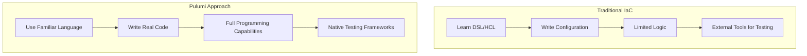
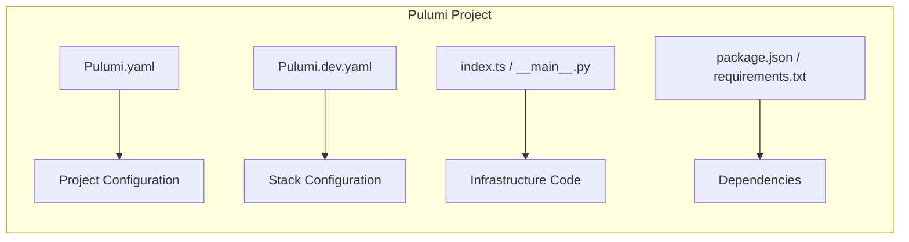
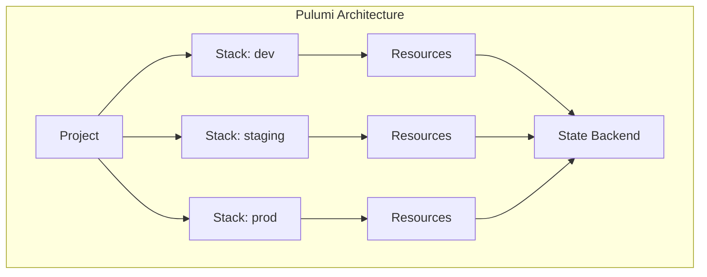
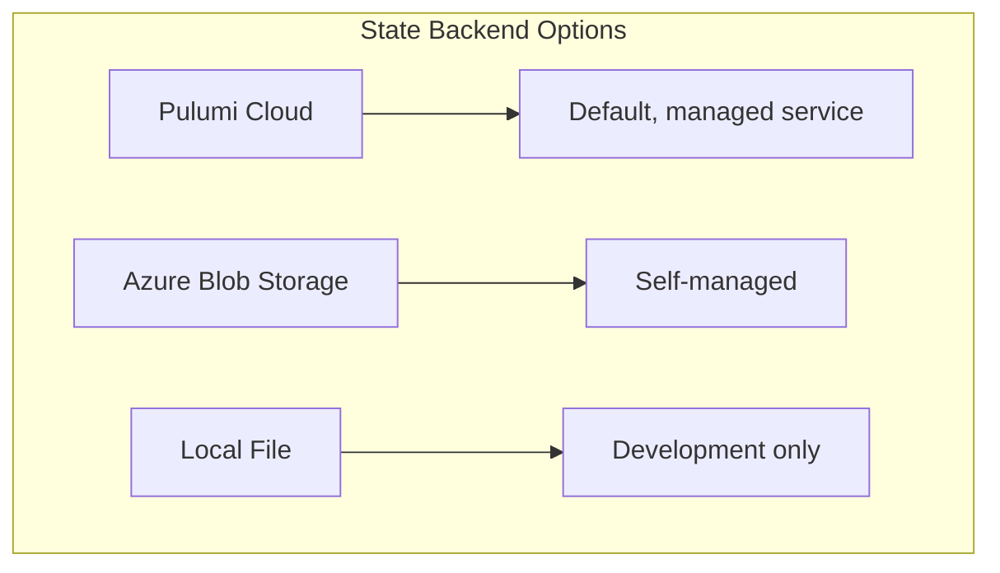

# How to Use Pulumi with Azure

Author: [nawazdhandala](https://www.github.com/nawazdhandala)

Tags: Pulumi, Azure, Infrastructure as Code, IaC, Cloud, TypeScript, Python, DevOps, Automation

Description: A comprehensive guide to using Pulumi for Azure infrastructure provisioning. Learn how to set up Pulumi, create and manage Azure resources, implement best practices, and build production-ready infrastructure using your favorite programming languages.

---

Pulumi brings a modern approach to infrastructure as code by allowing you to use familiar programming languages like TypeScript, Python, Go, and C# to define and manage cloud resources. When combined with Azure, Pulumi enables teams to build, deploy, and manage infrastructure using the same tools and practices they use for application development.

## Why Choose Pulumi for Azure?

Before diving into implementation, let's understand what makes Pulumi an excellent choice for Azure infrastructure:



**Key benefits of using Pulumi with Azure:**

1. **Real programming languages** - Use TypeScript, Python, Go, C#, or Java instead of learning a new DSL
2. **Full IDE support** - Get autocompletion, type checking, and refactoring capabilities
3. **Native testing** - Write unit tests using standard testing frameworks
4. **Reusable components** - Create and share infrastructure components as packages
5. **Strong typing** - Catch errors at compile time rather than runtime
6. **Azure-native provider** - Direct access to all Azure resources and features

## Prerequisites

Before starting, ensure you have:

- An Azure account with an active subscription
- Node.js (v18+) or Python (3.9+) installed
- Pulumi CLI installed
- Azure CLI installed and configured
- Basic programming knowledge in your chosen language

## Installing Pulumi

The following commands install the Pulumi CLI on different operating systems:

```bash
# macOS using Homebrew
brew install pulumi/tap/pulumi

# Windows using Chocolatey
choco install pulumi

# Linux using curl
curl -fsSL https://get.pulumi.com | sh

# Verify installation
pulumi version
```

## Authenticating with Azure

Pulumi needs Azure credentials to manage resources. The recommended approach uses Azure CLI authentication:

```bash
# Login to Azure
az login

# Set your subscription (if you have multiple)
az account set --subscription "Your Subscription Name"

# Verify the active subscription
az account show
```

For CI/CD environments, use a service principal with the following environment variables:

```bash
# Set Azure credentials for non-interactive authentication
export ARM_CLIENT_ID="your-client-id"
export ARM_CLIENT_SECRET="your-client-secret"
export ARM_TENANT_ID="your-tenant-id"
export ARM_SUBSCRIPTION_ID="your-subscription-id"
```

## Creating Your First Pulumi Project

### Project Structure



### Initialize a New Project

Create a new Pulumi project with Azure support using TypeScript:

```bash
# Create a new directory for your project
mkdir azure-infrastructure && cd azure-infrastructure

# Initialize a new Pulumi project with Azure and TypeScript
pulumi new azure-typescript

# The wizard will prompt for:
# - Project name: azure-infrastructure
# - Project description: Azure infrastructure with Pulumi
# - Stack name: dev
# - Azure location: eastus
```

For Python projects, use this command:

```bash
# Initialize with Python
pulumi new azure-python

# Create and activate virtual environment
python -m venv venv
source venv/bin/activate  # On Windows: venv\Scripts\activate

# Install dependencies
pip install -r requirements.txt
```

## Understanding Pulumi Concepts



**Core concepts:**

- **Project** - A directory containing Pulumi.yaml and infrastructure code
- **Stack** - An isolated instance of your infrastructure (dev, staging, prod)
- **Resource** - A cloud component like a VM, storage account, or network
- **State** - Pulumi tracks resource state to determine what changes to make

## Deploying Azure Resources

### Basic Resource Group and Storage Account

The following TypeScript code creates an Azure resource group and storage account with proper naming conventions:

```typescript
// index.ts
import * as pulumi from "@pulumi/pulumi";
import * as azure from "@pulumi/azure-native";

// Get configuration values
const config = new pulumi.Config();
const environment = pulumi.getStack();
const location = config.get("location") || "eastus";

// Create a resource group with environment-specific naming
const resourceGroup = new azure.resources.ResourceGroup("rg", {
    resourceGroupName: `rg-myapp-${environment}`,
    location: location,
    tags: {
        environment: environment,
        managedBy: "pulumi",
        project: "myapp",
    },
});

// Create a storage account with unique naming
// Storage account names must be globally unique and lowercase
const storageAccount = new azure.storage.StorageAccount("storage", {
    resourceGroupName: resourceGroup.name,
    accountName: `stmyapp${environment}`,
    location: resourceGroup.location,
    sku: {
        name: azure.storage.SkuName.Standard_LRS,
    },
    kind: azure.storage.Kind.StorageV2,
    enableHttpsTrafficOnly: true,
    minimumTlsVersion: azure.storage.MinimumTlsVersion.TLS1_2,
    tags: {
        environment: environment,
        managedBy: "pulumi",
    },
});

// Export the storage account connection string
export const storageConnectionString = pulumi.secret(
    pulumi.interpolate`DefaultEndpointsProtocol=https;AccountName=${storageAccount.name};AccountKey=${
        azure.storage.listStorageAccountKeysOutput({
            resourceGroupName: resourceGroup.name,
            accountName: storageAccount.name,
        }).keys[0].value
    };EndpointSuffix=core.windows.net`
);

// Export resource information
export const resourceGroupName = resourceGroup.name;
export const storageAccountName = storageAccount.name;
```

### Python Equivalent

The following Python code achieves the same infrastructure setup:

```python
# __main__.py
import pulumi
from pulumi_azure_native import resources, storage

# Get configuration values
config = pulumi.Config()
environment = pulumi.get_stack()
location = config.get("location") or "eastus"

# Create a resource group with environment-specific naming
resource_group = resources.ResourceGroup(
    "rg",
    resource_group_name=f"rg-myapp-{environment}",
    location=location,
    tags={
        "environment": environment,
        "managedBy": "pulumi",
        "project": "myapp",
    },
)

# Create a storage account with unique naming
# Storage account names must be globally unique and lowercase
storage_account = storage.StorageAccount(
    "storage",
    resource_group_name=resource_group.name,
    account_name=f"stmyapp{environment}",
    location=resource_group.location,
    sku=storage.SkuArgs(
        name=storage.SkuName.STANDARD_LRS,
    ),
    kind=storage.Kind.STORAGE_V2,
    enable_https_traffic_only=True,
    minimum_tls_version=storage.MinimumTlsVersion.TLS1_2,
    tags={
        "environment": environment,
        "managedBy": "pulumi",
    },
)

# Get storage account keys for connection string
storage_account_keys = pulumi.Output.all(
    resource_group.name, storage_account.name
).apply(
    lambda args: storage.list_storage_account_keys(
        resource_group_name=args[0],
        account_name=args[1],
    )
)

# Build and export the connection string as a secret
connection_string = pulumi.Output.all(
    storage_account.name, storage_account_keys
).apply(
    lambda args: f"DefaultEndpointsProtocol=https;AccountName={args[0]};"
    f"AccountKey={args[1].keys[0].value};EndpointSuffix=core.windows.net"
)

pulumi.export("storage_connection_string", pulumi.Output.secret(connection_string))
pulumi.export("resource_group_name", resource_group.name)
pulumi.export("storage_account_name", storage_account.name)
```

### Deploy the Infrastructure

Run these commands to preview and deploy your infrastructure:

```bash
# Preview changes before deployment
pulumi preview

# Deploy the infrastructure
pulumi up

# View the outputs
pulumi stack output

# View sensitive outputs
pulumi stack output storageConnectionString --show-secrets
```

## Building a Complete Azure Environment

### Virtual Network with Subnets

The following code creates a production-ready virtual network with multiple subnets for different workloads:

```typescript
// network.ts
import * as pulumi from "@pulumi/pulumi";
import * as azure from "@pulumi/azure-native";

export interface NetworkArgs {
    resourceGroupName: pulumi.Input<string>;
    location: pulumi.Input<string>;
    environment: string;
    addressSpace: string;
}

export class Network extends pulumi.ComponentResource {
    public readonly vnet: azure.network.VirtualNetwork;
    public readonly webSubnet: azure.network.Subnet;
    public readonly appSubnet: azure.network.Subnet;
    public readonly dataSubnet: azure.network.Subnet;

    constructor(name: string, args: NetworkArgs, opts?: pulumi.ComponentResourceOptions) {
        super("custom:azure:Network", name, {}, opts);

        const defaultOpts = { parent: this };

        // Create the virtual network with the specified address space
        this.vnet = new azure.network.VirtualNetwork("vnet", {
            virtualNetworkName: `vnet-${args.environment}`,
            resourceGroupName: args.resourceGroupName,
            location: args.location,
            addressSpace: {
                addressPrefixes: [args.addressSpace],
            },
            tags: {
                environment: args.environment,
                managedBy: "pulumi",
            },
        }, defaultOpts);

        // Web tier subnet for public-facing resources
        this.webSubnet = new azure.network.Subnet("web-subnet", {
            subnetName: "snet-web",
            resourceGroupName: args.resourceGroupName,
            virtualNetworkName: this.vnet.name,
            addressPrefix: this.calculateSubnet(args.addressSpace, 0),
            serviceEndpoints: [
                { service: "Microsoft.Web" },
                { service: "Microsoft.KeyVault" },
            ],
        }, defaultOpts);

        // Application tier subnet for backend services
        this.appSubnet = new azure.network.Subnet("app-subnet", {
            subnetName: "snet-app",
            resourceGroupName: args.resourceGroupName,
            virtualNetworkName: this.vnet.name,
            addressPrefix: this.calculateSubnet(args.addressSpace, 1),
            serviceEndpoints: [
                { service: "Microsoft.Sql" },
                { service: "Microsoft.Storage" },
            ],
        }, defaultOpts);

        // Data tier subnet for databases and storage
        this.dataSubnet = new azure.network.Subnet("data-subnet", {
            subnetName: "snet-data",
            resourceGroupName: args.resourceGroupName,
            virtualNetworkName: this.vnet.name,
            addressPrefix: this.calculateSubnet(args.addressSpace, 2),
            privateEndpointNetworkPolicies: azure.network.VirtualNetworkPrivateEndpointNetworkPolicies.Disabled,
        }, defaultOpts);

        this.registerOutputs({
            vnetId: this.vnet.id,
            webSubnetId: this.webSubnet.id,
            appSubnetId: this.appSubnet.id,
            dataSubnetId: this.dataSubnet.id,
        });
    }

    // Helper function to calculate subnet addresses
    private calculateSubnet(baseAddress: string, index: number): string {
        const [network, cidr] = baseAddress.split("/");
        const octets = network.split(".").map(Number);
        octets[2] = index;
        return `${octets.join(".")}/24`;
    }
}
```

### Azure Kubernetes Service (AKS) Cluster

The following code deploys a production-ready AKS cluster with proper networking and monitoring:

```typescript
// aks.ts
import * as pulumi from "@pulumi/pulumi";
import * as azure from "@pulumi/azure-native";

export interface AksClusterArgs {
    resourceGroupName: pulumi.Input<string>;
    location: pulumi.Input<string>;
    environment: string;
    subnetId: pulumi.Input<string>;
    nodeCount: number;
    nodeSize: string;
}

export function createAksCluster(name: string, args: AksClusterArgs): azure.containerservice.ManagedCluster {
    // Create a user-assigned managed identity for the cluster
    const identity = new azure.managedidentity.UserAssignedIdentity("aks-identity", {
        resourceGroupName: args.resourceGroupName,
        location: args.location,
        resourceName: `id-aks-${args.environment}`,
    });

    // Create Log Analytics workspace for monitoring
    const logAnalytics = new azure.operationalinsights.Workspace("log-analytics", {
        workspaceName: `log-aks-${args.environment}`,
        resourceGroupName: args.resourceGroupName,
        location: args.location,
        sku: {
            name: azure.operationalinsights.WorkspaceSkuNameEnum.PerGB2018,
        },
        retentionInDays: 30,
    });

    // Create the AKS cluster with production settings
    const cluster = new azure.containerservice.ManagedCluster(name, {
        resourceGroupName: args.resourceGroupName,
        location: args.location,
        resourceName: `aks-${args.environment}`,

        // Use the managed identity
        identity: {
            type: azure.containerservice.ResourceIdentityType.UserAssigned,
            userAssignedIdentities: [identity.id],
        },

        // Kubernetes version - use a supported stable version
        kubernetesVersion: "1.29",

        // DNS prefix for the cluster
        dnsPrefix: `aks-${args.environment}`,

        // Default node pool configuration
        agentPoolProfiles: [{
            name: "system",
            count: args.nodeCount,
            vmSize: args.nodeSize,
            mode: azure.containerservice.AgentPoolMode.System,
            osType: azure.containerservice.OSType.Linux,
            vnetSubnetID: args.subnetId,
            enableAutoScaling: true,
            minCount: 2,
            maxCount: 5,
            availabilityZones: ["1", "2", "3"],
        }],

        // Network configuration for Azure CNI
        networkProfile: {
            networkPlugin: azure.containerservice.NetworkPlugin.Azure,
            networkPolicy: azure.containerservice.NetworkPolicy.Azure,
            serviceCidr: "10.0.0.0/16",
            dnsServiceIP: "10.0.0.10",
            loadBalancerSku: azure.containerservice.LoadBalancerSku.Standard,
        },

        // Enable Azure Monitor for containers
        addonProfiles: {
            omsagent: {
                enabled: true,
                config: {
                    logAnalyticsWorkspaceResourceID: logAnalytics.id,
                },
            },
            azureKeyvaultSecretsProvider: {
                enabled: true,
            },
        },

        // Enable Azure RBAC for Kubernetes authorization
        aadProfile: {
            managed: true,
            enableAzureRBAC: true,
        },

        // Security settings
        enableRBAC: true,

        tags: {
            environment: args.environment,
            managedBy: "pulumi",
        },
    });

    return cluster;
}
```

### Azure SQL Database

The following code creates an Azure SQL Database with proper security configuration:

```typescript
// database.ts
import * as pulumi from "@pulumi/pulumi";
import * as azure from "@pulumi/azure-native";
import * as random from "@pulumi/random";

export interface SqlDatabaseArgs {
    resourceGroupName: pulumi.Input<string>;
    location: pulumi.Input<string>;
    environment: string;
    subnetId: pulumi.Input<string>;
    adminUsername: string;
}

export class SqlDatabase extends pulumi.ComponentResource {
    public readonly server: azure.sql.Server;
    public readonly database: azure.sql.Database;
    public readonly connectionString: pulumi.Output<string>;

    constructor(name: string, args: SqlDatabaseArgs, opts?: pulumi.ComponentResourceOptions) {
        super("custom:azure:SqlDatabase", name, {}, opts);

        const defaultOpts = { parent: this };

        // Generate a random password for the SQL admin
        const adminPassword = new random.RandomPassword("sql-password", {
            length: 32,
            special: true,
            overrideSpecial: "!#$%&*()-_=+[]{}<>:?",
        }, defaultOpts);

        // Create the SQL Server
        this.server = new azure.sql.Server("sql-server", {
            serverName: `sql-${args.environment}-${pulumi.getStack()}`,
            resourceGroupName: args.resourceGroupName,
            location: args.location,
            administratorLogin: args.adminUsername,
            administratorLoginPassword: adminPassword.result,
            version: "12.0",
            minimalTlsVersion: "1.2",
            publicNetworkAccess: azure.sql.ServerNetworkAccessFlag.Disabled,
            tags: {
                environment: args.environment,
                managedBy: "pulumi",
            },
        }, defaultOpts);

        // Create a private endpoint for secure connectivity
        const privateEndpoint = new azure.network.PrivateEndpoint("sql-pe", {
            privateEndpointName: `pe-sql-${args.environment}`,
            resourceGroupName: args.resourceGroupName,
            location: args.location,
            subnet: {
                id: args.subnetId,
            },
            privateLinkServiceConnections: [{
                name: "sql-connection",
                privateLinkServiceId: this.server.id,
                groupIds: ["sqlServer"],
            }],
        }, defaultOpts);

        // Create the database with appropriate SKU
        this.database = new azure.sql.Database("database", {
            databaseName: `db-${args.environment}`,
            serverName: this.server.name,
            resourceGroupName: args.resourceGroupName,
            location: args.location,
            sku: {
                name: args.environment === "prod" ? "S3" : "S1",
                tier: "Standard",
            },
            maxSizeBytes: 268435456000, // 250 GB
            zoneRedundant: args.environment === "prod",
            tags: {
                environment: args.environment,
                managedBy: "pulumi",
            },
        }, defaultOpts);

        // Build the connection string
        this.connectionString = pulumi.interpolate`Server=tcp:${this.server.fullyQualifiedDomainName},1433;Database=${this.database.name};User ID=${args.adminUsername};Password=${adminPassword.result};Encrypt=true;Connection Timeout=30;`;

        this.registerOutputs({
            serverId: this.server.id,
            databaseId: this.database.id,
        });
    }
}
```

## Complete Infrastructure Example

The following main file brings all components together to create a complete Azure environment:

```typescript
// index.ts
import * as pulumi from "@pulumi/pulumi";
import * as azure from "@pulumi/azure-native";
import { Network } from "./network";
import { createAksCluster } from "./aks";
import { SqlDatabase } from "./database";

// Configuration
const config = new pulumi.Config();
const environment = pulumi.getStack();
const location = config.get("location") || "eastus";

// Create resource group
const resourceGroup = new azure.resources.ResourceGroup("rg", {
    resourceGroupName: `rg-myapp-${environment}`,
    location: location,
    tags: {
        environment: environment,
        managedBy: "pulumi",
        project: "myapp",
    },
});

// Create network infrastructure
const network = new Network("network", {
    resourceGroupName: resourceGroup.name,
    location: resourceGroup.location,
    environment: environment,
    addressSpace: "10.0.0.0/16",
});

// Create AKS cluster
const aksCluster = createAksCluster("aks", {
    resourceGroupName: resourceGroup.name,
    location: resourceGroup.location,
    environment: environment,
    subnetId: network.appSubnet.id,
    nodeCount: environment === "prod" ? 3 : 2,
    nodeSize: environment === "prod" ? "Standard_D4s_v3" : "Standard_D2s_v3",
});

// Create SQL Database
const database = new SqlDatabase("sql", {
    resourceGroupName: resourceGroup.name,
    location: resourceGroup.location,
    environment: environment,
    subnetId: network.dataSubnet.id,
    adminUsername: "sqladmin",
});

// Create Key Vault for secrets management
const keyVault = new azure.keyvault.Vault("keyvault", {
    vaultName: `kv-myapp-${environment}`,
    resourceGroupName: resourceGroup.name,
    location: resourceGroup.location,
    properties: {
        tenantId: azure.authorization.getClientConfig().then(c => c.tenantId),
        sku: {
            family: azure.keyvault.SkuFamily.A,
            name: azure.keyvault.SkuName.Standard,
        },
        enableSoftDelete: true,
        softDeleteRetentionInDays: 90,
        enablePurgeProtection: true,
        networkAcls: {
            defaultAction: azure.keyvault.NetworkRuleAction.Deny,
            bypass: azure.keyvault.NetworkRuleBypassOptions.AzureServices,
            virtualNetworkRules: [
                { id: network.appSubnet.id },
            ],
        },
    },
    tags: {
        environment: environment,
        managedBy: "pulumi",
    },
});

// Store database connection string in Key Vault
const dbConnectionSecret = new azure.keyvault.Secret("db-connection", {
    secretName: "DatabaseConnectionString",
    vaultName: keyVault.name,
    resourceGroupName: resourceGroup.name,
    properties: {
        value: database.connectionString,
    },
});

// Export outputs
export const resourceGroupName = resourceGroup.name;
export const vnetId = network.vnet.id;
export const aksClusterName = aksCluster.name;
export const keyVaultUri = keyVault.properties.apply(p => p.vaultUri);
```

## Stack Configuration

### Environment-Specific Configuration

Create stack configuration files for different environments:

```yaml
# Pulumi.dev.yaml
config:
  azure-native:location: eastus
  myapp:nodeCount: "2"
  myapp:nodeSize: Standard_D2s_v3
  myapp:enableHighAvailability: "false"
```

```yaml
# Pulumi.prod.yaml
config:
  azure-native:location: eastus
  myapp:nodeCount: "3"
  myapp:nodeSize: Standard_D4s_v3
  myapp:enableHighAvailability: "true"
```

### Using Configuration in Code

The following code demonstrates how to read and use stack configuration:

```typescript
// config.ts
import * as pulumi from "@pulumi/pulumi";

const config = new pulumi.Config("myapp");

export const appConfig = {
    // Get required string value
    nodeCount: config.requireNumber("nodeCount"),

    // Get optional value with default
    nodeSize: config.get("nodeSize") || "Standard_D2s_v3",

    // Get boolean value
    enableHighAvailability: config.getBoolean("enableHighAvailability") || false,

    // Get secret value (will be encrypted in state)
    apiKey: config.requireSecret("apiKey"),
};
```

## Testing Pulumi Infrastructure

### Unit Testing with TypeScript

The following test verifies that resources are created with correct configurations:

```typescript
// index.test.ts
import * as pulumi from "@pulumi/pulumi";
import "mocha";
import * as assert from "assert";

// Mock Pulumi runtime
pulumi.runtime.setMocks({
    newResource: function(args: pulumi.runtime.MockResourceArgs): {id: string, state: any} {
        return {
            id: `${args.name}-id`,
            state: args.inputs,
        };
    },
    call: function(args: pulumi.runtime.MockCallArgs) {
        return args.inputs;
    },
});

describe("Infrastructure", function() {
    let infra: typeof import("./index");

    before(async function() {
        // Import the infrastructure code
        infra = await import("./index");
    });

    describe("Resource Group", function() {
        it("should have correct location", function(done) {
            pulumi.all([infra.resourceGroupName]).apply(([name]) => {
                assert.ok(name.includes("myapp"));
                done();
            });
        });
    });

    describe("Storage Account", function() {
        it("should enable HTTPS only", function(done) {
            // Test implementation
            done();
        });
    });
});
```

### Policy as Code

Pulumi CrossGuard enables policy enforcement:

```typescript
// policy/index.ts
import * as policy from "@pulumi/policy";
import * as azure from "@pulumi/azure-native";

new policy.PolicyPack("azure-policies", {
    policies: [
        // Ensure storage accounts use HTTPS
        {
            name: "storage-https-only",
            description: "Storage accounts must enable HTTPS-only traffic",
            enforcementLevel: "mandatory",
            validateResource: policy.validateResourceOfType(
                azure.storage.StorageAccount,
                (account, args, reportViolation) => {
                    if (account.enableHttpsTrafficOnly !== true) {
                        reportViolation("Storage account must have HTTPS-only enabled");
                    }
                }
            ),
        },

        // Ensure resources have required tags
        {
            name: "required-tags",
            description: "Resources must have environment and managedBy tags",
            enforcementLevel: "mandatory",
            validateResource: (args, reportViolation) => {
                const tags = (args.props as any).tags;
                if (!tags?.environment) {
                    reportViolation("Resource must have 'environment' tag");
                }
                if (!tags?.managedBy) {
                    reportViolation("Resource must have 'managedBy' tag");
                }
            },
        },

        // Ensure minimum TLS version
        {
            name: "minimum-tls-version",
            description: "Resources must use TLS 1.2 or higher",
            enforcementLevel: "mandatory",
            validateResource: policy.validateResourceOfType(
                azure.storage.StorageAccount,
                (account, args, reportViolation) => {
                    if (account.minimumTlsVersion !== "TLS1_2") {
                        reportViolation("Storage account must use TLS 1.2 minimum");
                    }
                }
            ),
        },
    ],
});
```

Run policies during preview:

```bash
# Run policy checks
pulumi preview --policy-pack ./policy
```

## CI/CD Integration

### GitHub Actions Workflow

The following workflow automates Pulumi deployments with proper environment handling:

```yaml
# .github/workflows/pulumi.yml
name: Pulumi Deploy

on:
  push:
    branches:
      - main
  pull_request:
    branches:
      - main

env:
  PULUMI_ACCESS_TOKEN: ${{ secrets.PULUMI_ACCESS_TOKEN }}
  ARM_CLIENT_ID: ${{ secrets.ARM_CLIENT_ID }}
  ARM_CLIENT_SECRET: ${{ secrets.ARM_CLIENT_SECRET }}
  ARM_TENANT_ID: ${{ secrets.ARM_TENANT_ID }}
  ARM_SUBSCRIPTION_ID: ${{ secrets.ARM_SUBSCRIPTION_ID }}

jobs:
  preview:
    name: Preview
    runs-on: ubuntu-latest
    if: github.event_name == 'pull_request'
    steps:
      - uses: actions/checkout@v4

      - name: Setup Node.js
        uses: actions/setup-node@v4
        with:
          node-version: '20'

      - name: Install dependencies
        run: npm ci

      - name: Pulumi Preview
        uses: pulumi/actions@v5
        with:
          command: preview
          stack-name: dev
          comment-on-pr: true

  deploy-dev:
    name: Deploy to Dev
    runs-on: ubuntu-latest
    if: github.ref == 'refs/heads/main'
    steps:
      - uses: actions/checkout@v4

      - name: Setup Node.js
        uses: actions/setup-node@v4
        with:
          node-version: '20'

      - name: Install dependencies
        run: npm ci

      - name: Pulumi Deploy Dev
        uses: pulumi/actions@v5
        with:
          command: up
          stack-name: dev

  deploy-prod:
    name: Deploy to Production
    runs-on: ubuntu-latest
    needs: deploy-dev
    if: github.ref == 'refs/heads/main'
    environment: production
    steps:
      - uses: actions/checkout@v4

      - name: Setup Node.js
        uses: actions/setup-node@v4
        with:
          node-version: '20'

      - name: Install dependencies
        run: npm ci

      - name: Pulumi Deploy Prod
        uses: pulumi/actions@v5
        with:
          command: up
          stack-name: prod
```

### Azure DevOps Pipeline

The following pipeline configuration works with Azure DevOps:

```yaml
# azure-pipelines.yml
trigger:
  branches:
    include:
      - main

pool:
  vmImage: 'ubuntu-latest'

variables:
  - group: pulumi-secrets

stages:
  - stage: Preview
    condition: eq(variables['Build.Reason'], 'PullRequest')
    jobs:
      - job: Preview
        steps:
          - task: NodeTool@0
            inputs:
              versionSpec: '20.x'

          - script: npm ci
            displayName: 'Install dependencies'

          - script: |
              pulumi stack select dev
              pulumi preview
            displayName: 'Pulumi Preview'
            env:
              PULUMI_ACCESS_TOKEN: $(PULUMI_ACCESS_TOKEN)
              ARM_CLIENT_ID: $(ARM_CLIENT_ID)
              ARM_CLIENT_SECRET: $(ARM_CLIENT_SECRET)
              ARM_TENANT_ID: $(ARM_TENANT_ID)
              ARM_SUBSCRIPTION_ID: $(ARM_SUBSCRIPTION_ID)

  - stage: DeployDev
    condition: and(succeeded(), eq(variables['Build.SourceBranch'], 'refs/heads/main'))
    jobs:
      - deployment: Deploy
        environment: 'development'
        strategy:
          runOnce:
            deploy:
              steps:
                - checkout: self

                - task: NodeTool@0
                  inputs:
                    versionSpec: '20.x'

                - script: npm ci
                  displayName: 'Install dependencies'

                - script: |
                    pulumi stack select dev
                    pulumi up --yes
                  displayName: 'Pulumi Deploy'
                  env:
                    PULUMI_ACCESS_TOKEN: $(PULUMI_ACCESS_TOKEN)
                    ARM_CLIENT_ID: $(ARM_CLIENT_ID)
                    ARM_CLIENT_SECRET: $(ARM_CLIENT_SECRET)
                    ARM_TENANT_ID: $(ARM_TENANT_ID)
                    ARM_SUBSCRIPTION_ID: $(ARM_SUBSCRIPTION_ID)
```

## State Management

### Backend Options



### Using Azure Blob Storage Backend

The following commands configure Azure Blob Storage as the state backend:

```bash
# Create storage account for state
az storage account create \
    --name pulumistate \
    --resource-group rg-pulumi-state \
    --location eastus \
    --sku Standard_LRS

# Create container for state files
az storage container create \
    --name state \
    --account-name pulumistate

# Login with Azure backend
pulumi login azblob://state?storage_account=pulumistate

# Or use connection string
export AZURE_STORAGE_CONNECTION_STRING="..."
pulumi login azblob://state
```

## Best Practices

### 1. Use Component Resources

Group related resources into reusable components:

```typescript
// components/web-app.ts
import * as pulumi from "@pulumi/pulumi";
import * as azure from "@pulumi/azure-native";

export interface WebAppArgs {
    resourceGroupName: pulumi.Input<string>;
    location: pulumi.Input<string>;
    appServicePlanId: pulumi.Input<string>;
    environment: string;
}

export class WebApp extends pulumi.ComponentResource {
    public readonly app: azure.web.WebApp;
    public readonly url: pulumi.Output<string>;

    constructor(name: string, args: WebAppArgs, opts?: pulumi.ComponentResourceOptions) {
        super("custom:azure:WebApp", name, {}, opts);

        this.app = new azure.web.WebApp("webapp", {
            name: `app-${name}-${args.environment}`,
            resourceGroupName: args.resourceGroupName,
            location: args.location,
            serverFarmId: args.appServicePlanId,
            httpsOnly: true,
            siteConfig: {
                minTlsVersion: "1.2",
                http20Enabled: true,
                ftpsState: azure.web.FtpsState.Disabled,
            },
        }, { parent: this });

        this.url = pulumi.interpolate`https://${this.app.defaultHostName}`;

        this.registerOutputs({
            url: this.url,
        });
    }
}
```

### 2. Handle Secrets Properly

Never hardcode secrets in your infrastructure code:

```typescript
// Correct approach - use configuration
const config = new pulumi.Config();
const dbPassword = config.requireSecret("databasePassword");

// Store secrets in Key Vault
const secret = new azure.keyvault.Secret("db-password", {
    secretName: "database-password",
    vaultName: keyVault.name,
    resourceGroupName: resourceGroup.name,
    properties: {
        value: dbPassword,
    },
});
```

### 3. Implement Tagging Strategy

Consistent tagging helps with cost management and governance:

```typescript
// tags.ts
export function getTags(environment: string, additionalTags?: Record<string, string>) {
    return {
        environment: environment,
        managedBy: "pulumi",
        costCenter: "engineering",
        team: "platform",
        ...additionalTags,
    };
}
```

### 4. Use Stack References

Share outputs between stacks for multi-stack architectures:

```typescript
// In network stack
export const vnetId = network.vnet.id;
export const subnetIds = {
    web: network.webSubnet.id,
    app: network.appSubnet.id,
    data: network.dataSubnet.id,
};

// In application stack
const networkStack = new pulumi.StackReference("myorg/network/prod");
const appSubnetId = networkStack.getOutput("subnetIds").apply(ids => ids.app);
```

### 5. Protect Critical Resources

Prevent accidental deletion of important resources:

```typescript
const database = new azure.sql.Database("production-db", {
    // ... configuration
}, {
    protect: true, // Prevents deletion
});
```

## Troubleshooting Common Issues

### Authentication Errors

If you encounter authentication issues:

```bash
# Verify Azure CLI login
az account show

# Clear cached credentials
az account clear
az login

# Check Pulumi Azure configuration
pulumi config get azure-native:clientId
```

### State Lock Issues

When state is locked from a previous operation:

```bash
# Cancel a stuck update (use with caution)
pulumi cancel

# Force unlock (last resort)
pulumi stack export | pulumi stack import
```

### Resource Drift

Detect and fix configuration drift:

```bash
# Refresh state from Azure
pulumi refresh

# Preview changes after refresh
pulumi preview

# Apply corrections
pulumi up
```

## Conclusion

Pulumi provides a powerful and flexible approach to managing Azure infrastructure using familiar programming languages. By leveraging real code instead of domain-specific languages, teams can benefit from:

1. Full IDE support with autocompletion and type checking
2. Native testing capabilities using standard frameworks
3. Reusable components that can be shared as packages
4. Strong typing that catches errors before deployment
5. Seamless integration with existing development workflows

Start with simple resources like storage accounts, then gradually build up to complex multi-tier architectures. The investment in learning Pulumi pays dividends through increased productivity, better code quality, and more maintainable infrastructure.

Key takeaways:
- Use component resources to create reusable infrastructure modules
- Implement proper testing with unit tests and policy-as-code
- Integrate with CI/CD pipelines for automated deployments
- Follow security best practices for secrets management
- Use stack references to share outputs across projects

The combination of Pulumi and Azure enables infrastructure that is version-controlled, testable, and maintainable, bringing the same engineering practices used in application development to infrastructure management.
