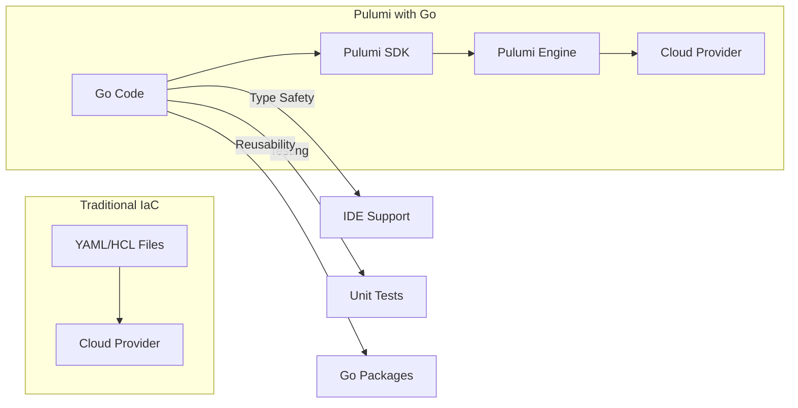
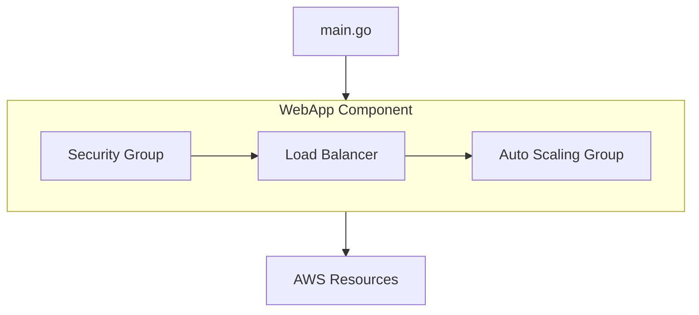
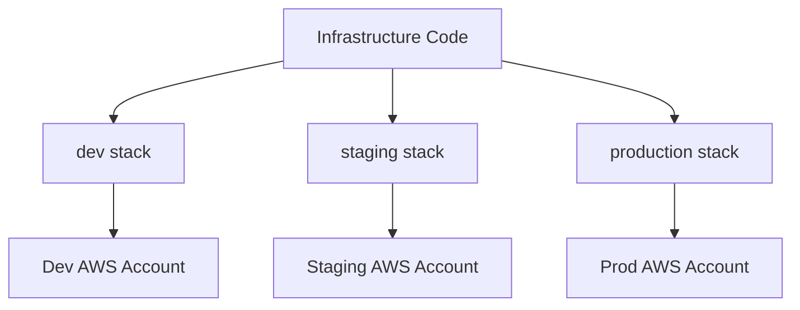

# How to Use Pulumi with Go

Author: [nawazdhandala](https://www.github.com/nawazdhandala)

Tags: Pulumi, Go, Infrastructure as Code, IaC, DevOps, Cloud, AWS, Kubernetes

Description: A comprehensive guide to using Pulumi with Go for infrastructure as code. Learn how to provision cloud resources, manage state, create reusable components, and deploy to AWS, Azure, GCP, and Kubernetes using Go.

---

Pulumi lets you define cloud infrastructure using real programming languages instead of configuration files. Go developers can leverage their existing skills, tooling, and IDE support to build, deploy, and manage infrastructure with type safety and full programmatic control.

## Why Pulumi with Go?



Key benefits of using Go with Pulumi:
1. **Type safety** - Catch errors at compile time, not deploy time
2. **IDE support** - Full autocomplete, refactoring, and documentation
3. **Testing** - Use Go's testing framework for infrastructure tests
4. **Reusability** - Share infrastructure as Go packages
5. **Familiarity** - No new language to learn for Go developers

## Installing Pulumi

### Install the Pulumi CLI

The CLI is required to run Pulumi programs and manage stacks.

```bash
# macOS using Homebrew
brew install pulumi/tap/pulumi

# Linux using curl
curl -fsSL https://get.pulumi.com | sh

# Windows using Chocolatey
choco install pulumi

# Verify installation
pulumi version
```

### Configure Your Backend

Pulumi stores state in a backend. You can use the free Pulumi Cloud or manage state yourself.

```bash
# Use Pulumi Cloud (free tier available)
pulumi login

# Or use local filesystem
pulumi login --local

# Or use S3
pulumi login s3://my-pulumi-state-bucket

# Or use Azure Blob Storage
pulumi login azblob://my-container
```

## Creating Your First Project

### Initialize a New Go Project

Start by creating a new Pulumi project with Go as the language.

```bash
# Create a new directory and initialize
mkdir my-infra && cd my-infra
pulumi new go --name my-infra --description "My infrastructure"

# Or use a template for a specific cloud
pulumi new aws-go
pulumi new azure-go
pulumi new gcp-go
pulumi new kubernetes-go
```

### Project Structure

A typical Pulumi Go project has the following structure.

```
my-infra/
├── main.go          # Your infrastructure code
├── go.mod           # Go module file
├── go.sum           # Go dependencies checksum
└── Pulumi.yaml      # Pulumi project configuration
```

### Understanding the Main File

The entry point for your Pulumi program follows a standard pattern.

```go
// main.go - Entry point for Pulumi program
package main

import (
    "github.com/pulumi/pulumi/sdk/v3/go/pulumi"
)

func main() {
    // pulumi.Run is the entry point that handles the Pulumi lifecycle
    pulumi.Run(func(ctx *pulumi.Context) error {
        // Your infrastructure code goes here

        // Return nil to indicate success, or an error if something fails
        return nil
    })
}
```

## Provisioning AWS Resources

### Setting Up AWS Provider

Configure AWS credentials before deploying resources.

```bash
# Configure AWS credentials
export AWS_ACCESS_KEY_ID=your-access-key
export AWS_SECRET_ACCESS_KEY=your-secret-key
export AWS_REGION=us-west-2

# Or use AWS profiles
export AWS_PROFILE=my-profile

# Set the AWS region in Pulumi config
pulumi config set aws:region us-west-2
```

### Creating an S3 Bucket

S3 buckets are commonly used for storage, hosting, and backups.

```go
// main.go - Creating an S3 bucket with Pulumi
package main

import (
    "github.com/pulumi/pulumi-aws/sdk/v6/go/aws/s3"
    "github.com/pulumi/pulumi/sdk/v3/go/pulumi"
)

func main() {
    pulumi.Run(func(ctx *pulumi.Context) error {
        // Create an S3 bucket with versioning enabled
        // The bucket name must be globally unique
        bucket, err := s3.NewBucket(ctx, "my-bucket", &s3.BucketArgs{
            // Enable versioning for data protection
            Versioning: &s3.BucketVersioningArgs{
                Enabled: pulumi.Bool(true),
            },
            // Add tags for resource organization
            Tags: pulumi.StringMap{
                "Environment": pulumi.String("production"),
                "ManagedBy":   pulumi.String("pulumi"),
            },
        })
        if err != nil {
            return err
        }

        // Export the bucket name so it can be referenced later
        ctx.Export("bucketName", bucket.ID())
        ctx.Export("bucketArn", bucket.Arn)

        return nil
    })
}
```

### Creating a VPC with Subnets

Network infrastructure is foundational for most cloud deployments.

```go
// main.go - Creating a VPC with public and private subnets
package main

import (
    "fmt"

    "github.com/pulumi/pulumi-aws/sdk/v6/go/aws/ec2"
    "github.com/pulumi/pulumi/sdk/v3/go/pulumi"
)

func main() {
    pulumi.Run(func(ctx *pulumi.Context) error {
        // Create the main VPC with DNS support enabled
        vpc, err := ec2.NewVpc(ctx, "main-vpc", &ec2.VpcArgs{
            CidrBlock:          pulumi.String("10.0.0.0/16"),
            EnableDnsHostnames: pulumi.Bool(true),
            EnableDnsSupport:   pulumi.Bool(true),
            Tags: pulumi.StringMap{
                "Name": pulumi.String("main-vpc"),
            },
        })
        if err != nil {
            return err
        }

        // Create an Internet Gateway for public subnet access
        igw, err := ec2.NewInternetGateway(ctx, "main-igw", &ec2.InternetGatewayArgs{
            VpcId: vpc.ID(),
            Tags: pulumi.StringMap{
                "Name": pulumi.String("main-igw"),
            },
        })
        if err != nil {
            return err
        }

        // Define availability zones and CIDR blocks for subnets
        azs := []string{"us-west-2a", "us-west-2b"}
        publicCidrs := []string{"10.0.1.0/24", "10.0.2.0/24"}
        privateCidrs := []string{"10.0.10.0/24", "10.0.11.0/24"}

        // Create public subnets in each availability zone
        var publicSubnets []*ec2.Subnet
        for i, az := range azs {
            subnet, err := ec2.NewSubnet(ctx, fmt.Sprintf("public-subnet-%d", i), &ec2.SubnetArgs{
                VpcId:               vpc.ID(),
                CidrBlock:           pulumi.String(publicCidrs[i]),
                AvailabilityZone:    pulumi.String(az),
                MapPublicIpOnLaunch: pulumi.Bool(true), // Auto-assign public IPs
                Tags: pulumi.StringMap{
                    "Name": pulumi.String(fmt.Sprintf("public-subnet-%d", i)),
                    "Type": pulumi.String("public"),
                },
            })
            if err != nil {
                return err
            }
            publicSubnets = append(publicSubnets, subnet)
        }

        // Create a route table for public subnets with internet access
        publicRt, err := ec2.NewRouteTable(ctx, "public-rt", &ec2.RouteTableArgs{
            VpcId: vpc.ID(),
            Routes: ec2.RouteTableRouteArray{
                &ec2.RouteTableRouteArgs{
                    CidrBlock: pulumi.String("0.0.0.0/0"),
                    GatewayId: igw.ID(),
                },
            },
            Tags: pulumi.StringMap{
                "Name": pulumi.String("public-rt"),
            },
        })
        if err != nil {
            return err
        }

        // Associate public subnets with the public route table
        for i, subnet := range publicSubnets {
            _, err := ec2.NewRouteTableAssociation(ctx, fmt.Sprintf("public-rta-%d", i), &ec2.RouteTableAssociationArgs{
                SubnetId:     subnet.ID(),
                RouteTableId: publicRt.ID(),
            })
            if err != nil {
                return err
            }
        }

        // Create private subnets without public IP assignment
        for i, az := range azs {
            _, err := ec2.NewSubnet(ctx, fmt.Sprintf("private-subnet-%d", i), &ec2.SubnetArgs{
                VpcId:            vpc.ID(),
                CidrBlock:        pulumi.String(privateCidrs[i]),
                AvailabilityZone: pulumi.String(az),
                Tags: pulumi.StringMap{
                    "Name": pulumi.String(fmt.Sprintf("private-subnet-%d", i)),
                    "Type": pulumi.String("private"),
                },
            })
            if err != nil {
                return err
            }
        }

        // Export VPC and subnet IDs for use in other stacks
        ctx.Export("vpcId", vpc.ID())

        return nil
    })
}
```

### Creating an EC2 Instance

Launching compute instances is a common infrastructure task.

```go
// main.go - Creating an EC2 instance with security group
package main

import (
    "github.com/pulumi/pulumi-aws/sdk/v6/go/aws/ec2"
    "github.com/pulumi/pulumi/sdk/v3/go/pulumi"
)

func main() {
    pulumi.Run(func(ctx *pulumi.Context) error {
        // Create a security group allowing SSH and HTTP access
        sg, err := ec2.NewSecurityGroup(ctx, "web-sg", &ec2.SecurityGroupArgs{
            Description: pulumi.String("Allow SSH and HTTP"),
            Ingress: ec2.SecurityGroupIngressArray{
                // Allow SSH from anywhere (restrict in production)
                &ec2.SecurityGroupIngressArgs{
                    Protocol:   pulumi.String("tcp"),
                    FromPort:   pulumi.Int(22),
                    ToPort:     pulumi.Int(22),
                    CidrBlocks: pulumi.StringArray{pulumi.String("0.0.0.0/0")},
                },
                // Allow HTTP traffic
                &ec2.SecurityGroupIngressArgs{
                    Protocol:   pulumi.String("tcp"),
                    FromPort:   pulumi.Int(80),
                    ToPort:     pulumi.Int(80),
                    CidrBlocks: pulumi.StringArray{pulumi.String("0.0.0.0/0")},
                },
            },
            // Allow all outbound traffic
            Egress: ec2.SecurityGroupEgressArray{
                &ec2.SecurityGroupEgressArgs{
                    Protocol:   pulumi.String("-1"),
                    FromPort:   pulumi.Int(0),
                    ToPort:     pulumi.Int(0),
                    CidrBlocks: pulumi.StringArray{pulumi.String("0.0.0.0/0")},
                },
            },
            Tags: pulumi.StringMap{
                "Name": pulumi.String("web-sg"),
            },
        })
        if err != nil {
            return err
        }

        // User data script to install and start nginx
        userData := `#!/bin/bash
yum update -y
yum install -y nginx
systemctl start nginx
systemctl enable nginx
echo "Hello from Pulumi!" > /usr/share/nginx/html/index.html
`

        // Create an EC2 instance running Amazon Linux 2
        instance, err := ec2.NewInstance(ctx, "web-server", &ec2.InstanceArgs{
            Ami:                 pulumi.String("ami-0c55b159cbfafe1f0"), // Amazon Linux 2
            InstanceType:        pulumi.String("t3.micro"),
            VpcSecurityGroupIds: pulumi.StringArray{sg.ID()},
            UserData:            pulumi.String(userData),
            Tags: pulumi.StringMap{
                "Name": pulumi.String("web-server"),
            },
        })
        if err != nil {
            return err
        }

        // Export the public IP and DNS name
        ctx.Export("publicIp", instance.PublicIp)
        ctx.Export("publicDns", instance.PublicDns)

        return nil
    })
}
```

## Working with Kubernetes

### Creating Kubernetes Resources

Pulumi can deploy Kubernetes resources directly using Go types.

```go
// main.go - Deploying an application to Kubernetes
package main

import (
    appsv1 "github.com/pulumi/pulumi-kubernetes/sdk/v4/go/kubernetes/apps/v1"
    corev1 "github.com/pulumi/pulumi-kubernetes/sdk/v4/go/kubernetes/core/v1"
    metav1 "github.com/pulumi/pulumi-kubernetes/sdk/v4/go/kubernetes/meta/v1"
    "github.com/pulumi/pulumi/sdk/v3/go/pulumi"
)

func main() {
    pulumi.Run(func(ctx *pulumi.Context) error {
        // Define labels used for selecting pods
        appLabels := pulumi.StringMap{
            "app": pulumi.String("nginx"),
        }

        // Create a Kubernetes Deployment for nginx
        deployment, err := appsv1.NewDeployment(ctx, "nginx-deployment", &appsv1.DeploymentArgs{
            Metadata: &metav1.ObjectMetaArgs{
                Name: pulumi.String("nginx"),
            },
            Spec: &appsv1.DeploymentSpecArgs{
                Replicas: pulumi.Int(3), // Run 3 replicas for high availability
                Selector: &metav1.LabelSelectorArgs{
                    MatchLabels: appLabels,
                },
                Template: &corev1.PodTemplateSpecArgs{
                    Metadata: &metav1.ObjectMetaArgs{
                        Labels: appLabels,
                    },
                    Spec: &corev1.PodSpecArgs{
                        Containers: corev1.ContainerArray{
                            &corev1.ContainerArgs{
                                Name:  pulumi.String("nginx"),
                                Image: pulumi.String("nginx:1.25"),
                                Ports: corev1.ContainerPortArray{
                                    &corev1.ContainerPortArgs{
                                        ContainerPort: pulumi.Int(80),
                                    },
                                },
                                // Set resource limits and requests
                                Resources: &corev1.ResourceRequirementsArgs{
                                    Limits: pulumi.StringMap{
                                        "cpu":    pulumi.String("100m"),
                                        "memory": pulumi.String("128Mi"),
                                    },
                                    Requests: pulumi.StringMap{
                                        "cpu":    pulumi.String("50m"),
                                        "memory": pulumi.String("64Mi"),
                                    },
                                },
                            },
                        },
                    },
                },
            },
        })
        if err != nil {
            return err
        }

        // Create a Service to expose the deployment
        service, err := corev1.NewService(ctx, "nginx-service", &corev1.ServiceArgs{
            Metadata: &metav1.ObjectMetaArgs{
                Name: pulumi.String("nginx"),
            },
            Spec: &corev1.ServiceSpecArgs{
                Type:     pulumi.String("LoadBalancer"),
                Selector: appLabels,
                Ports: corev1.ServicePortArray{
                    &corev1.ServicePortArgs{
                        Port:       pulumi.Int(80),
                        TargetPort: pulumi.Int(80),
                    },
                },
            },
        })
        if err != nil {
            return err
        }

        // Export the deployment name and service endpoint
        ctx.Export("deploymentName", deployment.Metadata.Name())
        ctx.Export("serviceEndpoint", service.Status.LoadBalancer().Ingress().Index(pulumi.Int(0)).Hostname())

        return nil
    })
}
```

### Creating an EKS Cluster

Managed Kubernetes on AWS requires several interconnected resources.

```go
// main.go - Creating an EKS cluster with managed node groups
package main

import (
    "github.com/pulumi/pulumi-aws/sdk/v6/go/aws/eks"
    "github.com/pulumi/pulumi-aws/sdk/v6/go/aws/iam"
    "github.com/pulumi/pulumi/sdk/v3/go/pulumi"
)

func main() {
    pulumi.Run(func(ctx *pulumi.Context) error {
        // Create an IAM role for the EKS cluster
        clusterRole, err := iam.NewRole(ctx, "eks-cluster-role", &iam.RoleArgs{
            AssumeRolePolicy: pulumi.String(`{
                "Version": "2012-10-17",
                "Statement": [{
                    "Effect": "Allow",
                    "Principal": {"Service": "eks.amazonaws.com"},
                    "Action": "sts:AssumeRole"
                }]
            }`),
        })
        if err != nil {
            return err
        }

        // Attach the required EKS cluster policy
        _, err = iam.NewRolePolicyAttachment(ctx, "eks-cluster-policy", &iam.RolePolicyAttachmentArgs{
            Role:      clusterRole.Name,
            PolicyArn: pulumi.String("arn:aws:iam::aws:policy/AmazonEKSClusterPolicy"),
        })
        if err != nil {
            return err
        }

        // Create the EKS cluster
        // Note: You need to provide valid subnet IDs from your VPC
        cluster, err := eks.NewCluster(ctx, "my-cluster", &eks.ClusterArgs{
            RoleArn: clusterRole.Arn,
            VpcConfig: &eks.ClusterVpcConfigArgs{
                SubnetIds: pulumi.StringArray{
                    pulumi.String("subnet-xxx"),
                    pulumi.String("subnet-yyy"),
                },
                EndpointPublicAccess:  pulumi.Bool(true),
                EndpointPrivateAccess: pulumi.Bool(true),
            },
            Version: pulumi.String("1.29"),
            Tags: pulumi.StringMap{
                "Environment": pulumi.String("production"),
            },
        })
        if err != nil {
            return err
        }

        // Create an IAM role for the node group
        nodeRole, err := iam.NewRole(ctx, "eks-node-role", &iam.RoleArgs{
            AssumeRolePolicy: pulumi.String(`{
                "Version": "2012-10-17",
                "Statement": [{
                    "Effect": "Allow",
                    "Principal": {"Service": "ec2.amazonaws.com"},
                    "Action": "sts:AssumeRole"
                }]
            }`),
        })
        if err != nil {
            return err
        }

        // Attach required policies for EKS worker nodes
        nodePolicies := []string{
            "arn:aws:iam::aws:policy/AmazonEKSWorkerNodePolicy",
            "arn:aws:iam::aws:policy/AmazonEKS_CNI_Policy",
            "arn:aws:iam::aws:policy/AmazonEC2ContainerRegistryReadOnly",
        }
        for i, policy := range nodePolicies {
            _, err = iam.NewRolePolicyAttachment(ctx, fmt.Sprintf("node-policy-%d", i), &iam.RolePolicyAttachmentArgs{
                Role:      nodeRole.Name,
                PolicyArn: pulumi.String(policy),
            })
            if err != nil {
                return err
            }
        }

        // Create a managed node group
        _, err = eks.NewNodeGroup(ctx, "my-node-group", &eks.NodeGroupArgs{
            ClusterName:   cluster.Name,
            NodeRoleArn:   nodeRole.Arn,
            SubnetIds: pulumi.StringArray{
                pulumi.String("subnet-xxx"),
                pulumi.String("subnet-yyy"),
            },
            ScalingConfig: &eks.NodeGroupScalingConfigArgs{
                DesiredSize: pulumi.Int(2),
                MaxSize:     pulumi.Int(4),
                MinSize:     pulumi.Int(1),
            },
            InstanceTypes: pulumi.StringArray{
                pulumi.String("t3.medium"),
            },
        })
        if err != nil {
            return err
        }

        // Export cluster details
        ctx.Export("clusterName", cluster.Name)
        ctx.Export("clusterEndpoint", cluster.Endpoint)
        ctx.Export("kubeconfig", generateKubeconfig(cluster))

        return nil
    })
}

// generateKubeconfig creates a kubeconfig for the EKS cluster
func generateKubeconfig(cluster *eks.Cluster) pulumi.StringOutput {
    return pulumi.Sprintf(`apiVersion: v1
clusters:
- cluster:
    server: %s
    certificate-authority-data: %s
  name: kubernetes
contexts:
- context:
    cluster: kubernetes
    user: aws
  name: aws
current-context: aws
kind: Config
users:
- name: aws
  user:
    exec:
      apiVersion: client.authentication.k8s.io/v1beta1
      command: aws
      args:
        - eks
        - get-token
        - --cluster-name
        - %s
`, cluster.Endpoint, cluster.CertificateAuthority.Data().Elem(), cluster.Name)
}
```

## Using Configuration and Secrets

### Managing Configuration

Pulumi configuration allows environment-specific values without code changes.

```bash
# Set configuration values
pulumi config set environment production
pulumi config set instanceType t3.large
pulumi config set replicas 3

# Set secret values (encrypted)
pulumi config set --secret dbPassword supersecret123
pulumi config set --secret apiKey my-api-key
```

Read configuration values in your Go code.

```go
// main.go - Using Pulumi configuration
package main

import (
    "github.com/pulumi/pulumi/sdk/v3/go/pulumi"
    "github.com/pulumi/pulumi/sdk/v3/go/pulumi/config"
)

func main() {
    pulumi.Run(func(ctx *pulumi.Context) error {
        // Create a config object for accessing configuration
        cfg := config.New(ctx, "")

        // Get required configuration values
        // Pulumi will error if these are not set
        environment := cfg.Require("environment")

        // Get optional configuration with a default value
        instanceType := cfg.Get("instanceType")
        if instanceType == "" {
            instanceType = "t3.micro"
        }

        // Get integer configuration
        replicas := cfg.GetInt("replicas")
        if replicas == 0 {
            replicas = 1
        }

        // Get secret configuration (automatically decrypted)
        dbPassword := cfg.RequireSecret("dbPassword")

        // Use the configuration values in your resources
        ctx.Export("environment", pulumi.String(environment))
        ctx.Export("instanceType", pulumi.String(instanceType))
        ctx.Export("replicas", pulumi.Int(replicas))
        // Secrets remain encrypted in the state
        ctx.Export("dbPasswordSet", dbPassword.ApplyT(func(p string) bool {
            return len(p) > 0
        }).(pulumi.BoolOutput))

        return nil
    })
}
```

### Structured Configuration

Use structured configuration for complex settings.

```go
// main.go - Using structured configuration
package main

import (
    "github.com/pulumi/pulumi/sdk/v3/go/pulumi"
    "github.com/pulumi/pulumi/sdk/v3/go/pulumi/config"
)

// DatabaseConfig holds database configuration settings
type DatabaseConfig struct {
    Host     string `json:"host"`
    Port     int    `json:"port"`
    Name     string `json:"name"`
    Username string `json:"username"`
}

func main() {
    pulumi.Run(func(ctx *pulumi.Context) error {
        cfg := config.New(ctx, "")

        // Load structured configuration
        var dbConfig DatabaseConfig
        cfg.RequireObject("database", &dbConfig)

        // Use the structured configuration
        ctx.Log.Info(fmt.Sprintf("Connecting to %s:%d", dbConfig.Host, dbConfig.Port), nil)

        return nil
    })
}
```

Set structured configuration using JSON.

```bash
pulumi config set --path database.host db.example.com
pulumi config set --path database.port 5432
pulumi config set --path database.name myapp
pulumi config set --path database.username admin
```

## Creating Reusable Components

### Component Resources

Components let you create reusable infrastructure patterns.



```go
// webapp/webapp.go - A reusable web application component
package webapp

import (
    "github.com/pulumi/pulumi-aws/sdk/v6/go/aws/ec2"
    "github.com/pulumi/pulumi-aws/sdk/v6/go/aws/lb"
    "github.com/pulumi/pulumi/sdk/v3/go/pulumi"
)

// WebAppArgs contains the arguments for the WebApp component
type WebAppArgs struct {
    // VpcId is the VPC to deploy into
    VpcId pulumi.StringInput
    // SubnetIds are the subnets for the load balancer
    SubnetIds pulumi.StringArrayInput
    // InstanceType is the EC2 instance type
    InstanceType string
    // MinSize is the minimum number of instances
    MinSize int
    // MaxSize is the maximum number of instances
    MaxSize int
    // Port is the application port
    Port int
}

// WebApp is a reusable component that creates a load-balanced web application
type WebApp struct {
    pulumi.ResourceState

    // SecurityGroup is the security group for the instances
    SecurityGroup *ec2.SecurityGroup
    // LoadBalancer is the application load balancer
    LoadBalancer *lb.LoadBalancer
    // DnsName is the DNS name of the load balancer
    DnsName pulumi.StringOutput
}

// NewWebApp creates a new WebApp component
func NewWebApp(ctx *pulumi.Context, name string, args *WebAppArgs, opts ...pulumi.ResourceOption) (*WebApp, error) {
    // Create a component resource to group all child resources
    component := &WebApp{}
    err := ctx.RegisterComponentResource("custom:webapp:WebApp", name, component, opts...)
    if err != nil {
        return nil, err
    }

    // All child resources should use this as their parent
    parentOpts := append(opts, pulumi.Parent(component))

    // Create a security group for the web servers
    sg, err := ec2.NewSecurityGroup(ctx, name+"-sg", &ec2.SecurityGroupArgs{
        VpcId:       args.VpcId,
        Description: pulumi.String("Security group for " + name),
        Ingress: ec2.SecurityGroupIngressArray{
            &ec2.SecurityGroupIngressArgs{
                Protocol:   pulumi.String("tcp"),
                FromPort:   pulumi.Int(args.Port),
                ToPort:     pulumi.Int(args.Port),
                CidrBlocks: pulumi.StringArray{pulumi.String("0.0.0.0/0")},
            },
        },
        Egress: ec2.SecurityGroupEgressArray{
            &ec2.SecurityGroupEgressArgs{
                Protocol:   pulumi.String("-1"),
                FromPort:   pulumi.Int(0),
                ToPort:     pulumi.Int(0),
                CidrBlocks: pulumi.StringArray{pulumi.String("0.0.0.0/0")},
            },
        },
    }, parentOpts...)
    if err != nil {
        return nil, err
    }
    component.SecurityGroup = sg

    // Create an Application Load Balancer
    alb, err := lb.NewLoadBalancer(ctx, name+"-alb", &lb.LoadBalancerArgs{
        LoadBalancerType: pulumi.String("application"),
        SecurityGroups:   pulumi.StringArray{sg.ID()},
        Subnets:          args.SubnetIds,
    }, parentOpts...)
    if err != nil {
        return nil, err
    }
    component.LoadBalancer = alb
    component.DnsName = alb.DnsName

    // Register outputs on the component
    ctx.RegisterResourceOutputs(component, pulumi.Map{
        "securityGroupId": sg.ID(),
        "loadBalancerArn": alb.Arn,
        "dnsName":         alb.DnsName,
    })

    return component, nil
}
```

Use the component in your main program.

```go
// main.go - Using the WebApp component
package main

import (
    "github.com/pulumi/pulumi/sdk/v3/go/pulumi"
    "myinfra/webapp"
)

func main() {
    pulumi.Run(func(ctx *pulumi.Context) error {
        // Create a web application using the reusable component
        app, err := webapp.NewWebApp(ctx, "my-app", &webapp.WebAppArgs{
            VpcId:        pulumi.String("vpc-xxx"),
            SubnetIds:    pulumi.StringArray{pulumi.String("subnet-xxx"), pulumi.String("subnet-yyy")},
            InstanceType: "t3.small",
            MinSize:      2,
            MaxSize:      10,
            Port:         8080,
        })
        if err != nil {
            return err
        }

        ctx.Export("url", pulumi.Sprintf("http://%s", app.DnsName))

        return nil
    })
}
```

## Testing Infrastructure Code

### Unit Testing with Mocks

Test your infrastructure code without deploying real resources.

```go
// main_test.go - Unit tests for infrastructure code
package main

import (
    "sync"
    "testing"

    "github.com/pulumi/pulumi-aws/sdk/v6/go/aws/s3"
    "github.com/pulumi/pulumi/sdk/v3/go/common/resource"
    "github.com/pulumi/pulumi/sdk/v3/go/pulumi"
    "github.com/stretchr/testify/assert"
)

// Mocks simulates the Pulumi engine for testing
type Mocks int

// NewResource mocks resource creation
func (Mocks) NewResource(args pulumi.MockResourceArgs) (string, resource.PropertyMap, error) {
    // Return mock values based on resource type
    outputs := args.Inputs.Mappable()

    // Add computed properties that would normally come from the cloud provider
    if args.TypeToken == "aws:s3/bucket:Bucket" {
        outputs["id"] = "mock-bucket-id"
        outputs["arn"] = "arn:aws:s3:::mock-bucket"
        outputs["bucketDomainName"] = "mock-bucket.s3.amazonaws.com"
    }

    return args.Name + "-id", resource.NewPropertyMapFromMap(outputs), nil
}

// Call mocks function invocations
func (Mocks) Call(args pulumi.MockCallArgs) (resource.PropertyMap, error) {
    return resource.PropertyMap{}, nil
}

func TestS3BucketHasVersioning(t *testing.T) {
    err := pulumi.RunErr(func(ctx *pulumi.Context) error {
        // Create the bucket
        bucket, err := s3.NewBucket(ctx, "test-bucket", &s3.BucketArgs{
            Versioning: &s3.BucketVersioningArgs{
                Enabled: pulumi.Bool(true),
            },
        })
        if err != nil {
            return err
        }

        // Test that versioning is enabled
        var wg sync.WaitGroup
        wg.Add(1)

        pulumi.All(bucket.Versioning).ApplyT(func(args []interface{}) error {
            versioning := args[0].(*s3.BucketVersioning)
            assert.True(t, versioning.Enabled)
            wg.Done()
            return nil
        })

        wg.Wait()
        return nil
    }, pulumi.WithMocks("project", "stack", Mocks(0)))

    assert.NoError(t, err)
}

func TestS3BucketHasTags(t *testing.T) {
    err := pulumi.RunErr(func(ctx *pulumi.Context) error {
        bucket, err := s3.NewBucket(ctx, "test-bucket", &s3.BucketArgs{
            Tags: pulumi.StringMap{
                "Environment": pulumi.String("test"),
                "ManagedBy":   pulumi.String("pulumi"),
            },
        })
        if err != nil {
            return err
        }

        var wg sync.WaitGroup
        wg.Add(1)

        bucket.Tags.ApplyT(func(tags map[string]string) error {
            assert.Equal(t, "test", tags["Environment"])
            assert.Equal(t, "pulumi", tags["ManagedBy"])
            wg.Done()
            return nil
        })

        wg.Wait()
        return nil
    }, pulumi.WithMocks("project", "stack", Mocks(0)))

    assert.NoError(t, err)
}
```

Run the tests with the standard Go test command.

```bash
go test -v ./...
```

## Managing Multiple Environments

### Stack Management

Pulumi uses stacks to manage multiple environments like development, staging, and production.



```bash
# Create stacks for each environment
pulumi stack init dev
pulumi stack init staging
pulumi stack init production

# Set environment-specific configuration
pulumi stack select dev
pulumi config set instanceType t3.micro
pulumi config set replicas 1

pulumi stack select production
pulumi config set instanceType t3.large
pulumi config set replicas 3

# Deploy to a specific environment
pulumi stack select dev
pulumi up

# List all stacks
pulumi stack ls
```

### Environment-Aware Code

Write code that adapts to the current stack.

```go
// main.go - Environment-aware infrastructure
package main

import (
    "strings"

    "github.com/pulumi/pulumi-aws/sdk/v6/go/aws/ec2"
    "github.com/pulumi/pulumi/sdk/v3/go/pulumi"
    "github.com/pulumi/pulumi/sdk/v3/go/pulumi/config"
)

func main() {
    pulumi.Run(func(ctx *pulumi.Context) error {
        // Get the current stack name
        stackName := ctx.Stack()

        // Determine environment settings based on stack
        var instanceType string
        var minSize, maxSize int

        switch {
        case strings.Contains(stackName, "prod"):
            instanceType = "t3.large"
            minSize = 3
            maxSize = 10
        case strings.Contains(stackName, "staging"):
            instanceType = "t3.medium"
            minSize = 2
            maxSize = 5
        default: // dev
            instanceType = "t3.micro"
            minSize = 1
            maxSize = 2
        }

        // Allow configuration to override defaults
        cfg := config.New(ctx, "")
        if override := cfg.Get("instanceType"); override != "" {
            instanceType = override
        }

        ctx.Log.Info("Deploying to "+stackName, &pulumi.LogArgs{})
        ctx.Log.Info("Instance type: "+instanceType, &pulumi.LogArgs{})

        // Create resources with environment-specific settings
        _, err := ec2.NewInstance(ctx, "web-server", &ec2.InstanceArgs{
            Ami:          pulumi.String("ami-0c55b159cbfafe1f0"),
            InstanceType: pulumi.String(instanceType),
            Tags: pulumi.StringMap{
                "Name":        pulumi.String("web-server-" + stackName),
                "Environment": pulumi.String(stackName),
            },
        })
        if err != nil {
            return err
        }

        ctx.Export("environment", pulumi.String(stackName))
        ctx.Export("instanceType", pulumi.String(instanceType))
        ctx.Export("scalingConfig", pulumi.Sprintf("min=%d, max=%d", minSize, maxSize))

        return nil
    })
}
```

## Common Operations

### Deploying and Managing Infrastructure

The Pulumi CLI provides commands for the full infrastructure lifecycle.

```bash
# Preview changes without applying
pulumi preview

# Deploy changes
pulumi up

# Deploy with auto-approval (use in CI/CD)
pulumi up --yes

# View current stack outputs
pulumi stack output

# View specific output
pulumi stack output bucketName

# Refresh state from cloud provider
pulumi refresh

# Destroy all resources
pulumi destroy

# Export stack state
pulumi stack export --file state.json

# Import existing resources
pulumi import aws:s3/bucket:Bucket my-bucket existing-bucket-name
```

### Continuous Deployment

Integrate Pulumi into your CI/CD pipeline for automated deployments.

```yaml
# .github/workflows/deploy.yml
name: Deploy Infrastructure

on:
  push:
    branches: [main]
  pull_request:
    branches: [main]

jobs:
  preview:
    name: Preview
    runs-on: ubuntu-latest
    if: github.event_name == 'pull_request'
    steps:
      - uses: actions/checkout@v4

      - name: Setup Go
        uses: actions/setup-go@v5
        with:
          go-version: '1.22'

      - name: Install Pulumi
        uses: pulumi/actions@v5

      - name: Preview Changes
        uses: pulumi/actions@v5
        with:
          command: preview
          stack-name: staging
        env:
          PULUMI_ACCESS_TOKEN: ${{ secrets.PULUMI_ACCESS_TOKEN }}
          AWS_ACCESS_KEY_ID: ${{ secrets.AWS_ACCESS_KEY_ID }}
          AWS_SECRET_ACCESS_KEY: ${{ secrets.AWS_SECRET_ACCESS_KEY }}

  deploy:
    name: Deploy
    runs-on: ubuntu-latest
    if: github.ref == 'refs/heads/main' && github.event_name == 'push'
    steps:
      - uses: actions/checkout@v4

      - name: Setup Go
        uses: actions/setup-go@v5
        with:
          go-version: '1.22'

      - name: Deploy to Production
        uses: pulumi/actions@v5
        with:
          command: up
          stack-name: production
        env:
          PULUMI_ACCESS_TOKEN: ${{ secrets.PULUMI_ACCESS_TOKEN }}
          AWS_ACCESS_KEY_ID: ${{ secrets.AWS_ACCESS_KEY_ID }}
          AWS_SECRET_ACCESS_KEY: ${{ secrets.AWS_SECRET_ACCESS_KEY }}
```

## Best Practices

### 1. Use Explicit Resource Names

Pulumi auto-generates unique names by default. Use explicit names for predictable resources.

```go
// Auto-generated name (includes random suffix)
bucket, _ := s3.NewBucket(ctx, "mybucket", nil)
// Creates: mybucket-abc123

// Explicit name (use for stateful resources)
bucket, _ := s3.NewBucket(ctx, "mybucket", &s3.BucketArgs{
    Bucket: pulumi.String("my-company-prod-logs"),
})
```

### 2. Handle Errors Properly

Always check and handle errors from Pulumi operations.

```go
resource, err := s3.NewBucket(ctx, "bucket", args)
if err != nil {
    // Log context and return the error
    return fmt.Errorf("failed to create bucket: %w", err)
}
```

### 3. Use Stack References

Share outputs between stacks using stack references.

```go
// In the networking stack
ctx.Export("vpcId", vpc.ID())
ctx.Export("subnetIds", publicSubnets)

// In the application stack
func main() {
    pulumi.Run(func(ctx *pulumi.Context) error {
        // Reference the networking stack
        networkStack, err := pulumi.NewStackReference(ctx, "myorg/networking/production", nil)
        if err != nil {
            return err
        }

        // Get outputs from the referenced stack
        vpcId := networkStack.GetStringOutput(pulumi.String("vpcId"))
        subnetIds := networkStack.GetOutput(pulumi.String("subnetIds"))

        // Use the values in this stack
        _, err = ec2.NewInstance(ctx, "server", &ec2.InstanceArgs{
            SubnetId: subnetIds.Index(pulumi.Int(0)),
            // ...
        })

        return err
    })
}
```

### 4. Organize with Projects and Stacks

Structure your infrastructure for maintainability.

```
infrastructure/
├── networking/           # VPCs, subnets, security groups
│   ├── main.go
│   └── Pulumi.yaml
├── database/            # RDS, ElastiCache, etc.
│   ├── main.go
│   └── Pulumi.yaml
├── kubernetes/          # EKS cluster and add-ons
│   ├── main.go
│   └── Pulumi.yaml
└── applications/        # Application deployments
    ├── main.go
    └── Pulumi.yaml
```

---

Pulumi with Go brings the power of a real programming language to infrastructure management. You get type safety, testability, and the ability to use familiar tools and patterns. Start with simple resources, build reusable components, and gradually adopt more advanced patterns as your infrastructure grows.

