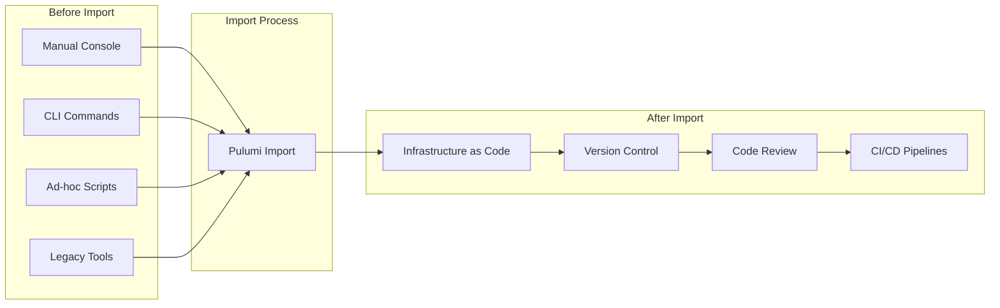
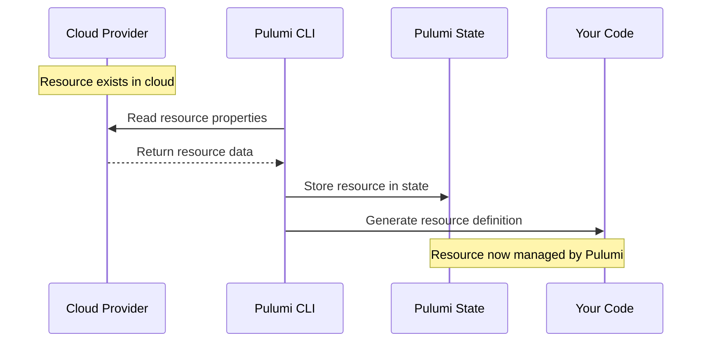
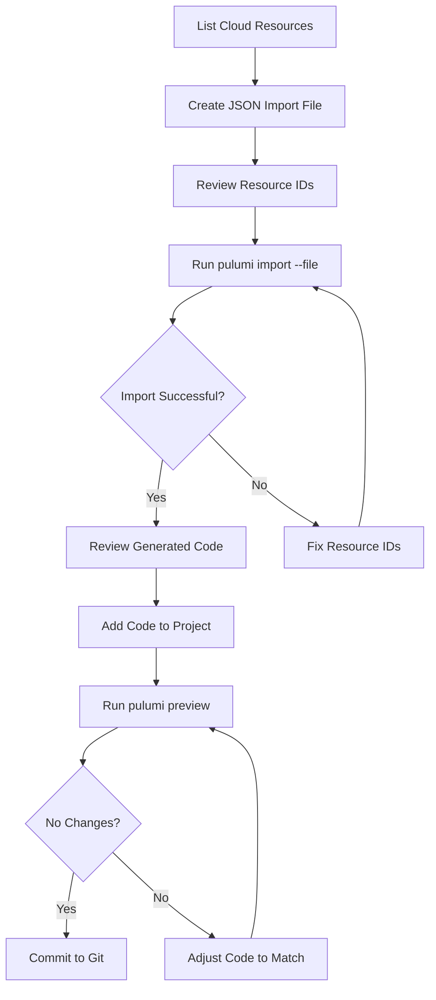
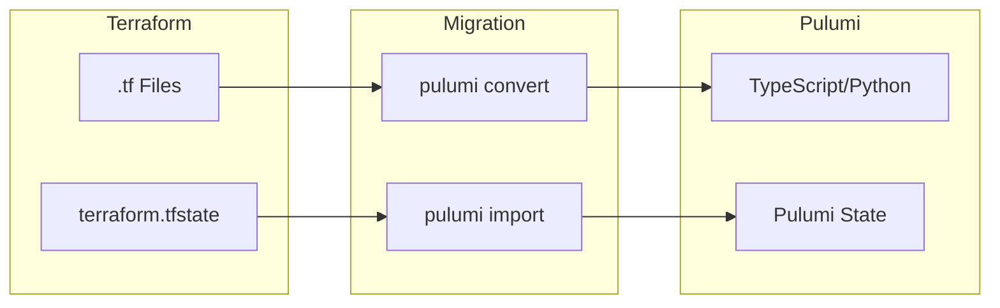
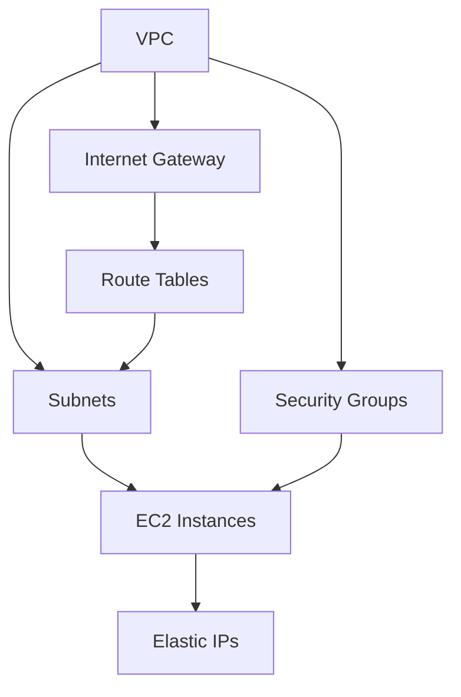
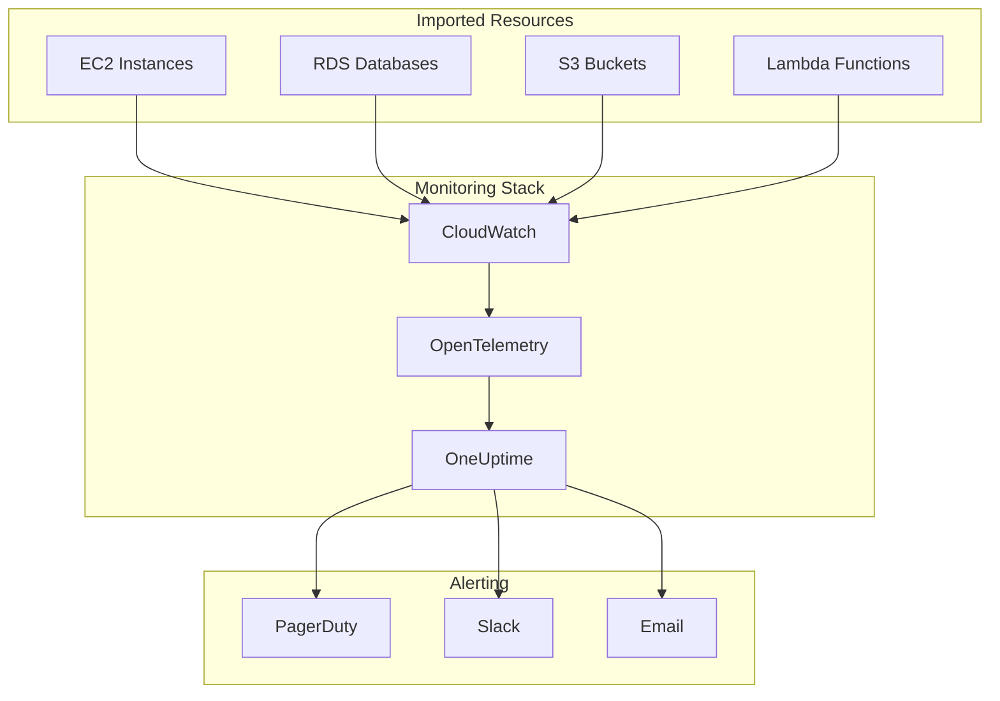

# How to Import Existing Resources into Pulumi

Author: [nawazdhandala](https://www.github.com/nawazdhandala)

Tags: Pulumi, Infrastructure as Code, IaC, DevOps, Cloud, AWS, Azure, GCP, Resource Import, Migration

Description: Learn how to import existing cloud resources into Pulumi for Infrastructure as Code management. Covers manual imports, bulk imports, generated code, and best practices for migrating legacy infrastructure.

---

Managing cloud infrastructure that was created manually or through other tools can be challenging. Pulumi provides powerful import capabilities that let you bring existing resources under IaC management without recreating them. Organizations can adopt Pulumi incrementally while preserving their current infrastructure.

---

## Table of Contents

1. Why Import Existing Resources?
2. Understanding the Import Process
3. Prerequisites
4. Manual Resource Import
5. Bulk Import with pulumi import
6. Generating Code from Imports
7. Import from Terraform State
8. Handling Import Challenges
9. Best Practices
10. Monitoring Imported Infrastructure

---

## 1. Why Import Existing Resources?

Teams often have cloud resources created through various methods: manual console clicks, CLI commands, scripts, or legacy tools. Importing these resources into Pulumi provides several benefits:



### Key Benefits

| Benefit | Description |
|---------|-------------|
| Version Control | Track all infrastructure changes in Git |
| Code Review | Review infrastructure changes before applying |
| Consistency | Apply the same standards across all resources |
| Automation | Deploy through CI/CD pipelines |
| Documentation | Code serves as living documentation |
| Collaboration | Teams can work together on infrastructure |

---

## 2. Understanding the Import Process

Pulumi import works by connecting existing cloud resources to resource definitions in your code. The import process does not modify the actual cloud resource, it only adds the resource to Pulumi's state.



### Import Flow

1. **Identify** - Find the resource ID in your cloud provider
2. **Import** - Run the import command to add to state
3. **Generate** - Create or update code to match the resource
4. **Verify** - Run `pulumi preview` to confirm no changes
5. **Commit** - Add the code to version control

---

## 3. Prerequisites

Before importing resources, ensure your environment is properly configured.

### Install Pulumi CLI

The following commands install Pulumi on various operating systems.

```bash
# macOS (using Homebrew)
brew install pulumi

# Linux (using curl)
curl -fsSL https://get.pulumi.com | sh

# Windows (using Chocolatey)
choco install pulumi
```

### Configure Cloud Credentials

Each cloud provider requires authentication. Set up credentials for your target provider.

```bash
# AWS - Configure credentials
aws configure

# Or export environment variables
export AWS_ACCESS_KEY_ID="your-access-key"
export AWS_SECRET_ACCESS_KEY="your-secret-key"
export AWS_REGION="us-west-2"

# Azure - Login and set subscription
az login
az account set --subscription "your-subscription-id"

# GCP - Authenticate and set project
gcloud auth application-default login
gcloud config set project your-project-id
```

### Initialize a Pulumi Project

Create a new project or use an existing one for imports.

```bash
# Create a new TypeScript project
pulumi new typescript --name my-infrastructure --yes

# Or create a Python project
pulumi new python --name my-infrastructure --yes
```

---

## 4. Manual Resource Import

The `pulumi import` command adds a single resource to your Pulumi state. You need the resource type, name, and cloud provider ID.

### Import Syntax

```bash
pulumi import <type> <name> <id>
```

- **type** - The Pulumi resource type (e.g., `aws:s3/bucket:Bucket`)
- **name** - The logical name for the resource in your code
- **id** - The cloud provider's identifier for the resource

### Import an AWS S3 Bucket

Find the bucket name in the AWS Console or CLI, then import it.

```bash
# List existing buckets to find the name
aws s3 ls

# Import the bucket into Pulumi
pulumi import aws:s3/bucket:Bucket myBucket my-existing-bucket-name
```

Pulumi outputs generated code after a successful import.

```typescript
// Generated code for the imported S3 bucket
// Add this to your index.ts file
import * as pulumi from "@pulumi/pulumi";
import * as aws from "@pulumi/aws";

const myBucket = new aws.s3.Bucket("myBucket", {
    bucket: "my-existing-bucket-name",
    acl: "private",
    tags: {
        Environment: "production",
        Team: "platform",
    },
}, {
    // The protect option prevents accidental deletion
    protect: true,
});
```

### Import an AWS EC2 Instance

EC2 instances use the instance ID as the import identifier.

```bash
# Find instance IDs
aws ec2 describe-instances --query 'Reservations[*].Instances[*].InstanceId' --output text

# Import the instance
pulumi import aws:ec2/instance:Instance webServer i-0abc123def456789
```

### Import an Azure Resource Group

Azure resources use the full resource ID from the Azure portal.

```bash
# Find resource group ID
az group show --name my-resource-group --query id --output tsv

# Import the resource group
pulumi import azure-native:resources:ResourceGroup myRg /subscriptions/xxx/resourceGroups/my-resource-group
```

### Import a GCP Compute Instance

GCP instances require the project, zone, and instance name.

```bash
# List instances
gcloud compute instances list

# Import format: projects/{project}/zones/{zone}/instances/{name}
pulumi import gcp:compute/instance:Instance myVm projects/my-project/zones/us-central1-a/instances/my-instance
```

---

## 5. Bulk Import with pulumi import

Importing many resources individually is tedious. Pulumi supports bulk imports using a JSON file.

### Create an Import File

Define all resources to import in a JSON file.

```json
{
    "resources": [
        {
            "type": "aws:s3/bucket:Bucket",
            "name": "dataBucket",
            "id": "my-data-bucket"
        },
        {
            "type": "aws:s3/bucket:Bucket",
            "name": "logsBucket",
            "id": "my-logs-bucket"
        },
        {
            "type": "aws:ec2/instance:Instance",
            "name": "webServer",
            "id": "i-0abc123def456789"
        },
        {
            "type": "aws:ec2/instance:Instance",
            "name": "apiServer",
            "id": "i-0def456789abc123"
        },
        {
            "type": "aws:rds/instance:Instance",
            "name": "mainDatabase",
            "id": "my-production-db"
        },
        {
            "type": "aws:ec2/securityGroup:SecurityGroup",
            "name": "webSg",
            "id": "sg-0abc123456789def"
        }
    ]
}
```

### Run Bulk Import

Execute the import command with the JSON file.

```bash
# Import all resources from the file
pulumi import --file resources.json

# Generate code output to a file
pulumi import --file resources.json --out generated-resources.ts
```

### Bulk Import Workflow



---

## 6. Generating Code from Imports

Pulumi can generate complete, compilable code from imports. Use the `--generate-code` flag to create ready-to-use resource definitions.

### Generate TypeScript Code

The following command imports resources and generates TypeScript code.

```bash
# Import with code generation
pulumi import aws:s3/bucket:Bucket myBucket my-bucket-name --generate-code=true --out index.ts
```

### Generated Code Structure

Pulumi generates well-structured code with all properties.

```typescript
// Auto-generated by pulumi import
// Review and customize as needed
import * as pulumi from "@pulumi/pulumi";
import * as aws from "@pulumi/aws";

// S3 bucket for application data storage
// Originally created: 2024-03-15
const myBucket = new aws.s3.Bucket("myBucket", {
    bucket: "my-bucket-name",
    acl: "private",
    // Versioning configuration keeps history of all objects
    versioning: {
        enabled: true,
    },
    // Server-side encryption protects data at rest
    serverSideEncryptionConfiguration: {
        rule: {
            applyServerSideEncryptionByDefault: {
                sseAlgorithm: "aws:kms",
                kmsMasterKeyId: "arn:aws:kms:us-west-2:123456789:key/xxx",
            },
        },
    },
    // Lifecycle rules manage object retention
    lifecycleRules: [{
        enabled: true,
        expiration: {
            days: 365,
        },
        transitions: [{
            days: 30,
            storageClass: "STANDARD_IA",
        }, {
            days: 90,
            storageClass: "GLACIER",
        }],
    }],
    tags: {
        Environment: "production",
        Team: "data-engineering",
        ManagedBy: "pulumi",
    },
}, {
    // Import options
    protect: true,
});

// Export bucket ARN for use by other stacks
export const bucketArn = myBucket.arn;
export const bucketDomainName = myBucket.bucketDomainName;
```

### Generate Python Code

Python projects can also receive generated code.

```bash
pulumi import aws:ec2/instance:Instance webServer i-0abc123 --generate-code=true --out __main__.py
```

```python
# Auto-generated by pulumi import
import pulumi
import pulumi_aws as aws

# Web server instance running the application frontend
web_server = aws.ec2.Instance("webServer",
    ami="ami-0abc123456789def",
    instance_type="t3.medium",
    subnet_id="subnet-0abc123",
    vpc_security_group_ids=["sg-0abc123"],
    key_name="production-key",
    # Root volume configuration
    root_block_device=aws.ec2.InstanceRootBlockDeviceArgs(
        volume_type="gp3",
        volume_size=100,
        encrypted=True,
    ),
    tags={
        "Name": "web-server-01",
        "Environment": "production",
        "ManagedBy": "pulumi",
    },
    opts=pulumi.ResourceOptions(
        protect=True,
    ))

# Export instance details
pulumi.export("instanceId", web_server.id)
pulumi.export("publicIp", web_server.public_ip)
pulumi.export("privateIp", web_server.private_ip)
```

---

## 7. Import from Terraform State

Organizations migrating from Terraform can import resources directly from Terraform state files.

### Terraform to Pulumi Migration Flow



### Convert Terraform Code

Use `pulumi convert` to translate Terraform HCL to Pulumi code.

```bash
# Navigate to Terraform directory
cd /path/to/terraform/project

# Convert to TypeScript
pulumi convert --from terraform --language typescript --out ../pulumi-project

# Convert to Python
pulumi convert --from terraform --language python --out ../pulumi-project
```

### Import Terraform State

After converting code, import the state to avoid recreating resources.

```bash
# Initialize the new Pulumi project
cd ../pulumi-project
pulumi stack init production

# Import from Terraform state file
pulumi import --from terraform /path/to/terraform.tfstate
```

### Handle State Import Conflicts

When importing, you may encounter naming conflicts. Resolve them with explicit mappings.

```bash
# Create a mapping file for complex migrations
cat > terraform-mapping.json << 'EOF'
{
    "aws_s3_bucket.data": "dataBucket",
    "aws_s3_bucket.logs": "logsBucket",
    "aws_instance.web[0]": "webServer1",
    "aws_instance.web[1]": "webServer2"
}
EOF

# Import with mapping
pulumi import --from terraform terraform.tfstate --mapping terraform-mapping.json
```

---

## 8. Handling Import Challenges

Importing resources can present various challenges. Here are common issues and solutions.

### Challenge 1: Finding Resource IDs

Different providers use different ID formats. Use provider CLIs to find IDs.

```bash
# AWS - Various resource ID commands
# S3 buckets use the bucket name
aws s3api list-buckets --query 'Buckets[*].Name'

# EC2 instances use instance IDs
aws ec2 describe-instances --query 'Reservations[*].Instances[*].[InstanceId,Tags[?Key==`Name`].Value|[0]]' --output table

# RDS instances use the DB identifier
aws rds describe-db-instances --query 'DBInstances[*].DBInstanceIdentifier'

# Lambda functions use the function name
aws lambda list-functions --query 'Functions[*].FunctionName'

# Azure - Resource IDs include full path
az resource list --query '[*].{Name:name, Id:id}' --output table

# GCP - Resources use project/zone/name format
gcloud compute instances list --format='table(name,zone,status)'
```

### Challenge 2: Missing Properties

Imported resources may have properties your code does not specify. Always review generated code.

```typescript
// Initial import may generate minimal code
const myBucket = new aws.s3.Bucket("myBucket", {
    bucket: "my-bucket",
});

// Run preview to see differences
// pulumi preview shows: ~ update: cors rules, lifecycle rules

// Add missing properties to match actual resource
const myBucket = new aws.s3.Bucket("myBucket", {
    bucket: "my-bucket",
    // Add CORS configuration that exists on the actual bucket
    corsRules: [{
        allowedHeaders: ["*"],
        allowedMethods: ["GET", "PUT", "POST"],
        allowedOrigins: ["https://example.com"],
        maxAgeSeconds: 3000,
    }],
    // Add lifecycle rules present on the bucket
    lifecycleRules: [{
        enabled: true,
        expiration: { days: 90 },
    }],
});
```

### Challenge 3: Dependent Resources

Some resources depend on others. Import in the correct order.



Import resources in dependency order.

```bash
# 1. Import VPC first
pulumi import aws:ec2/vpc:Vpc mainVpc vpc-0abc123

# 2. Import subnets (depend on VPC)
pulumi import aws:ec2/subnet:Subnet publicSubnet subnet-0abc123

# 3. Import security groups (depend on VPC)
pulumi import aws:ec2/securityGroup:SecurityGroup webSg sg-0abc123

# 4. Import instances (depend on subnet and security group)
pulumi import aws:ec2/instance:Instance webServer i-0abc123
```

### Challenge 4: Resources with Special Characters

Some resource names contain characters that need escaping.

```bash
# URL-encode special characters in Azure resource IDs
# Original: /subscriptions/xxx/resourceGroups/my-rg/providers/Microsoft.Web/sites/my-app
# If app name has special chars, URL-encode them

pulumi import azure-native:web:WebApp myApp "/subscriptions/xxx/resourceGroups/my-rg/providers/Microsoft.Web/sites/my%2Dapp"
```

### Challenge 5: Import Verification

Always verify imports with `pulumi preview` before making changes.

```bash
# After importing, verify no changes are planned
pulumi preview

# Expected output for successful import:
# Previewing update (production):
#      Type                 Name              Plan
#      pulumi:pulumi:Stack  my-infra-prod
#
# Resources:
#     5 unchanged

# If changes are shown, adjust code to match imported state
pulumi preview --diff  # Shows detailed property differences
```

---

## 9. Best Practices

Follow these practices for successful resource imports.

### Use Protection for Critical Resources

Protect imported resources from accidental deletion.

```typescript
// Add protect option to prevent accidental deletion
const database = new aws.rds.Instance("mainDb", {
    // ... properties
}, {
    protect: true,  // Prevents pulumi destroy from removing this resource
});
```

### Organize Imports by Component

Structure your code logically after importing.

```
my-infrastructure/
├── index.ts           # Main entry point
├── networking/
│   ├── vpc.ts         # VPC and subnets
│   └── security.ts    # Security groups
├── compute/
│   ├── instances.ts   # EC2 instances
│   └── autoscaling.ts # ASG configuration
├── database/
│   └── rds.ts         # RDS instances
└── storage/
    └── s3.ts          # S3 buckets
```

### Tag Resources After Import

Add consistent tags to track Pulumi-managed resources.

```typescript
// Create a tagging function for consistency
function addStandardTags(baseTags: Record<string, string>): Record<string, string> {
    return {
        ...baseTags,
        ManagedBy: "pulumi",
        Project: pulumi.getProject(),
        Stack: pulumi.getStack(),
        ImportedAt: "2026-02-02",
    };
}

// Apply to all resources
const myBucket = new aws.s3.Bucket("myBucket", {
    bucket: "my-bucket",
    tags: addStandardTags({
        Environment: "production",
        Team: "platform",
    }),
});
```

### Document Import History

Track what was imported and when.

```typescript
// index.ts - Document import history
/**
 * Infrastructure Import Log
 *
 * 2026-02-02: Initial import from manual AWS resources
 * - VPC (vpc-0abc123) - Main production VPC
 * - Subnets (subnet-0abc, subnet-0def) - Public subnets
 * - Security Groups (sg-0abc) - Web server SG
 * - EC2 Instances (i-0abc, i-0def) - Web servers
 * - RDS Instance (prod-db) - Primary database
 * - S3 Buckets (data-bucket, logs-bucket)
 *
 * All resources imported with protect: true
 * Original creation dates preserved in tags
 */
```

### Create Import Scripts

Automate recurring import tasks with scripts.

```bash
#!/bin/bash
# import-aws-resources.sh
# Bulk import script for AWS resources

set -e

echo "Discovering AWS resources..."

# Get all S3 buckets
echo "Finding S3 buckets..."
aws s3api list-buckets --query 'Buckets[*].Name' --output text | tr '\t' '\n' > buckets.txt

# Generate import JSON
echo '{"resources": [' > import.json
first=true

while read bucket; do
    if [ "$first" = true ]; then
        first=false
    else
        echo ',' >> import.json
    fi

    # Create safe name from bucket name
    safe_name=$(echo "$bucket" | tr '-' '_' | tr '.' '_')

    cat >> import.json << EOF
    {
        "type": "aws:s3/bucket:Bucket",
        "name": "${safe_name}",
        "id": "${bucket}"
    }
EOF
done < buckets.txt

echo ']}' >> import.json

echo "Generated import.json with $(wc -l < buckets.txt) buckets"

# Run import
pulumi import --file import.json --yes

echo "Import complete!"
```

### Verify State After Import

Confirm all resources are properly tracked.

```bash
# List all resources in the stack
pulumi stack --show-urns

# Export state for backup
pulumi stack export > backup-state.json

# View specific resource details
pulumi stack --show-urns | grep "aws:s3/bucket"
```

---

## 10. Monitoring Imported Infrastructure

After importing resources, set up monitoring to track their health and performance.

### Integration with Observability Tools

Connect your imported infrastructure to monitoring platforms for visibility.



### Export Resource Information

Export key details for monitoring configuration.

```typescript
// Export resource ARNs and endpoints for monitoring setup
export const resourceInventory = {
    // EC2 Instances
    webServers: {
        ids: [webServer1.id, webServer2.id],
        privateIps: [webServer1.privateIp, webServer2.privateIp],
    },

    // RDS Database
    database: {
        endpoint: mainDb.endpoint,
        port: mainDb.port,
        identifier: mainDb.identifier,
    },

    // S3 Buckets
    buckets: {
        data: dataBucket.bucket,
        logs: logsBucket.bucket,
    },

    // CloudWatch Log Groups
    logGroups: [
        "/aws/ec2/web-servers",
        "/aws/rds/production",
    ],
};
```

### Track Infrastructure Drift

Monitor for changes made outside of Pulumi.

```bash
# Detect drift between code and actual infrastructure
pulumi refresh --preview-only

# If drift detected, either:
# 1. Update code to match actual state
# 2. Run pulumi up to revert changes

# Automate drift detection in CI/CD
# .github/workflows/drift-detection.yml
```

```yaml
# GitHub Actions workflow for drift detection
name: Drift Detection
on:
  schedule:
    - cron: '0 */6 * * *'  # Every 6 hours

jobs:
  detect-drift:
    runs-on: ubuntu-latest
    steps:
      - uses: actions/checkout@v4

      - name: Setup Pulumi
        uses: pulumi/actions@v5

      - name: Check for Drift
        run: |
          pulumi refresh --preview-only --expect-no-changes
        env:
          PULUMI_ACCESS_TOKEN: ${{ secrets.PULUMI_ACCESS_TOKEN }}
          AWS_ACCESS_KEY_ID: ${{ secrets.AWS_ACCESS_KEY_ID }}
          AWS_SECRET_ACCESS_KEY: ${{ secrets.AWS_SECRET_ACCESS_KEY }}
```

---

## Summary

Importing existing resources into Pulumi enables teams to adopt Infrastructure as Code without disrupting current infrastructure. Key takeaways:

1. **Start Small** - Import a few resources first to understand the process
2. **Use Bulk Import** - JSON files make importing many resources efficient
3. **Generate Code** - Let Pulumi create initial code, then refine it
4. **Verify Thoroughly** - Always run `pulumi preview` to confirm no unintended changes
5. **Protect Critical Resources** - Use the protect option on production infrastructure
6. **Document Everything** - Track what was imported and why
7. **Monitor Continuously** - Set up alerts and drift detection

Pulumi's import capabilities provide a smooth path from manually managed infrastructure to fully automated, version-controlled deployments. Start importing your resources today and bring your infrastructure under proper management.

---

## Additional Resources

- [Pulumi Import Documentation](https://www.pulumi.com/docs/using-pulumi/adopting-pulumi/import/)
- [Pulumi Resource Types Reference](https://www.pulumi.com/registry/)
- [Terraform to Pulumi Migration Guide](https://www.pulumi.com/docs/using-pulumi/adopting-pulumi/migrating-to-pulumi/from-terraform/)
- [OneUptime Infrastructure Monitoring](https://oneuptime.com/)
