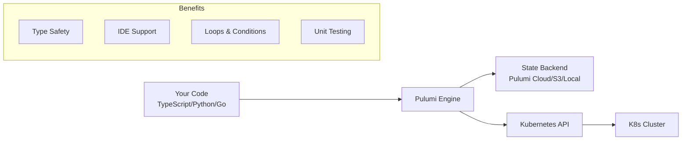
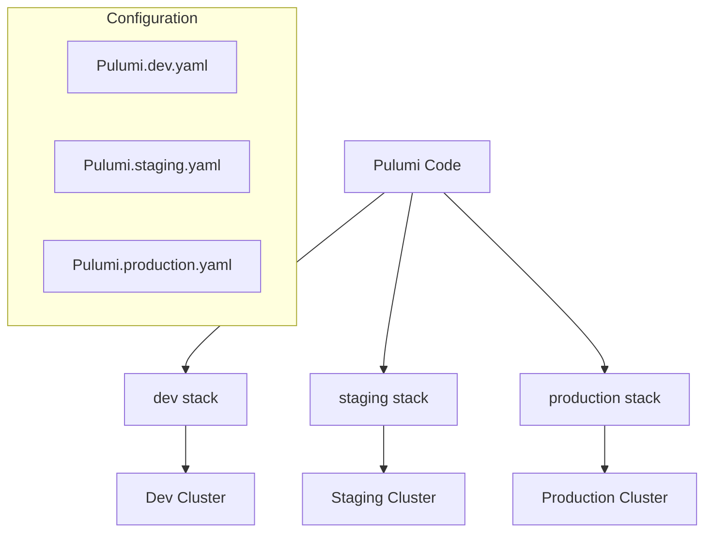

# How to Use Pulumi with Kubernetes

Author: [nawazdhandala](https://www.github.com/nawazdhandala)

Tags: Pulumi, Kubernetes, Infrastructure as Code, DevOps, TypeScript, Python, Go, Cloud Native

Description: A practical guide to managing Kubernetes infrastructure with Pulumi, covering setup, deployments, services, ConfigMaps, secrets management, Helm chart integration, and production best practices.

---

Managing Kubernetes resources with YAML files becomes unwieldy as your infrastructure grows. Pulumi offers a better approach by letting you define infrastructure using familiar programming languages like TypeScript, Python, and Go, complete with IDE support, type checking, and reusable abstractions.

## Why Pulumi for Kubernetes?



Key advantages over traditional YAML:

1. **Type Safety** - Catch errors at compile time, not deployment time
2. **Real Programming** - Use loops, conditionals, functions, and classes
3. **IDE Support** - Autocomplete, inline documentation, refactoring
4. **Testing** - Write unit tests for your infrastructure
5. **Reusability** - Create and share component libraries

## Getting Started

### Install Pulumi CLI

The following commands install the Pulumi CLI on different operating systems.

```bash
# macOS
brew install pulumi

# Linux
curl -fsSL https://get.pulumi.com | sh

# Windows (PowerShell)
choco install pulumi
```

### Configure Kubernetes Access

Pulumi uses your existing kubeconfig file to connect to Kubernetes clusters.

```bash
# Verify kubectl works
kubectl cluster-info

# Pulumi will use the current context
kubectl config current-context
```

### Create a New Project

Initialize a new Pulumi project with TypeScript for Kubernetes.

```bash
mkdir my-k8s-project && cd my-k8s-project

# TypeScript
pulumi new kubernetes-typescript

# Python
pulumi new kubernetes-python

# Go
pulumi new kubernetes-go
```

## Deploying Your First Application

### Basic Deployment with TypeScript

The following example creates a Deployment and Service for an nginx web server.

```typescript
// index.ts
import * as k8s from "@pulumi/kubernetes";

// Create a namespace for our application
const namespace = new k8s.core.v1.Namespace("app-namespace", {
    metadata: {
        name: "myapp",
    },
});

// Define labels that will be used by both the Deployment and Service
const appLabels = { app: "nginx" };

// Create a Deployment with 3 replicas running nginx
const deployment = new k8s.apps.v1.Deployment("nginx-deployment", {
    metadata: {
        namespace: namespace.metadata.name,
    },
    spec: {
        replicas: 3,
        selector: {
            matchLabels: appLabels,
        },
        template: {
            metadata: {
                labels: appLabels,
            },
            spec: {
                containers: [{
                    name: "nginx",
                    image: "nginx:1.25",
                    ports: [{ containerPort: 80 }],
                    resources: {
                        requests: {
                            cpu: "100m",
                            memory: "128Mi",
                        },
                        limits: {
                            cpu: "200m",
                            memory: "256Mi",
                        },
                    },
                }],
            },
        },
    },
});

// Create a Service to expose the Deployment internally
const service = new k8s.core.v1.Service("nginx-service", {
    metadata: {
        namespace: namespace.metadata.name,
    },
    spec: {
        selector: appLabels,
        ports: [{
            port: 80,
            targetPort: 80,
        }],
        type: "ClusterIP",
    },
});

// Export the service name for reference
export const serviceName = service.metadata.name;
```

### Basic Deployment with Python

The same deployment written in Python provides identical functionality.

```python
# __main__.py
import pulumi
import pulumi_kubernetes as k8s

# Create a namespace for our application
namespace = k8s.core.v1.Namespace(
    "app-namespace",
    metadata=k8s.meta.v1.ObjectMetaArgs(
        name="myapp",
    ),
)

# Define labels that will be used by both the Deployment and Service
app_labels = {"app": "nginx"}

# Create a Deployment with 3 replicas running nginx
deployment = k8s.apps.v1.Deployment(
    "nginx-deployment",
    metadata=k8s.meta.v1.ObjectMetaArgs(
        namespace=namespace.metadata.name,
    ),
    spec=k8s.apps.v1.DeploymentSpecArgs(
        replicas=3,
        selector=k8s.meta.v1.LabelSelectorArgs(
            match_labels=app_labels,
        ),
        template=k8s.core.v1.PodTemplateSpecArgs(
            metadata=k8s.meta.v1.ObjectMetaArgs(
                labels=app_labels,
            ),
            spec=k8s.core.v1.PodSpecArgs(
                containers=[
                    k8s.core.v1.ContainerArgs(
                        name="nginx",
                        image="nginx:1.25",
                        ports=[k8s.core.v1.ContainerPortArgs(container_port=80)],
                        resources=k8s.core.v1.ResourceRequirementsArgs(
                            requests={"cpu": "100m", "memory": "128Mi"},
                            limits={"cpu": "200m", "memory": "256Mi"},
                        ),
                    )
                ],
            ),
        ),
    ),
)

# Create a Service to expose the Deployment
service = k8s.core.v1.Service(
    "nginx-service",
    metadata=k8s.meta.v1.ObjectMetaArgs(
        namespace=namespace.metadata.name,
    ),
    spec=k8s.core.v1.ServiceSpecArgs(
        selector=app_labels,
        ports=[k8s.core.v1.ServicePortArgs(port=80, target_port=80)],
        type="ClusterIP",
    ),
)

# Export the service name
pulumi.export("service_name", service.metadata.name)
```

### Deploy the Stack

Run these commands to deploy your infrastructure to Kubernetes.

```bash
# Preview changes before applying
pulumi preview

# Deploy the stack
pulumi up

# View outputs
pulumi stack output

# Destroy when done
pulumi destroy
```

## Managing Configuration

### ConfigMaps

ConfigMaps allow you to decouple configuration from container images.

```typescript
// Create a ConfigMap with application configuration
const configMap = new k8s.core.v1.ConfigMap("app-config", {
    metadata: {
        namespace: namespace.metadata.name,
    },
    data: {
        "app.conf": `
            server {
                listen 80;
                server_name localhost;
                location / {
                    root /usr/share/nginx/html;
                    index index.html;
                }
            }
        `,
        "LOG_LEVEL": "info",
        "MAX_CONNECTIONS": "100",
    },
});

// Reference ConfigMap in a Deployment
const deploymentWithConfig = new k8s.apps.v1.Deployment("app-with-config", {
    metadata: {
        namespace: namespace.metadata.name,
    },
    spec: {
        replicas: 1,
        selector: {
            matchLabels: { app: "configured-app" },
        },
        template: {
            metadata: {
                labels: { app: "configured-app" },
            },
            spec: {
                containers: [{
                    name: "app",
                    image: "nginx:1.25",
                    // Mount ConfigMap as environment variables
                    envFrom: [{
                        configMapRef: {
                            name: configMap.metadata.name,
                        },
                    }],
                    // Mount ConfigMap as files
                    volumeMounts: [{
                        name: "config-volume",
                        mountPath: "/etc/nginx/conf.d",
                    }],
                }],
                volumes: [{
                    name: "config-volume",
                    configMap: {
                        name: configMap.metadata.name,
                        items: [{
                            key: "app.conf",
                            path: "default.conf",
                        }],
                    },
                }],
            },
        },
    },
});
```

### Secrets Management

Pulumi provides multiple ways to handle sensitive data securely.

```typescript
import * as pulumi from "@pulumi/pulumi";

// Option 1: Use Pulumi config for secrets (encrypted in state)
const config = new pulumi.Config();
const dbPassword = config.requireSecret("dbPassword");

// Option 2: Create a Kubernetes Secret
const secret = new k8s.core.v1.Secret("db-credentials", {
    metadata: {
        namespace: namespace.metadata.name,
    },
    type: "Opaque",
    stringData: {
        "username": "admin",
        // Pulumi automatically marks this as secret in the state
        "password": dbPassword,
    },
});

// Reference secret in a Deployment
const deploymentWithSecrets = new k8s.apps.v1.Deployment("app-with-secrets", {
    metadata: {
        namespace: namespace.metadata.name,
    },
    spec: {
        replicas: 1,
        selector: {
            matchLabels: { app: "secure-app" },
        },
        template: {
            metadata: {
                labels: { app: "secure-app" },
            },
            spec: {
                containers: [{
                    name: "app",
                    image: "myapp:latest",
                    env: [
                        {
                            name: "DB_USERNAME",
                            valueFrom: {
                                secretKeyRef: {
                                    name: secret.metadata.name,
                                    key: "username",
                                },
                            },
                        },
                        {
                            name: "DB_PASSWORD",
                            valueFrom: {
                                secretKeyRef: {
                                    name: secret.metadata.name,
                                    key: "password",
                                },
                            },
                        },
                    ],
                }],
            },
        },
    },
});
```

Set secrets using the Pulumi CLI.

```bash
# Set a secret value (encrypted in the state file)
pulumi config set --secret dbPassword "my-super-secret-password"
```

## Working with Helm Charts

### Deploy a Helm Chart

Pulumi can deploy existing Helm charts while giving you programmatic control.

```typescript
import * as k8s from "@pulumi/kubernetes";

// Deploy the NGINX Ingress Controller from a Helm chart
const nginxIngress = new k8s.helm.v3.Chart("nginx-ingress", {
    chart: "ingress-nginx",
    version: "4.8.3",
    fetchOpts: {
        repo: "https://kubernetes.github.io/ingress-nginx",
    },
    namespace: "ingress-nginx",
    values: {
        controller: {
            replicaCount: 2,
            service: {
                type: "LoadBalancer",
            },
            metrics: {
                enabled: true,
            },
            resources: {
                requests: {
                    cpu: "100m",
                    memory: "128Mi",
                },
            },
        },
    },
});

// Access resources created by the Helm chart
export const ingressServiceName = nginxIngress.getResource(
    "v1/Service",
    "ingress-nginx/nginx-ingress-ingress-nginx-controller"
);
```

### Deploy a Local Helm Chart

You can also deploy charts from local directories.

```typescript
// Deploy a local Helm chart with custom values
const localChart = new k8s.helm.v3.Chart("my-app", {
    path: "./charts/my-app",
    namespace: namespace.metadata.name,
    values: {
        image: {
            repository: "myregistry/myapp",
            tag: "v1.2.3",
        },
        replicas: 3,
        ingress: {
            enabled: true,
            hosts: ["myapp.example.com"],
        },
    },
    // Transform resources before deployment
    transformations: [
        (obj: any) => {
            // Add common labels to all resources
            if (obj.metadata) {
                obj.metadata.labels = {
                    ...obj.metadata.labels,
                    "managed-by": "pulumi",
                    "environment": "production",
                };
            }
        },
    ],
});
```

## Creating Reusable Components

### Custom Component for Microservices

Creating reusable components reduces duplication and enforces standards.

```typescript
// microservice.ts
import * as pulumi from "@pulumi/pulumi";
import * as k8s from "@pulumi/kubernetes";

// Define the configuration interface for our microservice
export interface MicroserviceArgs {
    namespace: pulumi.Input<string>;
    image: string;
    replicas?: number;
    port?: number;
    env?: { [key: string]: string };
    resources?: {
        cpu: string;
        memory: string;
    };
}

// Create a reusable Microservice component
export class Microservice extends pulumi.ComponentResource {
    public readonly deployment: k8s.apps.v1.Deployment;
    public readonly service: k8s.core.v1.Service;
    public readonly serviceName: pulumi.Output<string>;

    constructor(
        name: string,
        args: MicroserviceArgs,
        opts?: pulumi.ComponentResourceOptions
    ) {
        super("custom:k8s:Microservice", name, {}, opts);

        const labels = { app: name };
        const port = args.port || 8080;
        const replicas = args.replicas || 2;
        const resources = args.resources || { cpu: "100m", memory: "128Mi" };

        // Create the Deployment
        this.deployment = new k8s.apps.v1.Deployment(
            `${name}-deployment`,
            {
                metadata: {
                    namespace: args.namespace,
                    labels: labels,
                },
                spec: {
                    replicas: replicas,
                    selector: { matchLabels: labels },
                    template: {
                        metadata: { labels: labels },
                        spec: {
                            containers: [{
                                name: name,
                                image: args.image,
                                ports: [{ containerPort: port }],
                                env: Object.entries(args.env || {}).map(
                                    ([key, value]) => ({ name: key, value })
                                ),
                                resources: {
                                    requests: resources,
                                    limits: {
                                        cpu: `${parseInt(resources.cpu) * 2}m`,
                                        memory: `${parseInt(resources.memory) * 2}Mi`,
                                    },
                                },
                                livenessProbe: {
                                    httpGet: { path: "/health", port: port },
                                    initialDelaySeconds: 10,
                                    periodSeconds: 10,
                                },
                                readinessProbe: {
                                    httpGet: { path: "/ready", port: port },
                                    initialDelaySeconds: 5,
                                    periodSeconds: 5,
                                },
                            }],
                        },
                    },
                },
            },
            { parent: this }
        );

        // Create the Service
        this.service = new k8s.core.v1.Service(
            `${name}-service`,
            {
                metadata: {
                    namespace: args.namespace,
                    labels: labels,
                },
                spec: {
                    selector: labels,
                    ports: [{ port: port, targetPort: port }],
                    type: "ClusterIP",
                },
            },
            { parent: this }
        );

        this.serviceName = this.service.metadata.name;

        this.registerOutputs({
            deployment: this.deployment,
            service: this.service,
            serviceName: this.serviceName,
        });
    }
}
```

Use the custom component to deploy multiple services consistently.

```typescript
// index.ts
import { Microservice } from "./microservice";
import * as k8s from "@pulumi/kubernetes";

const namespace = new k8s.core.v1.Namespace("microservices", {
    metadata: { name: "microservices" },
});

// Deploy multiple microservices using the same component
const apiService = new Microservice("api", {
    namespace: namespace.metadata.name,
    image: "myregistry/api:v1.0.0",
    replicas: 3,
    port: 8080,
    env: {
        "LOG_LEVEL": "info",
        "DATABASE_HOST": "postgres.database.svc",
    },
});

const workerService = new Microservice("worker", {
    namespace: namespace.metadata.name,
    image: "myregistry/worker:v1.0.0",
    replicas: 5,
    port: 8081,
    env: {
        "QUEUE_URL": "rabbitmq.messaging.svc",
    },
    resources: {
        cpu: "200m",
        memory: "256Mi",
    },
});

export const apiServiceName = apiService.serviceName;
export const workerServiceName = workerService.serviceName;
```

## Multi-Environment Deployment

### Stack Configuration

Pulumi stacks let you manage multiple environments from the same codebase.



Create stack-specific configuration files.

```yaml
# Pulumi.dev.yaml
config:
  kubernetes:kubeconfig: ~/.kube/dev-config
  myapp:replicas: 1
  myapp:environment: development
  myapp:logLevel: debug
```

```yaml
# Pulumi.production.yaml
config:
  kubernetes:kubeconfig: ~/.kube/prod-config
  myapp:replicas: 5
  myapp:environment: production
  myapp:logLevel: warn
```

Read configuration values in your code.

```typescript
// index.ts
import * as pulumi from "@pulumi/pulumi";
import * as k8s from "@pulumi/kubernetes";

const config = new pulumi.Config("myapp");
const replicas = config.getNumber("replicas") || 2;
const environment = config.require("environment");
const logLevel = config.get("logLevel") || "info";

const deployment = new k8s.apps.v1.Deployment("app", {
    spec: {
        replicas: replicas,
        selector: { matchLabels: { app: "myapp" } },
        template: {
            metadata: { labels: { app: "myapp" } },
            spec: {
                containers: [{
                    name: "app",
                    image: "myapp:latest",
                    env: [
                        { name: "ENVIRONMENT", value: environment },
                        { name: "LOG_LEVEL", value: logLevel },
                    ],
                }],
            },
        },
    },
});
```

Switch between environments using the Pulumi CLI.

```bash
# Create stacks for each environment
pulumi stack init dev
pulumi stack init staging
pulumi stack init production

# Deploy to development
pulumi stack select dev
pulumi up

# Deploy to production
pulumi stack select production
pulumi up
```

## Ingress and Networking

### Create an Ingress Resource

Configure Ingress to expose services externally with TLS.

```typescript
// Create an Ingress to expose services externally
const ingress = new k8s.networking.v1.Ingress("app-ingress", {
    metadata: {
        namespace: namespace.metadata.name,
        annotations: {
            "kubernetes.io/ingress.class": "nginx",
            "cert-manager.io/cluster-issuer": "letsencrypt-prod",
            "nginx.ingress.kubernetes.io/ssl-redirect": "true",
        },
    },
    spec: {
        tls: [{
            hosts: ["api.example.com"],
            secretName: "api-tls-secret",
        }],
        rules: [{
            host: "api.example.com",
            http: {
                paths: [
                    {
                        path: "/api",
                        pathType: "Prefix",
                        backend: {
                            service: {
                                name: apiService.serviceName,
                                port: { number: 8080 },
                            },
                        },
                    },
                    {
                        path: "/",
                        pathType: "Prefix",
                        backend: {
                            service: {
                                name: "frontend-service",
                                port: { number: 80 },
                            },
                        },
                    },
                ],
            },
        }],
    },
});
```

### Network Policies

Implement network segmentation to control pod-to-pod communication.

```typescript
// Allow only specific pods to communicate with the database
const dbNetworkPolicy = new k8s.networking.v1.NetworkPolicy("db-network-policy", {
    metadata: {
        namespace: namespace.metadata.name,
    },
    spec: {
        podSelector: {
            matchLabels: { app: "postgres" },
        },
        policyTypes: ["Ingress"],
        ingress: [{
            from: [
                {
                    // Allow from pods with app=api label
                    podSelector: {
                        matchLabels: { app: "api" },
                    },
                },
                {
                    // Allow from pods in the same namespace with role=backend
                    podSelector: {
                        matchLabels: { role: "backend" },
                    },
                },
            ],
            ports: [{
                protocol: "TCP",
                port: 5432,
            }],
        }],
    },
});
```

## Stateful Applications

### Deploy a StatefulSet

StatefulSets provide stable network identities and persistent storage for databases.

```typescript
// Create a headless service for the StatefulSet
const postgresService = new k8s.core.v1.Service("postgres-headless", {
    metadata: {
        namespace: namespace.metadata.name,
        labels: { app: "postgres" },
    },
    spec: {
        clusterIP: "None",  // Headless service
        selector: { app: "postgres" },
        ports: [{ port: 5432, targetPort: 5432 }],
    },
});

// Create a StatefulSet for PostgreSQL
const postgresStatefulSet = new k8s.apps.v1.StatefulSet("postgres", {
    metadata: {
        namespace: namespace.metadata.name,
    },
    spec: {
        serviceName: "postgres-headless",
        replicas: 3,
        selector: {
            matchLabels: { app: "postgres" },
        },
        template: {
            metadata: {
                labels: { app: "postgres" },
            },
            spec: {
                containers: [{
                    name: "postgres",
                    image: "postgres:15",
                    ports: [{ containerPort: 5432 }],
                    env: [
                        {
                            name: "POSTGRES_PASSWORD",
                            valueFrom: {
                                secretKeyRef: {
                                    name: "postgres-secret",
                                    key: "password",
                                },
                            },
                        },
                        { name: "PGDATA", value: "/var/lib/postgresql/data/pgdata" },
                    ],
                    volumeMounts: [{
                        name: "postgres-data",
                        mountPath: "/var/lib/postgresql/data",
                    }],
                    resources: {
                        requests: { cpu: "500m", memory: "1Gi" },
                        limits: { cpu: "2", memory: "4Gi" },
                    },
                }],
            },
        },
        // Persistent volume claim template for each pod
        volumeClaimTemplates: [{
            metadata: { name: "postgres-data" },
            spec: {
                accessModes: ["ReadWriteOnce"],
                storageClassName: "standard",
                resources: {
                    requests: { storage: "100Gi" },
                },
            },
        }],
    },
});
```

## Continuous Deployment Integration

### GitHub Actions Integration

Automate deployments using GitHub Actions with Pulumi.

```yaml
# .github/workflows/deploy.yml
name: Deploy to Kubernetes

on:
  push:
    branches: [main]
  pull_request:
    branches: [main]

jobs:
  preview:
    name: Preview Changes
    runs-on: ubuntu-latest
    if: github.event_name == 'pull_request'
    steps:
      - uses: actions/checkout@v4

      - uses: actions/setup-node@v4
        with:
          node-version: '20'

      - name: Install dependencies
        run: npm ci

      - uses: pulumi/actions@v5
        with:
          command: preview
          stack-name: staging
        env:
          PULUMI_ACCESS_TOKEN: ${{ secrets.PULUMI_ACCESS_TOKEN }}
          KUBECONFIG: ${{ secrets.KUBECONFIG_STAGING }}

  deploy:
    name: Deploy
    runs-on: ubuntu-latest
    if: github.ref == 'refs/heads/main'
    steps:
      - uses: actions/checkout@v4

      - uses: actions/setup-node@v4
        with:
          node-version: '20'

      - name: Install dependencies
        run: npm ci

      - uses: pulumi/actions@v5
        with:
          command: up
          stack-name: production
        env:
          PULUMI_ACCESS_TOKEN: ${{ secrets.PULUMI_ACCESS_TOKEN }}
          KUBECONFIG: ${{ secrets.KUBECONFIG_PRODUCTION }}
```

## Testing Infrastructure

### Unit Tests with Pulumi Mocking

Pulumi supports unit testing your infrastructure code.

```typescript
// __tests__/index.test.ts
import * as pulumi from "@pulumi/pulumi";

// Mock Pulumi runtime before importing modules
pulumi.runtime.setMocks({
    newResource: (args: pulumi.runtime.MockResourceArgs) => {
        return {
            id: `${args.name}-id`,
            state: args.inputs,
        };
    },
    call: (args: pulumi.runtime.MockCallArgs) => {
        return args.inputs;
    },
});

describe("Infrastructure Tests", () => {
    let infra: typeof import("../index");

    beforeAll(async () => {
        // Import after mocking
        infra = await import("../index");
    });

    test("Deployment has correct replica count", async () => {
        const replicas = await new Promise<number>((resolve) => {
            infra.deployment.spec.replicas.apply(resolve);
        });
        expect(replicas).toBe(3);
    });

    test("Service uses correct selector", async () => {
        const selector = await new Promise<any>((resolve) => {
            infra.service.spec.selector.apply(resolve);
        });
        expect(selector).toEqual({ app: "nginx" });
    });

    test("Deployment has resource limits", async () => {
        const limits = await new Promise<any>((resolve) => {
            infra.deployment.spec.template.spec.containers.apply((containers) => {
                resolve(containers[0].resources?.limits);
            });
        });
        expect(limits).toBeDefined();
        expect(limits.memory).toBe("256Mi");
    });
});
```

Run tests with your preferred test runner.

```bash
# Run tests with Jest
npm test

# Run tests with coverage
npm test -- --coverage
```

## Best Practices

### 1. Use Explicit Resource Names

Prevent naming conflicts by using explicit names.

```typescript
// Bad: auto-generated names can conflict
const deployment = new k8s.apps.v1.Deployment("app", { ... });

// Good: explicit, predictable names
const deployment = new k8s.apps.v1.Deployment("app", {
    metadata: {
        name: "my-app-deployment",  // Explicit name
        namespace: "production",
    },
    ...
});
```

### 2. Always Set Resource Requests and Limits

Ensure predictable scheduling and prevent resource contention.

```typescript
resources: {
    requests: {
        cpu: "100m",
        memory: "128Mi",
    },
    limits: {
        cpu: "500m",
        memory: "512Mi",
    },
}
```

### 3. Use Pulumi Stack References

Share outputs between stacks for multi-stack architectures.

```typescript
// In the networking stack
export const vpcId = vpc.id;
export const subnetIds = subnets.map(s => s.id);

// In the application stack
const networkStack = new pulumi.StackReference("organization/networking/production");
const vpcId = networkStack.getOutput("vpcId");
```

### 4. Implement Health Checks

Always configure liveness and readiness probes.

```typescript
livenessProbe: {
    httpGet: {
        path: "/health",
        port: 8080,
    },
    initialDelaySeconds: 15,
    periodSeconds: 10,
    failureThreshold: 3,
},
readinessProbe: {
    httpGet: {
        path: "/ready",
        port: 8080,
    },
    initialDelaySeconds: 5,
    periodSeconds: 5,
    failureThreshold: 3,
},
```

## Troubleshooting

### View Deployed Resources

Pulumi provides commands to inspect your deployed infrastructure.

```bash
# View current stack state
pulumi stack

# Export stack state as JSON
pulumi stack export

# View resource details
pulumi stack --show-urns

# Refresh state from cluster
pulumi refresh
```

### Debug Deployment Issues

Investigate failed deployments with these commands.

```bash
# Preview with detailed diff
pulumi preview --diff

# Deploy with verbose logging
pulumi up --debug

# View Pulumi logs
pulumi logs

# Check Kubernetes events
kubectl get events --sort-by='.lastTimestamp'
```

### Import Existing Resources

Bring existing Kubernetes resources under Pulumi management.

```bash
# Import an existing deployment
pulumi import kubernetes:apps/v1:Deployment my-deployment \
  default/existing-deployment
```

---

Pulumi transforms Kubernetes infrastructure management by bringing the power of real programming languages to your deployments. Start with simple deployments, create reusable components, and scale to multi-cluster architectures. The combination of type safety, testing capabilities, and familiar development workflows makes managing complex Kubernetes environments significantly more maintainable.
