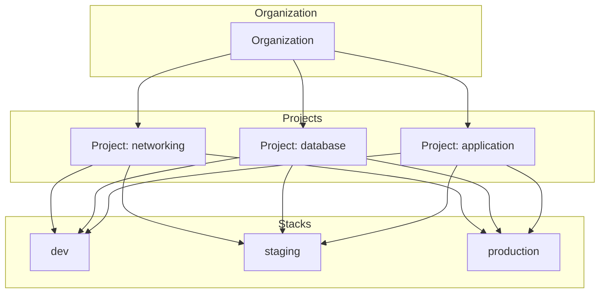
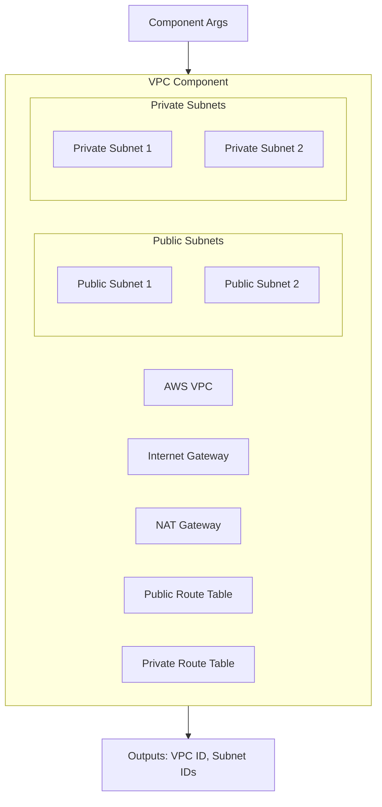
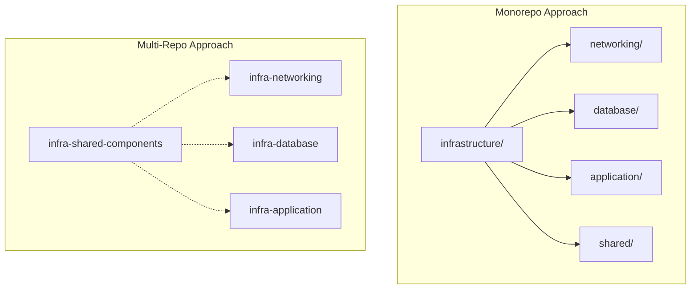
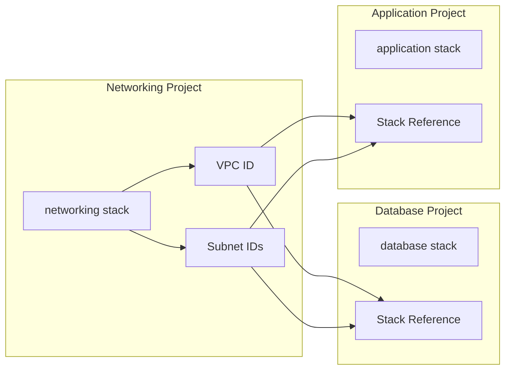
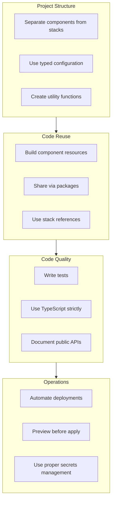

# How to Structure Pulumi Projects

Author: [nawazdhandala](https://www.github.com/nawazdhandala)

Tags: Pulumi, Infrastructure as Code, IaC, DevOps, Cloud, TypeScript, Python

Description: A practical guide to structuring Pulumi projects for maintainability, reusability, and team collaboration. Covers monorepo vs multi-repo approaches, component resources, stack organization, and best practices for scaling your infrastructure code.

---

Pulumi lets you define cloud infrastructure using familiar programming languages like TypeScript, Python, Go, and C#. However, as projects grow, poor structure leads to unmaintainable code, duplicated logic, and deployment headaches. A well-organized Pulumi project makes the difference between infrastructure that scales gracefully and one that becomes a burden.

## Understanding Pulumi's Building Blocks

Before diving into project structure, let's review how Pulumi organizes infrastructure.



Key concepts:
- **Organization** - Top-level container for all projects
- **Project** - A collection of related infrastructure resources
- **Stack** - An isolated instance of a project (dev, staging, production)
- **Component Resource** - Reusable grouping of resources

## Basic Project Structure

A minimal Pulumi project contains these files.

The following structure shows the essential files every Pulumi project needs:

```
my-infrastructure/
├── Pulumi.yaml           # Project metadata
├── Pulumi.dev.yaml       # Dev stack configuration
├── Pulumi.staging.yaml   # Staging stack configuration
├── Pulumi.prod.yaml      # Production stack configuration
├── index.ts              # Main entry point (TypeScript)
├── package.json          # Dependencies
└── tsconfig.json         # TypeScript configuration
```

The project definition file specifies the project name, runtime, and description:

```yaml
# Pulumi.yaml
name: my-infrastructure
runtime: nodejs
description: Core infrastructure for my application
```

Stack configuration files contain environment-specific values:

```yaml
# Pulumi.dev.yaml
config:
  aws:region: us-west-2
  my-infrastructure:environment: dev
  my-infrastructure:instanceSize: t3.small
  my-infrastructure:minInstances: 1
```

## Recommended Project Layout

For real-world projects, a more comprehensive structure provides better organization. Here is a layout that scales well with team size and complexity:

```
infrastructure/
├── Pulumi.yaml
├── Pulumi.dev.yaml
├── Pulumi.staging.yaml
├── Pulumi.prod.yaml
├── package.json
├── tsconfig.json
│
├── index.ts                    # Main entry point
│
├── config/
│   └── index.ts                # Configuration loading
│
├── components/
│   ├── index.ts                # Component exports
│   ├── vpc/
│   │   ├── index.ts
│   │   └── types.ts
│   ├── database/
│   │   ├── index.ts
│   │   └── types.ts
│   └── kubernetes-cluster/
│       ├── index.ts
│       └── types.ts
│
├── stacks/
│   ├── networking.ts           # Network resources
│   ├── database.ts             # Database resources
│   └── application.ts          # Application resources
│
└── utils/
    ├── naming.ts               # Resource naming conventions
    ├── tagging.ts              # Common tags
    └── helpers.ts              # Utility functions
```

## Creating Reusable Component Resources

Component resources are the foundation of reusable Pulumi code. They group related resources into a single, configurable unit.

The following diagram illustrates how a VPC component encapsulates multiple AWS resources:



Define the component interface with TypeScript types for better developer experience:

```typescript
// components/vpc/types.ts
import * as pulumi from "@pulumi/pulumi";

export interface VpcArgs {
    // CIDR block for the VPC - determines the IP address range
    cidrBlock: pulumi.Input<string>;

    // Number of availability zones to use for high availability
    availabilityZoneCount: pulumi.Input<number>;

    // Whether to create NAT gateways for private subnet internet access
    enableNatGateway: pulumi.Input<boolean>;

    // Optional tags to apply to all resources
    tags?: pulumi.Input<{ [key: string]: pulumi.Input<string> }>;
}

export interface VpcOutputs {
    vpcId: pulumi.Output<string>;
    publicSubnetIds: pulumi.Output<string[]>;
    privateSubnetIds: pulumi.Output<string[]>;
}
```

Implement the component by extending ComponentResource and registering child resources:

```typescript
// components/vpc/index.ts
import * as pulumi from "@pulumi/pulumi";
import * as aws from "@pulumi/aws";
import { VpcArgs } from "./types";

export class Vpc extends pulumi.ComponentResource {
    public readonly vpcId: pulumi.Output<string>;
    public readonly publicSubnetIds: pulumi.Output<string[]>;
    public readonly privateSubnetIds: pulumi.Output<string[]>;

    constructor(name: string, args: VpcArgs, opts?: pulumi.ComponentResourceOptions) {
        // Call the parent constructor to register this component
        super("custom:network:Vpc", name, {}, opts);

        // Create the VPC as a child resource of this component
        const vpc = new aws.ec2.Vpc(`${name}-vpc`, {
            cidrBlock: args.cidrBlock,
            enableDnsHostnames: true,
            enableDnsSupport: true,
            tags: {
                Name: `${name}-vpc`,
                ...args.tags,
            },
        }, { parent: this });

        // Create an internet gateway for public subnet access
        const igw = new aws.ec2.InternetGateway(`${name}-igw`, {
            vpcId: vpc.id,
            tags: {
                Name: `${name}-igw`,
                ...args.tags,
            },
        }, { parent: this });

        // Get available AZs in the region
        const azs = aws.getAvailabilityZones({
            state: "available",
        });

        // Create public subnets across availability zones
        const publicSubnets: aws.ec2.Subnet[] = [];
        const privateSubnets: aws.ec2.Subnet[] = [];

        // Use pulumi.output to handle the async AZ data
        pulumi.output(args.availabilityZoneCount).apply(azCount => {
            for (let i = 0; i < azCount; i++) {
                // Public subnet - resources here get public IPs
                const publicSubnet = new aws.ec2.Subnet(`${name}-public-${i}`, {
                    vpcId: vpc.id,
                    cidrBlock: `10.0.${i}.0/24`,
                    availabilityZone: azs.then(az => az.names[i]),
                    mapPublicIpOnLaunch: true,
                    tags: {
                        Name: `${name}-public-${i}`,
                        Type: "public",
                        ...args.tags,
                    },
                }, { parent: this });
                publicSubnets.push(publicSubnet);

                // Private subnet - no direct internet access
                const privateSubnet = new aws.ec2.Subnet(`${name}-private-${i}`, {
                    vpcId: vpc.id,
                    cidrBlock: `10.0.${i + 100}.0/24`,
                    availabilityZone: azs.then(az => az.names[i]),
                    tags: {
                        Name: `${name}-private-${i}`,
                        Type: "private",
                        ...args.tags,
                    },
                }, { parent: this });
                privateSubnets.push(privateSubnet);
            }
        });

        // Export outputs for use by other components
        this.vpcId = vpc.id;
        this.publicSubnetIds = pulumi.output(publicSubnets.map(s => s.id));
        this.privateSubnetIds = pulumi.output(privateSubnets.map(s => s.id));

        // Register all outputs
        this.registerOutputs({
            vpcId: this.vpcId,
            publicSubnetIds: this.publicSubnetIds,
            privateSubnetIds: this.privateSubnetIds,
        });
    }
}
```

## Configuration Management

Centralize configuration loading to avoid scattered config.get() calls throughout your code:

```typescript
// config/index.ts
import * as pulumi from "@pulumi/pulumi";

// Load the stack-specific configuration
const config = new pulumi.Config();
const awsConfig = new pulumi.Config("aws");

// Define strongly-typed configuration interface
export interface AppConfig {
    environment: string;
    region: string;
    instanceSize: string;
    minInstances: number;
    maxInstances: number;
    domainName: string;
    enableMonitoring: boolean;
}

// Export a single configuration object for the entire project
export const appConfig: AppConfig = {
    environment: config.require("environment"),
    region: awsConfig.require("region"),
    instanceSize: config.get("instanceSize") || "t3.medium",
    minInstances: config.getNumber("minInstances") || 2,
    maxInstances: config.getNumber("maxInstances") || 10,
    domainName: config.require("domainName"),
    enableMonitoring: config.getBoolean("enableMonitoring") || true,
};

// Environment-specific defaults
export const environmentDefaults = {
    dev: {
        instanceSize: "t3.small",
        minInstances: 1,
        maxInstances: 2,
    },
    staging: {
        instanceSize: "t3.medium",
        minInstances: 2,
        maxInstances: 5,
    },
    production: {
        instanceSize: "t3.large",
        minInstances: 3,
        maxInstances: 20,
    },
};
```

## Utility Functions

Create utility functions for consistent naming and tagging across all resources:

```typescript
// utils/naming.ts
import * as pulumi from "@pulumi/pulumi";

const stack = pulumi.getStack();
const project = pulumi.getProject();

// Generate consistent resource names including project and stack
export function resourceName(baseName: string): string {
    return `${project}-${stack}-${baseName}`;
}

// Generate names for resources with strict length limits like S3 buckets
export function shortName(baseName: string, maxLength: number = 63): string {
    const fullName = resourceName(baseName);
    if (fullName.length <= maxLength) {
        return fullName;
    }
    // Truncate and add hash for uniqueness
    const hash = simpleHash(fullName).toString(16).slice(0, 6);
    return `${fullName.slice(0, maxLength - 7)}-${hash}`;
}

function simpleHash(str: string): number {
    let hash = 0;
    for (let i = 0; i < str.length; i++) {
        const char = str.charCodeAt(i);
        hash = ((hash << 5) - hash) + char;
        hash = hash & hash;
    }
    return Math.abs(hash);
}
```

Standardize tags to ensure all resources are properly labeled for cost tracking and management:

```typescript
// utils/tagging.ts
import * as pulumi from "@pulumi/pulumi";

const stack = pulumi.getStack();
const project = pulumi.getProject();

// Base tags applied to every resource
export const baseTags: { [key: string]: string } = {
    Project: project,
    Environment: stack,
    ManagedBy: "pulumi",
    Team: "platform",
};

// Merge base tags with resource-specific tags
export function mergeTags(
    additionalTags: { [key: string]: string } = {}
): { [key: string]: string } {
    return {
        ...baseTags,
        ...additionalTags,
    };
}

// Tags specifically for AWS cost allocation
export function costAllocationTags(
    service: string,
    owner: string
): { [key: string]: string } {
    return mergeTags({
        Service: service,
        Owner: owner,
        CostCenter: `${project}-${service}`,
    });
}
```

## Monorepo vs Multi-Repo Strategies

Choose your repository structure based on team size and deployment independence.



### Monorepo Structure

A monorepo works well when teams need to make cross-cutting changes frequently:

```
infrastructure/
├── packages/
│   ├── networking/
│   │   ├── Pulumi.yaml
│   │   ├── package.json
│   │   └── index.ts
│   │
│   ├── database/
│   │   ├── Pulumi.yaml
│   │   ├── package.json
│   │   └── index.ts
│   │
│   ├── application/
│   │   ├── Pulumi.yaml
│   │   ├── package.json
│   │   └── index.ts
│   │
│   └── shared-components/
│       ├── package.json
│       └── src/
│           ├── vpc/
│           ├── rds/
│           └── eks/
│
├── package.json              # Workspace root
├── pnpm-workspace.yaml       # Workspace configuration
└── turbo.json                # Build orchestration
```

Configure the workspace to share dependencies:

```yaml
# pnpm-workspace.yaml
packages:
  - 'packages/*'
```

Reference shared components from individual projects:

```json
// packages/networking/package.json
{
  "name": "@infra/networking",
  "dependencies": {
    "@pulumi/pulumi": "^3.0.0",
    "@pulumi/aws": "^6.0.0",
    "@infra/shared-components": "workspace:*"
  }
}
```

### Multi-Repo with Shared Packages

For larger organizations, separate repos with published packages provide better isolation:

```typescript
// In the shared-components package (published to npm or private registry)
// @company/pulumi-components/src/vpc/index.ts

import * as pulumi from "@pulumi/pulumi";
import * as aws from "@pulumi/aws";

export interface StandardVpcArgs {
    environment: "dev" | "staging" | "production";
    cidrBlock?: string;
}

// Pre-configured VPC following company standards
export class StandardVpc extends pulumi.ComponentResource {
    public readonly vpc: aws.ec2.Vpc;

    constructor(name: string, args: StandardVpcArgs, opts?: pulumi.ComponentResourceOptions) {
        super("company:network:StandardVpc", name, {}, opts);

        // Apply company-wide defaults based on environment
        const cidr = args.cidrBlock || this.getDefaultCidr(args.environment);

        this.vpc = new aws.ec2.Vpc(`${name}-vpc`, {
            cidrBlock: cidr,
            enableDnsHostnames: true,
            enableDnsSupport: true,
        }, { parent: this });

        this.registerOutputs({
            vpcId: this.vpc.id,
        });
    }

    private getDefaultCidr(env: string): string {
        const cidrs: Record<string, string> = {
            dev: "10.0.0.0/16",
            staging: "10.1.0.0/16",
            production: "10.2.0.0/16",
        };
        return cidrs[env];
    }
}
```

## Stack References for Cross-Project Dependencies

When infrastructure spans multiple Pulumi projects, use stack references to share outputs:



Export values from the networking project:

```typescript
// networking/index.ts
import * as pulumi from "@pulumi/pulumi";
import { Vpc } from "./components/vpc";

const vpc = new Vpc("main", {
    cidrBlock: "10.0.0.0/16",
    availabilityZoneCount: 3,
    enableNatGateway: true,
});

// Export values for other projects to consume
export const vpcId = vpc.vpcId;
export const publicSubnetIds = vpc.publicSubnetIds;
export const privateSubnetIds = vpc.privateSubnetIds;
```

Import values in the database project using StackReference:

```typescript
// database/index.ts
import * as pulumi from "@pulumi/pulumi";
import * as aws from "@pulumi/aws";

const stack = pulumi.getStack();

// Reference the networking stack in the same organization
const networkingStack = new pulumi.StackReference(`myorg/networking/${stack}`);

// Get outputs from the networking stack
const vpcId = networkingStack.getOutput("vpcId");
const privateSubnetIds = networkingStack.getOutput("privateSubnetIds");

// Create database in the VPC from the networking project
const dbSubnetGroup = new aws.rds.SubnetGroup("db-subnets", {
    subnetIds: privateSubnetIds.apply(ids => ids as string[]),
    tags: {
        Name: "Database subnet group",
    },
});

const database = new aws.rds.Instance("main", {
    engine: "postgres",
    engineVersion: "15.4",
    instanceClass: "db.t3.medium",
    allocatedStorage: 20,
    dbSubnetGroupName: dbSubnetGroup.name,
    vpcSecurityGroupIds: [/* security group ids */],
});

export const dbEndpoint = database.endpoint;
export const dbPort = database.port;
```

## Organizing by Layer vs Domain

Choose an organization strategy based on how your teams operate.

### Layer-Based Organization

Organize by infrastructure layer when a central platform team manages all infrastructure:

```
infrastructure/
├── network/                 # All networking resources
│   ├── vpc.ts
│   ├── subnets.ts
│   ├── security-groups.ts
│   └── load-balancers.ts
│
├── compute/                 # All compute resources
│   ├── eks-cluster.ts
│   ├── ec2-instances.ts
│   └── lambda-functions.ts
│
├── data/                    # All data stores
│   ├── rds.ts
│   ├── elasticache.ts
│   └── s3-buckets.ts
│
└── security/                # All security resources
    ├── iam-roles.ts
    ├── kms-keys.ts
    └── secrets.ts
```

### Domain-Based Organization

Organize by business domain when product teams own their infrastructure:

```
infrastructure/
├── user-service/
│   ├── api-gateway.ts
│   ├── lambda.ts
│   ├── dynamodb.ts
│   └── index.ts
│
├── order-service/
│   ├── ecs-service.ts
│   ├── rds.ts
│   ├── sqs-queues.ts
│   └── index.ts
│
├── notification-service/
│   ├── sns-topics.ts
│   ├── lambda.ts
│   └── index.ts
│
└── shared/
    ├── vpc/
    ├── monitoring/
    └── logging/
```

## Environment-Specific Configuration

Handle differences between environments cleanly with conditional logic and configuration:

```typescript
// stacks/application.ts
import * as pulumi from "@pulumi/pulumi";
import * as aws from "@pulumi/aws";
import { appConfig } from "../config";

const stack = pulumi.getStack();

// Define environment-specific settings in a type-safe way
interface EnvironmentSettings {
    instanceType: string;
    minSize: number;
    maxSize: number;
    multiAz: boolean;
    deletionProtection: boolean;
}

const environmentSettings: Record<string, EnvironmentSettings> = {
    dev: {
        instanceType: "t3.small",
        minSize: 1,
        maxSize: 2,
        multiAz: false,
        deletionProtection: false,
    },
    staging: {
        instanceType: "t3.medium",
        minSize: 2,
        maxSize: 4,
        multiAz: true,
        deletionProtection: false,
    },
    production: {
        instanceType: "t3.large",
        minSize: 3,
        maxSize: 10,
        multiAz: true,
        deletionProtection: true,
    },
};

// Get settings for current stack, defaulting to dev
const settings = environmentSettings[stack] || environmentSettings.dev;

// Create auto-scaling group with environment-appropriate settings
const asg = new aws.autoscaling.Group("app-asg", {
    minSize: settings.minSize,
    maxSize: settings.maxSize,
    desiredCapacity: settings.minSize,
    launchTemplate: {
        id: launchTemplate.id,
        version: "$Latest",
    },
    vpcZoneIdentifiers: privateSubnetIds,
    tags: [
        {
            key: "Environment",
            value: stack,
            propagateAtLaunch: true,
        },
    ],
});
```

## Testing Infrastructure Code

Write tests to validate your infrastructure before deployment:

```typescript
// __tests__/vpc.test.ts
import * as pulumi from "@pulumi/pulumi";
import "jest";

// Mock Pulumi runtime for testing
pulumi.runtime.setMocks({
    newResource: function(args: pulumi.runtime.MockResourceArgs): {id: string, state: any} {
        return {
            id: `${args.name}-id`,
            state: args.inputs,
        };
    },
    call: function(args: pulumi.runtime.MockCallArgs) {
        return args.inputs;
    },
});

describe("VPC Component", () => {
    let Vpc: typeof import("../components/vpc").Vpc;

    beforeAll(async () => {
        // Import after mocks are set up
        Vpc = (await import("../components/vpc")).Vpc;
    });

    test("creates VPC with correct CIDR block", async () => {
        const vpc = new Vpc("test-vpc", {
            cidrBlock: "10.0.0.0/16",
            availabilityZoneCount: 2,
            enableNatGateway: true,
        });

        // Verify the VPC ID is exported
        const vpcId = await new Promise<string>(resolve =>
            vpc.vpcId.apply(id => resolve(id))
        );

        expect(vpcId).toBeDefined();
        expect(vpcId).toContain("test-vpc");
    });

    test("creates correct number of subnets", async () => {
        const vpc = new Vpc("test-vpc", {
            cidrBlock: "10.0.0.0/16",
            availabilityZoneCount: 3,
            enableNatGateway: false,
        });

        const publicSubnets = await new Promise<string[]>(resolve =>
            vpc.publicSubnetIds.apply(ids => resolve(ids))
        );

        expect(publicSubnets).toHaveLength(3);
    });
});
```

## CI/CD Integration

Set up automated preview and deployment pipelines:

```yaml
# .github/workflows/pulumi.yml
name: Pulumi Infrastructure

on:
  push:
    branches: [main]
  pull_request:
    branches: [main]

env:
  PULUMI_ACCESS_TOKEN: ${{ secrets.PULUMI_ACCESS_TOKEN }}
  AWS_ACCESS_KEY_ID: ${{ secrets.AWS_ACCESS_KEY_ID }}
  AWS_SECRET_ACCESS_KEY: ${{ secrets.AWS_SECRET_ACCESS_KEY }}

jobs:
  preview:
    name: Preview Changes
    runs-on: ubuntu-latest
    if: github.event_name == 'pull_request'
    steps:
      - uses: actions/checkout@v4

      - name: Setup Node.js
        uses: actions/setup-node@v4
        with:
          node-version: '20'
          cache: 'npm'

      - name: Install dependencies
        run: npm ci

      - name: Run Pulumi Preview
        uses: pulumi/actions@v5
        with:
          command: preview
          stack-name: myorg/dev
          comment-on-pr: true

  deploy-dev:
    name: Deploy to Dev
    runs-on: ubuntu-latest
    if: github.ref == 'refs/heads/main'
    steps:
      - uses: actions/checkout@v4

      - name: Setup Node.js
        uses: actions/setup-node@v4
        with:
          node-version: '20'
          cache: 'npm'

      - name: Install dependencies
        run: npm ci

      - name: Deploy to Dev
        uses: pulumi/actions@v5
        with:
          command: up
          stack-name: myorg/dev

  deploy-production:
    name: Deploy to Production
    runs-on: ubuntu-latest
    needs: deploy-dev
    if: github.ref == 'refs/heads/main'
    environment: production
    steps:
      - uses: actions/checkout@v4

      - name: Setup Node.js
        uses: actions/setup-node@v4
        with:
          node-version: '20'
          cache: 'npm'

      - name: Install dependencies
        run: npm ci

      - name: Deploy to Production
        uses: pulumi/actions@v5
        with:
          command: up
          stack-name: myorg/production
```

## Best Practices Summary

Follow these guidelines for maintainable Pulumi projects:



**Key recommendations:**

1. **Start simple, refactor as needed** - Begin with a single project and split when complexity warrants it
2. **Use Component Resources** - Encapsulate related resources into reusable components
3. **Centralize configuration** - Load all config in one place with proper typing
4. **Standardize naming and tagging** - Use utility functions for consistency
5. **Leverage stack references** - Share outputs between projects cleanly
6. **Test your infrastructure** - Write unit tests for components
7. **Automate everything** - Use CI/CD for previews and deployments
8. **Keep secrets secure** - Never commit secrets, use Pulumi's secret management

---

A well-structured Pulumi project pays dividends as your infrastructure grows. Start with these patterns, adapt them to your team's needs, and iterate as requirements evolve. The investment in organization and reusability makes infrastructure changes safer and faster.
