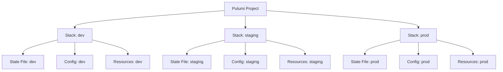
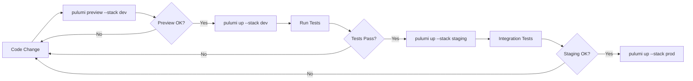
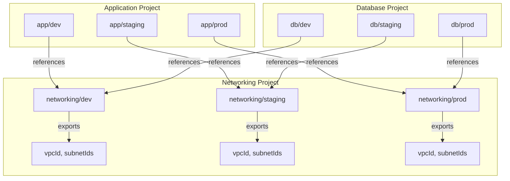
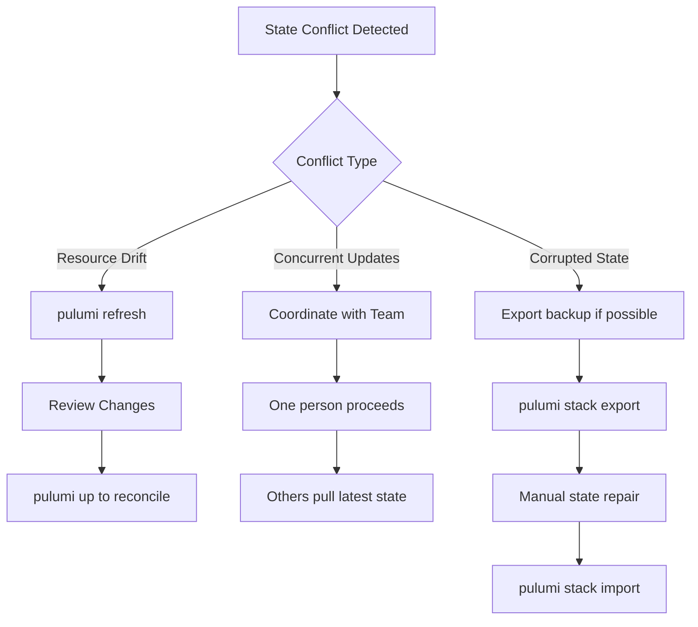

# How to Use Pulumi Stacks

Author: [nawazdhandala](https://www.github.com/nawazdhandala)

Tags: Pulumi, Infrastructure as Code, DevOps, Multi-Environment, State Management

Description: Learn how to use Pulumi Stacks to manage multiple infrastructure environments with isolation and shared code.

Pulumi Stacks provide a powerful way to manage multiple instances of your infrastructure. Whether you need separate environments for development, staging, and production, or want to deploy the same infrastructure across different regions, stacks make it straightforward to maintain isolation while sharing code.

## What Are Pulumi Stacks?

A stack in Pulumi represents an isolated instance of your infrastructure program. Each stack has its own state file, configuration values, and deployed resources. Stacks allow you to deploy the same infrastructure code multiple times with different configurations.

The following diagram illustrates how stacks relate to your Pulumi project:



## Setting Up Your First Stack

Before creating stacks, you need a Pulumi project. Let me walk you through the complete setup process.

### Installing Pulumi

The following commands install Pulumi on different operating systems:

```bash
# Install Pulumi on macOS using Homebrew
brew install pulumi

# Install Pulumi on Linux using the install script
curl -fsSL https://get.pulumi.com | sh

# Install Pulumi on Windows using Chocolatey
choco install pulumi
```

### Creating a New Project

Initialize a new Pulumi project with your preferred language. The following example creates a TypeScript project for AWS:

```bash
# Create a new directory for your project
mkdir my-infrastructure && cd my-infrastructure

# Initialize a new Pulumi project with AWS and TypeScript
pulumi new aws-typescript
```

### Creating Your First Stack

When you create a new project, Pulumi automatically creates a default stack. You can create additional stacks using the CLI:

```bash
# Create a new stack named 'dev'
pulumi stack init dev

# Create a stack for staging
pulumi stack init staging

# Create a stack for production
pulumi stack init prod
```

## Stack Configuration

Each stack can have its own configuration values, allowing you to customize deployments without changing code.

### Setting Configuration Values

Configuration values are stored per-stack and can include both plain text and secrets. Here is how to set them:

```bash
# Set a plain configuration value for the current stack
pulumi config set aws:region us-west-2

# Set an application-specific configuration
pulumi config set instanceType t3.micro

# Set a secret configuration value (encrypted)
pulumi config set --secret databasePassword mySecretPassword123

# Set configuration for a specific stack
pulumi config set aws:region eu-west-1 --stack prod
```

### Reading Configuration in Code

The following TypeScript example demonstrates how to read configuration values in your Pulumi program:

```typescript
// index.ts - Reading stack configuration in Pulumi
import * as pulumi from "@pulumi/pulumi";
import * as aws from "@pulumi/aws";

// Create a Config object to read stack configuration
const config = new pulumi.Config();

// Read required configuration values
// The program will fail if 'instanceType' is not set
const instanceType = config.require("instanceType");

// Read optional configuration with a default value
const instanceCount = config.getNumber("instanceCount") || 1;

// Read secret configuration values
// Secrets are automatically decrypted when accessed
const dbPassword = config.requireSecret("databasePassword");

// Read configuration from a specific namespace
const awsConfig = new pulumi.Config("aws");
const region = awsConfig.require("region");

// Use configuration values in your resources
const server = new aws.ec2.Instance("web-server", {
    instanceType: instanceType,
    ami: "ami-0c55b159cbfafe1f0",
    tags: {
        Name: `web-server-${pulumi.getStack()}`,
        Environment: pulumi.getStack(),
    },
});

export const serverPublicIp = server.publicIp;
```

### Stack Configuration Files

Pulumi stores configuration in YAML files named after each stack. Here is an example of the file structure:

```yaml
# Pulumi.dev.yaml - Configuration for the dev stack
config:
  aws:region: us-west-2
  my-infrastructure:instanceType: t3.micro
  my-infrastructure:instanceCount: "1"
  my-infrastructure:databasePassword:
    secure: AAABAMoT5xPj8Kzr4...encrypted...
```

## Working with Multiple Stacks

Managing multiple stacks effectively requires understanding stack selection, comparison, and organization.

### Selecting and Switching Stacks

Use these commands to navigate between stacks:

```bash
# List all available stacks
pulumi stack ls

# Select a specific stack to work with
pulumi stack select staging

# Show currently selected stack
pulumi stack

# View stack output values
pulumi stack output
```

### Deploying to Different Stacks

The deployment workflow varies based on which stack you are targeting. Here is the typical process:

```bash
# Deploy to the currently selected stack
pulumi up

# Preview changes without deploying
pulumi preview

# Deploy to a specific stack without selecting it
pulumi up --stack prod

# Deploy with automatic approval (useful in CI/CD)
pulumi up --yes --stack prod
```

The following diagram shows a typical multi-stack deployment workflow:



## Stack References

Stack references allow one stack to read outputs from another stack. Stack references are useful when you have dependencies between stacks or want to share infrastructure.

### Creating Stack Outputs

First, define outputs in your source stack that other stacks can reference:

```typescript
// networking/index.ts - Networking stack with exportable outputs
import * as pulumi from "@pulumi/pulumi";
import * as aws from "@pulumi/aws";

// Create a VPC that other stacks will use
const vpc = new aws.ec2.Vpc("main-vpc", {
    cidrBlock: "10.0.0.0/16",
    enableDnsHostnames: true,
    enableDnsSupport: true,
    tags: {
        Name: `vpc-${pulumi.getStack()}`,
    },
});

// Create subnets within the VPC
const publicSubnet = new aws.ec2.Subnet("public-subnet", {
    vpcId: vpc.id,
    cidrBlock: "10.0.1.0/24",
    availabilityZone: "us-west-2a",
    mapPublicIpOnLaunch: true,
});

const privateSubnet = new aws.ec2.Subnet("private-subnet", {
    vpcId: vpc.id,
    cidrBlock: "10.0.2.0/24",
    availabilityZone: "us-west-2b",
});

// Export values that other stacks can reference
export const vpcId = vpc.id;
export const publicSubnetId = publicSubnet.id;
export const privateSubnetId = privateSubnet.id;
export const vpcCidrBlock = vpc.cidrBlock;
```

### Referencing Another Stack

Now create a stack reference in your application stack to use the networking outputs:

```typescript
// application/index.ts - Application stack referencing the networking stack
import * as pulumi from "@pulumi/pulumi";
import * as aws from "@pulumi/aws";

// Get the current stack name to determine the environment
const env = pulumi.getStack();

// Create a reference to the networking stack
// Format: <organization>/<project>/<stack>
const networkingStack = new pulumi.StackReference(`myorg/networking/${env}`);

// Read outputs from the referenced stack
// These values are resolved asynchronously
const vpcId = networkingStack.getOutput("vpcId");
const publicSubnetId = networkingStack.getOutput("publicSubnetId");
const privateSubnetId = networkingStack.getOutput("privateSubnetId");

// Create a security group in the referenced VPC
const webSecurityGroup = new aws.ec2.SecurityGroup("web-sg", {
    vpcId: vpcId,
    description: "Security group for web servers",
    ingress: [
        {
            protocol: "tcp",
            fromPort: 80,
            toPort: 80,
            cidrBlocks: ["0.0.0.0/0"],
        },
        {
            protocol: "tcp",
            fromPort: 443,
            toPort: 443,
            cidrBlocks: ["0.0.0.0/0"],
        },
    ],
    egress: [
        {
            protocol: "-1",
            fromPort: 0,
            toPort: 0,
            cidrBlocks: ["0.0.0.0/0"],
        },
    ],
});

// Deploy an EC2 instance in the public subnet from the networking stack
const webServer = new aws.ec2.Instance("web-server", {
    ami: "ami-0c55b159cbfafe1f0",
    instanceType: "t3.micro",
    subnetId: publicSubnetId,
    vpcSecurityGroupIds: [webSecurityGroup.id],
    tags: {
        Name: `web-server-${env}`,
        Environment: env,
    },
});

export const webServerIp = webServer.publicIp;
```

The following diagram shows how stack references create dependencies between stacks:



## Stack Organization Strategies

Choosing the right stack organization strategy depends on your team size, deployment patterns, and infrastructure complexity.

### Strategy 1: Environment-Based Stacks

Use separate stacks for each environment. Each environment gets complete isolation with its own state:

```bash
# Create environment-based stacks
pulumi stack init dev
pulumi stack init staging
pulumi stack init prod

# Set environment-specific configuration
pulumi config set aws:region us-west-2 --stack dev
pulumi config set aws:region us-east-1 --stack staging
pulumi config set aws:region eu-west-1 --stack prod
```

### Strategy 2: Region-Based Stacks

For multi-region deployments, create stacks per region:

```bash
# Create region-based stacks
pulumi stack init us-west-2
pulumi stack init us-east-1
pulumi stack init eu-west-1
pulumi stack init ap-southeast-1

# Configure each stack for its region
pulumi config set aws:region us-west-2 --stack us-west-2
pulumi config set aws:region us-east-1 --stack us-east-1
```

### Strategy 3: Combined Environment and Region Stacks

For complex deployments requiring both environment and region isolation:

```bash
# Create combined stacks
pulumi stack init dev-us-west-2
pulumi stack init dev-us-east-1
pulumi stack init prod-us-west-2
pulumi stack init prod-us-east-1
pulumi stack init prod-eu-west-1
```

The following TypeScript code shows how to handle this naming convention programmatically:

```typescript
// index.ts - Parsing combined stack names for environment and region
import * as pulumi from "@pulumi/pulumi";
import * as aws from "@pulumi/aws";

// Parse the stack name to extract environment and region
// Expected format: "env-region" (e.g., "prod-us-west-2")
const stackName = pulumi.getStack();
const [environment, ...regionParts] = stackName.split("-");
const region = regionParts.join("-");

// Validate the parsed values
if (!environment || !region) {
    throw new Error(
        `Invalid stack name format. Expected 'env-region', got '${stackName}'`
    );
}

// Configure the AWS provider with the parsed region
const awsProvider = new aws.Provider("aws-provider", {
    region: region as aws.Region,
});

// Determine instance sizing based on environment
const instanceSizing: Record<string, string> = {
    dev: "t3.micro",
    staging: "t3.small",
    prod: "t3.large",
};

const instanceType = instanceSizing[environment] || "t3.micro";

// Create resources with environment and region awareness
const server = new aws.ec2.Instance(
    "web-server",
    {
        instanceType: instanceType,
        ami: "ami-0c55b159cbfafe1f0",
        tags: {
            Name: `web-server-${environment}-${region}`,
            Environment: environment,
            Region: region,
        },
    },
    { provider: awsProvider }
);

export const serverInfo = {
    environment: environment,
    region: region,
    instanceType: instanceType,
    publicIp: server.publicIp,
};
```

## CI/CD Integration with Stacks

Integrating Pulumi stacks into your CI/CD pipeline ensures consistent and automated deployments.

### GitHub Actions Workflow

The following workflow demonstrates deploying to multiple stacks based on the git branch:

```yaml
# .github/workflows/deploy.yaml
name: Deploy Infrastructure

on:
  push:
    branches:
      - main
      - develop
  pull_request:
    branches:
      - main

env:
  PULUMI_ACCESS_TOKEN: ${{ secrets.PULUMI_ACCESS_TOKEN }}

jobs:
  preview:
    name: Preview Changes
    runs-on: ubuntu-latest
    if: github.event_name == 'pull_request'
    steps:
      - uses: actions/checkout@v4

      - name: Setup Node.js
        uses: actions/setup-node@v4
        with:
          node-version: '20'

      - name: Install Dependencies
        run: npm ci

      - name: Configure AWS Credentials
        uses: aws-actions/configure-aws-credentials@v4
        with:
          aws-access-key-id: ${{ secrets.AWS_ACCESS_KEY_ID }}
          aws-secret-access-key: ${{ secrets.AWS_SECRET_ACCESS_KEY }}
          aws-region: us-west-2

      - name: Preview Infrastructure Changes
        uses: pulumi/actions@v5
        with:
          command: preview
          stack-name: dev

  deploy-dev:
    name: Deploy to Dev
    runs-on: ubuntu-latest
    if: github.ref == 'refs/heads/develop'
    steps:
      - uses: actions/checkout@v4

      - name: Setup Node.js
        uses: actions/setup-node@v4
        with:
          node-version: '20'

      - name: Install Dependencies
        run: npm ci

      - name: Configure AWS Credentials
        uses: aws-actions/configure-aws-credentials@v4
        with:
          aws-access-key-id: ${{ secrets.AWS_ACCESS_KEY_ID }}
          aws-secret-access-key: ${{ secrets.AWS_SECRET_ACCESS_KEY }}
          aws-region: us-west-2

      - name: Deploy to Dev Stack
        uses: pulumi/actions@v5
        with:
          command: up
          stack-name: dev

  deploy-prod:
    name: Deploy to Production
    runs-on: ubuntu-latest
    if: github.ref == 'refs/heads/main'
    needs: [deploy-staging]
    environment: production
    steps:
      - uses: actions/checkout@v4

      - name: Setup Node.js
        uses: actions/setup-node@v4
        with:
          node-version: '20'

      - name: Install Dependencies
        run: npm ci

      - name: Configure AWS Credentials
        uses: aws-actions/configure-aws-credentials@v4
        with:
          aws-access-key-id: ${{ secrets.AWS_PROD_ACCESS_KEY_ID }}
          aws-secret-access-key: ${{ secrets.AWS_PROD_SECRET_ACCESS_KEY }}
          aws-region: us-west-2

      - name: Deploy to Production Stack
        uses: pulumi/actions@v5
        with:
          command: up
          stack-name: prod

  deploy-staging:
    name: Deploy to Staging
    runs-on: ubuntu-latest
    if: github.ref == 'refs/heads/main'
    steps:
      - uses: actions/checkout@v4

      - name: Setup Node.js
        uses: actions/setup-node@v4
        with:
          node-version: '20'

      - name: Install Dependencies
        run: npm ci

      - name: Configure AWS Credentials
        uses: aws-actions/configure-aws-credentials@v4
        with:
          aws-access-key-id: ${{ secrets.AWS_ACCESS_KEY_ID }}
          aws-secret-access-key: ${{ secrets.AWS_SECRET_ACCESS_KEY }}
          aws-region: us-west-2

      - name: Deploy to Staging Stack
        uses: pulumi/actions@v5
        with:
          command: up
          stack-name: staging
```

## Stack State Management

Understanding how to manage stack state is crucial for maintaining healthy infrastructure.

### Exporting and Importing State

Sometimes you need to migrate or backup stack state. Here is how to do it:

```bash
# Export the current stack state to a file
pulumi stack export --file stack-backup.json

# Import state into a stack (use with caution)
pulumi stack import --file stack-backup.json

# Export state from a specific stack
pulumi stack export --stack prod --file prod-backup.json
```

### Refreshing Stack State

When infrastructure changes outside of Pulumi, refresh the state to synchronize:

```bash
# Refresh state to match actual cloud resources
pulumi refresh

# Preview refresh changes without applying
pulumi refresh --preview-only

# Refresh a specific stack
pulumi refresh --stack staging
```

### Handling State Conflicts

The following diagram illustrates common state management scenarios:



## Stack Deletion and Cleanup

Properly cleaning up stacks prevents orphaned resources and unnecessary costs.

### Destroying Stack Resources

Before deleting a stack, destroy all its resources:

```bash
# Destroy all resources in the current stack
pulumi destroy

# Preview destruction without executing
pulumi destroy --preview-only

# Destroy with automatic confirmation
pulumi destroy --yes --stack dev

# Force destroy even if some resources fail
pulumi destroy --yes --skip-preview
```

### Removing the Stack

After destroying resources, remove the stack itself:

```bash
# Remove the stack after resources are destroyed
pulumi stack rm dev

# Force remove a stack with remaining resources (dangerous)
pulumi stack rm dev --force

# Remove a stack and preserve the history
pulumi stack rm dev --preserve-history
```

## Best Practices for Using Stacks

Following these best practices ensures maintainable and reliable infrastructure.

### Naming Conventions

Establish clear naming conventions for your stacks:

```bash
# Environment-based naming
project-name/dev
project-name/staging
project-name/prod

# Regional naming
project-name/us-west-2
project-name/eu-west-1

# Combined naming for complex scenarios
project-name/prod-us-west-2
project-name/prod-eu-west-1
```

### Configuration Management

Use structured configuration to keep stacks consistent:

```typescript
// config/index.ts - Centralized configuration management
import * as pulumi from "@pulumi/pulumi";

// Define configuration interface for type safety
interface StackConfig {
    environment: string;
    region: string;
    instanceType: string;
    instanceCount: number;
    enableMonitoring: boolean;
    alertEmail: string;
}

// Environment-specific defaults
const environmentDefaults: Record<string, Partial<StackConfig>> = {
    dev: {
        instanceType: "t3.micro",
        instanceCount: 1,
        enableMonitoring: false,
    },
    staging: {
        instanceType: "t3.small",
        instanceCount: 2,
        enableMonitoring: true,
    },
    prod: {
        instanceType: "t3.large",
        instanceCount: 3,
        enableMonitoring: true,
    },
};

// Load and merge configuration
export function loadConfig(): StackConfig {
    const config = new pulumi.Config();
    const awsConfig = new pulumi.Config("aws");
    const env = pulumi.getStack();
    const defaults = environmentDefaults[env] || environmentDefaults.dev;

    return {
        environment: env,
        region: awsConfig.require("region"),
        instanceType: config.get("instanceType") || defaults.instanceType!,
        instanceCount: config.getNumber("instanceCount") || defaults.instanceCount!,
        enableMonitoring: config.getBoolean("enableMonitoring") ?? defaults.enableMonitoring!,
        alertEmail: config.require("alertEmail"),
    };
}
```

### Stack Tagging

Tag all resources with stack information for easier management:

```typescript
// utils/tagging.ts - Consistent resource tagging
import * as pulumi from "@pulumi/pulumi";

// Generate standard tags for all resources
export function getStandardTags(resourceName: string): Record<string, string> {
    const stack = pulumi.getStack();
    const project = pulumi.getProject();

    return {
        Name: `${resourceName}-${stack}`,
        Environment: stack,
        Project: project,
        ManagedBy: "pulumi",
        Stack: `${project}/${stack}`,
        CreatedAt: new Date().toISOString().split("T")[0],
    };
}

// Merge custom tags with standard tags
export function mergeTags(
    resourceName: string,
    customTags: Record<string, string> = {}
): Record<string, string> {
    return {
        ...getStandardTags(resourceName),
        ...customTags,
    };
}
```

## Troubleshooting Common Issues

Here are solutions to common problems you might encounter with Pulumi stacks.

### Stack Lock Issues

When a stack is locked by another operation:

```bash
# View current stack lock status
pulumi stack --show-ids

# Cancel a stuck update (use with caution)
pulumi cancel

# Force unlock if you are certain no operation is running
# Note: This should only be used as a last resort
pulumi stack export > backup.json
# Then manually remove the lock via Pulumi Cloud console
```

### Configuration Not Found Errors

When configuration values are missing:

```bash
# List all configuration for current stack
pulumi config

# Check configuration across all stacks
for stack in $(pulumi stack ls --json | jq -r '.[].name'); do
    echo "=== $stack ==="
    pulumi config --stack $stack
done
```

### Resource Already Exists

When Pulumi tries to create a resource that already exists:

```bash
# Import the existing resource into Pulumi state
pulumi import aws:ec2/instance:Instance my-server i-1234567890abcdef0

# After import, run preview to verify state matches
pulumi preview
```

## Conclusion

Pulumi Stacks provide a flexible and powerful way to manage multiple infrastructure deployments from a single codebase. By understanding stack configuration, references, and organizational strategies, you can build scalable and maintainable infrastructure as code solutions.

Key takeaways from this guide include:

- Stacks enable complete isolation between different deployments of the same infrastructure
- Stack configuration allows environment-specific customization without code changes
- Stack references enable sharing outputs between related stacks
- Proper CI/CD integration automates deployments across multiple stacks
- Following naming conventions and tagging practices improves manageability

Start with simple environment-based stacks and evolve your stack strategy as your infrastructure grows. The patterns and practices covered here scale from small projects to enterprise-level deployments.
