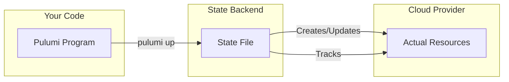
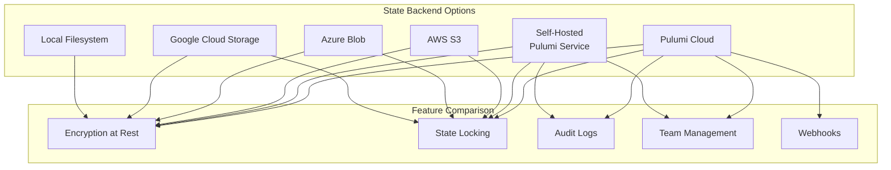
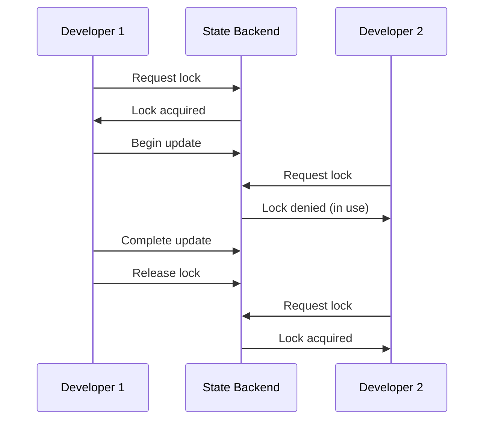
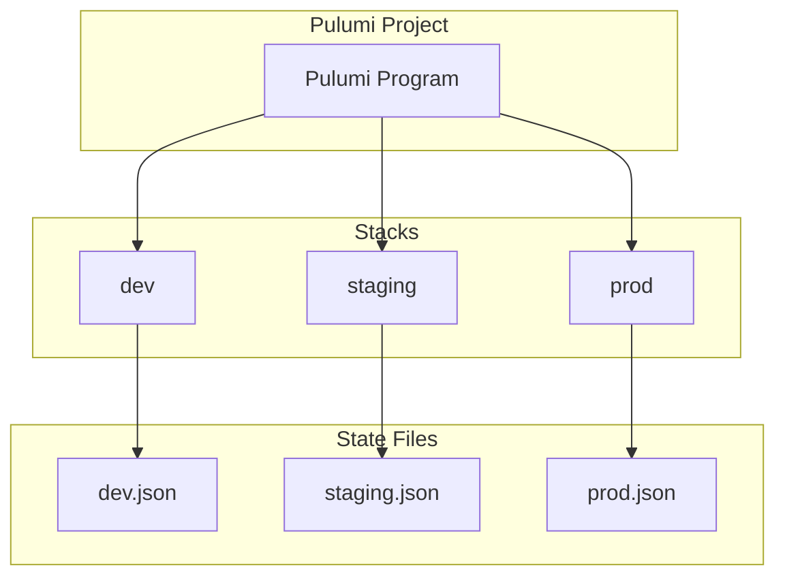
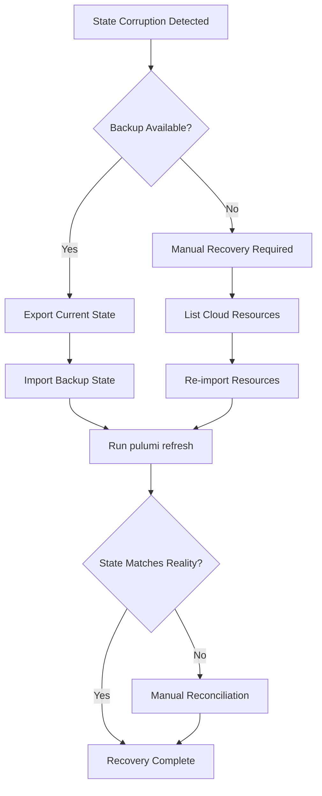
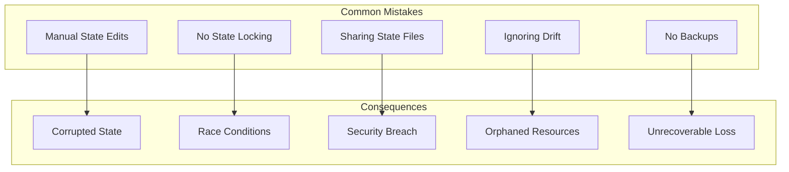

# How to Manage Pulumi State

Author: [nawazdhandala](https://www.github.com/nawazdhandala)

Tags: Pulumi, Infrastructure as Code, DevOps, State Management, Cloud, IaC

Description: A comprehensive guide to managing Pulumi state effectively, covering backend options, state operations, team collaboration, and best practices for production environments.

---

Pulumi state tracks the mapping between your infrastructure code and the actual cloud resources. Improper state management can lead to orphaned resources, deployment failures, and team conflicts. Understanding how to manage state properly is essential for production-grade infrastructure deployments.

## Understanding Pulumi State

Pulumi state contains a snapshot of your infrastructure. Every resource you create, update, or delete gets recorded in the state file.



The state file stores:
- Resource URNs (unique identifiers)
- Input properties you specified
- Output properties from the cloud provider
- Dependencies between resources
- Stack configuration and secrets

## Choosing a State Backend

Pulumi supports multiple backends for storing state. Each has trade-offs in terms of features, cost, and operational complexity.



### Pulumi Cloud Backend (Recommended)

Pulumi Cloud is the default and most feature-rich option. It provides automatic state locking, encryption, audit logs, and team collaboration features.

The following command logs you into Pulumi Cloud and sets it as your default backend:

```bash
# Login to Pulumi Cloud
pulumi login

# Verify your login status
pulumi whoami -v
```

### Self-Managed Cloud Storage Backends

For organizations that need to keep state in their own infrastructure, Pulumi supports major cloud storage services.

#### AWS S3 Backend

Create an S3 bucket with versioning and encryption enabled before using it as a backend:

```bash
# Create S3 bucket for state storage
aws s3api create-bucket \
    --bucket my-pulumi-state \
    --region us-east-1

# Enable versioning to protect against accidental deletions
aws s3api put-bucket-versioning \
    --bucket my-pulumi-state \
    --versioning-configuration Status=Enabled

# Enable server-side encryption
aws s3api put-bucket-encryption \
    --bucket my-pulumi-state \
    --server-side-encryption-configuration '{
        "Rules": [{
            "ApplyServerSideEncryptionByDefault": {
                "SSEAlgorithm": "aws:kms"
            }
        }]
    }'

# Login to S3 backend
pulumi login s3://my-pulumi-state
```

#### Azure Blob Storage Backend

Azure Blob containers can store Pulumi state with built-in redundancy:

```bash
# Create storage account
az storage account create \
    --name mypulumistate \
    --resource-group my-rg \
    --location eastus \
    --sku Standard_LRS \
    --encryption-services blob

# Create container for state files
az storage container create \
    --name pulumi-state \
    --account-name mypulumistate

# Login to Azure Blob backend
pulumi login azblob://pulumi-state
```

#### Google Cloud Storage Backend

GCS buckets with uniform bucket-level access provide a secure state backend:

```bash
# Create GCS bucket with uniform access
gsutil mb -l us-central1 gs://my-pulumi-state

# Enable versioning
gsutil versioning set on gs://my-pulumi-state

# Login to GCS backend
pulumi login gs://my-pulumi-state
```

### Local Filesystem Backend

Local backends work for development and testing but should never be used in production:

```bash
# Login to local filesystem backend
pulumi login --local

# Or specify a custom path
pulumi login file://~/.pulumi-state
```

## State Operations

### Viewing State

Inspecting state helps debug issues and understand your infrastructure:

```bash
# List all resources in the current stack
pulumi stack --show-urns

# Export state to JSON for inspection
pulumi stack export --file state.json

# View specific resource details
pulumi stack export | jq '.deployment.resources[] | select(.type == "aws:s3/bucket:Bucket")'
```

### Importing Existing Resources

When you need to bring existing cloud resources under Pulumi management, use the import command.

The following TypeScript code defines a bucket resource that matches an existing S3 bucket:

```typescript
// index.ts - Define the resource to import
import * as aws from "@pulumi/aws";

// Create a resource definition that matches the existing bucket
const existingBucket = new aws.s3.Bucket("my-existing-bucket", {
    bucket: "my-actual-bucket-name",
    // Specify properties that match the existing resource
    acl: "private",
    versioning: {
        enabled: true,
    },
}, {
    // Prevent Pulumi from trying to create a new resource
    import: "my-actual-bucket-name",
});
```

Run the import command to bring the resource into state:

```bash
# Import the existing resource into Pulumi state
pulumi up

# After successful import, remove the import option from your code
# The resource is now fully managed by Pulumi
```

### Refreshing State

State can drift when changes happen outside of Pulumi. Refresh synchronizes state with actual cloud resources:

```bash
# Preview what refresh will detect
pulumi refresh --preview

# Refresh state to match actual cloud resources
pulumi refresh

# Skip the confirmation prompt for automation
pulumi refresh --yes
```

### Removing Resources from State

Sometimes you need to remove a resource from state without deleting it from the cloud:

```bash
# Remove a specific resource from state by URN
pulumi state delete 'urn:pulumi:prod::my-project::aws:s3/bucket:Bucket::my-bucket'

# List all URNs to find the one you need
pulumi stack --show-urns
```

### Renaming Resources

Renaming resources requires careful state manipulation to avoid recreation:

```bash
# Rename a resource in state
pulumi state rename \
    'urn:pulumi:prod::my-project::aws:s3/bucket:Bucket::old-name' \
    'urn:pulumi:prod::my-project::aws:s3/bucket:Bucket::new-name'
```

## State Locking

State locking prevents concurrent modifications that could corrupt state.



### Pulumi Cloud Locking

Pulumi Cloud handles locking automatically. No configuration needed.

### S3 Backend with DynamoDB Locking

For S3 backends, use DynamoDB for state locking:

```bash
# Create DynamoDB table for locking
aws dynamodb create-table \
    --table-name pulumi-state-lock \
    --attribute-definitions AttributeName=LockID,AttributeType=S \
    --key-schema AttributeName=LockID,KeyType=HASH \
    --billing-mode PAY_PER_REQUEST

# Set environment variable to enable locking
export PULUMI_SELF_MANAGED_STATE_LOCKING=1
```

### Handling Lock Conflicts

When a lock is stuck, you may need to manually release it:

```bash
# Cancel the current update (releases lock)
pulumi cancel

# If that fails, check for stuck processes
ps aux | grep pulumi

# Force unlock (use with caution)
# For Pulumi Cloud, contact support
# For S3+DynamoDB, delete the lock item from DynamoDB
```

## Stack Management

Stacks represent different environments or configurations of your infrastructure.



### Creating and Switching Stacks

Manage multiple environments with stack commands:

```bash
# Create a new stack
pulumi stack init dev

# List all stacks
pulumi stack ls

# Switch to a different stack
pulumi stack select prod

# Create stack with specific backend
pulumi stack init prod --secrets-provider="awskms://alias/pulumi-secrets"
```

### Stack Configuration

Each stack can have its own configuration values:

```bash
# Set a configuration value for the current stack
pulumi config set aws:region us-west-2

# Set a secret value (encrypted in state)
pulumi config set --secret dbPassword "supersecret123"

# View all configuration
pulumi config

# Copy configuration between stacks
pulumi config cp --stack dev --dest staging
```

### Stack References

Access outputs from other stacks using stack references.

The following TypeScript code retrieves VPC ID from a networking stack:

```typescript
// index.ts - Reference another stack's outputs
import * as pulumi from "@pulumi/pulumi";

// Create a reference to the networking stack
const networkStack = new pulumi.StackReference("myorg/networking/prod");

// Get the VPC ID output from the networking stack
const vpcId = networkStack.getOutput("vpcId");

// Use the VPC ID in your resources
export const usedVpcId = vpcId;
```

## State Backup and Recovery

### Automatic Backups

Pulumi Cloud maintains automatic backups. For self-managed backends, implement your own backup strategy.

The following script creates automated backups of your Pulumi state:

```bash
#!/bin/bash
# backup-state.sh - Backup Pulumi state to a timestamped file

set -e

BACKUP_DIR="/backups/pulumi-state"
TIMESTAMP=$(date +%Y%m%d-%H%M%S)
STACK_NAME=$(pulumi stack --show-name)

mkdir -p "${BACKUP_DIR}"

# Export current state
pulumi stack export --file "${BACKUP_DIR}/${STACK_NAME}-${TIMESTAMP}.json"

# Keep only last 30 backups
ls -t "${BACKUP_DIR}"/${STACK_NAME}-*.json | tail -n +31 | xargs -r rm

echo "Backup created: ${BACKUP_DIR}/${STACK_NAME}-${TIMESTAMP}.json"
```

### Restoring from Backup

Restore state from a backup file when recovery is needed:

```bash
# Preview what the import will change
pulumi stack export > current-state-backup.json

# Import the backup state
pulumi stack import --file backup-state.json

# Refresh to verify state matches reality
pulumi refresh
```

### Disaster Recovery Plan



## Team Collaboration

### Access Control with Pulumi Cloud

Pulumi Cloud provides role-based access control for teams:

```bash
# Invite team member to organization
pulumi org member add user@example.com --role admin

# Create a team
pulumi team create infrastructure-team

# Add stack permissions for a team
pulumi stack set-team infrastructure-team --permission write
```

### Audit Logging

Track all state changes with audit logs:

```bash
# View stack activity (Pulumi Cloud)
pulumi stack history

# Export activity for compliance
pulumi stack history --json > audit-log.json
```

## CI/CD Integration

### GitHub Actions Example

The following workflow file demonstrates proper state management in CI/CD:

```yaml
# .github/workflows/pulumi.yml
name: Pulumi Infrastructure

on:
  push:
    branches: [main]
  pull_request:
    branches: [main]

env:
  PULUMI_ACCESS_TOKEN: ${{ secrets.PULUMI_ACCESS_TOKEN }}

jobs:
  preview:
    if: github.event_name == 'pull_request'
    runs-on: ubuntu-latest
    steps:
      - uses: actions/checkout@v4

      - uses: pulumi/actions@v5
        with:
          command: preview
          stack-name: myorg/myproject/staging
          comment-on-pr: true
          # Refresh state before preview to catch drift
          refresh: true

  deploy:
    if: github.ref == 'refs/heads/main'
    runs-on: ubuntu-latest
    steps:
      - uses: actions/checkout@v4

      - uses: pulumi/actions@v5
        with:
          command: up
          stack-name: myorg/myproject/prod
          # Refresh and auto-approve for automated deployments
          refresh: true
```

### State Protection in CI/CD

Implement safeguards to prevent accidental state corruption:

```bash
#!/bin/bash
# pre-deploy-check.sh - Verify state health before deployment

set -e

echo "Checking stack health..."

# Verify we can access the backend
pulumi whoami -v || {
    echo "ERROR: Cannot authenticate with Pulumi backend"
    exit 1
}

# Check for pending operations
PENDING=$(pulumi stack export | jq '.deployment.pending_operations | length')
if [ "$PENDING" -gt 0 ]; then
    echo "ERROR: Stack has pending operations. Run 'pulumi cancel' first."
    exit 1
fi

# Refresh to detect drift
pulumi refresh --expect-no-changes --yes || {
    echo "WARNING: State drift detected. Review changes before proceeding."
    exit 1
}

echo "Stack health check passed."
```

## Secrets Management

Pulumi encrypts secrets in state using provider-specific encryption.

### Secrets Providers

Configure different encryption providers for your stacks:

```bash
# Use Pulumi Cloud for secrets (default)
pulumi stack init prod

# Use AWS KMS
pulumi stack init prod --secrets-provider="awskms://alias/pulumi-secrets"

# Use Azure Key Vault
pulumi stack init prod --secrets-provider="azurekeyvault://my-vault.vault.azure.net/keys/pulumi-key"

# Use GCP KMS
pulumi stack init prod --secrets-provider="gcpkms://projects/my-project/locations/global/keyRings/my-ring/cryptoKeys/pulumi-key"

# Use a passphrase
pulumi stack init prod --secrets-provider="passphrase"
```

### Rotating Secrets

Change the encryption provider or rotate keys without losing data:

```bash
# Export state with current encryption
pulumi stack export --show-secrets --file state-plaintext.json

# Change secrets provider
pulumi stack change-secrets-provider "awskms://alias/new-pulumi-key"

# Or re-import with new encryption
pulumi stack import --file state-plaintext.json

# Securely delete the plaintext export
shred -u state-plaintext.json
```

## Best Practices

### State Hygiene Checklist

Follow these practices for healthy state management:

1. **Never edit state files manually** - Use `pulumi state` commands instead
2. **Always refresh before major operations** - Catch drift early
3. **Use separate stacks for environments** - Isolate blast radius
4. **Enable state locking** - Prevent concurrent modifications
5. **Implement backup automation** - Prepare for disasters
6. **Audit state changes** - Track who changed what
7. **Use secrets providers** - Never store plaintext secrets
8. **Test state operations in dev first** - Validate procedures safely

### Common Pitfalls to Avoid



### Monitoring State Health

Set up alerts for state-related issues:

```typescript
// monitoring.ts - Monitor Pulumi state health
import * as pulumi from "@pulumi/pulumi";
import * as aws from "@pulumi/aws";

// Create CloudWatch alarm for failed state operations
const stateFailureAlarm = new aws.cloudwatch.MetricAlarm("pulumi-state-failures", {
    alarmDescription: "Alert when Pulumi state operations fail",
    metricName: "PulumiStateErrors",
    namespace: "Custom/Pulumi",
    statistic: "Sum",
    period: 300,
    evaluationPeriods: 1,
    threshold: 1,
    comparisonOperator: "GreaterThanOrEqualToThreshold",
    alarmActions: [snsTopicArn],
});
```

---

Proper state management separates successful Pulumi deployments from infrastructure nightmares. Start with Pulumi Cloud for simplicity, implement locking and backups from day one, and establish clear procedures for state operations. Your future self, debugging a production incident at 2 AM, will thank you.
