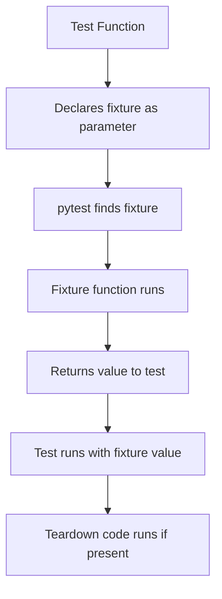
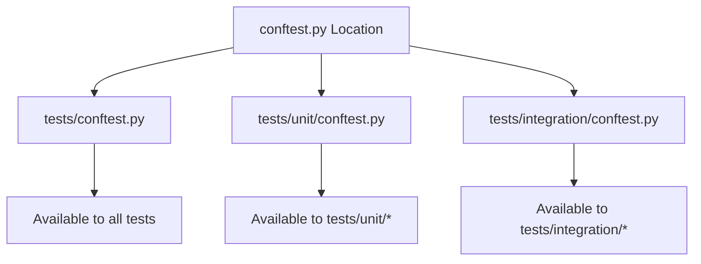
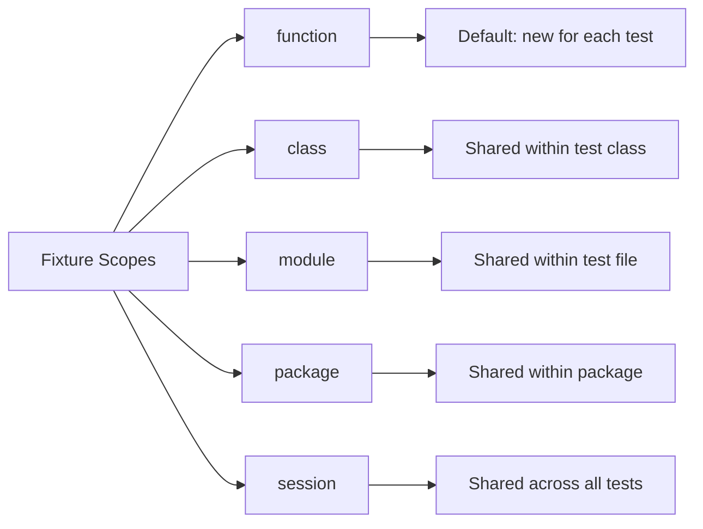
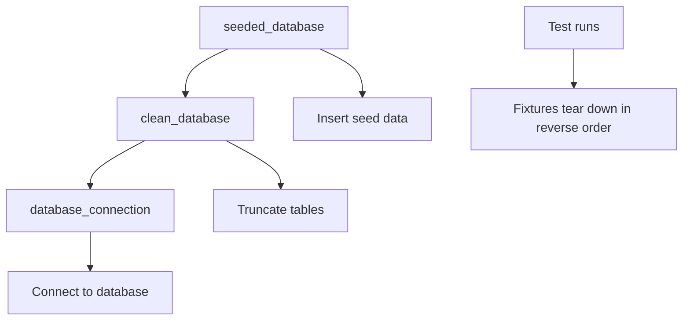

# How to Use pytest Fixtures

Author: [nawazdhandala](https://www.github.com/nawazdhandala)

Tags: pytest, Python, Testing, Fixtures

Description: A comprehensive guide to mastering pytest fixtures for Python testing, covering fixture creation, scopes, parametrization, factory patterns, and advanced techniques for building maintainable test suites.

---

> Fixtures are the foundation of effective pytest testing. They provide a clean, reusable way to set up test dependencies, manage resources, and keep your test code focused on what matters: verifying behavior.

When you start writing more than a handful of tests, you quickly realize that setup code becomes repetitive. Every test needs a database connection, a test user, or some configured object. Without fixtures, you end up copying and pasting setup code everywhere, making your tests brittle and hard to maintain.

pytest fixtures solve this problem elegantly. They let you define reusable test dependencies that are automatically injected into your tests, handle cleanup automatically, and can be shared across your entire test suite.

---

## What Are Fixtures?

Fixtures are functions decorated with `@pytest.fixture` that provide data, objects, or resources to your tests. Instead of manually creating test dependencies in each test, you declare what you need as function parameters, and pytest handles the rest.



---

## Creating Your First Fixture

A fixture is simply a function that returns (or yields) a value. Here is a basic example showing how to create and use fixtures.

```python
# tests/conftest.py
import pytest

# Define a simple fixture that provides test data
# The @pytest.fixture decorator marks this function as a fixture
@pytest.fixture
def sample_user():
    """Provides a sample user dictionary for testing."""
    return {
        "id": 1,
        "username": "johndoe",
        "email": "john@example.com",
        "is_active": True
    }
```

Use the fixture by adding it as a parameter to your test function. pytest automatically detects the parameter name and injects the fixture value.

```python
# tests/test_user.py
from myapp.user_service import UserService

# The sample_user parameter tells pytest to inject the fixture
def test_user_has_email(sample_user):
    # sample_user is now the dictionary returned by the fixture
    assert sample_user["email"] == "john@example.com"
    assert "@" in sample_user["email"]

def test_user_is_active_by_default(sample_user):
    # Each test gets a fresh copy from the fixture
    assert sample_user["is_active"] is True
```

---

## Fixture Placement: conftest.py

Fixtures can be defined in two places: directly in test files or in `conftest.py` files. The `conftest.py` file is a special pytest file that shares fixtures across multiple test modules.



```
tests/
    conftest.py           # Shared fixtures for all tests
    test_basic.py
    unit/
        conftest.py       # Fixtures for unit tests only
        test_models.py
        test_utils.py
    integration/
        conftest.py       # Fixtures for integration tests only
        test_api.py
        test_database.py
```

Fixtures in `conftest.py` are automatically discovered by pytest. You do not need to import them in your test files.

---

## Fixture Scopes

The scope parameter controls how often a fixture is created and destroyed. Choosing the right scope is crucial for test performance and isolation.



### Function Scope (Default)

Function scope creates a new fixture instance for each test. This is the safest option as it ensures complete test isolation.

```python
# tests/conftest.py
import pytest

# Function scope: created fresh for every test function
# This is the default scope, so scope="function" is optional
@pytest.fixture(scope="function")
def database_transaction():
    """Provides a database transaction that rolls back after each test."""
    db = Database()
    db.begin_transaction()

    yield db

    # This runs after each test
    db.rollback()
    db.close()
```

### Module Scope

Module scope creates one fixture instance per test file. Use this when the fixture is expensive to create but tests do not modify it.

```python
# tests/conftest.py
import pytest

# Module scope: created once per test file
# Useful for read-only resources that are expensive to create
@pytest.fixture(scope="module")
def api_client():
    """Provides an authenticated API client for the entire module."""
    client = APIClient()
    client.authenticate()

    yield client

    # This runs once after all tests in the module complete
    client.logout()
```

### Session Scope

Session scope creates one fixture instance for the entire test run. Use this for resources that are very expensive to create and are read-only.

```python
# tests/conftest.py
import pytest
import docker

# Session scope: created once for the entire test session
# Perfect for expensive resources like Docker containers
@pytest.fixture(scope="session")
def postgres_container():
    """Starts a PostgreSQL container for the entire test session."""
    client = docker.from_env()
    container = client.containers.run(
        "postgres:15",
        environment={
            "POSTGRES_USER": "test",
            "POSTGRES_PASSWORD": "test",
            "POSTGRES_DB": "testdb"
        },
        ports={"5432/tcp": 5433},
        detach=True,
        remove=True
    )

    # Wait for PostgreSQL to be ready
    import time
    time.sleep(3)

    yield container

    # Stop container after all tests complete
    container.stop()
```

### Comparing Scopes

| Scope | Created | Destroyed | Use Case |
|-------|---------|-----------|----------|
| function | Before each test | After each test | Most fixtures, mutable state |
| class | Before first test in class | After last test in class | Shared state within a test class |
| module | Before first test in file | After last test in file | Expensive read-only resources |
| package | Before first test in package | After last test in package | Package-level resources |
| session | Once at start | Once at end | Very expensive resources like containers |

---

## Fixtures with Teardown

Use `yield` instead of `return` to run cleanup code after the test completes. Everything after `yield` runs as teardown, even if the test fails.

```python
# tests/conftest.py
import pytest
import tempfile
import shutil
import os

# Fixture that creates a temporary directory and cleans it up
@pytest.fixture
def temp_workspace():
    """Creates a temporary directory that is cleaned up after the test."""
    # Setup: create temporary directory
    workspace = tempfile.mkdtemp(prefix="test_workspace_")

    yield workspace

    # Teardown: remove the directory and all contents
    # This runs even if the test fails
    if os.path.exists(workspace):
        shutil.rmtree(workspace)

def test_file_creation(temp_workspace):
    # Create a file in the temporary workspace
    filepath = os.path.join(temp_workspace, "data.txt")
    with open(filepath, "w") as f:
        f.write("test data")

    assert os.path.exists(filepath)
    # After this test, the entire temp_workspace is deleted
```

### Multiple Cleanup Steps

For complex fixtures with multiple resources, you can use context managers or explicit cleanup lists.

```python
# tests/conftest.py
import pytest

@pytest.fixture
def multi_resource_fixture():
    """Demonstrates cleanup of multiple resources."""
    resources = []

    # Setup first resource
    db = Database()
    db.connect()
    resources.append(db)

    # Setup second resource
    cache = Cache()
    cache.connect()
    resources.append(cache)

    yield {"db": db, "cache": cache}

    # Teardown in reverse order
    for resource in reversed(resources):
        try:
            resource.disconnect()
        except Exception as e:
            print(f"Error during cleanup: {e}")
```

---

## Fixture Dependencies

Fixtures can depend on other fixtures. This lets you compose complex test setups from simple, reusable building blocks.

```python
# tests/conftest.py
import pytest

# Base fixture providing database connection
@pytest.fixture(scope="session")
def database_connection():
    """Provides a database connection for the session."""
    db = Database("postgresql://localhost/testdb")
    db.connect()
    yield db
    db.disconnect()

# Fixture that depends on database_connection
@pytest.fixture
def clean_database(database_connection):
    """Provides a clean database by truncating all tables."""
    # Use the database_connection fixture
    database_connection.execute("TRUNCATE users, orders, products CASCADE")
    yield database_connection
    # Cleanup happens automatically via the parent fixture

# Fixture that depends on clean_database
@pytest.fixture
def seeded_database(clean_database):
    """Provides a database with seed data."""
    clean_database.execute("""
        INSERT INTO users (id, name, email) VALUES
        (1, 'Alice', 'alice@example.com'),
        (2, 'Bob', 'bob@example.com')
    """)
    yield clean_database
```



Using fixture dependencies in tests.

```python
# tests/test_users.py

def test_find_user(seeded_database):
    # Database already has Alice and Bob
    result = seeded_database.query("SELECT * FROM users WHERE name = 'Alice'")
    assert len(result) == 1
    assert result[0]["email"] == "alice@example.com"
```

---

## Parametrized Fixtures

Fixtures can be parametrized to run tests with multiple configurations. This is different from `@pytest.mark.parametrize` because it creates multiple fixture instances rather than multiple test calls.

```python
# tests/conftest.py
import pytest

# Parametrized fixture runs the test once for each parameter
@pytest.fixture(params=["sqlite", "postgresql", "mysql"])
def database_type(request):
    """Provides different database types for testing."""
    # request.param contains the current parameter value
    return request.param

def test_connection_string_format(database_type):
    # This test runs three times: once for each database type
    connection_string = build_connection_string(database_type, "localhost", "testdb")

    assert database_type in connection_string
    assert "localhost" in connection_string
```

### Parametrized Fixtures with Setup

```python
# tests/conftest.py
import pytest

# Fixture that creates different database connections based on parameter
@pytest.fixture(params=[
    pytest.param("sqlite", id="sqlite-memory"),
    pytest.param("postgresql", id="postgres-local"),
])
def database(request):
    """Provides different database backends for testing."""
    db_type = request.param

    if db_type == "sqlite":
        db = SQLiteDatabase(":memory:")
    elif db_type == "postgresql":
        db = PostgreSQLDatabase("localhost", "testdb")

    db.connect()
    db.create_tables()

    yield db

    db.drop_tables()
    db.disconnect()

def test_insert_and_retrieve(database):
    # This test runs twice: once with SQLite, once with PostgreSQL
    database.insert("users", {"name": "Test User"})
    users = database.query("SELECT * FROM users")

    assert len(users) == 1
    assert users[0]["name"] == "Test User"
```

---

## Factory Fixtures

Factory fixtures return functions instead of objects. This gives tests more control over fixture creation and allows creating multiple instances with different configurations.

```python
# tests/conftest.py
import pytest
from dataclasses import dataclass
from typing import Optional

@dataclass
class User:
    id: int
    username: str
    email: str
    is_admin: bool = False
    is_active: bool = True

# Factory fixture returns a function that creates users
@pytest.fixture
def make_user():
    """Factory fixture that creates User instances with custom attributes."""
    created_users = []
    user_counter = 0

    def _make_user(
        username: Optional[str] = None,
        email: Optional[str] = None,
        is_admin: bool = False,
        is_active: bool = True
    ) -> User:
        nonlocal user_counter
        user_counter += 1

        user = User(
            id=user_counter,
            username=username or f"user{user_counter}",
            email=email or f"user{user_counter}@example.com",
            is_admin=is_admin,
            is_active=is_active
        )
        created_users.append(user)
        return user

    yield _make_user

    # Cleanup: log created users for debugging
    print(f"Created {len(created_users)} users during test")

def test_admin_permissions(make_user):
    # Create specific users needed for this test
    admin = make_user(username="admin", is_admin=True)
    regular = make_user(username="regular", is_admin=False)

    assert admin.is_admin is True
    assert regular.is_admin is False
    assert admin.id != regular.id

def test_user_deactivation(make_user):
    # Create active and inactive users
    active = make_user(is_active=True)
    inactive = make_user(is_active=False)

    assert active.is_active is True
    assert inactive.is_active is False
```

### Factory with Database Persistence

```python
# tests/conftest.py
import pytest

@pytest.fixture
def create_user(database):
    """Factory fixture that creates and persists users."""
    created_ids = []

    def _create_user(name, email, role="user"):
        user_id = database.execute(
            "INSERT INTO users (name, email, role) VALUES (?, ?, ?) RETURNING id",
            (name, email, role)
        )
        created_ids.append(user_id)
        return {"id": user_id, "name": name, "email": email, "role": role}

    yield _create_user

    # Cleanup: remove created users
    if created_ids:
        database.execute(
            f"DELETE FROM users WHERE id IN ({','.join('?' * len(created_ids))})",
            created_ids
        )

def test_user_roles(create_user):
    admin = create_user("Admin", "admin@test.com", role="admin")
    user = create_user("User", "user@test.com", role="user")

    assert admin["role"] == "admin"
    assert user["role"] == "user"
```

---

## Built-in Fixtures

pytest provides several built-in fixtures that you can use without defining them.

### tmp_path and tmp_path_factory

The `tmp_path` fixture provides a temporary directory unique to each test.

```python
# tests/test_files.py
import json

def test_json_file_operations(tmp_path):
    # tmp_path is a pathlib.Path object
    config_file = tmp_path / "config.json"

    # Write data
    config = {"debug": True, "log_level": "INFO"}
    config_file.write_text(json.dumps(config))

    # Read and verify
    loaded = json.loads(config_file.read_text())
    assert loaded["debug"] is True

    # Directory is automatically cleaned up after test

def test_multiple_files(tmp_path):
    # Create subdirectory
    data_dir = tmp_path / "data"
    data_dir.mkdir()

    # Create multiple files
    for i in range(5):
        (data_dir / f"file_{i}.txt").write_text(f"Content {i}")

    files = list(data_dir.glob("*.txt"))
    assert len(files) == 5
```

### capsys and capfd

Capture stdout and stderr output.

```python
# tests/test_output.py

def print_greeting(name):
    print(f"Hello, {name}!")

def test_capture_stdout(capsys):
    print_greeting("World")

    # Capture the output
    captured = capsys.readouterr()

    assert captured.out == "Hello, World!\n"
    assert captured.err == ""

def test_capture_stderr(capsys):
    import sys
    print("Error message", file=sys.stderr)

    captured = capsys.readouterr()

    assert captured.err == "Error message\n"
```

### monkeypatch

The `monkeypatch` fixture allows you to modify objects, dictionaries, and environment variables during tests.

```python
# tests/test_config.py
import os

def get_database_url():
    return os.environ.get("DATABASE_URL", "sqlite:///:memory:")

def test_database_url_from_environment(monkeypatch):
    # Set environment variable for this test only
    monkeypatch.setenv("DATABASE_URL", "postgresql://localhost/testdb")

    url = get_database_url()

    assert url == "postgresql://localhost/testdb"

def test_database_url_default(monkeypatch):
    # Remove environment variable
    monkeypatch.delenv("DATABASE_URL", raising=False)

    url = get_database_url()

    assert url == "sqlite:///:memory:"

def test_mock_function(monkeypatch):
    # Replace a function
    def mock_expensive_call():
        return {"mocked": True}

    monkeypatch.setattr("myapp.api.expensive_call", mock_expensive_call)

    result = api.process_data()
    assert result["mocked"] is True
```

### request

The `request` fixture provides information about the requesting test function.

```python
# tests/conftest.py
import pytest

@pytest.fixture
def log_test_name(request):
    """Logs the name of the current test."""
    test_name = request.node.name
    print(f"\nStarting test: {test_name}")

    yield

    print(f"Finished test: {test_name}")

@pytest.fixture
def conditional_setup(request):
    """Adjusts setup based on test markers."""
    # Check if test has 'slow' marker
    if request.node.get_closest_marker("slow"):
        print("Slow test detected, increasing timeout")
        return {"timeout": 60}
    return {"timeout": 10}
```

---

## Autouse Fixtures

Fixtures with `autouse=True` are automatically used by all tests in their scope without being explicitly requested.

```python
# tests/conftest.py
import pytest
import time

# Automatically used by all tests
@pytest.fixture(autouse=True)
def reset_caches():
    """Clears all caches before each test."""
    from myapp import cache
    cache.clear_all()
    yield
    cache.clear_all()

# Automatically logs timing for all tests
@pytest.fixture(autouse=True)
def log_test_duration(request):
    """Logs the duration of each test."""
    start = time.time()
    yield
    duration = time.time() - start
    print(f"\n{request.node.name} took {duration:.3f}s")
```

### Autouse with Limited Scope

```python
# tests/integration/conftest.py
import pytest

# Autouse only in this directory
@pytest.fixture(autouse=True)
def setup_integration_environment():
    """Sets up integration test environment."""
    # Start mock servers
    mock_api = MockAPIServer()
    mock_api.start()

    yield

    mock_api.stop()
```

---

## Fixture Finalization with addfinalizer

For more complex cleanup scenarios, use `request.addfinalizer` instead of `yield`.

```python
# tests/conftest.py
import pytest

@pytest.fixture
def managed_resources(request):
    """Demonstrates addfinalizer for complex cleanup."""
    resources = []

    def create_resource(name):
        resource = Resource(name)
        resource.allocate()
        resources.append(resource)

        # Register cleanup for this specific resource
        request.addfinalizer(lambda r=resource: r.release())

        return resource

    return create_resource

def test_multiple_resources(managed_resources):
    r1 = managed_resources("resource1")
    r2 = managed_resources("resource2")

    # Both resources are cleaned up after test
    # even if an exception occurs between creates
```

---

## Async Fixtures

When testing async code, use `pytest-asyncio` for async fixtures.

```python
# tests/conftest.py
import pytest
import asyncio
import aiohttp

# Mark fixture as async
@pytest.fixture
async def async_http_client():
    """Provides an async HTTP client session."""
    async with aiohttp.ClientSession() as session:
        yield session

@pytest.fixture
async def async_database():
    """Provides an async database connection."""
    from asyncpg import create_pool

    pool = await create_pool(
        "postgresql://localhost/testdb",
        min_size=1,
        max_size=5
    )

    yield pool

    await pool.close()

# tests/test_async.py
import pytest

@pytest.mark.asyncio
async def test_fetch_data(async_http_client):
    async with async_http_client.get("https://api.example.com/data") as response:
        assert response.status == 200
        data = await response.json()
        assert "items" in data
```

---

## Best Practices

### Keep Fixtures Focused

Each fixture should do one thing well. Compose complex setups from simple fixtures.

```python
# Good: Focused fixtures
@pytest.fixture
def database_connection():
    return create_connection()

@pytest.fixture
def clean_tables(database_connection):
    truncate_tables(database_connection)
    return database_connection

@pytest.fixture
def seeded_data(clean_tables):
    insert_seed_data(clean_tables)
    return clean_tables

# Avoid: Monolithic fixture doing too much
@pytest.fixture
def everything():
    db = create_connection()
    truncate_tables(db)
    insert_seed_data(db)
    setup_caches()
    start_mock_servers()
    return db
```

### Use Appropriate Scopes

Choose the narrowest scope that works. Start with function scope and only broaden when you have a clear performance reason.

```python
# Function scope for mutable state
@pytest.fixture(scope="function")
def shopping_cart():
    return ShoppingCart()

# Session scope for expensive, read-only resources
@pytest.fixture(scope="session")
def ml_model():
    return load_large_model()
```

### Name Fixtures Clearly

Fixture names should describe what they provide, not how they work.

```python
# Good: Describes what it provides
@pytest.fixture
def authenticated_user():
    ...

@pytest.fixture
def empty_database():
    ...

# Avoid: Implementation details in name
@pytest.fixture
def setup_user_and_return_dict():
    ...
```

### Document Complex Fixtures

Add docstrings to explain what fixtures provide and any important behavior.

```python
@pytest.fixture
def stripe_test_customer():
    """
    Creates a test customer in Stripe's test mode.

    Returns:
        dict: Customer object with id, email, and payment methods

    Note:
        Requires STRIPE_TEST_KEY environment variable.
        Customer is deleted after test completes.
    """
    ...
```

---

## Common Patterns

### Database Transaction Rollback

Wrap each test in a transaction that rolls back, keeping the database clean.

```python
# tests/conftest.py
import pytest

@pytest.fixture
def db_session(database_connection):
    """Provides a database session that rolls back after each test."""
    connection = database_connection.connect()
    transaction = connection.begin()
    session = Session(bind=connection)

    yield session

    session.close()
    transaction.rollback()
    connection.close()
```

### Mock External Services

Create fixtures that mock external API calls.

```python
# tests/conftest.py
import pytest
import responses

@pytest.fixture
def mock_payment_api():
    """Mocks the payment gateway API."""
    with responses.RequestsMock() as rsps:
        rsps.add(
            responses.POST,
            "https://api.payments.com/charge",
            json={"status": "success", "transaction_id": "test_123"},
            status=200
        )
        yield rsps
```

### Test Data Builders

Combine factory fixtures with builder patterns for flexible test data.

```python
# tests/conftest.py
import pytest

@pytest.fixture
def order_builder(make_user, make_product):
    """Builder for creating test orders with related entities."""

    class OrderBuilder:
        def __init__(self):
            self.user = None
            self.products = []
            self.discount = 0

        def with_user(self, **kwargs):
            self.user = make_user(**kwargs)
            return self

        def with_product(self, **kwargs):
            self.products.append(make_product(**kwargs))
            return self

        def with_discount(self, percent):
            self.discount = percent
            return self

        def build(self):
            return Order(
                user=self.user or make_user(),
                products=self.products,
                discount=self.discount
            )

    return OrderBuilder

def test_order_with_discount(order_builder):
    order = (order_builder
        .with_user(username="buyer")
        .with_product(name="Widget", price=100)
        .with_discount(10)
        .build())

    assert order.total == 90
```

---

## Debugging Fixtures

### View Fixture Setup Order

Use the `--setup-show` flag to see when fixtures are created and destroyed.

```bash
pytest --setup-show tests/test_example.py
```

Output shows fixture lifecycle.

```
tests/test_example.py
    SETUP    S postgres_container
    SETUP    M database_connection
        SETUP    F clean_database
        test_example.py::test_insert (fixtures used: clean_database, database_connection, postgres_container)
        TEARDOWN F clean_database
    TEARDOWN M database_connection
    TEARDOWN S postgres_container
```

### List Available Fixtures

Show all fixtures available for a test file.

```bash
pytest --fixtures tests/test_example.py
```

---

## Quick Reference

```python
# Basic fixture
@pytest.fixture
def my_fixture():
    return "value"

# Fixture with teardown
@pytest.fixture
def with_cleanup():
    resource = create_resource()
    yield resource
    resource.cleanup()

# Scoped fixture
@pytest.fixture(scope="session")
def expensive_fixture():
    return ExpensiveResource()

# Parametrized fixture
@pytest.fixture(params=["a", "b", "c"])
def letter(request):
    return request.param

# Autouse fixture
@pytest.fixture(autouse=True)
def always_run():
    print("Runs for every test")

# Factory fixture
@pytest.fixture
def make_item():
    def _make_item(name, price=10):
        return Item(name, price)
    return _make_item

# Async fixture
@pytest.fixture
async def async_client():
    async with AsyncClient() as client:
        yield client
```

---

*Well-designed fixtures make your tests readable, maintainable, and fast. [OneUptime](https://oneuptime.com) helps you monitor your applications in production, catching issues that tests might miss and giving you complete visibility into application health.*

**Related Topics:**
- [How to Get Started with pytest](https://oneuptime.com/blog/post/2026-02-02-pytest-getting-started/view)
- [How to Write Effective Unit Tests](https://oneuptime.com/blog/post/2026-01-25-unit-tests-pytest-python/view)
