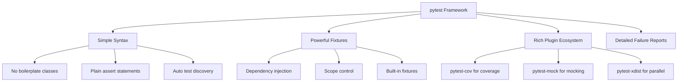

# How to Get Started with pytest

Author: [nawazdhandala](https://www.github.com/nawazdhandala)

Tags: Python, pytest, Testing, Unit Tests, TDD

Description: A practical guide to getting started with pytest for Python testing, covering installation, writing tests, fixtures, parametrization, and best practices for building a solid test suite.

---

> pytest makes testing in Python enjoyable. Its simple syntax, powerful fixtures, and extensive plugin ecosystem let you write better tests with less boilerplate.

If you have been putting off writing tests or find unittest too verbose, pytest is the answer. It discovers tests automatically, provides clear failure messages, and scales from simple unit tests to complex integration testing.

---

## Why pytest?



---

## Installation

Install pytest using pip. You can add it to your requirements file or install it directly.

```bash
# Install pytest
pip install pytest

# Install with common plugins
pip install pytest pytest-cov pytest-mock

# Or add to requirements.txt
echo "pytest>=8.0.0" >> requirements-dev.txt
echo "pytest-cov>=4.1.0" >> requirements-dev.txt
pip install -r requirements-dev.txt
```

Verify the installation by checking the version.

```bash
pytest --version
```

---

## Project Structure

A typical Python project with pytest follows this structure. pytest automatically discovers tests in files that start with `test_` or end with `_test.py`.

```
my_project/
├── src/
│   └── my_project/
│       ├── __init__.py
│       ├── calculator.py
│       └── user_service.py
├── tests/
│   ├── __init__.py
│   ├── conftest.py          # Shared fixtures
│   ├── test_calculator.py
│   └── test_user_service.py
├── pyproject.toml
└── requirements-dev.txt
```

---

## Writing Your First Test

Let's start with a simple calculator module and write tests for it. pytest uses plain `assert` statements, no special assertion methods needed.

Here is the calculator module we want to test.

```python
# src/my_project/calculator.py

def add(a: float, b: float) -> float:
    """Add two numbers."""
    return a + b

def subtract(a: float, b: float) -> float:
    """Subtract b from a."""
    return a - b

def multiply(a: float, b: float) -> float:
    """Multiply two numbers."""
    return a * b

def divide(a: float, b: float) -> float:
    """Divide a by b. Raises ValueError if b is zero."""
    if b == 0:
        raise ValueError("Cannot divide by zero")
    return a / b
```

Now write tests using simple assert statements. Each test function starts with `test_`.

```python
# tests/test_calculator.py
from my_project.calculator import add, subtract, multiply, divide
import pytest

# Test addition with positive numbers
def test_add_positive_numbers():
    result = add(2, 3)
    assert result == 5

# Test addition with negative numbers
def test_add_negative_numbers():
    result = add(-1, -1)
    assert result == -2

# Test subtraction
def test_subtract():
    result = subtract(10, 4)
    assert result == 6

# Test multiplication
def test_multiply():
    result = multiply(3, 4)
    assert result == 12

# Test multiplication by zero
def test_multiply_by_zero():
    result = multiply(100, 0)
    assert result == 0

# Test division
def test_divide():
    result = divide(10, 2)
    assert result == 5.0

# Test division by zero raises an exception
def test_divide_by_zero():
    with pytest.raises(ValueError) as exc_info:
        divide(10, 0)

    assert str(exc_info.value) == "Cannot divide by zero"
```

---

## Running Tests

pytest provides several ways to run your tests. Here are the most common commands.

```bash
# Run all tests in the current directory
pytest

# Run with verbose output showing each test name
pytest -v

# Run a specific test file
pytest tests/test_calculator.py

# Run a specific test function
pytest tests/test_calculator.py::test_add_positive_numbers

# Run tests matching a keyword expression
pytest -k "add or subtract"

# Run and stop on first failure
pytest -x

# Run last failed tests first
pytest --lf

# Run with print statements visible
pytest -s

# Run with coverage report
pytest --cov=src/my_project
```

---

## Understanding Test Output

When a test fails, pytest shows detailed information about what went wrong. Here is an example of a failed assertion.

```
================================ FAILURES ================================
_________________________ test_add_positive_numbers _________________________

    def test_add_positive_numbers():
        result = add(2, 3)
>       assert result == 6
E       assert 5 == 6

tests/test_calculator.py:8: AssertionError
========================= short test summary info ==========================
FAILED tests/test_calculator.py::test_add_positive_numbers - assert 5 == 6
========================= 1 failed, 6 passed in 0.03s ======================
```

The output shows exactly which assertion failed and the actual vs expected values.

---

## Fixtures

Fixtures are pytest's way of providing test dependencies. They handle setup and teardown, and can be shared across tests.

### Basic Fixtures

Create fixtures for common test data or resources. Fixtures are functions decorated with `@pytest.fixture`.

```python
# tests/conftest.py
import pytest

# Fixture that provides test user data
@pytest.fixture
def sample_user():
    return {
        "id": 1,
        "email": "john@example.com",
        "name": "John Doe",
        "active": True
    }

# Fixture that provides a list of users
@pytest.fixture
def user_list():
    return [
        {"id": 1, "name": "Alice", "email": "alice@example.com"},
        {"id": 2, "name": "Bob", "email": "bob@example.com"},
        {"id": 3, "name": "Charlie", "email": "charlie@example.com"},
    ]
```

Use fixtures by adding them as test function parameters. pytest injects them automatically.

```python
# tests/test_user_service.py
from my_project.user_service import UserService

# Fixture is injected as a parameter
def test_create_user(sample_user):
    service = UserService()
    user = service.create(sample_user)

    assert user["email"] == "john@example.com"
    assert user["name"] == "John Doe"

# Using the user_list fixture
def test_find_user_by_email(user_list):
    service = UserService()

    # Load test data
    for user in user_list:
        service.create(user)

    found = service.find_by_email("bob@example.com")
    assert found["name"] == "Bob"
```

### Fixture Scopes

Control how often a fixture is created with the `scope` parameter.

```python
# tests/conftest.py
import pytest

# Created once per test function (default)
@pytest.fixture(scope="function")
def fresh_database():
    db = Database()
    db.connect()
    yield db
    db.rollback()
    db.disconnect()

# Created once per test module (file)
@pytest.fixture(scope="module")
def database_connection():
    db = Database()
    db.connect()
    yield db
    db.disconnect()

# Created once per test session (all tests)
@pytest.fixture(scope="session")
def expensive_resource():
    print("Setting up expensive resource...")
    resource = ExpensiveResource.create()
    yield resource
    resource.cleanup()
    print("Cleaned up expensive resource")
```

### Fixtures with Teardown

Use `yield` instead of `return` to run cleanup code after the test completes.

```python
# tests/conftest.py
import pytest
import tempfile
import os

# Fixture that creates a temporary file and cleans it up
@pytest.fixture
def temp_config_file():
    # Setup: create temporary file
    fd, path = tempfile.mkstemp(suffix=".json")
    os.write(fd, b'{"debug": true}')
    os.close(fd)

    yield path  # Provide the path to the test

    # Teardown: remove the file
    if os.path.exists(path):
        os.remove(path)

def test_load_config(temp_config_file):
    # temp_config_file is the path to a real temporary file
    config = load_config(temp_config_file)
    assert config["debug"] is True
    # File is automatically cleaned up after this test
```

---

## Parametrized Tests

Test the same logic with different inputs using `@pytest.mark.parametrize`. This avoids duplicating test code.

```python
# tests/test_calculator.py
import pytest
from my_project.calculator import add, divide

# Run the same test with multiple input combinations
@pytest.mark.parametrize("a, b, expected", [
    (1, 2, 3),
    (0, 0, 0),
    (-1, 1, 0),
    (100, 200, 300),
    (1.5, 2.5, 4.0),
])
def test_add_parametrized(a, b, expected):
    assert add(a, b) == expected

# Parametrize with descriptive IDs
@pytest.mark.parametrize("dividend, divisor, expected", [
    pytest.param(10, 2, 5.0, id="simple-division"),
    pytest.param(7, 2, 3.5, id="decimal-result"),
    pytest.param(0, 5, 0.0, id="zero-dividend"),
    pytest.param(-10, 2, -5.0, id="negative-dividend"),
], ids=str)
def test_divide_parametrized(dividend, divisor, expected):
    assert divide(dividend, divisor) == expected
```

### Parametrize for Edge Cases

Test multiple error conditions with parametrization.

```python
# tests/test_validation.py
import pytest
from my_project.validation import validate_email

# Test multiple invalid email formats
@pytest.mark.parametrize("invalid_email", [
    "",
    "invalid",
    "@domain.com",
    "user@",
    "user@.com",
    "user@domain",
    "user name@domain.com",
])
def test_invalid_emails_rejected(invalid_email):
    result = validate_email(invalid_email)
    assert result is False

# Test valid email formats
@pytest.mark.parametrize("valid_email", [
    "user@domain.com",
    "user.name@domain.com",
    "user+tag@domain.co.uk",
    "user123@domain.org",
])
def test_valid_emails_accepted(valid_email):
    result = validate_email(valid_email)
    assert result is True
```

---

## Testing Exceptions

pytest provides clean ways to test that your code raises exceptions correctly.

```python
# tests/test_exceptions.py
import pytest
from my_project.user_service import UserService, UserNotFoundError, ValidationError

# Test that an exception is raised
def test_find_nonexistent_user_raises():
    service = UserService()

    with pytest.raises(UserNotFoundError):
        service.find_by_id(9999)

# Test exception message content
def test_exception_message():
    service = UserService()

    with pytest.raises(UserNotFoundError) as exc_info:
        service.find_by_id(9999)

    assert "9999" in str(exc_info.value)
    assert exc_info.value.user_id == 9999

# Test exception with match pattern
def test_validation_error_message():
    service = UserService()

    with pytest.raises(ValidationError, match=r".*email.*required.*"):
        service.create({"name": "No Email"})

# Use parametrize for multiple exception cases
@pytest.mark.parametrize("invalid_data, expected_field", [
    ({}, "name"),
    ({"name": ""}, "name"),
    ({"name": "Valid"}, "email"),
    ({"name": "Valid", "email": "invalid"}, "email"),
])
def test_validation_errors(invalid_data, expected_field):
    service = UserService()

    with pytest.raises(ValidationError) as exc_info:
        service.create(invalid_data)

    assert expected_field in str(exc_info.value)
```

---

## Markers

Markers let you categorize tests and run subsets of your test suite.

### Built-in Markers

```python
# tests/test_features.py
import pytest

# Skip a test unconditionally
@pytest.mark.skip(reason="Feature not implemented yet")
def test_future_feature():
    pass

# Skip based on a condition
@pytest.mark.skipif(
    sys.platform == "win32",
    reason="Not supported on Windows"
)
def test_unix_only_feature():
    pass

# Mark a test as expected to fail
@pytest.mark.xfail(reason="Known bug, see issue #123")
def test_known_bug():
    assert broken_function() == "expected"
```

### Custom Markers

Define your own markers for categorizing tests.

```python
# pytest.ini or pyproject.toml
# [tool.pytest.ini_options]
# markers = [
#     "slow: marks tests as slow",
#     "integration: marks tests as integration tests",
#     "database: marks tests that require database",
# ]

# tests/test_integration.py
import pytest

# Mark slow tests
@pytest.mark.slow
def test_large_data_processing():
    # This test takes a while
    process_large_dataset()

# Mark integration tests
@pytest.mark.integration
def test_external_api_call():
    response = call_external_api()
    assert response.status_code == 200

# Mark tests that need a database
@pytest.mark.database
def test_user_persistence():
    # Requires database connection
    pass

# Combine multiple markers
@pytest.mark.slow
@pytest.mark.database
def test_database_migration():
    pass
```

Run tests by marker.

```bash
# Run only slow tests
pytest -m slow

# Run everything except slow tests
pytest -m "not slow"

# Run integration tests
pytest -m integration

# Combine markers with logical operators
pytest -m "database and not slow"
```

---

## Mocking with pytest-mock

The pytest-mock plugin provides a fixture for easy mocking.

```python
# tests/test_with_mocking.py
from my_project.notification_service import NotificationService
from my_project.user_service import UserService

# mocker fixture is provided by pytest-mock
def test_send_notification(mocker):
    # Mock the email sender
    mock_send = mocker.patch("my_project.notification_service.send_email")
    mock_send.return_value = True

    service = NotificationService()
    result = service.notify_user("user@example.com", "Hello!")

    # Verify the mock was called correctly
    mock_send.assert_called_once_with(
        to="user@example.com",
        subject="Notification",
        body="Hello!"
    )
    assert result is True

def test_user_registration_sends_welcome_email(mocker):
    # Mock external dependencies
    mock_db = mocker.patch("my_project.user_service.database")
    mock_email = mocker.patch("my_project.user_service.send_welcome_email")

    # Configure mock return values
    mock_db.save.return_value = {"id": 1, "email": "new@example.com"}

    service = UserService()
    user = service.register("new@example.com", "password123")

    # Verify database was called
    mock_db.save.assert_called_once()

    # Verify welcome email was sent
    mock_email.assert_called_once_with("new@example.com")

def test_handle_api_error(mocker):
    # Mock to raise an exception
    mock_api = mocker.patch("my_project.client.external_api")
    mock_api.get_data.side_effect = ConnectionError("API unavailable")

    service = DataService()
    result = service.fetch_with_fallback()

    # Should return cached data when API fails
    assert result == service.get_cached_data()
```

---

## Configuration

Configure pytest using `pyproject.toml` or `pytest.ini`.

```toml
# pyproject.toml
[tool.pytest.ini_options]
# Minimum pytest version
minversion = "8.0"

# Add options to the command line
addopts = "-v --tb=short --strict-markers"

# Directories to search for tests
testpaths = ["tests"]

# Files to consider as test files
python_files = ["test_*.py", "*_test.py"]

# Functions to consider as tests
python_functions = ["test_*"]

# Custom markers
markers = [
    "slow: marks tests as slow running",
    "integration: marks integration tests",
    "database: marks tests requiring database",
]

# Ignore specific warnings
filterwarnings = [
    "ignore::DeprecationWarning",
]
```

---

## Useful Plugins

| Plugin | Purpose |
|--------|---------|
| pytest-cov | Code coverage reporting |
| pytest-mock | Mocker fixture for mocking |
| pytest-xdist | Run tests in parallel |
| pytest-asyncio | Support for async tests |
| pytest-env | Set environment variables |
| pytest-timeout | Timeout for tests |
| pytest-randomly | Randomize test order |

Install commonly used plugins.

```bash
pip install pytest-cov pytest-mock pytest-xdist pytest-asyncio
```

### Running Tests in Parallel

Use pytest-xdist to speed up your test suite.

```bash
# Run tests using all available CPU cores
pytest -n auto

# Run tests using 4 workers
pytest -n 4

# Run with coverage and parallel execution
pytest -n auto --cov=src/my_project --cov-report=html
```

---

## Code Coverage

Generate coverage reports to see which code paths are tested.

```bash
# Run tests with coverage
pytest --cov=src/my_project

# Generate HTML coverage report
pytest --cov=src/my_project --cov-report=html

# Show missing lines in terminal
pytest --cov=src/my_project --cov-report=term-missing

# Fail if coverage is below threshold
pytest --cov=src/my_project --cov-fail-under=80
```

---

## Best Practices

| Practice | Why It Matters |
|----------|----------------|
| Use descriptive test names | `test_user_creation_with_invalid_email_raises_validation_error` tells you what broke |
| Keep tests independent | Tests should not depend on other tests or execution order |
| Test one thing per test | Makes failures easy to diagnose |
| Use fixtures for setup | Keeps test code focused on assertions |
| Parametrize similar tests | Reduces duplication, tests more cases |
| Mock external dependencies | Tests should be fast and deterministic |
| Run tests frequently | Catch bugs early in development |

---

## Quick Reference

```python
# tests/test_reference.py
import pytest

# Basic test
def test_basic():
    assert 1 + 1 == 2

# Test with fixture
def test_with_fixture(sample_data):
    assert sample_data is not None

# Parametrized test
@pytest.mark.parametrize("input,expected", [(1, 2), (2, 4)])
def test_double(input, expected):
    assert input * 2 == expected

# Test exception
def test_raises():
    with pytest.raises(ValueError):
        raise ValueError("error")

# Skip test
@pytest.mark.skip(reason="Not ready")
def test_skip():
    pass

# Expected failure
@pytest.mark.xfail
def test_xfail():
    assert False

# Custom marker
@pytest.mark.slow
def test_slow():
    pass
```

---

*A solid test suite is essential for reliable software. [OneUptime](https://oneuptime.com) helps you monitor your applications in production and alerts you when tests pass but real-world issues occur, giving you complete visibility into application health.*

**Related Topics:**
- [How to Write Effective Unit Tests with pytest](https://oneuptime.com/blog/post/2026-01-25-unit-tests-pytest-python/view)
- [How to Use pytest Fixtures](https://oneuptime.com/blog/post/2026-02-02-pytest-fixtures/view)
