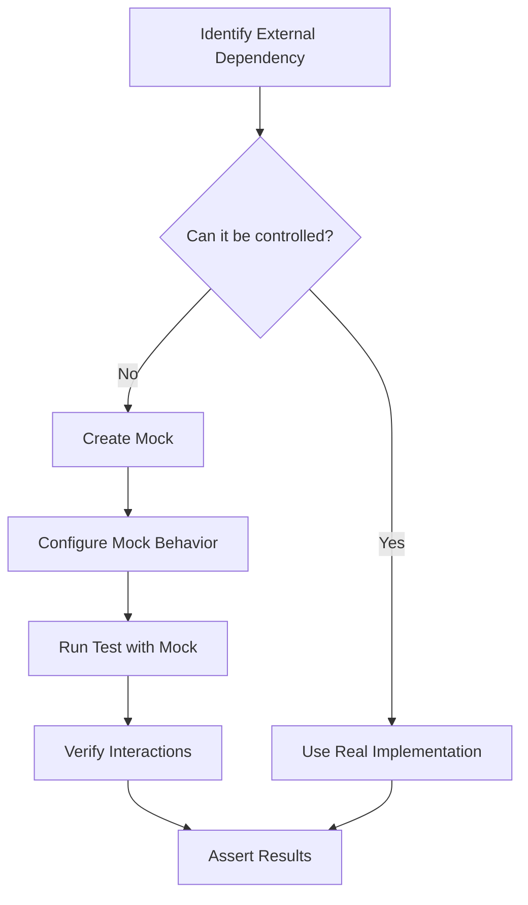
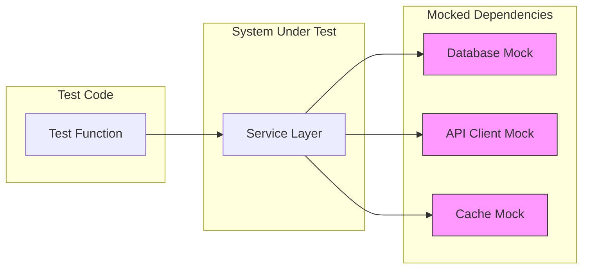

# How to Use pytest with Mocking

Author: [nawazdhandala](https://www.github.com/nawazdhandala)

Tags: pytest, Python, Mocking, Testing, Unit Tests, pytest-mock, unittest.mock, Test Isolation

Description: A comprehensive guide to mocking in pytest using unittest.mock and pytest-mock. Learn how to isolate tests, mock functions, classes, and external dependencies, and write maintainable test suites with practical examples and best practices.

---

> Mocking is the art of replacing real objects with controlled substitutes during testing. When done correctly, mocking enables you to test code in isolation, control external dependencies, and verify interactions between components. This guide covers everything you need to know about mocking in pytest.

Effective mocking leads to faster, more reliable tests that give you confidence in your code.

---

## What is Mocking and Why Use It?

Mocking replaces real objects or functions with fake ones that you control. This technique is essential when your code depends on:

- External APIs and web services
- Databases and file systems
- Time-sensitive operations
- Third-party libraries
- Complex objects that are hard to instantiate

| Real Dependencies | Mocked Dependencies |
|-------------------|---------------------|
| Slow network calls | Instant responses |
| Unpredictable results | Controlled outputs |
| Expensive operations | Free and fast |
| Hard to test errors | Easy error simulation |
| State pollution | Clean isolation |

---

## The Mocking Workflow

Understanding when and how mocking fits into testing helps you write better tests.



---

## Installation

pytest-mock is a thin wrapper around unittest.mock that provides a convenient `mocker` fixture. Install it alongside pytest.

```bash
pip install pytest pytest-mock
```

---

## Basic Mocking Concepts

### The Mock Object

The `Mock` class creates objects that record how they are used and can be configured to return specific values. Here is a simple example showing how Mock objects work.

```python
# Understanding Mock objects and their behavior
from unittest.mock import Mock

# Create a mock object that can pretend to be anything
mock = Mock()

# Mock objects accept any attribute access or method call
mock.some_method()  # Does not raise an error
mock.any_attribute  # Returns another Mock object
mock.nested.deeply.call()  # Still works

# Configure what the mock returns
mock.get_user.return_value = {"name": "Alice", "id": 1}

# Now calling get_user returns our configured value
result = mock.get_user()
print(result)  # {"name": "Alice", "id": 1}

# Mock tracks all calls made to it
mock.get_user.assert_called_once()  # Passes
mock.get_user.assert_called_with()  # Passes (no arguments)
```

### MagicMock vs Mock

MagicMock extends Mock with default implementations of magic methods. Use MagicMock when you need to mock objects that use Python's special methods.

```python
# Comparing Mock and MagicMock for magic method support
from unittest.mock import Mock, MagicMock

# Regular Mock does not support magic methods by default
regular_mock = Mock()
# len(regular_mock)  # Would raise TypeError

# MagicMock supports magic methods out of the box
magic_mock = MagicMock()
magic_mock.__len__.return_value = 5
len(magic_mock)  # Returns 5

# MagicMock also handles iteration
magic_mock.__iter__.return_value = iter([1, 2, 3])
list(magic_mock)  # Returns [1, 2, 3]

# Context manager support
magic_mock.__enter__.return_value = "entered"
with magic_mock as value:
    print(value)  # Prints "entered"
```

---

## Using the pytest-mock Plugin

The `mocker` fixture provided by pytest-mock simplifies mocking in tests. It automatically handles cleanup after each test.

### Patching Functions

Use `mocker.patch()` to replace a function with a mock during a test. The patch is automatically removed when the test ends.

```python
# tests/test_user_service.py
# Patching a module-level function with mocker.patch

def test_send_welcome_email(mocker):
    """Test that welcome email is sent when user is created."""
    # Patch the send_email function in the users module
    # The path must match where the function is USED, not where it is defined
    mock_send = mocker.patch("myapp.users.send_email")
    mock_send.return_value = True  # Configure the return value

    # Create a user - this calls send_email internally
    from myapp.users import create_user
    user = create_user("alice@example.com")

    # Verify the email function was called correctly
    mock_send.assert_called_once_with(
        to="alice@example.com",
        subject="Welcome!",
        body=mocker.ANY  # Match any value for the body
    )
```

### Patching Object Methods

When you need to mock a method on a specific object or class, use `mocker.patch.object()`.

```python
# tests/test_payment_processor.py
# Patching methods on objects using mocker.patch.object

class PaymentGateway:
    def charge(self, amount, card_token):
        # Real implementation calls external payment API
        pass

def test_process_payment(mocker):
    """Test payment processing with mocked gateway."""
    gateway = PaymentGateway()

    # Patch the charge method on this specific instance
    mocker.patch.object(
        gateway,
        "charge",
        return_value={"transaction_id": "txn_123", "status": "success"}
    )

    # Use the gateway - charge method returns our mock value
    result = gateway.charge(100, "card_token_abc")

    assert result["status"] == "success"
    assert result["transaction_id"] == "txn_123"

    # Verify the method was called with correct arguments
    gateway.charge.assert_called_once_with(100, "card_token_abc")
```

### Patching Class Constructors

Mock entire classes when you need to control object instantiation.

```python
# tests/test_notification_service.py
# Mocking class instantiation to control object creation

class SMTPClient:
    def __init__(self, host, port):
        self.host = host
        self.port = port

    def send(self, to, subject, body):
        # Real implementation sends email via SMTP
        pass

def test_notification_sends_email(mocker):
    """Test that notifications use SMTP client correctly."""
    # Create a mock instance that will be returned when SMTPClient is called
    mock_instance = mocker.MagicMock()
    mock_instance.send.return_value = True

    # Patch the class to return our mock instance
    mock_class = mocker.patch("myapp.notifications.SMTPClient")
    mock_class.return_value = mock_instance

    # Import and call the function that uses SMTPClient
    from myapp.notifications import send_notification
    result = send_notification("user@example.com", "Test message")

    # Verify SMTPClient was instantiated with correct config
    mock_class.assert_called_once_with("smtp.example.com", 587)

    # Verify send was called on the instance
    mock_instance.send.assert_called_once()
```

---

## Common Mocking Patterns

### Mocking Return Values

Configure mocks to return specific values for different scenarios.

```python
# tests/test_data_fetcher.py
# Different ways to configure mock return values

def test_fetch_user_data(mocker):
    """Test fetching user data from database."""
    mock_db = mocker.patch("myapp.database.get_connection")

    # Simple return value
    mock_db.return_value.query.return_value = [
        {"id": 1, "name": "Alice"},
        {"id": 2, "name": "Bob"}
    ]

    from myapp.database import fetch_users
    users = fetch_users()

    assert len(users) == 2
    assert users[0]["name"] == "Alice"

def test_multiple_return_values(mocker):
    """Test function that makes multiple calls."""
    mock_api = mocker.patch("myapp.api.fetch_page")

    # Return different values on successive calls using side_effect with a list
    mock_api.side_effect = [
        {"page": 1, "items": [1, 2, 3]},
        {"page": 2, "items": [4, 5, 6]},
        {"page": 3, "items": []},  # Empty page signals end
    ]

    from myapp.api import fetch_all_items
    items = fetch_all_items()

    # Function should have called fetch_page 3 times
    assert mock_api.call_count == 3
    assert items == [1, 2, 3, 4, 5, 6]
```

### Mocking Exceptions

Test error handling by making mocks raise exceptions.

```python
# tests/test_error_handling.py
# Using side_effect to raise exceptions for error testing

import pytest
from myapp.exceptions import DatabaseError, RetryableError

def test_handles_database_error(mocker):
    """Test graceful handling of database errors."""
    mock_db = mocker.patch("myapp.repository.db_connection")

    # Make the mock raise an exception when called
    mock_db.execute.side_effect = DatabaseError("Connection lost")

    from myapp.repository import get_user

    # Verify the exception is raised
    with pytest.raises(DatabaseError) as exc_info:
        get_user(1)

    assert "Connection lost" in str(exc_info.value)

def test_retries_on_transient_error(mocker):
    """Test retry logic for transient errors."""
    mock_api = mocker.patch("myapp.client.external_api")

    # Fail twice, then succeed on third attempt
    mock_api.side_effect = [
        RetryableError("Timeout"),
        RetryableError("Timeout"),
        {"status": "success"}
    ]

    from myapp.client import fetch_with_retry
    result = fetch_with_retry()

    assert result["status"] == "success"
    assert mock_api.call_count == 3  # Retried twice before success
```

### Mocking with Side Effects

Use `side_effect` with a function for dynamic behavior based on input.

```python
# tests/test_dynamic_mocking.py
# Using side_effect functions for conditional mock behavior

def test_user_lookup_by_id(mocker):
    """Test that different user IDs return different users."""

    # Define a function that returns different values based on input
    def mock_get_user(user_id):
        users = {
            1: {"id": 1, "name": "Alice", "role": "admin"},
            2: {"id": 2, "name": "Bob", "role": "user"},
            3: {"id": 3, "name": "Charlie", "role": "user"},
        }
        if user_id not in users:
            raise ValueError(f"User {user_id} not found")
        return users[user_id]

    mock_db = mocker.patch("myapp.users.database.get_user")
    mock_db.side_effect = mock_get_user

    from myapp.users import get_user_name

    assert get_user_name(1) == "Alice"
    assert get_user_name(2) == "Bob"

    with pytest.raises(ValueError):
        get_user_name(999)  # User not found
```

---

## Verifying Mock Interactions

Mocks track all calls made to them. Use assertion methods to verify your code interacts with dependencies correctly.

### Basic Call Assertions

```python
# tests/test_call_verification.py
# Verifying how mocks were called during tests

def test_email_service_integration(mocker):
    """Test that email service is called correctly."""
    mock_email = mocker.patch("myapp.email_service.send")

    from myapp.notifications import notify_user
    notify_user("user@example.com", "Your order shipped!")

    # Verify the mock was called exactly once
    mock_email.assert_called_once()

    # Verify it was called with specific arguments
    mock_email.assert_called_with(
        recipient="user@example.com",
        message="Your order shipped!"
    )

def test_multiple_calls(mocker):
    """Test function that makes multiple API calls."""
    mock_api = mocker.patch("myapp.api.post")

    from myapp.sync import sync_all_records
    records = [{"id": 1}, {"id": 2}, {"id": 3}]
    sync_all_records(records)

    # Verify call count
    assert mock_api.call_count == 3

    # Verify each call's arguments using call_args_list
    calls = mock_api.call_args_list
    assert calls[0].kwargs["data"] == {"id": 1}
    assert calls[1].kwargs["data"] == {"id": 2}
    assert calls[2].kwargs["data"] == {"id": 3}
```

### Advanced Call Verification

```python
# tests/test_advanced_verification.py
# Advanced patterns for verifying mock interactions

from unittest.mock import call, ANY

def test_ordered_calls(mocker):
    """Verify calls happen in a specific order."""
    mock_logger = mocker.patch("myapp.service.logger")

    from myapp.service import process_order
    process_order(order_id=123)

    # Verify calls happened in this exact order
    mock_logger.assert_has_calls([
        call.info("Starting order processing", order_id=123),
        call.debug("Validating order"),
        call.info("Order processed successfully", order_id=123)
    ])

def test_any_argument_matching(mocker):
    """Use ANY to match arguments you do not care about."""
    mock_db = mocker.patch("myapp.repository.save")

    from myapp.repository import create_record
    create_record(name="Test")

    # Match specific args while ignoring others
    mock_db.assert_called_once_with(
        table="records",
        data={"name": "Test", "created_at": ANY}  # Ignore timestamp
    )

def test_call_not_made(mocker):
    """Verify a function was NOT called."""
    mock_email = mocker.patch("myapp.notifications.send_email")

    from myapp.notifications import process_user_action
    process_user_action(action="view", user_id=1)

    # Email should not be sent for view actions
    mock_email.assert_not_called()
```

---

## Mocking Context Managers

Many Python resources use context managers. Here is how to mock them properly.

```python
# tests/test_context_managers.py
# Mocking context managers for file and resource handling

def test_file_reading(mocker):
    """Test code that reads from files."""
    # Create a mock that works as a context manager
    mock_file = mocker.mock_open(read_data="line1\nline2\nline3")
    mocker.patch("builtins.open", mock_file)

    from myapp.parser import count_lines
    result = count_lines("/path/to/file.txt")

    assert result == 3
    mock_file.assert_called_once_with("/path/to/file.txt", "r")

def test_database_transaction(mocker):
    """Test code that uses database transactions."""
    # Create mock for transaction context manager
    mock_transaction = mocker.MagicMock()
    mock_conn = mocker.MagicMock()
    mock_conn.transaction.return_value.__enter__ = mocker.MagicMock(
        return_value=mock_transaction
    )
    mock_conn.transaction.return_value.__exit__ = mocker.MagicMock(
        return_value=False
    )

    mocker.patch("myapp.database.get_connection", return_value=mock_conn)

    from myapp.database import transfer_funds
    transfer_funds(from_account=1, to_account=2, amount=100)

    # Verify transaction was used
    mock_conn.transaction.assert_called_once()
```

---

## Mocking Properties

Properties require special handling since they are descriptors, not regular methods.

```python
# tests/test_properties.py
# Mocking class properties using PropertyMock

from unittest.mock import PropertyMock

class User:
    def __init__(self, user_id):
        self.user_id = user_id

    @property
    def is_active(self):
        # Real implementation checks database
        pass

    @property
    def permissions(self):
        # Real implementation fetches from auth service
        pass

def test_inactive_user_denied(mocker):
    """Test that inactive users cannot perform actions."""
    # Use PropertyMock to mock the property
    mocker.patch.object(
        User,
        "is_active",
        new_callable=PropertyMock,
        return_value=False
    )

    user = User(user_id=1)

    from myapp.auth import can_access_resource
    result = can_access_resource(user, resource_id=42)

    assert result is False

def test_admin_permissions(mocker):
    """Test admin user has all permissions."""
    mocker.patch.object(
        User,
        "permissions",
        new_callable=PropertyMock,
        return_value=["read", "write", "delete", "admin"]
    )

    user = User(user_id=1)

    from myapp.auth import has_permission
    assert has_permission(user, "admin") is True
    assert has_permission(user, "delete") is True
```

---

## Mocking Time and Dates

Testing time-dependent code requires controlling the clock.

```python
# tests/test_time_mocking.py
# Mocking datetime for time-dependent tests

from datetime import datetime, timedelta
from unittest.mock import patch

def test_token_expiration(mocker):
    """Test that expired tokens are rejected."""
    # Create a fixed 'now' time
    fixed_now = datetime(2024, 1, 15, 12, 0, 0)

    # Mock datetime.now to return our fixed time
    mock_datetime = mocker.patch("myapp.auth.datetime")
    mock_datetime.now.return_value = fixed_now
    mock_datetime.side_effect = lambda *args, **kw: datetime(*args, **kw)

    from myapp.auth import is_token_valid

    # Token created 1 hour ago (still valid with 2 hour expiry)
    recent_token = {"created_at": fixed_now - timedelta(hours=1)}
    assert is_token_valid(recent_token) is True

    # Token created 3 hours ago (expired)
    old_token = {"created_at": fixed_now - timedelta(hours=3)}
    assert is_token_valid(old_token) is False

def test_scheduled_task_runs_at_correct_time(mocker):
    """Test scheduler triggers tasks at the right time."""
    # Use freezegun for more comprehensive time mocking
    # pip install freezegun
    from freezegun import freeze_time

    mock_task = mocker.patch("myapp.scheduler.run_daily_report")

    with freeze_time("2024-01-15 09:00:00"):
        from myapp.scheduler import check_scheduled_tasks
        check_scheduled_tasks()  # Should trigger 9 AM tasks
        mock_task.assert_called_once()

    mock_task.reset_mock()

    with freeze_time("2024-01-15 10:00:00"):
        from myapp.scheduler import check_scheduled_tasks
        check_scheduled_tasks()  # 10 AM - should not trigger
        mock_task.assert_not_called()
```

---

## Fixture-Based Mocking

Use pytest fixtures to share mock configurations across tests.

```python
# tests/conftest.py
# Shared mock fixtures for consistent test setup

import pytest

@pytest.fixture
def mock_database(mocker):
    """Provide a mock database connection for all tests."""
    mock = mocker.MagicMock()

    # Default behaviors
    mock.is_connected.return_value = True
    mock.query.return_value = []
    mock.execute.return_value = None

    mocker.patch("myapp.database.get_connection", return_value=mock)
    return mock

@pytest.fixture
def mock_email_service(mocker):
    """Provide a mock email service."""
    mock = mocker.MagicMock()
    mock.send.return_value = {"message_id": "msg_123", "status": "sent"}

    mocker.patch("myapp.notifications.EmailService", return_value=mock)
    return mock

@pytest.fixture
def mock_cache(mocker):
    """Provide a mock cache with get/set/delete operations."""
    cache_data = {}

    mock = mocker.MagicMock()
    mock.get.side_effect = lambda key: cache_data.get(key)
    mock.set.side_effect = lambda key, value: cache_data.update({key: value})
    mock.delete.side_effect = lambda key: cache_data.pop(key, None)

    mocker.patch("myapp.cache.get_cache", return_value=mock)
    return mock
```

Now use these fixtures in your tests.

```python
# tests/test_user_service.py
# Using shared mock fixtures from conftest.py

class TestUserService:
    def test_create_user_saves_to_database(self, mock_database):
        """Test user creation inserts into database."""
        from myapp.users import create_user

        create_user("alice@example.com", "Alice")

        mock_database.execute.assert_called_once()
        call_args = mock_database.execute.call_args
        assert "INSERT" in call_args[0][0]  # SQL contains INSERT

    def test_create_user_sends_welcome_email(self, mock_database, mock_email_service):
        """Test user creation sends welcome email."""
        from myapp.users import create_user

        create_user("alice@example.com", "Alice")

        mock_email_service.send.assert_called_once()
        call_kwargs = mock_email_service.send.call_args.kwargs
        assert call_kwargs["to"] == "alice@example.com"

    def test_get_user_checks_cache_first(self, mock_cache, mock_database):
        """Test cache is checked before database."""
        # Put user in cache
        mock_cache.set("user:1", {"id": 1, "name": "Alice"})

        from myapp.users import get_user
        user = get_user(1)

        # Should return cached value
        assert user["name"] == "Alice"

        # Database should not be called
        mock_database.query.assert_not_called()
```

---

## Mocking Architecture Patterns

The way you structure mocks reflects your application architecture. Here is a visual guide.



---

## Spy Objects

Spies let you observe real object behavior while still tracking calls. Use them when you want to test with real implementations but verify interactions.

```python
# tests/test_spy_objects.py
# Using spies to track calls to real implementations

def test_logging_calls_with_spy(mocker):
    """Spy on logger to verify messages without mocking behavior."""
    import logging
    logger = logging.getLogger("myapp")

    # Create a spy on the real logger
    spy = mocker.spy(logger, "info")

    from myapp.service import process_order
    process_order(order_id=123)

    # Verify logging happened (real logger still works)
    spy.assert_called()
    assert any("order" in str(call).lower() for call in spy.call_args_list)

def test_method_delegation(mocker):
    """Spy on method to verify it delegates correctly."""
    from myapp.repository import UserRepository

    repo = UserRepository()
    spy = mocker.spy(repo, "validate_email")

    # Call method that should delegate to validate_email
    repo.create_user("test@example.com", "Test User")

    # Verify validation was called
    spy.assert_called_once_with("test@example.com")
```

---

## Testing Async Code with Mocks

Mocking async functions requires special handling to return awaitable objects.

```python
# tests/test_async_mocking.py
# Mocking async functions and coroutines

import pytest
from unittest.mock import AsyncMock

@pytest.mark.asyncio
async def test_async_api_call(mocker):
    """Test async code with AsyncMock."""
    # AsyncMock automatically returns awaitable results
    mock_fetch = mocker.patch(
        "myapp.async_client.fetch_data",
        new_callable=AsyncMock
    )
    mock_fetch.return_value = {"status": "ok", "data": [1, 2, 3]}

    from myapp.async_client import get_processed_data
    result = await get_processed_data()

    assert result == [1, 2, 3]
    mock_fetch.assert_awaited_once()

@pytest.mark.asyncio
async def test_async_iteration(mocker):
    """Mock async generators and iterators."""
    async def mock_stream():
        for item in ["chunk1", "chunk2", "chunk3"]:
            yield item

    mocker.patch(
        "myapp.streaming.read_stream",
        return_value=mock_stream()
    )

    from myapp.streaming import collect_stream
    result = await collect_stream()

    assert result == ["chunk1", "chunk2", "chunk3"]

@pytest.mark.asyncio
async def test_async_context_manager(mocker):
    """Mock async context managers."""
    mock_session = mocker.MagicMock()
    mock_session.__aenter__ = AsyncMock(return_value=mock_session)
    mock_session.__aexit__ = AsyncMock(return_value=None)
    mock_session.get = AsyncMock(return_value={"id": 1})

    mocker.patch("myapp.http.create_session", return_value=mock_session)

    from myapp.http import fetch_user
    user = await fetch_user(1)

    assert user["id"] == 1
    mock_session.__aenter__.assert_awaited_once()
```

---

## Best Practices for Mocking

### 1. Mock at the Right Level

Mock at the boundary of your system, not deep inside your code.

```python
# Good: Mock at the system boundary (external HTTP call)
def test_good_mock_boundary(mocker):
    mocker.patch("myapp.weather.requests.get")  # External boundary
    # Test your internal logic

# Avoid: Mocking internal implementation details
def test_bad_internal_mock(mocker):
    mocker.patch("myapp.weather._parse_response")  # Internal detail
    # This test breaks when you refactor internals
```

### 2. Use Clear Mock Names

Name your mocks to indicate what they replace.

```python
# Good: Descriptive names
def test_with_clear_names(mocker):
    mock_payment_gateway = mocker.patch("myapp.payments.StripeClient")
    mock_email_sender = mocker.patch("myapp.notifications.SendGridClient")
    mock_user_repository = mocker.patch("myapp.users.UserRepository")

# Avoid: Generic names
def test_with_unclear_names(mocker):
    mock1 = mocker.patch("myapp.payments.StripeClient")
    mock2 = mocker.patch("myapp.notifications.SendGridClient")
    m = mocker.patch("myapp.users.UserRepository")
```

### 3. Prefer Fixtures for Reusable Mocks

```python
# Good: Reusable fixture
@pytest.fixture
def mock_auth_service(mocker):
    mock = mocker.patch("myapp.auth.AuthService")
    mock.return_value.verify_token.return_value = {"user_id": 1}
    return mock

def test_protected_endpoint(mock_auth_service):
    # Uses standardized auth mock
    pass

# Avoid: Duplicating mock setup in every test
def test_endpoint_1(mocker):
    mock = mocker.patch("myapp.auth.AuthService")
    mock.return_value.verify_token.return_value = {"user_id": 1}
    # ... test code

def test_endpoint_2(mocker):
    mock = mocker.patch("myapp.auth.AuthService")  # Duplicated
    mock.return_value.verify_token.return_value = {"user_id": 1}
    # ... test code
```

### 4. Verify Interactions, Not Just Results

```python
# Good: Verify the interaction, not just the outcome
def test_order_processing(mocker):
    mock_inventory = mocker.patch("myapp.inventory.reserve_items")
    mock_payment = mocker.patch("myapp.payments.charge")
    mock_shipping = mocker.patch("myapp.shipping.create_shipment")

    from myapp.orders import process_order
    process_order(order_id=123)

    # Verify correct sequence and parameters
    mock_inventory.assert_called_once_with(order_id=123)
    mock_payment.assert_called_once()
    mock_shipping.assert_called_once()
```

### 5. Do Not Over-Mock

Test real code when possible. Only mock what you cannot control.

```python
# Good: Mock only external dependencies
def test_calculate_total(mocker):
    mocker.patch("myapp.tax.TaxService.get_rate", return_value=0.08)

    from myapp.cart import calculate_total
    # Tests real calculation logic, only mocking external tax service
    result = calculate_total([{"price": 100}, {"price": 50}])
    assert result == 162.0  # (100 + 50) * 1.08

# Avoid: Mocking everything
def test_overmocked(mocker):
    mocker.patch("myapp.cart.sum_prices", return_value=150)
    mocker.patch("myapp.cart.apply_tax", return_value=162)
    # This test verifies nothing about your actual code
```

---

## Debugging Mock Issues

When mocks do not behave as expected, use these techniques.

```python
# tests/test_debugging.py
# Techniques for debugging mock problems

def test_inspect_mock_calls(mocker):
    """Print mock call history for debugging."""
    mock_api = mocker.patch("myapp.api.send_request")

    from myapp.api import sync_data
    sync_data()

    # Print all calls made to the mock
    print(f"Call count: {mock_api.call_count}")
    print(f"Calls: {mock_api.call_args_list}")
    print(f"Last call: {mock_api.call_args}")

    # Useful for figuring out what arguments were passed
    for i, call in enumerate(mock_api.call_args_list):
        print(f"Call {i}: args={call.args}, kwargs={call.kwargs}")

def test_verify_patch_target(mocker):
    """Ensure you are patching the correct location."""
    # Wrong: Patching where function is defined
    # mocker.patch("myapp.utils.helper_function")

    # Right: Patch where function is USED
    # If service.py does: from myapp.utils import helper_function
    # Then patch: mocker.patch("myapp.service.helper_function")

    mock = mocker.patch("myapp.service.helper_function")

    from myapp.service import do_something
    do_something()

    # If this fails, the patch target is wrong
    mock.assert_called_once()
```

---

## Common Pitfalls and Solutions

| Pitfall | Solution |
|---------|----------|
| Mock not being called | Verify patch path matches import location |
| Mock returns Mock instead of value | Set return_value explicitly |
| Async mock not awaitable | Use AsyncMock instead of Mock |
| Mock persists between tests | Use mocker fixture (auto-cleanup) |
| Cannot mock built-in | Patch on the module that imports it |
| Property mock not working | Use PropertyMock |

---

## Complete Example: Testing a Service Layer

Here is a complete example putting all concepts together.

```python
# myapp/order_service.py
# Production code for order processing

class OrderService:
    def __init__(self, db, payment_gateway, notification_service):
        self.db = db
        self.payment = payment_gateway
        self.notifications = notification_service

    def place_order(self, user_id, items, payment_method):
        # Calculate total
        total = sum(item["price"] * item["quantity"] for item in items)

        # Create order record
        order = self.db.create_order(user_id=user_id, total=total, items=items)

        # Process payment
        payment_result = self.payment.charge(
            amount=total,
            method=payment_method,
            order_id=order["id"]
        )

        if payment_result["status"] != "success":
            self.db.update_order(order["id"], status="payment_failed")
            raise PaymentError(payment_result["error"])

        # Update order status
        self.db.update_order(order["id"], status="paid")

        # Send confirmation
        self.notifications.send_order_confirmation(
            user_id=user_id,
            order_id=order["id"]
        )

        return order
```

```python
# tests/test_order_service.py
# Comprehensive tests with mocking

import pytest
from myapp.order_service import OrderService
from myapp.exceptions import PaymentError

@pytest.fixture
def mock_db(mocker):
    """Mock database layer."""
    db = mocker.MagicMock()
    db.create_order.return_value = {"id": "order_123", "status": "pending"}
    db.update_order.return_value = True
    return db

@pytest.fixture
def mock_payment(mocker):
    """Mock payment gateway."""
    payment = mocker.MagicMock()
    payment.charge.return_value = {"status": "success", "transaction_id": "txn_456"}
    return payment

@pytest.fixture
def mock_notifications(mocker):
    """Mock notification service."""
    notifications = mocker.MagicMock()
    notifications.send_order_confirmation.return_value = True
    return notifications

@pytest.fixture
def order_service(mock_db, mock_payment, mock_notifications):
    """Create service with all mocked dependencies."""
    return OrderService(mock_db, mock_payment, mock_notifications)


class TestOrderService:
    def test_successful_order(self, order_service, mock_db, mock_payment, mock_notifications):
        """Test complete successful order flow."""
        items = [
            {"name": "Widget", "price": 10.00, "quantity": 2},
            {"name": "Gadget", "price": 25.00, "quantity": 1}
        ]

        result = order_service.place_order(
            user_id=1,
            items=items,
            payment_method="card_xxx"
        )

        # Verify order was created
        mock_db.create_order.assert_called_once_with(
            user_id=1,
            total=45.00,
            items=items
        )

        # Verify payment was charged
        mock_payment.charge.assert_called_once_with(
            amount=45.00,
            method="card_xxx",
            order_id="order_123"
        )

        # Verify order status updated
        mock_db.update_order.assert_called_with("order_123", status="paid")

        # Verify notification sent
        mock_notifications.send_order_confirmation.assert_called_once_with(
            user_id=1,
            order_id="order_123"
        )

        assert result["id"] == "order_123"

    def test_payment_failure_updates_order_status(
        self, order_service, mock_db, mock_payment, mock_notifications
    ):
        """Test order status is updated when payment fails."""
        mock_payment.charge.return_value = {
            "status": "failed",
            "error": "Card declined"
        }

        with pytest.raises(PaymentError) as exc_info:
            order_service.place_order(
                user_id=1,
                items=[{"name": "Widget", "price": 10.00, "quantity": 1}],
                payment_method="card_xxx"
            )

        # Verify order marked as failed
        mock_db.update_order.assert_called_with("order_123", status="payment_failed")

        # Verify no notification sent
        mock_notifications.send_order_confirmation.assert_not_called()

        assert "Card declined" in str(exc_info.value)

    @pytest.mark.parametrize("items,expected_total", [
        ([{"price": 10, "quantity": 1}], 10),
        ([{"price": 10, "quantity": 2}], 20),
        ([{"price": 10, "quantity": 1}, {"price": 5, "quantity": 3}], 25),
    ])
    def test_calculates_correct_total(
        self, order_service, mock_payment, items, expected_total
    ):
        """Test total calculation for various item combinations."""
        order_service.place_order(user_id=1, items=items, payment_method="card")

        # Verify payment was charged correct amount
        call_kwargs = mock_payment.charge.call_args.kwargs
        assert call_kwargs["amount"] == expected_total
```

---

## Summary

| Concept | Usage |
|---------|-------|
| Basic mock | `Mock()` or `MagicMock()` |
| Patch function | `mocker.patch("module.function")` |
| Patch method | `mocker.patch.object(obj, "method")` |
| Return value | `mock.return_value = value` |
| Raise exception | `mock.side_effect = Exception()` |
| Multiple returns | `mock.side_effect = [val1, val2]` |
| Dynamic response | `mock.side_effect = function` |
| Verify called | `mock.assert_called_once()` |
| Verify args | `mock.assert_called_with(args)` |
| Mock property | `PropertyMock` |
| Mock async | `AsyncMock` |
| Spy on real | `mocker.spy(obj, "method")` |

Mocking is a powerful tool for writing isolated, reliable tests. Start simple, mock only what you need, and focus on testing behavior at system boundaries. Well-designed mocks make your tests faster, more deterministic, and easier to maintain.

---

*Need to monitor your Python applications in production? [OneUptime](https://oneuptime.com) provides comprehensive monitoring, alerting, and observability for your services.*
