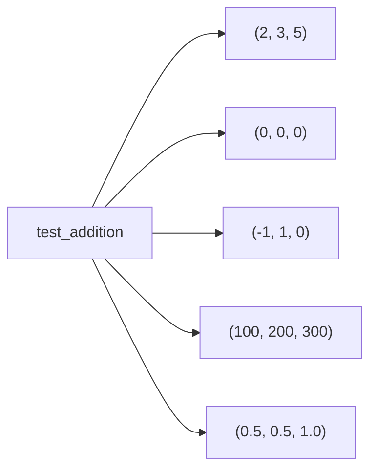
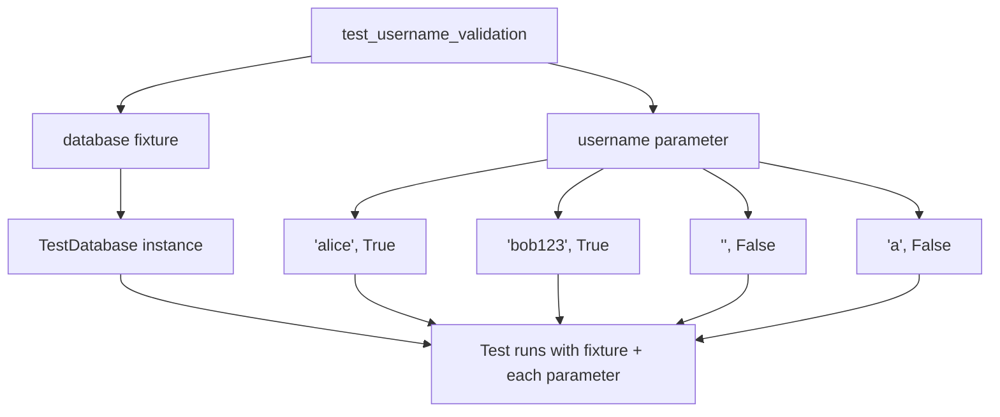
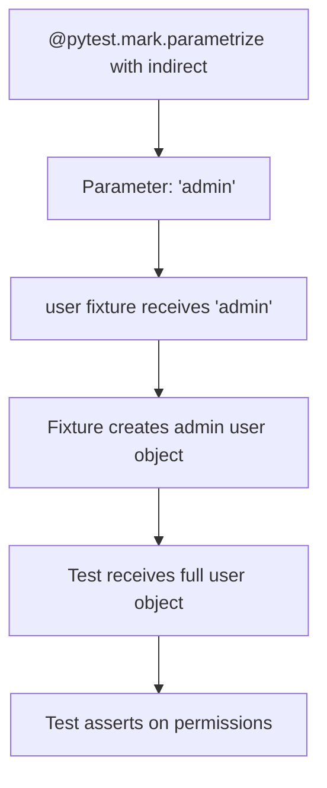

# How to Use pytest Parametrize

Author: [nawazdhandala](https://www.github.com/nawazdhandala)

Tags: pytest, Python, Testing, Parametrize, Unit Testing

Description: A practical guide to mastering pytest parametrize for running tests with multiple inputs. Learn how to use the @pytest.mark.parametrize decorator to reduce code duplication, test edge cases efficiently, and build comprehensive test suites.

---

> Writing the same test logic multiple times with different values wastes time and clutters your test files. pytest parametrize solves this by letting you run a single test function with multiple sets of inputs automatically.

Testing functions often requires checking behavior across various inputs. You might need to verify that a calculator handles positive numbers, negative numbers, zero, and floating-point values correctly. Without parametrization, you would write four nearly identical test functions. With `@pytest.mark.parametrize`, you define the test logic once and let pytest generate all the test cases.

---

## What Is pytest Parametrize?

The `@pytest.mark.parametrize` decorator allows you to run a test function multiple times with different argument values. Each set of values creates a distinct test case that pytest runs and reports separately.

```mermaid
graph TD
    A[Single Test Function] --> B[@pytest.mark.parametrize]
    B --> C[Test Case 1: input=5]
    B --> D[Test Case 2: input=10]
    B --> E[Test Case 3: input=0]
    B --> F[Test Case 4: input=-5]
    C --> G[Individual test results]
    D --> G
    E --> G
    F --> G
```

---

## Basic Parametrize Syntax

The decorator takes two main arguments: a string with parameter names and a list of values. Here is the fundamental pattern.

```python
# tests/test_math.py
import pytest

# The first argument is the parameter name as a string
# The second argument is a list of values to test
@pytest.mark.parametrize("number", [1, 2, 3, 4, 5])
def test_square_is_positive(number):
    """Verify that squaring any number produces a positive result."""
    result = number ** 2
    assert result > 0
```

When you run pytest, it executes five separate tests, one for each number in the list.

```bash
$ pytest tests/test_math.py -v
tests/test_math.py::test_square_is_positive[1] PASSED
tests/test_math.py::test_square_is_positive[2] PASSED
tests/test_math.py::test_square_is_positive[3] PASSED
tests/test_math.py::test_square_is_positive[4] PASSED
tests/test_math.py::test_square_is_positive[5] PASSED
```

---

## Multiple Parameters

Real-world tests often need multiple inputs. Provide comma-separated parameter names and tuples of values.

```python
# tests/test_calculator.py
import pytest

# Multiple parameters are comma-separated in the string
# Each tuple in the list provides values for all parameters
@pytest.mark.parametrize("a, b, expected", [
    (2, 3, 5),
    (0, 0, 0),
    (-1, 1, 0),
    (100, 200, 300),
    (0.5, 0.5, 1.0),
])
def test_addition(a, b, expected):
    """Verify that addition works correctly across different number types."""
    result = a + b
    assert result == expected
```



---

## Named Test Cases with pytest.param

Anonymous test cases like `test_addition[2-3-5]` can be hard to understand. Use `pytest.param` with the `id` argument to give meaningful names.

```python
# tests/test_calculator.py
import pytest

# pytest.param allows adding metadata to each test case
# The id parameter provides a custom name shown in test output
@pytest.mark.parametrize("a, b, expected", [
    pytest.param(2, 3, 5, id="positive_integers"),
    pytest.param(0, 0, 0, id="zeros"),
    pytest.param(-1, 1, 0, id="negative_and_positive"),
    pytest.param(100, 200, 300, id="large_numbers"),
    pytest.param(0.5, 0.5, 1.0, id="floats"),
])
def test_addition_named(a, b, expected):
    """Addition tests with descriptive names."""
    assert a + b == expected
```

Now the test output is much clearer.

```bash
$ pytest tests/test_calculator.py::test_addition_named -v
tests/test_calculator.py::test_addition_named[positive_integers] PASSED
tests/test_calculator.py::test_addition_named[zeros] PASSED
tests/test_calculator.py::test_addition_named[negative_and_positive] PASSED
tests/test_calculator.py::test_addition_named[large_numbers] PASSED
tests/test_calculator.py::test_addition_named[floats] PASSED
```

---

## Testing Expected Exceptions

Combine parametrize with `pytest.raises` to verify that invalid inputs trigger the correct exceptions.

```python
# tests/test_validation.py
import pytest

def divide(a, b):
    """Divide two numbers, raising an error for division by zero."""
    if b == 0:
        raise ValueError("Cannot divide by zero")
    return a / b

# Test various invalid inputs that should raise exceptions
@pytest.mark.parametrize("a, b, exception_type, message", [
    pytest.param(10, 0, ValueError, "Cannot divide by zero", id="divide_by_zero"),
    pytest.param(100, 0, ValueError, "Cannot divide by zero", id="large_dividend"),
    pytest.param(-5, 0, ValueError, "Cannot divide by zero", id="negative_dividend"),
])
def test_division_errors(a, b, exception_type, message):
    """Verify that division by zero raises ValueError with correct message."""
    with pytest.raises(exception_type, match=message):
        divide(a, b)
```

---

## Combining Parametrize with Fixtures

Parametrized tests work seamlessly with pytest fixtures. Fixtures provide shared resources while parameters provide varying inputs.

```python
# tests/conftest.py
import pytest

@pytest.fixture
def database():
    """Provides a test database connection."""
    db = TestDatabase()
    db.connect()
    yield db
    db.disconnect()

# tests/test_users.py
import pytest

# The fixture 'database' is automatically injected
# The parameter 'username' varies across test runs
@pytest.mark.parametrize("username, expected_valid", [
    pytest.param("alice", True, id="normal_username"),
    pytest.param("bob123", True, id="alphanumeric"),
    pytest.param("", False, id="empty_string"),
    pytest.param("a", False, id="too_short"),
    pytest.param("x" * 100, False, id="too_long"),
    pytest.param("user@name", False, id="special_characters"),
])
def test_username_validation(database, username, expected_valid):
    """Verify username validation rules with database context."""
    from myapp.validators import is_valid_username

    result = is_valid_username(username)
    assert result == expected_valid
```



---

## Stacking Multiple Parametrize Decorators

Apply multiple `@pytest.mark.parametrize` decorators to create a cartesian product of all parameter combinations.

```python
# tests/test_api.py
import pytest

# Stacking decorators creates every combination of parameters
# 3 HTTP methods x 4 endpoints = 12 test cases
@pytest.mark.parametrize("http_method", ["GET", "POST", "DELETE"])
@pytest.mark.parametrize("endpoint", ["/users", "/orders", "/products", "/settings"])
def test_endpoint_responds(http_method, endpoint):
    """Verify all endpoints respond to different HTTP methods."""
    from myapp.client import make_request

    response = make_request(method=http_method, url=endpoint)
    # At minimum, endpoints should not return 500 errors
    assert response.status_code < 500
```

pytest generates 12 test combinations.

```bash
$ pytest tests/test_api.py -v --collect-only
tests/test_api.py::test_endpoint_responds[/users-GET]
tests/test_api.py::test_endpoint_responds[/users-POST]
tests/test_api.py::test_endpoint_responds[/users-DELETE]
tests/test_api.py::test_endpoint_responds[/orders-GET]
tests/test_api.py::test_endpoint_responds[/orders-POST]
tests/test_api.py::test_endpoint_responds[/orders-DELETE]
... (6 more)
```

---

## Conditional Skipping with pytest.param

Some test cases might only be valid under certain conditions. Use `marks` in `pytest.param` to skip or xfail specific cases.

```python
# tests/test_platform.py
import pytest
import sys

@pytest.mark.parametrize("path, expected", [
    pytest.param("/home/user/file.txt", True, id="unix_absolute"),
    pytest.param("./relative/path", False, id="relative_path"),
    pytest.param(
        "C:\\Users\\file.txt",
        True,
        id="windows_absolute",
        marks=pytest.mark.skipif(
            sys.platform != "win32",
            reason="Windows-only test"
        )
    ),
    pytest.param(
        "/proc/cpuinfo",
        True,
        id="linux_proc",
        marks=pytest.mark.skipif(
            sys.platform != "linux",
            reason="Linux-only test"
        )
    ),
])
def test_is_absolute_path(path, expected):
    """Verify absolute path detection across platforms."""
    from myapp.paths import is_absolute
    assert is_absolute(path) == expected
```

---

## Testing with Complex Objects

Parameters do not have to be primitive types. Pass objects, dictionaries, or any Python data structure.

```python
# tests/test_serialization.py
import pytest
from datetime import datetime, date
from decimal import Decimal

# Complex objects work just like simple values
@pytest.mark.parametrize("input_data, expected_json", [
    pytest.param(
        {"name": "Alice", "age": 30},
        '{"name": "Alice", "age": 30}',
        id="simple_dict"
    ),
    pytest.param(
        {"items": [1, 2, 3]},
        '{"items": [1, 2, 3]}',
        id="nested_list"
    ),
    pytest.param(
        {"active": True, "count": None},
        '{"active": true, "count": null}',
        id="boolean_and_null"
    ),
])
def test_json_serialization(input_data, expected_json):
    """Verify JSON serialization handles various data types."""
    import json
    result = json.dumps(input_data, sort_keys=True)
    expected = json.loads(expected_json)
    actual = json.loads(result)
    assert actual == expected
```

---

## Parametrize with Classes

Apply parametrize to methods within test classes for organized test suites.

```python
# tests/test_shopping_cart.py
import pytest

class TestShoppingCart:
    """Test suite for shopping cart functionality."""

    @pytest.fixture
    def cart(self):
        """Provides a fresh shopping cart for each test."""
        from myapp.cart import ShoppingCart
        return ShoppingCart()

    # Parametrize works on class methods the same way
    @pytest.mark.parametrize("item_name, quantity, unit_price, expected_total", [
        pytest.param("Widget", 1, 10.00, 10.00, id="single_item"),
        pytest.param("Widget", 5, 10.00, 50.00, id="multiple_quantity"),
        pytest.param("Gadget", 3, 25.50, 76.50, id="decimal_price"),
        pytest.param("Thing", 0, 99.99, 0.00, id="zero_quantity"),
    ])
    def test_cart_total(self, cart, item_name, quantity, unit_price, expected_total):
        """Verify cart calculates totals correctly for various scenarios."""
        cart.add_item(item_name, quantity, unit_price)
        assert cart.total == expected_total

    @pytest.mark.parametrize("discount_percent, expected_savings", [
        pytest.param(10, 10.00, id="ten_percent"),
        pytest.param(25, 25.00, id="quarter_off"),
        pytest.param(0, 0.00, id="no_discount"),
        pytest.param(100, 100.00, id="free"),
    ])
    def test_discount_calculation(self, cart, discount_percent, expected_savings):
        """Verify discount calculations on a $100 cart."""
        cart.add_item("Test Item", 1, 100.00)
        cart.apply_discount(discount_percent)
        assert cart.savings == expected_savings
```

---

## Indirect Parametrization

Sometimes you need to pass parameters through a fixture rather than directly to the test. Use `indirect=True` for fixture-processed parameters.

```python
# tests/conftest.py
import pytest

@pytest.fixture
def user(request):
    """Creates a user based on the role parameter."""
    role = request.param
    return create_user_with_role(role)

def create_user_with_role(role):
    """Factory function to create users with different roles."""
    permissions = {
        "admin": ["read", "write", "delete", "admin"],
        "editor": ["read", "write"],
        "viewer": ["read"],
        "guest": [],
    }
    return {
        "role": role,
        "permissions": permissions.get(role, [])
    }

# tests/test_permissions.py
import pytest

# indirect=True passes the parameter to the fixture, not the test
@pytest.mark.parametrize("user, expected_can_delete", [
    pytest.param("admin", True, id="admin_can_delete"),
    pytest.param("editor", False, id="editor_cannot_delete"),
    pytest.param("viewer", False, id="viewer_cannot_delete"),
    pytest.param("guest", False, id="guest_cannot_delete"),
], indirect=["user"])
def test_delete_permission(user, expected_can_delete):
    """Verify that only admins can delete resources."""
    can_delete = "delete" in user["permissions"]
    assert can_delete == expected_can_delete
```



---

## Dynamic Parametrization

Generate parameter lists dynamically using helper functions when static lists are not sufficient.

```python
# tests/test_dynamic.py
import pytest

def generate_test_cases():
    """Dynamically generate test cases based on configuration."""
    cases = []

    # Generate cases from 1 to 100
    for n in range(1, 101):
        expected = "fizz" if n % 3 == 0 else ""
        expected += "buzz" if n % 5 == 0 else ""
        expected = expected or str(n)
        cases.append(pytest.param(n, expected, id=f"n={n}"))

    return cases

# Pass the function call result to parametrize
@pytest.mark.parametrize("number, expected", generate_test_cases())
def test_fizzbuzz(number, expected):
    """Verify fizzbuzz output for numbers 1-100."""
    from myapp.games import fizzbuzz
    assert fizzbuzz(number) == expected
```

---

## Reading Parameters from Files

Load test cases from external JSON or YAML files for data-driven testing.

```python
# tests/test_data_driven.py
import pytest
import json
from pathlib import Path

def load_test_data(filename):
    """Load test cases from a JSON file."""
    test_data_dir = Path(__file__).parent / "data"
    with open(test_data_dir / filename) as f:
        data = json.load(f)

    return [
        pytest.param(
            case["input"],
            case["expected"],
            id=case.get("name", f"case_{i}")
        )
        for i, case in enumerate(data["test_cases"])
    ]

# tests/data/validation_cases.json contains:
# {
#   "test_cases": [
#     {"name": "valid_email", "input": "user@example.com", "expected": true},
#     {"name": "missing_at", "input": "userexample.com", "expected": false},
#     {"name": "empty", "input": "", "expected": false}
#   ]
# }

@pytest.mark.parametrize("email, is_valid", load_test_data("validation_cases.json"))
def test_email_validation(email, is_valid):
    """Verify email validation against test data file."""
    from myapp.validators import validate_email
    assert validate_email(email) == is_valid
```

---

## Parametrize vs Fixture Parametrization

Understanding when to use test parametrization versus fixture parametrization helps you structure tests effectively.

| Feature | @pytest.mark.parametrize | @pytest.fixture(params=...) |
|---------|-------------------------|----------------------------|
| Scope | Single test function | All tests using the fixture |
| Best for | Test-specific variations | Shared resource variations |
| Reusability | Limited to decorated test | Automatic for all dependents |
| Combination | Can stack decorators | Combines with test params |

Use test parametrization when different test cases need different inputs.

```python
# Test-specific parameters
@pytest.mark.parametrize("input_value", [1, 2, 3])
def test_specific_function(input_value):
    assert process(input_value) > 0
```

Use fixture parametrization when all tests need to run against different configurations.

```python
# All tests should run against each database type
@pytest.fixture(params=["sqlite", "postgresql", "mysql"])
def database(request):
    return create_database(request.param)

def test_insert(database):
    # Runs 3 times, once per database
    database.insert({"id": 1})

def test_query(database):
    # Also runs 3 times
    database.query("SELECT * FROM items")
```

---

## Best Practices

### Group Related Test Cases

Organize parameters logically to make test intentions clear.

```python
# Good: Grouped by category
@pytest.mark.parametrize("input_str, expected_length", [
    # Empty and whitespace cases
    pytest.param("", 0, id="empty_string"),
    pytest.param("   ", 0, id="whitespace_only"),

    # Normal strings
    pytest.param("hello", 5, id="simple_word"),
    pytest.param("hello world", 11, id="with_space"),

    # Edge cases
    pytest.param("a", 1, id="single_char"),
    pytest.param("a" * 1000, 1000, id="long_string"),
])
def test_string_length(input_str, expected_length):
    assert len(input_str.strip()) == expected_length or len(input_str) == expected_length
```

### Use Descriptive IDs

Always provide meaningful test IDs for better debugging and reporting.

```python
# Good: Descriptive IDs
@pytest.mark.parametrize("status_code, is_success", [
    pytest.param(200, True, id="ok"),
    pytest.param(201, True, id="created"),
    pytest.param(400, False, id="bad_request"),
    pytest.param(500, False, id="server_error"),
])
def test_http_status(status_code, is_success):
    assert (status_code < 400) == is_success

# Avoid: Default IDs that look like test_http_status[200-True]
```

### Keep Parameter Lists Manageable

If you have more than 10-15 test cases, consider splitting into multiple tests or using file-based data.

```python
# When lists get too long, extract to external files or helper functions
@pytest.mark.parametrize(
    "email, is_valid",
    load_test_data("email_validation_cases.json")
)
def test_email_validation(email, is_valid):
    # Test data lives in a separate, maintainable file
    assert validate_email(email) == is_valid
```

### Test One Concept Per Parametrized Test

Each parametrized test should focus on a single behavior or requirement.

```python
# Good: Focused tests
@pytest.mark.parametrize("age", [0, 17])
def test_underage_users_cannot_register(age):
    """Users under 18 cannot create accounts."""
    with pytest.raises(ValidationError, match="Must be 18"):
        create_user(age=age)

@pytest.mark.parametrize("age", [18, 25, 65, 100])
def test_adult_users_can_register(age):
    """Users 18 and older can create accounts."""
    user = create_user(age=age)
    assert user is not None
```

---

## Running Specific Parametrized Tests

pytest allows you to run specific parameter combinations using the test ID.

```bash
# Run a specific parametrized test
pytest tests/test_calculator.py::test_addition[positive_integers] -v

# Run multiple specific cases
pytest tests/test_calculator.py::test_addition[zeros] tests/test_calculator.py::test_addition[floats] -v

# Use keyword matching to run related tests
pytest -k "negative" tests/test_calculator.py -v
```

---

## Debugging Failed Parametrized Tests

When a parametrized test fails, pytest shows exactly which parameter combination failed.

```python
# tests/test_debug.py
import pytest

@pytest.mark.parametrize("dividend, divisor, expected", [
    pytest.param(10, 2, 5, id="simple"),
    pytest.param(9, 3, 3, id="exact"),
    pytest.param(7, 2, 3, id="intentional_failure"),  # Wrong expected value
])
def test_integer_division(dividend, divisor, expected):
    assert dividend // divisor == expected
```

```bash
$ pytest tests/test_debug.py -v
tests/test_debug.py::test_integer_division[simple] PASSED
tests/test_debug.py::test_integer_division[exact] PASSED
tests/test_debug.py::test_integer_division[intentional_failure] FAILED

FAILED tests/test_debug.py::test_integer_division[intentional_failure]
    assert 3 == 3
    E       assert 3 == 3
    E        +  where 3 = 7 // 2
```

The test ID `[intentional_failure]` immediately tells you which parameter set caused the issue.

---

## Quick Reference

```python
# Basic parametrize
@pytest.mark.parametrize("x", [1, 2, 3])
def test_basic(x):
    assert x > 0

# Multiple parameters
@pytest.mark.parametrize("a, b, expected", [
    (1, 2, 3),
    (4, 5, 9),
])
def test_multi(a, b, expected):
    assert a + b == expected

# Named test cases
@pytest.mark.parametrize("value", [
    pytest.param(1, id="one"),
    pytest.param(2, id="two"),
])
def test_named(value):
    pass

# Skip specific cases
@pytest.mark.parametrize("x", [
    pytest.param(1, id="normal"),
    pytest.param(2, marks=pytest.mark.skip(reason="not ready")),
])
def test_with_skip(x):
    pass

# Expected failures
@pytest.mark.parametrize("x", [
    pytest.param(1, id="passing"),
    pytest.param(2, marks=pytest.mark.xfail(reason="known bug")),
])
def test_with_xfail(x):
    assert x == 1

# Stacked parametrize (cartesian product)
@pytest.mark.parametrize("a", [1, 2])
@pytest.mark.parametrize("b", [10, 20])
def test_stacked(a, b):
    # Runs 4 times: (1,10), (1,20), (2,10), (2,20)
    pass

# Indirect parametrization
@pytest.mark.parametrize("user", ["admin", "guest"], indirect=True)
def test_indirect(user):
    pass
```

---

*Parametrized testing transforms repetitive test code into concise, maintainable test suites. [OneUptime](https://oneuptime.com) monitors your applications in production, catching the issues your tests might miss and providing complete visibility into system health.*

**Related Topics:**
- [How to Get Started with pytest](https://oneuptime.com/blog/post/2026-02-02-pytest-getting-started/view)
- [How to Use pytest Fixtures](https://oneuptime.com/blog/post/2026-02-02-pytest-fixtures/view)
- [How to Mock with pytest](https://oneuptime.com/blog/post/2026-02-02-pytest-mocking/view)
