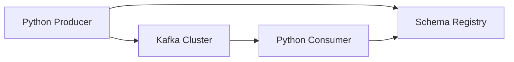

# How to Use Apache Kafka with Python (confluent-kafka)

Author: [nawazdhandala](https://github.com/nawazdhandala)

Tags: Python, Kafka, Event Driven, Messaging, confluent-kafka

Description: A complete guide to using Apache Kafka with Python using the confluent-kafka library, covering producers, consumers, error handling, and production configurations.

---

If you're building event-driven systems in Python, you'll eventually need to work with Apache Kafka. The confluent-kafka library is the go-to choice for Python developers - it's a thin wrapper around librdkafka (the C library), which makes it significantly faster than pure Python alternatives like kafka-python.

This guide walks you through setting up producers and consumers, handling errors properly, and configuring for production workloads.

---

## Why confluent-kafka?

There are several Python Kafka clients available, but confluent-kafka stands out for a few reasons:

| Library | Performance | Maintained | Notes |
|---------|-------------|------------|-------|
| confluent-kafka | High (C-based) | Active | Official Confluent library |
| kafka-python | Moderate | Less active | Pure Python, easier to debug |
| aiokafka | Moderate | Active | Async support built-in |

confluent-kafka wraps librdkafka, which handles connection pooling, batching, compression, and retries at the C level. This means your Python code doesn't block on network I/O as much, and you get better throughput without extra effort.

---

## Installation

Install confluent-kafka with pip. You'll also want avro support if you're using schema registry:

```bash
# Basic installation
pip install confluent-kafka

# With Avro serialization support
pip install confluent-kafka[avro]

# With Schema Registry support
pip install confluent-kafka[schemaregistry]
```

On macOS, you might need to install librdkafka first:

```bash
brew install librdkafka
```

---

## Architecture Overview



---

## Basic Producer

Let's start with a simple producer that sends JSON messages:

```python
# producer.py
from confluent_kafka import Producer
import json
import socket

# Producer configuration
config = {
    # Bootstrap servers - comma-separated list of broker addresses
    'bootstrap.servers': 'localhost:9092',

    # Client identifier for logging and debugging
    'client.id': socket.gethostname(),

    # Acknowledgment level: 'all' waits for all replicas
    'acks': 'all',

    # Retry configuration
    'retries': 3,
    'retry.backoff.ms': 100,
}

producer = Producer(config)


def delivery_callback(err, msg):
    """Called once for each message produced to indicate delivery result."""
    if err is not None:
        print(f'Message delivery failed: {err}')
    else:
        print(f'Message delivered to {msg.topic()} [{msg.partition()}] @ {msg.offset()}')


def send_event(topic: str, key: str, value: dict):
    """Send a single event to Kafka."""
    try:
        # Serialize the value to JSON bytes
        value_bytes = json.dumps(value).encode('utf-8')
        key_bytes = key.encode('utf-8') if key else None

        # produce() is asynchronous - it queues the message
        producer.produce(
            topic=topic,
            key=key_bytes,
            value=value_bytes,
            callback=delivery_callback
        )

        # poll() triggers delivery callbacks for completed sends
        # This is non-blocking with timeout=0
        producer.poll(0)

    except BufferError:
        # Local queue is full, wait for messages to be delivered
        print('Local producer queue is full, waiting...')
        producer.poll(1)
        # Retry the send
        producer.produce(topic=topic, key=key_bytes, value=value_bytes, callback=delivery_callback)


# Example usage
if __name__ == '__main__':
    for i in range(10):
        event = {'user_id': i, 'action': 'page_view', 'page': '/home'}
        send_event('user-events', key=str(i), value=event)

    # Wait for all messages to be delivered before exiting
    producer.flush()
```

---

## Production Producer Configuration

For production workloads, you'll want to tune these settings:

| Configuration | Default | Recommended | Purpose |
|--------------|---------|-------------|---------|
| `acks` | 1 | all | Durability guarantee |
| `retries` | 2147483647 | 3-5 | Automatic retry on failure |
| `linger.ms` | 5 | 10-100 | Batch messages for efficiency |
| `batch.size` | 16384 | 32768-65536 | Max batch size in bytes |
| `compression.type` | none | lz4 or snappy | Reduce network/storage |
| `enable.idempotence` | false | true | Exactly-once semantics |

Here's a production-ready configuration:

```python
# production_producer.py
from confluent_kafka import Producer
import json

production_config = {
    'bootstrap.servers': 'kafka1:9092,kafka2:9092,kafka3:9092',

    # Reliability settings
    'acks': 'all',                    # Wait for all replicas
    'enable.idempotence': True,       # Prevent duplicates on retry
    'max.in.flight.requests.per.connection': 5,  # Required for idempotence

    # Performance tuning
    'linger.ms': 50,                  # Wait up to 50ms to batch messages
    'batch.size': 65536,              # 64KB batches
    'compression.type': 'lz4',        # Fast compression

    # Retry behavior
    'retries': 3,
    'retry.backoff.ms': 100,
    'delivery.timeout.ms': 120000,    # 2 minute timeout

    # Security (if using SASL)
    # 'security.protocol': 'SASL_SSL',
    # 'sasl.mechanism': 'PLAIN',
    # 'sasl.username': 'your-api-key',
    # 'sasl.password': 'your-api-secret',
}

producer = Producer(production_config)


class EventProducer:
    """Production event producer with proper error handling."""

    def __init__(self, config: dict):
        self.producer = Producer(config)
        self.failed_messages = []

    def _on_delivery(self, err, msg):
        """Track failed deliveries for retry or alerting."""
        if err:
            self.failed_messages.append({
                'topic': msg.topic(),
                'key': msg.key(),
                'value': msg.value(),
                'error': str(err)
            })

    def send(self, topic: str, key: str, value: dict, headers: dict = None):
        """Send message with headers support."""
        kafka_headers = [(k, v.encode('utf-8')) for k, v in (headers or {}).items()]

        self.producer.produce(
            topic=topic,
            key=key.encode('utf-8') if key else None,
            value=json.dumps(value).encode('utf-8'),
            headers=kafka_headers,
            callback=self._on_delivery
        )
        self.producer.poll(0)

    def flush(self, timeout: float = 30.0):
        """Flush all pending messages."""
        remaining = self.producer.flush(timeout)
        if remaining > 0:
            print(f'Warning: {remaining} messages still in queue after flush')
        return self.failed_messages
```

---

## Basic Consumer

The consumer API is a bit different - it runs in a polling loop:

```python
# consumer.py
from confluent_kafka import Consumer, KafkaError, KafkaException
import json

config = {
    'bootstrap.servers': 'localhost:9092',

    # Consumer group - Kafka tracks offsets per group
    'group.id': 'my-application',

    # Start from earliest message if no committed offset exists
    'auto.offset.reset': 'earliest',

    # Commit offsets automatically every 5 seconds
    'enable.auto.commit': True,
    'auto.commit.interval.ms': 5000,
}

consumer = Consumer(config)


def process_message(msg):
    """Process a single message - implement your business logic here."""
    key = msg.key().decode('utf-8') if msg.key() else None
    value = json.loads(msg.value().decode('utf-8'))

    print(f'Received: key={key}, value={value}')
    # Your processing logic here
    return True


def consume_loop(topics: list):
    """Main consumer loop with proper shutdown handling."""
    consumer.subscribe(topics)

    try:
        while True:
            # poll() blocks for up to 1 second waiting for messages
            msg = consumer.poll(timeout=1.0)

            if msg is None:
                # No message received within timeout
                continue

            if msg.error():
                if msg.error().code() == KafkaError._PARTITION_EOF:
                    # End of partition - not an error, just no more messages
                    print(f'Reached end of {msg.topic()} [{msg.partition()}]')
                else:
                    raise KafkaException(msg.error())
            else:
                # Process the message
                process_message(msg)

    except KeyboardInterrupt:
        print('Shutting down consumer...')
    finally:
        # Close consumer to commit offsets and leave group cleanly
        consumer.close()


if __name__ == '__main__':
    consume_loop(['user-events'])
```

---

## Manual Offset Commits

For at-least-once processing, disable auto-commit and commit after processing:

```python
# manual_commit_consumer.py
from confluent_kafka import Consumer, KafkaError
import json

config = {
    'bootstrap.servers': 'localhost:9092',
    'group.id': 'my-application',
    'auto.offset.reset': 'earliest',
    'enable.auto.commit': False,  # Disable auto-commit
}

consumer = Consumer(config)
consumer.subscribe(['user-events'])


def process_batch():
    """Process messages in batches and commit after successful processing."""
    batch_size = 100
    messages = []

    while True:
        msg = consumer.poll(timeout=1.0)

        if msg is None:
            # Process whatever we have if timeout occurs
            if messages:
                break
            continue

        if msg.error():
            if msg.error().code() != KafkaError._PARTITION_EOF:
                print(f'Error: {msg.error()}')
            continue

        messages.append(msg)

        if len(messages) >= batch_size:
            break

    if not messages:
        return

    try:
        # Process all messages in the batch
        for msg in messages:
            value = json.loads(msg.value().decode('utf-8'))
            # Your processing logic here
            print(f'Processing: {value}')

        # Commit only after successful processing
        # This ensures at-least-once delivery
        consumer.commit(asynchronous=False)
        print(f'Committed batch of {len(messages)} messages')

    except Exception as e:
        print(f'Processing failed: {e}')
        # Don't commit - messages will be reprocessed on restart
        raise
```

---

## Avro Serialization with Schema Registry

For production systems, Avro with Schema Registry provides schema evolution and validation:

```python
# avro_producer.py
from confluent_kafka import SerializingProducer
from confluent_kafka.schema_registry import SchemaRegistryClient
from confluent_kafka.schema_registry.avro import AvroSerializer

# Schema Registry configuration
schema_registry_conf = {
    'url': 'http://localhost:8081',
}
schema_registry_client = SchemaRegistryClient(schema_registry_conf)

# Define the Avro schema
user_event_schema = """
{
    "type": "record",
    "name": "UserEvent",
    "namespace": "com.example.events",
    "fields": [
        {"name": "user_id", "type": "int"},
        {"name": "action", "type": "string"},
        {"name": "timestamp", "type": "long", "logicalType": "timestamp-millis"}
    ]
}
"""

# Create the Avro serializer
avro_serializer = AvroSerializer(
    schema_registry_client,
    user_event_schema,
    lambda obj, ctx: obj  # Convert dict to dict (no transformation needed)
)

# Producer with Avro serialization
producer_conf = {
    'bootstrap.servers': 'localhost:9092',
    'value.serializer': avro_serializer,
}

producer = SerializingProducer(producer_conf)


def send_user_event(user_id: int, action: str):
    """Send Avro-serialized event."""
    import time

    event = {
        'user_id': user_id,
        'action': action,
        'timestamp': int(time.time() * 1000)
    }

    producer.produce(
        topic='user-events-avro',
        key=str(user_id),
        value=event
    )
    producer.poll(0)
```

---

## Error Handling Patterns

Proper error handling is critical for production systems:

```python
# error_handling.py
from confluent_kafka import Consumer, KafkaError, KafkaException
import json
import logging

logging.basicConfig(level=logging.INFO)
logger = logging.getLogger(__name__)


class ResilientConsumer:
    """Consumer with retry logic and dead letter queue support."""

    def __init__(self, config: dict, topics: list, dlq_topic: str = None):
        self.consumer = Consumer(config)
        self.topics = topics
        self.dlq_topic = dlq_topic
        self.dlq_producer = None

        if dlq_topic:
            from confluent_kafka import Producer
            self.dlq_producer = Producer({'bootstrap.servers': config['bootstrap.servers']})

    def send_to_dlq(self, msg, error: str):
        """Send failed message to dead letter queue."""
        if not self.dlq_producer:
            return

        headers = [
            ('original_topic', msg.topic().encode('utf-8')),
            ('error', error.encode('utf-8')),
        ]

        self.dlq_producer.produce(
            topic=self.dlq_topic,
            key=msg.key(),
            value=msg.value(),
            headers=headers
        )
        self.dlq_producer.poll(0)

    def process_with_retry(self, msg, max_retries: int = 3):
        """Process message with retry logic."""
        value = json.loads(msg.value().decode('utf-8'))

        for attempt in range(max_retries):
            try:
                # Your processing logic
                self.handle_event(value)
                return True
            except Exception as e:
                logger.warning(f'Attempt {attempt + 1} failed: {e}')
                if attempt == max_retries - 1:
                    logger.error(f'All retries exhausted, sending to DLQ')
                    self.send_to_dlq(msg, str(e))
                    return False

        return False

    def handle_event(self, event: dict):
        """Implement your event handling logic here."""
        raise NotImplementedError

    def run(self):
        """Main consumer loop."""
        self.consumer.subscribe(self.topics)

        try:
            while True:
                msg = self.consumer.poll(1.0)

                if msg is None:
                    continue

                if msg.error():
                    if msg.error().code() == KafkaError._PARTITION_EOF:
                        continue
                    logger.error(f'Consumer error: {msg.error()}')
                    continue

                self.process_with_retry(msg)

        except KeyboardInterrupt:
            pass
        finally:
            self.consumer.close()
            if self.dlq_producer:
                self.dlq_producer.flush()
```

---

## Consumer Groups and Rebalancing

When consumers join or leave a group, Kafka rebalances partitions. Handle this gracefully:

```python
# rebalance_handler.py
from confluent_kafka import Consumer, TopicPartition
import logging

logger = logging.getLogger(__name__)


def on_assign(consumer, partitions):
    """Called when partitions are assigned to this consumer."""
    logger.info(f'Assigned partitions: {[p.partition for p in partitions]}')
    # Optionally seek to specific offsets
    # consumer.seek(TopicPartition('topic', 0, 1000))


def on_revoke(consumer, partitions):
    """Called when partitions are revoked from this consumer."""
    logger.info(f'Revoked partitions: {[p.partition for p in partitions]}')
    # Commit any pending offsets before rebalance
    consumer.commit(asynchronous=False)


config = {
    'bootstrap.servers': 'localhost:9092',
    'group.id': 'my-application',
    'auto.offset.reset': 'earliest',
    'enable.auto.commit': False,

    # Rebalance protocol - cooperative is recommended for newer Kafka versions
    'partition.assignment.strategy': 'cooperative-sticky',
}

consumer = Consumer(config)
consumer.subscribe(
    ['user-events'],
    on_assign=on_assign,
    on_revoke=on_revoke
)
```

---

## Best Practices

1. **Always flush on shutdown** - call `producer.flush()` before exiting to ensure all messages are delivered

2. **Handle rebalances** - implement `on_assign` and `on_revoke` callbacks for stateful consumers

3. **Use idempotent producers** - set `enable.idempotence=True` to avoid duplicates on retries

4. **Monitor consumer lag** - track `consumer_lag` metrics to detect slow consumers

5. **Use compression** - lz4 or snappy reduces network bandwidth with minimal CPU overhead

6. **Batch when possible** - increase `linger.ms` and `batch.size` for higher throughput

7. **Implement dead letter queues** - don't let bad messages block your pipeline

---

## Conclusion

confluent-kafka is a solid choice for Python applications that need to work with Kafka. The C-based implementation gives you good performance, and the API is straightforward once you understand the async nature of producers and the polling model for consumers.

Start with the basic examples here, add proper error handling, and tune the configuration based on your throughput requirements. For production systems, definitely look into Schema Registry for schema management and monitoring tools for tracking consumer lag.

---

*Building event-driven systems? [OneUptime](https://oneuptime.com) helps you monitor your Kafka consumers and track message processing metrics across your distributed architecture.*
