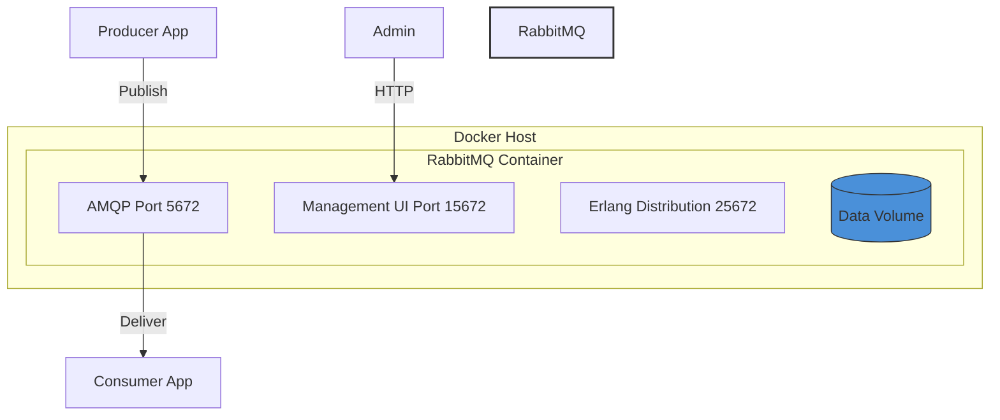
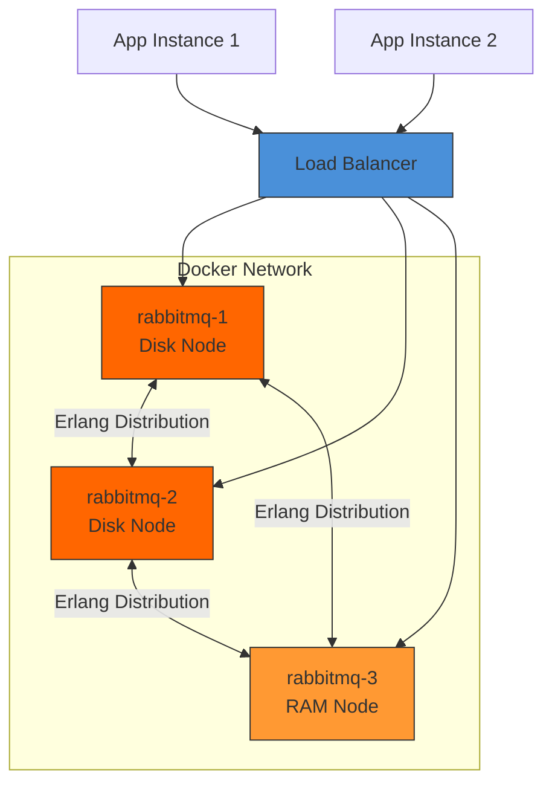
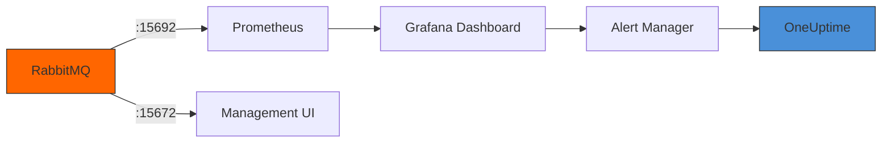

# How to Use RabbitMQ with Docker

Author: [nawazdhandala](https://www.github.com/nawazdhandala)

Tags: RabbitMQ, Docker, Message Queue, DevOps, Microservices, Containers

Description: A comprehensive guide to running RabbitMQ in Docker containers. Learn container configuration, clustering, persistence, monitoring, and production best practices for reliable message queuing.

---

RabbitMQ is one of the most popular open-source message brokers, and Docker makes it incredibly easy to deploy and manage. Whether you are building microservices, implementing event-driven architectures, or setting up background job processing, running RabbitMQ in containers provides consistency, portability, and simplified operations.

## Architecture Overview

Before diving into implementation, understanding how RabbitMQ works with Docker helps you make better deployment decisions.



## 1. Basic RabbitMQ Container

Getting started with RabbitMQ in Docker requires just a single command. The official RabbitMQ image includes everything you need for development and testing.

Running this command starts a RabbitMQ container with the management plugin enabled, exposing both the AMQP protocol port and the web-based management interface.

```bash
# Start RabbitMQ with management UI enabled
# -d runs in detached mode (background)
# --hostname sets the Erlang node name (important for clustering)
# -p maps container ports to host ports
docker run -d \
  --hostname rabbitmq-node \
  --name rabbitmq \
  -p 5672:5672 \
  -p 15672:15672 \
  rabbitmq:3-management
```

After running, access the management UI at `http://localhost:15672` with default credentials `guest/guest`.

## 2. Custom Configuration with Environment Variables

Production deployments need custom credentials and configuration. Environment variables provide the simplest way to configure RabbitMQ without modifying config files.

Setting custom credentials and enabling specific plugins through environment variables makes your deployment more secure and tailored to your needs.

```bash
# Start RabbitMQ with custom credentials and settings
# RABBITMQ_DEFAULT_USER: Admin username (replace default guest)
# RABBITMQ_DEFAULT_PASS: Admin password (use strong password in production)
# RABBITMQ_DEFAULT_VHOST: Virtual host for logical separation
docker run -d \
  --hostname rabbitmq-prod \
  --name rabbitmq \
  -e RABBITMQ_DEFAULT_USER=admin \
  -e RABBITMQ_DEFAULT_PASS=secretpassword123 \
  -e RABBITMQ_DEFAULT_VHOST=myapp \
  -p 5672:5672 \
  -p 15672:15672 \
  rabbitmq:3-management
```

## 3. Docker Compose for Development

Docker Compose simplifies multi-container setups and makes your configuration version-controlled and repeatable.

Creating a docker-compose.yml file defines your entire RabbitMQ setup including volumes, networks, and health checks in a declarative format.

```yaml
# docker-compose.yml
version: '3.8'

services:
  rabbitmq:
    image: rabbitmq:3-management
    container_name: rabbitmq
    hostname: rabbitmq-node
    ports:
      - "5672:5672"      # AMQP protocol port
      - "15672:15672"    # Management UI port
    environment:
      # Custom admin credentials
      RABBITMQ_DEFAULT_USER: admin
      RABBITMQ_DEFAULT_PASS: secretpassword123
      RABBITMQ_DEFAULT_VHOST: myapp
      # Erlang cookie for clustering (must match across nodes)
      RABBITMQ_ERLANG_COOKIE: "unique-secret-cookie"
    volumes:
      # Persist data across container restarts
      - rabbitmq_data:/var/lib/rabbitmq
      # Custom configuration file (optional)
      - ./rabbitmq.conf:/etc/rabbitmq/rabbitmq.conf:ro
    healthcheck:
      # Check if RabbitMQ is responding
      test: ["CMD", "rabbitmq-diagnostics", "check_running"]
      interval: 30s
      timeout: 10s
      retries: 5
    restart: unless-stopped

volumes:
  rabbitmq_data:
    driver: local
```

Start the stack with a simple command.

```bash
# Start RabbitMQ in the background
docker compose up -d

# View logs to monitor startup
docker compose logs -f rabbitmq
```

## 4. Persistent Data and Configuration

RabbitMQ stores messages, exchanges, queues, and user data in specific directories. Mounting volumes ensures your data survives container restarts and updates.

```mermaid
graph LR
    subgraph Container
        APP[RabbitMQ Process]
        DIR1[/var/lib/rabbitmq]
        DIR2[/etc/rabbitmq]
    end

    subgraph Host/Volume
        VOL1[(Data Volume)]
        VOL2[(Config Volume)]
    end

    DIR1 --> VOL1
    DIR2 --> VOL2
    APP --> DIR1
    APP --> DIR2

    style APP fill:#ff6600,stroke:#333
    style VOL1 fill:#4a90d9,stroke:#333
    style VOL2 fill:#4a90d9,stroke:#333
```

Creating a custom configuration file gives you fine-grained control over RabbitMQ behavior.

```ini
# rabbitmq.conf - Main configuration file
# Place in ./rabbitmq.conf and mount to /etc/rabbitmq/rabbitmq.conf

# Networking - listen on all interfaces
listeners.tcp.default = 5672

# Management plugin configuration
management.tcp.port = 15672
management.tcp.ip = 0.0.0.0

# Memory and disk thresholds
# Block publishers when memory exceeds 70% of available RAM
vm_memory_high_watermark.relative = 0.7
# Block publishers when disk free space drops below 1GB
disk_free_limit.absolute = 1GB

# Logging configuration
log.console = true
log.console.level = info

# Connection limits
# Maximum concurrent connections (adjust based on workload)
channel_max = 2047

# Heartbeat timeout (seconds) - detect dead connections
heartbeat = 60

# Message TTL default (optional, in milliseconds)
# consumer_timeout = 1800000
```

## 5. Producer and Consumer Examples

Understanding how to interact with RabbitMQ from your applications is essential. Here are practical examples in Python using the pika library.

### Producer Application

Publishing messages to RabbitMQ involves establishing a connection, declaring a queue, and sending messages with appropriate properties.

```python
# producer.py - Sends messages to RabbitMQ
import pika
import json
import time

# Connection parameters matching our Docker setup
credentials = pika.PlainCredentials('admin', 'secretpassword123')
parameters = pika.ConnectionParameters(
    host='localhost',
    port=5672,
    virtual_host='myapp',
    credentials=credentials,
    # Heartbeat keeps connection alive
    heartbeat=60,
    # Retry connection on failure
    connection_attempts=3,
    retry_delay=5
)

# Establish connection to RabbitMQ
connection = pika.BlockingConnection(parameters)
channel = connection.channel()

# Declare a durable queue (survives broker restart)
# durable=True persists the queue definition
channel.queue_declare(queue='task_queue', durable=True)

def publish_message(message_data):
    """
    Publish a message to the task queue.
    Messages are persisted to disk for durability.
    """
    channel.basic_publish(
        exchange='',              # Default exchange
        routing_key='task_queue', # Queue name
        body=json.dumps(message_data),
        properties=pika.BasicProperties(
            delivery_mode=2,      # Make message persistent
            content_type='application/json'
        )
    )
    print(f"Sent: {message_data}")

# Send sample messages
for i in range(10):
    publish_message({
        'task_id': i,
        'action': 'process_data',
        'timestamp': time.time()
    })

# Clean up connection
connection.close()
```

### Consumer Application

Consuming messages requires setting up a callback function that processes each message and acknowledges successful processing.

```python
# consumer.py - Receives and processes messages from RabbitMQ
import pika
import json
import time

# Connection parameters (same as producer)
credentials = pika.PlainCredentials('admin', 'secretpassword123')
parameters = pika.ConnectionParameters(
    host='localhost',
    port=5672,
    virtual_host='myapp',
    credentials=credentials,
    heartbeat=60
)

connection = pika.BlockingConnection(parameters)
channel = connection.channel()

# Ensure queue exists (idempotent operation)
channel.queue_declare(queue='task_queue', durable=True)

# Process only one message at a time
# Prevents fast consumer from grabbing all messages
channel.basic_qos(prefetch_count=1)

def process_message(ch, method, properties, body):
    """
    Callback function to handle incoming messages.
    Acknowledges only after successful processing.
    """
    try:
        message = json.loads(body)
        print(f"Processing task {message['task_id']}")

        # Simulate work (replace with actual processing)
        time.sleep(1)

        # Acknowledge successful processing
        # Message is removed from queue only after ack
        ch.basic_ack(delivery_tag=method.delivery_tag)
        print(f"Completed task {message['task_id']}")

    except Exception as e:
        print(f"Error processing message: {e}")
        # Reject and requeue the message for retry
        ch.basic_nack(
            delivery_tag=method.delivery_tag,
            requeue=True
        )

# Start consuming messages
# auto_ack=False requires manual acknowledgment
channel.basic_consume(
    queue='task_queue',
    on_message_callback=process_message,
    auto_ack=False
)

print("Waiting for messages. Press CTRL+C to exit.")
channel.start_consuming()
```

## 6. RabbitMQ Clustering with Docker

Production environments benefit from clustering for high availability and increased throughput. Docker Compose makes setting up a cluster straightforward.



Creating a clustered RabbitMQ setup requires coordinating multiple containers with the same Erlang cookie.

```yaml
# docker-compose-cluster.yml
version: '3.8'

services:
  rabbitmq-1:
    image: rabbitmq:3-management
    hostname: rabbitmq-1
    container_name: rabbitmq-1
    environment:
      RABBITMQ_DEFAULT_USER: admin
      RABBITMQ_DEFAULT_PASS: secretpassword123
      # Erlang cookie MUST be identical across all nodes
      RABBITMQ_ERLANG_COOKIE: "cluster-secret-cookie-xyz"
      # Enable clustering plugin
      RABBITMQ_NODENAME: rabbit@rabbitmq-1
    ports:
      - "5672:5672"
      - "15672:15672"
    volumes:
      - rabbitmq1_data:/var/lib/rabbitmq
    networks:
      - rabbitmq_cluster

  rabbitmq-2:
    image: rabbitmq:3-management
    hostname: rabbitmq-2
    container_name: rabbitmq-2
    environment:
      RABBITMQ_DEFAULT_USER: admin
      RABBITMQ_DEFAULT_PASS: secretpassword123
      RABBITMQ_ERLANG_COOKIE: "cluster-secret-cookie-xyz"
      RABBITMQ_NODENAME: rabbit@rabbitmq-2
    ports:
      - "5673:5672"
      - "15673:15672"
    volumes:
      - rabbitmq2_data:/var/lib/rabbitmq
    networks:
      - rabbitmq_cluster
    depends_on:
      - rabbitmq-1

  rabbitmq-3:
    image: rabbitmq:3-management
    hostname: rabbitmq-3
    container_name: rabbitmq-3
    environment:
      RABBITMQ_DEFAULT_USER: admin
      RABBITMQ_DEFAULT_PASS: secretpassword123
      RABBITMQ_ERLANG_COOKIE: "cluster-secret-cookie-xyz"
      RABBITMQ_NODENAME: rabbit@rabbitmq-3
    ports:
      - "5674:5672"
      - "15674:15672"
    volumes:
      - rabbitmq3_data:/var/lib/rabbitmq
    networks:
      - rabbitmq_cluster
    depends_on:
      - rabbitmq-1

networks:
  rabbitmq_cluster:
    driver: bridge

volumes:
  rabbitmq1_data:
  rabbitmq2_data:
  rabbitmq3_data:
```

After starting the containers, join nodes to form a cluster using these commands.

```bash
# Start all containers
docker compose -f docker-compose-cluster.yml up -d

# Wait for containers to be healthy (about 30 seconds)
sleep 30

# Join rabbitmq-2 to the cluster
docker exec rabbitmq-2 rabbitmqctl stop_app
docker exec rabbitmq-2 rabbitmqctl reset
docker exec rabbitmq-2 rabbitmqctl join_cluster rabbit@rabbitmq-1
docker exec rabbitmq-2 rabbitmqctl start_app

# Join rabbitmq-3 to the cluster
docker exec rabbitmq-3 rabbitmqctl stop_app
docker exec rabbitmq-3 rabbitmqctl reset
docker exec rabbitmq-3 rabbitmqctl join_cluster rabbit@rabbitmq-1
docker exec rabbitmq-3 rabbitmqctl start_app

# Verify cluster status
docker exec rabbitmq-1 rabbitmqctl cluster_status
```

## 7. High Availability with Quorum Queues

Quorum queues provide better data safety compared to classic mirrored queues. Declaring quorum queues ensures your messages survive node failures.

```python
# quorum_queue_setup.py - Configure high-availability queues
import pika

credentials = pika.PlainCredentials('admin', 'secretpassword123')
parameters = pika.ConnectionParameters(
    host='localhost',
    port=5672,
    virtual_host='/',
    credentials=credentials
)

connection = pika.BlockingConnection(parameters)
channel = connection.channel()

# Declare a quorum queue for high availability
# Quorum queues use Raft consensus for replication
channel.queue_declare(
    queue='ha_task_queue',
    durable=True,
    arguments={
        # Queue type: quorum (replicated across cluster)
        'x-queue-type': 'quorum',
        # Maximum number of messages in queue
        'x-max-length': 1000000,
        # How long messages live (milliseconds)
        'x-message-ttl': 86400000,  # 24 hours
        # Dead letter exchange for failed messages
        'x-dead-letter-exchange': 'dlx',
        'x-dead-letter-routing-key': 'failed_tasks'
    }
)

print("Quorum queue 'ha_task_queue' created successfully")
connection.close()
```

## 8. Monitoring and Observability

Monitoring RabbitMQ is critical for production workloads. The management plugin exposes Prometheus-compatible metrics.



Enable the Prometheus plugin and configure metrics export in your Docker setup.

```yaml
# docker-compose-monitoring.yml
version: '3.8'

services:
  rabbitmq:
    image: rabbitmq:3-management
    hostname: rabbitmq-monitored
    container_name: rabbitmq
    ports:
      - "5672:5672"
      - "15672:15672"
      - "15692:15692"    # Prometheus metrics port
    environment:
      RABBITMQ_DEFAULT_USER: admin
      RABBITMQ_DEFAULT_PASS: secretpassword123
    volumes:
      - rabbitmq_data:/var/lib/rabbitmq
      - ./enabled_plugins:/etc/rabbitmq/enabled_plugins:ro
    healthcheck:
      test: ["CMD", "rabbitmq-diagnostics", "check_running"]
      interval: 30s
      timeout: 10s
      retries: 5

volumes:
  rabbitmq_data:
```

Create an enabled_plugins file to activate the Prometheus plugin.

```erlang
# enabled_plugins - List of plugins to enable at startup
[rabbitmq_management, rabbitmq_prometheus].
```

Key metrics to monitor include:

| Metric | Description | Alert Threshold |
|--------|-------------|-----------------|
| `rabbitmq_queue_messages` | Messages ready for delivery | > 10000 |
| `rabbitmq_queue_messages_unacked` | Unacknowledged messages | > 1000 |
| `rabbitmq_connections` | Active connections | > 90% of limit |
| `rabbitmq_channels` | Open channels | > 80% of limit |
| `rabbitmq_node_mem_used` | Memory usage | > 70% watermark |
| `rabbitmq_node_disk_free` | Free disk space | < 2GB |

## 9. Security Best Practices

Securing RabbitMQ in Docker requires attention to credentials, network access, and TLS encryption.

Generating TLS certificates and mounting them into your container enables encrypted connections.

```bash
# Generate self-signed certificates for development
# For production, use certificates from a trusted CA
mkdir -p ./certs

# Generate CA certificate
openssl genrsa -out ./certs/ca.key 4096
openssl req -x509 -new -nodes -key ./certs/ca.key \
  -sha256 -days 365 -out ./certs/ca.crt \
  -subj "/CN=RabbitMQ CA"

# Generate server certificate
openssl genrsa -out ./certs/server.key 4096
openssl req -new -key ./certs/server.key \
  -out ./certs/server.csr \
  -subj "/CN=rabbitmq"
openssl x509 -req -in ./certs/server.csr \
  -CA ./certs/ca.crt -CAkey ./certs/ca.key \
  -CAcreateserial -out ./certs/server.crt \
  -days 365 -sha256
```

Configure RabbitMQ to use TLS for all connections.

```ini
# rabbitmq-ssl.conf - TLS configuration
# Disable plain TCP listener
listeners.tcp = none

# Enable TLS listener on port 5671
listeners.ssl.default = 5671

# Certificate paths (mounted from host)
ssl_options.cacertfile = /etc/rabbitmq/certs/ca.crt
ssl_options.certfile = /etc/rabbitmq/certs/server.crt
ssl_options.keyfile = /etc/rabbitmq/certs/server.key

# Require client certificate verification (mutual TLS)
ssl_options.verify = verify_peer
ssl_options.fail_if_no_peer_cert = false

# TLS versions (disable older insecure versions)
ssl_options.versions.1 = tlsv1.3
ssl_options.versions.2 = tlsv1.2

# Management plugin TLS
management.ssl.port = 15671
management.ssl.cacertfile = /etc/rabbitmq/certs/ca.crt
management.ssl.certfile = /etc/rabbitmq/certs/server.crt
management.ssl.keyfile = /etc/rabbitmq/certs/server.key
```

## 10. Common Operations and Troubleshooting

Managing RabbitMQ containers involves routine maintenance tasks. Here are essential commands for day-to-day operations.

```bash
# Check container health and logs
docker logs rabbitmq --tail 100
docker exec rabbitmq rabbitmq-diagnostics check_running

# List all queues with message counts
docker exec rabbitmq rabbitmqctl list_queues name messages consumers

# List all connections (useful for debugging)
docker exec rabbitmq rabbitmqctl list_connections user peer_host state

# Purge all messages from a specific queue
docker exec rabbitmq rabbitmqctl purge_queue task_queue

# Export definitions (users, vhosts, queues, exchanges)
docker exec rabbitmq rabbitmqctl export_definitions /tmp/definitions.json
docker cp rabbitmq:/tmp/definitions.json ./backup/

# Import definitions (restore configuration)
docker cp ./backup/definitions.json rabbitmq:/tmp/
docker exec rabbitmq rabbitmqctl import_definitions /tmp/definitions.json

# Graceful shutdown (allows message draining)
docker exec rabbitmq rabbitmqctl stop_app
docker stop rabbitmq
```

## 11. Production Checklist

Before deploying RabbitMQ to production, verify these configurations:

- [ ] Custom admin credentials set (not default guest/guest)
- [ ] Persistent volumes configured for `/var/lib/rabbitmq`
- [ ] Memory and disk watermarks configured appropriately
- [ ] Health checks enabled in Docker Compose
- [ ] TLS enabled for client connections
- [ ] Prometheus metrics endpoint exposed
- [ ] Alerting configured for key metrics
- [ ] Backup strategy for definitions and data
- [ ] Network policies restricting management UI access
- [ ] Resource limits set in Docker (memory, CPU)

```yaml
# Example resource limits in Docker Compose
services:
  rabbitmq:
    image: rabbitmq:3-management
    deploy:
      resources:
        limits:
          cpus: '2.0'
          memory: 4G
        reservations:
          cpus: '1.0'
          memory: 2G
```

---

Running RabbitMQ in Docker provides a reliable, portable message broker for applications of any scale. Starting with a simple single-node setup for development and scaling to a clustered production deployment becomes straightforward with proper configuration. Focus on persistence, monitoring, and security from the beginning to avoid operational headaches later. Combined with proper observability through tools like OneUptime, you can maintain healthy message queues that keep your distributed systems communicating reliably.
