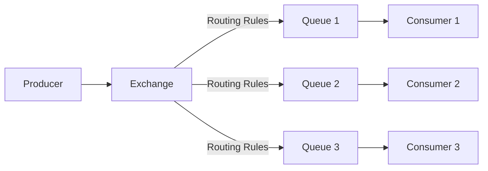
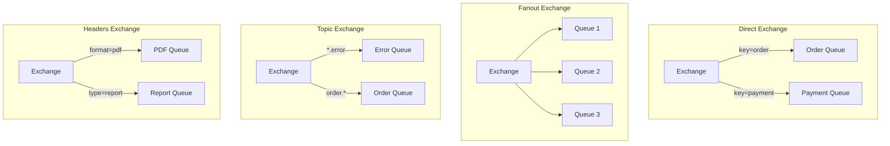
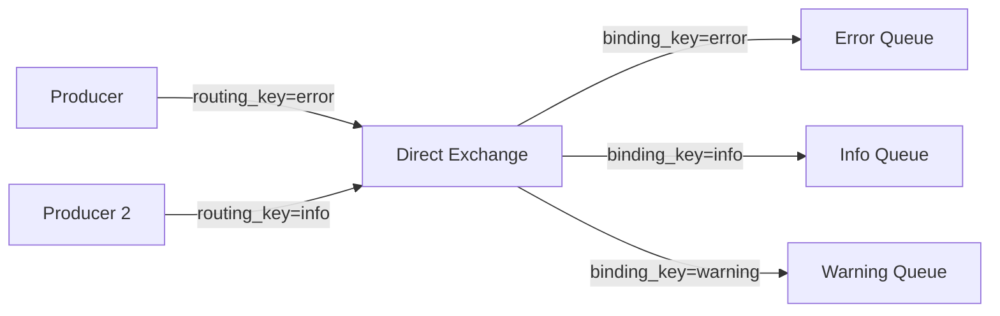
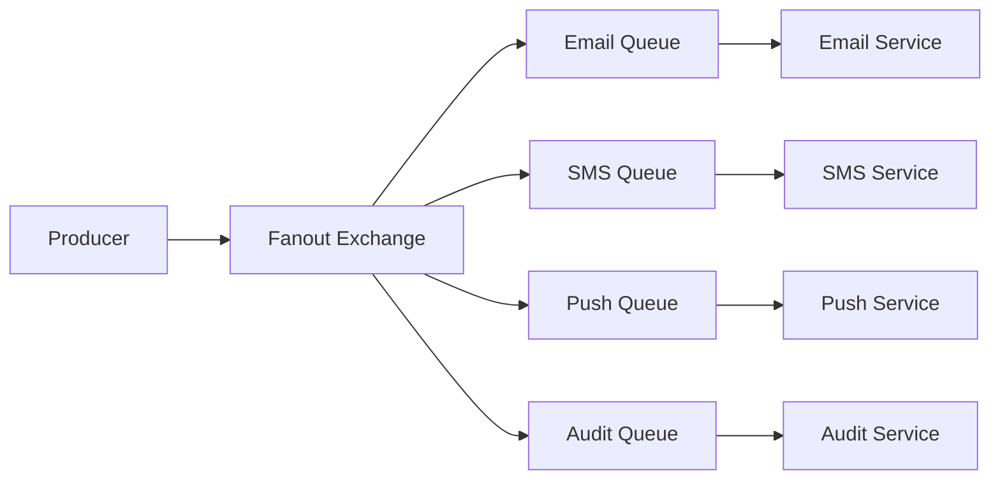
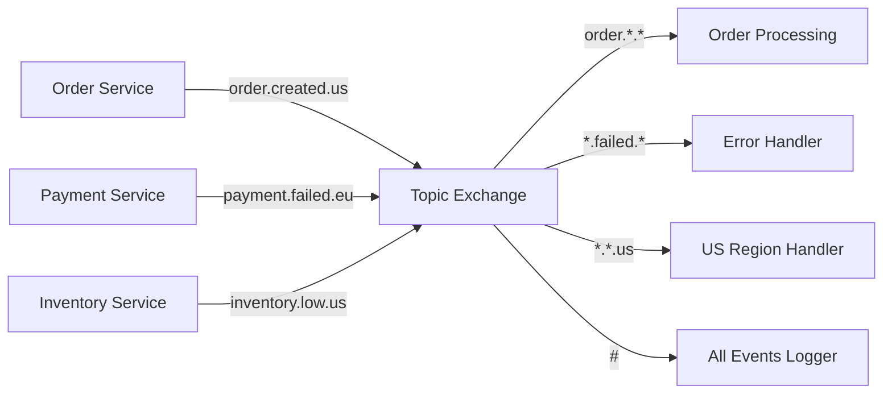
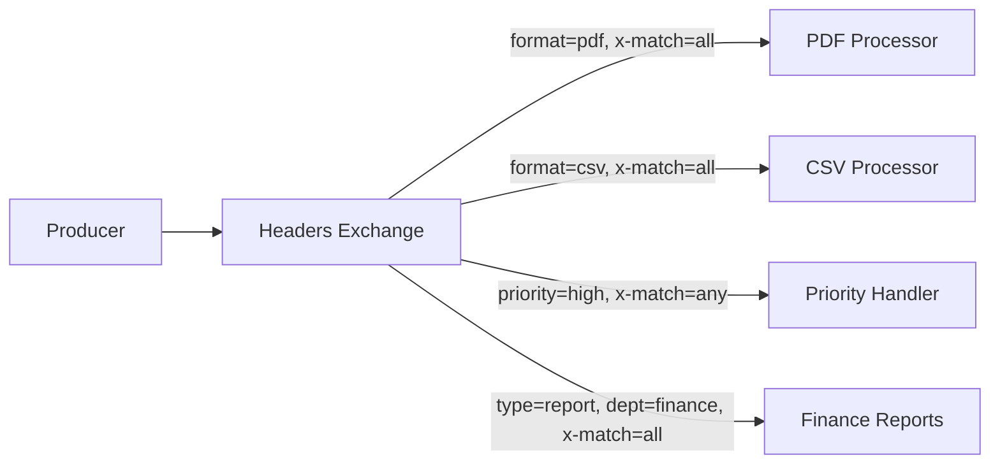
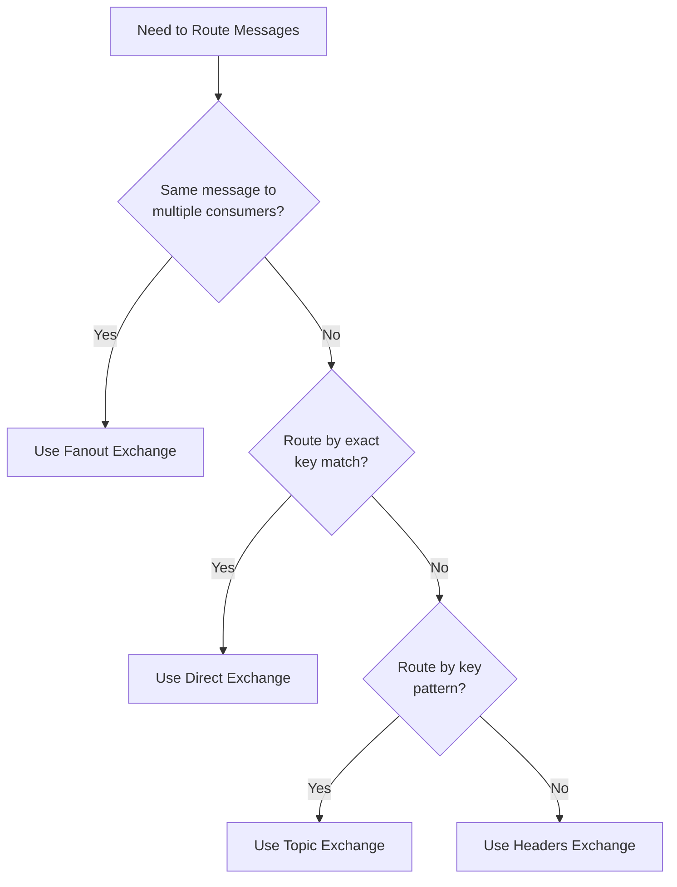

# How to Implement Different Exchange Types in RabbitMQ

Author: [nawazdhandala](https://www.github.com/nawazdhandala)

Tags: RabbitMQ, Message Queue, Messaging, Exchange Types, Event-Driven Architecture, Python, Node.js, Microservices

Description: Learn how to implement all four RabbitMQ exchange types - Direct, Fanout, Topic, and Headers. Covers practical examples with Python and Node.js, routing patterns, and production best practices.

---

> RabbitMQ exchanges determine how messages get routed to queues. Choosing the right exchange type is critical for building scalable, decoupled messaging systems. Master all four exchange types to design efficient event-driven architectures.

Understanding exchange types unlocks the full power of RabbitMQ for building flexible messaging solutions.

---

## Overview

RabbitMQ uses exchanges as routing agents that receive messages from producers and route them to queues based on rules called bindings. Each exchange type implements a different routing algorithm.



---

## Exchange Types Summary

RabbitMQ provides four built-in exchange types, each designed for specific messaging patterns:

| Exchange Type | Routing Mechanism | Use Case |
|--------------|-------------------|----------|
| Direct | Exact routing key match | Task queues, RPC |
| Fanout | Broadcast to all bound queues | Notifications, events |
| Topic | Pattern matching on routing key | Log routing, event filtering |
| Headers | Message header matching | Complex routing rules |



---

## Prerequisites

Install the required libraries for Python and Node.js implementations:

```bash
# Python
pip install pika

# Node.js
npm install amqplib
```

---

## Direct Exchange

Direct exchanges route messages to queues based on an exact routing key match. When a queue binds to a direct exchange with a routing key, the exchange delivers messages with that exact routing key to the queue.



### Python Implementation

The following code demonstrates setting up a direct exchange with multiple queues bound to different routing keys:

```python
# direct_exchange.py
import pika
import json

def setup_direct_exchange():
    """
    Set up a direct exchange for routing log messages
    to different queues based on severity level.
    """
    # Establish connection to RabbitMQ server
    connection = pika.BlockingConnection(
        pika.ConnectionParameters('localhost')
    )
    channel = connection.channel()

    # Declare the direct exchange
    # durable=True ensures the exchange survives broker restarts
    channel.exchange_declare(
        exchange='logs_direct',
        exchange_type='direct',
        durable=True
    )

    # Define queues for different log levels
    log_levels = ['error', 'warning', 'info', 'debug']

    for level in log_levels:
        # Declare a durable queue for each log level
        channel.queue_declare(
            queue=f'logs_{level}',
            durable=True
        )

        # Bind queue to exchange with routing key matching the log level
        # Only messages with this exact routing key will reach this queue
        channel.queue_bind(
            exchange='logs_direct',
            queue=f'logs_{level}',
            routing_key=level
        )

    return connection, channel


def publish_log(channel, level, message):
    """
    Publish a log message to the direct exchange.
    The routing key determines which queue receives the message.
    """
    channel.basic_publish(
        exchange='logs_direct',
        routing_key=level,  # Must match a binding key exactly
        body=json.dumps({
            'level': level,
            'message': message
        }),
        properties=pika.BasicProperties(
            delivery_mode=2,  # Make message persistent
            content_type='application/json'
        )
    )
    print(f"Published {level} log: {message}")


def consume_logs(channel, level, callback):
    """
    Consume messages from a specific log level queue.
    """
    def on_message(ch, method, properties, body):
        log_data = json.loads(body)
        callback(log_data)
        # Acknowledge the message after processing
        ch.basic_ack(delivery_tag=method.delivery_tag)

    # Start consuming from the specified queue
    channel.basic_consume(
        queue=f'logs_{level}',
        on_message_callback=on_message
    )


# Example usage
if __name__ == '__main__':
    conn, ch = setup_direct_exchange()

    # Publish messages with different routing keys
    publish_log(ch, 'error', 'Database connection failed')
    publish_log(ch, 'warning', 'High memory usage detected')
    publish_log(ch, 'info', 'User login successful')

    conn.close()
```

### Node.js Implementation

Here is the equivalent implementation using the amqplib library in Node.js:

```javascript
// direct_exchange.js
const amqp = require('amqplib');

async function setupDirectExchange() {
    /**
     * Set up a direct exchange for routing messages
     * based on exact routing key matches.
     */
    const connection = await amqp.connect('amqp://localhost');
    const channel = await connection.createChannel();

    const exchangeName = 'logs_direct';
    const logLevels = ['error', 'warning', 'info', 'debug'];

    // Declare the direct exchange with durability enabled
    await channel.assertExchange(exchangeName, 'direct', {
        durable: true
    });

    // Create and bind a queue for each log level
    for (const level of logLevels) {
        const queueName = `logs_${level}`;

        // Declare the queue - durable ensures it survives restarts
        await channel.assertQueue(queueName, {
            durable: true
        });

        // Bind queue to exchange with the routing key
        await channel.bindQueue(queueName, exchangeName, level);
    }

    return { connection, channel };
}

async function publishLog(channel, level, message) {
    /**
     * Publish a log message with the specified severity level.
     * Messages route to queues bound with matching routing keys.
     */
    const exchangeName = 'logs_direct';
    const payload = JSON.stringify({
        level: level,
        message: message,
        timestamp: new Date().toISOString()
    });

    // Publish with persistent delivery mode
    channel.publish(exchangeName, level, Buffer.from(payload), {
        persistent: true,
        contentType: 'application/json'
    });

    console.log(`Published ${level} log: ${message}`);
}

async function consumeLogs(channel, level, callback) {
    /**
     * Set up a consumer for a specific log level queue.
     */
    const queueName = `logs_${level}`;

    // Prefetch 1 message at a time for fair distribution
    await channel.prefetch(1);

    await channel.consume(queueName, async (msg) => {
        if (msg) {
            const logData = JSON.parse(msg.content.toString());
            await callback(logData);
            // Acknowledge after successful processing
            channel.ack(msg);
        }
    });
}

// Example usage
async function main() {
    const { connection, channel } = await setupDirectExchange();

    await publishLog(channel, 'error', 'Service unavailable');
    await publishLog(channel, 'info', 'Request processed successfully');

    // Set up consumer for error logs only
    await consumeLogs(channel, 'error', (log) => {
        console.log('Received error:', log);
    });
}

main().catch(console.error);
```

---

## Fanout Exchange

Fanout exchanges broadcast messages to all bound queues, ignoring the routing key entirely. Every queue bound to the exchange receives a copy of each message.



### Python Implementation

The following example shows how to implement a fanout exchange for broadcasting notifications to multiple services:

```python
# fanout_exchange.py
import pika
import json
from datetime import datetime

def setup_fanout_exchange():
    """
    Set up a fanout exchange for broadcasting events
    to all notification services simultaneously.
    """
    connection = pika.BlockingConnection(
        pika.ConnectionParameters('localhost')
    )
    channel = connection.channel()

    # Declare the fanout exchange
    # Fanout exchanges ignore routing keys - all bound queues receive all messages
    channel.exchange_declare(
        exchange='notifications',
        exchange_type='fanout',
        durable=True
    )

    # Define notification channels that should receive all events
    services = ['email', 'sms', 'push', 'slack', 'webhook']

    for service in services:
        queue_name = f'notify_{service}'

        # Declare queue for each notification service
        channel.queue_declare(
            queue=queue_name,
            durable=True
        )

        # Bind to fanout exchange - routing key is ignored but required
        channel.queue_bind(
            exchange='notifications',
            queue=queue_name,
            routing_key=''  # Empty string - fanout ignores this
        )

    return connection, channel


def broadcast_notification(channel, event_type, data):
    """
    Broadcast a notification to all bound queues.
    Every notification service receives a copy of this message.
    """
    message = {
        'event_type': event_type,
        'data': data,
        'timestamp': datetime.utcnow().isoformat(),
        'broadcast': True
    }

    # Publish to fanout exchange
    # Routing key is empty since fanout ignores it
    channel.basic_publish(
        exchange='notifications',
        routing_key='',
        body=json.dumps(message),
        properties=pika.BasicProperties(
            delivery_mode=2,
            content_type='application/json'
        )
    )
    print(f"Broadcasted {event_type} event to all services")


def create_notification_consumer(channel, service_name, handler):
    """
    Create a consumer for a specific notification service.
    Each service processes the broadcast independently.
    """
    queue_name = f'notify_{service_name}'

    def callback(ch, method, properties, body):
        notification = json.loads(body)
        # Each service handles the notification according to its needs
        handler(notification)
        ch.basic_ack(delivery_tag=method.delivery_tag)

    # Set prefetch to process one message at a time
    channel.basic_qos(prefetch_count=1)

    channel.basic_consume(
        queue=queue_name,
        on_message_callback=callback
    )


# Example: Broadcasting an order confirmation
if __name__ == '__main__':
    conn, ch = setup_fanout_exchange()

    # All notification services receive this event
    broadcast_notification(ch, 'order_confirmed', {
        'order_id': 'ORD-12345',
        'customer_email': 'customer@example.com',
        'amount': 99.99
    })

    conn.close()
```

### Use Cases for Fanout Exchanges

Fanout exchanges work best in these scenarios:

- **Notification systems** - Send alerts to email, SMS, and push simultaneously
- **Event broadcasting** - Notify multiple microservices about state changes
- **Real-time updates** - Push updates to multiple WebSocket servers
- **Audit logging** - Send events to multiple audit systems

---

## Topic Exchange

Topic exchanges route messages based on pattern matching between the routing key and the binding pattern. Patterns use wildcards: `*` matches exactly one word, and `#` matches zero or more words.



### Pattern Matching Rules

Understanding topic exchange patterns is essential for effective message routing:

| Pattern | Matches | Does Not Match |
|---------|---------|----------------|
| `order.*` | order.created, order.updated | order.item.added |
| `order.#` | order, order.created, order.item.added | payment.created |
| `*.error` | app.error, db.error | app.critical.error |
| `#.error` | error, app.error, system.db.error | app.warning |

### Python Implementation

The following implementation demonstrates a topic exchange for routing application events:

```python
# topic_exchange.py
import pika
import json

def setup_topic_exchange():
    """
    Set up a topic exchange for flexible event routing
    using pattern matching on routing keys.
    """
    connection = pika.BlockingConnection(
        pika.ConnectionParameters('localhost')
    )
    channel = connection.channel()

    # Declare the topic exchange
    channel.exchange_declare(
        exchange='events',
        exchange_type='topic',
        durable=True
    )

    # Define queue bindings with topic patterns
    # Each pattern captures different subsets of events
    bindings = [
        # Queue for all order-related events
        ('order_events', 'order.#'),
        # Queue for all error events from any service
        ('error_events', '*.error'),
        # Queue for all events from the US region
        ('us_region_events', '*.*.us'),
        # Queue for critical errors only
        ('critical_alerts', '*.error.critical'),
        # Queue that receives absolutely everything
        ('all_events', '#')
    ]

    for queue_name, binding_pattern in bindings:
        # Declare each queue
        channel.queue_declare(
            queue=queue_name,
            durable=True
        )

        # Bind with the topic pattern
        channel.queue_bind(
            exchange='events',
            queue=queue_name,
            routing_key=binding_pattern
        )
        print(f"Bound {queue_name} with pattern: {binding_pattern}")

    return connection, channel


def publish_event(channel, routing_key, event_data):
    """
    Publish an event with a multi-part routing key.
    The routing key format: <service>.<action>.<region>
    """
    message = {
        'routing_key': routing_key,
        'data': event_data,
        'timestamp': datetime.utcnow().isoformat()
    }

    channel.basic_publish(
        exchange='events',
        routing_key=routing_key,
        body=json.dumps(message),
        properties=pika.BasicProperties(
            delivery_mode=2,
            content_type='application/json'
        )
    )
    print(f"Published event: {routing_key}")


def create_topic_consumer(channel, queue_name, handler):
    """
    Create a consumer for a topic-bound queue.
    Messages matching the queue's binding pattern are delivered here.
    """
    def callback(ch, method, properties, body):
        event = json.loads(body)
        # The routing key tells us exactly what event this is
        routing_key = method.routing_key
        handler(routing_key, event)
        ch.basic_ack(delivery_tag=method.delivery_tag)

    channel.basic_qos(prefetch_count=10)
    channel.basic_consume(
        queue=queue_name,
        on_message_callback=callback
    )


# Example usage showing routing to multiple queues
if __name__ == '__main__':
    from datetime import datetime

    conn, ch = setup_topic_exchange()

    # Event matches: order_events, us_region_events, all_events
    publish_event(ch, 'order.created.us', {
        'order_id': 'ORD-001',
        'items': 3
    })

    # Event matches: error_events, all_events
    publish_event(ch, 'payment.error', {
        'error': 'Card declined'
    })

    # Event matches: order_events, error_events, critical_alerts, all_events
    publish_event(ch, 'order.error.critical', {
        'error': 'Inventory sync failed'
    })

    conn.close()
```

### Node.js Implementation

Here is the equivalent topic exchange implementation in Node.js:

```javascript
// topic_exchange.js
const amqp = require('amqplib');

async function setupTopicExchange() {
    /**
     * Set up a topic exchange for pattern-based routing
     * of application events across multiple services.
     */
    const connection = await amqp.connect('amqp://localhost');
    const channel = await connection.createChannel();

    const exchangeName = 'events';

    // Declare topic exchange
    await channel.assertExchange(exchangeName, 'topic', {
        durable: true
    });

    // Define queues with their binding patterns
    const bindings = [
        { queue: 'order_processor', pattern: 'order.#' },
        { queue: 'payment_handler', pattern: 'payment.*' },
        { queue: 'error_aggregator', pattern: '#.error' },
        { queue: 'analytics', pattern: '#' }
    ];

    for (const { queue, pattern } of bindings) {
        await channel.assertQueue(queue, { durable: true });
        await channel.bindQueue(queue, exchangeName, pattern);
        console.log(`Bound ${queue} to pattern: ${pattern}`);
    }

    return { connection, channel };
}

async function publishEvent(channel, routingKey, data) {
    /**
     * Publish an event with a dot-separated routing key.
     * Topic patterns determine which queues receive this message.
     */
    const payload = JSON.stringify({
        routingKey: routingKey,
        data: data,
        timestamp: new Date().toISOString()
    });

    channel.publish('events', routingKey, Buffer.from(payload), {
        persistent: true,
        contentType: 'application/json'
    });

    console.log(`Published: ${routingKey}`);
}

async function subscribeToPattern(channel, queueName, handler) {
    /**
     * Subscribe to events matching the queue's binding pattern.
     */
    await channel.prefetch(10);

    await channel.consume(queueName, async (msg) => {
        if (msg) {
            const routingKey = msg.fields.routingKey;
            const event = JSON.parse(msg.content.toString());

            try {
                await handler(routingKey, event);
                channel.ack(msg);
            } catch (error) {
                // Reject and requeue on failure
                channel.nack(msg, false, true);
            }
        }
    });
}

// Example usage
async function main() {
    const { connection, channel } = await setupTopicExchange();

    // Publish events with different routing keys
    await publishEvent(channel, 'order.created', { orderId: '123' });
    await publishEvent(channel, 'order.shipped', { orderId: '123' });
    await publishEvent(channel, 'payment.processed', { amount: 50 });
    await publishEvent(channel, 'payment.error', { reason: 'Insufficient funds' });

    // Subscribe to order events only
    await subscribeToPattern(channel, 'order_processor', (key, event) => {
        console.log(`Order event [${key}]:`, event);
    });
}

main().catch(console.error);
```

---

## Headers Exchange

Headers exchanges route messages based on message header attributes instead of routing keys. Multiple headers can be matched, and you can require all headers to match or just any one of them.



### Python Implementation

The following code demonstrates headers exchange routing based on message attributes:

```python
# headers_exchange.py
import pika
import json

def setup_headers_exchange():
    """
    Set up a headers exchange for routing based on
    message header attributes rather than routing keys.
    """
    connection = pika.BlockingConnection(
        pika.ConnectionParameters('localhost')
    )
    channel = connection.channel()

    # Declare the headers exchange
    channel.exchange_declare(
        exchange='document_processor',
        exchange_type='headers',
        durable=True
    )

    # Define queues with header-based bindings
    # x-match: 'all' requires all headers to match
    # x-match: 'any' requires at least one header to match

    # Queue for PDF documents only
    channel.queue_declare(queue='pdf_queue', durable=True)
    channel.queue_bind(
        exchange='document_processor',
        queue='pdf_queue',
        routing_key='',  # Headers exchange ignores routing key
        arguments={
            'x-match': 'all',  # All specified headers must match
            'format': 'pdf'
        }
    )

    # Queue for CSV documents only
    channel.queue_declare(queue='csv_queue', durable=True)
    channel.queue_bind(
        exchange='document_processor',
        queue='csv_queue',
        arguments={
            'x-match': 'all',
            'format': 'csv'
        }
    )

    # Queue for high priority OR urgent documents
    channel.queue_declare(queue='priority_queue', durable=True)
    channel.queue_bind(
        exchange='document_processor',
        queue='priority_queue',
        arguments={
            'x-match': 'any',  # Any matching header is sufficient
            'priority': 'high',
            'urgent': 'true'
        }
    )

    # Queue requiring multiple headers to match
    channel.queue_declare(queue='finance_reports', durable=True)
    channel.queue_bind(
        exchange='document_processor',
        queue='finance_reports',
        arguments={
            'x-match': 'all',
            'type': 'report',
            'department': 'finance',
            'format': 'pdf'
        }
    )

    return connection, channel


def publish_document(channel, headers, document_data):
    """
    Publish a document with headers that determine routing.
    The headers dictionary controls which queues receive the message.
    """
    # Create message properties with custom headers
    properties = pika.BasicProperties(
        delivery_mode=2,
        content_type='application/json',
        headers=headers  # Headers used for routing decisions
    )

    channel.basic_publish(
        exchange='document_processor',
        routing_key='',  # Ignored by headers exchange
        body=json.dumps(document_data),
        properties=properties
    )
    print(f"Published document with headers: {headers}")


def consume_documents(channel, queue_name, handler):
    """
    Consume documents from a header-bound queue.
    """
    def callback(ch, method, properties, body):
        # Access the headers from message properties
        headers = properties.headers or {}
        document = json.loads(body)
        handler(headers, document)
        ch.basic_ack(delivery_tag=method.delivery_tag)

    channel.basic_qos(prefetch_count=5)
    channel.basic_consume(
        queue=queue_name,
        on_message_callback=callback
    )


# Example usage demonstrating header-based routing
if __name__ == '__main__':
    conn, ch = setup_headers_exchange()

    # Routes to: pdf_queue
    publish_document(ch,
        {'format': 'pdf'},
        {'filename': 'invoice.pdf', 'size': 1024}
    )

    # Routes to: csv_queue
    publish_document(ch,
        {'format': 'csv'},
        {'filename': 'data.csv', 'rows': 500}
    )

    # Routes to: priority_queue (matches 'priority': 'high')
    publish_document(ch,
        {'format': 'xlsx', 'priority': 'high'},
        {'filename': 'urgent_report.xlsx'}
    )

    # Routes to: pdf_queue AND finance_reports (matches all required headers)
    publish_document(ch,
        {'format': 'pdf', 'type': 'report', 'department': 'finance'},
        {'filename': 'q4_report.pdf', 'quarter': 'Q4'}
    )

    conn.close()
```

### Node.js Implementation

Here is the headers exchange implementation in Node.js:

```javascript
// headers_exchange.js
const amqp = require('amqplib');

async function setupHeadersExchange() {
    /**
     * Set up a headers exchange for attribute-based routing.
     * Messages route based on header values, not routing keys.
     */
    const connection = await amqp.connect('amqp://localhost');
    const channel = await connection.createChannel();

    const exchangeName = 'document_processor';

    // Declare headers exchange
    await channel.assertExchange(exchangeName, 'headers', {
        durable: true
    });

    // Queue for image files
    await channel.assertQueue('image_processor', { durable: true });
    await channel.bindQueue('image_processor', exchangeName, '', {
        'x-match': 'any',
        'format': 'png',
        'format': 'jpg',
        'format': 'gif'
    });

    // Queue requiring specific combination of headers
    await channel.assertQueue('secure_docs', { durable: true });
    await channel.bindQueue('secure_docs', exchangeName, '', {
        'x-match': 'all',
        'encrypted': 'true',
        'classification': 'confidential'
    });

    return { connection, channel };
}

async function publishWithHeaders(channel, headers, data) {
    /**
     * Publish a message with routing headers.
     * Headers exchange evaluates these headers for routing.
     */
    const payload = JSON.stringify(data);

    channel.publish('document_processor', '', Buffer.from(payload), {
        persistent: true,
        contentType: 'application/json',
        headers: headers  // Routing is based on these headers
    });

    console.log('Published with headers:', headers);
}

async function consumeFromQueue(channel, queueName, handler) {
    /**
     * Consume messages from a headers-bound queue.
     */
    await channel.prefetch(5);

    await channel.consume(queueName, async (msg) => {
        if (msg) {
            const headers = msg.properties.headers || {};
            const data = JSON.parse(msg.content.toString());

            await handler(headers, data);
            channel.ack(msg);
        }
    });
}

// Example usage
async function main() {
    const { channel } = await setupHeadersExchange();

    // Publish encrypted confidential document
    await publishWithHeaders(channel, {
        encrypted: 'true',
        classification: 'confidential',
        format: 'pdf'
    }, {
        filename: 'secret_plans.pdf'
    });
}

main().catch(console.error);
```

---

## Exchange Comparison and Selection Guide

Choosing the right exchange type depends on your messaging requirements:



### When to Use Each Exchange Type

**Direct Exchange:**
- Task distribution with specific queue targeting
- Request-reply patterns
- Load balancing across workers
- Simple routing without pattern matching

**Fanout Exchange:**
- Broadcasting events to all subscribers
- Notification systems
- Cache invalidation signals
- Real-time updates to multiple services

**Topic Exchange:**
- Log aggregation with severity and source filtering
- Event-driven architectures with hierarchical events
- Geographical or categorical routing
- Flexible subscription patterns

**Headers Exchange:**
- Routing based on multiple message attributes
- Complex routing rules not expressible with routing keys
- Content-type or format-based processing
- Multi-dimensional filtering requirements

---

## Production Best Practices

### Exchange and Queue Declaration

Always declare exchanges and queues as durable in production to survive broker restarts:

```python
# production_setup.py
import pika

def production_exchange_setup(channel):
    """
    Production-ready exchange and queue configuration
    with durability and proper error handling.
    """
    # Declare exchanges with durability
    exchanges = [
        ('orders', 'topic'),
        ('notifications', 'fanout'),
        ('tasks', 'direct'),
        ('documents', 'headers')
    ]

    for name, exchange_type in exchanges:
        channel.exchange_declare(
            exchange=name,
            exchange_type=exchange_type,
            durable=True,  # Survives broker restart
            auto_delete=False  # Remains when unused
        )

    # Configure dead letter exchange for failed messages
    channel.exchange_declare(
        exchange='dead_letters',
        exchange_type='topic',
        durable=True
    )

    # Declare queue with dead letter routing
    channel.queue_declare(
        queue='order_processing',
        durable=True,
        arguments={
            # Route rejected/expired messages to dead letter exchange
            'x-dead-letter-exchange': 'dead_letters',
            'x-dead-letter-routing-key': 'order.failed',
            # Optional: set message TTL in milliseconds
            'x-message-ttl': 86400000  # 24 hours
        }
    )
```

### Connection Management

Implement connection pooling and automatic recovery for production reliability:

```python
# connection_manager.py
import pika
from pika.adapters.blocking_connection import BlockingConnection
import time
import logging

logger = logging.getLogger(__name__)

class RabbitMQConnectionManager:
    """
    Manages RabbitMQ connections with automatic reconnection
    and connection pooling for production environments.
    """

    def __init__(self, host='localhost', port=5672,
                 username='guest', password='guest',
                 virtual_host='/', heartbeat=60):
        self.params = pika.ConnectionParameters(
            host=host,
            port=port,
            virtual_host=virtual_host,
            credentials=pika.PlainCredentials(username, password),
            heartbeat=heartbeat,
            # Enable automatic connection recovery
            connection_attempts=3,
            retry_delay=5
        )
        self.connection = None
        self.channel = None

    def connect(self):
        """Establish connection with retry logic."""
        max_retries = 5
        retry_count = 0

        while retry_count < max_retries:
            try:
                self.connection = BlockingConnection(self.params)
                self.channel = self.connection.channel()
                # Enable publisher confirms for reliability
                self.channel.confirm_delivery()
                logger.info("Connected to RabbitMQ")
                return self.channel
            except pika.exceptions.AMQPConnectionError as e:
                retry_count += 1
                wait_time = 2 ** retry_count  # Exponential backoff
                logger.warning(f"Connection failed, retry {retry_count}/{max_retries} in {wait_time}s")
                time.sleep(wait_time)

        raise Exception("Failed to connect to RabbitMQ after max retries")

    def get_channel(self):
        """Get active channel, reconnecting if necessary."""
        if self.connection is None or self.connection.is_closed:
            self.connect()
        if self.channel is None or self.channel.is_closed:
            self.channel = self.connection.channel()
            self.channel.confirm_delivery()
        return self.channel

    def close(self):
        """Close connection gracefully."""
        if self.connection and not self.connection.is_closed:
            self.connection.close()
            logger.info("Connection closed")
```

### Monitoring Exchange Health

Monitor exchange metrics to ensure healthy message flow:

```python
# exchange_monitor.py
import requests
from typing import Dict, List

class RabbitMQMonitor:
    """
    Monitor RabbitMQ exchanges and queues using
    the Management HTTP API.
    """

    def __init__(self, host='localhost', port=15672,
                 username='guest', password='guest'):
        self.base_url = f"http://{host}:{port}/api"
        self.auth = (username, password)

    def get_exchange_stats(self, exchange_name: str,
                           vhost: str = '%2F') -> Dict:
        """Retrieve statistics for a specific exchange."""
        url = f"{self.base_url}/exchanges/{vhost}/{exchange_name}"
        response = requests.get(url, auth=self.auth)
        response.raise_for_status()
        return response.json()

    def get_queue_depths(self) -> List[Dict]:
        """Get message counts for all queues."""
        url = f"{self.base_url}/queues"
        response = requests.get(url, auth=self.auth)
        response.raise_for_status()

        queues = response.json()
        return [
            {
                'name': q['name'],
                'messages': q.get('messages', 0),
                'consumers': q.get('consumers', 0),
                'state': q.get('state', 'unknown')
            }
            for q in queues
        ]

    def check_exchange_bindings(self, exchange_name: str,
                                 vhost: str = '%2F') -> List[Dict]:
        """List all bindings for an exchange."""
        url = f"{self.base_url}/exchanges/{vhost}/{exchange_name}/bindings/source"
        response = requests.get(url, auth=self.auth)
        response.raise_for_status()
        return response.json()
```

---

## Complete Example: Multi-Exchange Architecture

Here is a complete example combining multiple exchange types for an e-commerce system:

```python
# ecommerce_messaging.py
import pika
import json
from datetime import datetime

class EcommerceMessaging:
    """
    Complete messaging setup for an e-commerce platform
    using multiple exchange types for different purposes.
    """

    def __init__(self, connection_params):
        self.connection = pika.BlockingConnection(connection_params)
        self.channel = self.connection.channel()
        self._setup_exchanges()
        self._setup_queues()

    def _setup_exchanges(self):
        """Declare all exchanges needed for the e-commerce platform."""
        # Direct exchange for order processing tasks
        self.channel.exchange_declare(
            exchange='order_tasks',
            exchange_type='direct',
            durable=True
        )

        # Fanout exchange for broadcasting order events
        self.channel.exchange_declare(
            exchange='order_events',
            exchange_type='fanout',
            durable=True
        )

        # Topic exchange for flexible event routing
        self.channel.exchange_declare(
            exchange='platform_events',
            exchange_type='topic',
            durable=True
        )

        # Headers exchange for document processing
        self.channel.exchange_declare(
            exchange='documents',
            exchange_type='headers',
            durable=True
        )

    def _setup_queues(self):
        """Declare and bind all queues."""
        # Direct exchange queues for specific tasks
        for task in ['validate', 'process', 'ship', 'complete']:
            queue = f'order_{task}'
            self.channel.queue_declare(queue=queue, durable=True)
            self.channel.queue_bind(
                exchange='order_tasks',
                queue=queue,
                routing_key=task
            )

        # Fanout exchange queues for event subscribers
        for service in ['inventory', 'analytics', 'notification']:
            queue = f'{service}_subscriber'
            self.channel.queue_declare(queue=queue, durable=True)
            self.channel.queue_bind(
                exchange='order_events',
                queue=queue
            )

        # Topic exchange queues with patterns
        patterns = [
            ('payment_errors', 'payment.error.*'),
            ('shipping_updates', 'shipping.#'),
            ('all_errors', '*.error.*')
        ]
        for queue, pattern in patterns:
            self.channel.queue_declare(queue=queue, durable=True)
            self.channel.queue_bind(
                exchange='platform_events',
                queue=queue,
                routing_key=pattern
            )

    def submit_order_task(self, task_type, order_data):
        """Submit a specific order processing task."""
        self.channel.basic_publish(
            exchange='order_tasks',
            routing_key=task_type,
            body=json.dumps(order_data),
            properties=pika.BasicProperties(delivery_mode=2)
        )

    def broadcast_order_event(self, event_data):
        """Broadcast an order event to all subscribers."""
        self.channel.basic_publish(
            exchange='order_events',
            routing_key='',
            body=json.dumps(event_data),
            properties=pika.BasicProperties(delivery_mode=2)
        )

    def publish_platform_event(self, routing_key, event_data):
        """Publish a platform event with topic routing."""
        self.channel.basic_publish(
            exchange='platform_events',
            routing_key=routing_key,
            body=json.dumps(event_data),
            properties=pika.BasicProperties(delivery_mode=2)
        )


# Usage example
if __name__ == '__main__':
    params = pika.ConnectionParameters('localhost')
    messaging = EcommerceMessaging(params)

    # Direct: Submit order for validation
    messaging.submit_order_task('validate', {
        'order_id': 'ORD-001',
        'items': [{'sku': 'ITEM-1', 'qty': 2}]
    })

    # Fanout: Broadcast order created event
    messaging.broadcast_order_event({
        'event': 'order_created',
        'order_id': 'ORD-001',
        'timestamp': datetime.utcnow().isoformat()
    })

    # Topic: Publish payment error event
    messaging.publish_platform_event('payment.error.declined', {
        'order_id': 'ORD-001',
        'error': 'Card declined',
        'code': 'CARD_DECLINED'
    })
```

---

## Conclusion

RabbitMQ exchange types provide flexible message routing patterns for different use cases:

- **Direct exchanges** route by exact key match for task distribution
- **Fanout exchanges** broadcast to all bound queues for notifications
- **Topic exchanges** use pattern matching for flexible event routing
- **Headers exchanges** route by message attributes for complex rules

Key takeaways:

- Choose the exchange type based on your routing requirements
- Always declare exchanges and queues as durable in production
- Implement connection recovery and publisher confirms for reliability
- Use dead letter exchanges to handle failed messages
- Monitor queue depths and exchange bindings for operational visibility

---

**Related Reading:**

- [How to Handle RabbitMQ Consumer Acknowledgments](https://oneuptime.com/blog/post/2026-01-27-rabbitmq-consumer-acknowledgments/view)
- [How to Configure RabbitMQ Dead Letter Exchanges](https://oneuptime.com/blog/post/2026-01-24-rabbitmq-dead-letter-exchanges/view)
- [How to Set Up RabbitMQ on Ubuntu](https://oneuptime.com/blog/post/2026-01-15-setup-rabbitmq-ubuntu/view)

---

*Building reliable message-driven architectures? [OneUptime](https://oneuptime.com) provides comprehensive monitoring for RabbitMQ and other message brokers, with queue depth tracking, consumer lag alerts, and connection health monitoring.*
