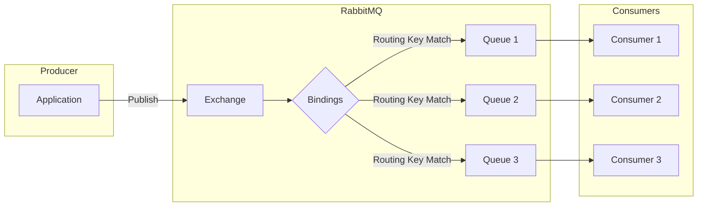
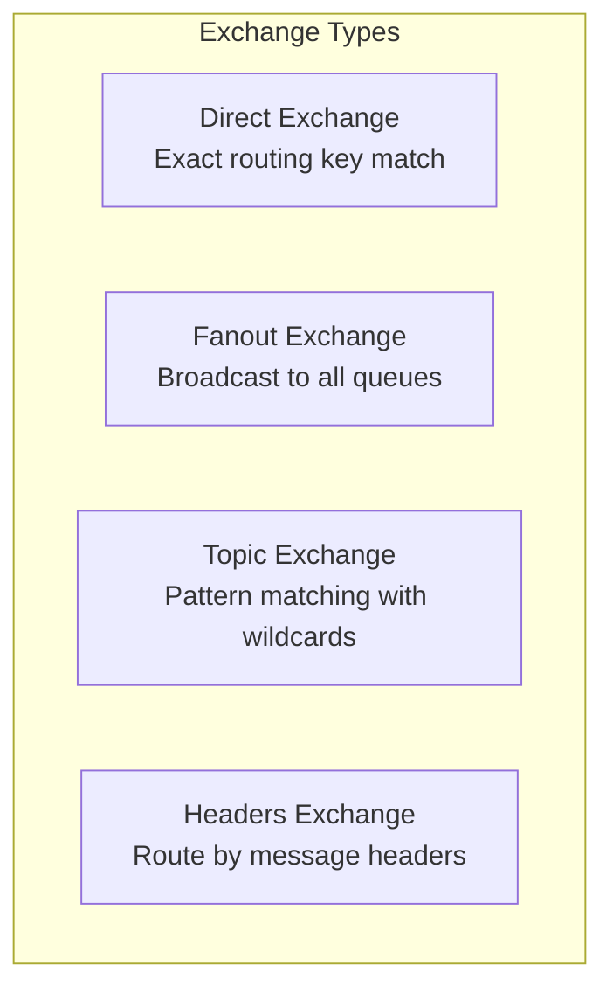
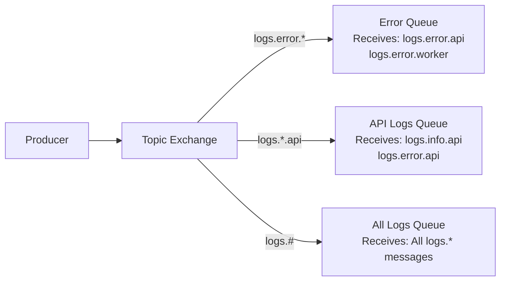
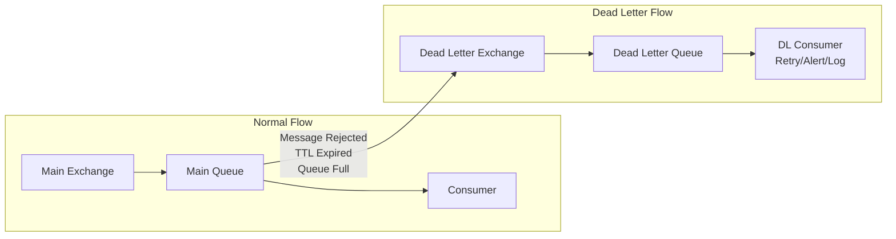
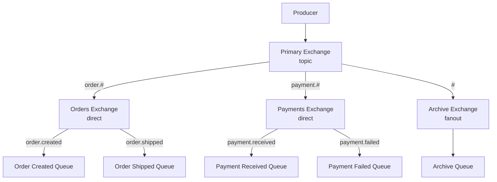

# How to Create Exchanges and Queues in RabbitMQ

Author: [nawazdhandala](https://www.github.com/nawazdhandala)

Tags: RabbitMQ, Exchanges, Queues, Messaging, Message Broker, Distributed Systems, AMQP, Event-Driven

Description: A comprehensive guide to creating and configuring exchanges and queues in RabbitMQ, covering all exchange types, queue options, bindings, and production best practices.

---

RabbitMQ is one of the most popular open-source message brokers, enabling applications to communicate asynchronously through message passing. At the heart of RabbitMQ's routing mechanism are two fundamental concepts: exchanges and queues. Understanding how to create and configure these components correctly is essential for building reliable, scalable messaging systems.

This guide walks you through everything you need to know about creating exchanges and queues in RabbitMQ, from basic concepts to advanced configurations and production best practices.

## Understanding the RabbitMQ Message Flow

Before diving into the specifics of creating exchanges and queues, let's understand how messages flow through RabbitMQ.



The flow works as follows:

1. **Producers** send messages to **exchanges** (never directly to queues)
2. **Exchanges** route messages to **queues** based on **bindings** and **routing keys**
3. **Consumers** receive messages from **queues**

This decoupling between producers and queues through exchanges provides flexibility in how messages are routed and distributed.

## Prerequisites

Before we begin, ensure you have RabbitMQ installed and running. You can run RabbitMQ using Docker:

```bash
# Run RabbitMQ with management plugin enabled
docker run -d --name rabbitmq \
  -p 5672:5672 \
  -p 15672:15672 \
  rabbitmq:3-management
```

The management UI will be available at `http://localhost:15672` (default credentials: guest/guest).

For the code examples, we will use Node.js with the amqplib library:

```bash
# Install the amqplib package
npm install amqplib
```

## Creating Exchanges

Exchanges receive messages from producers and route them to queues. RabbitMQ provides four built-in exchange types, each with different routing behavior.

### Exchange Types Overview



### Creating a Direct Exchange

Direct exchanges route messages to queues where the binding key exactly matches the routing key. This is the most straightforward exchange type.

The following code demonstrates how to create a direct exchange and bind queues to it:

```javascript
// create-direct-exchange.js
const amqp = require('amqplib');

async function createDirectExchange() {
    // Establish connection to RabbitMQ server
    const connection = await amqp.connect('amqp://localhost');

    // Create a channel for communication
    const channel = await connection.createChannel();

    // Define the exchange name
    const exchangeName = 'order.direct';

    // Create a direct exchange
    // Parameters:
    // - name: unique identifier for the exchange
    // - type: 'direct' for exact routing key matching
    // - options: configuration object
    await channel.assertExchange(exchangeName, 'direct', {
        durable: true,      // Exchange survives broker restarts
        autoDelete: false,  // Do not delete when last queue unbinds
    });

    console.log(`Direct exchange '${exchangeName}' created successfully`);

    // Create queues for different order types
    // Each queue will receive messages with specific routing keys
    const newOrderQueue = await channel.assertQueue('orders.new', {
        durable: true,  // Queue survives broker restarts
    });

    const cancelledOrderQueue = await channel.assertQueue('orders.cancelled', {
        durable: true,
    });

    const shippedOrderQueue = await channel.assertQueue('orders.shipped', {
        durable: true,
    });

    // Bind queues to the exchange with routing keys
    // Messages with routing key 'new' go to orders.new queue
    await channel.bindQueue(newOrderQueue.queue, exchangeName, 'new');
    await channel.bindQueue(cancelledOrderQueue.queue, exchangeName, 'cancelled');
    await channel.bindQueue(shippedOrderQueue.queue, exchangeName, 'shipped');

    console.log('Queues created and bound to exchange');

    // Publish a test message
    const orderMessage = {
        orderId: 'ORD-12345',
        customerId: 'CUST-789',
        items: [
            { productId: 'PROD-001', quantity: 2 },
            { productId: 'PROD-002', quantity: 1 }
        ],
        totalAmount: 149.99,
        timestamp: new Date().toISOString()
    };

    // Publish with routing key 'new' to reach the orders.new queue
    channel.publish(
        exchangeName,
        'new',  // Routing key must match binding key exactly
        Buffer.from(JSON.stringify(orderMessage)),
        {
            persistent: true,  // Message survives broker restarts
            contentType: 'application/json'
        }
    );

    console.log('Order message published to exchange');

    // Clean up connections
    await channel.close();
    await connection.close();
}

createDirectExchange().catch(console.error);
```

### Creating a Fanout Exchange

Fanout exchanges broadcast messages to all bound queues, ignoring routing keys entirely. This is useful when multiple consumers need to receive the same message.

The following code shows how to set up a fanout exchange for broadcasting events:

```javascript
// create-fanout-exchange.js
const amqp = require('amqplib');

async function createFanoutExchange() {
    const connection = await amqp.connect('amqp://localhost');
    const channel = await connection.createChannel();

    // Fanout exchanges are ideal for broadcasting events
    // to multiple services simultaneously
    const exchangeName = 'events.broadcast';

    // Create the fanout exchange
    await channel.assertExchange(exchangeName, 'fanout', {
        durable: true,
        autoDelete: false,
    });

    console.log(`Fanout exchange '${exchangeName}' created`);

    // Create queues for different services that need the events
    // Each service gets its own queue but receives all messages
    const analyticsQueue = await channel.assertQueue('analytics.events', {
        durable: true,
    });

    const auditQueue = await channel.assertQueue('audit.events', {
        durable: true,
    });

    const notificationQueue = await channel.assertQueue('notification.events', {
        durable: true,
    });

    const searchIndexQueue = await channel.assertQueue('search.index.events', {
        durable: true,
    });

    // Bind all queues to the fanout exchange
    // For fanout exchanges, the routing key is ignored
    // so we can use an empty string
    await channel.bindQueue(analyticsQueue.queue, exchangeName, '');
    await channel.bindQueue(auditQueue.queue, exchangeName, '');
    await channel.bindQueue(notificationQueue.queue, exchangeName, '');
    await channel.bindQueue(searchIndexQueue.queue, exchangeName, '');

    console.log('All service queues bound to fanout exchange');

    // Publish an event that all services will receive
    const userCreatedEvent = {
        eventType: 'user.created',
        eventId: 'EVT-' + Date.now(),
        payload: {
            userId: 'USER-456',
            email: 'newuser@example.com',
            createdAt: new Date().toISOString()
        }
    };

    // All bound queues will receive this message
    channel.publish(
        exchangeName,
        '',  // Routing key is ignored for fanout exchanges
        Buffer.from(JSON.stringify(userCreatedEvent)),
        { persistent: true }
    );

    console.log('Event broadcast to all subscribers');

    await channel.close();
    await connection.close();
}

createFanoutExchange().catch(console.error);
```

### Creating a Topic Exchange

Topic exchanges provide flexible routing using pattern matching with wildcards. Routing keys are typically dot-separated words, and bindings can use:
- `*` (asterisk) to match exactly one word
- `#` (hash) to match zero or more words

The following diagram illustrates topic exchange routing:



Here is how to create and use a topic exchange:

```javascript
// create-topic-exchange.js
const amqp = require('amqplib');

async function createTopicExchange() {
    const connection = await amqp.connect('amqp://localhost');
    const channel = await connection.createChannel();

    // Topic exchanges are powerful for complex routing scenarios
    const exchangeName = 'logs.topic';

    // Create the topic exchange
    await channel.assertExchange(exchangeName, 'topic', {
        durable: true,
        autoDelete: false,
    });

    console.log(`Topic exchange '${exchangeName}' created`);

    // Create queues with different routing needs

    // Queue for all error logs regardless of source
    const errorLogsQueue = await channel.assertQueue('logs.errors.all', {
        durable: true,
    });

    // Queue for all API-related logs
    const apiLogsQueue = await channel.assertQueue('logs.api.all', {
        durable: true,
    });

    // Queue for critical production errors only
    const criticalQueue = await channel.assertQueue('logs.critical.production', {
        durable: true,
    });

    // Queue that receives absolutely all logs for archival
    const archiveQueue = await channel.assertQueue('logs.archive.all', {
        durable: true,
        arguments: {
            'x-queue-mode': 'lazy'  // Store messages on disk for high volume
        }
    });

    // Bind queues with pattern-based routing keys

    // *.error.* matches: api.error.validation, worker.error.timeout
    // Does not match: api.error (only 2 parts) or api.error.db.connection (4 parts)
    await channel.bindQueue(errorLogsQueue.queue, exchangeName, '*.error.*');

    // api.*.* matches all logs from the API service
    await channel.bindQueue(apiLogsQueue.queue, exchangeName, 'api.*.*');

    // *.critical.production matches critical production errors from any service
    await channel.bindQueue(criticalQueue.queue, exchangeName, '*.critical.production');

    // # matches everything - all logs go to archive
    await channel.bindQueue(archiveQueue.queue, exchangeName, '#');

    console.log('Queues bound with topic patterns');

    // Publish logs with different routing keys
    const logs = [
        {
            routingKey: 'api.error.validation',
            message: { service: 'api', level: 'error', type: 'validation', msg: 'Invalid input' }
        },
        {
            routingKey: 'api.info.request',
            message: { service: 'api', level: 'info', type: 'request', msg: 'GET /users' }
        },
        {
            routingKey: 'worker.error.timeout',
            message: { service: 'worker', level: 'error', type: 'timeout', msg: 'Job timed out' }
        },
        {
            routingKey: 'api.critical.production',
            message: { service: 'api', level: 'critical', env: 'production', msg: 'Database down' }
        }
    ];

    // Publish each log message
    for (const log of logs) {
        channel.publish(
            exchangeName,
            log.routingKey,
            Buffer.from(JSON.stringify(log.message)),
            { persistent: true }
        );
        console.log(`Published log with routing key: ${log.routingKey}`);
    }

    await channel.close();
    await connection.close();
}

createTopicExchange().catch(console.error);
```

### Creating a Headers Exchange

Headers exchanges route messages based on message header attributes instead of routing keys. This provides the most flexible routing but with some performance overhead.

The following code demonstrates headers exchange creation and usage:

```javascript
// create-headers-exchange.js
const amqp = require('amqplib');

async function createHeadersExchange() {
    const connection = await amqp.connect('amqp://localhost');
    const channel = await connection.createChannel();

    // Headers exchanges route based on message attributes
    // useful for complex routing that cannot be expressed as routing keys
    const exchangeName = 'documents.headers';

    // Create the headers exchange
    await channel.assertExchange(exchangeName, 'headers', {
        durable: true,
        autoDelete: false,
    });

    console.log(`Headers exchange '${exchangeName}' created`);

    // Create queues for different document processing needs
    const pdfProcessingQueue = await channel.assertQueue('documents.pdf', {
        durable: true,
    });

    const imageProcessingQueue = await channel.assertQueue('documents.images', {
        durable: true,
    });

    const priorityQueue = await channel.assertQueue('documents.priority', {
        durable: true,
    });

    // Bind with header matching rules

    // x-match: 'all' means ALL specified headers must match
    // This queue receives PDF documents that need OCR processing
    await channel.bindQueue(pdfProcessingQueue.queue, exchangeName, '', {
        'x-match': 'all',
        'format': 'pdf',
        'requires-ocr': 'true'
    });

    // x-match: 'any' means ANY of the specified headers must match
    // This queue receives any image format
    await channel.bindQueue(imageProcessingQueue.queue, exchangeName, '', {
        'x-match': 'any',
        'format': 'jpeg',
        'format': 'png',
        'category': 'image'
    });

    // Priority queue for urgent documents
    await channel.bindQueue(priorityQueue.queue, exchangeName, '', {
        'x-match': 'all',
        'priority': 'high'
    });

    console.log('Queues bound with header matching rules');

    // Publish a PDF document that needs OCR
    const pdfDocument = {
        documentId: 'DOC-001',
        filename: 'invoice.pdf',
        uploadedBy: 'user-123'
    };

    channel.publish(
        exchangeName,
        '',  // Routing key is ignored for headers exchanges
        Buffer.from(JSON.stringify(pdfDocument)),
        {
            persistent: true,
            headers: {
                'format': 'pdf',
                'requires-ocr': 'true',
                'priority': 'normal'
            }
        }
    );

    // Publish a high-priority image
    const imageDocument = {
        documentId: 'DOC-002',
        filename: 'contract-signature.png',
        uploadedBy: 'user-456'
    };

    channel.publish(
        exchangeName,
        '',
        Buffer.from(JSON.stringify(imageDocument)),
        {
            persistent: true,
            headers: {
                'category': 'image',
                'format': 'png',
                'priority': 'high'
            }
        }
    );

    console.log('Documents published with header-based routing');

    await channel.close();
    await connection.close();
}

createHeadersExchange().catch(console.error);
```

## Creating Queues with Advanced Options

Queues store messages until consumers process them. RabbitMQ provides numerous options for configuring queue behavior.

### Queue Configuration Options

The following code demonstrates various queue configuration options:

```javascript
// create-queues-advanced.js
const amqp = require('amqplib');

async function createAdvancedQueues() {
    const connection = await amqp.connect('amqp://localhost');
    const channel = await connection.createChannel();

    // Basic durable queue
    // Survives broker restarts but stores messages in memory
    const basicQueue = await channel.assertQueue('queue.basic', {
        durable: true,
        exclusive: false,  // Can be accessed by multiple connections
        autoDelete: false  // Queue persists when consumers disconnect
    });

    console.log(`Basic queue created: ${basicQueue.queue}`);

    // Queue with message TTL (Time To Live)
    // Messages expire after the specified time
    const ttlQueue = await channel.assertQueue('queue.with.ttl', {
        durable: true,
        arguments: {
            'x-message-ttl': 300000  // Messages expire after 5 minutes (300000ms)
        }
    });

    console.log(`TTL queue created: ${ttlQueue.queue}`);

    // Queue with maximum length
    // Oldest messages are dropped when limit is reached
    const limitedQueue = await channel.assertQueue('queue.limited', {
        durable: true,
        arguments: {
            'x-max-length': 10000,           // Maximum 10000 messages
            'x-overflow': 'drop-head'        // Drop oldest messages when full
        }
    });

    console.log(`Limited queue created: ${limitedQueue.queue}`);

    // Queue with maximum size in bytes
    // Useful for controlling memory usage
    const sizeLimitedQueue = await channel.assertQueue('queue.size.limited', {
        durable: true,
        arguments: {
            'x-max-length-bytes': 104857600,  // Maximum 100MB
            'x-overflow': 'reject-publish'    // Reject new messages when full
        }
    });

    console.log(`Size-limited queue created: ${sizeLimitedQueue.queue}`);

    // Lazy queue - stores messages on disk
    // Better for large backlogs, reduces memory usage
    const lazyQueue = await channel.assertQueue('queue.lazy', {
        durable: true,
        arguments: {
            'x-queue-mode': 'lazy'
        }
    });

    console.log(`Lazy queue created: ${lazyQueue.queue}`);

    // Queue with dead letter exchange
    // Failed messages are routed to another exchange
    const dlxQueue = await channel.assertQueue('queue.with.dlx', {
        durable: true,
        arguments: {
            'x-dead-letter-exchange': 'dead.letter.exchange',
            'x-dead-letter-routing-key': 'failed'
        }
    });

    console.log(`DLX queue created: ${dlxQueue.queue}`);

    // Priority queue
    // Messages can have priorities from 0 to max-priority
    const priorityQueue = await channel.assertQueue('queue.priority', {
        durable: true,
        arguments: {
            'x-max-priority': 10  // Priority levels 0-10
        }
    });

    console.log(`Priority queue created: ${priorityQueue.queue}`);

    // Exclusive queue - used by only one connection
    // Automatically deleted when connection closes
    const exclusiveQueue = await channel.assertQueue('', {  // Empty name = server generates unique name
        exclusive: true,   // Only this connection can use it
        autoDelete: true   // Delete when connection closes
    });

    console.log(`Exclusive queue created: ${exclusiveQueue.queue}`);

    await channel.close();
    await connection.close();
}

createAdvancedQueues().catch(console.error);
```

## Setting Up Dead Letter Exchanges

Dead letter exchanges (DLX) capture messages that cannot be delivered or processed. This is essential for handling failures gracefully.



Here is a complete example of setting up a dead letter exchange:

```javascript
// setup-dead-letter-exchange.js
const amqp = require('amqplib');

async function setupDeadLetterExchange() {
    const connection = await amqp.connect('amqp://localhost');
    const channel = await connection.createChannel();

    // Step 1: Create the dead letter exchange
    // This exchange receives messages that could not be processed
    const dlxName = 'dead.letter.exchange';
    await channel.assertExchange(dlxName, 'direct', {
        durable: true
    });

    console.log('Dead letter exchange created');

    // Step 2: Create the dead letter queue
    // This queue stores failed messages for inspection or retry
    const dlqName = 'dead.letter.queue';
    const dlq = await channel.assertQueue(dlqName, {
        durable: true,
        arguments: {
            'x-message-ttl': 604800000  // Keep failed messages for 7 days
        }
    });

    // Bind the dead letter queue to the dead letter exchange
    await channel.bindQueue(dlq.queue, dlxName, 'failed');

    console.log('Dead letter queue created and bound');

    // Step 3: Create the main exchange
    const mainExchangeName = 'orders.processing';
    await channel.assertExchange(mainExchangeName, 'direct', {
        durable: true
    });

    // Step 4: Create the main queue with DLX configuration
    const mainQueue = await channel.assertQueue('orders.pending', {
        durable: true,
        arguments: {
            // Configure dead letter routing
            'x-dead-letter-exchange': dlxName,
            'x-dead-letter-routing-key': 'failed',
            // Optional: messages expire after 1 hour if not processed
            'x-message-ttl': 3600000
        }
    });

    // Bind the main queue to the main exchange
    await channel.bindQueue(mainQueue.queue, mainExchangeName, 'pending');

    console.log('Main queue created with dead letter configuration');

    // Step 5: Set up a consumer that might reject messages
    await channel.consume(mainQueue.queue, async (msg) => {
        if (!msg) return;

        try {
            const order = JSON.parse(msg.content.toString());
            console.log(`Processing order: ${order.orderId}`);

            // Simulate processing that might fail
            if (order.amount > 1000) {
                throw new Error('Amount exceeds limit');
            }

            // Acknowledge successful processing
            channel.ack(msg);
            console.log(`Order ${order.orderId} processed successfully`);

        } catch (error) {
            console.error(`Failed to process order: ${error.message}`);

            // Reject the message and do not requeue
            // This sends the message to the dead letter exchange
            channel.nack(msg, false, false);
        }
    });

    // Step 6: Set up a consumer for the dead letter queue
    await channel.consume(dlq.queue, (msg) => {
        if (!msg) return;

        const failedOrder = JSON.parse(msg.content.toString());
        const deathInfo = msg.properties.headers['x-death'];

        console.log('Failed order received in DLQ:', {
            orderId: failedOrder.orderId,
            reason: deathInfo ? deathInfo[0].reason : 'unknown',
            originalQueue: deathInfo ? deathInfo[0].queue : 'unknown',
            failedAt: deathInfo ? deathInfo[0].time : 'unknown'
        });

        // Here you could:
        // - Send an alert to the operations team
        // - Store in a database for later analysis
        // - Attempt to retry after a delay

        channel.ack(msg);
    });

    // Publish test orders
    const orders = [
        { orderId: 'ORD-001', amount: 50 },     // Will succeed
        { orderId: 'ORD-002', amount: 1500 },   // Will fail and go to DLQ
        { orderId: 'ORD-003', amount: 200 }     // Will succeed
    ];

    for (const order of orders) {
        channel.publish(
            mainExchangeName,
            'pending',
            Buffer.from(JSON.stringify(order)),
            { persistent: true }
        );
        console.log(`Published order: ${order.orderId}`);
    }

    console.log('Dead letter exchange demo running...');
    console.log('Press Ctrl+C to exit');
}

setupDeadLetterExchange().catch(console.error);
```

## Creating Bindings Between Exchanges and Queues

Bindings define the relationship between exchanges and queues. They tell the exchange which queues should receive messages based on routing criteria.

The following example demonstrates various binding scenarios:

```javascript
// create-bindings.js
const amqp = require('amqplib');

async function createBindings() {
    const connection = await amqp.connect('amqp://localhost');
    const channel = await connection.createChannel();

    // Create exchanges
    await channel.assertExchange('events.direct', 'direct', { durable: true });
    await channel.assertExchange('events.topic', 'topic', { durable: true });

    // Create queues
    const emailQueue = await channel.assertQueue('notifications.email', { durable: true });
    const smsQueue = await channel.assertQueue('notifications.sms', { durable: true });
    const allEventsQueue = await channel.assertQueue('analytics.all', { durable: true });

    // Single binding: one queue, one routing key
    await channel.bindQueue(emailQueue.queue, 'events.direct', 'email');
    console.log('Single binding created: email queue <- events.direct (key: email)');

    // Multiple bindings to same queue: queue receives messages from multiple routing keys
    await channel.bindQueue(smsQueue.queue, 'events.direct', 'sms');
    await channel.bindQueue(smsQueue.queue, 'events.direct', 'urgent');
    console.log('Multiple bindings created: sms queue <- events.direct (keys: sms, urgent)');

    // Topic binding with wildcard
    await channel.bindQueue(allEventsQueue.queue, 'events.topic', '#');
    console.log('Wildcard binding created: all events queue <- events.topic (key: #)');

    // You can also unbind if needed
    // await channel.unbindQueue(emailQueue.queue, 'events.direct', 'email');

    // List bindings (requires management plugin API)
    console.log('\nTo view all bindings, visit:');
    console.log('http://localhost:15672/#/exchanges/%2F/events.direct');

    await channel.close();
    await connection.close();
}

createBindings().catch(console.error);
```

## Exchange-to-Exchange Bindings

RabbitMQ supports binding exchanges to other exchanges, enabling hierarchical routing architectures.



Here is how to implement exchange-to-exchange bindings:

```javascript
// exchange-to-exchange-bindings.js
const amqp = require('amqplib');

async function setupExchangeHierarchy() {
    const connection = await amqp.connect('amqp://localhost');
    const channel = await connection.createChannel();

    // Create the primary exchange that receives all events
    const primaryExchange = 'events.primary';
    await channel.assertExchange(primaryExchange, 'topic', { durable: true });

    // Create domain-specific exchanges
    const ordersExchange = 'events.orders';
    const paymentsExchange = 'events.payments';
    const archiveExchange = 'events.archive';

    await channel.assertExchange(ordersExchange, 'direct', { durable: true });
    await channel.assertExchange(paymentsExchange, 'direct', { durable: true });
    await channel.assertExchange(archiveExchange, 'fanout', { durable: true });

    // Bind domain exchanges to primary exchange
    // Order-related messages flow to orders exchange
    await channel.bindExchange(ordersExchange, primaryExchange, 'order.#');

    // Payment-related messages flow to payments exchange
    await channel.bindExchange(paymentsExchange, primaryExchange, 'payment.#');

    // All messages flow to archive exchange for storage
    await channel.bindExchange(archiveExchange, primaryExchange, '#');

    console.log('Exchange hierarchy created');

    // Create queues and bind to domain exchanges
    const orderCreatedQueue = await channel.assertQueue('orders.created', { durable: true });
    const orderShippedQueue = await channel.assertQueue('orders.shipped', { durable: true });
    const paymentReceivedQueue = await channel.assertQueue('payments.received', { durable: true });
    const archiveQueue = await channel.assertQueue('events.archive.all', {
        durable: true,
        arguments: { 'x-queue-mode': 'lazy' }
    });

    // Bind queues to domain exchanges
    await channel.bindQueue(orderCreatedQueue.queue, ordersExchange, 'order.created');
    await channel.bindQueue(orderShippedQueue.queue, ordersExchange, 'order.shipped');
    await channel.bindQueue(paymentReceivedQueue.queue, paymentsExchange, 'payment.received');
    await channel.bindQueue(archiveQueue.queue, archiveExchange, '');

    console.log('Queues bound to domain exchanges');

    // Publish events to the primary exchange
    // They will flow through the hierarchy
    const orderCreatedEvent = {
        eventType: 'order.created',
        orderId: 'ORD-789',
        timestamp: new Date().toISOString()
    };

    // This message flows: primary -> orders exchange -> orders.created queue
    // Also flows: primary -> archive exchange -> archive queue
    channel.publish(
        primaryExchange,
        'order.created',
        Buffer.from(JSON.stringify(orderCreatedEvent)),
        { persistent: true }
    );

    console.log('Event published through exchange hierarchy');

    await channel.close();
    await connection.close();
}

setupExchangeHierarchy().catch(console.error);
```

## Using the RabbitMQ Management CLI

RabbitMQ provides a command-line tool for managing exchanges and queues. Here are common operations:

```bash
# List all exchanges
rabbitmqctl list_exchanges

# List all queues with message counts
rabbitmqctl list_queues name messages consumers

# Declare an exchange
rabbitmqadmin declare exchange name=my.exchange type=direct durable=true

# Declare a queue
rabbitmqadmin declare queue name=my.queue durable=true

# Create a binding
rabbitmqadmin declare binding source=my.exchange destination=my.queue routing_key=my.key

# Publish a test message
rabbitmqadmin publish exchange=my.exchange routing_key=my.key payload="Hello World"

# Get messages from a queue (without acknowledging)
rabbitmqadmin get queue=my.queue count=10

# Delete a queue
rabbitmqadmin delete queue name=my.queue

# Delete an exchange
rabbitmqadmin delete exchange name=my.exchange
```

## Production Best Practices

### 1. Always Use Durable Exchanges and Queues

For production systems, ensure your exchanges and queues survive broker restarts:

```javascript
// Production-ready exchange and queue setup
await channel.assertExchange('production.events', 'topic', {
    durable: true,      // Survives restart
    autoDelete: false,  // Does not auto-delete
    internal: false     // Can receive messages from publishers
});

await channel.assertQueue('production.orders', {
    durable: true,      // Survives restart
    exclusive: false,   // Multiple connections can use it
    autoDelete: false   // Does not auto-delete when consumers disconnect
});
```

### 2. Use Message Persistence

Mark messages as persistent so they survive broker restarts:

```javascript
channel.publish(exchangeName, routingKey, Buffer.from(message), {
    persistent: true,  // Message is written to disk
    deliveryMode: 2    // Same as persistent: true
});
```

### 3. Implement Publisher Confirms

Use publisher confirms to ensure messages reach the broker:

```javascript
// Create a confirm channel
const channel = await connection.createConfirmChannel();

// Publish and wait for confirmation
channel.publish(exchange, routingKey, message, { persistent: true }, (err) => {
    if (err) {
        console.error('Message was not confirmed:', err);
        // Implement retry logic
    } else {
        console.log('Message confirmed');
    }
});

// Or wait for all pending confirms
await channel.waitForConfirms();
```

### 4. Set Up Alternate Exchanges

Capture unroutable messages to prevent silent message loss:

```javascript
// Create an alternate exchange to catch unroutable messages
await channel.assertExchange('unroutable.messages', 'fanout', { durable: true });

// Create the main exchange with alternate exchange configured
await channel.assertExchange('main.exchange', 'direct', {
    durable: true,
    alternateExchange: 'unroutable.messages'
});
```

### 5. Configure Appropriate Queue Limits

Prevent queues from consuming all available memory:

```javascript
await channel.assertQueue('bounded.queue', {
    durable: true,
    arguments: {
        'x-max-length': 100000,              // Maximum messages
        'x-max-length-bytes': 1073741824,    // Maximum 1GB
        'x-overflow': 'reject-publish',       // Reject new messages when full
        'x-queue-mode': 'lazy'               // Store on disk to reduce memory
    }
});
```

### 6. Use Consistent Naming Conventions

Adopt a clear naming convention for exchanges and queues:

```
Exchanges: <domain>.<type>
  - orders.direct
  - events.topic
  - notifications.fanout

Queues: <service>.<function>
  - payment-service.process-orders
  - notification-service.send-emails
  - analytics-service.track-events
```

## Complete Production Example

Here is a complete example bringing together all the best practices:

```javascript
// production-setup.js
const amqp = require('amqplib');

async function setupProductionMessaging() {
    const connection = await amqp.connect('amqp://localhost');
    const channel = await connection.createConfirmChannel();

    // Dead Letter Infrastructure
    const dlxName = 'infrastructure.dead-letter';
    await channel.assertExchange(dlxName, 'fanout', { durable: true });

    const dlqName = 'infrastructure.dead-letter-queue';
    await channel.assertQueue(dlqName, {
        durable: true,
        arguments: {
            'x-message-ttl': 604800000,  // 7 days retention
            'x-queue-mode': 'lazy'
        }
    });
    await channel.bindQueue(dlqName, dlxName, '');

    // Unroutable Messages Infrastructure
    const unroutableExchange = 'infrastructure.unroutable';
    await channel.assertExchange(unroutableExchange, 'fanout', { durable: true });

    const unroutableQueue = 'infrastructure.unroutable-queue';
    await channel.assertQueue(unroutableQueue, {
        durable: true,
        arguments: {
            'x-message-ttl': 86400000  // 24 hours retention
        }
    });
    await channel.bindQueue(unroutableQueue, unroutableExchange, '');

    // Main Domain Exchange
    const domainExchange = 'domain.events';
    await channel.assertExchange(domainExchange, 'topic', {
        durable: true,
        alternateExchange: unroutableExchange
    });

    // Service Queues with Production Settings
    const orderServiceQueue = await channel.assertQueue('order-service.process', {
        durable: true,
        arguments: {
            'x-dead-letter-exchange': dlxName,
            'x-max-length': 50000,
            'x-overflow': 'reject-publish'
        }
    });
    await channel.bindQueue(orderServiceQueue.queue, domainExchange, 'order.*');

    const notificationServiceQueue = await channel.assertQueue('notification-service.send', {
        durable: true,
        arguments: {
            'x-dead-letter-exchange': dlxName,
            'x-max-length': 100000,
            'x-queue-mode': 'lazy'
        }
    });
    await channel.bindQueue(notificationServiceQueue.queue, domainExchange, 'notification.*');

    const analyticsServiceQueue = await channel.assertQueue('analytics-service.track', {
        durable: true,
        arguments: {
            'x-dead-letter-exchange': dlxName,
            'x-max-length-bytes': 536870912,  // 512MB
            'x-queue-mode': 'lazy'
        }
    });
    await channel.bindQueue(analyticsServiceQueue.queue, domainExchange, '#');  // All events

    console.log('Production messaging infrastructure created');
    console.log('Exchanges:', domainExchange, dlxName, unroutableExchange);
    console.log('Queues:', orderServiceQueue.queue, notificationServiceQueue.queue, analyticsServiceQueue.queue);

    // Example: Publish with confirms
    const event = {
        eventId: 'EVT-' + Date.now(),
        eventType: 'order.created',
        payload: { orderId: 'ORD-123' },
        timestamp: new Date().toISOString()
    };

    channel.publish(
        domainExchange,
        'order.created',
        Buffer.from(JSON.stringify(event)),
        {
            persistent: true,
            messageId: event.eventId,
            timestamp: Date.now(),
            contentType: 'application/json'
        },
        (err) => {
            if (err) {
                console.error('Publish failed:', err);
            } else {
                console.log('Event published and confirmed');
            }
        }
    );

    // Wait for confirm
    await channel.waitForConfirms();

    await channel.close();
    await connection.close();
}

setupProductionMessaging().catch(console.error);
```

## Troubleshooting Common Issues

### Exchange or Queue Already Exists with Different Properties

If you try to declare an exchange or queue with properties that differ from an existing one, RabbitMQ will return an error:

```javascript
// This will fail if 'my.queue' already exists as non-durable
try {
    await channel.assertQueue('my.queue', { durable: true });
} catch (error) {
    // PRECONDITION_FAILED - inequivalent arg 'durable' for queue 'my.queue'
    console.error('Queue exists with different properties');
}
```

Solution: Delete the existing exchange/queue or use the same properties.

### Messages Not Being Routed

If messages are not reaching queues:

1. Check binding keys match routing keys (for direct/topic exchanges)
2. Verify the exchange exists and is the correct type
3. Set up an alternate exchange to capture unroutable messages
4. Enable publisher returns to detect unroutable messages:

```javascript
channel.on('return', (msg) => {
    console.log('Message returned:', msg.fields.routingKey);
});

channel.publish(exchange, routingKey, message, { mandatory: true });
```

## Summary

Creating exchanges and queues in RabbitMQ involves understanding the different exchange types and their routing behaviors, configuring queues with appropriate durability and limits, and setting up bindings to connect them. Key takeaways:

- **Direct exchanges** route based on exact routing key matches
- **Fanout exchanges** broadcast to all bound queues
- **Topic exchanges** support pattern matching with wildcards
- **Headers exchanges** route based on message attributes

For production systems, always use durable exchanges and queues, implement dead letter exchanges for failure handling, set appropriate queue limits to prevent resource exhaustion, and use publisher confirms to ensure message delivery.

With proper configuration and best practices, RabbitMQ provides a reliable foundation for building scalable, decoupled messaging systems.
