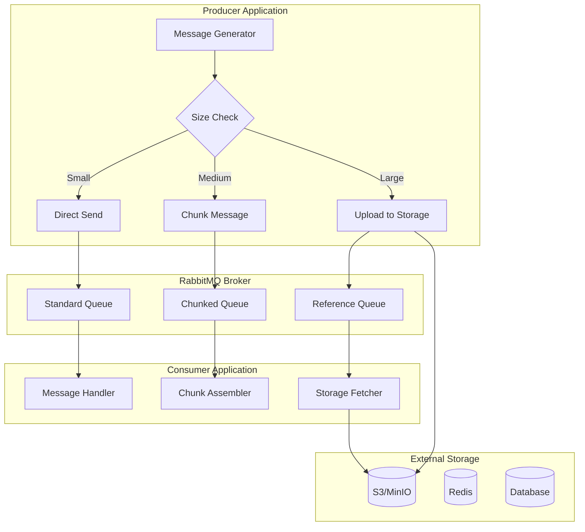
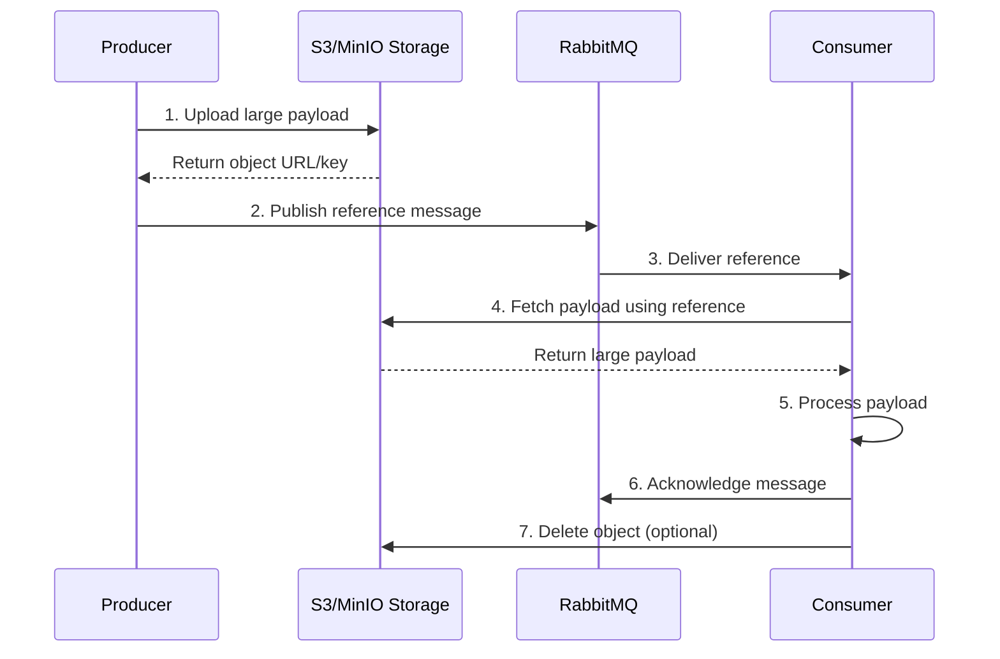
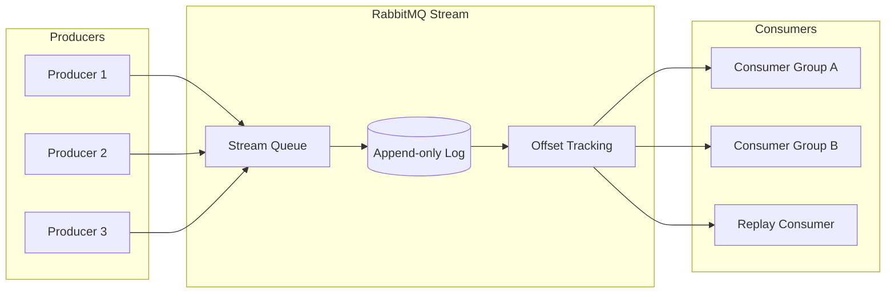
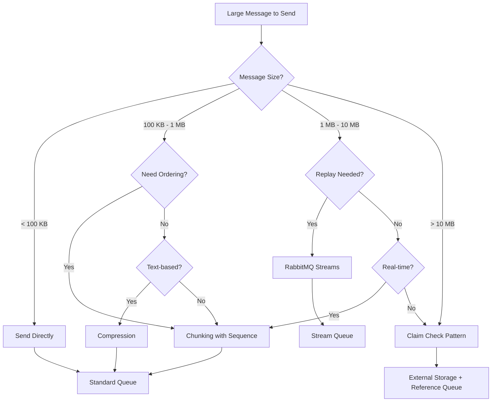

# How to Handle Large Messages in RabbitMQ

Author: [nawazdhandala](https://github.com/nawazdhandala)

Tags: RabbitMQ, Message Queue, Distributed Systems, Performance, Architecture

Description: Learn effective strategies for handling large messages in RabbitMQ, including chunking, external storage patterns, compression, and streaming approaches with practical code examples.

---

Message queues work best with small, lightweight messages. RabbitMQ performs optimally when messages are kept under a few hundred kilobytes. When you need to transfer larger payloads like files, images, or large datasets, you need specialized strategies to maintain performance and reliability.

## Why Large Messages Are Problematic

RabbitMQ stores messages in memory before persisting them to disk. Large messages consume significant memory, slow down message routing, and can cause broker instability under load.

| Message Size | Impact |
|-------------|--------|
| **< 100 KB** | Optimal performance |
| **100 KB - 1 MB** | Acceptable with tuning |
| **1 MB - 10 MB** | Requires special handling |
| **> 10 MB** | Use external storage pattern |

## Large Message Handling Architecture

The following diagram illustrates the three primary strategies for handling large messages in RabbitMQ.



## Strategy 1: Message Chunking

Chunking splits large messages into smaller pieces that RabbitMQ can handle efficiently. Each chunk includes metadata for reassembly on the consumer side. The following implementation demonstrates a complete chunking system with Node.js.

```javascript
// Message chunking implementation for RabbitMQ
// Splits large payloads into smaller chunks with reassembly metadata
const amqp = require('amqplib');
const crypto = require('crypto');

class MessageChunker {
  constructor(options = {}) {
    // Default chunk size of 64KB works well for most RabbitMQ deployments
    this.chunkSize = options.chunkSize || 64 * 1024;
    this.connection = null;
    this.channel = null;
  }

  async connect(url) {
    this.connection = await amqp.connect(url);
    this.channel = await this.connection.createChannel();

    // Enable publisher confirms for reliable delivery
    await this.channel.confirmChannel();
  }

  // Generate unique message ID for chunk correlation
  generateMessageId() {
    return crypto.randomUUID();
  }

  // Split payload into chunks with metadata headers
  createChunks(payload, messageId) {
    const buffer = Buffer.isBuffer(payload)
      ? payload
      : Buffer.from(JSON.stringify(payload));

    const totalChunks = Math.ceil(buffer.length / this.chunkSize);
    const chunks = [];

    // Calculate checksum for integrity verification
    const checksum = crypto
      .createHash('sha256')
      .update(buffer)
      .digest('hex');

    for (let i = 0; i < totalChunks; i++) {
      const start = i * this.chunkSize;
      const end = Math.min(start + this.chunkSize, buffer.length);
      const chunkData = buffer.slice(start, end);

      chunks.push({
        data: chunkData,
        headers: {
          'x-message-id': messageId,
          'x-chunk-index': i,
          'x-total-chunks': totalChunks,
          'x-total-size': buffer.length,
          'x-checksum': checksum,
          'x-chunk-size': chunkData.length,
        },
      });
    }

    return chunks;
  }

  // Publish all chunks with ordering guarantees
  async publishChunked(queue, payload, options = {}) {
    const messageId = this.generateMessageId();
    const chunks = this.createChunks(payload, messageId);

    console.log(
      `Splitting message ${messageId} into ${chunks.length} chunks ` +
      `(total size: ${chunks.reduce((sum, c) => sum + c.data.length, 0)} bytes)`
    );

    // Publish chunks sequentially to maintain order
    for (const chunk of chunks) {
      await this.channel.sendToQueue(queue, chunk.data, {
        persistent: true,
        headers: chunk.headers,
        ...options,
      });
    }

    return messageId;
  }
}

// Usage example
async function sendLargeFile() {
  const chunker = new MessageChunker({ chunkSize: 64 * 1024 });
  await chunker.connect('amqp://localhost');

  const largePayload = {
    type: 'report',
    data: Buffer.alloc(5 * 1024 * 1024).fill('x'), // 5MB payload
    timestamp: Date.now(),
  };

  const messageId = await chunker.publishChunked('large-messages', largePayload);
  console.log(`Published large message with ID: ${messageId}`);
}
```

The consumer needs to reassemble chunks before processing. The following implementation buffers incoming chunks and reconstructs the original message once all pieces arrive.

```javascript
// Chunk reassembly consumer for RabbitMQ
// Buffers chunks in memory and reconstructs original messages
class ChunkAssembler {
  constructor(options = {}) {
    // Timeout incomplete messages after 5 minutes by default
    this.assemblyTimeout = options.assemblyTimeout || 5 * 60 * 1000;
    this.pendingMessages = new Map();
    this.connection = null;
    this.channel = null;
  }

  async connect(url) {
    this.connection = await amqp.connect(url);
    this.channel = await this.connection.createChannel();

    // Prefetch limit prevents memory exhaustion from too many pending chunks
    await this.channel.prefetch(100);
  }

  async consume(queue, onComplete) {
    await this.channel.assertQueue(queue, { durable: true });

    this.channel.consume(queue, async (msg) => {
      if (!msg) return;

      const headers = msg.properties.headers;
      const messageId = headers['x-message-id'];
      const chunkIndex = headers['x-chunk-index'];
      const totalChunks = headers['x-total-chunks'];
      const totalSize = headers['x-total-size'];
      const checksum = headers['x-checksum'];

      // Initialize storage for new message
      if (!this.pendingMessages.has(messageId)) {
        this.pendingMessages.set(messageId, {
          chunks: new Array(totalChunks).fill(null),
          receivedCount: 0,
          totalSize,
          checksum,
          createdAt: Date.now(),
          deliveryTags: [],
        });

        // Set timeout for incomplete messages
        setTimeout(() => {
          this.handleTimeout(messageId);
        }, this.assemblyTimeout);
      }

      const pending = this.pendingMessages.get(messageId);

      // Store chunk and track delivery tag for acknowledgment
      if (pending.chunks[chunkIndex] === null) {
        pending.chunks[chunkIndex] = msg.content;
        pending.receivedCount++;
        pending.deliveryTags.push(msg.fields.deliveryTag);
      }

      console.log(
        `Received chunk ${chunkIndex + 1}/${totalChunks} ` +
        `for message ${messageId}`
      );

      // Check if all chunks received
      if (pending.receivedCount === totalChunks) {
        try {
          const assembled = this.assembleMessage(messageId);

          // Verify integrity with checksum
          const actualChecksum = crypto
            .createHash('sha256')
            .update(assembled)
            .digest('hex');

          if (actualChecksum !== pending.checksum) {
            throw new Error('Checksum mismatch - message corrupted');
          }

          // Parse JSON payload
          const payload = JSON.parse(assembled.toString());

          // Call completion handler
          await onComplete(payload, messageId);

          // Acknowledge all chunks
          for (const tag of pending.deliveryTags) {
            this.channel.ack({ fields: { deliveryTag: tag } });
          }

          this.pendingMessages.delete(messageId);
          console.log(`Successfully assembled message ${messageId}`);

        } catch (error) {
          console.error(`Failed to assemble message ${messageId}:`, error);

          // Reject all chunks for redelivery
          for (const tag of pending.deliveryTags) {
            this.channel.nack(
              { fields: { deliveryTag: tag } },
              false,
              true
            );
          }
        }
      }
    });
  }

  assembleMessage(messageId) {
    const pending = this.pendingMessages.get(messageId);
    return Buffer.concat(pending.chunks);
  }

  handleTimeout(messageId) {
    const pending = this.pendingMessages.get(messageId);
    if (!pending) return;

    console.error(
      `Message ${messageId} assembly timeout - ` +
      `received ${pending.receivedCount}/${pending.chunks.length} chunks`
    );

    // Reject received chunks
    for (const tag of pending.deliveryTags) {
      this.channel.nack({ fields: { deliveryTag: tag } }, false, false);
    }

    this.pendingMessages.delete(messageId);
  }
}

// Usage
async function consumeLargeMessages() {
  const assembler = new ChunkAssembler();
  await assembler.connect('amqp://localhost');

  await assembler.consume('large-messages', async (payload, messageId) => {
    console.log(`Processing complete message ${messageId}`);
    console.log(`Payload type: ${payload.type}`);
    console.log(`Data size: ${payload.data.length} bytes`);
  });
}
```

## Strategy 2: External Storage Pattern (Claim Check)

For very large payloads, the claim check pattern stores the actual data in external storage and sends only a reference through RabbitMQ. The following diagram shows the message flow.



The following Python implementation demonstrates the claim check pattern using MinIO as the external storage layer.

```python
# Claim check pattern implementation using MinIO for external storage
# Stores large payloads externally and sends references through RabbitMQ

import json
import uuid
import hashlib
from datetime import datetime, timedelta
from minio import Minio
import pika

class ClaimCheckPublisher:
    """
    Publishes large messages using the claim check pattern.
    Payloads above threshold are uploaded to MinIO with
    only a reference sent through RabbitMQ.
    """

    def __init__(self, rabbitmq_url, minio_config, options=None):
        options = options or {}

        # Threshold for using external storage (default 100KB)
        self.size_threshold = options.get('size_threshold', 100 * 1024)
        self.bucket_name = options.get('bucket', 'message-payloads')

        # Initialize MinIO client for object storage
        self.minio = Minio(
            minio_config['endpoint'],
            access_key=minio_config['access_key'],
            secret_key=minio_config['secret_key'],
            secure=minio_config.get('secure', False)
        )

        # Ensure bucket exists
        if not self.minio.bucket_exists(self.bucket_name):
            self.minio.make_bucket(self.bucket_name)

        # Initialize RabbitMQ connection
        self.connection = pika.BlockingConnection(
            pika.URLParameters(rabbitmq_url)
        )
        self.channel = self.connection.channel()
        self.channel.confirm_delivery()

    def publish(self, queue, payload, options=None):
        """
        Publish message, automatically using claim check for large payloads.
        Returns the message ID for tracking.
        """
        options = options or {}
        message_id = str(uuid.uuid4())

        # Serialize payload to check size
        payload_bytes = json.dumps(payload).encode('utf-8')
        payload_size = len(payload_bytes)

        if payload_size > self.size_threshold:
            # Large payload - use claim check pattern
            return self._publish_with_claim_check(
                queue, payload_bytes, message_id, options
            )
        else:
            # Small payload - send directly
            return self._publish_direct(
                queue, payload_bytes, message_id, options
            )

    def _publish_with_claim_check(self, queue, payload_bytes, message_id, options):
        """Upload payload to MinIO and publish reference to RabbitMQ."""

        # Generate unique object key with date partitioning
        date_prefix = datetime.utcnow().strftime('%Y/%m/%d')
        object_key = f"{date_prefix}/{message_id}"

        # Calculate checksum for integrity verification
        checksum = hashlib.sha256(payload_bytes).hexdigest()

        # Upload to MinIO with metadata
        from io import BytesIO
        self.minio.put_object(
            self.bucket_name,
            object_key,
            BytesIO(payload_bytes),
            length=len(payload_bytes),
            metadata={
                'message-id': message_id,
                'checksum': checksum,
                'created-at': datetime.utcnow().isoformat()
            }
        )

        # Create claim check reference message
        reference = {
            'type': 'claim_check',
            'storage': 'minio',
            'bucket': self.bucket_name,
            'key': object_key,
            'size': len(payload_bytes),
            'checksum': checksum,
            'created_at': datetime.utcnow().isoformat()
        }

        # Publish reference to RabbitMQ
        self.channel.queue_declare(queue=queue, durable=True)
        self.channel.basic_publish(
            exchange='',
            routing_key=queue,
            body=json.dumps(reference),
            properties=pika.BasicProperties(
                delivery_mode=2,  # Persistent
                message_id=message_id,
                headers={
                    'x-claim-check': 'true',
                    'x-payload-size': len(payload_bytes)
                },
                expiration=str(options.get('ttl', 86400000))  # 24h default
            )
        )

        print(f"Published claim check for message {message_id} "
              f"(payload: {len(payload_bytes)} bytes)")

        return message_id

    def _publish_direct(self, queue, payload_bytes, message_id, options):
        """Publish small payload directly to RabbitMQ."""

        self.channel.queue_declare(queue=queue, durable=True)
        self.channel.basic_publish(
            exchange='',
            routing_key=queue,
            body=payload_bytes,
            properties=pika.BasicProperties(
                delivery_mode=2,
                message_id=message_id,
                headers={'x-claim-check': 'false'}
            )
        )

        print(f"Published direct message {message_id} "
              f"({len(payload_bytes)} bytes)")

        return message_id


class ClaimCheckConsumer:
    """
    Consumes messages with claim check pattern support.
    Automatically fetches payloads from external storage when needed.
    """

    def __init__(self, rabbitmq_url, minio_config):
        self.minio = Minio(
            minio_config['endpoint'],
            access_key=minio_config['access_key'],
            secret_key=minio_config['secret_key'],
            secure=minio_config.get('secure', False)
        )

        self.connection = pika.BlockingConnection(
            pika.URLParameters(rabbitmq_url)
        )
        self.channel = self.connection.channel()
        self.channel.basic_qos(prefetch_count=10)

    def consume(self, queue, handler, auto_delete_payload=True):
        """
        Start consuming messages from queue.
        Handler receives the resolved payload regardless of storage method.
        """

        def callback(ch, method, properties, body):
            message_id = properties.message_id
            is_claim_check = properties.headers.get('x-claim-check') == 'true'

            try:
                if is_claim_check:
                    # Fetch payload from external storage
                    payload = self._fetch_claim_check(body)
                else:
                    # Parse direct payload
                    payload = json.loads(body)

                # Call user handler with resolved payload
                handler(payload, message_id)

                # Acknowledge successful processing
                ch.basic_ack(delivery_tag=method.delivery_tag)

                # Optionally delete external payload after processing
                if is_claim_check and auto_delete_payload:
                    self._delete_claim_check(body)

            except Exception as e:
                print(f"Error processing message {message_id}: {e}")
                # Requeue message for retry
                ch.basic_nack(
                    delivery_tag=method.delivery_tag,
                    requeue=True
                )

        self.channel.queue_declare(queue=queue, durable=True)
        self.channel.basic_consume(queue=queue, on_message_callback=callback)

        print(f"Consuming from queue: {queue}")
        self.channel.start_consuming()

    def _fetch_claim_check(self, reference_body):
        """Retrieve payload from MinIO using claim check reference."""

        reference = json.loads(reference_body)

        # Download object from MinIO
        response = self.minio.get_object(
            reference['bucket'],
            reference['key']
        )

        payload_bytes = response.read()
        response.close()

        # Verify checksum
        actual_checksum = hashlib.sha256(payload_bytes).hexdigest()
        if actual_checksum != reference['checksum']:
            raise ValueError("Payload checksum mismatch - data corrupted")

        return json.loads(payload_bytes)

    def _delete_claim_check(self, reference_body):
        """Remove payload from MinIO after successful processing."""

        reference = json.loads(reference_body)
        self.minio.remove_object(reference['bucket'], reference['key'])
        print(f"Deleted claim check payload: {reference['key']}")


# Usage example
if __name__ == '__main__':
    minio_config = {
        'endpoint': 'localhost:9000',
        'access_key': 'minioadmin',
        'secret_key': 'minioadmin',
        'secure': False
    }

    # Publish large payload
    publisher = ClaimCheckPublisher(
        'amqp://localhost',
        minio_config,
        {'size_threshold': 50 * 1024}  # 50KB threshold
    )

    large_payload = {
        'report_type': 'analytics',
        'data': ['x' * 1000 for _ in range(1000)],  # ~1MB payload
        'generated_at': datetime.utcnow().isoformat()
    }

    message_id = publisher.publish('reports', large_payload)
```

## Strategy 3: Compression

Compression can significantly reduce message sizes for text-based payloads. The following implementation demonstrates transparent compression with automatic decompression on the consumer side.

```javascript
// Transparent compression layer for RabbitMQ messages
// Automatically compresses large payloads and adds metadata headers

const zlib = require('zlib');
const amqp = require('amqplib');

class CompressedPublisher {
  constructor(options = {}) {
    // Only compress messages larger than threshold
    this.compressionThreshold = options.compressionThreshold || 1024;
    // Compression level: 1 (fastest) to 9 (best compression)
    this.compressionLevel = options.compressionLevel || 6;
    this.connection = null;
    this.channel = null;
  }

  async connect(url) {
    this.connection = await amqp.connect(url);
    this.channel = await this.connection.createChannel();
  }

  async publish(queue, payload, options = {}) {
    let body = Buffer.from(JSON.stringify(payload));
    const originalSize = body.length;
    let compressed = false;

    // Compress if payload exceeds threshold
    if (body.length > this.compressionThreshold) {
      body = await this.compress(body);
      compressed = true;

      const ratio = ((1 - body.length / originalSize) * 100).toFixed(1);
      console.log(
        `Compressed ${originalSize} -> ${body.length} bytes (${ratio}% reduction)`
      );
    }

    await this.channel.assertQueue(queue, { durable: true });

    return this.channel.sendToQueue(queue, body, {
      persistent: true,
      headers: {
        'x-compressed': compressed,
        'x-compression-algorithm': compressed ? 'gzip' : 'none',
        'x-original-size': originalSize,
        ...options.headers,
      },
      ...options,
    });
  }

  compress(buffer) {
    return new Promise((resolve, reject) => {
      zlib.gzip(buffer, { level: this.compressionLevel }, (err, result) => {
        if (err) reject(err);
        else resolve(result);
      });
    });
  }

  async close() {
    await this.channel.close();
    await this.connection.close();
  }
}

class CompressedConsumer {
  constructor() {
    this.connection = null;
    this.channel = null;
  }

  async connect(url) {
    this.connection = await amqp.connect(url);
    this.channel = await this.connection.createChannel();
    await this.channel.prefetch(10);
  }

  async consume(queue, handler) {
    await this.channel.assertQueue(queue, { durable: true });

    this.channel.consume(queue, async (msg) => {
      if (!msg) return;

      try {
        const headers = msg.properties.headers;
        const isCompressed = headers['x-compressed'];

        let body = msg.content;

        // Decompress if needed
        if (isCompressed) {
          body = await this.decompress(body);
          console.log(
            `Decompressed ${msg.content.length} -> ${body.length} bytes`
          );
        }

        const payload = JSON.parse(body.toString());

        await handler(payload, msg);
        this.channel.ack(msg);

      } catch (error) {
        console.error('Error processing message:', error);
        this.channel.nack(msg, false, true);
      }
    });
  }

  decompress(buffer) {
    return new Promise((resolve, reject) => {
      zlib.gunzip(buffer, (err, result) => {
        if (err) reject(err);
        else resolve(result);
      });
    });
  }
}

// Usage
async function main() {
  const publisher = new CompressedPublisher({
    compressionThreshold: 512,
    compressionLevel: 6,
  });

  await publisher.connect('amqp://localhost');

  // Text-heavy payloads compress well
  const logPayload = {
    type: 'logs',
    entries: Array(1000).fill({
      timestamp: new Date().toISOString(),
      level: 'INFO',
      message: 'Application started successfully',
      metadata: { service: 'api', version: '1.0.0' },
    }),
  };

  await publisher.publish('logs', logPayload);
  await publisher.close();
}
```

## Strategy 4: Streaming with RabbitMQ Streams

RabbitMQ 3.9+ includes native stream support optimized for high-throughput scenarios. Streams store messages on disk efficiently and support consumer replay from any offset.



The following configuration demonstrates RabbitMQ stream setup with appropriate policies for large message handling.

```yaml
# RabbitMQ stream configuration for large message handling
# Place in rabbitmq.conf or configure via management API

# Enable stream plugin
# rabbitmq-plugins enable rabbitmq_stream

# Stream-specific settings
stream.initial_segment_size = 500MB
stream.max_segment_size_bytes = 500MB

# Memory threshold before flowing to disk
vm_memory_high_watermark.relative = 0.6

# Disk free space alarm threshold
disk_free_limit.absolute = 2GB

---
# Policy for large message streams (apply via CLI or management UI)
# rabbitmqctl set_policy large-streams "^large\." \
#   '{"max-length-bytes": 10737418240, "stream-max-segment-size-bytes": 536870912}' \
#   --apply-to streams
```

The following Go implementation shows how to publish and consume from RabbitMQ streams using the native stream protocol.

```go
// RabbitMQ stream producer and consumer in Go
// Uses the native stream protocol for efficient large message handling

package main

import (
	"context"
	"fmt"
	"log"
	"time"

	"github.com/rabbitmq/rabbitmq-stream-go-client/pkg/amqp"
	"github.com/rabbitmq/rabbitmq-stream-go-client/pkg/stream"
)

// StreamProducer handles publishing to RabbitMQ streams
// with batching and compression for large payloads
type StreamProducer struct {
	env      *stream.Environment
	producer *stream.Producer
	stream   string
}

// NewStreamProducer creates a producer with optimized settings
// for large message throughput
func NewStreamProducer(streamName string) (*StreamProducer, error) {
	// Connect to RabbitMQ stream endpoint
	env, err := stream.NewEnvironment(
		stream.NewEnvironmentOptions().
			SetHost("localhost").
			SetPort(5552). // Stream port, not AMQP
			SetUser("guest").
			SetPassword("guest").
			SetMaxProducersPerClient(10),
	)
	if err != nil {
		return nil, fmt.Errorf("failed to create environment: %w", err)
	}

	// Create stream if not exists with retention policy
	err = env.DeclareStream(streamName,
		stream.NewStreamOptions().
			SetMaxLengthBytes(stream.ByteCapacity{}.GB(10)).
			SetMaxSegmentSizeBytes(stream.ByteCapacity{}.MB(500)),
	)
	if err != nil && err != stream.StreamAlreadyExists {
		return nil, fmt.Errorf("failed to declare stream: %w", err)
	}

	// Create producer with batching for efficiency
	producer, err := env.NewProducer(streamName,
		stream.NewProducerOptions().
			SetBatchSize(100).
			SetBatchPublishingDelay(50), // 50ms batching delay
	)
	if err != nil {
		return nil, fmt.Errorf("failed to create producer: %w", err)
	}

	return &StreamProducer{
		env:      env,
		producer: producer,
		stream:   streamName,
	}, nil
}

// Publish sends a message to the stream with optional compression
func (p *StreamProducer) Publish(data []byte) error {
	msg := amqp.NewMessage(data)

	// Add timestamp for offset-based replay
	msg.ApplicationProperties = map[string]interface{}{
		"timestamp": time.Now().UnixNano(),
		"size":      len(data),
	}

	return p.producer.Send(msg)
}

// PublishBatch sends multiple messages efficiently
func (p *StreamProducer) PublishBatch(messages [][]byte) error {
	batch := make([]*amqp.Message, len(messages))

	for i, data := range messages {
		msg := amqp.NewMessage(data)
		msg.ApplicationProperties = map[string]interface{}{
			"timestamp": time.Now().UnixNano(),
			"size":      len(data),
		}
		batch[i] = msg
	}

	// Send batch atomically
	for _, msg := range batch {
		if err := p.producer.Send(msg); err != nil {
			return err
		}
	}

	return nil
}

func (p *StreamProducer) Close() error {
	if err := p.producer.Close(); err != nil {
		return err
	}
	return p.env.Close()
}

// StreamConsumer handles consuming from RabbitMQ streams
// with offset tracking for reliable message processing
type StreamConsumer struct {
	env      *stream.Environment
	consumer *stream.Consumer
	stream   string
}

// NewStreamConsumer creates a consumer with configurable offset
func NewStreamConsumer(streamName string, offsetSpec stream.OffsetSpecification) (*StreamConsumer, error) {
	env, err := stream.NewEnvironment(
		stream.NewEnvironmentOptions().
			SetHost("localhost").
			SetPort(5552).
			SetUser("guest").
			SetPassword("guest"),
	)
	if err != nil {
		return nil, fmt.Errorf("failed to create environment: %w", err)
	}

	sc := &StreamConsumer{
		env:    env,
		stream: streamName,
	}

	return sc, nil
}

// Consume starts processing messages from the stream
func (c *StreamConsumer) Consume(
	ctx context.Context,
	handler func(message *amqp.Message, offset int64) error,
	offsetSpec stream.OffsetSpecification,
) error {
	consumer, err := c.env.NewConsumer(c.stream,
		func(consumerContext stream.ConsumerContext, message *amqp.Message) {
			offset := consumerContext.Consumer.GetOffset()

			if err := handler(message, offset); err != nil {
				log.Printf("Error processing message at offset %d: %v", offset, err)
				return
			}

			// Store offset for resumption after restart
			consumerContext.Consumer.StoreOffset()
		},
		stream.NewConsumerOptions().
			SetOffset(offsetSpec).
			SetConsumerName("large-message-consumer").
			SetAutoCommit(stream.NewAutoCommitStrategy().
				SetCountBeforeStorage(100).
				SetFlushInterval(5*time.Second)),
	)
	if err != nil {
		return fmt.Errorf("failed to create consumer: %w", err)
	}

	c.consumer = consumer

	// Wait for context cancellation
	<-ctx.Done()
	return nil
}

func (c *StreamConsumer) Close() error {
	if c.consumer != nil {
		if err := c.consumer.Close(); err != nil {
			return err
		}
	}
	return c.env.Close()
}

func main() {
	streamName := "large-messages"

	// Create producer
	producer, err := NewStreamProducer(streamName)
	if err != nil {
		log.Fatal(err)
	}
	defer producer.Close()

	// Publish large messages
	for i := 0; i < 100; i++ {
		// Simulate large payload (1MB each)
		data := make([]byte, 1024*1024)
		for j := range data {
			data[j] = byte(i)
		}

		if err := producer.Publish(data); err != nil {
			log.Printf("Failed to publish message %d: %v", i, err)
		}
	}

	log.Println("Published 100 large messages")

	// Create consumer starting from beginning
	consumer, err := NewStreamConsumer(streamName, stream.OffsetSpecification{}.First())
	if err != nil {
		log.Fatal(err)
	}
	defer consumer.Close()

	ctx, cancel := context.WithTimeout(context.Background(), 30*time.Second)
	defer cancel()

	err = consumer.Consume(ctx, func(msg *amqp.Message, offset int64) error {
		log.Printf("Received message at offset %d, size: %d bytes",
			offset, len(msg.GetData()))
		return nil
	}, stream.OffsetSpecification{}.First())

	if err != nil {
		log.Fatal(err)
	}
}
```

## RabbitMQ Configuration for Large Messages

Proper broker configuration is essential when handling large messages. The following settings optimize RabbitMQ for larger payload handling.

```ini
# /etc/rabbitmq/rabbitmq.conf
# Configuration optimized for large message handling

# Increase frame size limit (default 128KB)
# Maximum size of AMQP frame body
frame_max = 1048576

# Memory management
# Higher threshold allows more messages in memory before paging
vm_memory_high_watermark.relative = 0.7
vm_memory_high_watermark_paging_ratio = 0.8

# Disk management
# Ensure sufficient disk space for large message persistence
disk_free_limit.absolute = 5GB

# Connection and channel settings
# Increase heartbeat to prevent timeouts during large transfers
heartbeat = 60

# Consumer prefetch - lower values for large messages
# Prevents consumers from buffering too many large messages
consumer_timeout = 1800000

# Queue settings for large messages
# Enable lazy queues by default for memory efficiency
queue_master_locator = min-masters

# Message store settings
# Larger credit flow for sustained throughput
credit_flow_default_credit.head = 400
credit_flow_default_credit.tail = 200
```

Apply queue policies for large message queues to use lazy mode, which keeps messages on disk rather than in memory.

```bash
#!/bin/bash
# Configure RabbitMQ policies for large message handling

# Create policy for large message queues
# Lazy mode stores messages on disk, reducing memory pressure
rabbitmqctl set_policy large-messages \
  "^large\." \
  '{"queue-mode": "lazy", "message-ttl": 86400000}' \
  --priority 10 \
  --apply-to queues

# Create policy for chunked message queues
# Higher max-length to accommodate all chunks
rabbitmqctl set_policy chunked-messages \
  "^chunked\." \
  '{"queue-mode": "lazy", "max-length": 100000, "overflow": "reject-publish"}' \
  --priority 10 \
  --apply-to queues

# Verify policies
rabbitmqctl list_policies
```

## Decision Matrix: Choosing the Right Strategy

The following diagram helps determine which strategy to use based on your requirements.



| Strategy | Best For | Pros | Cons |
|----------|----------|------|------|
| **Chunking** | 100KB - 10MB payloads | Works with standard queues | Complex reassembly logic |
| **Claim Check** | > 10MB payloads | Unlimited size | External dependency |
| **Compression** | Text-heavy data | Simple implementation | CPU overhead |
| **Streams** | High throughput, replay | Native support, efficient | Requires RabbitMQ 3.9+ |

## Monitoring Large Message Queues

Monitoring queue depth, memory usage, and message rates helps identify issues before they cause problems. The following Prometheus metrics and alerts provide visibility into large message handling.

```yaml
# Prometheus alerting rules for large message queues
# Place in prometheus/rules/rabbitmq-large-messages.yml

groups:
  - name: rabbitmq-large-messages
    interval: 30s
    rules:
      # Alert when queue memory usage is high
      - alert: RabbitMQQueueMemoryHigh
        expr: |
          rabbitmq_queue_memory_bytes{queue=~"large.*|chunked.*"} > 1073741824
        for: 5m
        labels:
          severity: warning
        annotations:
          summary: "Queue {{ $labels.queue }} using excessive memory"
          description: "Queue memory usage is {{ $value | humanize1024 }}"

      # Alert on message accumulation
      - alert: RabbitMQLargeQueueBacklog
        expr: |
          rabbitmq_queue_messages{queue=~"large.*"} > 1000
        for: 10m
        labels:
          severity: warning
        annotations:
          summary: "Large message queue backlog on {{ $labels.queue }}"
          description: "{{ $value }} messages waiting"

      # Alert on chunk assembly failures
      - alert: RabbitMQChunkAssemblyFailures
        expr: |
          rate(chunk_assembly_failures_total[5m]) > 0.1
        for: 5m
        labels:
          severity: critical
        annotations:
          summary: "Chunk assembly failures detected"
          description: "{{ $value }} failures per second"

      # Alert on claim check storage failures
      - alert: RabbitMQClaimCheckStorageError
        expr: |
          rate(claim_check_storage_errors_total[5m]) > 0
        for: 2m
        labels:
          severity: critical
        annotations:
          summary: "Claim check storage errors"
          description: "External storage operations failing"
```

## Summary

Handling large messages in RabbitMQ requires choosing the right strategy based on message size, ordering requirements, and infrastructure constraints.

| Message Size | Recommended Strategy |
|-------------|---------------------|
| < 100 KB | Direct publishing |
| 100 KB - 1 MB | Compression or chunking |
| 1 MB - 10 MB | Chunking with lazy queues |
| > 10 MB | Claim check with external storage |
| High throughput with replay | RabbitMQ Streams |

Key takeaways for production deployments:

- Always use lazy queues for large message workloads to reduce memory pressure
- Implement checksums for integrity verification across chunking and claim check patterns
- Set appropriate prefetch counts to prevent consumer memory exhaustion
- Monitor queue memory and disk usage to catch issues early
- Consider compression for text-heavy payloads before using more complex strategies

Proper large message handling keeps your RabbitMQ cluster healthy while enabling use cases that require transferring substantial payloads through your message infrastructure.
