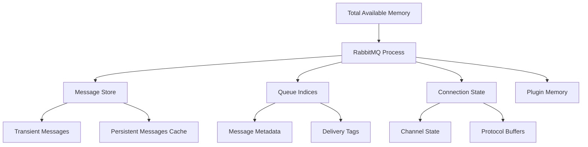
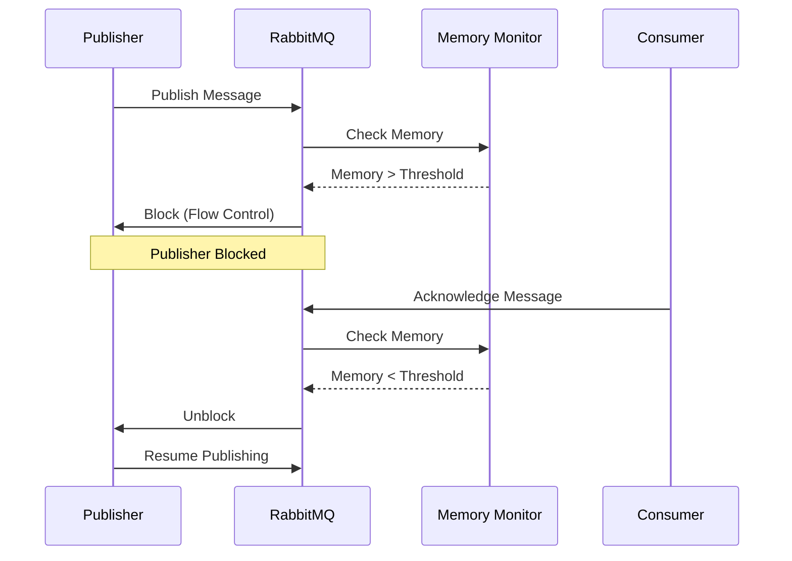
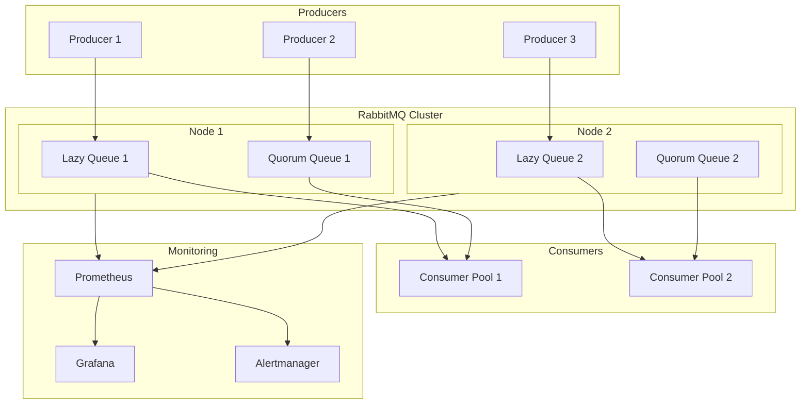

# How to Handle RabbitMQ Memory Issues

Author: [nawazdhandala](https://www.github.com/nawazdhandala)

Tags: RabbitMQ, Memory Management, Performance, Monitoring, Message Queues

Description: Learn how to diagnose, resolve, and prevent memory issues in RabbitMQ for optimal message broker performance.

RabbitMQ is a powerful message broker, but memory issues can severely impact its performance and reliability. When RabbitMQ runs low on memory, it triggers flow control mechanisms that block publishers, leading to application bottlenecks and potential message loss. Understanding how to diagnose, resolve, and prevent memory issues is essential for maintaining a healthy messaging infrastructure.

## Understanding RabbitMQ Memory Architecture

RabbitMQ stores messages in memory before writing them to disk (for persistent messages) or delivering them to consumers. Memory usage depends on several factors including queue depth, message size, connection count, and internal metadata.

The following diagram illustrates how memory is allocated in RabbitMQ:



## Common Causes of Memory Issues

Several factors contribute to high memory usage in RabbitMQ:

1. **Message Accumulation** - Consumers cannot keep up with producers, causing queues to grow
2. **Large Message Payloads** - Messages with large bodies consume significant memory
3. **Too Many Connections** - Each connection and channel requires memory overhead
4. **Lazy Queue Misconfiguration** - Not using lazy queues for appropriate workloads
5. **Memory Watermark Settings** - Improper threshold configuration

## Diagnosing Memory Issues

### Checking Current Memory Status

The following command queries RabbitMQ for detailed memory breakdown, showing allocation per category:

```bash
# Get detailed memory breakdown from RabbitMQ
rabbitmqctl status | grep -A 50 "Memory"

# Alternative: Get memory in a more readable format
rabbitmqctl eval 'rabbit_vm:memory().'
```

### Using the Management API

The REST API provides programmatic access to memory statistics for monitoring and alerting systems:

```bash
# Query memory statistics via the management API
curl -u guest:guest http://localhost:15672/api/nodes/rabbit@hostname | jq '.mem_used, .mem_limit, .mem_alarm'
```

### Identifying Memory-Hungry Queues

Large queues often cause memory pressure. The following script identifies queues sorted by their message count:

```bash
# List all queues sorted by message count to find memory-hungry queues
rabbitmqctl list_queues name messages memory --sort-by=memory | head -20
```

## Flow Control and Memory Alarms

When memory usage exceeds the configured threshold, RabbitMQ activates flow control:



## Configuring Memory Thresholds

### Setting Memory Watermarks

Memory watermarks determine when RabbitMQ triggers flow control. Configure them in the rabbitmq.conf file based on your system's available RAM:

```ini
# rabbitmq.conf - Memory configuration

# Set memory high watermark to 60% of available RAM
vm_memory_high_watermark.relative = 0.6

# Alternatively, set an absolute limit
# vm_memory_high_watermark.absolute = 4GB

# Configure paging threshold (when to start moving messages to disk)
vm_memory_high_watermark_paging_ratio = 0.5
```

### Dynamic Memory Adjustment

Runtime memory adjustments allow tuning without restarting the broker:

```bash
# Adjust memory watermark at runtime without restart
rabbitmqctl set_vm_memory_high_watermark 0.7

# Set absolute memory limit
rabbitmqctl set_vm_memory_high_watermark absolute "6GB"
```

## Implementing Lazy Queues

Lazy queues store messages on disk rather than in memory, significantly reducing memory footprint for high-volume queues.

### Declaring Lazy Queues in Python

The queue arguments specify lazy mode, which instructs RabbitMQ to minimize memory usage:

```python
import pika

# Establish connection to RabbitMQ
connection = pika.BlockingConnection(
    pika.ConnectionParameters('localhost')
)
channel = connection.channel()

# Declare a lazy queue that stores messages on disk
# instead of keeping them in memory
channel.queue_declare(
    queue='orders_queue',
    durable=True,
    arguments={
        # Enable lazy mode for memory efficiency
        'x-queue-mode': 'lazy',
        # Optional: Set maximum queue length
        'x-max-length': 1000000,
        # Optional: Overflow behavior when limit reached
        'x-overflow': 'reject-publish'
    }
)

print("Lazy queue declared successfully")
connection.close()
```

### Using Quorum Queues with Memory Limits

Quorum queues provide better durability and support in-memory limits:

```python
import pika

connection = pika.BlockingConnection(
    pika.ConnectionParameters('localhost')
)
channel = connection.channel()

# Declare a quorum queue with memory optimization
# Quorum queues replicate data across multiple nodes for durability
channel.queue_declare(
    queue='critical_events',
    durable=True,
    arguments={
        # Specify quorum queue type
        'x-queue-type': 'quorum',
        # Limit in-memory message count per replica
        'x-max-in-memory-length': 10000,
        # Alternatively, limit by bytes
        'x-max-in-memory-bytes': 104857600  # 100MB
    }
)

connection.close()
```

## Consumer Optimization Strategies

### Implementing Prefetch Limits

Prefetch limits control how many unacknowledged messages a consumer can hold, preventing memory exhaustion:

```python
import pika
import time

def process_message(ch, method, properties, body):
    # Simulate message processing
    print(f"Processing: {body.decode()}")
    time.sleep(0.1)

    # Acknowledge after successful processing
    # Failing to acknowledge causes memory buildup
    ch.basic_ack(delivery_tag=method.delivery_tag)

connection = pika.BlockingConnection(
    pika.ConnectionParameters('localhost')
)
channel = connection.channel()

# Set prefetch count to limit unacknowledged messages
# Lower values reduce memory usage but may decrease throughput
channel.basic_qos(
    prefetch_count=100,  # Only fetch 100 messages at a time
    global_qos=False     # Apply per consumer, not per channel
)

# Start consuming with manual acknowledgment
channel.basic_consume(
    queue='orders_queue',
    on_message_callback=process_message,
    auto_ack=False  # Require explicit acknowledgment
)

print("Consumer started with prefetch limit")
channel.start_consuming()
```

### Batch Processing for Efficiency

Processing messages in batches reduces overhead and improves memory efficiency:

```python
import pika
from collections import deque

class BatchConsumer:
    def __init__(self, batch_size=100, batch_timeout=5.0):
        self.batch_size = batch_size
        self.batch_timeout = batch_timeout
        self.message_buffer = deque()
        self.delivery_tags = []

    def connect(self):
        self.connection = pika.BlockingConnection(
            pika.ConnectionParameters('localhost')
        )
        self.channel = self.connection.channel()

        # Set prefetch to match batch size for optimal memory usage
        self.channel.basic_qos(prefetch_count=self.batch_size)

    def on_message(self, ch, method, properties, body):
        # Buffer messages for batch processing
        self.message_buffer.append(body)
        self.delivery_tags.append(method.delivery_tag)

        # Process batch when full
        if len(self.message_buffer) >= self.batch_size:
            self.process_batch()

    def process_batch(self):
        if not self.message_buffer:
            return

        # Process all buffered messages
        messages = list(self.message_buffer)
        print(f"Processing batch of {len(messages)} messages")

        # Your batch processing logic here
        # Example: bulk database insert

        # Acknowledge all messages in batch with single call
        # Using multiple_ack acknowledges all messages up to this tag
        if self.delivery_tags:
            self.channel.basic_ack(
                delivery_tag=self.delivery_tags[-1],
                multiple=True  # Ack all messages up to this tag
            )

        # Clear buffers to free memory
        self.message_buffer.clear()
        self.delivery_tags.clear()

    def start(self):
        self.connect()
        self.channel.basic_consume(
            queue='orders_queue',
            on_message_callback=self.on_message,
            auto_ack=False
        )
        self.channel.start_consuming()

# Usage
consumer = BatchConsumer(batch_size=100)
consumer.start()
```

## Implementing Message TTL and Dead Letter Queues

Message TTL prevents unlimited queue growth by expiring old messages:


### Configuring TTL and Dead Letter Exchange

Time-to-live settings automatically remove stale messages, preventing memory accumulation:

```python
import pika

connection = pika.BlockingConnection(
    pika.ConnectionParameters('localhost')
)
channel = connection.channel()

# Declare dead letter exchange for expired/rejected messages
channel.exchange_declare(
    exchange='dlx_exchange',
    exchange_type='direct',
    durable=True
)

# Declare dead letter queue
channel.queue_declare(
    queue='dead_letter_queue',
    durable=True
)

# Bind dead letter queue to exchange
channel.queue_bind(
    queue='dead_letter_queue',
    exchange='dlx_exchange',
    routing_key='dead_letter'
)

# Declare main queue with TTL and dead letter configuration
channel.queue_declare(
    queue='time_sensitive_queue',
    durable=True,
    arguments={
        # Messages expire after 1 hour (in milliseconds)
        'x-message-ttl': 3600000,
        # Maximum queue length to prevent memory overflow
        'x-max-length': 100000,
        # Dead letter exchange for expired messages
        'x-dead-letter-exchange': 'dlx_exchange',
        'x-dead-letter-routing-key': 'dead_letter',
        # Overflow strategy
        'x-overflow': 'drop-head'
    }
)

print("Queue configured with TTL and dead letter exchange")
connection.close()
```

## Monitoring Memory Usage

### Setting Up Prometheus Metrics

Prometheus integration enables real-time memory monitoring and alerting:

```yaml
# prometheus.yml - Scrape configuration for RabbitMQ
scrape_configs:
  - job_name: 'rabbitmq'
    static_configs:
      - targets: ['rabbitmq-host:15692']
    metrics_path: /metrics
    scrape_interval: 15s
```

### Creating Grafana Alerts

Alert rules notify operators before memory issues become critical:

```yaml
# alerting_rules.yml - Memory alert configuration
groups:
  - name: rabbitmq_memory
    rules:
      # Alert when memory usage exceeds 80% of limit
      - alert: RabbitMQHighMemoryUsage
        expr: rabbitmq_process_resident_memory_bytes / rabbitmq_resident_memory_limit_bytes > 0.8
        for: 5m
        labels:
          severity: warning
        annotations:
          summary: "RabbitMQ memory usage high"
          description: "Memory usage is {{ $value | humanizePercentage }} of limit"

      # Alert when memory alarm is triggered
      - alert: RabbitMQMemoryAlarm
        expr: rabbitmq_alarms_memory_used_watermark == 1
        for: 1m
        labels:
          severity: critical
        annotations:
          summary: "RabbitMQ memory alarm triggered"
          description: "Publishers are blocked due to high memory usage"
```

### Python Monitoring Script

Automated monitoring scripts can detect issues and take corrective action:

```python
import requests
import time
import logging

logging.basicConfig(level=logging.INFO)
logger = logging.getLogger(__name__)

class RabbitMQMemoryMonitor:
    def __init__(self, host='localhost', port=15672, user='guest', password='guest'):
        self.base_url = f'http://{host}:{port}/api'
        self.auth = (user, password)

    def get_memory_stats(self):
        """Fetch memory statistics from RabbitMQ management API"""
        response = requests.get(
            f'{self.base_url}/nodes',
            auth=self.auth
        )
        response.raise_for_status()

        nodes = response.json()
        stats = []

        for node in nodes:
            stats.append({
                'name': node['name'],
                'mem_used': node['mem_used'],
                'mem_limit': node['mem_limit'],
                'mem_alarm': node['mem_alarm'],
                'usage_percent': (node['mem_used'] / node['mem_limit']) * 100
            })

        return stats

    def get_queue_memory(self):
        """Get memory usage per queue"""
        response = requests.get(
            f'{self.base_url}/queues',
            auth=self.auth
        )
        response.raise_for_status()

        queues = response.json()
        # Sort by memory usage descending
        return sorted(
            [{'name': q['name'], 'memory': q.get('memory', 0), 'messages': q.get('messages', 0)}
             for q in queues],
            key=lambda x: x['memory'],
            reverse=True
        )

    def check_and_alert(self, threshold=80):
        """Check memory and log alerts if threshold exceeded"""
        stats = self.get_memory_stats()

        for node_stats in stats:
            if node_stats['mem_alarm']:
                logger.critical(
                    f"MEMORY ALARM on {node_stats['name']}! "
                    f"Usage: {node_stats['usage_percent']:.1f}%"
                )
            elif node_stats['usage_percent'] > threshold:
                logger.warning(
                    f"High memory on {node_stats['name']}: "
                    f"{node_stats['usage_percent']:.1f}%"
                )

                # Log top memory-consuming queues
                top_queues = self.get_queue_memory()[:5]
                logger.warning(f"Top queues by memory: {top_queues}")
            else:
                logger.info(
                    f"Memory OK on {node_stats['name']}: "
                    f"{node_stats['usage_percent']:.1f}%"
                )

    def run(self, interval=60, threshold=80):
        """Continuously monitor memory usage"""
        logger.info(f"Starting memory monitor, checking every {interval}s")

        while True:
            try:
                self.check_and_alert(threshold)
            except Exception as e:
                logger.error(f"Monitoring error: {e}")

            time.sleep(interval)

# Usage
if __name__ == '__main__':
    monitor = RabbitMQMemoryMonitor(
        host='localhost',
        port=15672,
        user='guest',
        password='guest'
    )
    monitor.run(interval=30, threshold=75)
```

## Emergency Memory Recovery

When memory issues become critical, these steps can help recover:

### Purging Queues Safely

Purging removes all messages from a queue, immediately freeing memory:

```bash
# List queues with high message counts
rabbitmqctl list_queues name messages --sort-by=messages

# Purge a specific queue (CAUTION: destroys all messages)
rabbitmqctl purge_queue queue_name

# Alternative: Purge via management API
curl -X DELETE -u guest:guest \
    "http://localhost:15672/api/queues/%2F/queue_name/contents"
```

### Graceful Consumer Scaling

Scaling consumers processes the backlog and reduces memory pressure:

```python
import pika
import multiprocessing
import signal
import sys

def consumer_worker(worker_id, queue_name):
    """Individual consumer process"""
    connection = pika.BlockingConnection(
        pika.ConnectionParameters('localhost')
    )
    channel = connection.channel()

    # Higher prefetch for faster draining
    channel.basic_qos(prefetch_count=200)

    def callback(ch, method, properties, body):
        # Fast processing for emergency drain
        ch.basic_ack(delivery_tag=method.delivery_tag)

    channel.basic_consume(
        queue=queue_name,
        on_message_callback=callback,
        auto_ack=False
    )

    print(f"Worker {worker_id} started")
    channel.start_consuming()

def scale_consumers(queue_name, num_workers=10):
    """Spawn multiple consumer processes for emergency draining"""
    processes = []

    for i in range(num_workers):
        p = multiprocessing.Process(
            target=consumer_worker,
            args=(i, queue_name)
        )
        p.start()
        processes.append(p)

    def shutdown(sig, frame):
        print("Shutting down consumers...")
        for p in processes:
            p.terminate()
        sys.exit(0)

    signal.signal(signal.SIGINT, shutdown)

    # Wait for all processes
    for p in processes:
        p.join()

# Emergency scaling
scale_consumers('backlogged_queue', num_workers=20)
```

## Memory Architecture Best Practices

The following diagram shows an optimized RabbitMQ deployment:



## Summary

Managing RabbitMQ memory effectively requires a multi-faceted approach:

| Strategy | Impact | Implementation Effort |
|----------|--------|----------------------|
| Lazy Queues | High | Low |
| Memory Watermarks | Medium | Low |
| Consumer Prefetch | Medium | Low |
| Message TTL | High | Medium |
| Quorum Queue Limits | High | Medium |
| Monitoring | Preventive | Medium |
| Batch Processing | Medium | High |

Key takeaways for handling RabbitMQ memory issues:

1. **Configure appropriate memory watermarks** based on your system's available RAM
2. **Use lazy queues** for high-volume or infrequently accessed queues
3. **Implement consumer prefetch limits** to control memory usage on the consumer side
4. **Set message TTL** to prevent unbounded queue growth
5. **Monitor proactively** with Prometheus and alerting
6. **Scale consumers** when backlogs accumulate
7. **Use quorum queues** with in-memory limits for critical workloads

By implementing these strategies, you can maintain a healthy RabbitMQ deployment that handles high throughput without running into memory issues.
