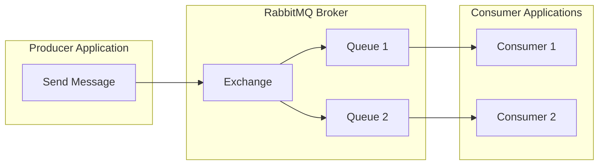
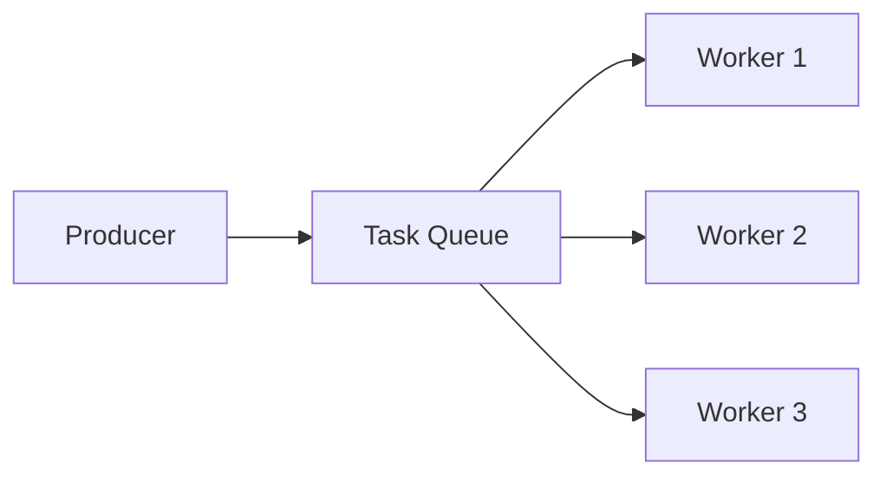
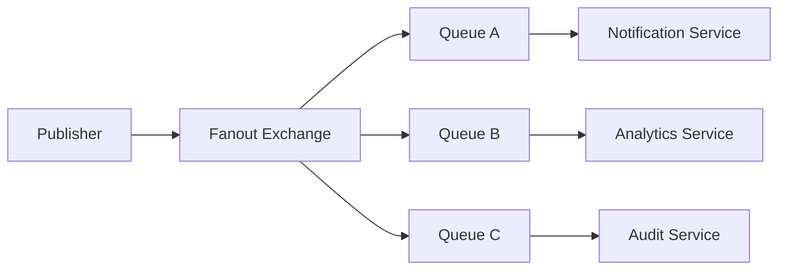
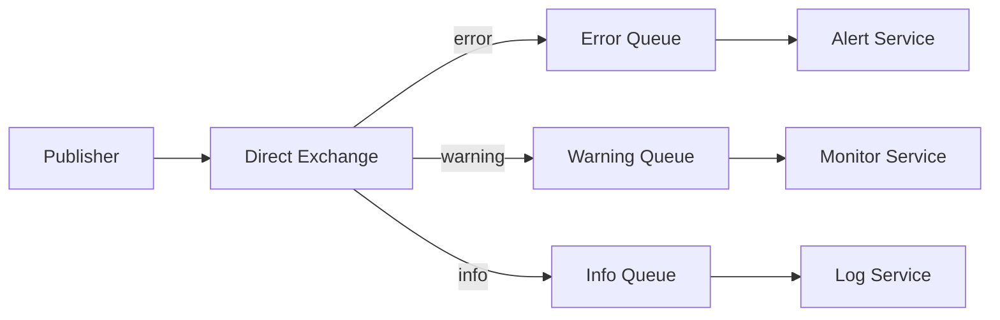
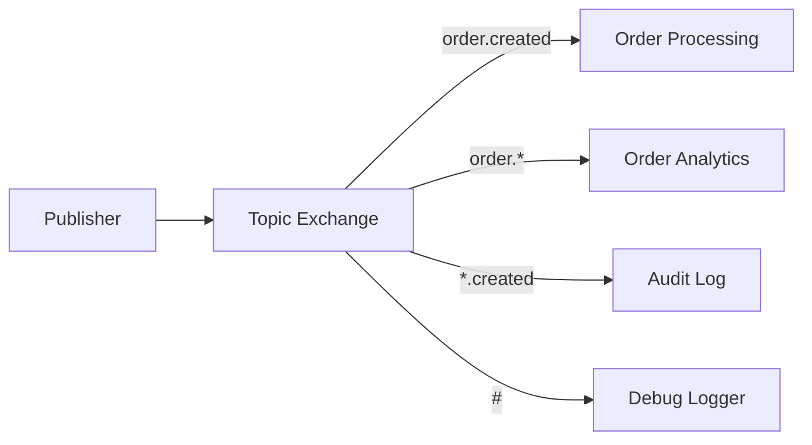
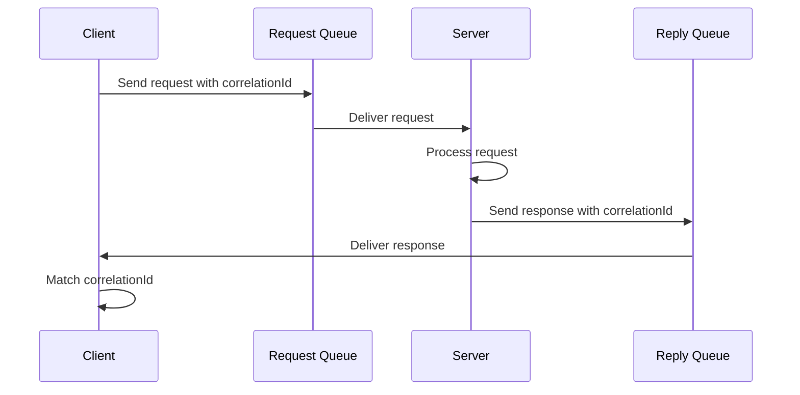
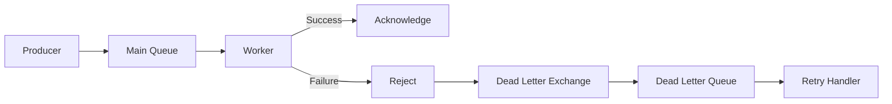

# How to Use RabbitMQ with Node.js

Author: [nawazdhandala](https://github.com/nawazdhandala)

Tags: RabbitMQ, Node.js, Message Queue, Microservices, Backend, Event-Driven

Description: Learn how to integrate RabbitMQ with Node.js applications for reliable message queuing, including work queues, publish/subscribe patterns, routing, and production best practices.

---

Message queuing enables decoupled, scalable architectures where services communicate asynchronously. RabbitMQ stands as one of the most popular message brokers, offering reliability, flexibility, and robust support for various messaging patterns.

## What is RabbitMQ?

RabbitMQ is an open-source message broker that implements the Advanced Message Queuing Protocol (AMQP). It acts as an intermediary for messaging, allowing applications to send and receive messages without direct connections.

The following diagram illustrates the basic architecture of RabbitMQ messaging.



## Installation and Setup

### Installing RabbitMQ

You can run RabbitMQ using Docker, which provides a quick and isolated environment for development.

```bash
# Run RabbitMQ with management UI on Docker
docker run -d --name rabbitmq \
  -p 5672:5672 \
  -p 15672:15672 \
  rabbitmq:3-management
```

Access the management UI at `http://localhost:15672` with default credentials `guest/guest`.

### Installing the Node.js Client

The `amqplib` package is the standard client for connecting to RabbitMQ from Node.js applications.

```bash
npm install amqplib
```

## Basic Connection

### Establishing a Connection

Every RabbitMQ operation starts with establishing a connection and creating a channel. The channel multiplexes operations over a single TCP connection for efficiency.

```javascript
const amqp = require('amqplib');

// Connection configuration object
const config = {
  protocol: 'amqp',
  hostname: process.env.RABBITMQ_HOST || 'localhost',
  port: parseInt(process.env.RABBITMQ_PORT) || 5672,
  username: process.env.RABBITMQ_USER || 'guest',
  password: process.env.RABBITMQ_PASS || 'guest',
  vhost: process.env.RABBITMQ_VHOST || '/',
};

async function connect() {
  try {
    // Create connection to RabbitMQ server
    const connection = await amqp.connect(config);

    // Handle connection errors and closures
    connection.on('error', (err) => {
      console.error('Connection error:', err.message);
    });

    connection.on('close', () => {
      console.log('Connection closed');
    });

    // Create a channel for operations
    const channel = await connection.createChannel();

    console.log('Connected to RabbitMQ');
    return { connection, channel };
  } catch (error) {
    console.error('Failed to connect:', error.message);
    throw error;
  }
}
```

## Work Queues Pattern

Work queues distribute tasks among multiple workers. Each message goes to exactly one worker, enabling parallel processing and load balancing.

The following diagram shows how work queues distribute messages.



### Producer: Sending Tasks

Producers send messages to a queue. Using `durable: true` ensures the queue survives broker restarts, and `persistent: true` ensures messages are written to disk.

```javascript
const amqp = require('amqplib');

async function sendTask(task) {
  const connection = await amqp.connect('amqp://localhost');
  const channel = await connection.createChannel();

  const queue = 'task_queue';

  // Declare the queue as durable so it survives broker restarts
  await channel.assertQueue(queue, {
    durable: true,
  });

  // Convert task object to buffer for transmission
  const message = Buffer.from(JSON.stringify(task));

  // Send message with persistence to survive broker restarts
  channel.sendToQueue(queue, message, {
    persistent: true,  // Write to disk
    contentType: 'application/json',
    timestamp: Date.now(),
  });

  console.log(`Sent task: ${task.id}`);

  // Close connection after a brief delay to ensure message is sent
  setTimeout(() => {
    connection.close();
  }, 500);
}

// Example: Send multiple tasks
async function main() {
  const tasks = [
    { id: 1, type: 'email', to: 'user@example.com' },
    { id: 2, type: 'report', format: 'pdf' },
    { id: 3, type: 'resize', image: 'photo.jpg' },
  ];

  for (const task of tasks) {
    await sendTask(task);
  }
}

main().catch(console.error);
```

### Consumer: Processing Tasks

Workers consume messages from the queue. Setting `prefetch(1)` ensures fair distribution, where a worker only receives a new message after acknowledging the previous one.

```javascript
const amqp = require('amqplib');

async function startWorker() {
  const connection = await amqp.connect('amqp://localhost');
  const channel = await connection.createChannel();

  const queue = 'task_queue';

  // Ensure the queue exists with same settings as producer
  await channel.assertQueue(queue, {
    durable: true,
  });

  // Process only one message at a time for fair distribution
  await channel.prefetch(1);

  console.log('Worker waiting for tasks...');

  // Start consuming messages from the queue
  channel.consume(queue, async (msg) => {
    if (msg === null) return;

    try {
      // Parse the message content
      const task = JSON.parse(msg.content.toString());
      console.log(`Processing task ${task.id}: ${task.type}`);

      // Simulate task processing with delay
      await processTask(task);

      // Acknowledge successful processing
      // RabbitMQ will remove the message from the queue
      channel.ack(msg);
      console.log(`Task ${task.id} completed`);

    } catch (error) {
      console.error(`Task failed:`, error.message);

      // Reject and requeue the message for retry
      // Setting requeue to false sends it to dead letter queue if configured
      channel.nack(msg, false, true);
    }
  });
}

async function processTask(task) {
  // Simulate work based on task type
  const workTime = {
    email: 1000,
    report: 3000,
    resize: 2000,
  };

  await new Promise(resolve =>
    setTimeout(resolve, workTime[task.type] || 1000)
  );
}

startWorker().catch(console.error);
```

## Publish/Subscribe Pattern

The pub/sub pattern broadcasts messages to multiple consumers. A fanout exchange delivers messages to all bound queues.

The following diagram illustrates the fanout exchange pattern.



### Publisher

Publishers send messages to an exchange rather than directly to a queue. The fanout exchange broadcasts to all bound queues.

```javascript
const amqp = require('amqplib');

async function publishEvent(event) {
  const connection = await amqp.connect('amqp://localhost');
  const channel = await connection.createChannel();

  const exchange = 'events';

  // Declare a fanout exchange that broadcasts to all bound queues
  await channel.assertExchange(exchange, 'fanout', {
    durable: true,
  });

  // Publish to the exchange with empty routing key
  // Fanout exchanges ignore routing keys
  channel.publish(
    exchange,
    '',  // Routing key ignored for fanout
    Buffer.from(JSON.stringify(event)),
    {
      persistent: true,
      contentType: 'application/json',
      headers: {
        eventType: event.type,
        timestamp: new Date().toISOString(),
      },
    }
  );

  console.log(`Published event: ${event.type}`);

  setTimeout(() => connection.close(), 500);
}

// Publish user registration event to all subscribers
publishEvent({
  type: 'user.registered',
  data: {
    userId: '12345',
    email: 'newuser@example.com',
    registeredAt: new Date().toISOString(),
  },
});
```

### Subscriber

Subscribers create their own queues bound to the exchange. Each subscriber receives a copy of every published message.

```javascript
const amqp = require('amqplib');

async function subscribe(serviceName, handler) {
  const connection = await amqp.connect('amqp://localhost');
  const channel = await connection.createChannel();

  const exchange = 'events';

  // Ensure the exchange exists
  await channel.assertExchange(exchange, 'fanout', {
    durable: true,
  });

  // Create an exclusive queue for this subscriber
  // Empty string lets RabbitMQ generate a unique name
  const { queue } = await channel.assertQueue('', {
    exclusive: true,  // Delete queue when connection closes
  });

  // Bind the queue to the fanout exchange
  await channel.bindQueue(queue, exchange, '');

  console.log(`${serviceName} subscribed to events`);

  // Consume messages and invoke the handler
  channel.consume(queue, async (msg) => {
    if (msg === null) return;

    const event = JSON.parse(msg.content.toString());

    try {
      await handler(event);
      channel.ack(msg);
    } catch (error) {
      console.error(`${serviceName} failed to process:`, error);
      channel.nack(msg, false, false);
    }
  });
}

// Email notification service subscriber
subscribe('EmailService', async (event) => {
  if (event.type === 'user.registered') {
    console.log(`Sending welcome email to ${event.data.email}`);
  }
});

// Analytics service subscriber
subscribe('AnalyticsService', async (event) => {
  console.log(`Recording event: ${event.type}`);
});
```

## Routing Pattern

Direct exchanges route messages based on routing keys, allowing selective message delivery.

The following diagram shows how direct exchanges work with routing keys.



### Routing Publisher

Direct exchanges route messages to queues based on exact routing key matches.

```javascript
const amqp = require('amqplib');

async function publishLog(severity, message) {
  const connection = await amqp.connect('amqp://localhost');
  const channel = await connection.createChannel();

  const exchange = 'logs';

  // Direct exchange routes based on exact routing key match
  await channel.assertExchange(exchange, 'direct', {
    durable: true,
  });

  const logEntry = {
    severity,
    message,
    timestamp: new Date().toISOString(),
    hostname: require('os').hostname(),
  };

  // Routing key determines which queues receive the message
  channel.publish(
    exchange,
    severity,  // Routing key: error, warning, or info
    Buffer.from(JSON.stringify(logEntry)),
    { persistent: true }
  );

  console.log(`Published ${severity}: ${message}`);

  setTimeout(() => connection.close(), 500);
}

// Usage examples
publishLog('error', 'Database connection failed');
publishLog('warning', 'High memory usage detected');
publishLog('info', 'User login successful');
```

### Routing Subscriber

Subscribers bind to specific routing keys to receive only relevant messages.

```javascript
const amqp = require('amqplib');

async function subscribeToLogs(severities, handler) {
  const connection = await amqp.connect('amqp://localhost');
  const channel = await connection.createChannel();

  const exchange = 'logs';

  await channel.assertExchange(exchange, 'direct', {
    durable: true,
  });

  // Create a queue for this subscriber
  const { queue } = await channel.assertQueue('', {
    exclusive: true,
  });

  // Bind to multiple routing keys (severities)
  for (const severity of severities) {
    await channel.bindQueue(queue, exchange, severity);
    console.log(`Bound to severity: ${severity}`);
  }

  channel.consume(queue, (msg) => {
    if (msg === null) return;

    const log = JSON.parse(msg.content.toString());
    handler(log);
    channel.ack(msg);
  });
}

// Alert service subscribes only to errors
subscribeToLogs(['error'], (log) => {
  console.log(`ALERT: ${log.message}`);
  // Send to PagerDuty, Slack, etc.
});

// Monitor service subscribes to errors and warnings
subscribeToLogs(['error', 'warning'], (log) => {
  console.log(`MONITOR [${log.severity}]: ${log.message}`);
});
```

## Topic Exchange Pattern

Topic exchanges provide flexible routing using pattern matching with wildcards.

The following diagram demonstrates topic-based routing with wildcards.



### Topic Publisher

Topic routing keys use dot-separated words. Subscribers can match using `*` (single word) or `#` (zero or more words).

```javascript
const amqp = require('amqplib');

async function publishOrderEvent(action, order) {
  const connection = await amqp.connect('amqp://localhost');
  const channel = await connection.createChannel();

  const exchange = 'orders';

  // Topic exchange allows pattern matching on routing keys
  await channel.assertExchange(exchange, 'topic', {
    durable: true,
  });

  // Routing key format: entity.action.priority
  const routingKey = `order.${action}.${order.priority}`;

  channel.publish(
    exchange,
    routingKey,
    Buffer.from(JSON.stringify(order)),
    { persistent: true }
  );

  console.log(`Published: ${routingKey}`);

  setTimeout(() => connection.close(), 500);
}

// Examples with different routing keys
publishOrderEvent('created', { id: 1, priority: 'high', total: 500 });
publishOrderEvent('updated', { id: 2, priority: 'low', total: 25 });
publishOrderEvent('shipped', { id: 3, priority: 'high', total: 150 });
```

### Topic Subscriber

Topic subscribers use wildcards for flexible message filtering.

```javascript
const amqp = require('amqplib');

async function subscribeToOrders(pattern, name, handler) {
  const connection = await amqp.connect('amqp://localhost');
  const channel = await connection.createChannel();

  const exchange = 'orders';

  await channel.assertExchange(exchange, 'topic', {
    durable: true,
  });

  const { queue } = await channel.assertQueue('', {
    exclusive: true,
  });

  // Bind with pattern: * matches one word, # matches zero or more
  await channel.bindQueue(queue, exchange, pattern);
  console.log(`${name} subscribed to: ${pattern}`);

  channel.consume(queue, (msg) => {
    if (msg === null) return;

    const order = JSON.parse(msg.content.toString());
    handler(order, msg.fields.routingKey);
    channel.ack(msg);
  });
}

// Matches only high priority orders: order.*.high
subscribeToOrders('order.*.high', 'PriorityHandler', (order, key) => {
  console.log(`High priority order: ${key}`, order);
});

// Matches all created events: order.created.*
subscribeToOrders('order.created.*', 'NewOrderHandler', (order, key) => {
  console.log(`New order: ${key}`, order);
});

// Matches everything: order.# (or just #)
subscribeToOrders('order.#', 'AuditLogger', (order, key) => {
  console.log(`Audit: ${key}`, order);
});
```

## RPC Pattern

Request-Reply (RPC) enables synchronous-style communication over async messaging.

The following diagram shows the RPC pattern flow.



### RPC Server

The server processes requests and sends responses to the reply queue specified in each message.

```javascript
const amqp = require('amqplib');

async function startRPCServer() {
  const connection = await amqp.connect('amqp://localhost');
  const channel = await connection.createChannel();

  const queue = 'rpc_queue';

  await channel.assertQueue(queue, { durable: false });
  await channel.prefetch(1);

  console.log('RPC Server waiting for requests...');

  channel.consume(queue, async (msg) => {
    if (msg === null) return;

    const request = JSON.parse(msg.content.toString());
    console.log(`Received request: ${request.method}`);

    let response;

    try {
      // Process the RPC request based on method
      response = await handleRPCRequest(request);
    } catch (error) {
      response = {
        error: true,
        message: error.message,
      };
    }

    // Send response to the reply queue specified by the client
    channel.sendToQueue(
      msg.properties.replyTo,
      Buffer.from(JSON.stringify(response)),
      {
        // correlationId links request to response
        correlationId: msg.properties.correlationId,
      }
    );

    channel.ack(msg);
  });
}

async function handleRPCRequest(request) {
  switch (request.method) {
    case 'getUser':
      return { id: request.params.id, name: 'John Doe' };
    case 'calculateSum':
      return { result: request.params.numbers.reduce((a, b) => a + b, 0) };
    default:
      throw new Error(`Unknown method: ${request.method}`);
  }
}

startRPCServer().catch(console.error);
```

### RPC Client

The client creates an exclusive reply queue and correlates responses using unique IDs.

```javascript
const amqp = require('amqplib');
const { v4: uuidv4 } = require('uuid');

class RPCClient {
  constructor() {
    this.connection = null;
    this.channel = null;
    this.replyQueue = null;
    this.pendingRequests = new Map();
  }

  async connect() {
    this.connection = await amqp.connect('amqp://localhost');
    this.channel = await this.connection.createChannel();

    // Create exclusive reply queue for receiving responses
    const { queue } = await this.channel.assertQueue('', {
      exclusive: true,
    });
    this.replyQueue = queue;

    // Listen for responses on the reply queue
    this.channel.consume(this.replyQueue, (msg) => {
      if (msg === null) return;

      const correlationId = msg.properties.correlationId;
      const pending = this.pendingRequests.get(correlationId);

      if (pending) {
        const response = JSON.parse(msg.content.toString());
        pending.resolve(response);
        this.pendingRequests.delete(correlationId);
      }

      this.channel.ack(msg);
    });

    console.log('RPC Client connected');
  }

  async call(method, params, timeout = 30000) {
    // Generate unique correlation ID for this request
    const correlationId = uuidv4();

    // Create promise that resolves when response arrives
    const responsePromise = new Promise((resolve, reject) => {
      // Set timeout for request
      const timer = setTimeout(() => {
        this.pendingRequests.delete(correlationId);
        reject(new Error('RPC request timed out'));
      }, timeout);

      this.pendingRequests.set(correlationId, {
        resolve: (result) => {
          clearTimeout(timer);
          resolve(result);
        },
      });
    });

    // Send request to the RPC queue
    this.channel.sendToQueue(
      'rpc_queue',
      Buffer.from(JSON.stringify({ method, params })),
      {
        correlationId,
        replyTo: this.replyQueue,
      }
    );

    return responsePromise;
  }

  async close() {
    await this.connection.close();
  }
}

// Usage example
async function main() {
  const client = new RPCClient();
  await client.connect();

  // Make RPC calls
  const user = await client.call('getUser', { id: 123 });
  console.log('User:', user);

  const sum = await client.call('calculateSum', { numbers: [1, 2, 3, 4, 5] });
  console.log('Sum:', sum);

  await client.close();
}

main().catch(console.error);
```

## Dead Letter Queues

Dead letter queues capture messages that fail processing, enabling error analysis and retry mechanisms.

The following diagram shows the dead letter queue flow.



### Setting Up Dead Letter Queues

Configure queues to route failed messages to a dead letter exchange automatically.

```javascript
const amqp = require('amqplib');

async function setupDeadLetterQueue() {
  const connection = await amqp.connect('amqp://localhost');
  const channel = await connection.createChannel();

  // Create the dead letter exchange
  await channel.assertExchange('dlx', 'direct', {
    durable: true,
  });

  // Create the dead letter queue
  await channel.assertQueue('dead_letters', {
    durable: true,
  });

  // Bind dead letter queue to exchange
  await channel.bindQueue('dead_letters', 'dlx', 'failed');

  // Create main queue with dead letter configuration
  await channel.assertQueue('main_queue', {
    durable: true,
    arguments: {
      // Route rejected messages to this exchange
      'x-dead-letter-exchange': 'dlx',
      // Use this routing key for dead letters
      'x-dead-letter-routing-key': 'failed',
      // Optional: TTL causes expired messages to be dead-lettered
      // 'x-message-ttl': 60000,
    },
  });

  console.log('Dead letter queue configured');
  return { connection, channel };
}

// Worker that may reject messages
async function startWorkerWithDLQ() {
  const { channel } = await setupDeadLetterQueue();

  await channel.prefetch(1);

  channel.consume('main_queue', async (msg) => {
    if (msg === null) return;

    const data = JSON.parse(msg.content.toString());
    const retryCount = (msg.properties.headers?.['x-retry-count'] || 0);

    try {
      await processMessage(data);
      channel.ack(msg);

    } catch (error) {
      console.error(`Processing failed: ${error.message}`);

      if (retryCount < 3) {
        // Requeue with incremented retry count
        channel.sendToQueue('main_queue', msg.content, {
          persistent: true,
          headers: { 'x-retry-count': retryCount + 1 },
        });
        channel.ack(msg);
      } else {
        // Max retries exceeded, send to dead letter queue
        // Setting requeue to false triggers dead lettering
        channel.nack(msg, false, false);
      }
    }
  });
}
```

### Processing Dead Letters

A separate service can process dead-lettered messages for analysis or manual intervention.

```javascript
const amqp = require('amqplib');

async function processDeadLetters() {
  const connection = await amqp.connect('amqp://localhost');
  const channel = await connection.createChannel();

  console.log('Dead letter processor started');

  channel.consume('dead_letters', async (msg) => {
    if (msg === null) return;

    const data = JSON.parse(msg.content.toString());
    const headers = msg.properties.headers || {};

    // Log failure details for debugging
    console.log('Dead letter received:', {
      data,
      originalExchange: headers['x-first-death-exchange'],
      originalQueue: headers['x-first-death-queue'],
      reason: headers['x-first-death-reason'],
      deathCount: headers['x-death']?.[0]?.count,
    });

    // Store in database for analysis
    await storeFailedMessage({
      payload: data,
      failedAt: new Date(),
      reason: headers['x-first-death-reason'],
    });

    // Alert operations team for critical failures
    if (data.priority === 'critical') {
      await sendAlert(`Critical message failed: ${JSON.stringify(data)}`);
    }

    channel.ack(msg);
  });
}

processDeadLetters().catch(console.error);
```

## Connection Management

Production applications require robust connection handling with automatic reconnection.

### Connection Pool Implementation

A connection manager handles reconnection logic and provides channels to workers.

```javascript
const amqp = require('amqplib');
const EventEmitter = require('events');

class RabbitMQConnection extends EventEmitter {
  constructor(config) {
    super();
    this.config = config;
    this.connection = null;
    this.channel = null;
    this.reconnectAttempts = 0;
    this.maxReconnectAttempts = 10;
    this.reconnectDelay = 1000;
  }

  async connect() {
    try {
      this.connection = await amqp.connect(this.config);
      this.channel = await this.connection.createChannel();

      // Reset reconnect counter on successful connection
      this.reconnectAttempts = 0;

      // Handle connection errors
      this.connection.on('error', (err) => {
        console.error('Connection error:', err.message);
        this.emit('error', err);
      });

      // Handle connection close and attempt reconnect
      this.connection.on('close', () => {
        console.log('Connection closed, attempting reconnect...');
        this.scheduleReconnect();
      });

      // Handle channel errors
      this.channel.on('error', (err) => {
        console.error('Channel error:', err.message);
      });

      this.emit('connected');
      console.log('RabbitMQ connected');

      return this.channel;

    } catch (error) {
      console.error('Connection failed:', error.message);
      this.scheduleReconnect();
      throw error;
    }
  }

  scheduleReconnect() {
    if (this.reconnectAttempts >= this.maxReconnectAttempts) {
      console.error('Max reconnect attempts reached');
      this.emit('failed');
      return;
    }

    this.reconnectAttempts++;

    // Exponential backoff with jitter
    const delay = Math.min(
      this.reconnectDelay * Math.pow(2, this.reconnectAttempts - 1),
      30000
    ) + Math.random() * 1000;

    console.log(`Reconnecting in ${Math.round(delay)}ms (attempt ${this.reconnectAttempts})`);

    setTimeout(() => this.connect(), delay);
  }

  async close() {
    if (this.channel) {
      await this.channel.close();
    }
    if (this.connection) {
      await this.connection.close();
    }
  }

  getChannel() {
    if (!this.channel) {
      throw new Error('Not connected');
    }
    return this.channel;
  }
}

// Usage with automatic reconnection
const rabbit = new RabbitMQConnection({
  hostname: 'localhost',
  port: 5672,
  username: 'guest',
  password: 'guest',
});

rabbit.on('connected', () => {
  console.log('Ready to publish/consume');
});

rabbit.on('failed', () => {
  console.error('Could not establish connection');
  process.exit(1);
});

rabbit.connect();
```

## Message Serialization

Proper serialization ensures messages are correctly encoded and decoded across services.

```javascript
const amqp = require('amqplib');

// Message serialization utilities
const serializers = {
  json: {
    contentType: 'application/json',
    encode: (data) => Buffer.from(JSON.stringify(data)),
    decode: (buffer) => JSON.parse(buffer.toString()),
  },

  // Binary format for high-performance scenarios
  msgpack: {
    contentType: 'application/msgpack',
    encode: (data) => require('msgpack-lite').encode(data),
    decode: (buffer) => require('msgpack-lite').decode(buffer),
  },
};

class TypedMessageQueue {
  constructor(channel, options = {}) {
    this.channel = channel;
    this.serializer = serializers[options.format || 'json'];
  }

  async publish(exchange, routingKey, message, options = {}) {
    const content = this.serializer.encode(message);

    return this.channel.publish(exchange, routingKey, content, {
      contentType: this.serializer.contentType,
      persistent: options.persistent !== false,
      headers: {
        ...options.headers,
        'x-message-type': message.constructor?.name || typeof message,
        'x-published-at': new Date().toISOString(),
      },
    });
  }

  async consume(queue, handler, options = {}) {
    return this.channel.consume(queue, async (msg) => {
      if (msg === null) return;

      try {
        const data = this.serializer.decode(msg.content);
        await handler(data, msg);
        this.channel.ack(msg);
      } catch (error) {
        console.error('Message processing error:', error);
        this.channel.nack(msg, false, options.requeue !== false);
      }
    });
  }
}
```

## Graceful Shutdown

Production applications must handle shutdown gracefully to avoid message loss.

```javascript
const amqp = require('amqplib');

class GracefulRabbitMQ {
  constructor() {
    this.connection = null;
    this.channel = null;
    this.consumerTags = [];
    this.isShuttingDown = false;
  }

  async connect() {
    this.connection = await amqp.connect('amqp://localhost');
    this.channel = await this.connection.createChannel();

    // Register shutdown handlers
    this.registerShutdownHandlers();

    return this.channel;
  }

  registerShutdownHandlers() {
    const shutdown = async (signal) => {
      if (this.isShuttingDown) return;
      this.isShuttingDown = true;

      console.log(`Received ${signal}, shutting down gracefully...`);

      try {
        // Stop accepting new messages
        for (const tag of this.consumerTags) {
          await this.channel.cancel(tag);
        }
        console.log('Stopped consuming messages');

        // Wait for in-flight messages to complete
        await this.waitForPendingMessages();

        // Close channel and connection
        await this.channel.close();
        await this.connection.close();

        console.log('Shutdown complete');
        process.exit(0);

      } catch (error) {
        console.error('Error during shutdown:', error);
        process.exit(1);
      }
    };

    process.on('SIGTERM', () => shutdown('SIGTERM'));
    process.on('SIGINT', () => shutdown('SIGINT'));
  }

  async waitForPendingMessages(timeout = 30000) {
    // Wait for acknowledgments of in-flight messages
    return new Promise((resolve) => {
      const start = Date.now();

      const check = () => {
        // Check if all messages are acknowledged
        // In practice, track this via a counter incremented on consume
        // and decremented on ack/nack
        if (Date.now() - start > timeout) {
          console.log('Timeout waiting for pending messages');
          resolve();
          return;
        }

        setTimeout(check, 100);
      };

      check();
    });
  }

  async consume(queue, handler) {
    const { consumerTag } = await this.channel.consume(queue, handler);
    this.consumerTags.push(consumerTag);
    return consumerTag;
  }
}
```

## Performance Optimization

Optimize RabbitMQ performance with these techniques.

```javascript
const amqp = require('amqplib');

async function optimizedSetup() {
  const connection = await amqp.connect('amqp://localhost');

  // Use confirm channel for publisher confirms
  const channel = await connection.createConfirmChannel();

  // Set QoS for consumers
  // Higher prefetch improves throughput but increases memory usage
  await channel.prefetch(10);

  return { connection, channel };
}

// Batch publishing for high throughput
async function batchPublish(channel, exchange, messages) {
  const batchSize = 100;

  for (let i = 0; i < messages.length; i += batchSize) {
    const batch = messages.slice(i, i + batchSize);

    // Publish batch without waiting for individual confirms
    for (const msg of batch) {
      channel.publish(exchange, msg.routingKey, Buffer.from(JSON.stringify(msg.data)));
    }

    // Wait for all messages in batch to be confirmed
    await channel.waitForConfirms();
    console.log(`Published batch ${i / batchSize + 1}`);
  }
}

// Parallel consumers for CPU-intensive tasks
async function startParallelConsumers(queueName, handler, concurrency = 4) {
  const connection = await amqp.connect('amqp://localhost');

  // Create multiple channels for parallel processing
  const channels = await Promise.all(
    Array(concurrency).fill(null).map(async () => {
      const channel = await connection.createChannel();
      await channel.prefetch(1);
      return channel;
    })
  );

  // Start consumer on each channel
  channels.forEach((channel, index) => {
    channel.consume(queueName, async (msg) => {
      if (msg === null) return;

      try {
        await handler(JSON.parse(msg.content.toString()));
        channel.ack(msg);
      } catch (error) {
        channel.nack(msg, false, true);
      }
    });

    console.log(`Consumer ${index + 1} started`);
  });

  return { connection, channels };
}
```

## Monitoring and Health Checks

Implement health checks for RabbitMQ connections.

```javascript
const amqp = require('amqplib');

class RabbitMQHealthCheck {
  constructor(connection) {
    this.connection = connection;
  }

  async check() {
    const health = {
      status: 'healthy',
      timestamp: new Date().toISOString(),
      details: {},
    };

    try {
      // Check connection state
      if (!this.connection) {
        throw new Error('No connection');
      }

      // Create temporary channel to verify connectivity
      const channel = await this.connection.createChannel();

      // Check a queue exists and get message count
      const queueInfo = await channel.checkQueue('task_queue');

      health.details = {
        connected: true,
        messageCount: queueInfo.messageCount,
        consumerCount: queueInfo.consumerCount,
      };

      await channel.close();

    } catch (error) {
      health.status = 'unhealthy';
      health.details = {
        connected: false,
        error: error.message,
      };
    }

    return health;
  }
}

// Express health endpoint
const express = require('express');
const app = express();

let rabbitConnection;

app.get('/health/rabbitmq', async (req, res) => {
  const healthCheck = new RabbitMQHealthCheck(rabbitConnection);
  const health = await healthCheck.check();

  const statusCode = health.status === 'healthy' ? 200 : 503;
  res.status(statusCode).json(health);
});
```

## Testing with RabbitMQ

Write integration tests for RabbitMQ messaging.

```javascript
const amqp = require('amqplib');

describe('RabbitMQ Integration Tests', () => {
  let connection;
  let channel;

  beforeAll(async () => {
    // Connect to test RabbitMQ instance
    connection = await amqp.connect(process.env.TEST_RABBITMQ_URL || 'amqp://localhost');
    channel = await connection.createChannel();
  });

  afterAll(async () => {
    await channel.close();
    await connection.close();
  });

  beforeEach(async () => {
    // Clean up test queue before each test
    await channel.deleteQueue('test_queue').catch(() => {});
    await channel.assertQueue('test_queue', { durable: false });
  });

  test('should publish and consume message', async () => {
    const testMessage = { id: 1, data: 'test' };

    // Publish message
    channel.sendToQueue(
      'test_queue',
      Buffer.from(JSON.stringify(testMessage))
    );

    // Consume and verify message
    const receivedMessage = await new Promise((resolve) => {
      channel.consume('test_queue', (msg) => {
        channel.ack(msg);
        resolve(JSON.parse(msg.content.toString()));
      });
    });

    expect(receivedMessage).toEqual(testMessage);
  });

  test('should handle message rejection', async () => {
    // Set up dead letter queue for test
    await channel.assertExchange('test_dlx', 'direct');
    await channel.assertQueue('test_dlq');
    await channel.bindQueue('test_dlq', 'test_dlx', 'rejected');

    await channel.deleteQueue('test_queue');
    await channel.assertQueue('test_queue', {
      arguments: {
        'x-dead-letter-exchange': 'test_dlx',
        'x-dead-letter-routing-key': 'rejected',
      },
    });

    // Publish message
    channel.sendToQueue(
      'test_queue',
      Buffer.from(JSON.stringify({ fail: true }))
    );

    // Reject message
    await new Promise((resolve) => {
      channel.consume('test_queue', (msg) => {
        channel.nack(msg, false, false);
        resolve();
      });
    });

    // Verify message in dead letter queue
    const deadLetter = await new Promise((resolve) => {
      channel.consume('test_dlq', (msg) => {
        channel.ack(msg);
        resolve(JSON.parse(msg.content.toString()));
      });
    });

    expect(deadLetter).toEqual({ fail: true });
  });
});
```

## Summary

| Pattern | Exchange Type | Use Case |
|---------|--------------|----------|
| **Work Queue** | Default | Task distribution among workers |
| **Pub/Sub** | Fanout | Broadcast to all subscribers |
| **Routing** | Direct | Selective message delivery |
| **Topics** | Topic | Pattern-based routing |
| **RPC** | Default | Request-response messaging |

RabbitMQ provides a flexible foundation for building distributed, event-driven Node.js applications. By understanding these patterns and following production best practices for connection management, error handling, and monitoring, you can build reliable messaging systems that scale with your application needs.
