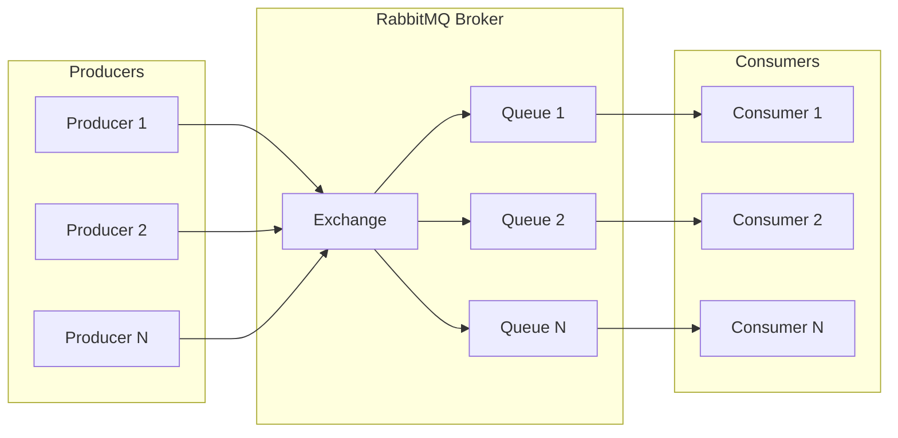
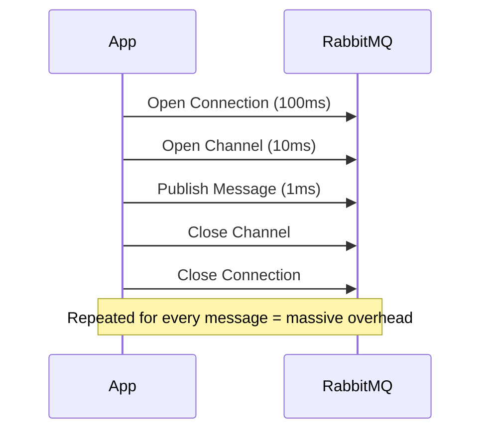
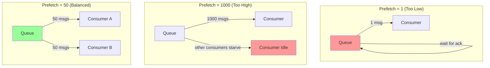
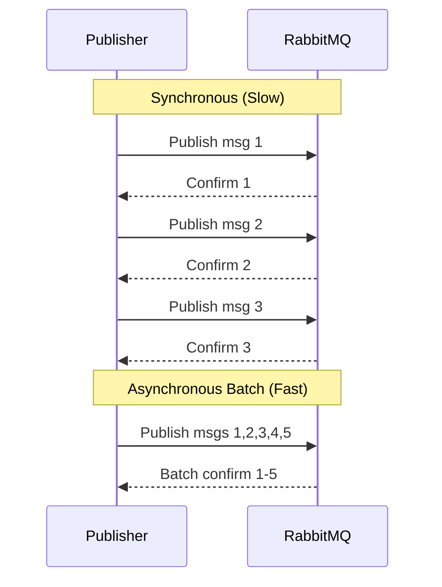
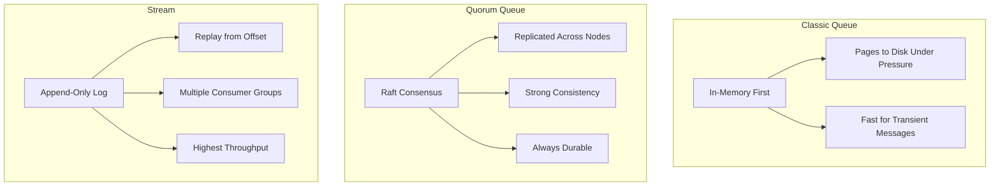
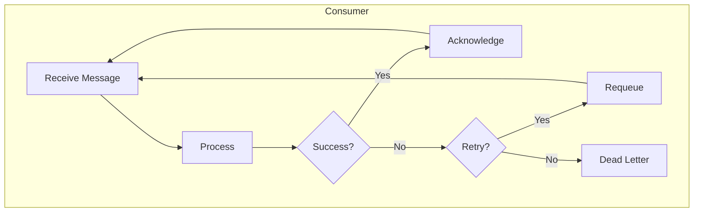
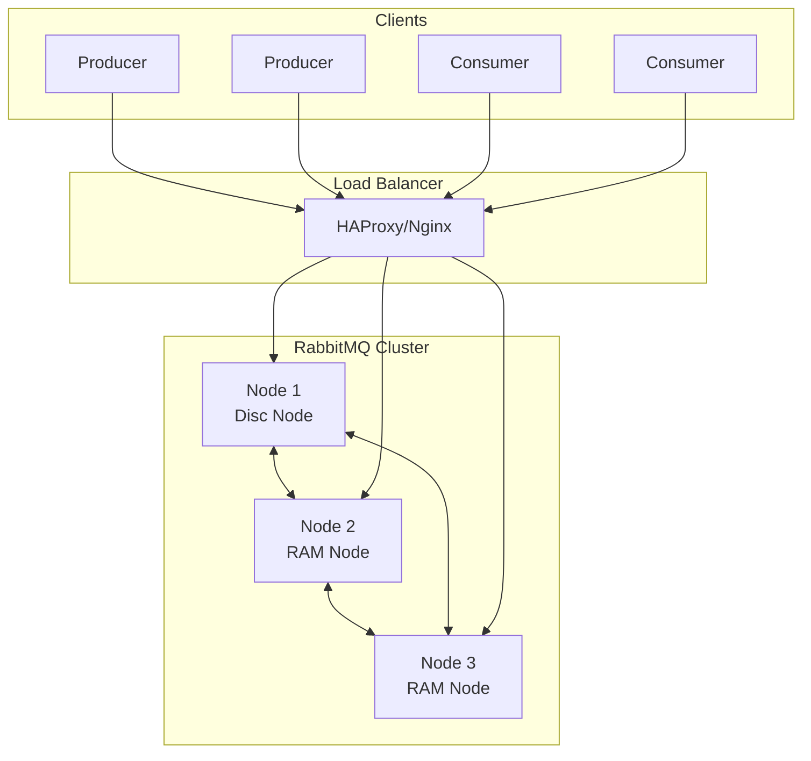
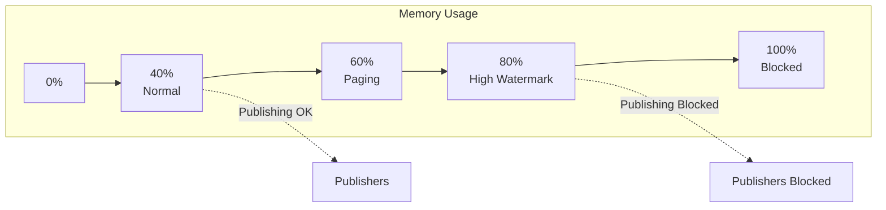
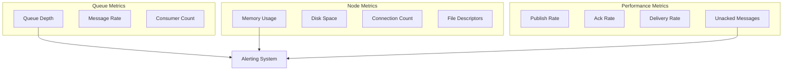
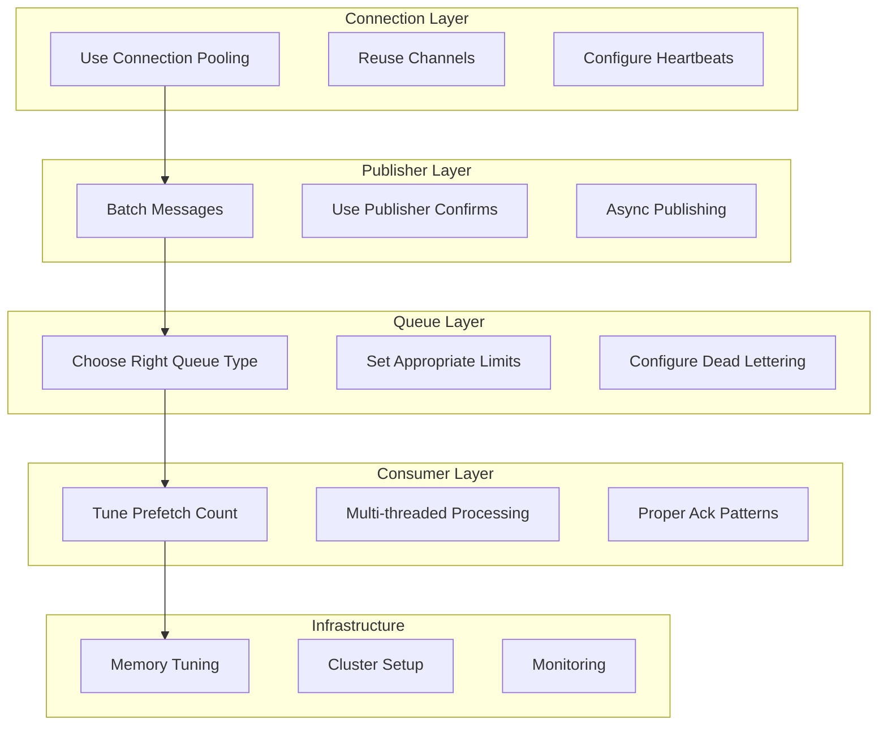

# How to Optimize RabbitMQ Performance

Author: [nawazdhandala](https://www.github.com/nawazdhandala)

Tags: RabbitMQ, Message Queue, Performance, Optimization, AMQP, Microservices, Backend

Description: A comprehensive guide to optimizing RabbitMQ performance for production workloads. Learn about connection pooling, prefetch settings, message batching, clustering strategies, and monitoring techniques to achieve maximum throughput and reliability.

---

> RabbitMQ is a powerful message broker, but achieving optimal performance requires careful tuning. Whether you are processing thousands or millions of messages per second, the right configuration can make all the difference between a sluggish queue and a high-performance messaging backbone.

Production RabbitMQ deployments often struggle with performance bottlenecks that stem from default configurations, inefficient patterns, or architectural oversights. Understanding the internals of how RabbitMQ handles messages, connections, and resources is key to unlocking its full potential.

---

## RabbitMQ Architecture Overview

Before diving into optimizations, understanding how RabbitMQ processes messages helps identify where bottlenecks occur.



Messages flow from producers through exchanges to queues, then to consumers. Each stage presents optimization opportunities.

---

## 1. Connection and Channel Management

Opening connections and channels is expensive. Each connection consumes TCP resources, and each channel requires memory allocation within the connection.

### The Problem with Connection Churn



### Solution: Connection Pooling

Implement a connection pool that reuses connections and channels across multiple operations. Here is a Python example using pika with connection pooling:

```python
# connection_pool.py
# A thread-safe connection pool for RabbitMQ that reuses connections
# and channels to minimize connection overhead

import pika
from queue import Queue
from threading import Lock
import time

class RabbitMQConnectionPool:
    """
    A connection pool that manages RabbitMQ connections efficiently.
    Reuses existing connections instead of creating new ones for each operation.
    """

    def __init__(self, host, port, max_connections=10, max_channels_per_connection=5):
        # Store connection parameters for creating new connections
        self.host = host
        self.port = port
        self.max_connections = max_connections
        self.max_channels_per_connection = max_channels_per_connection

        # Thread-safe queue to hold available connections
        self.connection_pool = Queue(maxsize=max_connections)

        # Lock for thread-safe pool operations
        self.lock = Lock()

        # Track active connections for cleanup
        self.active_connections = []

        # Pre-warm the pool with initial connections
        self._initialize_pool()

    def _initialize_pool(self):
        """Create initial connections to populate the pool."""
        for _ in range(min(3, self.max_connections)):
            conn = self._create_connection()
            self.connection_pool.put(conn)
            self.active_connections.append(conn)

    def _create_connection(self):
        """Create a new RabbitMQ connection with optimized parameters."""
        # Configure connection parameters for performance
        params = pika.ConnectionParameters(
            host=self.host,
            port=self.port,
            # Heartbeat keeps connection alive and detects failures quickly
            heartbeat=60,
            # Blocked connection timeout prevents indefinite hangs
            blocked_connection_timeout=300,
            # TCP keepalive settings for long-lived connections
            tcp_options={
                'TCP_KEEPIDLE': 60,
                'TCP_KEEPINTVL': 10,
                'TCP_KEEPCNT': 3
            }
        )
        return pika.BlockingConnection(params)

    def get_connection(self):
        """
        Retrieve a connection from the pool.
        Creates a new one if the pool is empty and under the limit.
        """
        with self.lock:
            if not self.connection_pool.empty():
                conn = self.connection_pool.get_nowait()
                # Verify connection is still valid
                if conn.is_open:
                    return conn
                # Connection died, create a new one
                self.active_connections.remove(conn)

            # Create new connection if under the limit
            if len(self.active_connections) < self.max_connections:
                conn = self._create_connection()
                self.active_connections.append(conn)
                return conn

            # Pool exhausted, wait for an available connection
            return self.connection_pool.get(block=True, timeout=30)

    def return_connection(self, connection):
        """Return a connection to the pool for reuse."""
        if connection.is_open:
            self.connection_pool.put(connection)
        else:
            # Remove dead connections from tracking
            with self.lock:
                if connection in self.active_connections:
                    self.active_connections.remove(connection)

# Usage example
pool = RabbitMQConnectionPool('localhost', 5672)

# Get connection, use it, return it
conn = pool.get_connection()
channel = conn.channel()
channel.basic_publish(exchange='', routing_key='my_queue', body='message')
channel.close()
pool.return_connection(conn)
```

---

## 2. Prefetch Settings Optimization

Prefetch count controls how many messages a consumer receives before acknowledging. Setting it correctly balances throughput and fair distribution.

### Understanding Prefetch Impact



### Configuring Optimal Prefetch

Set the prefetch count based on your consumer processing time and desired throughput. A higher prefetch means better throughput but potentially uneven load distribution:

```python
# prefetch_optimization.py
# Demonstrates proper prefetch configuration for different workload types

import pika

def setup_consumer_with_optimal_prefetch(processing_type='fast'):
    """
    Configure consumer with appropriate prefetch based on workload.

    Fast processing (< 10ms): prefetch 100-500
    Medium processing (10-100ms): prefetch 20-50
    Slow processing (> 100ms): prefetch 5-20
    """
    connection = pika.BlockingConnection(
        pika.ConnectionParameters('localhost')
    )
    channel = connection.channel()

    # Determine prefetch based on processing characteristics
    prefetch_map = {
        'fast': 250,      # High throughput, quick processing
        'medium': 50,     # Balanced approach
        'slow': 10,       # I/O bound or CPU intensive work
        'variable': 25    # When processing time varies
    }

    prefetch_count = prefetch_map.get(processing_type, 50)

    # Set QoS (Quality of Service) with prefetch
    # global_qos=False means prefetch applies per consumer, not per channel
    channel.basic_qos(
        prefetch_count=prefetch_count,
        global_qos=False
    )

    print(f"Configured prefetch_count={prefetch_count} for {processing_type} processing")

    return channel

# For I/O-bound consumers that make database calls
channel = setup_consumer_with_optimal_prefetch('slow')

# For CPU-light consumers doing simple transformations
channel = setup_consumer_with_optimal_prefetch('fast')
```

---

## 3. Message Batching and Publisher Confirms

Publishing messages one at a time with synchronous confirms creates significant overhead. Batch publishing with asynchronous confirms dramatically improves throughput.

### Synchronous vs Asynchronous Publishing



### Implementing Batch Publishing with Confirms

Use asynchronous publisher confirms with batching to achieve high throughput while maintaining delivery guarantees:

```python
# batch_publisher.py
# High-performance batch publisher with asynchronous confirms

import pika
from collections import defaultdict
import threading
import time

class BatchPublisher:
    """
    Batch publisher that groups messages and uses async confirms
    for high-throughput, reliable message delivery.
    """

    def __init__(self, host, batch_size=100, flush_interval=0.1):
        # Maximum messages to batch before sending
        self.batch_size = batch_size
        # Maximum time to wait before flushing partial batch (seconds)
        self.flush_interval = flush_interval

        # Message buffer organized by routing key
        self.message_buffer = defaultdict(list)
        self.buffer_lock = threading.Lock()

        # Track pending confirms
        self.pending_confirms = {}
        self.confirm_lock = threading.Lock()

        # Setup connection with publisher confirms
        self.connection = pika.BlockingConnection(
            pika.ConnectionParameters(host)
        )
        self.channel = self.connection.channel()

        # Enable publisher confirms for delivery guarantees
        self.channel.confirm_delivery()

        # Start background flush thread
        self.flush_thread = threading.Thread(target=self._periodic_flush)
        self.flush_thread.daemon = True
        self.flush_thread.start()

    def publish(self, exchange, routing_key, body, properties=None):
        """
        Queue a message for batch publishing.
        Returns immediately - actual send happens in batches.
        """
        with self.buffer_lock:
            self.message_buffer[routing_key].append({
                'exchange': exchange,
                'routing_key': routing_key,
                'body': body,
                'properties': properties or pika.BasicProperties(
                    # Persistent messages survive broker restart
                    delivery_mode=2
                )
            })

            # Flush if batch is full
            if len(self.message_buffer[routing_key]) >= self.batch_size:
                self._flush_routing_key(routing_key)

    def _flush_routing_key(self, routing_key):
        """Send all buffered messages for a specific routing key."""
        messages = self.message_buffer.pop(routing_key, [])

        for msg in messages:
            try:
                self.channel.basic_publish(
                    exchange=msg['exchange'],
                    routing_key=msg['routing_key'],
                    body=msg['body'],
                    properties=msg['properties']
                )
            except pika.exceptions.UnroutableError:
                # Handle unroutable messages (no matching queue)
                print(f"Message unroutable: {msg['routing_key']}")

    def _periodic_flush(self):
        """Background thread that flushes partial batches periodically."""
        while True:
            time.sleep(self.flush_interval)
            with self.buffer_lock:
                # Flush all routing keys with pending messages
                for routing_key in list(self.message_buffer.keys()):
                    if self.message_buffer[routing_key]:
                        self._flush_routing_key(routing_key)

    def flush_all(self):
        """Force flush all pending messages immediately."""
        with self.buffer_lock:
            for routing_key in list(self.message_buffer.keys()):
                self._flush_routing_key(routing_key)

# Usage example demonstrating high-throughput publishing
publisher = BatchPublisher('localhost', batch_size=100, flush_interval=0.05)

# Publish 10,000 messages - will be sent in efficient batches
for i in range(10000):
    publisher.publish(
        exchange='events',
        routing_key='user.created',
        body=f'{{"user_id": {i}}}'
    )

# Ensure all messages are sent before shutdown
publisher.flush_all()
```

---

## 4. Queue Configuration for Performance

Queue settings significantly impact performance. Choosing between classic and quorum queues, enabling lazy mode, and setting appropriate limits all affect throughput.

### Queue Type Comparison



### Declaring Optimized Queues

Choose the appropriate queue type and configure it for your workload. Quorum queues provide data safety while streams offer maximum throughput for replay scenarios:

```python
# queue_configuration.py
# Examples of declaring queues optimized for different use cases

import pika

def declare_high_throughput_classic_queue(channel, queue_name):
    """
    Classic queue optimized for maximum throughput.
    Best for non-critical, high-volume workloads.
    """
    arguments = {
        # Lazy mode keeps messages on disk, reducing memory pressure
        # Use for queues that may accumulate large backlogs
        'x-queue-mode': 'lazy',

        # Maximum queue length - prevents unbounded growth
        # Overflow behavior: reject-publish, drop-head, or reject-publish-dlx
        'x-max-length': 1000000,
        'x-overflow': 'reject-publish',

        # Message TTL - auto-expire old messages (milliseconds)
        'x-message-ttl': 3600000,  # 1 hour

        # Dead letter exchange for failed/expired messages
        'x-dead-letter-exchange': 'dlx',
        'x-dead-letter-routing-key': f'{queue_name}.dead'
    }

    channel.queue_declare(
        queue=queue_name,
        durable=True,  # Survive broker restart
        arguments=arguments
    )

    return queue_name

def declare_quorum_queue(channel, queue_name, replication_factor=3):
    """
    Quorum queue for critical workloads requiring data safety.
    Replicated across multiple nodes using Raft consensus.
    """
    arguments = {
        # Specify this is a quorum queue
        'x-queue-type': 'quorum',

        # Number of replicas (should be odd: 3, 5, 7)
        'x-quorum-initial-group-size': replication_factor,

        # Delivery limit before dead-lettering
        # Prevents poison messages from blocking the queue
        'x-delivery-limit': 5,

        # Dead letter strategy
        'x-dead-letter-exchange': 'dlx',

        # Memory limit per queue member (bytes)
        'x-max-in-memory-length': 10000
    }

    channel.queue_declare(
        queue=queue_name,
        durable=True,  # Quorum queues are always durable
        arguments=arguments
    )

    return queue_name

def declare_stream(channel, stream_name, retention_gb=10):
    """
    Stream for log-style workloads with replay capability.
    Highest throughput option for append-only data.
    """
    arguments = {
        # Specify this is a stream
        'x-queue-type': 'stream',

        # Retention by size (bytes)
        'x-max-length-bytes': retention_gb * 1024 * 1024 * 1024,

        # Or retention by time (seconds)
        # 'x-max-age': '7D',  # 7 days

        # Segment size for efficient cleanup
        'x-stream-max-segment-size-bytes': 500 * 1024 * 1024  # 500MB segments
    }

    channel.queue_declare(
        queue=stream_name,
        durable=True,
        arguments=arguments
    )

    return stream_name

# Example usage
connection = pika.BlockingConnection(pika.ConnectionParameters('localhost'))
channel = connection.channel()

# For high-volume event processing
declare_high_throughput_classic_queue(channel, 'events.processing')

# For critical order processing
declare_quorum_queue(channel, 'orders.processing', replication_factor=3)

# For event sourcing / audit logs
declare_stream(channel, 'audit.log', retention_gb=50)
```

---

## 5. Consumer Optimization Strategies

Efficient consumers are essential for overall system performance. Multi-threaded processing, proper acknowledgment patterns, and graceful shutdown all contribute to optimal throughput.

### Consumer Processing Flow



### High-Performance Consumer Implementation

Implement consumers that process messages in parallel while handling failures gracefully:

```python
# optimized_consumer.py
# Multi-threaded consumer with proper error handling and graceful shutdown

import pika
import threading
from concurrent.futures import ThreadPoolExecutor
import signal
import sys
import time

class OptimizedConsumer:
    """
    High-performance consumer with thread pool processing,
    proper acknowledgment handling, and graceful shutdown.
    """

    def __init__(self, host, queue_name, worker_count=10, prefetch=50):
        self.queue_name = queue_name
        self.worker_count = worker_count
        self.prefetch = prefetch

        # Thread pool for parallel message processing
        self.executor = ThreadPoolExecutor(max_workers=worker_count)

        # Flag for graceful shutdown
        self.shutdown_requested = False

        # Track in-flight messages for graceful shutdown
        self.in_flight_count = 0
        self.in_flight_lock = threading.Lock()

        # Setup connection
        self.connection = pika.BlockingConnection(
            pika.ConnectionParameters(
                host=host,
                heartbeat=60,
                blocked_connection_timeout=300
            )
        )
        self.channel = self.connection.channel()

        # Set prefetch to match worker count for optimal throughput
        self.channel.basic_qos(prefetch_count=prefetch)

        # Register shutdown handlers
        signal.signal(signal.SIGTERM, self._signal_handler)
        signal.signal(signal.SIGINT, self._signal_handler)

    def _signal_handler(self, signum, frame):
        """Handle shutdown signals gracefully."""
        print(f"Shutdown signal received, finishing in-flight messages...")
        self.shutdown_requested = True

    def process_message(self, body):
        """
        Override this method with your message processing logic.
        Should return True for success, False for failure.
        """
        # Simulate processing
        time.sleep(0.01)
        return True

    def _handle_message(self, channel, method, properties, body):
        """
        Internal message handler that manages threading and acknowledgments.
        """
        with self.in_flight_lock:
            self.in_flight_count += 1

        def process_and_ack():
            try:
                success = self.process_message(body)

                if success:
                    # Acknowledge successful processing
                    channel.basic_ack(delivery_tag=method.delivery_tag)
                else:
                    # Negative acknowledge - requeue for retry
                    # Set requeue=False to send to dead letter exchange
                    channel.basic_nack(
                        delivery_tag=method.delivery_tag,
                        requeue=True
                    )
            except Exception as e:
                print(f"Processing error: {e}")
                # Reject and don't requeue - send to dead letter
                channel.basic_nack(
                    delivery_tag=method.delivery_tag,
                    requeue=False
                )
            finally:
                with self.in_flight_lock:
                    self.in_flight_count -= 1

        # Submit to thread pool for parallel processing
        self.executor.submit(process_and_ack)

    def start(self):
        """Start consuming messages."""
        # Set up consumer with manual acknowledgment
        self.channel.basic_consume(
            queue=self.queue_name,
            on_message_callback=self._handle_message,
            auto_ack=False  # Manual ack for reliability
        )

        print(f"Consumer started on {self.queue_name} with {self.worker_count} workers")

        # Process messages until shutdown requested
        while not self.shutdown_requested:
            # Process events with timeout to check shutdown flag
            self.connection.process_data_events(time_limit=1)

        # Graceful shutdown - wait for in-flight messages
        print("Waiting for in-flight messages to complete...")
        while self.in_flight_count > 0:
            time.sleep(0.1)

        # Cleanup
        self.executor.shutdown(wait=True)
        self.channel.close()
        self.connection.close()
        print("Consumer shutdown complete")

# Example usage with custom processing logic
class OrderConsumer(OptimizedConsumer):
    def process_message(self, body):
        """Process order messages."""
        try:
            order = body.decode('utf-8')
            # Process the order...
            print(f"Processed order: {order}")
            return True
        except Exception as e:
            print(f"Failed to process order: {e}")
            return False

# Run the consumer
consumer = OrderConsumer(
    host='localhost',
    queue_name='orders',
    worker_count=20,
    prefetch=100
)
consumer.start()
```

---

## 6. Clustering and High Availability

Proper cluster configuration ensures both high availability and optimal performance distribution.

### Cluster Architecture



### HAProxy Configuration for RabbitMQ

Configure HAProxy to distribute load across cluster nodes with health checks:

```bash
# /etc/haproxy/haproxy.cfg
# HAProxy configuration for RabbitMQ cluster load balancing

global
    log stdout format raw local0
    maxconn 4096

defaults
    mode tcp
    log global
    option tcplog
    option dontlognull
    # Connection timeout - time to establish connection
    timeout connect 10s
    # Client timeout - inactivity timeout on client side
    timeout client 1m
    # Server timeout - inactivity timeout on server side
    timeout server 1m
    # Check timeout for health checks
    timeout check 5s

# RabbitMQ AMQP connections (port 5672)
frontend rabbitmq_frontend
    bind *:5672
    default_backend rabbitmq_backend

backend rabbitmq_backend
    # Balance using least connections for even distribution
    balance leastconn

    # Health check endpoint - RabbitMQ management API
    option httpchk GET /api/health/checks/alarms
    http-check expect status 200

    # Server definitions with health checks
    # Check interval 5s, 2 consecutive failures marks as down
    server rabbit1 10.0.0.1:5672 check port 15672 inter 5s fall 2 rise 2
    server rabbit2 10.0.0.2:5672 check port 15672 inter 5s fall 2 rise 2
    server rabbit3 10.0.0.3:5672 check port 15672 inter 5s fall 2 rise 2

# RabbitMQ Management UI (port 15672)
frontend rabbitmq_management_frontend
    bind *:15672
    default_backend rabbitmq_management_backend

backend rabbitmq_management_backend
    mode http
    balance roundrobin
    option httpchk GET /api/health/checks/alarms
    http-check expect status 200

    server rabbit1 10.0.0.1:15672 check inter 5s fall 2 rise 2
    server rabbit2 10.0.0.2:15672 check inter 5s fall 2 rise 2
    server rabbit3 10.0.0.3:15672 check inter 5s fall 2 rise 2

# Statistics page for monitoring HAProxy
listen stats
    bind *:8404
    mode http
    stats enable
    stats uri /stats
    stats refresh 10s
    stats admin if LOCALHOST
```

---

## 7. Memory and Resource Tuning

RabbitMQ memory and disk settings require careful tuning to prevent resource exhaustion while maintaining throughput.

### Memory Watermark Behavior



### RabbitMQ Configuration File

Configure memory limits, disk alarms, and other performance settings in the RabbitMQ configuration file:

```bash
# /etc/rabbitmq/rabbitmq.conf
# Production-optimized RabbitMQ configuration

# ============================================
# MEMORY SETTINGS
# ============================================

# Memory watermark - block publishers when memory exceeds this
# Can be absolute (2GB) or relative (0.6 = 60% of system RAM)
vm_memory_high_watermark.relative = 0.6

# Paging threshold - start paging messages to disk at this fraction
# of the high watermark (0.5 = 50% of watermark = 30% of RAM)
vm_memory_high_watermark_paging_ratio = 0.5

# Memory calculation strategy
# allocated: use erlang memory allocator stats (more accurate)
# rss: use OS-reported resident set size
vm_memory_calculation_strategy = allocated

# ============================================
# DISK SETTINGS
# ============================================

# Disk free space alarm threshold
# Block publishers when free disk drops below this
disk_free_limit.absolute = 5GB

# Alternative: relative to RAM
# disk_free_limit.relative = 2.0

# ============================================
# CONNECTION AND CHANNEL LIMITS
# ============================================

# Maximum simultaneous connections (0 = unlimited)
# Set based on expected load and available file descriptors
# connection_max = 10000

# Channel maximum per connection
channel_max = 128

# ============================================
# NETWORKING
# ============================================

# TCP listen backlog - connections waiting to be accepted
tcp_listen_options.backlog = 4096

# TCP buffer sizes for throughput
tcp_listen_options.sndbuf = 196608
tcp_listen_options.recbuf = 196608

# Disable Nagle's algorithm for lower latency
tcp_listen_options.nodelay = true

# TCP keepalive to detect dead connections
tcp_listen_options.keepalive = true

# ============================================
# QUEUE SETTINGS
# ============================================

# Default queue type for new queues (classic or quorum)
default_queue_type = quorum

# Queue index embed threshold
# Messages smaller than this are stored in the index
queue_index_embed_msgs_below = 4096

# ============================================
# CLUSTERING
# ============================================

# Cluster formation settings
cluster_formation.peer_discovery_backend = rabbit_peer_discovery_k8s
cluster_formation.k8s.host = kubernetes.default.svc.cluster.local
cluster_formation.k8s.address_type = hostname

# Partition handling strategy
# autoheal: automatic healing after partition
# pause_minority: pause nodes in minority partition
cluster_partition_handling = pause_minority

# ============================================
# MANAGEMENT PLUGIN
# ============================================

# Statistics collection interval (milliseconds)
# Higher values reduce CPU usage but less granular metrics
collect_statistics_interval = 10000

# Management API rate limiting
management.rates_mode = basic

# ============================================
# MESSAGE STORE
# ============================================

# Message store file size limit
msg_store_file_size_limit = 16777216

# Credit flow settings for backpressure
credit_flow_default_credit.initial = 400
credit_flow_default_credit.more = 200
```

### Setting System Limits

Configure operating system limits to support high connection counts. Add these settings to your system configuration:

```bash
# /etc/security/limits.conf
# Increase file descriptor limits for RabbitMQ

# Soft limit - default for new processes
rabbitmq soft nofile 65536

# Hard limit - maximum that can be set
rabbitmq hard nofile 65536

# Process limit
rabbitmq soft nproc 65536
rabbitmq hard nproc 65536
```

---

## 8. Monitoring and Alerting

Effective monitoring catches performance issues before they become outages.

### Key Metrics to Monitor



### Prometheus Monitoring Setup

Export RabbitMQ metrics to Prometheus for comprehensive monitoring and alerting:

```yaml
# prometheus-rabbitmq-rules.yml
# Prometheus alerting rules for RabbitMQ performance monitoring

groups:
  - name: rabbitmq_alerts
    interval: 30s
    rules:
      # Alert when queue depth exceeds threshold
      # High queue depth indicates consumers cannot keep up
      - alert: RabbitMQQueueDepthHigh
        expr: rabbitmq_queue_messages > 10000
        for: 5m
        labels:
          severity: warning
        annotations:
          summary: "Queue {{ $labels.queue }} has high message count"
          description: "Queue {{ $labels.queue }} on {{ $labels.instance }} has {{ $value }} messages"

      # Alert when queue has no consumers
      # Messages will accumulate indefinitely without consumers
      - alert: RabbitMQQueueNoConsumers
        expr: rabbitmq_queue_consumers == 0 and rabbitmq_queue_messages > 0
        for: 2m
        labels:
          severity: critical
        annotations:
          summary: "Queue {{ $labels.queue }} has no consumers"
          description: "Queue {{ $labels.queue }} has {{ $value }} messages but no consumers"

      # Alert on high memory usage
      # Publishers will be blocked when memory watermark is reached
      - alert: RabbitMQHighMemoryUsage
        expr: rabbitmq_process_resident_memory_bytes / rabbitmq_resident_memory_limit_bytes > 0.8
        for: 5m
        labels:
          severity: warning
        annotations:
          summary: "RabbitMQ memory usage is high"
          description: "Memory usage on {{ $labels.instance }} is {{ $value | humanizePercentage }}"

      # Alert when disk space is low
      # Publishers will be blocked when disk alarm triggers
      - alert: RabbitMQDiskSpaceLow
        expr: rabbitmq_disk_space_available_bytes < 5368709120
        for: 5m
        labels:
          severity: critical
        annotations:
          summary: "RabbitMQ disk space is low"
          description: "Available disk space on {{ $labels.instance }} is {{ $value | humanize1024 }}"

      # Alert on high unacknowledged message count
      # Indicates slow consumers or processing issues
      - alert: RabbitMQHighUnackedMessages
        expr: rabbitmq_queue_messages_unacked > 5000
        for: 5m
        labels:
          severity: warning
        annotations:
          summary: "High unacked messages in {{ $labels.queue }}"
          description: "{{ $value }} unacknowledged messages in queue {{ $labels.queue }}"

      # Alert when connection count is approaching limit
      - alert: RabbitMQConnectionsHigh
        expr: rabbitmq_connections / rabbitmq_connections_limit > 0.8
        for: 5m
        labels:
          severity: warning
        annotations:
          summary: "RabbitMQ connections approaching limit"
          description: "Connection usage on {{ $labels.instance }} is {{ $value | humanizePercentage }}"

      # Alert on cluster partition
      # Partitions can cause data inconsistency
      - alert: RabbitMQClusterPartition
        expr: rabbitmq_partitions > 0
        for: 1m
        labels:
          severity: critical
        annotations:
          summary: "RabbitMQ cluster partition detected"
          description: "Cluster partition detected on {{ $labels.instance }}"

      # Alert when publish rate drops significantly
      # May indicate publisher issues or network problems
      - alert: RabbitMQPublishRateDrop
        expr: rate(rabbitmq_channel_messages_published_total[5m]) < 0.1 * rate(rabbitmq_channel_messages_published_total[1h] offset 1d)
        for: 10m
        labels:
          severity: warning
        annotations:
          summary: "RabbitMQ publish rate has dropped"
          description: "Current publish rate is significantly lower than historical average"
```

---

## 9. Performance Testing

Before deploying to production, test your configuration under realistic load conditions.

### Load Testing with PerfTest

RabbitMQ provides PerfTest, a built-in tool for measuring throughput and latency under various conditions:

```bash
#!/bin/bash
# rabbitmq-perftest.sh
# Performance testing script for RabbitMQ optimization validation

# Set connection parameters
RABBITMQ_HOST="localhost"
RABBITMQ_PORT="5672"
RABBITMQ_USER="guest"
RABBITMQ_PASS="guest"

# Download PerfTest if not present
if [ ! -f "perf-test.jar" ]; then
    echo "Downloading RabbitMQ PerfTest..."
    curl -LO https://github.com/rabbitmq/rabbitmq-perf-test/releases/download/v2.19.0/perf-test-2.19.0.jar
    mv perf-test-2.19.0.jar perf-test.jar
fi

# Test 1: Baseline throughput test
# Measures maximum message rate with minimal overhead
echo "=== Test 1: Baseline Throughput ==="
java -jar perf-test.jar \
    --uri "amqp://${RABBITMQ_USER}:${RABBITMQ_PASS}@${RABBITMQ_HOST}:${RABBITMQ_PORT}" \
    --producers 1 \
    --consumers 1 \
    --queue "perf-test-baseline" \
    --auto-delete \
    --time 60 \
    --size 1024 \
    --confirm 100 \
    --multi-ack-every 100

# Test 2: High concurrency test
# Simulates multiple producers and consumers
echo "=== Test 2: High Concurrency ==="
java -jar perf-test.jar \
    --uri "amqp://${RABBITMQ_USER}:${RABBITMQ_PASS}@${RABBITMQ_HOST}:${RABBITMQ_PORT}" \
    --producers 10 \
    --consumers 10 \
    --queue "perf-test-concurrent" \
    --auto-delete \
    --time 60 \
    --size 1024 \
    --qos 100 \
    --confirm 100 \
    --multi-ack-every 50

# Test 3: Large message test
# Tests performance with larger payloads
echo "=== Test 3: Large Messages (10KB) ==="
java -jar perf-test.jar \
    --uri "amqp://${RABBITMQ_USER}:${RABBITMQ_PASS}@${RABBITMQ_HOST}:${RABBITMQ_PORT}" \
    --producers 5 \
    --consumers 5 \
    --queue "perf-test-large" \
    --auto-delete \
    --time 60 \
    --size 10240 \
    --qos 50 \
    --confirm 50

# Test 4: Persistent message test
# Measures impact of message persistence
echo "=== Test 4: Persistent Messages ==="
java -jar perf-test.jar \
    --uri "amqp://${RABBITMQ_USER}:${RABBITMQ_PASS}@${RABBITMQ_HOST}:${RABBITMQ_PORT}" \
    --producers 5 \
    --consumers 5 \
    --queue "perf-test-persistent" \
    --flag persistent \
    --auto-delete \
    --time 60 \
    --size 1024 \
    --qos 100 \
    --confirm 100

# Test 5: Quorum queue test
# Tests quorum queue performance characteristics
echo "=== Test 5: Quorum Queue ==="
java -jar perf-test.jar \
    --uri "amqp://${RABBITMQ_USER}:${RABBITMQ_PASS}@${RABBITMQ_HOST}:${RABBITMQ_PORT}" \
    --producers 5 \
    --consumers 5 \
    --quorum-queue \
    --queue "perf-test-quorum" \
    --time 60 \
    --size 1024 \
    --qos 100 \
    --confirm 100

# Test 6: Latency focused test
# Measures end-to-end latency distribution
echo "=== Test 6: Latency Measurement ==="
java -jar perf-test.jar \
    --uri "amqp://${RABBITMQ_USER}:${RABBITMQ_PASS}@${RABBITMQ_HOST}:${RABBITMQ_PORT}" \
    --producers 1 \
    --consumers 1 \
    --queue "perf-test-latency" \
    --auto-delete \
    --time 60 \
    --size 512 \
    --rate 1000 \
    --latency-percentiles 50,75,90,95,99

echo "Performance tests complete!"
```

---

## Performance Optimization Checklist



---

## Summary

Optimizing RabbitMQ performance requires attention to multiple layers:

1. **Connection Management** - Pool connections and reuse channels to minimize overhead
2. **Prefetch Tuning** - Balance throughput and fair distribution based on processing time
3. **Batch Publishing** - Group messages and use async confirms for higher throughput
4. **Queue Configuration** - Choose the right queue type and configure appropriate limits
5. **Consumer Optimization** - Implement multi-threaded processing with proper acknowledgments
6. **Clustering** - Distribute load and ensure high availability
7. **Resource Tuning** - Configure memory, disk, and network settings appropriately
8. **Monitoring** - Track key metrics and set up alerting for early warning

Start with baseline measurements, apply optimizations incrementally, and validate improvements through load testing. Each environment is different, so the optimal configuration depends on your specific workload characteristics.

---

For more observability best practices and monitoring solutions, check out [OneUptime](https://oneuptime.com) - a comprehensive platform for infrastructure monitoring, incident management, and status pages.
