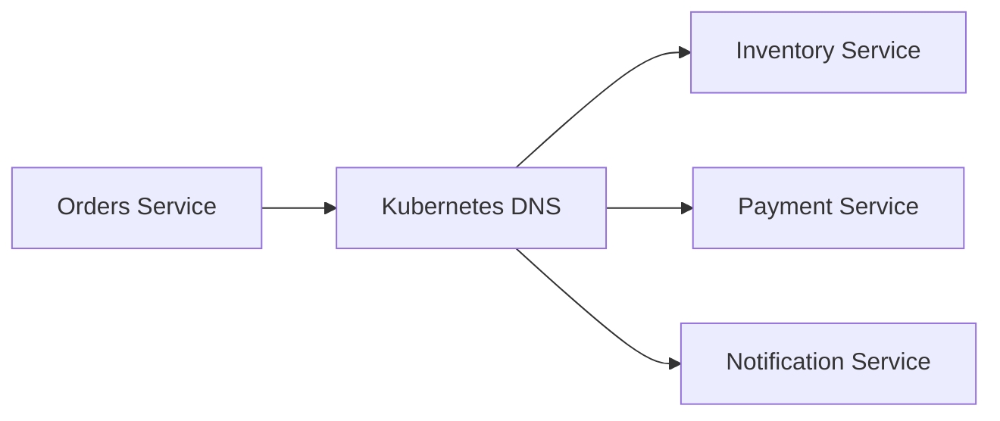

# How to Build Microservices with Rails API Mode

Author: [nawazdhandala](https://github.com/nawazdhandala)

Tags: Ruby, Rails, API, Microservices, Architecture

Description: A practical guide to building microservices with Rails API mode, covering project setup, JSON serialization, authentication, inter-service communication, and deployment patterns.

---

> Rails API mode strips away browser-specific middleware to create lean, fast services. It's perfect for microservices that only need to serve JSON.

When you're building microservices, you don't need view templates, session cookies, or asset compilation. Rails API mode gives you exactly what you need - nothing more.

---

## Why Rails API Mode?

Rails API mode removes middleware you don't need for JSON APIs:

| Feature | Full Rails | API Mode |
|---------|-----------|----------|
| ActionView | Yes | No |
| Browser cookies | Yes | No |
| Flash messages | Yes | No |
| Session middleware | Yes | No |
| Asset pipeline | Yes | No |
| CSRF protection | Yes | No |
| API response handling | Yes | Yes |
| ActiveRecord | Yes | Yes |
| Request routing | Yes | Yes |

The result is a smaller memory footprint and faster response times.

---

## Project Setup

Create a new Rails API project with PostgreSQL:

```bash
# Create a new API-only Rails application
# --api flag configures Rails for JSON-only responses
# --database=postgresql sets up PostgreSQL instead of SQLite
rails new orders_service --api --database=postgresql

cd orders_service
```

Your `config/application.rb` will include this configuration:

```ruby
# config/application.rb
module OrdersService
  class Application < Rails::Application
    # API mode - no views, cookies, or browser middleware
    config.api_only = true

    # Load paths for lib directory
    config.autoload_paths << Rails.root.join('lib')
  end
end
```

Add essential gems to your Gemfile:

```ruby
# Gemfile

# JSON serialization - pick one approach
gem 'jbuilder'                    # Template-based JSON building
# OR
gem 'active_model_serializers'    # Object-oriented serialization

# Authentication
gem 'jwt'                         # JSON Web Token encoding/decoding
gem 'bcrypt'                      # Password hashing

# HTTP client for service-to-service calls
gem 'faraday'                     # HTTP client with middleware support
gem 'faraday-retry'               # Automatic retry on failures

# Background jobs
gem 'sidekiq'                     # Redis-backed job processing
```

Install dependencies:

```bash
bundle install
```

---

## JSON Serialization

### Option 1: Jbuilder Templates

Jbuilder uses template files for JSON responses. Good for complex, nested structures:

```ruby
# app/views/orders/show.json.jbuilder

# Build the JSON response for a single order
json.id @order.id
json.status @order.status
json.total_cents @order.total_cents
json.created_at @order.created_at.iso8601

# Nest customer data under a customer key
json.customer do
  json.id @order.customer_id
  json.email @order.customer_email
end

# Include line items as an array
json.items @order.line_items do |item|
  json.product_id item.product_id
  json.quantity item.quantity
  json.price_cents item.price_cents
end
```

### Option 2: ActiveModel Serializers

Serializers define JSON structure in Ruby classes. Better for reusable, testable serialization:

```ruby
# app/serializers/order_serializer.rb

class OrderSerializer < ActiveModel::Serializer
  # Simple attributes map directly to model methods
  attributes :id, :status, :total_cents, :created_at

  # Define a custom attribute with a method
  attribute :formatted_total do
    "$#{(object.total_cents / 100.0).round(2)}"
  end

  # Nested associations
  belongs_to :customer
  has_many :line_items
end
```

```ruby
# app/serializers/customer_serializer.rb

class CustomerSerializer < ActiveModel::Serializer
  attributes :id, :email, :name
end
```

Use serializers in controllers:

```ruby
# app/controllers/orders_controller.rb

class OrdersController < ApplicationController
  def show
    order = Order.find(params[:id])
    # Serializer is automatically selected based on model class
    render json: order
  end

  def index
    orders = Order.where(customer_id: params[:customer_id])
    # Pass collection - each item gets serialized
    render json: orders
  end
end
```

---

## JWT Authentication

Create a service to handle JWT encoding and decoding:

```ruby
# app/services/jwt_service.rb

class JwtService
  # Use a secret key from environment variables
  # Never hardcode secrets in your codebase
  SECRET_KEY = ENV.fetch('JWT_SECRET_KEY')
  ALGORITHM = 'HS256'

  # Encode a payload into a JWT token
  # payload - hash of claims (user_id, exp, etc.)
  # Returns: JWT string
  def self.encode(payload)
    # Add expiration time if not present (24 hours default)
    payload[:exp] ||= 24.hours.from_now.to_i
    JWT.encode(payload, SECRET_KEY, ALGORITHM)
  end

  # Decode a JWT token back to payload
  # token - JWT string from Authorization header
  # Returns: decoded payload hash or nil on failure
  def self.decode(token)
    decoded = JWT.decode(token, SECRET_KEY, true, algorithm: ALGORITHM)
    # JWT.decode returns array: [payload, header]
    decoded.first.with_indifferent_access
  rescue JWT::DecodeError, JWT::ExpiredSignature => e
    Rails.logger.warn("JWT decode failed: #{e.message}")
    nil
  end
end
```

Add authentication to your base controller:

```ruby
# app/controllers/application_controller.rb

class ApplicationController < ActionController::API
  before_action :authenticate_request

  private

  def authenticate_request
    # Extract token from Authorization header
    # Expected format: "Bearer <token>"
    header = request.headers['Authorization']
    token = header&.split(' ')&.last

    if token.nil?
      render json: { error: 'Missing token' }, status: :unauthorized
      return
    end

    # Decode and validate the token
    payload = JwtService.decode(token)

    if payload.nil?
      render json: { error: 'Invalid token' }, status: :unauthorized
      return
    end

    # Store current user for use in controllers
    @current_user_id = payload[:user_id]
  end

  # Helper method for controllers to access current user
  def current_user_id
    @current_user_id
  end
end
```

Create an authentication endpoint:

```ruby
# app/controllers/auth_controller.rb

class AuthController < ApplicationController
  # Skip auth for login endpoint
  skip_before_action :authenticate_request, only: [:login]

  def login
    user = User.find_by(email: params[:email])

    # Validate credentials using bcrypt
    if user&.authenticate(params[:password])
      # Generate token with user claims
      token = JwtService.encode(
        user_id: user.id,
        email: user.email,
        roles: user.roles
      )
      render json: { token: token, expires_in: 24.hours.to_i }
    else
      render json: { error: 'Invalid credentials' }, status: :unauthorized
    end
  end
end
```

---

## Inter-Service Communication

Create an HTTP client for calling other microservices:

```ruby
# app/services/http_client.rb

class HttpClient
  # Initialize client for a specific service
  # base_url - the service's base URL from config
  def initialize(base_url:)
    @connection = Faraday.new(url: base_url) do |conn|
      # Encode request body as JSON
      conn.request :json

      # Parse JSON response bodies automatically
      conn.response :json

      # Log requests in development for debugging
      conn.response :logger if Rails.env.development?

      # Retry failed requests with exponential backoff
      # Retries on timeout, connection errors, and 5xx responses
      conn.request :retry, {
        max: 3,
        interval: 0.5,
        backoff_factor: 2,
        exceptions: [Faraday::TimeoutError, Faraday::ConnectionFailed]
      }

      # Set reasonable timeouts
      conn.options.timeout = 10      # Total request timeout
      conn.options.open_timeout = 5  # Connection timeout
    end
  end

  # Make a GET request
  # path - endpoint path (e.g., "/users/123")
  # headers - additional headers to include
  def get(path, headers: {})
    response = @connection.get(path) do |req|
      req.headers.merge!(default_headers.merge(headers))
    end
    handle_response(response)
  end

  # Make a POST request
  # path - endpoint path
  # body - hash to send as JSON body
  def post(path, body:, headers: {})
    response = @connection.post(path) do |req|
      req.headers.merge!(default_headers.merge(headers))
      req.body = body
    end
    handle_response(response)
  end

  private

  def default_headers
    {
      'Content-Type' => 'application/json',
      'X-Request-ID' => Thread.current[:request_id] || SecureRandom.uuid
    }
  end

  def handle_response(response)
    case response.status
    when 200..299
      response.body
    when 404
      raise ServiceNotFoundError, "Resource not found"
    when 401, 403
      raise ServiceAuthError, "Authentication failed"
    else
      raise ServiceError, "Service returned #{response.status}"
    end
  end
end

# Custom error classes for better error handling
class ServiceError < StandardError; end
class ServiceNotFoundError < ServiceError; end
class ServiceAuthError < ServiceError; end
```

Create service-specific clients:

```ruby
# app/services/inventory_service.rb

class InventoryService
  def initialize
    # Service URL from environment config
    @client = HttpClient.new(
      base_url: ENV.fetch('INVENTORY_SERVICE_URL')
    )
  end

  # Check if product has available stock
  # product_id - the product to check
  # quantity - required quantity
  def check_availability(product_id, quantity)
    response = @client.get("/products/#{product_id}/availability")
    response['available_quantity'] >= quantity
  rescue ServiceError => e
    Rails.logger.error("Inventory check failed: #{e.message}")
    false  # Fail closed - assume unavailable on error
  end

  # Reserve inventory for an order
  # Returns reservation_id or nil on failure
  def reserve(product_id, quantity, order_id:)
    response = @client.post("/reservations", body: {
      product_id: product_id,
      quantity: quantity,
      order_id: order_id
    })
    response['reservation_id']
  rescue ServiceError => e
    Rails.logger.error("Inventory reservation failed: #{e.message}")
    nil
  end
end
```

---

## Service Discovery Patterns

For production microservices, you need service discovery. Here are common patterns:

### Environment Variables (Simple)

```ruby
# config/services.yml
default: &default
  inventory_service: <%= ENV['INVENTORY_SERVICE_URL'] %>
  payment_service: <%= ENV['PAYMENT_SERVICE_URL'] %>
  notification_service: <%= ENV['NOTIFICATION_SERVICE_URL'] %>

development:
  <<: *default

production:
  <<: *default
```

### DNS-Based Discovery (Kubernetes)

```ruby
# app/services/service_registry.rb

class ServiceRegistry
  # In Kubernetes, services are discoverable via DNS
  # Format: <service-name>.<namespace>.svc.cluster.local

  SERVICES = {
    inventory: 'inventory-service.default.svc.cluster.local',
    payment: 'payment-service.default.svc.cluster.local',
    notification: 'notification-service.default.svc.cluster.local'
  }.freeze

  def self.url_for(service_name)
    host = SERVICES.fetch(service_name)
    port = ENV.fetch("#{service_name.upcase}_SERVICE_PORT", '3000')
    "http://#{host}:#{port}"
  end
end
```



---

## Error Handling

Add consistent error handling across your API:

```ruby
# app/controllers/concerns/error_handler.rb

module ErrorHandler
  extend ActiveSupport::Concern

  included do
    # Handle ActiveRecord not found errors
    rescue_from ActiveRecord::RecordNotFound do |e|
      render json: {
        error: 'Resource not found',
        details: e.message
      }, status: :not_found
    end

    # Handle validation errors
    rescue_from ActiveRecord::RecordInvalid do |e|
      render json: {
        error: 'Validation failed',
        details: e.record.errors.full_messages
      }, status: :unprocessable_entity
    end

    # Handle service communication errors
    rescue_from ServiceError do |e|
      render json: {
        error: 'Service unavailable',
        details: e.message
      }, status: :service_unavailable
    end
  end
end
```

Include in your application controller:

```ruby
# app/controllers/application_controller.rb

class ApplicationController < ActionController::API
  include ErrorHandler

  # ... rest of controller
end
```

---

## Health Checks

Add health check endpoints for container orchestration:

```ruby
# app/controllers/health_controller.rb

class HealthController < ApplicationController
  # Skip authentication for health checks
  skip_before_action :authenticate_request

  # Basic liveness probe - is the process running?
  def live
    render json: { status: 'ok' }
  end

  # Readiness probe - can we serve traffic?
  def ready
    checks = {
      database: database_connected?,
      redis: redis_connected?
    }

    if checks.values.all?
      render json: { status: 'ready', checks: checks }
    else
      render json: { status: 'not_ready', checks: checks }, status: 503
    end
  end

  private

  def database_connected?
    ActiveRecord::Base.connection.active?
  rescue StandardError
    false
  end

  def redis_connected?
    Redis.current.ping == 'PONG'
  rescue StandardError
    false
  end
end
```

Add routes:

```ruby
# config/routes.rb

Rails.application.routes.draw do
  # Health check endpoints
  get '/health/live', to: 'health#live'
  get '/health/ready', to: 'health#ready'

  # API routes
  resources :orders, only: [:index, :show, :create]
  post '/auth/login', to: 'auth#login'
end
```

---

## Deployment

### Dockerfile

```dockerfile
# Dockerfile
FROM ruby:3.2-slim

# Install dependencies
RUN apt-get update -qq && \
    apt-get install -y build-essential libpq-dev && \
    rm -rf /var/lib/apt/lists/*

WORKDIR /app

# Install gems first for better layer caching
COPY Gemfile Gemfile.lock ./
RUN bundle install --without development test

# Copy application code
COPY . .

# Precompile bootsnap cache for faster boot
RUN bundle exec bootsnap precompile --gemfile app/ lib/

EXPOSE 3000

CMD ["bundle", "exec", "rails", "server", "-b", "0.0.0.0"]
```

### Kubernetes Deployment

```yaml
# k8s/deployment.yaml
apiVersion: apps/v1
kind: Deployment
metadata:
  name: orders-service
spec:
  replicas: 3
  selector:
    matchLabels:
      app: orders-service
  template:
    spec:
      containers:
      - name: orders-service
        image: orders-service:latest
        ports:
        - containerPort: 3000
        env:
        - name: RAILS_ENV
          value: production
        - name: DATABASE_URL
          valueFrom:
            secretKeyRef:
              name: orders-secrets
              key: database-url
        livenessProbe:
          httpGet:
            path: /health/live
            port: 3000
          initialDelaySeconds: 10
        readinessProbe:
          httpGet:
            path: /health/ready
            port: 3000
          initialDelaySeconds: 5
```

---

## Conclusion

Rails API mode is a solid choice for microservices. You get Rails conventions and productivity without the overhead of a full web framework. Key points:

- Use `--api` flag to create lean services
- Pick a serialization approach and stick with it
- Implement JWT auth for service-to-service communication
- Add health checks for orchestration platforms
- Use Faraday with retry middleware for resilient HTTP clients

Start small with a single service and extract more as your system grows.

---

*Building microservices? [OneUptime](https://oneuptime.com) provides complete observability for distributed systems - traces, metrics, and alerts across all your services.*
