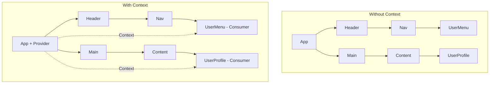
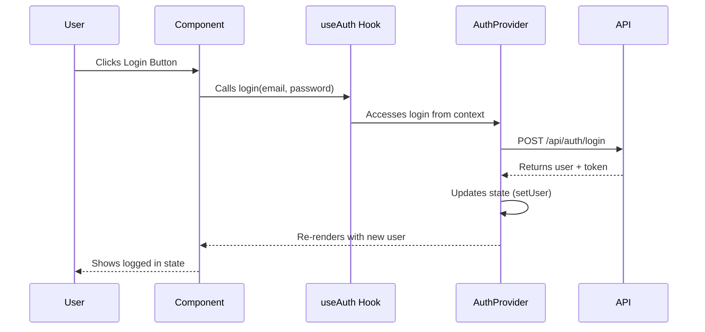
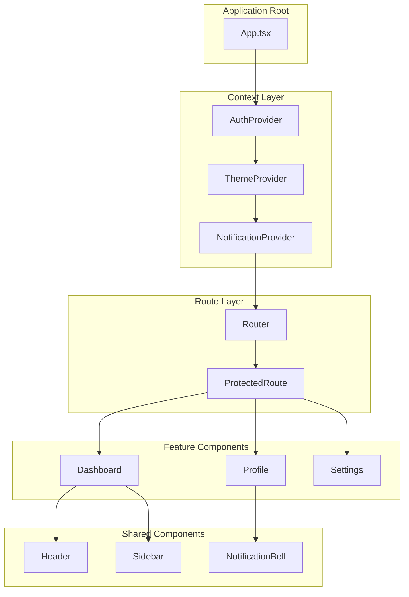

# How to Implement React Context

Author: [nawazdhandala](https://www.github.com/nawazdhandala)

Tags: React, Context API, State Management, JavaScript, TypeScript, Frontend, Web Development

Description: Learn how to implement React Context for state management in your applications. Master context creation, providers, consumers, custom hooks, and advanced patterns for building scalable React applications.

---

> Managing state across components without prop drilling is one of the most common challenges in React development. React Context provides a built-in solution for sharing data throughout your component tree without passing props manually at every level.

State management becomes increasingly complex as applications grow. Passing props through multiple component layers creates maintenance headaches and tightly couples your components. React Context solves these problems elegantly.

---

## Understanding React Context

React Context allows you to broadcast data to any component within a subtree without explicitly threading props through intermediate components. Think of it as a specialized tunnel that delivers data directly from a provider to any consumer that needs it.



---

## Creating Your First Context

The foundation of React Context involves three core concepts: creating the context, providing values, and consuming them.

Below is a basic example showing how to create and use a theme context for managing dark and light modes across your application.

```tsx
// ThemeContext.tsx
import React, { createContext, useContext, useState, ReactNode } from 'react';

// Define the shape of your context value
interface ThemeContextType {
  theme: 'light' | 'dark';
  toggleTheme: () => void;
}

// Create context with undefined as initial value
// We'll ensure it's never undefined when used
const ThemeContext = createContext<ThemeContextType | undefined>(undefined);

// Define props for the provider component
interface ThemeProviderProps {
  children: ReactNode;
}

// Create the provider component that wraps your app
export function ThemeProvider({ children }: ThemeProviderProps) {
  const [theme, setTheme] = useState<'light' | 'dark'>('light');

  // Toggle function to switch between themes
  const toggleTheme = () => {
    setTheme(prevTheme => prevTheme === 'light' ? 'dark' : 'light');
  };

  // Memoize the value to prevent unnecessary re-renders
  const value = { theme, toggleTheme };

  return (
    <ThemeContext.Provider value={value}>
      {children}
    </ThemeContext.Provider>
  );
}

// Custom hook for consuming the context safely
export function useTheme(): ThemeContextType {
  const context = useContext(ThemeContext);

  // Throw an error if used outside of provider
  if (context === undefined) {
    throw new Error('useTheme must be used within a ThemeProvider');
  }

  return context;
}
```

---

## Using the Context in Components

Once you have created your context and provider, consuming the values in any component becomes straightforward.

Here is how you would use the theme context in various components throughout your application.

```tsx
// App.tsx
import React from 'react';
import { ThemeProvider } from './ThemeContext';
import Header from './Header';
import Main from './Main';

// Wrap your entire app with the provider
function App() {
  return (
    <ThemeProvider>
      <div className="app">
        <Header />
        <Main />
      </div>
    </ThemeProvider>
  );
}

export default App;
```

The consuming component can access the context value using the custom hook you created.

```tsx
// ThemeToggle.tsx
import React from 'react';
import { useTheme } from './ThemeContext';

// Component that consumes the theme context
function ThemeToggle() {
  const { theme, toggleTheme } = useTheme();

  return (
    <button
      onClick={toggleTheme}
      style={{
        backgroundColor: theme === 'light' ? '#fff' : '#333',
        color: theme === 'light' ? '#333' : '#fff',
        padding: '10px 20px',
        border: 'none',
        borderRadius: '4px',
        cursor: 'pointer'
      }}
    >
      Current: {theme} mode - Click to toggle
    </button>
  );
}

export default ThemeToggle;
```

---

## Building a Complete Auth Context

Authentication state is a common use case for React Context. Here is a complete implementation that handles user authentication state, login, logout, and loading states.

```tsx
// AuthContext.tsx
import React, {
  createContext,
  useContext,
  useState,
  useEffect,
  ReactNode,
  useCallback
} from 'react';

// User type definition
interface User {
  id: string;
  email: string;
  name: string;
  avatar?: string;
}

// Auth context type with all necessary methods
interface AuthContextType {
  user: User | null;
  isAuthenticated: boolean;
  isLoading: boolean;
  login: (email: string, password: string) => Promise<void>;
  logout: () => Promise<void>;
  register: (email: string, password: string, name: string) => Promise<void>;
}

const AuthContext = createContext<AuthContextType | undefined>(undefined);

interface AuthProviderProps {
  children: ReactNode;
}

export function AuthProvider({ children }: AuthProviderProps) {
  const [user, setUser] = useState<User | null>(null);
  const [isLoading, setIsLoading] = useState(true);

  // Check for existing session on mount
  useEffect(() => {
    const checkAuth = async () => {
      try {
        const token = localStorage.getItem('auth_token');

        if (token) {
          // Validate token and fetch user data
          const response = await fetch('/api/auth/me', {
            headers: {
              'Authorization': `Bearer ${token}`
            }
          });

          if (response.ok) {
            const userData = await response.json();
            setUser(userData);
          } else {
            // Token is invalid, clear it
            localStorage.removeItem('auth_token');
          }
        }
      } catch (error) {
        console.error('Auth check failed:', error);
      } finally {
        setIsLoading(false);
      }
    };

    checkAuth();
  }, []);

  // Login function with API call
  const login = useCallback(async (email: string, password: string) => {
    setIsLoading(true);

    try {
      const response = await fetch('/api/auth/login', {
        method: 'POST',
        headers: {
          'Content-Type': 'application/json'
        },
        body: JSON.stringify({ email, password })
      });

      if (!response.ok) {
        throw new Error('Login failed');
      }

      const { user: userData, token } = await response.json();

      localStorage.setItem('auth_token', token);
      setUser(userData);
    } finally {
      setIsLoading(false);
    }
  }, []);

  // Logout function to clear session
  const logout = useCallback(async () => {
    try {
      await fetch('/api/auth/logout', { method: 'POST' });
    } catch (error) {
      console.error('Logout API call failed:', error);
    } finally {
      localStorage.removeItem('auth_token');
      setUser(null);
    }
  }, []);

  // Register function for new users
  const register = useCallback(async (
    email: string,
    password: string,
    name: string
  ) => {
    setIsLoading(true);

    try {
      const response = await fetch('/api/auth/register', {
        method: 'POST',
        headers: {
          'Content-Type': 'application/json'
        },
        body: JSON.stringify({ email, password, name })
      });

      if (!response.ok) {
        throw new Error('Registration failed');
      }

      const { user: userData, token } = await response.json();

      localStorage.setItem('auth_token', token);
      setUser(userData);
    } finally {
      setIsLoading(false);
    }
  }, []);

  const value: AuthContextType = {
    user,
    isAuthenticated: !!user,
    isLoading,
    login,
    logout,
    register
  };

  return (
    <AuthContext.Provider value={value}>
      {children}
    </AuthContext.Provider>
  );
}

// Custom hook with type safety
export function useAuth(): AuthContextType {
  const context = useContext(AuthContext);

  if (context === undefined) {
    throw new Error('useAuth must be used within an AuthProvider');
  }

  return context;
}
```

---

## Context Flow Visualization

Understanding how data flows through Context helps when debugging and optimizing your application.



---

## Creating a Protected Route Component

With authentication context in place, you can create components that restrict access based on authentication status.

```tsx
// ProtectedRoute.tsx
import React from 'react';
import { Navigate, useLocation } from 'react-router-dom';
import { useAuth } from './AuthContext';

interface ProtectedRouteProps {
  children: React.ReactNode;
  redirectTo?: string;
}

// Component that protects routes requiring authentication
function ProtectedRoute({
  children,
  redirectTo = '/login'
}: ProtectedRouteProps) {
  const { isAuthenticated, isLoading } = useAuth();
  const location = useLocation();

  // Show loading state while checking auth
  if (isLoading) {
    return (
      <div className="loading-container">
        <div className="spinner" />
        <p>Verifying authentication...</p>
      </div>
    );
  }

  // Redirect to login if not authenticated
  if (!isAuthenticated) {
    return (
      <Navigate
        to={redirectTo}
        state={{ from: location }}
        replace
      />
    );
  }

  // Render protected content
  return <>{children}</>;
}

export default ProtectedRoute;
```

---

## Combining Multiple Contexts

Large applications often require multiple contexts. Here is a pattern for combining them without creating deeply nested provider trees.

```tsx
// CombinedProviders.tsx
import React, { ReactNode } from 'react';
import { ThemeProvider } from './ThemeContext';
import { AuthProvider } from './AuthContext';
import { NotificationProvider } from './NotificationContext';

interface ProvidersProps {
  children: ReactNode;
}

// Utility function to compose providers
function composeProviders(
  providers: React.ComponentType<{ children: ReactNode }>[]
) {
  return function ComposedProvider({ children }: { children: ReactNode }) {
    return providers.reduceRight(
      (acc, Provider) => <Provider>{acc}</Provider>,
      children
    );
  };
}

// Create the combined provider
export const AppProviders = composeProviders([
  ThemeProvider,
  AuthProvider,
  NotificationProvider
]);

// Usage in your app entry point
function App() {
  return (
    <AppProviders>
      <Router>
        <AppContent />
      </Router>
    </AppProviders>
  );
}
```

---

## Performance Optimization

Context re-renders all consumers when the provider value changes. Implementing proper optimization prevents unnecessary re-renders.

The following example shows how to split context values to minimize re-renders when only part of the state changes.

```tsx
// OptimizedContext.tsx
import React, {
  createContext,
  useContext,
  useState,
  useMemo,
  useCallback,
  ReactNode
} from 'react';

interface User {
  id: string;
  name: string;
  preferences: {
    theme: string;
    language: string;
  };
}

// Separate contexts for state and actions
// Consumers only re-render when their specific context changes
const UserStateContext = createContext<User | null>(null);
const UserActionsContext = createContext<{
  updateName: (name: string) => void;
  updatePreferences: (prefs: Partial<User['preferences']>) => void;
} | null>(null);

interface UserProviderProps {
  children: ReactNode;
}

export function UserProvider({ children }: UserProviderProps) {
  const [user, setUser] = useState<User>({
    id: '1',
    name: 'John Doe',
    preferences: {
      theme: 'light',
      language: 'en'
    }
  });

  // Memoize action functions to maintain referential equality
  const updateName = useCallback((name: string) => {
    setUser(prev => ({ ...prev, name }));
  }, []);

  const updatePreferences = useCallback((
    prefs: Partial<User['preferences']>
  ) => {
    setUser(prev => ({
      ...prev,
      preferences: { ...prev.preferences, ...prefs }
    }));
  }, []);

  // Memoize the actions object
  const actions = useMemo(() => ({
    updateName,
    updatePreferences
  }), [updateName, updatePreferences]);

  return (
    <UserStateContext.Provider value={user}>
      <UserActionsContext.Provider value={actions}>
        {children}
      </UserActionsContext.Provider>
    </UserStateContext.Provider>
  );
}

// Hook for accessing user state
export function useUserState(): User {
  const context = useContext(UserStateContext);

  if (context === null) {
    throw new Error('useUserState must be used within UserProvider');
  }

  return context;
}

// Hook for accessing user actions only
export function useUserActions() {
  const context = useContext(UserActionsContext);

  if (context === null) {
    throw new Error('useUserActions must be used within UserProvider');
  }

  return context;
}
```

---

## Context State Architecture

A clear architectural diagram helps teams understand how context fits into the overall application structure.



---

## Building a Notification System

Notifications are another excellent use case for Context. Here is a complete implementation with support for different notification types and auto-dismiss functionality.

```tsx
// NotificationContext.tsx
import React, {
  createContext,
  useContext,
  useState,
  useCallback,
  ReactNode
} from 'react';

// Notification type definitions
type NotificationType = 'success' | 'error' | 'warning' | 'info';

interface Notification {
  id: string;
  type: NotificationType;
  message: string;
  duration?: number;
}

interface NotificationContextType {
  notifications: Notification[];
  addNotification: (
    type: NotificationType,
    message: string,
    duration?: number
  ) => void;
  removeNotification: (id: string) => void;
  clearAll: () => void;
}

const NotificationContext = createContext<NotificationContextType | undefined>(
  undefined
);

// Generate unique IDs for notifications
let notificationId = 0;
const generateId = () => `notification-${++notificationId}`;

interface NotificationProviderProps {
  children: ReactNode;
  defaultDuration?: number;
}

export function NotificationProvider({
  children,
  defaultDuration = 5000
}: NotificationProviderProps) {
  const [notifications, setNotifications] = useState<Notification[]>([]);

  // Add a new notification with optional auto-dismiss
  const addNotification = useCallback((
    type: NotificationType,
    message: string,
    duration: number = defaultDuration
  ) => {
    const id = generateId();

    const notification: Notification = {
      id,
      type,
      message,
      duration
    };

    setNotifications(prev => [...prev, notification]);

    // Auto-dismiss after duration (0 means no auto-dismiss)
    if (duration > 0) {
      setTimeout(() => {
        setNotifications(prev =>
          prev.filter(n => n.id !== id)
        );
      }, duration);
    }
  }, [defaultDuration]);

  // Remove a specific notification
  const removeNotification = useCallback((id: string) => {
    setNotifications(prev => prev.filter(n => n.id !== id));
  }, []);

  // Clear all notifications
  const clearAll = useCallback(() => {
    setNotifications([]);
  }, []);

  const value: NotificationContextType = {
    notifications,
    addNotification,
    removeNotification,
    clearAll
  };

  return (
    <NotificationContext.Provider value={value}>
      {children}
      <NotificationContainer />
    </NotificationContext.Provider>
  );
}

// Custom hook for accessing notifications
export function useNotifications(): NotificationContextType {
  const context = useContext(NotificationContext);

  if (context === undefined) {
    throw new Error(
      'useNotifications must be used within NotificationProvider'
    );
  }

  return context;
}

// Notification display component
function NotificationContainer() {
  const { notifications, removeNotification } = useNotifications();

  return (
    <div className="notification-container">
      {notifications.map(notification => (
        <div
          key={notification.id}
          className={`notification notification-${notification.type}`}
        >
          <span>{notification.message}</span>
          <button
            onClick={() => removeNotification(notification.id)}
            className="notification-close"
          >
            x
          </button>
        </div>
      ))}
    </div>
  );
}
```

---

## Convenience Hooks for Notifications

Creating shorthand hooks makes the notification system more pleasant to use throughout your application.

```tsx
// useNotificationHelpers.ts
import { useCallback } from 'react';
import { useNotifications } from './NotificationContext';

// Convenience hooks for common notification types
export function useNotificationHelpers() {
  const { addNotification } = useNotifications();

  const success = useCallback((message: string, duration?: number) => {
    addNotification('success', message, duration);
  }, [addNotification]);

  const error = useCallback((message: string, duration?: number) => {
    addNotification('error', message, duration);
  }, [addNotification]);

  const warning = useCallback((message: string, duration?: number) => {
    addNotification('warning', message, duration);
  }, [addNotification]);

  const info = useCallback((message: string, duration?: number) => {
    addNotification('info', message, duration);
  }, [addNotification]);

  return { success, error, warning, info };
}

// Usage example in a component
function SaveButton() {
  const { success, error } = useNotificationHelpers();
  const { user } = useAuth();

  const handleSave = async () => {
    try {
      await saveUserData(user);
      success('Your changes have been saved successfully!');
    } catch (err) {
      error('Failed to save changes. Please try again.');
    }
  };

  return (
    <button onClick={handleSave}>
      Save Changes
    </button>
  );
}
```

---

## Testing Context Components

Writing tests for context-based components requires wrapping them with the appropriate providers.

```tsx
// AuthContext.test.tsx
import React from 'react';
import { render, screen, waitFor } from '@testing-library/react';
import userEvent from '@testing-library/user-event';
import { AuthProvider, useAuth } from './AuthContext';

// Test component that uses the auth context
function TestComponent() {
  const { user, isAuthenticated, login, logout } = useAuth();

  return (
    <div>
      <p data-testid="auth-status">
        {isAuthenticated ? 'Logged In' : 'Logged Out'}
      </p>
      {user && <p data-testid="user-name">{user.name}</p>}
      <button onClick={() => login('test@example.com', 'password')}>
        Login
      </button>
      <button onClick={logout}>Logout</button>
    </div>
  );
}

// Custom render function with providers
function renderWithAuth(component: React.ReactElement) {
  return render(
    <AuthProvider>
      {component}
    </AuthProvider>
  );
}

describe('AuthContext', () => {
  beforeEach(() => {
    // Mock fetch API
    global.fetch = jest.fn();
    localStorage.clear();
  });

  test('starts in logged out state', () => {
    renderWithAuth(<TestComponent />);

    expect(screen.getByTestId('auth-status')).toHaveTextContent('Logged Out');
  });

  test('login updates authentication state', async () => {
    // Mock successful login response
    (global.fetch as jest.Mock).mockResolvedValueOnce({
      ok: true,
      json: async () => ({
        user: { id: '1', name: 'Test User', email: 'test@example.com' },
        token: 'mock-token'
      })
    });

    renderWithAuth(<TestComponent />);

    await userEvent.click(screen.getByText('Login'));

    await waitFor(() => {
      expect(screen.getByTestId('auth-status')).toHaveTextContent('Logged In');
      expect(screen.getByTestId('user-name')).toHaveTextContent('Test User');
    });
  });

  test('logout clears authentication state', async () => {
    // Setup: mock login first
    (global.fetch as jest.Mock)
      .mockResolvedValueOnce({
        ok: true,
        json: async () => ({
          user: { id: '1', name: 'Test User', email: 'test@example.com' },
          token: 'mock-token'
        })
      })
      .mockResolvedValueOnce({ ok: true });

    renderWithAuth(<TestComponent />);

    await userEvent.click(screen.getByText('Login'));

    await waitFor(() => {
      expect(screen.getByTestId('auth-status')).toHaveTextContent('Logged In');
    });

    await userEvent.click(screen.getByText('Logout'));

    await waitFor(() => {
      expect(screen.getByTestId('auth-status')).toHaveTextContent('Logged Out');
    });
  });

  test('throws error when used outside provider', () => {
    // Suppress console.error for this test
    const consoleSpy = jest.spyOn(console, 'error').mockImplementation();

    expect(() => {
      render(<TestComponent />);
    }).toThrow('useAuth must be used within an AuthProvider');

    consoleSpy.mockRestore();
  });
});
```

---

## When to Use Context vs Other Solutions

Context is powerful but not always the right choice. Here is a comparison table to help you decide.

| Scenario | Recommendation | Why |
|----------|---------------|-----|
| Theme/locale settings | Context | Rarely changes, many consumers |
| User authentication | Context | Global state, moderate updates |
| Form state | Local state or form library | Frequent updates, localized |
| Server cache | React Query/SWR | Built-in caching, deduplication |
| Complex state logic | Context + useReducer or Zustand | Better organization |
| High-frequency updates | Zustand/Jotai | Avoids re-render cascade |

---

## Advanced Pattern: Context with Reducer

For complex state management, combining Context with useReducer provides better organization and predictability.

```tsx
// CartContext.tsx
import React, {
  createContext,
  useContext,
  useReducer,
  ReactNode,
  Dispatch
} from 'react';

// Cart item type
interface CartItem {
  id: string;
  name: string;
  price: number;
  quantity: number;
}

// Cart state type
interface CartState {
  items: CartItem[];
  total: number;
}

// Action types for the reducer
type CartAction =
  | { type: 'ADD_ITEM'; payload: Omit<CartItem, 'quantity'> }
  | { type: 'REMOVE_ITEM'; payload: string }
  | { type: 'UPDATE_QUANTITY'; payload: { id: string; quantity: number } }
  | { type: 'CLEAR_CART' };

// Calculate total from items
function calculateTotal(items: CartItem[]): number {
  return items.reduce(
    (sum, item) => sum + item.price * item.quantity,
    0
  );
}

// Reducer function with all cart logic
function cartReducer(state: CartState, action: CartAction): CartState {
  switch (action.type) {
    case 'ADD_ITEM': {
      const existingItem = state.items.find(
        item => item.id === action.payload.id
      );

      let newItems: CartItem[];

      if (existingItem) {
        // Increase quantity if item exists
        newItems = state.items.map(item =>
          item.id === action.payload.id
            ? { ...item, quantity: item.quantity + 1 }
            : item
        );
      } else {
        // Add new item with quantity 1
        newItems = [...state.items, { ...action.payload, quantity: 1 }];
      }

      return {
        items: newItems,
        total: calculateTotal(newItems)
      };
    }

    case 'REMOVE_ITEM': {
      const newItems = state.items.filter(
        item => item.id !== action.payload
      );

      return {
        items: newItems,
        total: calculateTotal(newItems)
      };
    }

    case 'UPDATE_QUANTITY': {
      const { id, quantity } = action.payload;

      if (quantity <= 0) {
        // Remove item if quantity is 0 or less
        const newItems = state.items.filter(item => item.id !== id);
        return {
          items: newItems,
          total: calculateTotal(newItems)
        };
      }

      const newItems = state.items.map(item =>
        item.id === id ? { ...item, quantity } : item
      );

      return {
        items: newItems,
        total: calculateTotal(newItems)
      };
    }

    case 'CLEAR_CART':
      return {
        items: [],
        total: 0
      };

    default:
      return state;
  }
}

// Initial state
const initialState: CartState = {
  items: [],
  total: 0
};

// Context types
interface CartContextType {
  state: CartState;
  dispatch: Dispatch<CartAction>;
  // Convenience methods
  addItem: (item: Omit<CartItem, 'quantity'>) => void;
  removeItem: (id: string) => void;
  updateQuantity: (id: string, quantity: number) => void;
  clearCart: () => void;
  itemCount: number;
}

const CartContext = createContext<CartContextType | undefined>(undefined);

interface CartProviderProps {
  children: ReactNode;
}

export function CartProvider({ children }: CartProviderProps) {
  const [state, dispatch] = useReducer(cartReducer, initialState);

  // Convenience methods that dispatch actions
  const addItem = (item: Omit<CartItem, 'quantity'>) => {
    dispatch({ type: 'ADD_ITEM', payload: item });
  };

  const removeItem = (id: string) => {
    dispatch({ type: 'REMOVE_ITEM', payload: id });
  };

  const updateQuantity = (id: string, quantity: number) => {
    dispatch({ type: 'UPDATE_QUANTITY', payload: { id, quantity } });
  };

  const clearCart = () => {
    dispatch({ type: 'CLEAR_CART' });
  };

  // Calculate total item count
  const itemCount = state.items.reduce(
    (count, item) => count + item.quantity,
    0
  );

  const value: CartContextType = {
    state,
    dispatch,
    addItem,
    removeItem,
    updateQuantity,
    clearCart,
    itemCount
  };

  return (
    <CartContext.Provider value={value}>
      {children}
    </CartContext.Provider>
  );
}

export function useCart(): CartContextType {
  const context = useContext(CartContext);

  if (context === undefined) {
    throw new Error('useCart must be used within a CartProvider');
  }

  return context;
}
```

---

## Best Practices Summary

Following these guidelines will help you build maintainable context-based state management.

| Practice | Description |
|----------|-------------|
| Create custom hooks | Always wrap useContext in a custom hook with error handling |
| Split state and actions | Separate contexts for values and updaters to reduce re-renders |
| Memoize values | Use useMemo for objects and useCallback for functions |
| Type everything | TypeScript interfaces catch errors early |
| Keep contexts focused | One responsibility per context |
| Test with wrappers | Create reusable test utilities with providers |

---

## Conclusion

React Context provides a powerful built-in solution for state management that scales well for many use cases. By understanding when to use it, how to optimize performance, and following established patterns, you can build maintainable React applications without reaching for external state management libraries.

Key takeaways:

- **Custom hooks are essential** for safe context consumption
- **Split contexts** when parts of your state update independently
- **Combine with useReducer** for complex state logic
- **Test thoroughly** with provider wrappers
- **Know when to reach for alternatives** like Zustand or React Query

Start with Context for global UI state like themes, authentication, and notifications. Evaluate more specialized solutions when you encounter performance issues or need features like time-travel debugging.

---

*Want to monitor your React application in production? [OneUptime](https://oneuptime.com) provides real user monitoring, error tracking, and performance insights for frontend applications.*

**Related Reading:**
- [How to Optimize React Performance](https://oneuptime.com/blog/post/2026-01-07-ceph-nvme-performance-optimization/view)
