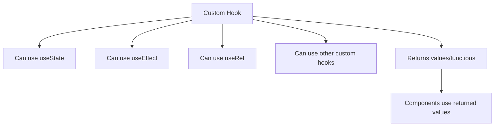
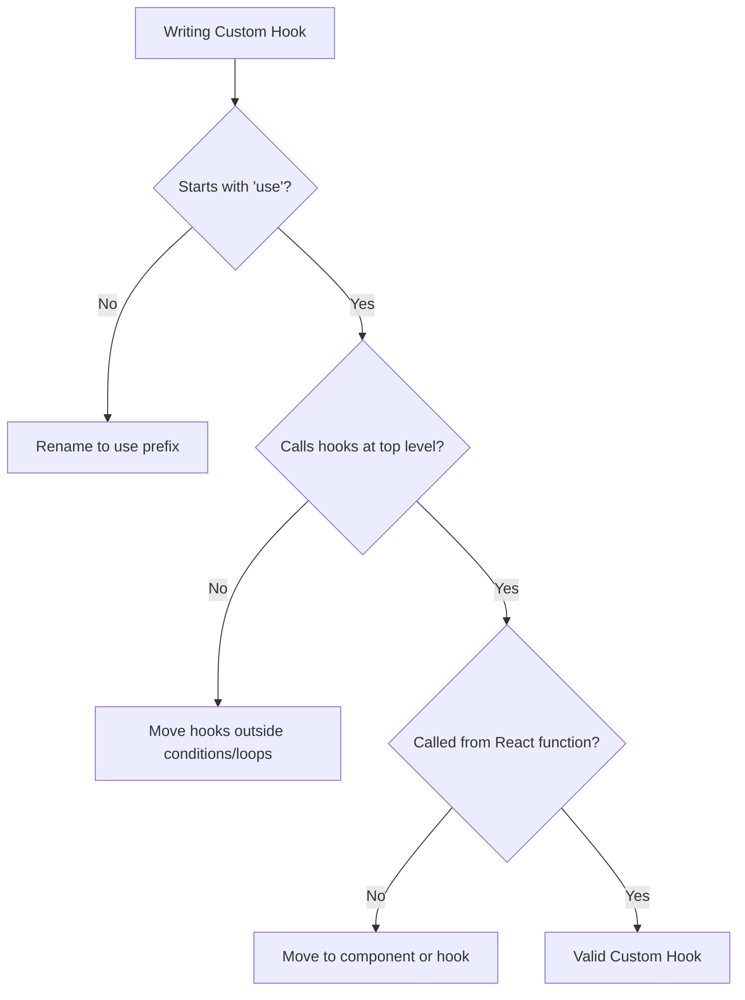
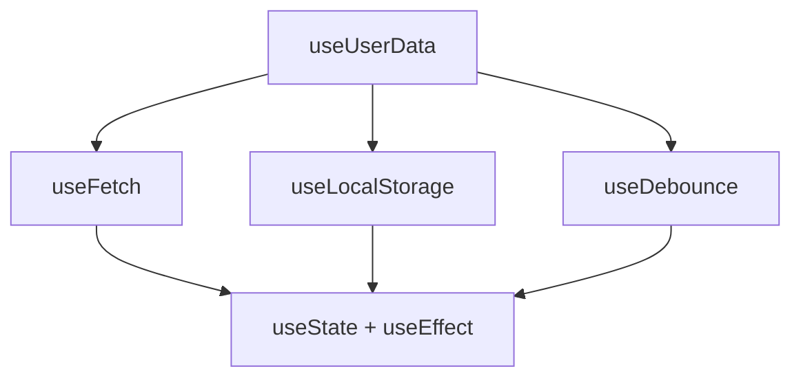

# How to Build Custom Hooks in React

Author: [nawazdhandala](https://www.github.com/nawazdhandala)

Tags: React, Hooks, Custom Hooks, JavaScript

Description: A comprehensive guide to building custom hooks in React. Learn how to extract reusable logic, create hooks for common patterns like data fetching and forms, handle complex state, and follow best practices for maintainable code.

---

Custom hooks are one of the most powerful features in React. They allow you to extract component logic into reusable functions, keeping your components clean and your code DRY. Instead of copying and pasting the same useEffect and useState patterns across multiple components, you can create a single hook that encapsulates that logic. This guide walks you through everything you need to know about building custom hooks, from basic principles to advanced patterns used in production applications.

## What Are Custom Hooks?

A custom hook is a JavaScript function that starts with "use" and can call other hooks. That naming convention is important because it tells React that this function follows the rules of hooks and allows the linter to check for violations.



The power of custom hooks comes from composition. You can combine multiple built-in hooks and even other custom hooks to create sophisticated, reusable logic. Unlike render props or higher-order components, custom hooks do not add extra components to your tree. They are pure functions that share stateful logic without sharing state itself.

## Your First Custom Hook

Let us start with a simple example. Suppose you need to track the mouse position in multiple components. Without custom hooks, you would duplicate this code everywhere.

This hook tracks the mouse position and returns the current x and y coordinates. It sets up an event listener on mount and cleans it up on unmount to prevent memory leaks.

```javascript
import { useState, useEffect } from 'react';

// Custom hook to track mouse position
// Returns an object with x and y coordinates
function useMousePosition() {
  // Initialize state to track cursor position
  const [position, setPosition] = useState({ x: 0, y: 0 });

  useEffect(() => {
    // Handler to update position on mouse move
    function handleMouseMove(event) {
      setPosition({
        x: event.clientX,
        y: event.clientY
      });
    }

    // Subscribe to mouse move events
    window.addEventListener('mousemove', handleMouseMove);

    // Cleanup: remove listener when component unmounts
    return () => {
      window.removeEventListener('mousemove', handleMouseMove);
    };
  }, []); // Empty array means this effect runs once on mount

  return position;
}

// Usage in any component
function MouseTracker() {
  const { x, y } = useMousePosition();

  return (
    <div>
      Mouse position: ({x}, {y})
    </div>
  );
}

// Reuse in another component
function Tooltip({ children }) {
  const { x, y } = useMousePosition();

  return (
    <div style={{ position: 'fixed', left: x + 10, top: y + 10 }}>
      {children}
    </div>
  );
}
```

Notice how both components use the same hook but have completely independent state. Each call to useMousePosition creates its own isolated state. This is a fundamental principle of hooks.

## The Rules of Custom Hooks

Custom hooks must follow the same rules as built-in hooks:

1. **Only call hooks at the top level** - never inside loops, conditions, or nested functions
2. **Only call hooks from React functions** - either components or other custom hooks
3. **Start the name with "use"** - this allows React to automatically check for rule violations



Breaking these rules causes bugs that are difficult to track because React relies on the order of hook calls to maintain state correctly between renders.

## Building a Data Fetching Hook

Data fetching is one of the most common use cases for custom hooks. Every component that fetches data needs loading states, error handling, and cleanup. Extracting this into a hook makes your components much cleaner.

This hook handles all the common concerns of data fetching: loading state, error state, automatic refetching when the URL changes, and preventing state updates on unmounted components.

```javascript
import { useState, useEffect, useCallback } from 'react';

// Generic data fetching hook
// Handles loading, error states, and cleanup
function useFetch(url, options = {}) {
  const [data, setData] = useState(null);
  const [loading, setLoading] = useState(true);
  const [error, setError] = useState(null);

  // Memoize the refetch function so it can be used in dependency arrays
  const refetch = useCallback(async () => {
    setLoading(true);
    setError(null);

    try {
      const response = await fetch(url, options);

      // Handle HTTP errors
      if (!response.ok) {
        throw new Error(`HTTP error! Status: ${response.status}`);
      }

      const json = await response.json();
      setData(json);
    } catch (err) {
      setError(err.message);
    } finally {
      setLoading(false);
    }
  }, [url, JSON.stringify(options)]);

  useEffect(() => {
    // Track if component is still mounted
    let isMounted = true;

    async function fetchData() {
      setLoading(true);
      setError(null);

      try {
        const response = await fetch(url, options);

        if (!response.ok) {
          throw new Error(`HTTP error! Status: ${response.status}`);
        }

        const json = await response.json();

        // Only update state if component is still mounted
        if (isMounted) {
          setData(json);
          setLoading(false);
        }
      } catch (err) {
        if (isMounted) {
          setError(err.message);
          setLoading(false);
        }
      }
    }

    fetchData();

    // Cleanup function to prevent memory leaks
    return () => {
      isMounted = false;
    };
  }, [url, JSON.stringify(options)]);

  return { data, loading, error, refetch };
}

// Usage example: fetching user data
function UserProfile({ userId }) {
  const { data: user, loading, error, refetch } = useFetch(
    `/api/users/${userId}`
  );

  if (loading) return <div>Loading...</div>;
  if (error) return <div>Error: {error}</div>;

  return (
    <div>
      <h1>{user.name}</h1>
      <p>{user.email}</p>
      <button onClick={refetch}>Refresh</button>
    </div>
  );
}

// Usage example: fetching with options
function ProtectedData() {
  const { data, loading, error } = useFetch('/api/protected', {
    headers: {
      Authorization: `Bearer ${getToken()}`
    }
  });

  if (loading) return <Spinner />;
  if (error) return <ErrorMessage message={error} />;

  return <DataDisplay data={data} />;
}
```

## Building a Form Hook

Forms involve repetitive logic: tracking values, handling changes, validating inputs, and managing submission. A well-designed form hook can handle all of this while keeping your component code focused on the UI.

This hook manages form state, validation, touched fields tracking, and submission. It provides all the handlers needed to wire up a form quickly.

```javascript
import { useState, useCallback, useMemo } from 'react';

// Comprehensive form handling hook
function useForm(initialValues, validationRules = {}) {
  // Store form values
  const [values, setValues] = useState(initialValues);
  // Track which fields have been touched (for validation display)
  const [touched, setTouched] = useState({});
  // Store validation errors
  const [errors, setErrors] = useState({});
  // Track submission state
  const [isSubmitting, setIsSubmitting] = useState(false);

  // Validate a single field against its rules
  const validateField = useCallback((name, value) => {
    const rules = validationRules[name];
    if (!rules) return '';

    // Check required
    if (rules.required && !value) {
      return rules.required === true ? 'This field is required' : rules.required;
    }

    // Check minimum length
    if (rules.minLength && value.length < rules.minLength) {
      return `Must be at least ${rules.minLength} characters`;
    }

    // Check maximum length
    if (rules.maxLength && value.length > rules.maxLength) {
      return `Must be no more than ${rules.maxLength} characters`;
    }

    // Check pattern (regex)
    if (rules.pattern && !rules.pattern.test(value)) {
      return rules.patternMessage || 'Invalid format';
    }

    // Check custom validation function
    if (rules.validate) {
      const result = rules.validate(value, values);
      if (typeof result === 'string') return result;
      if (result === false) return 'Invalid value';
    }

    return '';
  }, [validationRules, values]);

  // Validate all fields
  const validateAll = useCallback(() => {
    const newErrors = {};
    let isValid = true;

    Object.keys(validationRules).forEach(name => {
      const error = validateField(name, values[name]);
      if (error) {
        newErrors[name] = error;
        isValid = false;
      }
    });

    setErrors(newErrors);
    return isValid;
  }, [validateField, validationRules, values]);

  // Handle input changes
  const handleChange = useCallback((event) => {
    const { name, value, type, checked } = event.target;
    const newValue = type === 'checkbox' ? checked : value;

    setValues(prev => ({
      ...prev,
      [name]: newValue
    }));

    // Clear error when user starts typing
    if (errors[name]) {
      setErrors(prev => ({
        ...prev,
        [name]: ''
      }));
    }
  }, [errors]);

  // Handle field blur (for showing validation on touch)
  const handleBlur = useCallback((event) => {
    const { name, value } = event.target;

    setTouched(prev => ({
      ...prev,
      [name]: true
    }));

    // Validate on blur
    const error = validateField(name, value);
    setErrors(prev => ({
      ...prev,
      [name]: error
    }));
  }, [validateField]);

  // Create submit handler
  const handleSubmit = useCallback((onSubmit) => async (event) => {
    event.preventDefault();

    // Mark all fields as touched
    const allTouched = Object.keys(values).reduce((acc, key) => {
      acc[key] = true;
      return acc;
    }, {});
    setTouched(allTouched);

    // Validate all fields
    if (!validateAll()) {
      return;
    }

    setIsSubmitting(true);

    try {
      await onSubmit(values);
    } catch (err) {
      setErrors(prev => ({
        ...prev,
        _form: err.message
      }));
    } finally {
      setIsSubmitting(false);
    }
  }, [values, validateAll]);

  // Reset form to initial state
  const reset = useCallback(() => {
    setValues(initialValues);
    setTouched({});
    setErrors({});
    setIsSubmitting(false);
  }, [initialValues]);

  // Set a specific field value programmatically
  const setFieldValue = useCallback((name, value) => {
    setValues(prev => ({
      ...prev,
      [name]: value
    }));
  }, []);

  // Helper to get props for an input field
  const getFieldProps = useCallback((name) => ({
    name,
    value: values[name] || '',
    onChange: handleChange,
    onBlur: handleBlur
  }), [values, handleChange, handleBlur]);

  // Computed property for form validity
  const isValid = useMemo(() => {
    return Object.keys(errors).every(key => !errors[key]);
  }, [errors]);

  return {
    values,
    errors,
    touched,
    isSubmitting,
    isValid,
    handleChange,
    handleBlur,
    handleSubmit,
    reset,
    setFieldValue,
    getFieldProps
  };
}

// Usage example with validation
function RegistrationForm() {
  const {
    values,
    errors,
    touched,
    isSubmitting,
    handleSubmit,
    getFieldProps
  } = useForm(
    {
      email: '',
      password: '',
      confirmPassword: ''
    },
    {
      email: {
        required: 'Email is required',
        pattern: /^[^\s@]+@[^\s@]+\.[^\s@]+$/,
        patternMessage: 'Please enter a valid email'
      },
      password: {
        required: 'Password is required',
        minLength: 8
      },
      confirmPassword: {
        required: 'Please confirm your password',
        validate: (value, allValues) => {
          if (value !== allValues.password) {
            return 'Passwords do not match';
          }
          return true;
        }
      }
    }
  );

  const onSubmit = async (formValues) => {
    await registerUser(formValues);
    alert('Registration successful!');
  };

  return (
    <form onSubmit={handleSubmit(onSubmit)}>
      <div>
        <label htmlFor="email">Email</label>
        <input
          type="email"
          id="email"
          {...getFieldProps('email')}
        />
        {touched.email && errors.email && (
          <span className="error">{errors.email}</span>
        )}
      </div>

      <div>
        <label htmlFor="password">Password</label>
        <input
          type="password"
          id="password"
          {...getFieldProps('password')}
        />
        {touched.password && errors.password && (
          <span className="error">{errors.password}</span>
        )}
      </div>

      <div>
        <label htmlFor="confirmPassword">Confirm Password</label>
        <input
          type="password"
          id="confirmPassword"
          {...getFieldProps('confirmPassword')}
        />
        {touched.confirmPassword && errors.confirmPassword && (
          <span className="error">{errors.confirmPassword}</span>
        )}
      </div>

      {errors._form && (
        <div className="form-error">{errors._form}</div>
      )}

      <button type="submit" disabled={isSubmitting}>
        {isSubmitting ? 'Registering...' : 'Register'}
      </button>
    </form>
  );
}
```

## Building a Local Storage Hook

Persisting state to localStorage is a common requirement. This hook syncs state with localStorage and handles edge cases like server-side rendering, JSON parsing errors, and storage events from other tabs.

This hook persists state to localStorage and keeps it in sync. It handles JSON serialization, SSR compatibility, and updates when other tabs change the value.

```javascript
import { useState, useEffect, useCallback } from 'react';

// Hook to sync state with localStorage
function useLocalStorage(key, initialValue) {
  // Get stored value or use initial value
  // Using lazy initialization to avoid reading localStorage on every render
  const [storedValue, setStoredValue] = useState(() => {
    // Handle SSR where window is not available
    if (typeof window === 'undefined') {
      return initialValue;
    }

    try {
      const item = window.localStorage.getItem(key);
      // Parse stored json or return initialValue if nothing stored
      return item ? JSON.parse(item) : initialValue;
    } catch (error) {
      // If error parsing JSON, return initialValue
      console.warn(`Error reading localStorage key "${key}":`, error);
      return initialValue;
    }
  });

  // Wrapped setter function that persists to localStorage
  const setValue = useCallback((value) => {
    try {
      // Allow value to be a function for same API as useState
      const valueToStore = value instanceof Function
        ? value(storedValue)
        : value;

      // Save state
      setStoredValue(valueToStore);

      // Save to localStorage
      if (typeof window !== 'undefined') {
        window.localStorage.setItem(key, JSON.stringify(valueToStore));
      }
    } catch (error) {
      console.warn(`Error setting localStorage key "${key}":`, error);
    }
  }, [key, storedValue]);

  // Remove value from localStorage
  const removeValue = useCallback(() => {
    try {
      setStoredValue(initialValue);
      if (typeof window !== 'undefined') {
        window.localStorage.removeItem(key);
      }
    } catch (error) {
      console.warn(`Error removing localStorage key "${key}":`, error);
    }
  }, [key, initialValue]);

  // Listen for changes in other tabs/windows
  useEffect(() => {
    function handleStorageChange(event) {
      if (event.key === key && event.newValue !== null) {
        try {
          setStoredValue(JSON.parse(event.newValue));
        } catch {
          console.warn(`Error parsing storage event for key "${key}"`);
        }
      }
    }

    // Subscribe to storage events
    window.addEventListener('storage', handleStorageChange);

    return () => {
      window.removeEventListener('storage', handleStorageChange);
    };
  }, [key]);

  return [storedValue, setValue, removeValue];
}

// Usage example: persisting user preferences
function Settings() {
  const [theme, setTheme] = useLocalStorage('theme', 'light');
  const [fontSize, setFontSize] = useLocalStorage('fontSize', 16);

  return (
    <div>
      <select value={theme} onChange={e => setTheme(e.target.value)}>
        <option value="light">Light</option>
        <option value="dark">Dark</option>
      </select>

      <input
        type="range"
        min="12"
        max="24"
        value={fontSize}
        onChange={e => setFontSize(Number(e.target.value))}
      />
      <span>{fontSize}px</span>
    </div>
  );
}

// Usage example: persisting form draft
function CommentForm() {
  const [draft, setDraft, clearDraft] = useLocalStorage('commentDraft', '');

  const handleSubmit = async (e) => {
    e.preventDefault();
    await submitComment(draft);
    clearDraft();
  };

  return (
    <form onSubmit={handleSubmit}>
      <textarea
        value={draft}
        onChange={e => setDraft(e.target.value)}
        placeholder="Write a comment..."
      />
      <button type="submit">Submit</button>
      <button type="button" onClick={clearDraft}>Clear</button>
    </form>
  );
}
```

## Building a Debounce Hook

Debouncing is essential for search inputs and other rapidly changing values. This hook delays updating a value until after a specified period of inactivity.

This hook returns a debounced version of any value. Updates are delayed until the value stops changing for the specified delay period.

```javascript
import { useState, useEffect } from 'react';

// Hook to debounce any fast-changing value
function useDebounce(value, delay = 500) {
  const [debouncedValue, setDebouncedValue] = useState(value);

  useEffect(() => {
    // Set up a timer to update the debounced value
    const timer = setTimeout(() => {
      setDebouncedValue(value);
    }, delay);

    // Cleanup: cancel the timer if value changes before delay completes
    return () => {
      clearTimeout(timer);
    };
  }, [value, delay]);

  return debouncedValue;
}

// Usage example: search with debounce
function SearchComponent() {
  const [searchTerm, setSearchTerm] = useState('');
  // Only search after user stops typing for 300ms
  const debouncedSearch = useDebounce(searchTerm, 300);

  const { data: results, loading } = useFetch(
    debouncedSearch
      ? `/api/search?q=${encodeURIComponent(debouncedSearch)}`
      : null
  );

  return (
    <div>
      <input
        type="text"
        value={searchTerm}
        onChange={e => setSearchTerm(e.target.value)}
        placeholder="Search..."
      />
      {loading && <div>Searching...</div>}
      {results && (
        <ul>
          {results.map(item => (
            <li key={item.id}>{item.title}</li>
          ))}
        </ul>
      )}
    </div>
  );
}
```

## Building a Window Size Hook

Responsive components sometimes need to know the window dimensions. This hook tracks window size changes efficiently using a resize observer.

This hook returns the current window dimensions and updates when the window is resized. It includes debouncing to prevent excessive re-renders during resize.

```javascript
import { useState, useEffect } from 'react';

// Hook to track window dimensions
function useWindowSize() {
  // Initialize with undefined for SSR compatibility
  const [windowSize, setWindowSize] = useState({
    width: undefined,
    height: undefined
  });

  useEffect(() => {
    // Handler to call on window resize
    function handleResize() {
      setWindowSize({
        width: window.innerWidth,
        height: window.innerHeight
      });
    }

    // Set initial size
    handleResize();

    // Add event listener with passive option for performance
    window.addEventListener('resize', handleResize, { passive: true });

    // Remove event listener on cleanup
    return () => {
      window.removeEventListener('resize', handleResize);
    };
  }, []); // Empty array ensures effect runs only on mount/unmount

  return windowSize;
}

// Hook with breakpoint detection
function useBreakpoint() {
  const { width } = useWindowSize();

  // Define breakpoints matching common frameworks
  const breakpoints = {
    xs: width < 576,
    sm: width >= 576 && width < 768,
    md: width >= 768 && width < 992,
    lg: width >= 992 && width < 1200,
    xl: width >= 1200
  };

  // Current breakpoint name
  const current = Object.entries(breakpoints)
    .find(([, matches]) => matches)?.[0] || 'xs';

  return {
    ...breakpoints,
    current,
    width
  };
}

// Usage example
function ResponsiveLayout({ children }) {
  const { current, md } = useBreakpoint();

  return (
    <div className={`layout layout-${current}`}>
      {!md && <MobileNav />}
      {md && <DesktopNav />}
      <main>{children}</main>
    </div>
  );
}
```

## Building an Async Hook

Managing async operations with loading, success, and error states is repetitive. This hook provides a clean pattern for any async function.

This hook wraps any async function and provides consistent state management for loading, error, and data. It prevents race conditions and handles cleanup properly.

```javascript
import { useState, useCallback, useRef } from 'react';

// Hook for managing async operations
function useAsync() {
  const [state, setState] = useState({
    status: 'idle',
    data: null,
    error: null
  });

  // Track mounted state to prevent updates after unmount
  const mountedRef = useRef(true);

  // Track latest request to handle race conditions
  const requestIdRef = useRef(0);

  // Execute async function with state management
  const execute = useCallback(async (asyncFunction) => {
    // Increment request ID to track this specific request
    const requestId = ++requestIdRef.current;

    setState({
      status: 'pending',
      data: null,
      error: null
    });

    try {
      const result = await asyncFunction();

      // Only update if this is the latest request and component is mounted
      if (mountedRef.current && requestId === requestIdRef.current) {
        setState({
          status: 'success',
          data: result,
          error: null
        });
      }

      return result;
    } catch (error) {
      // Only update if this is the latest request and component is mounted
      if (mountedRef.current && requestId === requestIdRef.current) {
        setState({
          status: 'error',
          data: null,
          error: error.message || 'An error occurred'
        });
      }

      throw error;
    }
  }, []);

  // Reset to initial state
  const reset = useCallback(() => {
    setState({
      status: 'idle',
      data: null,
      error: null
    });
  }, []);

  // Derived state helpers
  const isIdle = state.status === 'idle';
  const isLoading = state.status === 'pending';
  const isSuccess = state.status === 'success';
  const isError = state.status === 'error';

  return {
    ...state,
    execute,
    reset,
    isIdle,
    isLoading,
    isSuccess,
    isError
  };
}

// Usage example: button with async action
function DeleteButton({ itemId, onDeleted }) {
  const { execute, isLoading, error } = useAsync();

  const handleDelete = async () => {
    try {
      await execute(() => deleteItem(itemId));
      onDeleted(itemId);
    } catch {
      // Error is already captured in state
    }
  };

  return (
    <div>
      <button onClick={handleDelete} disabled={isLoading}>
        {isLoading ? 'Deleting...' : 'Delete'}
      </button>
      {error && <span className="error">{error}</span>}
    </div>
  );
}
```

## Building a Previous Value Hook

Sometimes you need to compare the current value with the previous one. This simple but useful hook stores the previous value of any variable.

This hook keeps track of the previous value of a prop or state variable. It is useful for animations, comparisons, and change detection.

```javascript
import { useRef, useEffect } from 'react';

// Hook to get the previous value of any variable
function usePrevious(value) {
  // Store current value in ref
  const ref = useRef();

  // Update ref after render completes
  useEffect(() => {
    ref.current = value;
  }, [value]);

  // Return previous value (happens before update in useEffect)
  return ref.current;
}

// Usage example: detecting changes
function Counter({ count }) {
  const prevCount = usePrevious(count);

  // Determine direction of change
  let trend = 'same';
  if (prevCount !== undefined) {
    if (count > prevCount) trend = 'up';
    else if (count < prevCount) trend = 'down';
  }

  return (
    <div>
      <span className={`counter ${trend}`}>
        {count}
      </span>
      {prevCount !== undefined && (
        <span className="previous">
          Previous: {prevCount}
        </span>
      )}
    </div>
  );
}

// Usage example: animation trigger
function AnimatedPrice({ price }) {
  const prevPrice = usePrevious(price);
  const [isAnimating, setIsAnimating] = useState(false);

  useEffect(() => {
    if (prevPrice !== undefined && prevPrice !== price) {
      setIsAnimating(true);
      const timer = setTimeout(() => setIsAnimating(false), 500);
      return () => clearTimeout(timer);
    }
  }, [price, prevPrice]);

  return (
    <span className={isAnimating ? 'price-flash' : ''}>
      ${price.toFixed(2)}
    </span>
  );
}
```

## Composing Custom Hooks

One of the best features of custom hooks is that you can compose them together. You can build complex functionality by combining simpler hooks.



This example shows a hook that combines data fetching with caching and automatic refresh:

```javascript
import { useState, useEffect, useCallback } from 'react';

// Compose multiple hooks into a powerful data management hook
function useUserData(userId) {
  // Use our custom hooks
  const [cachedUser, setCachedUser] = useLocalStorage(`user-${userId}`, null);
  const { data, loading, error, refetch } = useFetch(
    userId ? `/api/users/${userId}` : null
  );

  // Update cache when fresh data arrives
  useEffect(() => {
    if (data) {
      setCachedUser(data);
    }
  }, [data, setCachedUser]);

  // Return cached data immediately, fresh data when available
  const user = data || cachedUser;
  const isStale = !data && cachedUser;

  // Auto-refresh stale data
  const refreshIfStale = useCallback(() => {
    if (isStale) {
      refetch();
    }
  }, [isStale, refetch]);

  return {
    user,
    loading: loading && !cachedUser,
    error,
    isStale,
    refetch,
    refreshIfStale
  };
}

// Usage: fast initial load with cached data, then update
function UserProfile({ userId }) {
  const { user, loading, isStale, refreshIfStale } = useUserData(userId);

  // Refresh stale data when component mounts
  useEffect(() => {
    refreshIfStale();
  }, [refreshIfStale]);

  if (loading) return <Spinner />;
  if (!user) return <div>User not found</div>;

  return (
    <div>
      {isStale && <span className="badge">Updating...</span>}
      <h1>{user.name}</h1>
      <p>{user.email}</p>
    </div>
  );
}
```

## Testing Custom Hooks

Testing custom hooks requires a special approach since they cannot be called outside of a React component. The @testing-library/react-hooks package provides utilities for this.

This example shows how to test a custom hook in isolation:

```javascript
import { renderHook, act } from '@testing-library/react';

// Testing useCounter hook
describe('useCounter', () => {
  it('should initialize with default value', () => {
    const { result } = renderHook(() => useCounter(0));

    expect(result.current.count).toBe(0);
  });

  it('should initialize with provided value', () => {
    const { result } = renderHook(() => useCounter(10));

    expect(result.current.count).toBe(10);
  });

  it('should increment counter', () => {
    const { result } = renderHook(() => useCounter(0));

    // Wrap state updates in act
    act(() => {
      result.current.increment();
    });

    expect(result.current.count).toBe(1);
  });

  it('should decrement counter', () => {
    const { result } = renderHook(() => useCounter(10));

    act(() => {
      result.current.decrement();
    });

    expect(result.current.count).toBe(9);
  });

  it('should reset to initial value', () => {
    const { result } = renderHook(() => useCounter(5));

    act(() => {
      result.current.increment();
      result.current.increment();
      result.current.reset();
    });

    expect(result.current.count).toBe(5);
  });
});

// Testing async hooks
describe('useFetch', () => {
  it('should fetch data successfully', async () => {
    // Mock fetch
    global.fetch = jest.fn(() =>
      Promise.resolve({
        ok: true,
        json: () => Promise.resolve({ name: 'Test User' })
      })
    );

    const { result } = renderHook(() => useFetch('/api/user'));

    // Initially loading
    expect(result.current.loading).toBe(true);

    // Wait for fetch to complete
    await waitFor(() => {
      expect(result.current.loading).toBe(false);
    });

    expect(result.current.data).toEqual({ name: 'Test User' });
    expect(result.current.error).toBeNull();
  });

  it('should handle fetch errors', async () => {
    global.fetch = jest.fn(() =>
      Promise.resolve({
        ok: false,
        status: 404
      })
    );

    const { result } = renderHook(() => useFetch('/api/missing'));

    await waitFor(() => {
      expect(result.current.loading).toBe(false);
    });

    expect(result.current.error).toBeTruthy();
    expect(result.current.data).toBeNull();
  });
});
```

## Best Practices for Custom Hooks

Following these practices will make your custom hooks more maintainable and easier to use:

### 1. Keep Hooks Focused

Each hook should do one thing well. If a hook is getting complex, break it into smaller hooks.

```javascript
// BAD: Hook doing too many things
function useUser(userId) {
  // Fetches user, manages auth, handles notifications, tracks analytics...
}

// GOOD: Focused hooks that can be composed
function useUserData(userId) { /* just fetches user */ }
function useAuth() { /* just handles auth */ }
function useNotifications() { /* just handles notifications */ }
```

### 2. Return Consistent Shapes

Always return the same shape from your hook, even when loading or in error states:

```javascript
// GOOD: Consistent return shape
function useFetch(url) {
  // Always returns { data, loading, error } even if values are null
  return { data, loading, error };
}

// BAD: Inconsistent returns
function useFetch(url) {
  if (loading) return { loading: true };
  if (error) return { error };
  return { data };
}
```

### 3. Use TypeScript for Better DX

TypeScript makes custom hooks much easier to use by providing autocomplete and type checking:

```typescript
// TypeScript version of useFetch
interface FetchState<T> {
  data: T | null;
  loading: boolean;
  error: string | null;
}

function useFetch<T>(url: string): FetchState<T> & { refetch: () => void } {
  const [state, setState] = useState<FetchState<T>>({
    data: null,
    loading: true,
    error: null
  });

  // ... implementation

  return { ...state, refetch };
}

// Usage with full type inference
const { data, loading, error } = useFetch<User>('/api/user');
// data is typed as User | null
```

### 4. Document Dependencies

Be clear about what external dependencies your hook needs:

```javascript
/**
 * Hook to manage paginated data fetching
 *
 * @param {string} baseUrl - The base URL for the API endpoint
 * @param {number} pageSize - Number of items per page (default: 10)
 * @returns {Object} Pagination state and controls
 *
 * @example
 * const { items, page, nextPage, prevPage } = usePagination('/api/items', 20);
 */
function usePagination(baseUrl, pageSize = 10) {
  // Implementation
}
```

### 5. Handle Edge Cases

Always consider SSR, unmounted components, and rapid state changes:

```javascript
function useAsync() {
  const [state, setState] = useState(initialState);

  // Track if mounted to prevent updates after unmount
  const isMounted = useRef(true);

  useEffect(() => {
    return () => {
      isMounted.current = false;
    };
  }, []);

  const execute = async (fn) => {
    setState({ status: 'pending' });

    try {
      const result = await fn();
      // Check if still mounted before updating
      if (isMounted.current) {
        setState({ status: 'success', data: result });
      }
    } catch (error) {
      if (isMounted.current) {
        setState({ status: 'error', error });
      }
    }
  };

  return { ...state, execute };
}
```

## Summary

Custom hooks transform how you organize React code. They let you extract stateful logic into reusable functions that can be shared across components and even projects. The key principles to remember:

| Aspect | Guideline |
|--------|-----------|
| Naming | Always start with "use" |
| Rules | Follow the rules of hooks (top level, React functions only) |
| Focus | One hook, one responsibility |
| Composition | Build complex hooks from simple ones |
| Testing | Use renderHook from testing-library |
| TypeScript | Add types for better developer experience |
| Edge cases | Handle SSR, unmounting, race conditions |

Start by identifying repetitive patterns in your components. When you see the same useState/useEffect combination in multiple places, that is a candidate for extraction into a custom hook. Over time, you will build a library of hooks that make your components cleaner and your code more maintainable.

---

*Building React applications with custom hooks? OneUptime helps you monitor your frontend performance, track errors in production, and ensure your users have a great experience. Set up real user monitoring to catch issues with your hooks before they affect your users. [Try OneUptime today](https://oneuptime.com).*
