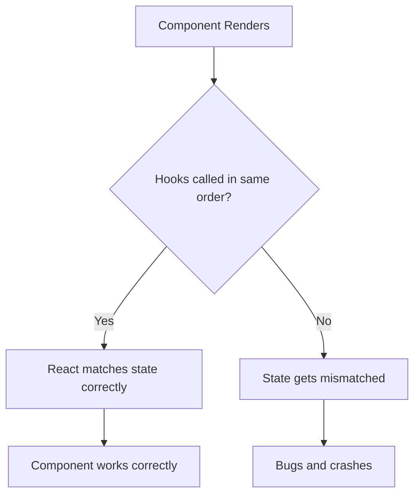
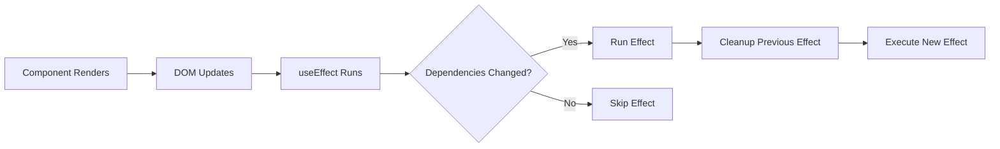
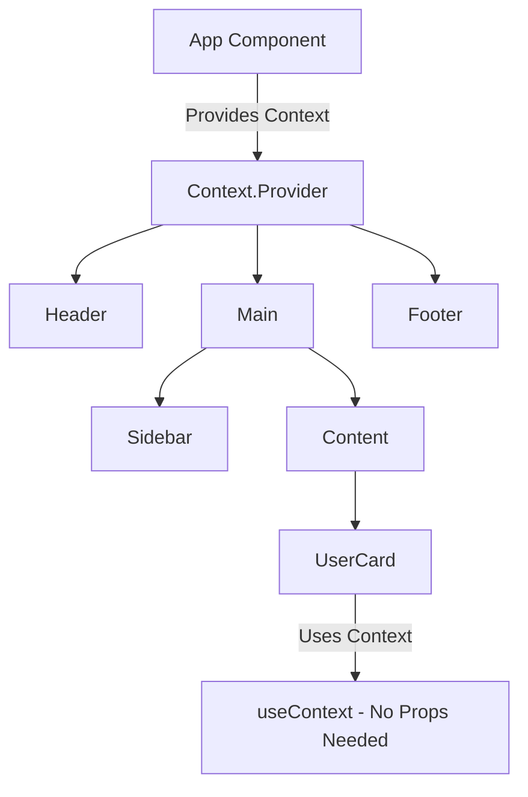

# How to Use React Hooks Effectively

Author: [nawazdhandala](https://www.github.com/nawazdhandala)

Tags: React, Hooks, JavaScript, Frontend, State Management

Description: A practical guide to using React hooks correctly, covering common patterns, performance pitfalls, and real-world examples for building maintainable React applications.

---

React hooks changed how we write components. Instead of lifecycle methods scattered across class components, hooks let you organize code by what it does rather than when it runs. But hooks come with rules and gotchas that trip up developers. This guide covers practical patterns for using hooks effectively.

## The Rules of Hooks

Before diving into patterns, understand the two rules that make hooks work:

1. **Call hooks at the top level** - never inside loops, conditions, or nested functions
2. **Call hooks only from React functions** - either functional components or custom hooks

These rules exist because React relies on the order of hook calls to associate state with the correct hook. Breaking these rules causes bugs that are hard to track down.



## useState: Managing Component State

The useState hook lets you add state to functional components. It returns the current value and a function to update it.

This example shows basic counter state management. The updater function can take either a new value directly or a function that receives the previous state, which is safer when updates depend on the current value.

```javascript
import { useState } from 'react';

function Counter() {
  // Destructure the array: first element is current value, second is setter
  const [count, setCount] = useState(0);

  // Direct update - fine for simple cases
  const reset = () => setCount(0);

  // Functional update - use when new state depends on old state
  // This avoids stale closure issues with async operations
  const increment = () => setCount(prevCount => prevCount + 1);

  return (
    <div>
      <p>Count: {count}</p>
      <button onClick={increment}>Add One</button>
      <button onClick={reset}>Reset</button>
    </div>
  );
}
```

### Lazy Initial State

When initial state requires computation, pass a function to useState. React will only call it on the first render, avoiding expensive calculations on every render.

The initialization function runs once during the first render. This pattern is useful when you need to read from localStorage, parse URL parameters, or perform any computation that should not repeat on every render.

```javascript
function ExpensiveComponent({ data }) {
  // BAD: processData runs on every render
  const [items, setItems] = useState(processExpensiveData(data));

  // GOOD: processData only runs on first render
  const [items, setItems] = useState(() => processExpensiveData(data));

  return <ItemList items={items} />;
}

// Real-world example: reading from localStorage
function useLocalStorage(key, defaultValue) {
  const [value, setValue] = useState(() => {
    // This parsing only happens once on mount
    const stored = localStorage.getItem(key);
    return stored ? JSON.parse(stored) : defaultValue;
  });

  return [value, setValue];
}
```

### Complex State with Objects

When state is an object, remember that useState does not merge updates like class component setState did. You need to spread the previous state manually.

This pattern is common for form state. Always spread the previous state first, then add the field you want to update. Forgetting to spread causes you to lose other fields.

```javascript
function UserForm() {
  const [formData, setFormData] = useState({
    name: '',
    email: '',
    role: 'user'
  });

  // WRONG: This replaces the entire object, losing other fields
  const updateNameBad = (name) => setFormData({ name });

  // CORRECT: Spread previous state, then override specific field
  const updateField = (field, value) => {
    setFormData(prev => ({
      ...prev,
      [field]: value
    }));
  };

  return (
    <form>
      <input
        value={formData.name}
        onChange={e => updateField('name', e.target.value)}
        placeholder="Name"
      />
      <input
        value={formData.email}
        onChange={e => updateField('email', e.target.value)}
        placeholder="Email"
      />
    </form>
  );
}
```

## useEffect: Side Effects and Synchronization

useEffect runs after render and handles side effects like data fetching, subscriptions, and DOM manipulation. Think of it as synchronizing your component with something external.



### Basic useEffect Patterns

Here are the three common dependency array configurations. Empty array means run once on mount. No array means run after every render. Array with values means run when those values change.

```javascript
import { useEffect, useState } from 'react';

function UserProfile({ userId }) {
  const [user, setUser] = useState(null);
  const [loading, setLoading] = useState(true);

  // Effect runs when userId changes
  // The dependency array tells React when to re-run the effect
  useEffect(() => {
    setLoading(true);

    fetchUser(userId)
      .then(data => {
        setUser(data);
        setLoading(false);
      })
      .catch(err => {
        console.error('Failed to fetch user:', err);
        setLoading(false);
      });
  }, [userId]); // Only re-fetch when userId changes

  if (loading) return <Spinner />;
  return <div>{user?.name}</div>;
}

// Effect that runs once on mount
function Analytics() {
  useEffect(() => {
    trackPageView();
  }, []); // Empty array = run once on mount

  return <div>Content</div>;
}

// Effect that runs after every render (rare, usually wrong)
function Logger({ value }) {
  useEffect(() => {
    console.log('Value changed:', value);
  }); // No array = run after every render
}
```

### Cleanup Functions

When your effect creates subscriptions, timers, or event listeners, return a cleanup function. React calls it before running the effect again and when the component unmounts.

The cleanup function prevents memory leaks and ensures you do not have stale subscriptions. This is critical for WebSocket connections, intervals, and event listeners.

```javascript
function ChatRoom({ roomId }) {
  const [messages, setMessages] = useState([]);

  useEffect(() => {
    // Create connection when roomId changes
    const connection = createConnection(roomId);
    connection.connect();

    // Subscribe to messages
    connection.on('message', (msg) => {
      setMessages(prev => [...prev, msg]);
    });

    // Cleanup: disconnect when roomId changes or component unmounts
    return () => {
      connection.disconnect();
    };
  }, [roomId]);

  return <MessageList messages={messages} />;
}

// Timer example with proper cleanup
function Countdown({ seconds }) {
  const [remaining, setRemaining] = useState(seconds);

  useEffect(() => {
    // Start interval
    const intervalId = setInterval(() => {
      setRemaining(prev => {
        if (prev <= 0) {
          clearInterval(intervalId);
          return 0;
        }
        return prev - 1;
      });
    }, 1000);

    // Cleanup: clear interval to prevent memory leak
    return () => clearInterval(intervalId);
  }, [seconds]);

  return <div>{remaining} seconds remaining</div>;
}
```

### Handling Async in useEffect

You cannot make the useEffect callback async directly because it must return undefined or a cleanup function. Define an async function inside and call it.

This pattern also handles the race condition where a slow request for old data could overwrite faster results for new data. The ignore flag prevents this.

```javascript
function SearchResults({ query }) {
  const [results, setResults] = useState([]);
  const [error, setError] = useState(null);

  useEffect(() => {
    // Track if this effect is still relevant
    let ignore = false;

    // Define async function inside useEffect
    async function fetchResults() {
      try {
        const data = await searchAPI(query);
        // Only update if this effect has not been superseded
        if (!ignore) {
          setResults(data);
          setError(null);
        }
      } catch (err) {
        if (!ignore) {
          setError(err.message);
        }
      }
    }

    if (query.length > 2) {
      fetchResults();
    }

    // Cleanup sets ignore flag to prevent stale updates
    return () => {
      ignore = true;
    };
  }, [query]);

  return (
    <div>
      {error && <div className="error">{error}</div>}
      <ul>
        {results.map(r => <li key={r.id}>{r.title}</li>)}
      </ul>
    </div>
  );
}
```

## useCallback and useMemo: Performance Optimization

These hooks prevent unnecessary recalculations and re-renders. Use them when you have expensive computations or when passing callbacks to optimized child components.

### useCallback for Stable Function References

useCallback returns a memoized version of your callback that only changes when dependencies change. This matters when passing callbacks to components wrapped in React.memo.

Without useCallback, handleClick would be a new function reference on every render, causing MemoizedButton to re-render even when nothing relevant changed.

```javascript
import { useCallback, useState, memo } from 'react';

// Child component wrapped in memo - only re-renders when props change
const MemoizedButton = memo(function Button({ onClick, label }) {
  console.log('Button rendered:', label);
  return <button onClick={onClick}>{label}</button>;
});

function Parent() {
  const [count, setCount] = useState(0);
  const [text, setText] = useState('');

  // Without useCallback: new function on every render
  // MemoizedButton would re-render every time Parent renders
  const handleClickBad = () => setCount(c => c + 1);

  // With useCallback: same function reference between renders
  // MemoizedButton only re-renders when this function actually changes
  const handleClick = useCallback(() => {
    setCount(c => c + 1);
  }, []); // Empty deps because setCount is stable

  return (
    <div>
      <input value={text} onChange={e => setText(e.target.value)} />
      <MemoizedButton onClick={handleClick} label="Increment" />
      <p>Count: {count}</p>
    </div>
  );
}
```

### useMemo for Expensive Calculations

useMemo caches the result of a calculation and only recomputes when dependencies change. Use it for expensive operations that do not need to run on every render.

The filtered and sorted list only recalculates when items or filter change, not when unrelated state updates cause a re-render.

```javascript
import { useMemo, useState } from 'react';

function ProductList({ products }) {
  const [filter, setFilter] = useState('');
  const [sortBy, setSortBy] = useState('name');

  // Expensive operation: filter and sort thousands of products
  // Without useMemo, this runs on every render
  const displayedProducts = useMemo(() => {
    console.log('Filtering and sorting products...');

    // First filter
    const filtered = products.filter(p =>
      p.name.toLowerCase().includes(filter.toLowerCase())
    );

    // Then sort
    return filtered.sort((a, b) => {
      if (sortBy === 'name') return a.name.localeCompare(b.name);
      if (sortBy === 'price') return a.price - b.price;
      return 0;
    });
  }, [products, filter, sortBy]); // Only recompute when these change

  return (
    <div>
      <input
        value={filter}
        onChange={e => setFilter(e.target.value)}
        placeholder="Filter products"
      />
      <select value={sortBy} onChange={e => setSortBy(e.target.value)}>
        <option value="name">Sort by Name</option>
        <option value="price">Sort by Price</option>
      </select>
      <ul>
        {displayedProducts.map(p => (
          <li key={p.id}>{p.name} - ${p.price}</li>
        ))}
      </ul>
    </div>
  );
}
```

### When to Use These Hooks

| Scenario | Hook | Why |
|----------|------|-----|
| Callback passed to memo child | useCallback | Prevents child re-render |
| Callback used in useEffect deps | useCallback | Prevents effect re-run |
| Expensive calculation | useMemo | Avoids recalculating |
| Creating object for context | useMemo | Stable reference |
| Simple state update callback | Neither | Over-optimization |
| Cheap calculations | Neither | Memoization has cost |

## useRef: Persisting Values Without Re-renders

useRef holds a mutable value that persists across renders without causing re-renders when changed. Use it for DOM references, previous values, and any data that should not trigger updates.

### DOM References

The most common use is accessing DOM elements directly. The ref attribute connects your ref to the DOM node after render.

```javascript
import { useRef, useEffect } from 'react';

function AutoFocusInput() {
  // Create ref to hold DOM element
  const inputRef = useRef(null);

  useEffect(() => {
    // Access DOM element after mount
    inputRef.current.focus();
  }, []);

  return <input ref={inputRef} placeholder="I focus automatically" />;
}

function VideoPlayer({ src }) {
  const videoRef = useRef(null);

  const play = () => videoRef.current.play();
  const pause = () => videoRef.current.pause();

  return (
    <div>
      <video ref={videoRef} src={src} />
      <button onClick={play}>Play</button>
      <button onClick={pause}>Pause</button>
    </div>
  );
}
```

### Storing Previous Values

useRef is perfect for tracking previous state values since updating a ref does not cause a re-render.

This pattern stores the previous props or state value. The ref updates during render, but since refs do not cause re-renders, we can safely mutate it.

```javascript
import { useRef, useEffect, useState } from 'react';

// Custom hook to get previous value of any variable
function usePrevious(value) {
  const ref = useRef();

  useEffect(() => {
    ref.current = value;
  }, [value]);

  // Returns the value from before this render
  return ref.current;
}

function PriceDisplay({ price }) {
  const prevPrice = usePrevious(price);

  // Determine price direction for styling
  const direction = prevPrice !== undefined
    ? price > prevPrice ? 'up' : price < prevPrice ? 'down' : 'same'
    : 'same';

  return (
    <span className={`price ${direction}`}>
      ${price.toFixed(2)}
      {direction === 'up' && ' ↑'}
      {direction === 'down' && ' ↓'}
    </span>
  );
}
```

### Storing Mutable Values

Use refs for values that need to persist but should not trigger re-renders, like interval IDs or request cancellation flags.

```javascript
function StopWatch() {
  const [time, setTime] = useState(0);
  const [isRunning, setIsRunning] = useState(false);
  // Store interval ID without causing re-renders
  const intervalRef = useRef(null);

  const start = () => {
    setIsRunning(true);
    intervalRef.current = setInterval(() => {
      setTime(t => t + 10);
    }, 10);
  };

  const stop = () => {
    setIsRunning(false);
    clearInterval(intervalRef.current);
  };

  const reset = () => {
    setTime(0);
    setIsRunning(false);
    clearInterval(intervalRef.current);
  };

  // Cleanup on unmount
  useEffect(() => {
    return () => clearInterval(intervalRef.current);
  }, []);

  return (
    <div>
      <span>{(time / 1000).toFixed(2)}s</span>
      {!isRunning ? (
        <button onClick={start}>Start</button>
      ) : (
        <button onClick={stop}>Stop</button>
      )}
      <button onClick={reset}>Reset</button>
    </div>
  );
}
```

## useContext: Avoiding Prop Drilling

useContext lets you read context values without passing props through intermediate components. Combined with useState or useReducer, it provides app-wide state management.



### Creating and Using Context

This example shows a complete theme context setup. The provider component manages state and exposes both the current value and a way to change it.

```javascript
import { createContext, useContext, useState } from 'react';

// Create context with default value
const ThemeContext = createContext({
  theme: 'light',
  toggleTheme: () => {}
});

// Provider component that manages theme state
function ThemeProvider({ children }) {
  const [theme, setTheme] = useState('light');

  const toggleTheme = () => {
    setTheme(prev => prev === 'light' ? 'dark' : 'light');
  };

  // Value object contains both state and updater
  const value = { theme, toggleTheme };

  return (
    <ThemeContext.Provider value={value}>
      {children}
    </ThemeContext.Provider>
  );
}

// Custom hook for consuming context - cleaner than useContext directly
function useTheme() {
  const context = useContext(ThemeContext);
  if (!context) {
    throw new Error('useTheme must be used within ThemeProvider');
  }
  return context;
}

// Components use the hook without knowing about prop drilling
function Header() {
  const { theme, toggleTheme } = useTheme();

  return (
    <header className={theme}>
      <h1>My App</h1>
      <button onClick={toggleTheme}>
        Switch to {theme === 'light' ? 'dark' : 'light'} mode
      </button>
    </header>
  );
}

// App wraps everything in providers
function App() {
  return (
    <ThemeProvider>
      <Header />
      <Main />
      <Footer />
    </ThemeProvider>
  );
}
```

### Context with useReducer for Complex State

For complex state logic, combine context with useReducer. This pattern resembles Redux but without the boilerplate.

The reducer centralizes state update logic, making it easier to understand how state changes and to add new actions.

```javascript
import { createContext, useContext, useReducer } from 'react';

// Define action types as constants to avoid typos
const ACTIONS = {
  ADD_ITEM: 'ADD_ITEM',
  REMOVE_ITEM: 'REMOVE_ITEM',
  CLEAR_CART: 'CLEAR_CART'
};

// Reducer handles all state transitions
function cartReducer(state, action) {
  switch (action.type) {
    case ACTIONS.ADD_ITEM: {
      const existing = state.items.find(i => i.id === action.payload.id);
      if (existing) {
        // Increase quantity if item exists
        return {
          ...state,
          items: state.items.map(i =>
            i.id === action.payload.id
              ? { ...i, quantity: i.quantity + 1 }
              : i
          )
        };
      }
      // Add new item with quantity 1
      return {
        ...state,
        items: [...state.items, { ...action.payload, quantity: 1 }]
      };
    }
    case ACTIONS.REMOVE_ITEM:
      return {
        ...state,
        items: state.items.filter(i => i.id !== action.payload)
      };
    case ACTIONS.CLEAR_CART:
      return { ...state, items: [] };
    default:
      return state;
  }
}

// Create context
const CartContext = createContext(null);

// Provider with reducer
function CartProvider({ children }) {
  const [state, dispatch] = useReducer(cartReducer, { items: [] });

  // Create stable action creators
  const addItem = (item) => dispatch({ type: ACTIONS.ADD_ITEM, payload: item });
  const removeItem = (id) => dispatch({ type: ACTIONS.REMOVE_ITEM, payload: id });
  const clearCart = () => dispatch({ type: ACTIONS.CLEAR_CART });

  const value = {
    items: state.items,
    addItem,
    removeItem,
    clearCart,
    total: state.items.reduce((sum, i) => sum + i.price * i.quantity, 0)
  };

  return (
    <CartContext.Provider value={value}>
      {children}
    </CartContext.Provider>
  );
}

// Custom hook
function useCart() {
  const context = useContext(CartContext);
  if (!context) {
    throw new Error('useCart must be used within CartProvider');
  }
  return context;
}
```

## Custom Hooks: Extracting Reusable Logic

Custom hooks let you extract component logic into reusable functions. They follow the same rules as built-in hooks and must start with "use".

### Data Fetching Hook

This hook encapsulates the common pattern of fetching data with loading and error states. It handles cleanup to prevent setting state on unmounted components.

```javascript
import { useState, useEffect } from 'react';

function useFetch(url) {
  const [data, setData] = useState(null);
  const [loading, setLoading] = useState(true);
  const [error, setError] = useState(null);

  useEffect(() => {
    // Reset state when URL changes
    setLoading(true);
    setError(null);

    // Track if we should ignore the result
    let cancelled = false;

    async function fetchData() {
      try {
        const response = await fetch(url);
        if (!response.ok) {
          throw new Error(`HTTP error! status: ${response.status}`);
        }
        const json = await response.json();

        if (!cancelled) {
          setData(json);
          setLoading(false);
        }
      } catch (err) {
        if (!cancelled) {
          setError(err.message);
          setLoading(false);
        }
      }
    }

    fetchData();

    // Cleanup prevents setting state on unmounted component
    return () => {
      cancelled = true;
    };
  }, [url]);

  return { data, loading, error };
}

// Usage is clean and declarative
function UserProfile({ userId }) {
  const { data: user, loading, error } = useFetch(`/api/users/${userId}`);

  if (loading) return <Spinner />;
  if (error) return <ErrorMessage message={error} />;
  return <div>{user.name}</div>;
}
```

### Form Handling Hook

Forms have repetitive logic for values, changes, validation, and submission. This hook extracts it all.

```javascript
import { useState, useCallback } from 'react';

function useForm(initialValues, validate) {
  const [values, setValues] = useState(initialValues);
  const [errors, setErrors] = useState({});
  const [touched, setTouched] = useState({});
  const [isSubmitting, setIsSubmitting] = useState(false);

  // Handle input changes
  const handleChange = useCallback((e) => {
    const { name, value, type, checked } = e.target;
    setValues(prev => ({
      ...prev,
      [name]: type === 'checkbox' ? checked : value
    }));
  }, []);

  // Mark field as touched on blur
  const handleBlur = useCallback((e) => {
    const { name } = e.target;
    setTouched(prev => ({ ...prev, [name]: true }));

    // Validate on blur if validate function provided
    if (validate) {
      const validationErrors = validate(values);
      setErrors(validationErrors);
    }
  }, [values, validate]);

  // Handle form submission
  const handleSubmit = useCallback((onSubmit) => async (e) => {
    e.preventDefault();
    setIsSubmitting(true);

    // Run validation
    const validationErrors = validate ? validate(values) : {};
    setErrors(validationErrors);

    // Mark all fields as touched
    const allTouched = Object.keys(values).reduce((acc, key) => {
      acc[key] = true;
      return acc;
    }, {});
    setTouched(allTouched);

    // Only submit if no errors
    if (Object.keys(validationErrors).length === 0) {
      try {
        await onSubmit(values);
      } catch (err) {
        setErrors({ submit: err.message });
      }
    }

    setIsSubmitting(false);
  }, [values, validate]);

  // Reset form to initial state
  const reset = useCallback(() => {
    setValues(initialValues);
    setErrors({});
    setTouched({});
  }, [initialValues]);

  return {
    values,
    errors,
    touched,
    isSubmitting,
    handleChange,
    handleBlur,
    handleSubmit,
    reset
  };
}

// Usage
function SignupForm() {
  const validate = (values) => {
    const errors = {};
    if (!values.email) errors.email = 'Required';
    if (!values.password) errors.password = 'Required';
    if (values.password.length < 8) errors.password = 'Min 8 characters';
    return errors;
  };

  const {
    values,
    errors,
    touched,
    isSubmitting,
    handleChange,
    handleBlur,
    handleSubmit
  } = useForm({ email: '', password: '' }, validate);

  const onSubmit = async (formValues) => {
    await signupAPI(formValues);
  };

  return (
    <form onSubmit={handleSubmit(onSubmit)}>
      <input
        name="email"
        value={values.email}
        onChange={handleChange}
        onBlur={handleBlur}
      />
      {touched.email && errors.email && <span>{errors.email}</span>}

      <input
        name="password"
        type="password"
        value={values.password}
        onChange={handleChange}
        onBlur={handleBlur}
      />
      {touched.password && errors.password && <span>{errors.password}</span>}

      <button type="submit" disabled={isSubmitting}>
        {isSubmitting ? 'Signing up...' : 'Sign Up'}
      </button>
    </form>
  );
}
```

## Common Mistakes to Avoid

### Missing Dependencies in useEffect

The dependency array must include all values from component scope that the effect uses. Missing dependencies cause stale closures.

```javascript
function SearchComponent({ query }) {
  const [results, setResults] = useState([]);

  // BAD: query is used but not in dependencies
  // Effect captures stale query value
  useEffect(() => {
    fetchResults(query).then(setResults);
  }, []); // ESLint will warn about this

  // GOOD: Include all dependencies
  useEffect(() => {
    fetchResults(query).then(setResults);
  }, [query]);
}
```

### Creating Objects in Render

Creating new objects or arrays during render causes unnecessary re-renders of child components, even when the data has not changed.

```javascript
function Parent() {
  // BAD: New object on every render
  // Child receives new reference each time, re-rendering unnecessarily
  return <Child style={{ color: 'red' }} items={[1, 2, 3]} />;

  // GOOD: Stable references using useMemo
  const style = useMemo(() => ({ color: 'red' }), []);
  const items = useMemo(() => [1, 2, 3], []);
  return <Child style={style} items={items} />;

  // BETTER: Define outside component if truly static
}

// Best for truly static values
const staticStyle = { color: 'red' };
const staticItems = [1, 2, 3];
```

### Updating State During Render

Never update state directly during render. It causes infinite loops. State updates should happen in event handlers or effects.

```javascript
function Counter({ value }) {
  const [count, setCount] = useState(0);

  // BAD: Infinite loop - updating state during render
  if (value > count) {
    setCount(value); // This triggers another render
  }

  // GOOD: Sync state with props using useEffect
  useEffect(() => {
    if (value > count) {
      setCount(value);
    }
  }, [value, count]);

  return <div>{count}</div>;
}
```

## Summary

| Hook | Use For | Key Points |
|------|---------|------------|
| useState | Component state | Use functional updates for derived state |
| useEffect | Side effects | Always handle cleanup, include all dependencies |
| useCallback | Stable callbacks | Only when passing to memo children |
| useMemo | Expensive calculations | Not needed for cheap operations |
| useRef | DOM refs, mutable values | Does not cause re-renders |
| useContext | Avoiding prop drilling | Combine with useReducer for complex state |
| Custom hooks | Reusable logic | Extract common patterns into hooks |

Hooks work best when you understand their purpose. Use useState for values that should trigger re-renders. Use useRef for values that should not. Use useEffect for synchronization with external systems. Use useMemo and useCallback only when you have measured performance problems, not as premature optimization.

---

*Building React applications? OneUptime helps you monitor your frontend performance, track errors in production, and ensure your users have a great experience. Set up real user monitoring and synthetic checks to catch issues before your users do. [Try OneUptime today](https://oneuptime.com).*
