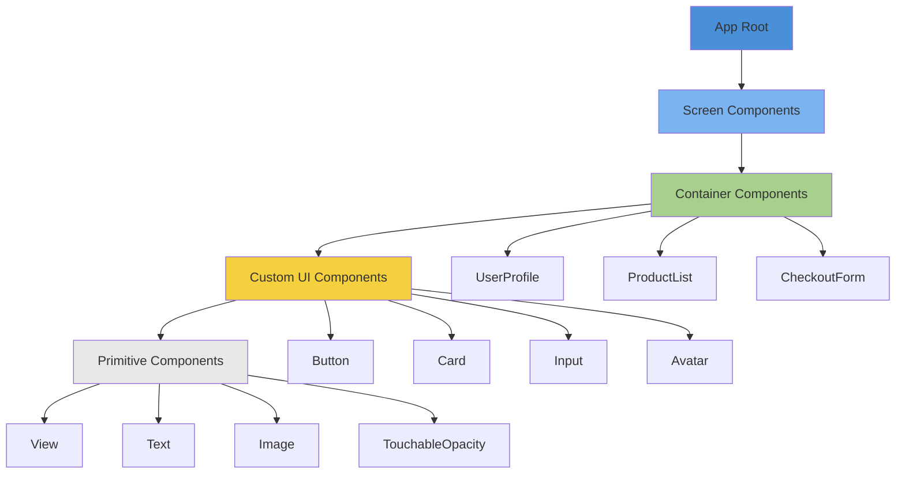
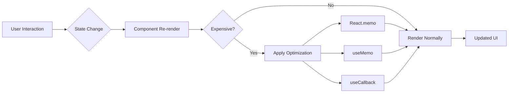
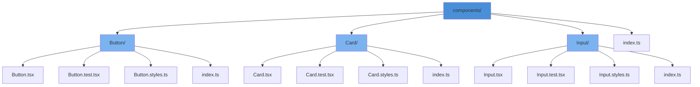

# How to Build Custom Components in React Native

Author: [nawazdhandala](https://www.github.com/nawazdhandala)

Tags: React Native, Custom Components, Mobile Development, JavaScript, TypeScript, UI Components, Reusable Components, Props, State Management

Description: Learn how to build reusable custom components in React Native with proper typing, composition patterns, and performance optimization. A practical guide covering component architecture, styling strategies, and testing approaches.

---

> Building a React Native app without reusable components is like constructing a house by cutting each brick individually. Custom components save development time, ensure consistency, and make your codebase maintainable. Here you will learn patterns used by production apps to create flexible, performant components.

React Native provides a solid foundation of built-in components, but real-world apps need specialized UI elements tailored to their design system. Creating custom components properly from the start prevents refactoring headaches later.

---

## Component Architecture Overview

Before diving into code, understanding how components fit together helps you make better design decisions.



Components fall into these categories:

- **Primitive Components**: Built-in React Native elements (View, Text, Image)
- **Custom UI Components**: Reusable building blocks (Button, Card, Input)
- **Container Components**: Business logic wrappers (UserProfile, ProductList)
- **Screen Components**: Full page layouts with navigation

---

## Setting Up Your First Custom Component

Let us start with a basic Button component that demonstrates core concepts. Every custom component should accept props for customization while providing sensible defaults.

The following code creates a reusable Button component with multiple variants (primary, secondary, outline), size options, and loading state support:

```tsx
// components/Button/Button.tsx
// A flexible button component with variants, sizes, and loading state

import React from 'react';
import {
  TouchableOpacity,
  Text,
  StyleSheet,
  ActivityIndicator,
  ViewStyle,
  TextStyle,
  GestureResponderEvent,
} from 'react-native';

// Define all possible props for the Button component
// Using TypeScript interfaces ensures type safety and better IDE support
interface ButtonProps {
  // The text displayed inside the button
  title: string;

  // Function called when button is pressed
  onPress: (event: GestureResponderEvent) => void;

  // Visual style variant - determines colors and borders
  variant?: 'primary' | 'secondary' | 'outline' | 'ghost';

  // Size affects padding and font size
  size?: 'small' | 'medium' | 'large';

  // Shows spinner and disables interaction when true
  loading?: boolean;

  // Prevents interaction when true
  disabled?: boolean;

  // Optional icon component to display before text
  leftIcon?: React.ReactNode;

  // Optional icon component to display after text
  rightIcon?: React.ReactNode;

  // Custom styles to override defaults
  style?: ViewStyle;
  textStyle?: TextStyle;

  // Accessibility label for screen readers
  accessibilityLabel?: string;
}

// Main Button component using functional component with destructured props
export const Button: React.FC<ButtonProps> = ({
  title,
  onPress,
  variant = 'primary',
  size = 'medium',
  loading = false,
  disabled = false,
  leftIcon,
  rightIcon,
  style,
  textStyle,
  accessibilityLabel,
}) => {
  // Determine if button should be non-interactive
  const isDisabled = disabled || loading;

  // Combine multiple style objects based on current state
  // Order matters - later styles override earlier ones
  const buttonStyles = [
    styles.base,
    styles[variant],
    styles[`${size}Button`],
    isDisabled && styles.disabled,
    style,
  ];

  const textStyles = [
    styles.text,
    styles[`${variant}Text`],
    styles[`${size}Text`],
    isDisabled && styles.disabledText,
    textStyle,
  ];

  return (
    <TouchableOpacity
      style={buttonStyles}
      onPress={onPress}
      disabled={isDisabled}
      activeOpacity={0.7}
      accessibilityLabel={accessibilityLabel || title}
      accessibilityRole="button"
      accessibilityState={{ disabled: isDisabled }}
    >
      {/* Show loading spinner when loading prop is true */}
      {loading ? (
        <ActivityIndicator
          size="small"
          color={variant === 'primary' ? '#FFFFFF' : '#007AFF'}
        />
      ) : (
        <>
          {/* Render left icon if provided */}
          {leftIcon && <>{leftIcon}</>}

          {/* Button text */}
          <Text style={textStyles}>{title}</Text>

          {/* Render right icon if provided */}
          {rightIcon && <>{rightIcon}</>}
        </>
      )}
    </TouchableOpacity>
  );
};

// StyleSheet.create provides performance optimizations
// and validates style properties at compile time
const styles = StyleSheet.create({
  // Base styles applied to all buttons
  base: {
    flexDirection: 'row',
    alignItems: 'center',
    justifyContent: 'center',
    borderRadius: 8,
    gap: 8,
  },

  // Variant styles - each defines unique appearance
  primary: {
    backgroundColor: '#007AFF',
    borderWidth: 0,
  },
  secondary: {
    backgroundColor: '#E5E5EA',
    borderWidth: 0,
  },
  outline: {
    backgroundColor: 'transparent',
    borderWidth: 2,
    borderColor: '#007AFF',
  },
  ghost: {
    backgroundColor: 'transparent',
    borderWidth: 0,
  },

  // Size styles for button container
  smallButton: {
    paddingVertical: 8,
    paddingHorizontal: 12,
  },
  mediumButton: {
    paddingVertical: 12,
    paddingHorizontal: 20,
  },
  largeButton: {
    paddingVertical: 16,
    paddingHorizontal: 28,
  },

  // Disabled state overlay
  disabled: {
    opacity: 0.5,
  },

  // Text base styles
  text: {
    fontWeight: '600',
    textAlign: 'center',
  },

  // Text variant colors
  primaryText: {
    color: '#FFFFFF',
  },
  secondaryText: {
    color: '#000000',
  },
  outlineText: {
    color: '#007AFF',
  },
  ghostText: {
    color: '#007AFF',
  },

  // Text size styles
  smallText: {
    fontSize: 14,
  },
  mediumText: {
    fontSize: 16,
  },
  largeText: {
    fontSize: 18,
  },

  disabledText: {
    color: '#8E8E93',
  },
});
```

---

## Component Composition Patterns

Complex UIs are built by combining smaller components. The Card component below demonstrates how to use composition to create flexible layouts.

Here is a Card component that accepts children and optional header/footer sections, allowing developers to compose any content inside:

```tsx
// components/Card/Card.tsx
// A composable card component with header, body, and footer slots

import React from 'react';
import { View, Text, StyleSheet, ViewStyle, Pressable } from 'react-native';

// Separate interfaces for each sub-component
interface CardHeaderProps {
  title: string;
  subtitle?: string;
  rightElement?: React.ReactNode;
}

interface CardProps {
  children: React.ReactNode;
  header?: CardHeaderProps;
  footer?: React.ReactNode;
  onPress?: () => void;
  elevated?: boolean;
  style?: ViewStyle;
}

// CardHeader is a separate component for reusability
// It can be used inside Card or independently
const CardHeader: React.FC<CardHeaderProps> = ({
  title,
  subtitle,
  rightElement,
}) => (
  <View style={headerStyles.container}>
    <View style={headerStyles.textContainer}>
      <Text style={headerStyles.title}>{title}</Text>
      {subtitle && (
        <Text style={headerStyles.subtitle}>{subtitle}</Text>
      )}
    </View>
    {rightElement && (
      <View style={headerStyles.rightElement}>{rightElement}</View>
    )}
  </View>
);

// Main Card component
// Uses Pressable when onPress is provided, View otherwise
export const Card: React.FC<CardProps> = ({
  children,
  header,
  footer,
  onPress,
  elevated = false,
  style,
}) => {
  // Build the inner content structure
  const content = (
    <>
      {/* Render header if provided */}
      {header && <CardHeader {...header} />}

      {/* Main content area */}
      <View style={cardStyles.body}>{children}</View>

      {/* Render footer if provided */}
      {footer && <View style={cardStyles.footer}>{footer}</View>}
    </>
  );

  // Choose container based on whether card is pressable
  const containerStyles = [
    cardStyles.container,
    elevated && cardStyles.elevated,
    style,
  ];

  // Return Pressable wrapper if onPress is defined
  // Pressable provides better feedback than TouchableOpacity for cards
  if (onPress) {
    return (
      <Pressable
        style={({ pressed }) => [
          ...containerStyles,
          pressed && cardStyles.pressed,
        ]}
        onPress={onPress}
      >
        {content}
      </Pressable>
    );
  }

  // Return plain View if not pressable
  return <View style={containerStyles}>{content}</View>;
};

// Export CardHeader for standalone use
Card.Header = CardHeader;

const cardStyles = StyleSheet.create({
  container: {
    backgroundColor: '#FFFFFF',
    borderRadius: 12,
    borderWidth: 1,
    borderColor: '#E5E5EA',
    overflow: 'hidden',
  },
  elevated: {
    // Shadow for iOS
    shadowColor: '#000',
    shadowOffset: { width: 0, height: 2 },
    shadowOpacity: 0.1,
    shadowRadius: 8,
    // Elevation for Android
    elevation: 4,
    borderWidth: 0,
  },
  pressed: {
    opacity: 0.9,
    transform: [{ scale: 0.98 }],
  },
  body: {
    padding: 16,
  },
  footer: {
    borderTopWidth: 1,
    borderTopColor: '#E5E5EA',
    padding: 12,
    backgroundColor: '#F9F9F9',
  },
});

const headerStyles = StyleSheet.create({
  container: {
    flexDirection: 'row',
    alignItems: 'center',
    padding: 16,
    borderBottomWidth: 1,
    borderBottomColor: '#E5E5EA',
  },
  textContainer: {
    flex: 1,
  },
  title: {
    fontSize: 18,
    fontWeight: '600',
    color: '#000000',
  },
  subtitle: {
    fontSize: 14,
    color: '#8E8E93',
    marginTop: 2,
  },
  rightElement: {
    marginLeft: 12,
  },
});
```

Usage example showing the composable nature of the Card component:

```tsx
// Example usage of Card component
// Shows how to use header, body content, and footer slots

import { Card } from './components/Card';
import { Button } from './components/Button';
import { Text, Image } from 'react-native';

const ProductCard = ({ product }) => (
  <Card
    elevated
    header={{
      title: product.name,
      subtitle: product.category,
      rightElement: <Text>${product.price}</Text>,
    }}
    footer={
      <Button
        title="Add to Cart"
        onPress={() => addToCart(product.id)}
        size="small"
      />
    }
  >
    {/* Body content - completely flexible */}
    <Image
      source={{ uri: product.imageUrl }}
      style={{ height: 150, borderRadius: 8 }}
    />
    <Text style={{ marginTop: 12 }}>{product.description}</Text>
  </Card>
);
```

---

## Building Form Input Components

Form inputs require special attention to state management, validation, and accessibility. The following TextInput component handles common requirements like labels, error states, and character counting.

The Input component wraps React Native's TextInput with label, helper text, error display, and optional character counter functionality:

```tsx
// components/Input/Input.tsx
// Enhanced text input with label, validation, and accessibility

import React, { useState, useRef, useImperativeHandle, forwardRef } from 'react';
import {
  View,
  Text,
  TextInput,
  StyleSheet,
  TextInputProps,
  Animated,
  ViewStyle,
} from 'react-native';

// Extend native TextInput props with our custom additions
interface InputProps extends Omit<TextInputProps, 'style'> {
  // Label shown above the input
  label: string;

  // Error message - when present, input shows error styling
  error?: string;

  // Helper text shown below input (hidden when error is present)
  helperText?: string;

  // Maximum character limit with counter display
  maxLength?: number;
  showCharacterCount?: boolean;

  // Icon displayed at start of input
  leftIcon?: React.ReactNode;

  // Icon or button displayed at end of input
  rightIcon?: React.ReactNode;

  // Custom container style
  containerStyle?: ViewStyle;

  // Required field indicator
  required?: boolean;
}

// Use forwardRef to allow parent components to access TextInput methods
// Methods like focus() and blur() can be called from parent
export const Input = forwardRef<TextInput, InputProps>(
  (
    {
      label,
      error,
      helperText,
      maxLength,
      showCharacterCount = false,
      leftIcon,
      rightIcon,
      containerStyle,
      required = false,
      value = '',
      onFocus,
      onBlur,
      ...textInputProps
    },
    ref
  ) => {
    // Track focus state for styling
    const [isFocused, setIsFocused] = useState(false);

    // Internal ref for the TextInput
    const inputRef = useRef<TextInput>(null);

    // Animated value for border color transition
    const borderColorAnim = useRef(new Animated.Value(0)).current;

    // Expose TextInput methods to parent via ref
    useImperativeHandle(ref, () => inputRef.current as TextInput);

    // Handle focus event
    const handleFocus = (e: any) => {
      setIsFocused(true);

      // Animate border to focused color
      Animated.timing(borderColorAnim, {
        toValue: 1,
        duration: 200,
        useNativeDriver: false,
      }).start();

      // Call parent onFocus if provided
      onFocus?.(e);
    };

    // Handle blur event
    const handleBlur = (e: any) => {
      setIsFocused(false);

      // Animate border back to default color
      Animated.timing(borderColorAnim, {
        toValue: 0,
        duration: 200,
        useNativeDriver: false,
      }).start();

      // Call parent onBlur if provided
      onBlur?.(e);
    };

    // Interpolate border color based on animation value
    const borderColor = borderColorAnim.interpolate({
      inputRange: [0, 1],
      outputRange: [error ? '#FF3B30' : '#E5E5EA', '#007AFF'],
    });

    // Calculate current character count
    const characterCount = value?.length || 0;

    return (
      <View style={[styles.container, containerStyle]}>
        {/* Label row with optional required indicator */}
        <View style={styles.labelRow}>
          <Text style={styles.label}>
            {label}
            {required && <Text style={styles.required}> *</Text>}
          </Text>
        </View>

        {/* Input container with animated border */}
        <Animated.View
          style={[
            styles.inputContainer,
            { borderColor: error ? '#FF3B30' : borderColor },
            isFocused && styles.inputContainerFocused,
          ]}
        >
          {/* Left icon slot */}
          {leftIcon && <View style={styles.iconLeft}>{leftIcon}</View>}

          {/* The actual TextInput */}
          <TextInput
            ref={inputRef}
            style={[
              styles.input,
              leftIcon && styles.inputWithLeftIcon,
              rightIcon && styles.inputWithRightIcon,
            ]}
            value={value}
            maxLength={maxLength}
            onFocus={handleFocus}
            onBlur={handleBlur}
            placeholderTextColor="#8E8E93"
            accessibilityLabel={label}
            accessibilityHint={helperText}
            {...textInputProps}
          />

          {/* Right icon slot */}
          {rightIcon && <View style={styles.iconRight}>{rightIcon}</View>}
        </Animated.View>

        {/* Bottom row: error/helper text and character counter */}
        <View style={styles.bottomRow}>
          {/* Error takes priority over helper text */}
          {error ? (
            <Text style={styles.errorText}>{error}</Text>
          ) : helperText ? (
            <Text style={styles.helperText}>{helperText}</Text>
          ) : (
            <View />
          )}

          {/* Character counter shown when maxLength is set */}
          {showCharacterCount && maxLength && (
            <Text
              style={[
                styles.characterCount,
                characterCount >= maxLength && styles.characterCountMax,
              ]}
            >
              {characterCount}/{maxLength}
            </Text>
          )}
        </View>
      </View>
    );
  }
);

const styles = StyleSheet.create({
  container: {
    marginBottom: 16,
  },
  labelRow: {
    flexDirection: 'row',
    marginBottom: 6,
  },
  label: {
    fontSize: 14,
    fontWeight: '500',
    color: '#000000',
  },
  required: {
    color: '#FF3B30',
  },
  inputContainer: {
    flexDirection: 'row',
    alignItems: 'center',
    borderWidth: 1,
    borderRadius: 8,
    backgroundColor: '#FFFFFF',
  },
  inputContainerFocused: {
    borderWidth: 2,
  },
  input: {
    flex: 1,
    paddingVertical: 12,
    paddingHorizontal: 16,
    fontSize: 16,
    color: '#000000',
  },
  inputWithLeftIcon: {
    paddingLeft: 8,
  },
  inputWithRightIcon: {
    paddingRight: 8,
  },
  iconLeft: {
    paddingLeft: 12,
  },
  iconRight: {
    paddingRight: 12,
  },
  bottomRow: {
    flexDirection: 'row',
    justifyContent: 'space-between',
    marginTop: 4,
    minHeight: 20,
  },
  helperText: {
    fontSize: 12,
    color: '#8E8E93',
  },
  errorText: {
    fontSize: 12,
    color: '#FF3B30',
  },
  characterCount: {
    fontSize: 12,
    color: '#8E8E93',
  },
  characterCountMax: {
    color: '#FF3B30',
  },
});
```

---

## Creating a Custom Hook for Component Logic

Complex components benefit from extracting logic into custom hooks. The following hook manages form state with validation, making it reusable across different forms.

The useForm hook provides state management, validation, and submission handling that can be used with any form component:

```tsx
// hooks/useForm.ts
// Reusable form state management hook with validation

import { useState, useCallback, useMemo } from 'react';

// Generic type for form values - allows any object shape
type FormValues = Record<string, any>;

// Validation rule definition
interface ValidationRule {
  // Validation function returns true if valid
  validate: (value: any, allValues: FormValues) => boolean;

  // Error message to display when validation fails
  message: string;
}

// Configuration for each form field
interface FieldConfig {
  // Initial value for the field
  initialValue: any;

  // Array of validation rules to apply
  rules?: ValidationRule[];
}

// Configuration for the entire form
type FormConfig<T extends FormValues> = {
  [K in keyof T]: FieldConfig;
};

// Hook configuration options
interface UseFormOptions<T extends FormValues> {
  // Field configurations with initial values and rules
  fields: FormConfig<T>;

  // Callback when form is submitted and valid
  onSubmit: (values: T) => void | Promise<void>;
}

// Return type of the useForm hook
interface UseFormReturn<T extends FormValues> {
  // Current form values
  values: T;

  // Current error messages by field
  errors: Partial<Record<keyof T, string>>;

  // Fields that have been interacted with
  touched: Partial<Record<keyof T, boolean>>;

  // Whether form is currently submitting
  isSubmitting: boolean;

  // Whether form has any validation errors
  isValid: boolean;

  // Update a single field value
  setValue: (field: keyof T, value: any) => void;

  // Mark a field as touched (for showing errors on blur)
  setTouched: (field: keyof T) => void;

  // Validate all fields and submit if valid
  handleSubmit: () => Promise<void>;

  // Reset form to initial values
  reset: () => void;

  // Get props to spread onto an Input component
  getFieldProps: (field: keyof T) => {
    value: any;
    onChangeText: (text: string) => void;
    onBlur: () => void;
    error: string | undefined;
  };
}

export function useForm<T extends FormValues>({
  fields,
  onSubmit,
}: UseFormOptions<T>): UseFormReturn<T> {
  // Extract initial values from field configs
  const initialValues = useMemo(() => {
    const values: Partial<T> = {};
    for (const key in fields) {
      values[key] = fields[key].initialValue;
    }
    return values as T;
  }, []);

  // Form state
  const [values, setValues] = useState<T>(initialValues);
  const [errors, setErrors] = useState<Partial<Record<keyof T, string>>>({});
  const [touched, setTouchedState] = useState<Partial<Record<keyof T, boolean>>>({});
  const [isSubmitting, setIsSubmitting] = useState(false);

  // Validate a single field
  const validateField = useCallback(
    (field: keyof T, value: any): string | undefined => {
      const fieldConfig = fields[field];
      if (!fieldConfig.rules) return undefined;

      // Run through all validation rules
      for (const rule of fieldConfig.rules) {
        if (!rule.validate(value, values)) {
          return rule.message;
        }
      }
      return undefined;
    },
    [fields, values]
  );

  // Validate all fields
  const validateAll = useCallback((): boolean => {
    const newErrors: Partial<Record<keyof T, string>> = {};
    let isValid = true;

    for (const field in fields) {
      const error = validateField(field, values[field]);
      if (error) {
        newErrors[field] = error;
        isValid = false;
      }
    }

    setErrors(newErrors);
    return isValid;
  }, [fields, values, validateField]);

  // Update a field value
  const setValue = useCallback((field: keyof T, value: any) => {
    setValues((prev) => ({ ...prev, [field]: value }));

    // Clear error when user starts typing
    setErrors((prev) => ({ ...prev, [field]: undefined }));
  }, []);

  // Mark field as touched
  const setTouched = useCallback((field: keyof T) => {
    setTouchedState((prev) => ({ ...prev, [field]: true }));

    // Validate on blur
    const error = validateField(field, values[field]);
    setErrors((prev) => ({ ...prev, [field]: error }));
  }, [validateField, values]);

  // Handle form submission
  const handleSubmit = useCallback(async () => {
    // Mark all fields as touched
    const allTouched: Partial<Record<keyof T, boolean>> = {};
    for (const field in fields) {
      allTouched[field] = true;
    }
    setTouchedState(allTouched);

    // Validate all fields
    if (!validateAll()) {
      return;
    }

    // Call onSubmit callback
    setIsSubmitting(true);
    try {
      await onSubmit(values);
    } finally {
      setIsSubmitting(false);
    }
  }, [validateAll, onSubmit, values, fields]);

  // Reset form to initial state
  const reset = useCallback(() => {
    setValues(initialValues);
    setErrors({});
    setTouchedState({});
    setIsSubmitting(false);
  }, [initialValues]);

  // Helper to get props for Input component
  const getFieldProps = useCallback(
    (field: keyof T) => ({
      value: values[field],
      onChangeText: (text: string) => setValue(field, text),
      onBlur: () => setTouched(field),
      error: touched[field] ? errors[field] : undefined,
    }),
    [values, errors, touched, setValue, setTouched]
  );

  // Calculate if form is valid
  const isValid = useMemo(() => {
    for (const field in fields) {
      const error = validateField(field, values[field]);
      if (error) return false;
    }
    return true;
  }, [fields, values, validateField]);

  return {
    values,
    errors,
    touched,
    isSubmitting,
    isValid,
    setValue,
    setTouched,
    handleSubmit,
    reset,
    getFieldProps,
  };
}
```

Usage example showing the useForm hook integrated with Input components:

```tsx
// Example: Login form using useForm hook
// Demonstrates validation rules and form submission

import { View } from 'react-native';
import { Input } from './components/Input';
import { Button } from './components/Button';
import { useForm } from './hooks/useForm';

// Define validation rules as reusable constants
const required = (message: string) => ({
  validate: (value: string) => value.trim().length > 0,
  message,
});

const email = {
  validate: (value: string) =>
    /^[A-Z0-9._%+-]+@[A-Z0-9.-]+\.[A-Z]{2,}$/i.test(value),
  message: 'Please enter a valid email address',
};

const minLength = (min: number) => ({
  validate: (value: string) => value.length >= min,
  message: `Must be at least ${min} characters`,
});

const LoginForm = () => {
  const form = useForm({
    fields: {
      email: {
        initialValue: '',
        rules: [required('Email is required'), email],
      },
      password: {
        initialValue: '',
        rules: [
          required('Password is required'),
          minLength(8),
        ],
      },
    },
    onSubmit: async (values) => {
      // Call your authentication API
      await loginUser(values.email, values.password);
    },
  });

  return (
    <View>
      <Input
        label="Email"
        keyboardType="email-address"
        autoCapitalize="none"
        {...form.getFieldProps('email')}
      />

      <Input
        label="Password"
        secureTextEntry
        {...form.getFieldProps('password')}
      />

      <Button
        title="Log In"
        onPress={form.handleSubmit}
        loading={form.isSubmitting}
        disabled={!form.isValid}
      />
    </View>
  );
};
```

---

## Performance Optimization Techniques

React Native components can become slow when not optimized. The following patterns help maintain smooth 60fps performance.



The OptimizedList component below demonstrates how to build a performant list with memoized item rendering:

```tsx
// components/OptimizedList/OptimizedList.tsx
// High-performance list component with memoization

import React, { memo, useCallback, useMemo } from 'react';
import {
  FlatList,
  View,
  Text,
  StyleSheet,
  FlatListProps,
} from 'react-native';

// Generic type for list items
interface ListItem {
  id: string;
  [key: string]: any;
}

interface OptimizedListProps<T extends ListItem>
  extends Omit<FlatListProps<T>, 'renderItem' | 'keyExtractor'> {
  // Array of items to render
  items: T[];

  // Render function for each item
  renderItem: (item: T, index: number) => React.ReactElement;

  // Optional empty state component
  emptyComponent?: React.ReactElement;

  // Estimated item height for getItemLayout
  estimatedItemHeight?: number;
}

// Memoized list item wrapper prevents unnecessary re-renders
// Only re-renders when the item data actually changes
const MemoizedItem = memo(
  ({ item, index, renderItem }: {
    item: any;
    index: number;
    renderItem: (item: any, index: number) => React.ReactElement;
  }) => renderItem(item, index),
  // Custom comparison function - only re-render if item changed
  (prevProps, nextProps) => {
    // Deep comparison for item objects
    return JSON.stringify(prevProps.item) === JSON.stringify(nextProps.item);
  }
);

export function OptimizedList<T extends ListItem>({
  items,
  renderItem,
  emptyComponent,
  estimatedItemHeight = 80,
  ...flatListProps
}: OptimizedListProps<T>) {
  // Memoize key extractor - prevents recreation on every render
  const keyExtractor = useCallback((item: T) => item.id, []);

  // Memoize render function wrapper
  // useCallback ensures stable reference for FlatList optimization
  const renderItemWrapper = useCallback(
    ({ item, index }: { item: T; index: number }) => (
      <MemoizedItem item={item} index={index} renderItem={renderItem} />
    ),
    [renderItem]
  );

  // getItemLayout enables FlatList to skip measuring items
  // Significantly improves scroll performance for fixed-height items
  const getItemLayout = useCallback(
    (_: any, index: number) => ({
      length: estimatedItemHeight,
      offset: estimatedItemHeight * index,
      index,
    }),
    [estimatedItemHeight]
  );

  // Memoize empty component
  const ListEmptyComponent = useMemo(
    () =>
      emptyComponent || (
        <View style={styles.emptyContainer}>
          <Text style={styles.emptyText}>No items to display</Text>
        </View>
      ),
    [emptyComponent]
  );

  return (
    <FlatList
      data={items}
      keyExtractor={keyExtractor}
      renderItem={renderItemWrapper}
      getItemLayout={getItemLayout}
      ListEmptyComponent={ListEmptyComponent}
      // Performance optimizations
      removeClippedSubviews={true}
      maxToRenderPerBatch={10}
      windowSize={5}
      initialNumToRender={10}
      updateCellsBatchingPeriod={50}
      // Prevent layout thrashing
      maintainVisibleContentPosition={{
        minIndexForVisible: 0,
      }}
      {...flatListProps}
    />
  );
}

const styles = StyleSheet.create({
  emptyContainer: {
    padding: 40,
    alignItems: 'center',
  },
  emptyText: {
    fontSize: 16,
    color: '#8E8E93',
  },
});
```

---

## Creating a Theme Provider Component

Consistent theming across components requires a centralized theme system. Here is a complete theme provider implementation with dark mode support.

The ThemeProvider component creates a context that provides theme values and a toggle function to all child components:

```tsx
// context/ThemeContext.tsx
// Theme provider with dark mode support

import React, {
  createContext,
  useContext,
  useState,
  useEffect,
  useMemo,
} from 'react';
import { useColorScheme, Appearance } from 'react-native';

// Define the structure of theme colors
interface ThemeColors {
  background: string;
  surface: string;
  text: string;
  textSecondary: string;
  primary: string;
  secondary: string;
  border: string;
  error: string;
  success: string;
  warning: string;
}

// Complete theme object
interface Theme {
  colors: ThemeColors;
  spacing: {
    xs: number;
    sm: number;
    md: number;
    lg: number;
    xl: number;
  };
  borderRadius: {
    sm: number;
    md: number;
    lg: number;
    full: number;
  };
  typography: {
    h1: { fontSize: number; fontWeight: string };
    h2: { fontSize: number; fontWeight: string };
    body: { fontSize: number; fontWeight: string };
    caption: { fontSize: number; fontWeight: string };
  };
  isDark: boolean;
}

// Light theme definition
const lightColors: ThemeColors = {
  background: '#FFFFFF',
  surface: '#F2F2F7',
  text: '#000000',
  textSecondary: '#8E8E93',
  primary: '#007AFF',
  secondary: '#5856D6',
  border: '#E5E5EA',
  error: '#FF3B30',
  success: '#34C759',
  warning: '#FF9500',
};

// Dark theme definition
const darkColors: ThemeColors = {
  background: '#000000',
  surface: '#1C1C1E',
  text: '#FFFFFF',
  textSecondary: '#8E8E93',
  primary: '#0A84FF',
  secondary: '#5E5CE6',
  border: '#38383A',
  error: '#FF453A',
  success: '#30D158',
  warning: '#FF9F0A',
};

// Shared theme values
const sharedTheme = {
  spacing: {
    xs: 4,
    sm: 8,
    md: 16,
    lg: 24,
    xl: 32,
  },
  borderRadius: {
    sm: 4,
    md: 8,
    lg: 16,
    full: 9999,
  },
  typography: {
    h1: { fontSize: 32, fontWeight: '700' as const },
    h2: { fontSize: 24, fontWeight: '600' as const },
    body: { fontSize: 16, fontWeight: '400' as const },
    caption: { fontSize: 12, fontWeight: '400' as const },
  },
};

// Context type definition
interface ThemeContextType {
  theme: Theme;
  toggleTheme: () => void;
  setThemeMode: (mode: 'light' | 'dark' | 'system') => void;
  themeMode: 'light' | 'dark' | 'system';
}

// Create context with default value
const ThemeContext = createContext<ThemeContextType | undefined>(undefined);

// Provider component
export const ThemeProvider: React.FC<{ children: React.ReactNode }> = ({
  children,
}) => {
  // Get system color scheme
  const systemColorScheme = useColorScheme();

  // User preference: 'light', 'dark', or 'system' (follow device setting)
  const [themeMode, setThemeMode] = useState<'light' | 'dark' | 'system'>(
    'system'
  );

  // Determine actual dark/light based on mode and system setting
  const isDark = useMemo(() => {
    if (themeMode === 'system') {
      return systemColorScheme === 'dark';
    }
    return themeMode === 'dark';
  }, [themeMode, systemColorScheme]);

  // Build complete theme object
  const theme: Theme = useMemo(
    () => ({
      colors: isDark ? darkColors : lightColors,
      ...sharedTheme,
      isDark,
    }),
    [isDark]
  );

  // Toggle between light and dark (ignores system)
  const toggleTheme = () => {
    setThemeMode((current) => {
      if (current === 'system') {
        // If following system, switch to opposite of current system setting
        return systemColorScheme === 'dark' ? 'light' : 'dark';
      }
      return current === 'dark' ? 'light' : 'dark';
    });
  };

  // Listen for system theme changes
  useEffect(() => {
    const subscription = Appearance.addChangeListener(({ colorScheme }) => {
      // Force re-render when system theme changes (if following system)
      if (themeMode === 'system') {
        // State update triggers re-calculation of isDark
        setThemeMode('system');
      }
    });

    return () => subscription.remove();
  }, [themeMode]);

  const contextValue = useMemo(
    () => ({
      theme,
      toggleTheme,
      setThemeMode,
      themeMode,
    }),
    [theme, themeMode]
  );

  return (
    <ThemeContext.Provider value={contextValue}>
      {children}
    </ThemeContext.Provider>
  );
};

// Custom hook for consuming theme
// Throws error if used outside ThemeProvider
export const useTheme = (): ThemeContextType => {
  const context = useContext(ThemeContext);
  if (!context) {
    throw new Error('useTheme must be used within a ThemeProvider');
  }
  return context;
};
```

Example showing how components consume theme values using the useTheme hook:

```tsx
// Example: Using theme in a component
// Shows how to apply theme colors and spacing

import { View, Text, StyleSheet } from 'react-native';
import { useTheme } from './context/ThemeContext';
import { Button } from './components/Button';

const ThemedCard = ({ title, content }) => {
  const { theme, toggleTheme } = useTheme();

  // Create styles using theme values
  const styles = StyleSheet.create({
    container: {
      backgroundColor: theme.colors.surface,
      borderRadius: theme.borderRadius.lg,
      padding: theme.spacing.md,
      borderWidth: 1,
      borderColor: theme.colors.border,
    },
    title: {
      ...theme.typography.h2,
      color: theme.colors.text,
      marginBottom: theme.spacing.sm,
    },
    content: {
      ...theme.typography.body,
      color: theme.colors.textSecondary,
    },
  });

  return (
    <View style={styles.container}>
      <Text style={styles.title}>{title}</Text>
      <Text style={styles.content}>{content}</Text>
      <Button
        title={`Switch to ${theme.isDark ? 'Light' : 'Dark'} Mode`}
        onPress={toggleTheme}
        variant="outline"
        size="small"
      />
    </View>
  );
};
```

---

## Testing Custom Components

Testing ensures components work correctly and prevents regressions. Here are testing patterns using React Native Testing Library.

The following test file demonstrates how to test a Button component with different props, user interactions, and accessibility:

```tsx
// __tests__/Button.test.tsx
// Comprehensive tests for Button component

import React from 'react';
import { render, fireEvent, screen } from '@testing-library/react-native';
import { Button } from '../components/Button';

describe('Button Component', () => {
  // Test basic rendering
  it('renders correctly with title', () => {
    render(<Button title="Press Me" onPress={() => {}} />);

    // Button text should be visible
    expect(screen.getByText('Press Me')).toBeTruthy();
  });

  // Test onPress callback
  it('calls onPress when pressed', () => {
    const onPressMock = jest.fn();
    render(<Button title="Click" onPress={onPressMock} />);

    // Simulate press
    fireEvent.press(screen.getByText('Click'));

    // Verify callback was called
    expect(onPressMock).toHaveBeenCalledTimes(1);
  });

  // Test disabled state
  it('does not call onPress when disabled', () => {
    const onPressMock = jest.fn();
    render(<Button title="Disabled" onPress={onPressMock} disabled />);

    fireEvent.press(screen.getByText('Disabled'));

    // Callback should not be called when disabled
    expect(onPressMock).not.toHaveBeenCalled();
  });

  // Test loading state
  it('shows loading indicator and disables button when loading', () => {
    const onPressMock = jest.fn();
    render(<Button title="Submit" onPress={onPressMock} loading />);

    // Text should not be visible when loading
    expect(screen.queryByText('Submit')).toBeNull();

    // Activity indicator should be present
    expect(screen.getByRole('progressbar')).toBeTruthy();

    // Should not respond to press
    fireEvent.press(screen.getByRole('button'));
    expect(onPressMock).not.toHaveBeenCalled();
  });

  // Test accessibility
  it('has correct accessibility properties', () => {
    render(
      <Button
        title="Accessible Button"
        onPress={() => {}}
        accessibilityLabel="Custom Label"
      />
    );

    const button = screen.getByRole('button');

    // Check accessibility label
    expect(button.props.accessibilityLabel).toBe('Custom Label');

    // Check accessibility state
    expect(button.props.accessibilityState.disabled).toBe(false);
  });

  // Test variants apply correct styles
  it('applies variant styles correctly', () => {
    const { rerender } = render(
      <Button title="Primary" onPress={() => {}} variant="primary" />
    );

    let button = screen.getByRole('button');
    let styles = button.props.style;

    // Primary variant should have background color
    expect(styles).toContainEqual(
      expect.objectContaining({ backgroundColor: '#007AFF' })
    );

    // Rerender with outline variant
    rerender(
      <Button title="Outline" onPress={() => {}} variant="outline" />
    );

    button = screen.getByRole('button');
    styles = button.props.style;

    // Outline variant should have border
    expect(styles).toContainEqual(
      expect.objectContaining({ borderColor: '#007AFF' })
    );
  });

  // Test different sizes
  describe('size variants', () => {
    it.each(['small', 'medium', 'large'] as const)(
      'renders %s size correctly',
      (size) => {
        render(<Button title="Sized" onPress={() => {}} size={size} />);

        // Component should render without errors for each size
        expect(screen.getByText('Sized')).toBeTruthy();
      }
    );
  });

  // Test icons render
  it('renders left and right icons', () => {
    const LeftIcon = () => <View testID="left-icon" />;
    const RightIcon = () => <View testID="right-icon" />;

    render(
      <Button
        title="With Icons"
        onPress={() => {}}
        leftIcon={<LeftIcon />}
        rightIcon={<RightIcon />}
      />
    );

    expect(screen.getByTestId('left-icon')).toBeTruthy();
    expect(screen.getByTestId('right-icon')).toBeTruthy();
  });
});
```

---

## Component File Structure

Organizing component files consistently makes your codebase easier to navigate and maintain.



The index file exports all components for clean imports throughout your application:

```tsx
// components/index.ts
// Central export file for all components

// Re-export components with named exports
export { Button } from './Button';
export { Card } from './Card';
export { Input } from './Input';
export { OptimizedList } from './OptimizedList';

// Re-export types for external use
export type { ButtonProps } from './Button/Button';
export type { CardProps } from './Card/Card';
export type { InputProps } from './Input/Input';
```

Individual component index files simplify the component export:

```tsx
// components/Button/index.ts
// Barrel export for Button component

export { Button } from './Button';
export type { ButtonProps } from './Button';
```

---

## Common Patterns and Anti-Patterns

Following established patterns helps create maintainable components. Here are practices to adopt and avoid.

### Patterns to Follow

```tsx
// GOOD: Props interface with clear types
interface AvatarProps {
  imageUrl: string;
  size: 'small' | 'medium' | 'large';
  fallbackText?: string;
}

// GOOD: Destructured props with defaults
const Avatar: React.FC<AvatarProps> = ({
  imageUrl,
  size = 'medium',
  fallbackText,
}) => {
  // Component implementation
};

// GOOD: Memoize expensive computations
const filteredItems = useMemo(
  () => items.filter((item) => item.active),
  [items]
);

// GOOD: Stable callback references
const handlePress = useCallback(() => {
  navigation.navigate('Details', { id: item.id });
}, [navigation, item.id]);
```

### Anti-Patterns to Avoid

```tsx
// BAD: Inline styles in render cause unnecessary re-renders
const BadComponent = () => (
  <View style={{ padding: 16, margin: 8 }}>  {/* Creates new object every render */}
    <Text>Content</Text>
  </View>
);

// GOOD: Use StyleSheet.create outside component
const styles = StyleSheet.create({
  container: { padding: 16, margin: 8 },
});

const GoodComponent = () => (
  <View style={styles.container}>
    <Text>Content</Text>
  </View>
);

// BAD: Creating functions in render
const BadList = ({ items }) => (
  <FlatList
    data={items}
    renderItem={({ item }) => <Item item={item} />}  {/* New function each render */}
    keyExtractor={(item) => item.id}  {/* New function each render */}
  />
);

// GOOD: Use useCallback or define outside component
const GoodList = ({ items }) => {
  const renderItem = useCallback(
    ({ item }) => <Item item={item} />,
    []
  );

  const keyExtractor = useCallback((item) => item.id, []);

  return (
    <FlatList
      data={items}
      renderItem={renderItem}
      keyExtractor={keyExtractor}
    />
  );
};
```

---

## Conclusion

Building custom components in React Native requires understanding composition, state management, and performance optimization. Key takeaways:

- **Start with clear interfaces**: Define TypeScript props for type safety and documentation
- **Use composition over inheritance**: Build complex components by combining simpler ones
- **Extract logic into hooks**: Keep components focused on rendering while hooks handle business logic
- **Optimize for performance**: Use memo, useMemo, and useCallback to prevent unnecessary re-renders
- **Test thoroughly**: Write tests for props, interactions, and edge cases
- **Maintain consistent structure**: Organize files predictably across all components

Custom components form the foundation of your application's UI. Investing time in building them correctly pays dividends in development speed and app quality.

---

*Building a mobile app with React Native? [OneUptime](https://oneuptime.com) provides comprehensive monitoring for your mobile backend, tracking API performance, error rates, and user experience metrics to keep your app running smoothly.*

**Related Reading:**
- [How to Instrument Your Application with OpenTelemetry](https://oneuptime.com/blog/post/2025-01-06-instrument-python-opentelemetry/view)
