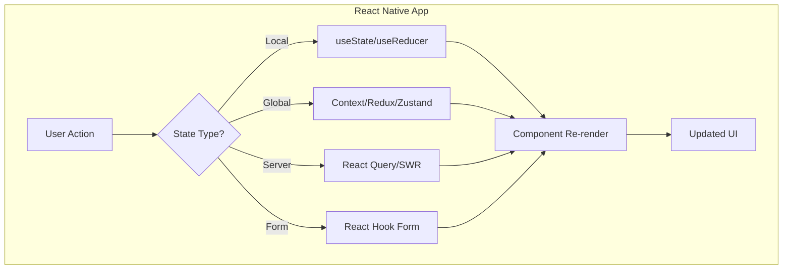
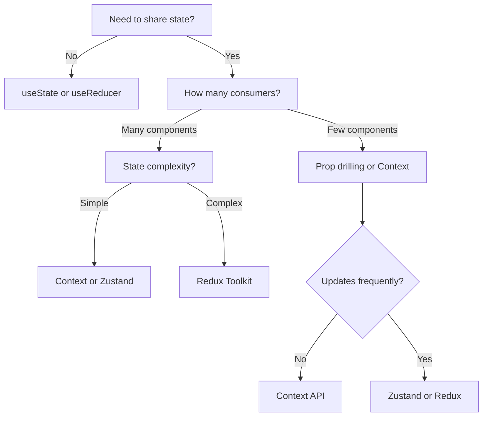

# How to Handle State Management in React Native

Author: [nawazdhandala](https://www.github.com/nawazdhandala)

Tags: React Native, State Management, Mobile, JavaScript

Description: Learn how to handle state management in React Native applications using local state, Context API, Redux Toolkit, and Zustand with practical examples and best practices.

---

> State management is the backbone of any React Native application. Choosing the right approach, whether local state, Context, or a dedicated library like Redux or Zustand, directly impacts your app's performance, maintainability, and developer experience. This guide walks you through each option with real-world examples.

When your app grows beyond a few screens, you will inevitably run into the question: "How should I manage state?" The answer depends on your app's complexity, team size, and performance requirements. Let's explore the options from simplest to most powerful.

---

## Understanding State in React Native

State in React Native falls into several categories:

- **Local/Component State** - Data managed within a single component
- **Global State** - Data shared across multiple components
- **Server State** - Data fetched from external APIs
- **Navigation State** - Current route and navigation history
- **Form State** - Input values and validation

The following diagram shows the typical state flow in a React Native application:



---

## Option 1: Local State with useState and useReducer

For simple, component-scoped state, React's built-in hooks are all you need. Start here and only reach for more complex solutions when local state becomes insufficient.

### Using useState for Simple State

The useState hook is the foundation of React state management. It is perfect for simple values like toggles, counters, and form inputs that do not need to be shared across components.

```javascript
// components/Counter.js
// A simple counter demonstrating useState for local component state
import React, { useState } from 'react';
import { View, Text, Button, StyleSheet } from 'react-native';

const Counter = () => {
  // useState returns [currentValue, setterFunction]
  // Initial value is 0, and setCount updates the value
  const [count, setCount] = useState(0);

  // Handler functions that update state
  // When called, React re-renders the component with the new value
  const increment = () => setCount(count + 1);
  const decrement = () => setCount(count - 1);
  const reset = () => setCount(0);

  return (
    <View style={styles.container}>
      <Text style={styles.countText}>Count: {count}</Text>
      <View style={styles.buttonRow}>
        <Button title="-" onPress={decrement} />
        <Button title="Reset" onPress={reset} />
        <Button title="+" onPress={increment} />
      </View>
    </View>
  );
};

const styles = StyleSheet.create({
  container: {
    padding: 20,
    alignItems: 'center',
  },
  countText: {
    fontSize: 24,
    marginBottom: 20,
  },
  buttonRow: {
    flexDirection: 'row',
    gap: 10,
  },
});

export default Counter;
```

### Using useReducer for Complex State Logic

When state logic becomes complex with multiple related values or state transitions depend on previous state, useReducer provides a cleaner pattern. It centralizes state logic in a reducer function, making state changes predictable and testable.

```javascript
// components/ShoppingCart.js
// Shopping cart demonstrating useReducer for complex state transitions
import React, { useReducer } from 'react';
import { View, Text, FlatList, Button, StyleSheet } from 'react-native';

// Define initial state shape
// This makes it clear what data the component manages
const initialState = {
  items: [],
  total: 0,
  itemCount: 0,
};

// Reducer function handles all state transitions
// Takes current state and an action, returns new state
// This pattern makes state changes predictable and easy to test
function cartReducer(state, action) {
  switch (action.type) {
    case 'ADD_ITEM': {
      // Check if item already exists in cart
      const existingIndex = state.items.findIndex(
        (item) => item.id === action.payload.id
      );

      let updatedItems;
      if (existingIndex >= 0) {
        // Item exists - increment quantity
        updatedItems = state.items.map((item, index) =>
          index === existingIndex
            ? { ...item, quantity: item.quantity + 1 }
            : item
        );
      } else {
        // New item - add to cart with quantity 1
        updatedItems = [...state.items, { ...action.payload, quantity: 1 }];
      }

      // Calculate new totals
      const newTotal = updatedItems.reduce(
        (sum, item) => sum + item.price * item.quantity,
        0
      );
      const newCount = updatedItems.reduce((sum, item) => sum + item.quantity, 0);

      return {
        items: updatedItems,
        total: newTotal,
        itemCount: newCount,
      };
    }

    case 'REMOVE_ITEM': {
      // Filter out the item to remove
      const filteredItems = state.items.filter(
        (item) => item.id !== action.payload.id
      );

      // Recalculate totals
      const newTotal = filteredItems.reduce(
        (sum, item) => sum + item.price * item.quantity,
        0
      );
      const newCount = filteredItems.reduce((sum, item) => sum + item.quantity, 0);

      return {
        items: filteredItems,
        total: newTotal,
        itemCount: newCount,
      };
    }

    case 'CLEAR_CART':
      // Reset to initial state
      return initialState;

    default:
      // Unknown action type - return unchanged state
      return state;
  }
}

const ShoppingCart = () => {
  // useReducer returns [currentState, dispatchFunction]
  // dispatch sends actions to the reducer
  const [state, dispatch] = useReducer(cartReducer, initialState);

  // Action creators make dispatching cleaner
  const addItem = (item) => dispatch({ type: 'ADD_ITEM', payload: item });
  const removeItem = (id) => dispatch({ type: 'REMOVE_ITEM', payload: { id } });
  const clearCart = () => dispatch({ type: 'CLEAR_CART' });

  // Sample product for demonstration
  const sampleProduct = { id: '1', name: 'Widget', price: 9.99 };

  const renderItem = ({ item }) => (
    <View style={styles.cartItem}>
      <Text>{item.name} x {item.quantity}</Text>
      <Text>${(item.price * item.quantity).toFixed(2)}</Text>
      <Button title="Remove" onPress={() => removeItem(item.id)} />
    </View>
  );

  return (
    <View style={styles.container}>
      <Text style={styles.header}>Cart ({state.itemCount} items)</Text>

      <FlatList
        data={state.items}
        keyExtractor={(item) => item.id}
        renderItem={renderItem}
        ListEmptyComponent={<Text>Cart is empty</Text>}
      />

      <View style={styles.footer}>
        <Text style={styles.total}>Total: ${state.total.toFixed(2)}</Text>
        <Button title="Add Sample Item" onPress={() => addItem(sampleProduct)} />
        <Button title="Clear Cart" onPress={clearCart} />
      </View>
    </View>
  );
};

const styles = StyleSheet.create({
  container: {
    flex: 1,
    padding: 16,
  },
  header: {
    fontSize: 20,
    fontWeight: 'bold',
    marginBottom: 16,
  },
  cartItem: {
    flexDirection: 'row',
    justifyContent: 'space-between',
    alignItems: 'center',
    padding: 12,
    borderBottomWidth: 1,
    borderBottomColor: '#eee',
  },
  footer: {
    marginTop: 16,
    gap: 8,
  },
  total: {
    fontSize: 18,
    fontWeight: 'bold',
  },
});

export default ShoppingCart;
```

---

## Option 2: Context API for Global State

When multiple components need access to the same data, React's Context API provides a way to share state without prop drilling. It is built into React, requires no additional dependencies, and works well for moderate-complexity applications.

### Creating a Theme Context

This example shows how to create a theme context that any component in the app can access. The pattern involves three parts: creating the context, creating a provider component, and creating a custom hook for consuming the context.

```javascript
// context/ThemeContext.js
// Theme context for app-wide theme management
import React, { createContext, useContext, useState, useMemo } from 'react';

// Create context with undefined default
// We will check for this in the hook to catch usage errors
const ThemeContext = createContext(undefined);

// Define theme objects
// Keeping these outside the component prevents recreation on each render
const themes = {
  light: {
    name: 'light',
    background: '#ffffff',
    text: '#000000',
    primary: '#007AFF',
    secondary: '#5856D6',
    border: '#E5E5EA',
  },
  dark: {
    name: 'dark',
    background: '#000000',
    text: '#ffffff',
    primary: '#0A84FF',
    secondary: '#5E5CE6',
    border: '#38383A',
  },
};

// Provider component wraps the app and provides theme state
export const ThemeProvider = ({ children }) => {
  // Store the theme name, not the whole theme object
  const [themeName, setThemeName] = useState('light');

  // Memoize the context value to prevent unnecessary re-renders
  // Only recalculates when themeName changes
  const value = useMemo(
    () => ({
      theme: themes[themeName],
      themeName,
      toggleTheme: () => {
        setThemeName((prev) => (prev === 'light' ? 'dark' : 'light'));
      },
      setTheme: (name) => {
        if (themes[name]) {
          setThemeName(name);
        }
      },
    }),
    [themeName]
  );

  return (
    <ThemeContext.Provider value={value}>
      {children}
    </ThemeContext.Provider>
  );
};

// Custom hook for consuming theme context
// Provides better error messages than using useContext directly
export const useTheme = () => {
  const context = useContext(ThemeContext);

  // Throw helpful error if used outside provider
  if (context === undefined) {
    throw new Error('useTheme must be used within a ThemeProvider');
  }

  return context;
};
```

### Creating an Authentication Context

Authentication state is a common use case for Context. This example shows a more complete pattern with async operations, loading states, and persistence.

```javascript
// context/AuthContext.js
// Authentication context with async operations and persistence
import React, {
  createContext,
  useContext,
  useState,
  useEffect,
  useMemo,
  useCallback,
} from 'react';
import AsyncStorage from '@react-native-async-storage/async-storage';

const AuthContext = createContext(undefined);

// Storage key for persisting auth state
const AUTH_STORAGE_KEY = '@auth_token';

export const AuthProvider = ({ children }) => {
  const [user, setUser] = useState(null);
  const [token, setToken] = useState(null);
  const [isLoading, setIsLoading] = useState(true);
  const [error, setError] = useState(null);

  // Check for existing session on mount
  // This restores auth state when the app restarts
  useEffect(() => {
    const loadStoredAuth = async () => {
      try {
        const storedToken = await AsyncStorage.getItem(AUTH_STORAGE_KEY);

        if (storedToken) {
          // Validate token with your API
          const response = await fetch('https://api.example.com/auth/validate', {
            headers: { Authorization: `Bearer ${storedToken}` },
          });

          if (response.ok) {
            const userData = await response.json();
            setToken(storedToken);
            setUser(userData);
          } else {
            // Token invalid - clear storage
            await AsyncStorage.removeItem(AUTH_STORAGE_KEY);
          }
        }
      } catch (err) {
        console.error('Failed to load auth state:', err);
      } finally {
        setIsLoading(false);
      }
    };

    loadStoredAuth();
  }, []);

  // Login function - useCallback prevents recreation on each render
  const login = useCallback(async (email, password) => {
    setIsLoading(true);
    setError(null);

    try {
      const response = await fetch('https://api.example.com/auth/login', {
        method: 'POST',
        headers: { 'Content-Type': 'application/json' },
        body: JSON.stringify({ email, password }),
      });

      if (!response.ok) {
        const errorData = await response.json();
        throw new Error(errorData.message || 'Login failed');
      }

      const { token: newToken, user: userData } = await response.json();

      // Persist token for session restoration
      await AsyncStorage.setItem(AUTH_STORAGE_KEY, newToken);

      setToken(newToken);
      setUser(userData);
    } catch (err) {
      setError(err.message);
      throw err;
    } finally {
      setIsLoading(false);
    }
  }, []);

  // Logout function
  const logout = useCallback(async () => {
    setIsLoading(true);

    try {
      // Optionally notify your API about logout
      if (token) {
        await fetch('https://api.example.com/auth/logout', {
          method: 'POST',
          headers: { Authorization: `Bearer ${token}` },
        }).catch(() => {
          // Ignore network errors on logout
        });
      }

      // Clear stored auth data
      await AsyncStorage.removeItem(AUTH_STORAGE_KEY);

      setToken(null);
      setUser(null);
    } finally {
      setIsLoading(false);
    }
  }, [token]);

  // Memoize context value
  const value = useMemo(
    () => ({
      user,
      token,
      isLoading,
      error,
      isAuthenticated: !!user,
      login,
      logout,
      clearError: () => setError(null),
    }),
    [user, token, isLoading, error, login, logout]
  );

  return (
    <AuthContext.Provider value={value}>
      {children}
    </AuthContext.Provider>
  );
};

// Custom hook with error handling
export const useAuth = () => {
  const context = useContext(AuthContext);

  if (context === undefined) {
    throw new Error('useAuth must be used within an AuthProvider');
  }

  return context;
};
```

### Using Multiple Contexts Together

Here is how to compose multiple contexts in your app and use them in components:

```javascript
// App.js
// Composing multiple context providers at the app root
import React from 'react';
import { NavigationContainer } from '@react-navigation/native';
import { ThemeProvider, useTheme } from './context/ThemeContext';
import { AuthProvider, useAuth } from './context/AuthContext';
import AppNavigator from './navigation/AppNavigator';

// Wrapper component that applies theme from context
const ThemedApp = () => {
  const { theme } = useTheme();

  return (
    <NavigationContainer
      theme={{
        dark: theme.name === 'dark',
        colors: {
          primary: theme.primary,
          background: theme.background,
          card: theme.background,
          text: theme.text,
          border: theme.border,
        },
      }}
    >
      <AppNavigator />
    </NavigationContainer>
  );
};

// Main App with all providers
// Order matters - AuthProvider might need ThemeProvider inside it
const App = () => {
  return (
    <ThemeProvider>
      <AuthProvider>
        <ThemedApp />
      </AuthProvider>
    </ThemeProvider>
  );
};

export default App;
```

```javascript
// screens/ProfileScreen.js
// Using multiple contexts in a component
import React from 'react';
import { View, Text, Button, StyleSheet, Switch } from 'react-native';
import { useAuth } from '../context/AuthContext';
import { useTheme } from '../context/ThemeContext';

const ProfileScreen = () => {
  // Access multiple contexts
  const { user, logout, isLoading } = useAuth();
  const { theme, themeName, toggleTheme } = useTheme();

  // Dynamic styles based on theme
  const dynamicStyles = {
    container: {
      backgroundColor: theme.background,
    },
    text: {
      color: theme.text,
    },
  };

  if (isLoading) {
    return (
      <View style={[styles.container, dynamicStyles.container]}>
        <Text style={dynamicStyles.text}>Loading...</Text>
      </View>
    );
  }

  return (
    <View style={[styles.container, dynamicStyles.container]}>
      <Text style={[styles.title, dynamicStyles.text]}>
        Welcome, {user?.name}
      </Text>
      <Text style={[styles.email, dynamicStyles.text]}>
        {user?.email}
      </Text>

      <View style={styles.setting}>
        <Text style={dynamicStyles.text}>Dark Mode</Text>
        <Switch
          value={themeName === 'dark'}
          onValueChange={toggleTheme}
        />
      </View>

      <Button title="Logout" onPress={logout} color={theme.primary} />
    </View>
  );
};

const styles = StyleSheet.create({
  container: {
    flex: 1,
    padding: 20,
  },
  title: {
    fontSize: 24,
    fontWeight: 'bold',
    marginBottom: 8,
  },
  email: {
    fontSize: 16,
    marginBottom: 24,
  },
  setting: {
    flexDirection: 'row',
    justifyContent: 'space-between',
    alignItems: 'center',
    paddingVertical: 12,
    marginBottom: 24,
  },
});

export default ProfileScreen;
```

---

## Option 3: Redux Toolkit for Large Applications

When your application has complex state interactions, needs time-travel debugging, or requires predictable state updates across a large team, Redux Toolkit is the industry standard. It simplifies Redux significantly while maintaining its benefits.

### Setting Up Redux Toolkit

First, install the required packages:

```bash
npm install @reduxjs/toolkit react-redux
```

The following example shows how to set up a Redux store with multiple slices for managing different domains of your application state.

```javascript
// store/index.js
// Redux store configuration using Redux Toolkit
import { configureStore } from '@reduxjs/toolkit';
import userReducer from './slices/userSlice';
import cartReducer from './slices/cartSlice';
import productsReducer from './slices/productsSlice';

// configureStore automatically sets up:
// - Redux DevTools integration
// - redux-thunk middleware for async actions
// - Development checks for common mistakes
export const store = configureStore({
  reducer: {
    // Each key becomes a top-level state property
    user: userReducer,
    cart: cartReducer,
    products: productsReducer,
  },
  // Middleware configuration (optional)
  middleware: (getDefaultMiddleware) =>
    getDefaultMiddleware({
      // Disable serializable check for AsyncStorage/navigation state
      serializableCheck: {
        ignoredActions: ['persist/PERSIST', 'persist/REHYDRATE'],
      },
    }),
});

// TypeScript: Export types for hooks
// export type RootState = ReturnType<typeof store.getState>;
// export type AppDispatch = typeof store.dispatch;
```

### Creating Feature Slices

A slice contains the reducer logic and actions for a single feature. createSlice generates action creators automatically based on the reducer names.

```javascript
// store/slices/userSlice.js
// User authentication slice with async thunks
import { createSlice, createAsyncThunk } from '@reduxjs/toolkit';
import AsyncStorage from '@react-native-async-storage/async-storage';

// Async thunk for login
// createAsyncThunk handles loading/success/error states automatically
export const loginUser = createAsyncThunk(
  'user/login', // Action type prefix
  async ({ email, password }, { rejectWithValue }) => {
    try {
      const response = await fetch('https://api.example.com/auth/login', {
        method: 'POST',
        headers: { 'Content-Type': 'application/json' },
        body: JSON.stringify({ email, password }),
      });

      if (!response.ok) {
        const error = await response.json();
        // rejectWithValue passes data to rejected case
        return rejectWithValue(error.message);
      }

      const data = await response.json();

      // Persist token
      await AsyncStorage.setItem('@auth_token', data.token);

      return data;
    } catch (error) {
      return rejectWithValue(error.message);
    }
  }
);

// Async thunk for logout
export const logoutUser = createAsyncThunk(
  'user/logout',
  async (_, { getState }) => {
    const { token } = getState().user;

    // Notify API (ignore errors)
    if (token) {
      fetch('https://api.example.com/auth/logout', {
        method: 'POST',
        headers: { Authorization: `Bearer ${token}` },
      }).catch(() => {});
    }

    await AsyncStorage.removeItem('@auth_token');
  }
);

// Async thunk to restore session on app start
export const restoreSession = createAsyncThunk(
  'user/restoreSession',
  async (_, { rejectWithValue }) => {
    try {
      const token = await AsyncStorage.getItem('@auth_token');

      if (!token) {
        return rejectWithValue('No stored session');
      }

      const response = await fetch('https://api.example.com/auth/validate', {
        headers: { Authorization: `Bearer ${token}` },
      });

      if (!response.ok) {
        await AsyncStorage.removeItem('@auth_token');
        return rejectWithValue('Session expired');
      }

      const user = await response.json();
      return { user, token };
    } catch (error) {
      return rejectWithValue(error.message);
    }
  }
);

const initialState = {
  user: null,
  token: null,
  isLoading: false,
  isInitialized: false,
  error: null,
};

const userSlice = createSlice({
  name: 'user',
  initialState,
  // Synchronous reducers
  reducers: {
    clearError: (state) => {
      state.error = null;
    },
    updateProfile: (state, action) => {
      // Immer allows direct mutation syntax
      state.user = { ...state.user, ...action.payload };
    },
  },
  // Handle async thunk lifecycle
  extraReducers: (builder) => {
    builder
      // Login cases
      .addCase(loginUser.pending, (state) => {
        state.isLoading = true;
        state.error = null;
      })
      .addCase(loginUser.fulfilled, (state, action) => {
        state.isLoading = false;
        state.user = action.payload.user;
        state.token = action.payload.token;
      })
      .addCase(loginUser.rejected, (state, action) => {
        state.isLoading = false;
        state.error = action.payload || 'Login failed';
      })
      // Logout cases
      .addCase(logoutUser.fulfilled, (state) => {
        state.user = null;
        state.token = null;
      })
      // Restore session cases
      .addCase(restoreSession.pending, (state) => {
        state.isLoading = true;
      })
      .addCase(restoreSession.fulfilled, (state, action) => {
        state.isLoading = false;
        state.isInitialized = true;
        state.user = action.payload.user;
        state.token = action.payload.token;
      })
      .addCase(restoreSession.rejected, (state) => {
        state.isLoading = false;
        state.isInitialized = true;
      });
  },
});

export const { clearError, updateProfile } = userSlice.actions;
export default userSlice.reducer;
```

```javascript
// store/slices/cartSlice.js
// Shopping cart slice with selectors
import { createSlice } from '@reduxjs/toolkit';

const initialState = {
  items: [],
  appliedCoupon: null,
};

const cartSlice = createSlice({
  name: 'cart',
  initialState,
  reducers: {
    addToCart: (state, action) => {
      const { id, name, price, image } = action.payload;
      const existingItem = state.items.find((item) => item.id === id);

      if (existingItem) {
        // Immer handles immutability - this mutates safely
        existingItem.quantity += 1;
      } else {
        state.items.push({
          id,
          name,
          price,
          image,
          quantity: 1,
        });
      }
    },
    removeFromCart: (state, action) => {
      state.items = state.items.filter((item) => item.id !== action.payload);
    },
    updateQuantity: (state, action) => {
      const { id, quantity } = action.payload;
      const item = state.items.find((item) => item.id === id);

      if (item) {
        if (quantity <= 0) {
          // Remove item if quantity is zero or negative
          state.items = state.items.filter((i) => i.id !== id);
        } else {
          item.quantity = quantity;
        }
      }
    },
    applyCoupon: (state, action) => {
      state.appliedCoupon = action.payload;
    },
    removeCoupon: (state) => {
      state.appliedCoupon = null;
    },
    clearCart: (state) => {
      state.items = [];
      state.appliedCoupon = null;
    },
  },
});

// Export actions
export const {
  addToCart,
  removeFromCart,
  updateQuantity,
  applyCoupon,
  removeCoupon,
  clearCart,
} = cartSlice.actions;

// Selectors - memoized with reselect internally
// Use these in components for derived data
export const selectCartItems = (state) => state.cart.items;

export const selectCartTotal = (state) => {
  const subtotal = state.cart.items.reduce(
    (sum, item) => sum + item.price * item.quantity,
    0
  );

  const coupon = state.cart.appliedCoupon;
  if (coupon) {
    if (coupon.type === 'percentage') {
      return subtotal * (1 - coupon.value / 100);
    } else if (coupon.type === 'fixed') {
      return Math.max(0, subtotal - coupon.value);
    }
  }

  return subtotal;
};

export const selectCartItemCount = (state) =>
  state.cart.items.reduce((sum, item) => sum + item.quantity, 0);

export default cartSlice.reducer;
```

### Using Redux in Components

Connect your components to Redux state using the useSelector and useDispatch hooks.

```javascript
// screens/CartScreen.js
// Cart screen using Redux hooks
import React from 'react';
import {
  View,
  Text,
  FlatList,
  Image,
  TouchableOpacity,
  StyleSheet,
} from 'react-native';
import { useSelector, useDispatch } from 'react-redux';
import {
  removeFromCart,
  updateQuantity,
  clearCart,
  selectCartItems,
  selectCartTotal,
  selectCartItemCount,
} from '../store/slices/cartSlice';

const CartScreen = ({ navigation }) => {
  // useSelector subscribes to Redux store and returns selected state
  const items = useSelector(selectCartItems);
  const total = useSelector(selectCartTotal);
  const itemCount = useSelector(selectCartItemCount);
  const { token } = useSelector((state) => state.user);

  // useDispatch returns the store's dispatch function
  const dispatch = useDispatch();

  const handleQuantityChange = (id, newQuantity) => {
    dispatch(updateQuantity({ id, quantity: newQuantity }));
  };

  const handleRemoveItem = (id) => {
    dispatch(removeFromCart(id));
  };

  const handleClearCart = () => {
    dispatch(clearCart());
  };

  const handleCheckout = () => {
    if (!token) {
      // Not authenticated - redirect to login
      navigation.navigate('Login', { returnTo: 'Checkout' });
      return;
    }
    navigation.navigate('Checkout');
  };

  const renderCartItem = ({ item }) => (
    <View style={styles.cartItem}>
      <Image source={{ uri: item.image }} style={styles.itemImage} />
      <View style={styles.itemDetails}>
        <Text style={styles.itemName}>{item.name}</Text>
        <Text style={styles.itemPrice}>${item.price.toFixed(2)}</Text>

        <View style={styles.quantityContainer}>
          <TouchableOpacity
            onPress={() => handleQuantityChange(item.id, item.quantity - 1)}
            style={styles.quantityButton}
          >
            <Text style={styles.quantityButtonText}>-</Text>
          </TouchableOpacity>

          <Text style={styles.quantity}>{item.quantity}</Text>

          <TouchableOpacity
            onPress={() => handleQuantityChange(item.id, item.quantity + 1)}
            style={styles.quantityButton}
          >
            <Text style={styles.quantityButtonText}>+</Text>
          </TouchableOpacity>
        </View>
      </View>

      <TouchableOpacity
        onPress={() => handleRemoveItem(item.id)}
        style={styles.removeButton}
      >
        <Text style={styles.removeButtonText}>Remove</Text>
      </TouchableOpacity>
    </View>
  );

  if (items.length === 0) {
    return (
      <View style={styles.emptyContainer}>
        <Text style={styles.emptyText}>Your cart is empty</Text>
        <TouchableOpacity
          style={styles.shopButton}
          onPress={() => navigation.navigate('Products')}
        >
          <Text style={styles.shopButtonText}>Start Shopping</Text>
        </TouchableOpacity>
      </View>
    );
  }

  return (
    <View style={styles.container}>
      <Text style={styles.header}>Cart ({itemCount} items)</Text>

      <FlatList
        data={items}
        keyExtractor={(item) => item.id.toString()}
        renderItem={renderCartItem}
        contentContainerStyle={styles.list}
      />

      <View style={styles.footer}>
        <View style={styles.totalRow}>
          <Text style={styles.totalLabel}>Total:</Text>
          <Text style={styles.totalValue}>${total.toFixed(2)}</Text>
        </View>

        <TouchableOpacity style={styles.checkoutButton} onPress={handleCheckout}>
          <Text style={styles.checkoutButtonText}>Proceed to Checkout</Text>
        </TouchableOpacity>

        <TouchableOpacity style={styles.clearButton} onPress={handleClearCart}>
          <Text style={styles.clearButtonText}>Clear Cart</Text>
        </TouchableOpacity>
      </View>
    </View>
  );
};

const styles = StyleSheet.create({
  container: {
    flex: 1,
    backgroundColor: '#f5f5f5',
  },
  header: {
    fontSize: 24,
    fontWeight: 'bold',
    padding: 16,
    backgroundColor: '#fff',
  },
  list: {
    padding: 16,
  },
  cartItem: {
    flexDirection: 'row',
    backgroundColor: '#fff',
    borderRadius: 8,
    padding: 12,
    marginBottom: 12,
  },
  itemImage: {
    width: 80,
    height: 80,
    borderRadius: 8,
  },
  itemDetails: {
    flex: 1,
    marginLeft: 12,
  },
  itemName: {
    fontSize: 16,
    fontWeight: '600',
  },
  itemPrice: {
    fontSize: 14,
    color: '#666',
    marginTop: 4,
  },
  quantityContainer: {
    flexDirection: 'row',
    alignItems: 'center',
    marginTop: 8,
  },
  quantityButton: {
    width: 32,
    height: 32,
    borderRadius: 16,
    backgroundColor: '#eee',
    justifyContent: 'center',
    alignItems: 'center',
  },
  quantityButtonText: {
    fontSize: 18,
    fontWeight: 'bold',
  },
  quantity: {
    marginHorizontal: 16,
    fontSize: 16,
  },
  removeButton: {
    padding: 8,
  },
  removeButtonText: {
    color: '#ff3b30',
  },
  footer: {
    backgroundColor: '#fff',
    padding: 16,
    borderTopWidth: 1,
    borderTopColor: '#eee',
  },
  totalRow: {
    flexDirection: 'row',
    justifyContent: 'space-between',
    marginBottom: 16,
  },
  totalLabel: {
    fontSize: 18,
  },
  totalValue: {
    fontSize: 24,
    fontWeight: 'bold',
  },
  checkoutButton: {
    backgroundColor: '#007AFF',
    padding: 16,
    borderRadius: 8,
    alignItems: 'center',
  },
  checkoutButtonText: {
    color: '#fff',
    fontSize: 16,
    fontWeight: '600',
  },
  clearButton: {
    marginTop: 8,
    padding: 12,
    alignItems: 'center',
  },
  clearButtonText: {
    color: '#666',
  },
  emptyContainer: {
    flex: 1,
    justifyContent: 'center',
    alignItems: 'center',
    padding: 20,
  },
  emptyText: {
    fontSize: 18,
    color: '#666',
    marginBottom: 20,
  },
  shopButton: {
    backgroundColor: '#007AFF',
    paddingHorizontal: 24,
    paddingVertical: 12,
    borderRadius: 8,
  },
  shopButtonText: {
    color: '#fff',
    fontSize: 16,
  },
});

export default CartScreen;
```

---

## Option 4: Zustand for Simpler Global State

Zustand offers a middle ground between Context and Redux. It provides global state management with minimal boilerplate, great TypeScript support, and no providers needed.

### Setting Up Zustand

First, install Zustand:

```bash
npm install zustand
```

Zustand uses a simple hook-based API that feels natural in React. State is defined in a single create call, and components subscribe to only the state they need.

```javascript
// store/useAppStore.js
// Zustand store combining multiple state domains
import { create } from 'zustand';
import { persist, createJSONStorage } from 'zustand/middleware';
import AsyncStorage from '@react-native-async-storage/async-storage';

// Create store with persistence middleware
const useAppStore = create(
  persist(
    (set, get) => ({
      // User state
      user: null,
      token: null,
      isLoading: false,
      error: null,

      // User actions
      login: async (email, password) => {
        set({ isLoading: true, error: null });

        try {
          const response = await fetch('https://api.example.com/auth/login', {
            method: 'POST',
            headers: { 'Content-Type': 'application/json' },
            body: JSON.stringify({ email, password }),
          });

          if (!response.ok) {
            const error = await response.json();
            throw new Error(error.message);
          }

          const { user, token } = await response.json();
          set({ user, token, isLoading: false });
        } catch (error) {
          set({ error: error.message, isLoading: false });
          throw error;
        }
      },

      logout: () => {
        set({ user: null, token: null });
      },

      // Cart state
      cartItems: [],

      // Cart actions
      addToCart: (product) => {
        const { cartItems } = get();
        const existingItem = cartItems.find((item) => item.id === product.id);

        if (existingItem) {
          set({
            cartItems: cartItems.map((item) =>
              item.id === product.id
                ? { ...item, quantity: item.quantity + 1 }
                : item
            ),
          });
        } else {
          set({
            cartItems: [...cartItems, { ...product, quantity: 1 }],
          });
        }
      },

      removeFromCart: (productId) => {
        set({
          cartItems: get().cartItems.filter((item) => item.id !== productId),
        });
      },

      updateCartQuantity: (productId, quantity) => {
        if (quantity <= 0) {
          get().removeFromCart(productId);
          return;
        }

        set({
          cartItems: get().cartItems.map((item) =>
            item.id === productId ? { ...item, quantity } : item
          ),
        });
      },

      clearCart: () => set({ cartItems: [] }),

      // Computed values as functions
      getCartTotal: () => {
        return get().cartItems.reduce(
          (sum, item) => sum + item.price * item.quantity,
          0
        );
      },

      getCartItemCount: () => {
        return get().cartItems.reduce((sum, item) => sum + item.quantity, 0);
      },

      // Theme state
      theme: 'light',

      toggleTheme: () => {
        set({ theme: get().theme === 'light' ? 'dark' : 'light' });
      },
    }),
    {
      name: 'app-storage', // Storage key
      storage: createJSONStorage(() => AsyncStorage),
      // Only persist certain fields
      partialize: (state) => ({
        token: state.token,
        user: state.user,
        cartItems: state.cartItems,
        theme: state.theme,
      }),
    }
  )
);

export default useAppStore;
```

### Using Zustand in Components

Zustand provides a clean, selector-based API for accessing state:

```javascript
// screens/ProductScreen.js
// Using Zustand store in a component
import React from 'react';
import { View, Text, Image, TouchableOpacity, StyleSheet } from 'react-native';
import useAppStore from '../store/useAppStore';

const ProductScreen = ({ route, navigation }) => {
  const { product } = route.params;

  // Select only the state this component needs
  // Component only re-renders when these specific values change
  const addToCart = useAppStore((state) => state.addToCart);
  const cartItemCount = useAppStore((state) => state.getCartItemCount());
  const cartItems = useAppStore((state) => state.cartItems);

  // Check if product is already in cart
  const inCart = cartItems.find((item) => item.id === product.id);

  const handleAddToCart = () => {
    addToCart(product);
  };

  return (
    <View style={styles.container}>
      <Image source={{ uri: product.image }} style={styles.image} />

      <View style={styles.details}>
        <Text style={styles.name}>{product.name}</Text>
        <Text style={styles.price}>${product.price.toFixed(2)}</Text>
        <Text style={styles.description}>{product.description}</Text>
      </View>

      <View style={styles.footer}>
        <TouchableOpacity
          style={[styles.addButton, inCart && styles.addButtonInCart]}
          onPress={handleAddToCart}
        >
          <Text style={styles.addButtonText}>
            {inCart ? `In Cart (${inCart.quantity})` : 'Add to Cart'}
          </Text>
        </TouchableOpacity>

        {cartItemCount > 0 && (
          <TouchableOpacity
            style={styles.viewCartButton}
            onPress={() => navigation.navigate('Cart')}
          >
            <Text style={styles.viewCartText}>
              View Cart ({cartItemCount})
            </Text>
          </TouchableOpacity>
        )}
      </View>
    </View>
  );
};

const styles = StyleSheet.create({
  container: {
    flex: 1,
    backgroundColor: '#fff',
  },
  image: {
    width: '100%',
    height: 300,
    resizeMode: 'cover',
  },
  details: {
    padding: 20,
  },
  name: {
    fontSize: 24,
    fontWeight: 'bold',
    marginBottom: 8,
  },
  price: {
    fontSize: 20,
    color: '#007AFF',
    marginBottom: 16,
  },
  description: {
    fontSize: 16,
    color: '#666',
    lineHeight: 24,
  },
  footer: {
    padding: 20,
    borderTopWidth: 1,
    borderTopColor: '#eee',
  },
  addButton: {
    backgroundColor: '#007AFF',
    padding: 16,
    borderRadius: 8,
    alignItems: 'center',
  },
  addButtonInCart: {
    backgroundColor: '#34C759',
  },
  addButtonText: {
    color: '#fff',
    fontSize: 16,
    fontWeight: '600',
  },
  viewCartButton: {
    marginTop: 12,
    padding: 12,
    alignItems: 'center',
  },
  viewCartText: {
    color: '#007AFF',
    fontSize: 16,
  },
});

export default ProductScreen;
```

---

## Choosing the Right Approach

The following table summarizes when to use each state management approach:

| Approach | Best For | Trade-offs |
|----------|----------|------------|
| **useState** | Simple, local component state | Limited to single component |
| **useReducer** | Complex state logic in one component | Still local to component |
| **Context API** | Moderate global state, theme, auth | Can cause unnecessary re-renders |
| **Redux Toolkit** | Large apps, complex state, team projects | More boilerplate, learning curve |
| **Zustand** | Medium apps, simple global state | Less ecosystem than Redux |

The decision tree looks like this:



---

## Best Practices Summary

1. **Start simple** - Use useState until you need more
2. **Colocate state** - Keep state close to where it is used
3. **Avoid premature optimization** - Profile before adding complexity
4. **Use selectors** - Only subscribe to state you need
5. **Normalize complex data** - Flatten nested structures
6. **Separate concerns** - Keep UI state separate from server state
7. **Persist wisely** - Only persist what you need to survive restarts

---

*Building a React Native application that needs reliable monitoring? [OneUptime](https://oneuptime.com) provides comprehensive application monitoring, error tracking, and performance insights to keep your mobile apps running smoothly in production.*

**Related Reading:**
- [How to Build Navigation in Flutter](https://oneuptime.com/blog/post/2026-02-02-flutter-navigation/view)
- [How to Set Up React Native Development Environment](https://oneuptime.com/blog/post/react-native-development-environment/view)
- [How to Implement Redux Toolkit in React](https://oneuptime.com/blog/post/react-redux-toolkit/view)
