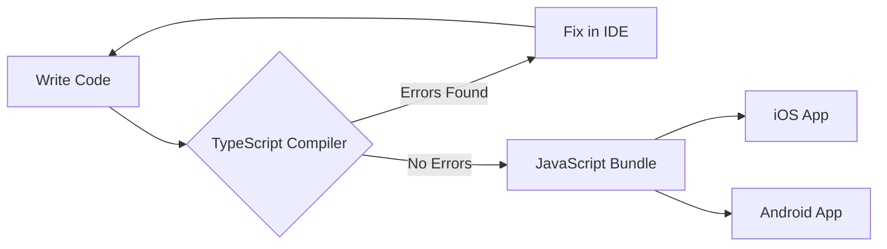
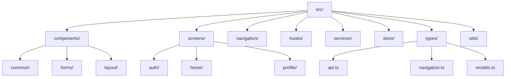

# How to Use React Native with TypeScript

Author: [nawazdhandala](https://www.github.com/nawazdhandala)

Tags: React Native, TypeScript, Mobile Development, iOS, Android, Cross-Platform, JavaScript, Type Safety

Description: A comprehensive guide to building React Native applications with TypeScript. Learn project setup, type definitions, navigation typing, state management, API integration, and best practices for type-safe mobile development.

---

> Building mobile apps without type safety is like navigating without a map. TypeScript brings compile-time error checking, intelligent autocomplete, and self-documenting code to React Native development. Your future self will thank you.

React Native combined with TypeScript creates a powerful foundation for building robust mobile applications. You get the cross-platform benefits of React Native while catching bugs before they reach production.

---

## Why TypeScript for React Native?

TypeScript offers several advantages for mobile development:

- **Catch errors at compile time** instead of runtime crashes on user devices
- **Better IDE support** with autocomplete, refactoring, and inline documentation
- **Self-documenting code** through explicit type definitions
- **Safer refactoring** when updating shared components
- **Team collaboration** with clear contracts between components



---

## Project Setup

### Creating a New Project with TypeScript

The React Native CLI includes built-in TypeScript support. Running the following command creates a new project with TypeScript pre-configured, including tsconfig.json and type definitions for React Native.

```bash
# Create a new React Native project with TypeScript template
npx react-native init MyApp --template react-native-template-typescript

# Navigate into the project directory
cd MyApp

# Verify TypeScript is working by running the type checker
npx tsc --noEmit
```

### Adding TypeScript to an Existing Project

For existing JavaScript projects, you can incrementally adopt TypeScript. Install the necessary dependencies and create a configuration file, then rename files from .js to .tsx one at a time.

```bash
# Install TypeScript and type definitions
npm install --save-dev typescript @types/react @types/react-native

# Create TypeScript configuration file
npx tsc --init
```

### TypeScript Configuration

Configure tsconfig.json with settings optimized for React Native development. The strict mode catches more potential issues, while the jsx setting enables JSX syntax in .tsx files.

```json
{
  "compilerOptions": {
    "target": "esnext",
    "module": "commonjs",
    "lib": ["es2017"],
    "allowJs": true,
    "jsx": "react-native",
    "noEmit": true,
    "isolatedModules": true,
    "strict": true,
    "moduleResolution": "node",
    "baseUrl": "./",
    "paths": {
      "@components/*": ["src/components/*"],
      "@screens/*": ["src/screens/*"],
      "@services/*": ["src/services/*"],
      "@types/*": ["src/types/*"],
      "@hooks/*": ["src/hooks/*"]
    },
    "allowSyntheticDefaultImports": true,
    "esModuleInterop": true,
    "skipLibCheck": true,
    "resolveJsonModule": true
  },
  "exclude": [
    "node_modules",
    "babel.config.js",
    "metro.config.js",
    "jest.config.js"
  ]
}
```

---

## Typing Components

### Functional Components with Props

Define explicit interfaces for component props. The FC (FunctionComponent) type is optional but provides implicit children typing and displayName support.

```typescript
// components/UserCard.tsx
// A reusable card component that displays user information
import React from 'react';
import { View, Text, Image, StyleSheet, Pressable } from 'react-native';

// Define the shape of props the component accepts
interface UserCardProps {
  userId: string;
  name: string;
  email: string;
  avatarUrl?: string;          // Optional prop (marked with ?)
  isVerified: boolean;
  onPress: (userId: string) => void;  // Callback function type
}

// Destructure props with their types for clarity
const UserCard: React.FC<UserCardProps> = ({
  userId,
  name,
  email,
  avatarUrl,
  isVerified,
  onPress,
}) => {
  // Handler function with proper event typing
  const handlePress = () => {
    onPress(userId);
  };

  return (
    <Pressable onPress={handlePress} style={styles.container}>
      {avatarUrl && (
        <Image source={{ uri: avatarUrl }} style={styles.avatar} />
      )}
      <View style={styles.info}>
        <Text style={styles.name}>{name}</Text>
        <Text style={styles.email}>{email}</Text>
        {isVerified && <Text style={styles.badge}>Verified</Text>}
      </View>
    </Pressable>
  );
};

// StyleSheet.create provides type checking for style properties
const styles = StyleSheet.create({
  container: {
    flexDirection: 'row',
    padding: 16,
    backgroundColor: '#ffffff',
    borderRadius: 8,
    marginVertical: 4,
  },
  avatar: {
    width: 50,
    height: 50,
    borderRadius: 25,
  },
  info: {
    marginLeft: 12,
    flex: 1,
  },
  name: {
    fontSize: 16,
    fontWeight: '600',
    color: '#1a1a1a',
  },
  email: {
    fontSize: 14,
    color: '#666666',
    marginTop: 2,
  },
  badge: {
    fontSize: 12,
    color: '#22c55e',
    marginTop: 4,
  },
});

export default UserCard;
```

### Components with Children

When your component wraps other components, use PropsWithChildren to include the children type automatically.

```typescript
// components/Card.tsx
// A generic container component that wraps child elements
import React, { PropsWithChildren } from 'react';
import { View, StyleSheet, ViewStyle } from 'react-native';

// PropsWithChildren adds the children prop type automatically
interface CardProps {
  elevated?: boolean;
  style?: ViewStyle;  // Allow custom styles to be passed in
}

const Card: React.FC<PropsWithChildren<CardProps>> = ({
  children,
  elevated = false,
  style,
}) => {
  return (
    <View style={[styles.card, elevated && styles.elevated, style]}>
      {children}
    </View>
  );
};

const styles = StyleSheet.create({
  card: {
    backgroundColor: '#ffffff',
    borderRadius: 12,
    padding: 16,
  },
  elevated: {
    shadowColor: '#000',
    shadowOffset: { width: 0, height: 2 },
    shadowOpacity: 0.1,
    shadowRadius: 8,
    elevation: 4,  // Android shadow
  },
});

export default Card;
```

---

## Typing Hooks

### useState with Types

TypeScript can often infer the state type from the initial value. For complex types or null initial values, provide an explicit type parameter.

```typescript
// hooks/useAuth.ts
// Custom hook for managing authentication state
import { useState, useCallback } from 'react';

// Define the user object shape
interface User {
  id: string;
  email: string;
  displayName: string;
  role: 'admin' | 'user' | 'guest';  // Union type for specific values
}

// Define what the hook returns
interface UseAuthReturn {
  user: User | null;
  isLoading: boolean;
  error: string | null;
  login: (email: string, password: string) => Promise<void>;
  logout: () => void;
}

export const useAuth = (): UseAuthReturn => {
  // Explicit type for nullable state
  const [user, setUser] = useState<User | null>(null);
  // Type inferred from initial value (boolean)
  const [isLoading, setIsLoading] = useState(false);
  // Explicit type for error messages
  const [error, setError] = useState<string | null>(null);

  // useCallback with typed parameters
  const login = useCallback(async (email: string, password: string) => {
    setIsLoading(true);
    setError(null);

    try {
      // API call would go here
      const response = await fetch('/api/login', {
        method: 'POST',
        headers: { 'Content-Type': 'application/json' },
        body: JSON.stringify({ email, password }),
      });

      if (!response.ok) {
        throw new Error('Invalid credentials');
      }

      const userData: User = await response.json();
      setUser(userData);
    } catch (err) {
      // Type guard for error handling
      const message = err instanceof Error ? err.message : 'Login failed';
      setError(message);
    } finally {
      setIsLoading(false);
    }
  }, []);

  const logout = useCallback(() => {
    setUser(null);
  }, []);

  return { user, isLoading, error, login, logout };
};
```

### useRef with Types

Refs require explicit typing because TypeScript cannot infer the element type. Use null as the initial value and provide the element type as a generic parameter.

```typescript
// components/AutoFocusInput.tsx
// Input component that auto-focuses on mount
import React, { useRef, useEffect } from 'react';
import { TextInput, StyleSheet, TextInputProps } from 'react-native';

interface AutoFocusInputProps extends TextInputProps {
  delay?: number;  // Delay before focusing in milliseconds
}

const AutoFocusInput: React.FC<AutoFocusInputProps> = ({
  delay = 0,
  ...props
}) => {
  // Ref type matches the component it will reference
  const inputRef = useRef<TextInput>(null);

  useEffect(() => {
    // Timeout ref for cleanup
    const timeoutId = setTimeout(() => {
      // Optional chaining because ref might be null
      inputRef.current?.focus();
    }, delay);

    // Cleanup function to prevent memory leaks
    return () => clearTimeout(timeoutId);
  }, [delay]);

  return (
    <TextInput
      ref={inputRef}
      style={styles.input}
      {...props}
    />
  );
};

const styles = StyleSheet.create({
  input: {
    height: 48,
    borderWidth: 1,
    borderColor: '#e0e0e0',
    borderRadius: 8,
    paddingHorizontal: 16,
    fontSize: 16,
  },
});

export default AutoFocusInput;
```

### useReducer with Types

For complex state logic, useReducer provides better type safety than multiple useState calls. Define action types as discriminated unions for exhaustive type checking.

```typescript
// hooks/useCart.ts
// Shopping cart state management with reducer pattern
import { useReducer } from 'react';

// Define the product type
interface Product {
  id: string;
  name: string;
  price: number;
  quantity: number;
}

// Define the cart state shape
interface CartState {
  items: Product[];
  total: number;
  itemCount: number;
}

// Discriminated union for all possible actions
type CartAction =
  | { type: 'ADD_ITEM'; payload: Omit<Product, 'quantity'> }
  | { type: 'REMOVE_ITEM'; payload: { id: string } }
  | { type: 'UPDATE_QUANTITY'; payload: { id: string; quantity: number } }
  | { type: 'CLEAR_CART' };

// Initial state
const initialState: CartState = {
  items: [],
  total: 0,
  itemCount: 0,
};

// Helper function to calculate totals
const calculateTotals = (items: Product[]): Pick<CartState, 'total' | 'itemCount'> => ({
  total: items.reduce((sum, item) => sum + item.price * item.quantity, 0),
  itemCount: items.reduce((count, item) => count + item.quantity, 0),
});

// Reducer function with full type safety
const cartReducer = (state: CartState, action: CartAction): CartState => {
  switch (action.type) {
    case 'ADD_ITEM': {
      const existingItem = state.items.find(item => item.id === action.payload.id);

      let newItems: Product[];
      if (existingItem) {
        // Increment quantity if item exists
        newItems = state.items.map(item =>
          item.id === action.payload.id
            ? { ...item, quantity: item.quantity + 1 }
            : item
        );
      } else {
        // Add new item with quantity 1
        newItems = [...state.items, { ...action.payload, quantity: 1 }];
      }

      return { ...state, items: newItems, ...calculateTotals(newItems) };
    }

    case 'REMOVE_ITEM': {
      const newItems = state.items.filter(item => item.id !== action.payload.id);
      return { ...state, items: newItems, ...calculateTotals(newItems) };
    }

    case 'UPDATE_QUANTITY': {
      const newItems = state.items.map(item =>
        item.id === action.payload.id
          ? { ...item, quantity: Math.max(0, action.payload.quantity) }
          : item
      ).filter(item => item.quantity > 0);

      return { ...state, items: newItems, ...calculateTotals(newItems) };
    }

    case 'CLEAR_CART':
      return initialState;

    default:
      // TypeScript ensures all cases are handled
      return state;
  }
};

// Export the hook
export const useCart = () => {
  const [state, dispatch] = useReducer(cartReducer, initialState);

  return {
    ...state,
    addItem: (product: Omit<Product, 'quantity'>) =>
      dispatch({ type: 'ADD_ITEM', payload: product }),
    removeItem: (id: string) =>
      dispatch({ type: 'REMOVE_ITEM', payload: { id } }),
    updateQuantity: (id: string, quantity: number) =>
      dispatch({ type: 'UPDATE_QUANTITY', payload: { id, quantity } }),
    clearCart: () =>
      dispatch({ type: 'CLEAR_CART' }),
  };
};
```

---

## Typing Navigation

### React Navigation Setup

React Navigation requires additional type definitions to provide type-safe navigation between screens. Define a param list type that maps screen names to their expected parameters.

```typescript
// navigation/types.ts
// Central type definitions for all navigation routes
import { NativeStackScreenProps } from '@react-navigation/native-stack';
import { BottomTabScreenProps } from '@react-navigation/bottom-tabs';
import { CompositeScreenProps } from '@react-navigation/native';

// Root stack contains the main app navigation structure
export type RootStackParamList = {
  // Screen with no parameters
  Home: undefined;
  // Screen with required parameters
  ProductDetail: { productId: string };
  // Screen with optional parameters
  Search: { query?: string; category?: string };
  // Screen with object parameter
  UserProfile: { userId: string; fromNotification?: boolean };
  // Nested navigator (tab navigator)
  MainTabs: undefined;
};

// Bottom tab navigator screens
export type MainTabParamList = {
  HomeTab: undefined;
  CartTab: undefined;
  ProfileTab: undefined;
  SettingsTab: undefined;
};

// Type helper for stack screen props
export type RootStackScreenProps<T extends keyof RootStackParamList> =
  NativeStackScreenProps<RootStackParamList, T>;

// Type helper for tab screen props (with access to parent stack)
export type MainTabScreenProps<T extends keyof MainTabParamList> =
  CompositeScreenProps<
    BottomTabScreenProps<MainTabParamList, T>,
    RootStackScreenProps<keyof RootStackParamList>
  >;
```

### Typed Screen Components

With navigation types defined, screen components receive fully typed route parameters and navigation functions.

```typescript
// screens/ProductDetailScreen.tsx
// Product detail screen with typed navigation props
import React, { useEffect, useState } from 'react';
import { View, Text, ScrollView, ActivityIndicator, StyleSheet } from 'react-native';
import { RootStackScreenProps } from '../navigation/types';

// Define the product data shape
interface Product {
  id: string;
  name: string;
  description: string;
  price: number;
  imageUrl: string;
  rating: number;
}

// Props type comes from the navigation type helper
type Props = RootStackScreenProps<'ProductDetail'>;

const ProductDetailScreen: React.FC<Props> = ({ route, navigation }) => {
  // route.params is typed - productId is guaranteed to exist
  const { productId } = route.params;

  const [product, setProduct] = useState<Product | null>(null);
  const [loading, setLoading] = useState(true);

  useEffect(() => {
    // Set the screen title dynamically
    if (product) {
      navigation.setOptions({ title: product.name });
    }
  }, [product, navigation]);

  useEffect(() => {
    const fetchProduct = async () => {
      try {
        const response = await fetch(`/api/products/${productId}`);
        const data: Product = await response.json();
        setProduct(data);
      } catch (error) {
        console.error('Failed to fetch product:', error);
      } finally {
        setLoading(false);
      }
    };

    fetchProduct();
  }, [productId]);

  if (loading) {
    return (
      <View style={styles.centered}>
        <ActivityIndicator size="large" color="#3b82f6" />
      </View>
    );
  }

  if (!product) {
    return (
      <View style={styles.centered}>
        <Text style={styles.errorText}>Product not found</Text>
      </View>
    );
  }

  return (
    <ScrollView style={styles.container}>
      <Text style={styles.name}>{product.name}</Text>
      <Text style={styles.price}>${product.price.toFixed(2)}</Text>
      <Text style={styles.description}>{product.description}</Text>
    </ScrollView>
  );
};

const styles = StyleSheet.create({
  container: {
    flex: 1,
    padding: 16,
    backgroundColor: '#ffffff',
  },
  centered: {
    flex: 1,
    justifyContent: 'center',
    alignItems: 'center',
  },
  name: {
    fontSize: 24,
    fontWeight: '700',
    color: '#1a1a1a',
  },
  price: {
    fontSize: 20,
    fontWeight: '600',
    color: '#22c55e',
    marginTop: 8,
  },
  description: {
    fontSize: 16,
    color: '#4a4a4a',
    marginTop: 16,
    lineHeight: 24,
  },
  errorText: {
    fontSize: 16,
    color: '#ef4444',
  },
});

export default ProductDetailScreen;
```

### Type-Safe Navigation Calls

Navigation calls are type-checked against the param list. Passing wrong parameters or navigating to non-existent screens triggers compile-time errors.

```typescript
// components/ProductList.tsx
// Product list with type-safe navigation
import React from 'react';
import { FlatList, Pressable, Text, View, StyleSheet } from 'react-native';
import { useNavigation } from '@react-navigation/native';
import { NativeStackNavigationProp } from '@react-navigation/native-stack';
import { RootStackParamList } from '../navigation/types';

interface Product {
  id: string;
  name: string;
  price: number;
}

interface ProductListProps {
  products: Product[];
}

// Type the navigation hook for compile-time safety
type NavigationProp = NativeStackNavigationProp<RootStackParamList>;

const ProductList: React.FC<ProductListProps> = ({ products }) => {
  const navigation = useNavigation<NavigationProp>();

  const handleProductPress = (productId: string) => {
    // TypeScript verifies that ProductDetail expects { productId: string }
    navigation.navigate('ProductDetail', { productId });

    // These would cause compile errors:
    // navigation.navigate('ProductDetail', { wrongParam: '123' }); // Error!
    // navigation.navigate('NonExistentScreen'); // Error!
  };

  const handleSearch = (query: string) => {
    // Optional params work correctly
    navigation.navigate('Search', { query });
    // Or with no params since they're all optional
    navigation.navigate('Search', {});
  };

  const renderItem = ({ item }: { item: Product }) => (
    <Pressable
      style={styles.item}
      onPress={() => handleProductPress(item.id)}
    >
      <Text style={styles.name}>{item.name}</Text>
      <Text style={styles.price}>${item.price.toFixed(2)}</Text>
    </Pressable>
  );

  return (
    <FlatList
      data={products}
      keyExtractor={(item) => item.id}
      renderItem={renderItem}
      contentContainerStyle={styles.list}
    />
  );
};

const styles = StyleSheet.create({
  list: {
    padding: 16,
  },
  item: {
    padding: 16,
    backgroundColor: '#ffffff',
    borderRadius: 8,
    marginBottom: 8,
    flexDirection: 'row',
    justifyContent: 'space-between',
    alignItems: 'center',
  },
  name: {
    fontSize: 16,
    fontWeight: '500',
    color: '#1a1a1a',
  },
  price: {
    fontSize: 16,
    fontWeight: '600',
    color: '#22c55e',
  },
});

export default ProductList;
```

---

## Typing API Calls

### API Response Types

Define types for all API responses to ensure data consistency throughout your app. Use generics for reusable response wrappers.

```typescript
// types/api.ts
// Common API response types used across the application

// Generic wrapper for paginated responses
export interface PaginatedResponse<T> {
  data: T[];
  pagination: {
    page: number;
    pageSize: number;
    totalItems: number;
    totalPages: number;
  };
}

// Generic wrapper for API responses
export interface ApiResponse<T> {
  success: boolean;
  data: T;
  message?: string;
  errors?: Record<string, string[]>;
}

// User-related types
export interface User {
  id: string;
  email: string;
  displayName: string;
  avatarUrl: string | null;
  createdAt: string;
  updatedAt: string;
}

export interface CreateUserRequest {
  email: string;
  password: string;
  displayName: string;
}

export interface UpdateUserRequest {
  displayName?: string;
  avatarUrl?: string;
}

// Product-related types
export interface Product {
  id: string;
  name: string;
  description: string;
  price: number;
  category: string;
  imageUrls: string[];
  inStock: boolean;
  rating: number;
  reviewCount: number;
}

export interface ProductFilters {
  category?: string;
  minPrice?: number;
  maxPrice?: number;
  inStock?: boolean;
  sortBy?: 'price' | 'rating' | 'newest';
  sortOrder?: 'asc' | 'desc';
}
```

### Typed API Client

Create a typed API client that provides compile-time checking for all API calls. Generic functions allow reuse while maintaining type safety.

```typescript
// services/api.ts
// Type-safe API client with error handling
import { ApiResponse, PaginatedResponse, Product, ProductFilters, User } from '../types/api';

// Base URL from environment or config
const BASE_URL = 'https://api.example.com';

// Custom error class for API errors
class ApiError extends Error {
  constructor(
    message: string,
    public statusCode: number,
    public errors?: Record<string, string[]>
  ) {
    super(message);
    this.name = 'ApiError';
  }
}

// Generic fetch wrapper with type safety
async function fetchApi<T>(
  endpoint: string,
  options: RequestInit = {}
): Promise<T> {
  const url = `${BASE_URL}${endpoint}`;

  // Get auth token from storage
  const token = await getStoredToken();

  const response = await fetch(url, {
    ...options,
    headers: {
      'Content-Type': 'application/json',
      ...(token && { Authorization: `Bearer ${token}` }),
      ...options.headers,
    },
  });

  // Parse response body
  const data = await response.json();

  // Handle error responses
  if (!response.ok) {
    throw new ApiError(
      data.message || 'Request failed',
      response.status,
      data.errors
    );
  }

  return data;
}

// Type-safe API methods
export const api = {
  // User endpoints
  users: {
    getMe: () =>
      fetchApi<ApiResponse<User>>('/users/me'),

    getById: (id: string) =>
      fetchApi<ApiResponse<User>>(`/users/${id}`),

    update: (id: string, data: Partial<User>) =>
      fetchApi<ApiResponse<User>>(`/users/${id}`, {
        method: 'PATCH',
        body: JSON.stringify(data),
      }),
  },

  // Product endpoints
  products: {
    getAll: (filters?: ProductFilters) => {
      const params = new URLSearchParams();

      if (filters) {
        Object.entries(filters).forEach(([key, value]) => {
          if (value !== undefined) {
            params.append(key, String(value));
          }
        });
      }

      const query = params.toString();
      return fetchApi<PaginatedResponse<Product>>(
        `/products${query ? `?${query}` : ''}`
      );
    },

    getById: (id: string) =>
      fetchApi<ApiResponse<Product>>(`/products/${id}`),

    search: (query: string, page = 1) =>
      fetchApi<PaginatedResponse<Product>>(
        `/products/search?q=${encodeURIComponent(query)}&page=${page}`
      ),
  },

  // Auth endpoints
  auth: {
    login: (email: string, password: string) =>
      fetchApi<ApiResponse<{ token: string; user: User }>>('/auth/login', {
        method: 'POST',
        body: JSON.stringify({ email, password }),
      }),

    logout: () =>
      fetchApi<ApiResponse<void>>('/auth/logout', { method: 'POST' }),

    refreshToken: (refreshToken: string) =>
      fetchApi<ApiResponse<{ token: string }>>('/auth/refresh', {
        method: 'POST',
        body: JSON.stringify({ refreshToken }),
      }),
  },
};

// Helper function placeholder
async function getStoredToken(): Promise<string | null> {
  // Implementation using AsyncStorage or SecureStore
  return null;
}
```

### Using the API Client

The typed API client provides autocomplete for all endpoints and type checking for request parameters and response handling.

```typescript
// screens/ProductsScreen.tsx
// Products screen using the typed API client
import React, { useEffect, useState } from 'react';
import { View, FlatList, ActivityIndicator, StyleSheet } from 'react-native';
import { api } from '../services/api';
import { Product, ProductFilters } from '../types/api';
import ProductCard from '../components/ProductCard';

const ProductsScreen: React.FC = () => {
  const [products, setProducts] = useState<Product[]>([]);
  const [loading, setLoading] = useState(true);
  const [page, setPage] = useState(1);
  const [hasMore, setHasMore] = useState(true);

  const fetchProducts = async (pageNum: number, filters?: ProductFilters) => {
    try {
      // API response is fully typed
      const response = await api.products.getAll({
        ...filters,
        sortBy: 'newest',
      });

      if (pageNum === 1) {
        setProducts(response.data);
      } else {
        setProducts(prev => [...prev, ...response.data]);
      }

      // Access pagination info with type safety
      setHasMore(pageNum < response.pagination.totalPages);
    } catch (error) {
      console.error('Failed to fetch products:', error);
    } finally {
      setLoading(false);
    }
  };

  useEffect(() => {
    fetchProducts(1);
  }, []);

  const loadMore = () => {
    if (!loading && hasMore) {
      const nextPage = page + 1;
      setPage(nextPage);
      fetchProducts(nextPage);
    }
  };

  if (loading && products.length === 0) {
    return (
      <View style={styles.centered}>
        <ActivityIndicator size="large" />
      </View>
    );
  }

  return (
    <FlatList
      data={products}
      keyExtractor={(item) => item.id}
      renderItem={({ item }) => <ProductCard product={item} />}
      onEndReached={loadMore}
      onEndReachedThreshold={0.5}
      contentContainerStyle={styles.list}
    />
  );
};

const styles = StyleSheet.create({
  centered: {
    flex: 1,
    justifyContent: 'center',
    alignItems: 'center',
  },
  list: {
    padding: 16,
  },
});

export default ProductsScreen;
```

---

## State Management with TypeScript

### Context API with Types

For simpler state management needs, the Context API combined with TypeScript provides excellent type safety without additional dependencies.

```typescript
// context/ThemeContext.tsx
// Type-safe theme context with dark mode support
import React, { createContext, useContext, useState, useCallback, useMemo } from 'react';

// Define available themes
type ThemeMode = 'light' | 'dark' | 'system';

// Define the theme object structure
interface Theme {
  mode: ThemeMode;
  colors: {
    background: string;
    surface: string;
    text: string;
    textSecondary: string;
    primary: string;
    border: string;
  };
}

// Define context value shape
interface ThemeContextValue {
  theme: Theme;
  setThemeMode: (mode: ThemeMode) => void;
  toggleTheme: () => void;
}

// Theme definitions
const lightTheme: Theme = {
  mode: 'light',
  colors: {
    background: '#ffffff',
    surface: '#f5f5f5',
    text: '#1a1a1a',
    textSecondary: '#666666',
    primary: '#3b82f6',
    border: '#e0e0e0',
  },
};

const darkTheme: Theme = {
  mode: 'dark',
  colors: {
    background: '#1a1a1a',
    surface: '#2d2d2d',
    text: '#ffffff',
    textSecondary: '#a0a0a0',
    primary: '#60a5fa',
    border: '#404040',
  },
};

// Create context with undefined default (will be provided by provider)
const ThemeContext = createContext<ThemeContextValue | undefined>(undefined);

// Provider component
export const ThemeProvider: React.FC<{ children: React.ReactNode }> = ({ children }) => {
  const [themeMode, setThemeMode] = useState<ThemeMode>('light');

  // Memoize theme object to prevent unnecessary re-renders
  const theme = useMemo(() => {
    return themeMode === 'dark' ? darkTheme : lightTheme;
  }, [themeMode]);

  // Toggle between light and dark
  const toggleTheme = useCallback(() => {
    setThemeMode(prev => (prev === 'light' ? 'dark' : 'light'));
  }, []);

  // Memoize context value
  const value = useMemo(
    () => ({ theme, setThemeMode, toggleTheme }),
    [theme, toggleTheme]
  );

  return (
    <ThemeContext.Provider value={value}>
      {children}
    </ThemeContext.Provider>
  );
};

// Custom hook with type safety and error handling
export const useTheme = (): ThemeContextValue => {
  const context = useContext(ThemeContext);

  if (!context) {
    throw new Error('useTheme must be used within a ThemeProvider');
  }

  return context;
};
```

### Zustand with TypeScript

Zustand provides a simpler alternative to Redux with excellent TypeScript support. Define the store state and actions in a single interface.

```typescript
// store/useStore.ts
// Global state management with Zustand and TypeScript
import { create } from 'zustand';
import { persist, createJSONStorage } from 'zustand/middleware';
import AsyncStorage from '@react-native-async-storage/async-storage';

// User state and actions
interface User {
  id: string;
  email: string;
  displayName: string;
}

// Define complete store shape
interface AppState {
  // Auth state
  user: User | null;
  token: string | null;
  isAuthenticated: boolean;

  // UI state
  isLoading: boolean;
  notifications: Notification[];

  // Actions
  setUser: (user: User | null) => void;
  setToken: (token: string | null) => void;
  logout: () => void;
  setLoading: (loading: boolean) => void;
  addNotification: (notification: Omit<Notification, 'id'>) => void;
  removeNotification: (id: string) => void;
}

interface Notification {
  id: string;
  type: 'success' | 'error' | 'info' | 'warning';
  message: string;
  duration?: number;
}

// Create store with persistence
export const useStore = create<AppState>()(
  persist(
    (set, get) => ({
      // Initial state
      user: null,
      token: null,
      isAuthenticated: false,
      isLoading: false,
      notifications: [],

      // Auth actions
      setUser: (user) =>
        set({
          user,
          isAuthenticated: user !== null,
        }),

      setToken: (token) =>
        set({ token }),

      logout: () =>
        set({
          user: null,
          token: null,
          isAuthenticated: false,
        }),

      // UI actions
      setLoading: (isLoading) =>
        set({ isLoading }),

      addNotification: (notification) =>
        set((state) => ({
          notifications: [
            ...state.notifications,
            { ...notification, id: Date.now().toString() },
          ],
        })),

      removeNotification: (id) =>
        set((state) => ({
          notifications: state.notifications.filter((n) => n.id !== id),
        })),
    }),
    {
      name: 'app-storage',
      storage: createJSONStorage(() => AsyncStorage),
      // Only persist specific fields
      partialize: (state) => ({
        user: state.user,
        token: state.token,
        isAuthenticated: state.isAuthenticated,
      }),
    }
  )
);

// Selector hooks for better performance
export const useUser = () => useStore((state) => state.user);
export const useIsAuthenticated = () => useStore((state) => state.isAuthenticated);
export const useNotifications = () => useStore((state) => state.notifications);
```

---

## Typing Native Modules

### Custom Native Module Types

When using native modules or creating custom ones, define type declarations to maintain type safety at the JavaScript/TypeScript boundary.

```typescript
// types/native-modules.d.ts
// Type declarations for custom native modules
import { NativeModule } from 'react-native';

// Declare the shape of your native module
interface BiometricModule extends NativeModule {
  // Methods exposed from native code
  isBiometricAvailable(): Promise<boolean>;
  getBiometricType(): Promise<'fingerprint' | 'face' | 'iris' | 'none'>;
  authenticate(reason: string): Promise<{
    success: boolean;
    error?: string;
  }>;
}

// Extend React Native's NativeModules type
declare module 'react-native' {
  interface NativeModulesStatic {
    BiometricModule: BiometricModule;
  }
}

// Types for native events
export interface BiometricEventPayload {
  type: 'success' | 'failure' | 'cancelled';
  error?: string;
}
```

### Using Native Modules with Types

Access native modules with full type safety after declaring their interfaces.

```typescript
// services/biometric.ts
// Type-safe biometric authentication service
import { NativeModules, NativeEventEmitter, Platform } from 'react-native';

const { BiometricModule } = NativeModules;
const biometricEmitter = new NativeEventEmitter(BiometricModule);

// Type-safe result type
interface BiometricResult {
  authenticated: boolean;
  biometricType: 'fingerprint' | 'face' | 'iris' | 'none';
  error?: string;
}

export const biometricService = {
  // Check if biometric auth is available on device
  async checkAvailability(): Promise<boolean> {
    if (Platform.OS === 'web') {
      return false;
    }
    return BiometricModule.isBiometricAvailable();
  },

  // Get the type of biometric sensor available
  async getBiometricType() {
    return BiometricModule.getBiometricType();
  },

  // Perform biometric authentication
  async authenticate(reason: string): Promise<BiometricResult> {
    try {
      const biometricType = await BiometricModule.getBiometricType();
      const result = await BiometricModule.authenticate(reason);

      return {
        authenticated: result.success,
        biometricType,
        error: result.error,
      };
    } catch (error) {
      return {
        authenticated: false,
        biometricType: 'none',
        error: error instanceof Error ? error.message : 'Unknown error',
      };
    }
  },

  // Subscribe to biometric events
  onBiometricEvent(callback: (event: BiometricEventPayload) => void) {
    const subscription = biometricEmitter.addListener(
      'BiometricEvent',
      callback
    );

    // Return cleanup function
    return () => subscription.remove();
  },
};
```

---

## Project Architecture

A well-organized project structure makes TypeScript more effective by keeping types close to their usage and enabling clear module boundaries.



### Recommended Folder Structure

Organize your project to group related files and keep type definitions easily discoverable.

```
src/
  components/           # Reusable UI components
    common/
      Button.tsx
      Button.test.tsx
    forms/
      TextInput.tsx
      Select.tsx
    layout/
      Header.tsx
      TabBar.tsx

  screens/              # Screen components (one per route)
    auth/
      LoginScreen.tsx
      RegisterScreen.tsx
    home/
      HomeScreen.tsx
    profile/
      ProfileScreen.tsx

  navigation/           # Navigation configuration
    RootNavigator.tsx
    MainTabNavigator.tsx
    types.ts            # Navigation type definitions

  hooks/                # Custom React hooks
    useAuth.ts
    useApi.ts
    useDebounce.ts

  services/             # External service integrations
    api.ts
    storage.ts
    analytics.ts

  store/                # State management
    useStore.ts
    slices/
      authSlice.ts
      cartSlice.ts

  types/                # Shared type definitions
    api.ts              # API request/response types
    models.ts           # Domain model types
    native-modules.d.ts # Native module declarations

  utils/                # Utility functions
    formatting.ts
    validation.ts
    constants.ts

  App.tsx               # Root component
  index.ts              # Entry point
```

---

## Best Practices

### 1. Avoid the `any` Type

Using `any` defeats the purpose of TypeScript. When you need flexibility, prefer `unknown` with type guards.

```typescript
// Avoid this - disables all type checking
function processData(data: any) {
  return data.someProperty; // No error even if property doesn't exist
}

// Better - requires type checking before use
function processDataSafe(data: unknown) {
  if (typeof data === 'object' && data !== null && 'someProperty' in data) {
    return (data as { someProperty: string }).someProperty;
  }
  throw new Error('Invalid data structure');
}

// Best - define the expected type
interface DataShape {
  someProperty: string;
}

function processDataTyped(data: DataShape) {
  return data.someProperty; // Type-safe
}
```

### 2. Use Discriminated Unions for Complex State

Discriminated unions make impossible states unrepresentable and provide exhaustive checking in switch statements.

```typescript
// Define all possible states for async data
type AsyncState<T> =
  | { status: 'idle' }
  | { status: 'loading' }
  | { status: 'success'; data: T }
  | { status: 'error'; error: string };

// Usage in a component
function UserProfile() {
  const [state, setState] = useState<AsyncState<User>>({ status: 'idle' });

  // TypeScript knows the exact shape based on status
  switch (state.status) {
    case 'idle':
      return <Text>Ready to load</Text>;
    case 'loading':
      return <ActivityIndicator />;
    case 'success':
      // data is available here
      return <Text>{state.data.displayName}</Text>;
    case 'error':
      // error is available here
      return <Text style={styles.error}>{state.error}</Text>;
  }
}
```

### 3. Create Type Guards for Runtime Validation

Type guards narrow types at runtime and inform the TypeScript compiler about the narrowed type.

```typescript
// Type guard function
function isUser(value: unknown): value is User {
  return (
    typeof value === 'object' &&
    value !== null &&
    'id' in value &&
    'email' in value &&
    typeof (value as User).id === 'string' &&
    typeof (value as User).email === 'string'
  );
}

// Using the type guard
async function fetchUser(id: string): Promise<User> {
  const response = await fetch(`/api/users/${id}`);
  const data: unknown = await response.json();

  if (!isUser(data)) {
    throw new Error('Invalid user data received from API');
  }

  // TypeScript knows data is User here
  return data;
}
```

### 4. Leverage Type Inference

Let TypeScript infer types when the inference is clear and accurate. Explicit types are only needed when inference fails or you want to enforce a specific type.

```typescript
// TypeScript infers the correct types here
const count = 0;                    // number
const name = 'John';                // string
const users = ['Alice', 'Bob'];     // string[]

// Explicit type needed for empty arrays
const items: Product[] = [];

// Explicit type needed for function parameters
function formatPrice(price: number): string {
  return `$${price.toFixed(2)}`;
}

// Let TypeScript infer the return type when possible
function createUser(name: string, email: string) {
  return { id: generateId(), name, email, createdAt: new Date() };
  // Return type is inferred as { id: string; name: string; email: string; createdAt: Date }
}
```

### 5. Use Strict Mode

Enable strict mode in tsconfig.json to catch more potential issues at compile time.

```json
{
  "compilerOptions": {
    "strict": true,
    "noImplicitAny": true,
    "strictNullChecks": true,
    "strictFunctionTypes": true,
    "strictPropertyInitialization": true,
    "noImplicitThis": true,
    "useUnknownInCatchVariables": true,
    "noUncheckedIndexedAccess": true
  }
}
```

---

## Debugging TypeScript

### Common TypeScript Errors

Understanding common errors helps resolve issues quickly.

```typescript
// Error: Property 'x' does not exist on type 'Y'
// Solution: Add the property to the type or use optional chaining
interface User {
  name: string;
  email?: string;  // Make optional if not always present
}

// Error: Type 'X' is not assignable to type 'Y'
// Solution: Ensure types match or add type assertion when you know better
const value: string | number = getValue();
if (typeof value === 'string') {
  // TypeScript now knows value is string
  console.log(value.toUpperCase());
}

// Error: Object is possibly 'undefined'
// Solution: Add null checks or use non-null assertion when sure
function getUser(): User | undefined {
  return users.find(u => u.id === '1');
}

const user = getUser();
if (user) {
  console.log(user.name);  // Safe
}

// Or with non-null assertion (only when you're certain)
const knownUser = getUser()!;  // Asserts user is defined
```

### VS Code Integration

Configure VS Code for optimal TypeScript development with React Native.

```json
// .vscode/settings.json
{
  "typescript.preferences.importModuleSpecifier": "relative",
  "typescript.suggest.autoImports": true,
  "typescript.updateImportsOnFileMove.enabled": "always",
  "editor.codeActionsOnSave": {
    "source.organizeImports": "explicit"
  },
  "typescript.tsdk": "node_modules/typescript/lib"
}
```

---

## Conclusion

TypeScript transforms React Native development by catching errors early and providing better tooling support. The initial setup investment pays off through:

- Fewer runtime crashes on user devices
- Faster development with intelligent autocomplete
- Easier refactoring with confidence
- Self-documenting code that new team members can understand

Start with strict mode enabled from day one. Add types incrementally, focusing on component props, API responses, and navigation first. Over time, your codebase becomes more maintainable and your development experience improves significantly.

---

*Building a mobile app and need reliable monitoring? [OneUptime](https://oneuptime.com) provides crash reporting, performance monitoring, and alerting for React Native applications.*

**Related Reading:**
- [How to Handle JWT Authentication Securely in Python](https://oneuptime.com/blog/post/2025-01-06-python-jwt-authentication/view)
