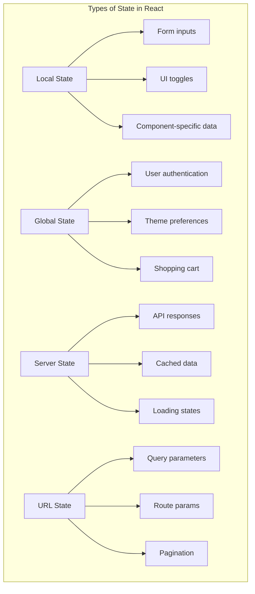
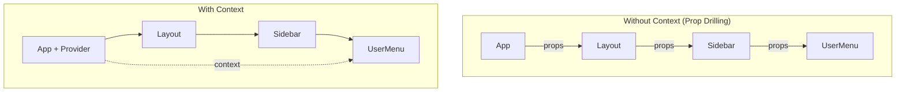
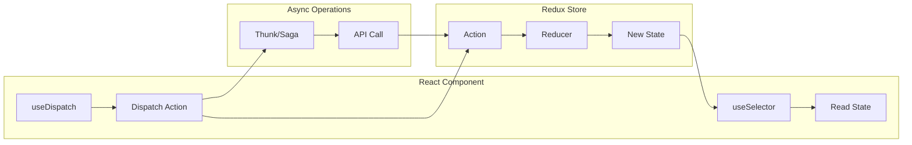
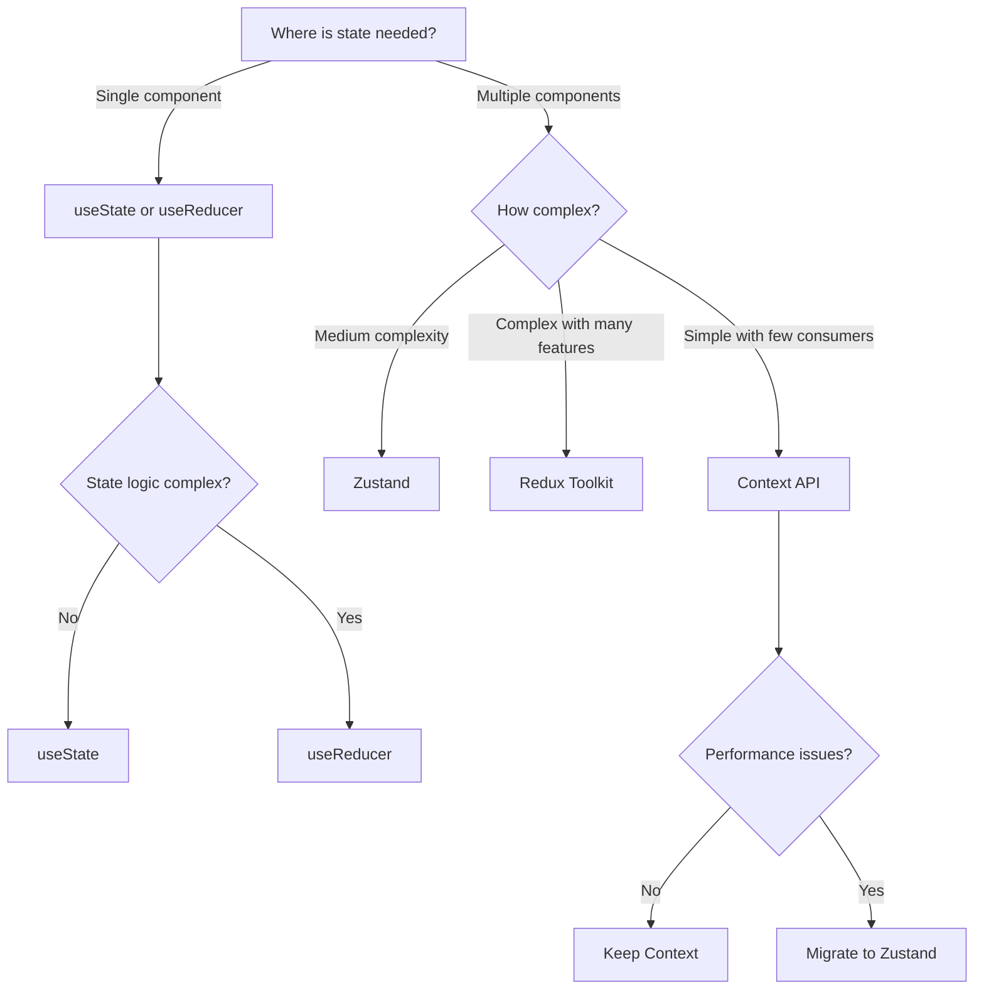

# How to Handle State Management in React

Author: [nawazdhandala](https://www.github.com/nawazdhandala)

Tags: React, State Management, JavaScript, Hooks, Redux, Context API, Zustand

Description: A hands-on guide to managing state in React applications, covering useState, useReducer, Context API, Redux Toolkit, and Zustand with practical code examples and real-world patterns.

---

> State is the lifeblood of any React application. Your choice of state management strategy will shape how you build components, handle user interactions, and scale your codebase. Master these patterns and you will build applications that are maintainable, performant, and a joy to work with.

Every React developer eventually faces the same question: "Where should I put my state?" The answer is not one-size-fits-all. Small applications thrive with simple useState hooks, while complex applications demand more structured solutions. Let us walk through each approach with practical examples so you can make informed decisions for your projects.

---

## Understanding Different Types of State

Before diving into implementation, recognize that not all state is created equal. React applications typically deal with several distinct categories.



Each type has different requirements for persistence, sharing, and synchronization. Matching the right tool to the right type of state prevents over-engineering simple problems and under-engineering complex ones.

---

## Starting Simple with useState

The useState hook handles most component-level state needs. Reach for useState first and only move to more complex solutions when you hit its limitations.

The following example demonstrates a form component with multiple pieces of local state. Each input maintains its own state, and validation happens on submission.

```javascript
// components/ContactForm.jsx
// Form component using useState for local state management
// Each field has its own state variable for simplicity
import React, { useState } from 'react';

const ContactForm = ({ onSubmit }) => {
  // Individual state variables for each form field
  // useState returns [currentValue, setterFunction]
  const [name, setName] = useState('');
  const [email, setEmail] = useState('');
  const [message, setMessage] = useState('');

  // Separate state for UI concerns
  const [isSubmitting, setIsSubmitting] = useState(false);
  const [errors, setErrors] = useState({});

  // Validation function that checks all fields
  // Returns an object with field names as keys and error messages as values
  const validateForm = () => {
    const newErrors = {};

    if (!name.trim()) {
      newErrors.name = 'Name is required';
    }

    if (!email.trim()) {
      newErrors.email = 'Email is required';
    } else if (!/^[^\s@]+@[^\s@]+\.[^\s@]+$/.test(email)) {
      newErrors.email = 'Please enter a valid email';
    }

    if (!message.trim()) {
      newErrors.message = 'Message is required';
    } else if (message.length < 10) {
      newErrors.message = 'Message must be at least 10 characters';
    }

    return newErrors;
  };

  // Form submission handler
  // Validates, sets loading state, and calls parent callback
  const handleSubmit = async (e) => {
    e.preventDefault();

    const formErrors = validateForm();
    setErrors(formErrors);

    // Stop if validation failed
    if (Object.keys(formErrors).length > 0) {
      return;
    }

    setIsSubmitting(true);

    try {
      await onSubmit({ name, email, message });

      // Clear form on success
      setName('');
      setEmail('');
      setMessage('');
    } catch (error) {
      setErrors({ submit: error.message });
    } finally {
      setIsSubmitting(false);
    }
  };

  return (
    <form onSubmit={handleSubmit} className="contact-form">
      <div className="form-group">
        <label htmlFor="name">Name</label>
        <input
          id="name"
          type="text"
          value={name}
          onChange={(e) => setName(e.target.value)}
          className={errors.name ? 'error' : ''}
          disabled={isSubmitting}
        />
        {errors.name && <span className="error-message">{errors.name}</span>}
      </div>

      <div className="form-group">
        <label htmlFor="email">Email</label>
        <input
          id="email"
          type="email"
          value={email}
          onChange={(e) => setEmail(e.target.value)}
          className={errors.email ? 'error' : ''}
          disabled={isSubmitting}
        />
        {errors.email && <span className="error-message">{errors.email}</span>}
      </div>

      <div className="form-group">
        <label htmlFor="message">Message</label>
        <textarea
          id="message"
          value={message}
          onChange={(e) => setMessage(e.target.value)}
          rows={5}
          className={errors.message ? 'error' : ''}
          disabled={isSubmitting}
        />
        {errors.message && <span className="error-message">{errors.message}</span>}
      </div>

      {errors.submit && (
        <div className="error-banner">{errors.submit}</div>
      )}

      <button type="submit" disabled={isSubmitting}>
        {isSubmitting ? 'Sending...' : 'Send Message'}
      </button>
    </form>
  );
};

export default ContactForm;
```

---

## Handling Complex State with useReducer

When state logic becomes intricate with multiple related values or state transitions that depend on previous state, useReducer provides a cleaner pattern. It centralizes all state mutations in a single reducer function, making the component easier to test and reason about.

The following shopping cart example shows how useReducer handles multiple interdependent state updates through clearly defined actions.

```javascript
// components/ShoppingCart.jsx
// Shopping cart with complex state logic using useReducer
// All state transitions flow through the reducer function
import React, { useReducer, useMemo } from 'react';

// Initial state defines the shape of our cart data
const initialState = {
  items: [],
  couponCode: null,
  couponDiscount: 0,
};

// Action type constants prevent typos and enable autocomplete
const ACTIONS = {
  ADD_ITEM: 'ADD_ITEM',
  REMOVE_ITEM: 'REMOVE_ITEM',
  UPDATE_QUANTITY: 'UPDATE_QUANTITY',
  APPLY_COUPON: 'APPLY_COUPON',
  REMOVE_COUPON: 'REMOVE_COUPON',
  CLEAR_CART: 'CLEAR_CART',
};

// Reducer function handles all state transitions
// Takes current state and an action, returns new state
// Pure function with no side effects
function cartReducer(state, action) {
  switch (action.type) {
    case ACTIONS.ADD_ITEM: {
      const existingIndex = state.items.findIndex(
        (item) => item.id === action.payload.id
      );

      if (existingIndex >= 0) {
        // Item exists, increment quantity
        const updatedItems = state.items.map((item, index) =>
          index === existingIndex
            ? { ...item, quantity: item.quantity + 1 }
            : item
        );
        return { ...state, items: updatedItems };
      }

      // New item, add to cart with quantity 1
      return {
        ...state,
        items: [...state.items, { ...action.payload, quantity: 1 }],
      };
    }

    case ACTIONS.REMOVE_ITEM: {
      return {
        ...state,
        items: state.items.filter((item) => item.id !== action.payload.id),
      };
    }

    case ACTIONS.UPDATE_QUANTITY: {
      const { id, quantity } = action.payload;

      if (quantity <= 0) {
        // Remove item if quantity drops to zero
        return {
          ...state,
          items: state.items.filter((item) => item.id !== id),
        };
      }

      return {
        ...state,
        items: state.items.map((item) =>
          item.id === id ? { ...item, quantity } : item
        ),
      };
    }

    case ACTIONS.APPLY_COUPON: {
      const { code, discount } = action.payload;
      return {
        ...state,
        couponCode: code,
        couponDiscount: discount,
      };
    }

    case ACTIONS.REMOVE_COUPON: {
      return {
        ...state,
        couponCode: null,
        couponDiscount: 0,
      };
    }

    case ACTIONS.CLEAR_CART: {
      return initialState;
    }

    default:
      return state;
  }
}

const ShoppingCart = () => {
  // useReducer returns current state and dispatch function
  const [state, dispatch] = useReducer(cartReducer, initialState);

  // Calculate derived values with useMemo to prevent recalculation
  const { subtotal, discount, total, itemCount } = useMemo(() => {
    const sub = state.items.reduce(
      (sum, item) => sum + item.price * item.quantity,
      0
    );
    const disc = sub * (state.couponDiscount / 100);
    const count = state.items.reduce((sum, item) => sum + item.quantity, 0);

    return {
      subtotal: sub,
      discount: disc,
      total: sub - disc,
      itemCount: count,
    };
  }, [state.items, state.couponDiscount]);

  // Action dispatchers wrap dispatch calls for cleaner component code
  const addItem = (product) => {
    dispatch({ type: ACTIONS.ADD_ITEM, payload: product });
  };

  const removeItem = (id) => {
    dispatch({ type: ACTIONS.REMOVE_ITEM, payload: { id } });
  };

  const updateQuantity = (id, quantity) => {
    dispatch({ type: ACTIONS.UPDATE_QUANTITY, payload: { id, quantity } });
  };

  const applyCoupon = async (code) => {
    // Simulate API call to validate coupon
    const response = await fetch(`/api/coupons/validate?code=${code}`);
    const data = await response.json();

    if (data.valid) {
      dispatch({
        type: ACTIONS.APPLY_COUPON,
        payload: { code, discount: data.discount },
      });
    }
  };

  const clearCart = () => {
    dispatch({ type: ACTIONS.CLEAR_CART });
  };

  return (
    <div className="shopping-cart">
      <h2>Shopping Cart ({itemCount} items)</h2>

      {state.items.length === 0 ? (
        <p className="empty-message">Your cart is empty</p>
      ) : (
        <>
          <ul className="cart-items">
            {state.items.map((item) => (
              <li key={item.id} className="cart-item">
                
                <div className="item-details">
                  <h3>{item.name}</h3>
                  <p className="price">${item.price.toFixed(2)}</p>
                </div>
                <div className="quantity-controls">
                  <button
                    onClick={() => updateQuantity(item.id, item.quantity - 1)}
                    aria-label="Decrease quantity"
                  >
                    -
                  </button>
                  <span>{item.quantity}</span>
                  <button
                    onClick={() => updateQuantity(item.id, item.quantity + 1)}
                    aria-label="Increase quantity"
                  >
                    +
                  </button>
                </div>
                <button
                  className="remove-btn"
                  onClick={() => removeItem(item.id)}
                >
                  Remove
                </button>
              </li>
            ))}
          </ul>

          <div className="cart-summary">
            <div className="summary-row">
              <span>Subtotal:</span>
              <span>${subtotal.toFixed(2)}</span>
            </div>
            {state.couponCode && (
              <div className="summary-row discount">
                <span>Discount ({state.couponCode}):</span>
                <span>-${discount.toFixed(2)}</span>
              </div>
            )}
            <div className="summary-row total">
              <span>Total:</span>
              <span>${total.toFixed(2)}</span>
            </div>
          </div>

          <div className="cart-actions">
            <button className="checkout-btn">Proceed to Checkout</button>
            <button className="clear-btn" onClick={clearCart}>
              Clear Cart
            </button>
          </div>
        </>
      )}
    </div>
  );
};

export default ShoppingCart;
```

---

## Sharing State with Context API

When multiple components need access to the same data, passing props through intermediate components becomes tedious. React's Context API solves prop drilling by providing a way to share values throughout a component tree.

The following diagram illustrates how Context eliminates prop drilling by making state available to any component in the tree.



### Building a Theme Context

The following example creates a complete theme system with Context. Components anywhere in the tree can access and modify the current theme.

```javascript
// context/ThemeContext.jsx
// Theme context providing app-wide theming capabilities
// Includes light and dark themes with toggle functionality
import React, { createContext, useContext, useState, useMemo, useEffect } from 'react';

// Create context with undefined default
// Checking for undefined in the hook catches usage errors
const ThemeContext = createContext(undefined);

// Theme definitions kept outside component to prevent recreation
const themes = {
  light: {
    name: 'light',
    colors: {
      background: '#ffffff',
      surface: '#f5f5f5',
      text: '#1a1a1a',
      textSecondary: '#666666',
      primary: '#3b82f6',
      primaryHover: '#2563eb',
      border: '#e5e5e5',
      error: '#ef4444',
      success: '#22c55e',
    },
  },
  dark: {
    name: 'dark',
    colors: {
      background: '#0f172a',
      surface: '#1e293b',
      text: '#f8fafc',
      textSecondary: '#94a3b8',
      primary: '#60a5fa',
      primaryHover: '#3b82f6',
      border: '#334155',
      error: '#f87171',
      success: '#4ade80',
    },
  },
};

// Provider component wraps the app and supplies theme state
export const ThemeProvider = ({ children }) => {
  // Initialize theme from localStorage or system preference
  const [themeName, setThemeName] = useState(() => {
    const stored = localStorage.getItem('theme');
    if (stored && themes[stored]) {
      return stored;
    }

    // Check system preference
    if (window.matchMedia('(prefers-color-scheme: dark)').matches) {
      return 'dark';
    }

    return 'light';
  });

  // Apply theme to document for CSS variable usage
  useEffect(() => {
    const theme = themes[themeName];
    const root = document.documentElement;

    // Set CSS custom properties for each color
    Object.entries(theme.colors).forEach(([key, value]) => {
      root.style.setProperty(`--color-${key}`, value);
    });

    // Store preference
    localStorage.setItem('theme', themeName);

    // Set class for Tailwind dark mode or other CSS frameworks
    root.classList.toggle('dark', themeName === 'dark');
  }, [themeName]);

  // Memoize context value to prevent unnecessary re-renders
  const value = useMemo(
    () => ({
      theme: themes[themeName],
      themeName,
      isDark: themeName === 'dark',
      toggleTheme: () => {
        setThemeName((prev) => (prev === 'light' ? 'dark' : 'light'));
      },
      setTheme: (name) => {
        if (themes[name]) {
          setThemeName(name);
        }
      },
    }),
    [themeName]
  );

  return (
    <ThemeContext.Provider value={value}>
      {children}
    </ThemeContext.Provider>
  );
};

// Custom hook with helpful error message
export const useTheme = () => {
  const context = useContext(ThemeContext);

  if (context === undefined) {
    throw new Error('useTheme must be used within a ThemeProvider');
  }

  return context;
};
```

### Creating an Authentication Context

Authentication state is a prime candidate for Context since many components need to know about the current user.

```javascript
// context/AuthContext.jsx
// Authentication context managing user session state
// Handles login, logout, and session persistence
import React, {
  createContext,
  useContext,
  useState,
  useEffect,
  useMemo,
  useCallback,
} from 'react';

const AuthContext = createContext(undefined);

export const AuthProvider = ({ children }) => {
  const [user, setUser] = useState(null);
  const [isLoading, setIsLoading] = useState(true);
  const [error, setError] = useState(null);

  // Check for existing session on mount
  useEffect(() => {
    const checkSession = async () => {
      const token = localStorage.getItem('authToken');

      if (!token) {
        setIsLoading(false);
        return;
      }

      try {
        const response = await fetch('/api/auth/me', {
          headers: { Authorization: `Bearer ${token}` },
        });

        if (response.ok) {
          const userData = await response.json();
          setUser(userData);
        } else {
          // Token invalid, clear storage
          localStorage.removeItem('authToken');
        }
      } catch (err) {
        console.error('Session check failed:', err);
      } finally {
        setIsLoading(false);
      }
    };

    checkSession();
  }, []);

  // Login function with error handling
  const login = useCallback(async (email, password) => {
    setIsLoading(true);
    setError(null);

    try {
      const response = await fetch('/api/auth/login', {
        method: 'POST',
        headers: { 'Content-Type': 'application/json' },
        body: JSON.stringify({ email, password }),
      });

      if (!response.ok) {
        const data = await response.json();
        throw new Error(data.message || 'Login failed');
      }

      const { user: userData, token } = await response.json();

      localStorage.setItem('authToken', token);
      setUser(userData);

      return userData;
    } catch (err) {
      setError(err.message);
      throw err;
    } finally {
      setIsLoading(false);
    }
  }, []);

  // Logout clears all auth state
  const logout = useCallback(async () => {
    try {
      const token = localStorage.getItem('authToken');

      if (token) {
        // Notify server about logout
        await fetch('/api/auth/logout', {
          method: 'POST',
          headers: { Authorization: `Bearer ${token}` },
        }).catch(() => {
          // Ignore network errors on logout
        });
      }
    } finally {
      localStorage.removeItem('authToken');
      setUser(null);
    }
  }, []);

  // Register new user
  const register = useCallback(async (userData) => {
    setIsLoading(true);
    setError(null);

    try {
      const response = await fetch('/api/auth/register', {
        method: 'POST',
        headers: { 'Content-Type': 'application/json' },
        body: JSON.stringify(userData),
      });

      if (!response.ok) {
        const data = await response.json();
        throw new Error(data.message || 'Registration failed');
      }

      const { user: newUser, token } = await response.json();

      localStorage.setItem('authToken', token);
      setUser(newUser);

      return newUser;
    } catch (err) {
      setError(err.message);
      throw err;
    } finally {
      setIsLoading(false);
    }
  }, []);

  const value = useMemo(
    () => ({
      user,
      isLoading,
      error,
      isAuthenticated: !!user,
      login,
      logout,
      register,
      clearError: () => setError(null),
    }),
    [user, isLoading, error, login, logout, register]
  );

  return (
    <AuthContext.Provider value={value}>
      {children}
    </AuthContext.Provider>
  );
};

export const useAuth = () => {
  const context = useContext(AuthContext);

  if (context === undefined) {
    throw new Error('useAuth must be used within an AuthProvider');
  }

  return context;
};
```

### Composing Multiple Contexts

Here is how to wire up multiple contexts at the application root.

```javascript
// App.jsx
// Main application component composing multiple context providers
// Provider order matters when contexts depend on each other
import React from 'react';
import { BrowserRouter } from 'react-router-dom';
import { ThemeProvider } from './context/ThemeContext';
import { AuthProvider } from './context/AuthContext';
import AppRoutes from './routes/AppRoutes';
import Header from './components/Header';

const App = () => {
  return (
    // BrowserRouter wraps everything for routing support
    <BrowserRouter>
      {/* ThemeProvider outermost so theme is available everywhere */}
      <ThemeProvider>
        {/* AuthProvider inside theme so auth UI can use theme */}
        <AuthProvider>
          <div className="app">
            <Header />
            <main>
              <AppRoutes />
            </main>
          </div>
        </AuthProvider>
      </ThemeProvider>
    </BrowserRouter>
  );
};

export default App;
```

---

## Scaling with Redux Toolkit

For large applications with complex state interactions, Redux Toolkit provides structure, excellent DevTools integration, and battle-tested patterns. Modern Redux with Toolkit requires far less boilerplate than legacy Redux.

The following diagram shows the Redux data flow architecture.



### Setting Up Redux Toolkit

Install the required packages for Redux Toolkit.

```bash
npm install @reduxjs/toolkit react-redux
```

The store configuration file sets up Redux with multiple feature slices.

```javascript
// store/index.js
// Redux store configuration using Redux Toolkit
// Automatically includes DevTools and thunk middleware
import { configureStore } from '@reduxjs/toolkit';
import authReducer from './slices/authSlice';
import cartReducer from './slices/cartSlice';
import notificationsReducer from './slices/notificationsSlice';

export const store = configureStore({
  reducer: {
    // Each key becomes a top-level state property
    auth: authReducer,
    cart: cartReducer,
    notifications: notificationsReducer,
  },
  // Development mode automatically enables Redux DevTools
  devTools: process.env.NODE_ENV !== 'production',
});

// TypeScript users: export these types
// export type RootState = ReturnType<typeof store.getState>;
// export type AppDispatch = typeof store.dispatch;
```

### Creating Feature Slices

A slice contains all the logic for a single feature. createSlice generates action creators automatically.

```javascript
// store/slices/authSlice.js
// Authentication slice with async thunks for API calls
// Handles login, logout, and session management
import { createSlice, createAsyncThunk } from '@reduxjs/toolkit';

// Async thunk for user login
// createAsyncThunk handles pending/fulfilled/rejected states
export const loginUser = createAsyncThunk(
  'auth/login',
  async ({ email, password }, { rejectWithValue }) => {
    try {
      const response = await fetch('/api/auth/login', {
        method: 'POST',
        headers: { 'Content-Type': 'application/json' },
        body: JSON.stringify({ email, password }),
      });

      if (!response.ok) {
        const error = await response.json();
        return rejectWithValue(error.message);
      }

      const data = await response.json();
      localStorage.setItem('authToken', data.token);

      return data;
    } catch (error) {
      return rejectWithValue('Network error. Please try again.');
    }
  }
);

// Async thunk for logout
export const logoutUser = createAsyncThunk(
  'auth/logout',
  async (_, { getState }) => {
    const { token } = getState().auth;

    if (token) {
      await fetch('/api/auth/logout', {
        method: 'POST',
        headers: { Authorization: `Bearer ${token}` },
      }).catch(() => {});
    }

    localStorage.removeItem('authToken');
  }
);

// Async thunk to restore session from stored token
export const restoreSession = createAsyncThunk(
  'auth/restoreSession',
  async (_, { rejectWithValue }) => {
    const token = localStorage.getItem('authToken');

    if (!token) {
      return rejectWithValue('No stored session');
    }

    try {
      const response = await fetch('/api/auth/me', {
        headers: { Authorization: `Bearer ${token}` },
      });

      if (!response.ok) {
        localStorage.removeItem('authToken');
        return rejectWithValue('Session expired');
      }

      const user = await response.json();
      return { user, token };
    } catch (error) {
      return rejectWithValue('Failed to restore session');
    }
  }
);

const initialState = {
  user: null,
  token: null,
  isLoading: false,
  isInitialized: false,
  error: null,
};

const authSlice = createSlice({
  name: 'auth',
  initialState,
  // Synchronous reducers for simple state updates
  reducers: {
    clearError: (state) => {
      state.error = null;
    },
    updateUser: (state, action) => {
      state.user = { ...state.user, ...action.payload };
    },
  },
  // Handle async thunk lifecycle actions
  extraReducers: (builder) => {
    builder
      // Login lifecycle
      .addCase(loginUser.pending, (state) => {
        state.isLoading = true;
        state.error = null;
      })
      .addCase(loginUser.fulfilled, (state, action) => {
        state.isLoading = false;
        state.user = action.payload.user;
        state.token = action.payload.token;
      })
      .addCase(loginUser.rejected, (state, action) => {
        state.isLoading = false;
        state.error = action.payload || 'Login failed';
      })
      // Logout lifecycle
      .addCase(logoutUser.fulfilled, (state) => {
        state.user = null;
        state.token = null;
      })
      // Restore session lifecycle
      .addCase(restoreSession.pending, (state) => {
        state.isLoading = true;
      })
      .addCase(restoreSession.fulfilled, (state, action) => {
        state.isLoading = false;
        state.isInitialized = true;
        state.user = action.payload.user;
        state.token = action.payload.token;
      })
      .addCase(restoreSession.rejected, (state) => {
        state.isLoading = false;
        state.isInitialized = true;
      });
  },
});

export const { clearError, updateUser } = authSlice.actions;
export default authSlice.reducer;
```

### Cart Slice with Selectors

Selectors provide a clean way to derive data from state.

```javascript
// store/slices/cartSlice.js
// Shopping cart slice with memoized selectors
// Demonstrates Immer's direct mutation syntax
import { createSlice, createSelector } from '@reduxjs/toolkit';

const initialState = {
  items: [],
  appliedPromoCode: null,
  promoDiscount: 0,
};

const cartSlice = createSlice({
  name: 'cart',
  initialState,
  reducers: {
    // Immer allows direct mutation syntax
    // Under the hood, it produces immutable updates
    addItem: (state, action) => {
      const { id, name, price, image } = action.payload;
      const existingItem = state.items.find((item) => item.id === id);

      if (existingItem) {
        existingItem.quantity += 1;
      } else {
        state.items.push({ id, name, price, image, quantity: 1 });
      }
    },

    removeItem: (state, action) => {
      state.items = state.items.filter((item) => item.id !== action.payload);
    },

    updateQuantity: (state, action) => {
      const { id, quantity } = action.payload;
      const item = state.items.find((item) => item.id === id);

      if (item) {
        if (quantity <= 0) {
          state.items = state.items.filter((i) => i.id !== id);
        } else {
          item.quantity = quantity;
        }
      }
    },

    applyPromoCode: (state, action) => {
      const { code, discount } = action.payload;
      state.appliedPromoCode = code;
      state.promoDiscount = discount;
    },

    removePromoCode: (state) => {
      state.appliedPromoCode = null;
      state.promoDiscount = 0;
    },

    clearCart: () => initialState,
  },
});

export const {
  addItem,
  removeItem,
  updateQuantity,
  applyPromoCode,
  removePromoCode,
  clearCart,
} = cartSlice.actions;

// Base selectors
const selectCartState = (state) => state.cart;
export const selectCartItems = (state) => state.cart.items;

// Memoized selectors using createSelector
// Only recalculate when input selectors change
export const selectCartSubtotal = createSelector(
  [selectCartItems],
  (items) => items.reduce((sum, item) => sum + item.price * item.quantity, 0)
);

export const selectCartDiscount = createSelector(
  [selectCartSubtotal, selectCartState],
  (subtotal, cart) => subtotal * (cart.promoDiscount / 100)
);

export const selectCartTotal = createSelector(
  [selectCartSubtotal, selectCartDiscount],
  (subtotal, discount) => subtotal - discount
);

export const selectCartItemCount = createSelector(
  [selectCartItems],
  (items) => items.reduce((sum, item) => sum + item.quantity, 0)
);

export default cartSlice.reducer;
```

### Using Redux in Components

Components connect to Redux using hooks from react-redux.

```javascript
// components/CartSummary.jsx
// Cart summary component using Redux hooks
// Demonstrates selector usage and action dispatching
import React from 'react';
import { useSelector, useDispatch } from 'react-redux';
import {
  removeItem,
  updateQuantity,
  clearCart,
  selectCartItems,
  selectCartSubtotal,
  selectCartDiscount,
  selectCartTotal,
  selectCartItemCount,
} from '../store/slices/cartSlice';

const CartSummary = () => {
  // useSelector subscribes to Redux store updates
  // Component re-renders only when selected values change
  const items = useSelector(selectCartItems);
  const subtotal = useSelector(selectCartSubtotal);
  const discount = useSelector(selectCartDiscount);
  const total = useSelector(selectCartTotal);
  const itemCount = useSelector(selectCartItemCount);
  const promoCode = useSelector((state) => state.cart.appliedPromoCode);

  // useDispatch returns the store dispatch function
  const dispatch = useDispatch();

  const handleQuantityChange = (id, newQuantity) => {
    dispatch(updateQuantity({ id, quantity: newQuantity }));
  };

  const handleRemove = (id) => {
    dispatch(removeItem(id));
  };

  const handleClear = () => {
    if (window.confirm('Clear all items from cart?')) {
      dispatch(clearCart());
    }
  };

  if (items.length === 0) {
    return (
      <div className="cart-empty">
        <p>Your cart is empty</p>
        <a href="/products">Continue Shopping</a>
      </div>
    );
  }

  return (
    <div className="cart-summary">
      <h2>Your Cart ({itemCount} items)</h2>

      <ul className="cart-items">
        {items.map((item) => (
          <li key={item.id} className="cart-item">
            
            <div className="item-info">
              <h3>{item.name}</h3>
              <p>${item.price.toFixed(2)}</p>
            </div>
            <div className="quantity-control">
              <button
                onClick={() => handleQuantityChange(item.id, item.quantity - 1)}
              >
                -
              </button>
              <span>{item.quantity}</span>
              <button
                onClick={() => handleQuantityChange(item.id, item.quantity + 1)}
              >
                +
              </button>
            </div>
            <button
              className="remove-btn"
              onClick={() => handleRemove(item.id)}
            >
              Remove
            </button>
          </li>
        ))}
      </ul>

      <div className="cart-totals">
        <div className="total-row">
          <span>Subtotal:</span>
          <span>${subtotal.toFixed(2)}</span>
        </div>
        {promoCode && (
          <div className="total-row discount">
            <span>Discount ({promoCode}):</span>
            <span>-${discount.toFixed(2)}</span>
          </div>
        )}
        <div className="total-row grand-total">
          <span>Total:</span>
          <span>${total.toFixed(2)}</span>
        </div>
      </div>

      <div className="cart-actions">
        <button className="checkout-btn">Checkout</button>
        <button className="clear-btn" onClick={handleClear}>
          Clear Cart
        </button>
      </div>
    </div>
  );
};

export default CartSummary;
```

---

## Minimal State Management with Zustand

Zustand offers a sweet spot between Context and Redux. It provides global state without boilerplate, requires no providers, and has excellent TypeScript support.

### Setting Up Zustand

Install Zustand first.

```bash
npm install zustand
```

Zustand uses a simple create function to define stores. Each store is a custom hook that components use directly.

```javascript
// store/useStore.js
// Zustand store combining multiple state domains
// No providers needed, components import and use directly
import { create } from 'zustand';
import { persist, devtools } from 'zustand/middleware';

const useStore = create(
  devtools(
    persist(
      (set, get) => ({
        // Authentication state
        user: null,
        token: null,
        authLoading: false,
        authError: null,

        login: async (email, password) => {
          set({ authLoading: true, authError: null });

          try {
            const response = await fetch('/api/auth/login', {
              method: 'POST',
              headers: { 'Content-Type': 'application/json' },
              body: JSON.stringify({ email, password }),
            });

            if (!response.ok) {
              const error = await response.json();
              throw new Error(error.message);
            }

            const { user, token } = await response.json();
            set({ user, token, authLoading: false });

            return user;
          } catch (error) {
            set({ authError: error.message, authLoading: false });
            throw error;
          }
        },

        logout: () => {
          set({ user: null, token: null });
        },

        // Cart state
        cartItems: [],

        addToCart: (product) => {
          const { cartItems } = get();
          const existing = cartItems.find((item) => item.id === product.id);

          if (existing) {
            set({
              cartItems: cartItems.map((item) =>
                item.id === product.id
                  ? { ...item, quantity: item.quantity + 1 }
                  : item
              ),
            });
          } else {
            set({
              cartItems: [...cartItems, { ...product, quantity: 1 }],
            });
          }
        },

        removeFromCart: (productId) => {
          set({
            cartItems: get().cartItems.filter((item) => item.id !== productId),
          });
        },

        updateCartQuantity: (productId, quantity) => {
          if (quantity <= 0) {
            get().removeFromCart(productId);
            return;
          }

          set({
            cartItems: get().cartItems.map((item) =>
              item.id === productId ? { ...item, quantity } : item
            ),
          });
        },

        clearCart: () => set({ cartItems: [] }),

        // Computed values as functions
        getCartTotal: () => {
          return get().cartItems.reduce(
            (sum, item) => sum + item.price * item.quantity,
            0
          );
        },

        getCartCount: () => {
          return get().cartItems.reduce((sum, item) => sum + item.quantity, 0);
        },

        // UI state
        sidebarOpen: false,
        toggleSidebar: () => set((state) => ({ sidebarOpen: !state.sidebarOpen })),

        // Notifications
        notifications: [],

        addNotification: (notification) => {
          const id = Date.now();
          set((state) => ({
            notifications: [...state.notifications, { ...notification, id }],
          }));

          // Auto-remove after timeout
          setTimeout(() => {
            get().removeNotification(id);
          }, notification.duration || 5000);
        },

        removeNotification: (id) => {
          set((state) => ({
            notifications: state.notifications.filter((n) => n.id !== id),
          }));
        },
      }),
      {
        name: 'app-storage',
        // Only persist these fields
        partialize: (state) => ({
          user: state.user,
          token: state.token,
          cartItems: state.cartItems,
        }),
      }
    ),
    { name: 'AppStore' }
  )
);

export default useStore;
```

### Using Zustand in Components

Components select only the state they need. Zustand automatically prevents unnecessary re-renders.

```javascript
// components/Header.jsx
// Header component using Zustand store
// Selects only needed state to minimize re-renders
import React from 'react';
import { Link } from 'react-router-dom';
import useStore from '../store/useStore';

const Header = () => {
  // Select individual pieces of state
  // Component only re-renders when these specific values change
  const user = useStore((state) => state.user);
  const cartCount = useStore((state) => state.getCartCount());
  const toggleSidebar = useStore((state) => state.toggleSidebar);
  const logout = useStore((state) => state.logout);

  return (
    <header className="header">
      <button className="menu-btn" onClick={toggleSidebar}>
        Menu
      </button>

      <Link to="/" className="logo">
        MyStore
      </Link>

      <nav className="nav">
        <Link to="/products">Products</Link>
        <Link to="/cart" className="cart-link">
          Cart {cartCount > 0 && <span className="badge">{cartCount}</span>}
        </Link>

        {user ? (
          <div className="user-menu">
            <span>Hello, {user.name}</span>
            <button onClick={logout}>Logout</button>
          </div>
        ) : (
          <Link to="/login">Login</Link>
        )}
      </nav>
    </header>
  );
};

export default Header;
```

### Separating Stores by Domain

For larger applications, split stores by feature domain.

```javascript
// store/useAuthStore.js
// Dedicated authentication store
import { create } from 'zustand';
import { persist } from 'zustand/middleware';

const useAuthStore = create(
  persist(
    (set, get) => ({
      user: null,
      token: null,
      isLoading: false,
      error: null,

      login: async (credentials) => {
        set({ isLoading: true, error: null });

        try {
          const response = await fetch('/api/auth/login', {
            method: 'POST',
            headers: { 'Content-Type': 'application/json' },
            body: JSON.stringify(credentials),
          });

          const data = await response.json();

          if (!response.ok) {
            throw new Error(data.message);
          }

          set({
            user: data.user,
            token: data.token,
            isLoading: false,
          });

          return data.user;
        } catch (error) {
          set({ error: error.message, isLoading: false });
          throw error;
        }
      },

      logout: () => {
        set({ user: null, token: null });
      },

      isAuthenticated: () => !!get().user,
    }),
    {
      name: 'auth-storage',
    }
  )
);

export default useAuthStore;
```

```javascript
// store/useCartStore.js
// Dedicated cart store
import { create } from 'zustand';
import { persist } from 'zustand/middleware';

const useCartStore = create(
  persist(
    (set, get) => ({
      items: [],

      addItem: (product) => {
        const items = get().items;
        const existing = items.find((i) => i.id === product.id);

        if (existing) {
          set({
            items: items.map((i) =>
              i.id === product.id ? { ...i, quantity: i.quantity + 1 } : i
            ),
          });
        } else {
          set({ items: [...items, { ...product, quantity: 1 }] });
        }
      },

      removeItem: (id) => {
        set({ items: get().items.filter((i) => i.id !== id) });
      },

      updateQuantity: (id, quantity) => {
        if (quantity <= 0) {
          get().removeItem(id);
          return;
        }
        set({
          items: get().items.map((i) => (i.id === id ? { ...i, quantity } : i)),
        });
      },

      clear: () => set({ items: [] }),

      getTotal: () =>
        get().items.reduce((sum, i) => sum + i.price * i.quantity, 0),

      getCount: () =>
        get().items.reduce((sum, i) => sum + i.quantity, 0),
    }),
    {
      name: 'cart-storage',
    }
  )
);

export default useCartStore;
```

---

## Choosing the Right Approach

The following decision tree helps you pick the appropriate state management solution for your use case.



### Quick Comparison

| Approach | Best For | Learning Curve | Boilerplate |
|----------|----------|----------------|-------------|
| useState | Local state, simple values | Low | Minimal |
| useReducer | Complex local state | Low | Low |
| Context API | Theme, auth, small global state | Low | Medium |
| Redux Toolkit | Large apps, complex state, teams | Medium | Medium |
| Zustand | Medium apps, quick setup | Low | Minimal |

---

## Best Practices to Remember

1. **Start simple and scale up** - Begin with useState and only add complexity when needed
2. **Colocate state** - Keep state as close to where it is used as possible
3. **Separate concerns** - Do not mix UI state with server cache state
4. **Use selectors** - Only subscribe to the state your component needs
5. **Memoize expensive computations** - Use useMemo and createSelector for derived state
6. **Persist thoughtfully** - Only persist state that must survive page reloads
7. **Document state shape** - Keep initial state definitions clear and typed

---

*Looking for a monitoring solution that pairs well with your React applications? [OneUptime](https://oneuptime.com) provides real-time error tracking, performance monitoring, and uptime alerts to keep your production applications running smoothly.*

**Related Reading:**
- [How to Choose Between Context API, Redux, and Zustand for Your React App](https://oneuptime.com/blog/post/2026-01-15-choose-react-state-management-context-redux-zustand/view)
- [How to Handle State Management in React Native](https://oneuptime.com/blog/post/2026-02-02-react-native-state-management/view)
- [How to Optimize React Performance](https://oneuptime.com/blog/post/react-performance-optimization/view)
