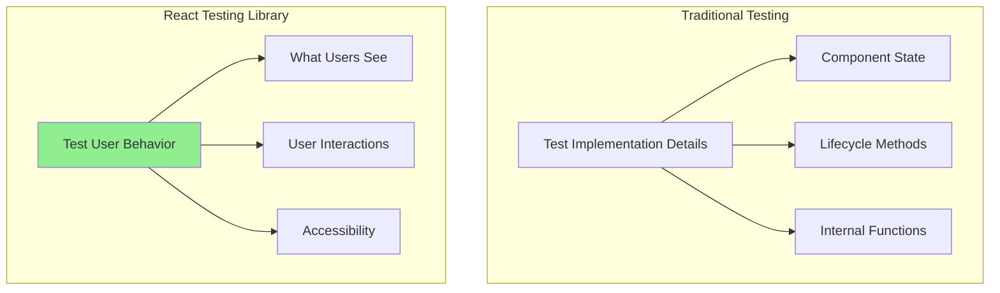
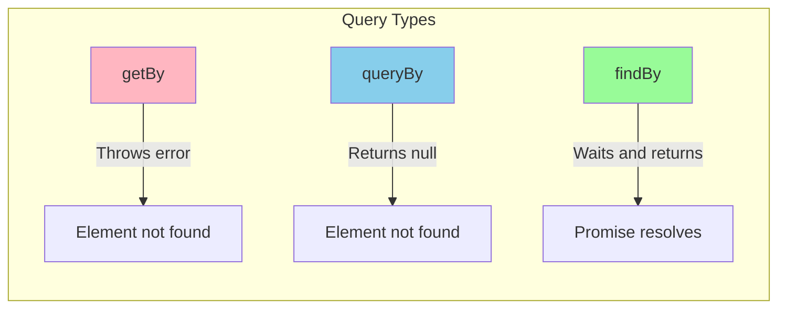
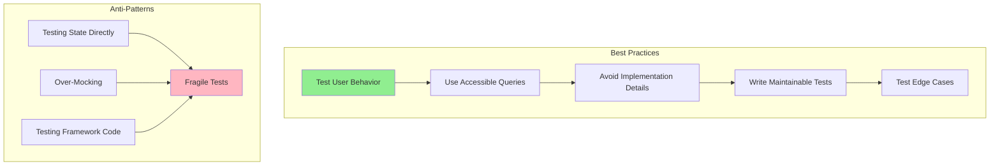

# How to Use React with React Testing Library

Author: [nawazdhandala](https://github.com/nawazdhandala)

Tags: React, Testing, React Testing Library, JavaScript

Description: A comprehensive guide to testing React applications using React Testing Library. Learn core concepts, query methods, user interactions, async testing, and best practices for writing maintainable tests that focus on user behavior.

---

Testing is an essential part of building reliable React applications. React Testing Library has become the de facto standard for testing React components because it encourages testing your application the way real users interact with it. This guide will take you through everything you need to know to effectively test your React applications using React Testing Library.

## What is React Testing Library?

React Testing Library (RTL) is a lightweight testing utility built on top of DOM Testing Library. Unlike other testing utilities that focus on testing implementation details, RTL focuses on testing components from the user's perspective. This approach leads to more maintainable tests that give you confidence your application works correctly.

The core philosophy of React Testing Library can be summarized in this guiding principle:

> "The more your tests resemble the way your software is used, the more confidence they can give you."

This means instead of testing internal component state or lifecycle methods, you should test what users see and how they interact with your application.



## Setting Up React Testing Library

Before diving into testing, you need to set up React Testing Library in your project. The setup varies slightly depending on whether you are using Create React App, Vite, or a custom configuration.

### Installation

The following command installs React Testing Library along with the essential companion libraries for comprehensive testing.

```bash
npm install --save-dev @testing-library/react @testing-library/jest-dom @testing-library/user-event
```

Here is what each package provides:

- **@testing-library/react**: Core testing utilities for rendering and querying React components
- **@testing-library/jest-dom**: Custom matchers that extend Jest for DOM assertions
- **@testing-library/user-event**: Simulates user interactions more realistically than fireEvent

### Configuration with Jest

Create a setup file that runs before each test to configure the testing environment with custom matchers.

```javascript
// src/setupTests.js

// Import jest-dom matchers for enhanced DOM assertions
import '@testing-library/jest-dom';

// Optional: Configure React Testing Library
import { configure } from '@testing-library/react';

configure({
  // Use data-testid as the default test ID attribute
  testIdAttribute: 'data-testid',

  // Throw suggestions for better queries when using getByTestId
  throwSuggestions: true,
});
```

### Jest Configuration File

Set up Jest to use the jsdom test environment and include your setup file.

```javascript
// jest.config.js

module.exports = {
  // Use jsdom for DOM testing
  testEnvironment: 'jsdom',

  // Run setup file before each test
  setupFilesAfterEnv: ['<rootDir>/src/setupTests.js'],

  // Handle CSS and static file imports
  moduleNameMapper: {
    '\\.(css|less|scss|sass)$': 'identity-obj-proxy',
    '\\.(jpg|jpeg|png|gif|svg)$': '<rootDir>/__mocks__/fileMock.js',
  },

  // Transform JavaScript and TypeScript files
  transform: {
    '^.+\\.(js|jsx|ts|tsx)$': 'babel-jest',
  },

  // Test file patterns
  testMatch: [
    '**/__tests__/**/*.[jt]s?(x)',
    '**/?(*.)+(spec|test).[jt]s?(x)',
  ],
};
```

## Core Concepts and Queries

React Testing Library provides various query methods to find elements in the rendered output. Understanding these queries and when to use them is fundamental to writing effective tests.

### Query Types

RTL offers three types of queries based on how they handle missing elements.



| Query Type | Returns | Throws on Missing | Use Case |
|------------|---------|-------------------|----------|
| getBy | Element | Yes | Element should exist |
| queryBy | Element or null | No | Element may not exist |
| findBy | Promise | Yes (after timeout) | Element will appear async |

### Query Priority

RTL recommends using queries in a specific priority order that aligns with how users and assistive technologies interact with your page.

This example demonstrates the recommended query priority from most preferred to least preferred.

```javascript
// src/components/UserCard.test.jsx

import { render, screen } from '@testing-library/react';
import UserCard from './UserCard';

describe('Query Priority Examples', () => {
  beforeEach(() => {
    render(<UserCard name="John Doe" email="john@example.com" role="admin" />);
  });

  // 1. getByRole - Most preferred, queries by ARIA role
  // Use this for interactive elements like buttons, links, and form controls
  it('finds the profile button by role', () => {
    const button = screen.getByRole('button', { name: /view profile/i });
    expect(button).toBeInTheDocument();
  });

  // 2. getByLabelText - Excellent for form elements
  // This is how screen reader users find form controls
  it('finds the email input by label', () => {
    const emailInput = screen.getByLabelText(/email address/i);
    expect(emailInput).toBeInTheDocument();
  });

  // 3. getByPlaceholderText - For inputs with placeholder text
  // Less preferred than label but still user-visible
  it('finds search input by placeholder', () => {
    const searchInput = screen.getByPlaceholderText(/search users/i);
    expect(searchInput).toBeInTheDocument();
  });

  // 4. getByText - For non-interactive text content
  // Good for finding headings, paragraphs, and spans
  it('finds the user name by text', () => {
    const userName = screen.getByText('John Doe');
    expect(userName).toBeInTheDocument();
  });

  // 5. getByDisplayValue - For inputs with current values
  // Useful for testing pre-filled form fields
  it('finds input by its current value', () => {
    const input = screen.getByDisplayValue('john@example.com');
    expect(input).toBeInTheDocument();
  });

  // 6. getByAltText - For images
  // Essential for testing accessible images
  it('finds the avatar by alt text', () => {
    const avatar = screen.getByAltText(/john doe avatar/i);
    expect(avatar).toBeInTheDocument();
  });

  // 7. getByTitle - For elements with title attribute
  // Less common but useful for tooltips
  it('finds element by title attribute', () => {
    const tooltip = screen.getByTitle(/admin badge/i);
    expect(tooltip).toBeInTheDocument();
  });

  // 8. getByTestId - Last resort
  // Use only when other queries are not practical
  it('finds element by test ID as fallback', () => {
    const container = screen.getByTestId('user-card-container');
    expect(container).toBeInTheDocument();
  });
});
```

## Writing Your First Test

Let us start with a simple component and progressively build more complex tests.

### Testing a Simple Component

Here is a basic Button component that we will test.

```jsx
// src/components/Button.jsx

function Button({
  children,
  onClick,
  variant = 'primary',
  disabled = false,
  loading = false
}) {
  const baseClasses = 'px-4 py-2 rounded font-medium transition-colors';
  const variantClasses = {
    primary: 'bg-blue-500 text-white hover:bg-blue-600',
    secondary: 'bg-gray-200 text-gray-800 hover:bg-gray-300',
    danger: 'bg-red-500 text-white hover:bg-red-600',
  };

  return (
    <button
      className={`${baseClasses} ${variantClasses[variant]}`}
      onClick={onClick}
      disabled={disabled || loading}
      aria-busy={loading}
    >
      {loading ? 'Loading...' : children}
    </button>
  );
}

export default Button;
```

This test file demonstrates basic rendering and assertion patterns.

```jsx
// src/components/Button.test.jsx

import { render, screen } from '@testing-library/react';
import Button from './Button';

describe('Button Component', () => {
  // Test that the component renders with correct content
  it('renders with the correct text', () => {
    render(<Button>Click me</Button>);

    // getByRole is preferred because it tests accessibility
    const button = screen.getByRole('button', { name: /click me/i });
    expect(button).toBeInTheDocument();
  });

  // Test that props are applied correctly
  it('applies the disabled attribute when disabled prop is true', () => {
    render(<Button disabled>Disabled Button</Button>);

    const button = screen.getByRole('button', { name: /disabled button/i });
    expect(button).toBeDisabled();
  });

  // Test loading state changes the button content
  it('shows loading text when loading is true', () => {
    render(<Button loading>Submit</Button>);

    // The button text should change to "Loading..."
    expect(screen.getByRole('button', { name: /loading/i })).toBeInTheDocument();

    // The original text should not be visible
    expect(screen.queryByText('Submit')).not.toBeInTheDocument();
  });

  // Test ARIA attributes for accessibility
  it('has aria-busy attribute when loading', () => {
    render(<Button loading>Submit</Button>);

    const button = screen.getByRole('button');
    expect(button).toHaveAttribute('aria-busy', 'true');
  });
});
```

## Testing User Interactions

React Testing Library provides `user-event` for simulating user interactions. This library fires events that mimic actual user behavior more closely than the basic `fireEvent` utility.

### Setting Up User Event

The userEvent.setup() call creates a user session that maintains state across interactions.

```jsx
// src/components/Counter.test.jsx

import { render, screen } from '@testing-library/react';
import userEvent from '@testing-library/user-event';
import Counter from './Counter';

describe('Counter Component', () => {
  // Set up user for interaction simulation
  // Always call setup() at the start of each test or beforeEach
  it('increments count when increment button is clicked', async () => {
    const user = userEvent.setup();
    render(<Counter initialCount={0} />);

    // Find the increment button
    const incrementButton = screen.getByRole('button', { name: /increment/i });

    // Simulate a click - note the await since user events are async
    await user.click(incrementButton);

    // Assert the count has increased
    expect(screen.getByText(/count: 1/i)).toBeInTheDocument();
  });

  it('decrements count when decrement button is clicked', async () => {
    const user = userEvent.setup();
    render(<Counter initialCount={5} />);

    const decrementButton = screen.getByRole('button', { name: /decrement/i });
    await user.click(decrementButton);

    expect(screen.getByText(/count: 4/i)).toBeInTheDocument();
  });

  // Test multiple interactions
  it('handles multiple clicks correctly', async () => {
    const user = userEvent.setup();
    render(<Counter initialCount={0} />);

    const incrementButton = screen.getByRole('button', { name: /increment/i });

    // Click three times
    await user.click(incrementButton);
    await user.click(incrementButton);
    await user.click(incrementButton);

    expect(screen.getByText(/count: 3/i)).toBeInTheDocument();
  });
});
```

### Testing Form Interactions

Form testing is one of the most common testing scenarios. Here is a comprehensive example.

```jsx
// src/components/LoginForm.jsx

import { useState } from 'react';

function LoginForm({ onSubmit }) {
  const [email, setEmail] = useState('');
  const [password, setPassword] = useState('');
  const [errors, setErrors] = useState({});

  const validate = () => {
    const newErrors = {};

    if (!email) {
      newErrors.email = 'Email is required';
    } else if (!/\S+@\S+\.\S+/.test(email)) {
      newErrors.email = 'Please enter a valid email';
    }

    if (!password) {
      newErrors.password = 'Password is required';
    } else if (password.length < 8) {
      newErrors.password = 'Password must be at least 8 characters';
    }

    setErrors(newErrors);
    return Object.keys(newErrors).length === 0;
  };

  const handleSubmit = (e) => {
    e.preventDefault();
    if (validate()) {
      onSubmit({ email, password });
    }
  };

  return (
    <form onSubmit={handleSubmit} aria-label="Login form">
      <div>
        <label htmlFor="email">Email</label>
        <input
          id="email"
          type="email"
          value={email}
          onChange={(e) => setEmail(e.target.value)}
          aria-describedby={errors.email ? 'email-error' : undefined}
          aria-invalid={!!errors.email}
        />
        {errors.email && (
          <span id="email-error" role="alert">{errors.email}</span>
        )}
      </div>

      <div>
        <label htmlFor="password">Password</label>
        <input
          id="password"
          type="password"
          value={password}
          onChange={(e) => setPassword(e.target.value)}
          aria-describedby={errors.password ? 'password-error' : undefined}
          aria-invalid={!!errors.password}
        />
        {errors.password && (
          <span id="password-error" role="alert">{errors.password}</span>
        )}
      </div>

      <button type="submit">Log In</button>
    </form>
  );
}

export default LoginForm;
```

This test file covers various form interaction scenarios including validation.

```jsx
// src/components/LoginForm.test.jsx

import { render, screen } from '@testing-library/react';
import userEvent from '@testing-library/user-event';
import LoginForm from './LoginForm';

describe('LoginForm Component', () => {
  // Create a mock function for the onSubmit prop
  const mockOnSubmit = jest.fn();

  // Reset mock before each test to ensure clean state
  beforeEach(() => {
    mockOnSubmit.mockClear();
  });

  it('renders all form elements', () => {
    render(<LoginForm onSubmit={mockOnSubmit} />);

    // Check for form elements using accessible queries
    expect(screen.getByLabelText(/email/i)).toBeInTheDocument();
    expect(screen.getByLabelText(/password/i)).toBeInTheDocument();
    expect(screen.getByRole('button', { name: /log in/i })).toBeInTheDocument();
  });

  it('allows users to type in the email field', async () => {
    const user = userEvent.setup();
    render(<LoginForm onSubmit={mockOnSubmit} />);

    const emailInput = screen.getByLabelText(/email/i);

    // Type into the input field
    await user.type(emailInput, 'test@example.com');

    // Verify the input value
    expect(emailInput).toHaveValue('test@example.com');
  });

  it('allows users to type in the password field', async () => {
    const user = userEvent.setup();
    render(<LoginForm onSubmit={mockOnSubmit} />);

    const passwordInput = screen.getByLabelText(/password/i);
    await user.type(passwordInput, 'secretpassword');

    expect(passwordInput).toHaveValue('secretpassword');
  });

  it('shows error messages for empty fields on submit', async () => {
    const user = userEvent.setup();
    render(<LoginForm onSubmit={mockOnSubmit} />);

    // Click submit without filling the form
    await user.click(screen.getByRole('button', { name: /log in/i }));

    // Check for error messages using role="alert"
    expect(screen.getByText(/email is required/i)).toBeInTheDocument();
    expect(screen.getByText(/password is required/i)).toBeInTheDocument();

    // Verify onSubmit was not called
    expect(mockOnSubmit).not.toHaveBeenCalled();
  });

  it('shows error for invalid email format', async () => {
    const user = userEvent.setup();
    render(<LoginForm onSubmit={mockOnSubmit} />);

    // Type invalid email
    await user.type(screen.getByLabelText(/email/i), 'invalid-email');
    await user.type(screen.getByLabelText(/password/i), 'password123');
    await user.click(screen.getByRole('button', { name: /log in/i }));

    expect(screen.getByText(/please enter a valid email/i)).toBeInTheDocument();
  });

  it('shows error for short password', async () => {
    const user = userEvent.setup();
    render(<LoginForm onSubmit={mockOnSubmit} />);

    await user.type(screen.getByLabelText(/email/i), 'test@example.com');
    await user.type(screen.getByLabelText(/password/i), 'short');
    await user.click(screen.getByRole('button', { name: /log in/i }));

    expect(screen.getByText(/password must be at least 8 characters/i)).toBeInTheDocument();
  });

  it('submits the form with valid data', async () => {
    const user = userEvent.setup();
    render(<LoginForm onSubmit={mockOnSubmit} />);

    // Fill in valid data
    await user.type(screen.getByLabelText(/email/i), 'test@example.com');
    await user.type(screen.getByLabelText(/password/i), 'password123');
    await user.click(screen.getByRole('button', { name: /log in/i }));

    // Verify onSubmit was called with correct data
    expect(mockOnSubmit).toHaveBeenCalledTimes(1);
    expect(mockOnSubmit).toHaveBeenCalledWith({
      email: 'test@example.com',
      password: 'password123',
    });
  });

  it('marks invalid fields with aria-invalid', async () => {
    const user = userEvent.setup();
    render(<LoginForm onSubmit={mockOnSubmit} />);

    await user.click(screen.getByRole('button', { name: /log in/i }));

    expect(screen.getByLabelText(/email/i)).toHaveAttribute('aria-invalid', 'true');
    expect(screen.getByLabelText(/password/i)).toHaveAttribute('aria-invalid', 'true');
  });
});
```

## Testing Asynchronous Code

Many React components involve asynchronous operations like data fetching. RTL provides utilities to handle these scenarios elegantly.

### Using findBy Queries

The findBy queries return a Promise that resolves when the element appears or times out.

```jsx
// src/components/UserProfile.jsx

import { useState, useEffect } from 'react';

function UserProfile({ userId }) {
  const [user, setUser] = useState(null);
  const [loading, setLoading] = useState(true);
  const [error, setError] = useState(null);

  useEffect(() => {
    const fetchUser = async () => {
      try {
        setLoading(true);
        const response = await fetch(`/api/users/${userId}`);

        if (!response.ok) {
          throw new Error('Failed to fetch user');
        }

        const data = await response.json();
        setUser(data);
      } catch (err) {
        setError(err.message);
      } finally {
        setLoading(false);
      }
    };

    fetchUser();
  }, [userId]);

  if (loading) {
    return <div role="status" aria-busy="true">Loading user profile...</div>;
  }

  if (error) {
    return <div role="alert">Error: {error}</div>;
  }

  return (
    <article aria-labelledby="user-name">
      <h2 id="user-name">{user.name}</h2>
      <p>{user.email}</p>
      <p>Member since: {user.joinDate}</p>
    </article>
  );
}

export default UserProfile;
```

This test file demonstrates testing async operations with mocked API responses.

```jsx
// src/components/UserProfile.test.jsx

import { render, screen, waitFor, waitForElementToBeRemoved } from '@testing-library/react';
import UserProfile from './UserProfile';

// Mock the global fetch function
global.fetch = jest.fn();

describe('UserProfile Component', () => {
  // Reset fetch mock before each test
  beforeEach(() => {
    fetch.mockClear();
  });

  it('shows loading state initially', () => {
    // Mock a pending promise to keep loading state
    fetch.mockImplementation(() => new Promise(() => {}));

    render(<UserProfile userId="123" />);

    // Check for loading indicator
    expect(screen.getByRole('status')).toBeInTheDocument();
    expect(screen.getByText(/loading user profile/i)).toBeInTheDocument();
  });

  it('displays user data after successful fetch', async () => {
    // Mock successful API response
    const mockUser = {
      name: 'Jane Smith',
      email: 'jane@example.com',
      joinDate: '2024-01-15',
    };

    fetch.mockResolvedValueOnce({
      ok: true,
      json: () => Promise.resolve(mockUser),
    });

    render(<UserProfile userId="123" />);

    // Use findBy for elements that appear asynchronously
    const userName = await screen.findByText('Jane Smith');
    expect(userName).toBeInTheDocument();

    // Other elements should also be present
    expect(screen.getByText('jane@example.com')).toBeInTheDocument();
    expect(screen.getByText(/member since:/i)).toBeInTheDocument();
  });

  it('displays error message on fetch failure', async () => {
    // Mock failed API response
    fetch.mockResolvedValueOnce({
      ok: false,
      status: 404,
    });

    render(<UserProfile userId="999" />);

    // Wait for error message to appear
    const errorMessage = await screen.findByRole('alert');
    expect(errorMessage).toHaveTextContent(/failed to fetch user/i);
  });

  it('removes loading indicator after data loads', async () => {
    fetch.mockResolvedValueOnce({
      ok: true,
      json: () => Promise.resolve({ name: 'Test User', email: 'test@test.com' }),
    });

    render(<UserProfile userId="123" />);

    // Verify loading is initially present
    expect(screen.getByRole('status')).toBeInTheDocument();

    // Wait for loading to be removed
    await waitForElementToBeRemoved(() => screen.queryByRole('status'));

    // Verify user content is displayed
    expect(screen.getByText('Test User')).toBeInTheDocument();
  });

  it('fetches new user when userId changes', async () => {
    const firstUser = { name: 'User One', email: 'one@test.com' };
    const secondUser = { name: 'User Two', email: 'two@test.com' };

    fetch
      .mockResolvedValueOnce({
        ok: true,
        json: () => Promise.resolve(firstUser),
      })
      .mockResolvedValueOnce({
        ok: true,
        json: () => Promise.resolve(secondUser),
      });

    const { rerender } = render(<UserProfile userId="1" />);

    // Wait for first user
    await screen.findByText('User One');
    expect(fetch).toHaveBeenCalledWith('/api/users/1');

    // Change userId
    rerender(<UserProfile userId="2" />);

    // Wait for second user
    await screen.findByText('User Two');
    expect(fetch).toHaveBeenCalledWith('/api/users/2');
  });
});
```

### Using waitFor for Assertions

The waitFor utility is useful when you need to wait for multiple conditions or complex state changes.

```jsx
// src/components/SearchResults.test.jsx

import { render, screen, waitFor } from '@testing-library/react';
import userEvent from '@testing-library/user-event';
import SearchResults from './SearchResults';

describe('SearchResults Component', () => {
  it('displays search results after debounced search', async () => {
    const user = userEvent.setup();
    render(<SearchResults />);

    const searchInput = screen.getByRole('searchbox');
    await user.type(searchInput, 'react');

    // waitFor retries the assertion until it passes or times out
    await waitFor(
      () => {
        expect(screen.getByText(/found \d+ results/i)).toBeInTheDocument();
      },
      { timeout: 3000 } // Optional custom timeout
    );
  });

  it('shows no results message for empty search', async () => {
    const user = userEvent.setup();
    render(<SearchResults />);

    const searchInput = screen.getByRole('searchbox');
    await user.type(searchInput, 'xyznonexistent');

    await waitFor(() => {
      expect(screen.getByText(/no results found/i)).toBeInTheDocument();
    });
  });
});
```

## Testing Components with Context

When components consume React Context, you need to wrap them with the appropriate providers during testing.

### Creating a Test Wrapper

This pattern creates a reusable wrapper that provides all necessary context providers.

```jsx
// src/test-utils/test-utils.jsx

import { render } from '@testing-library/react';
import { ThemeProvider } from '../contexts/ThemeContext';
import { AuthProvider } from '../contexts/AuthContext';
import { BrowserRouter } from 'react-router-dom';

// Create a custom render function that wraps components with providers
function customRender(ui, options = {}) {
  const {
    // Allow customizing initial theme
    theme = 'light',
    // Allow customizing initial auth state
    user = null,
    // Allow customizing initial route
    route = '/',
    // Pass through other options
    ...renderOptions
  } = options;

  // Set up the route
  window.history.pushState({}, 'Test page', route);

  // Create the wrapper with all providers
  function AllProviders({ children }) {
    return (
      <BrowserRouter>
        <ThemeProvider initialTheme={theme}>
          <AuthProvider initialUser={user}>
            {children}
          </AuthProvider>
        </ThemeProvider>
      </BrowserRouter>
    );
  }

  return render(ui, { wrapper: AllProviders, ...renderOptions });
}

// Re-export everything from RTL
export * from '@testing-library/react';

// Override the default render
export { customRender as render };
```

### Using the Custom Render

```jsx
// src/components/Dashboard.test.jsx

// Import from custom test utilities instead of @testing-library/react
import { render, screen } from '../test-utils/test-utils';
import userEvent from '@testing-library/user-event';
import Dashboard from './Dashboard';

describe('Dashboard Component', () => {
  it('displays welcome message for authenticated user', () => {
    // Pass custom options to the render function
    render(<Dashboard />, {
      user: { name: 'John Doe', email: 'john@example.com' },
    });

    expect(screen.getByText(/welcome, john doe/i)).toBeInTheDocument();
  });

  it('redirects to login when not authenticated', () => {
    render(<Dashboard />, { user: null, route: '/dashboard' });

    // Check that we are redirected
    expect(window.location.pathname).toBe('/login');
  });

  it('applies dark theme styles when theme is dark', () => {
    render(<Dashboard />, {
      user: { name: 'Test User' },
      theme: 'dark',
    });

    const container = screen.getByTestId('dashboard-container');
    expect(container).toHaveClass('dark-theme');
  });
});
```

## Testing Custom Hooks

React Testing Library provides `renderHook` for testing custom hooks in isolation.

### Example Custom Hook

```jsx
// src/hooks/useLocalStorage.js

import { useState, useEffect } from 'react';

function useLocalStorage(key, initialValue) {
  // Get stored value or use initial value
  const [storedValue, setStoredValue] = useState(() => {
    try {
      const item = window.localStorage.getItem(key);
      return item ? JSON.parse(item) : initialValue;
    } catch (error) {
      console.error('Error reading from localStorage:', error);
      return initialValue;
    }
  });

  // Update localStorage when value changes
  useEffect(() => {
    try {
      window.localStorage.setItem(key, JSON.stringify(storedValue));
    } catch (error) {
      console.error('Error writing to localStorage:', error);
    }
  }, [key, storedValue]);

  return [storedValue, setStoredValue];
}

export default useLocalStorage;
```

This test file demonstrates testing custom hooks with renderHook.

```jsx
// src/hooks/useLocalStorage.test.js

import { renderHook, act } from '@testing-library/react';
import useLocalStorage from './useLocalStorage';

describe('useLocalStorage Hook', () => {
  // Clear localStorage before each test
  beforeEach(() => {
    window.localStorage.clear();
  });

  it('returns initial value when localStorage is empty', () => {
    const { result } = renderHook(() => useLocalStorage('testKey', 'default'));

    // result.current contains the return value of the hook
    const [value] = result.current;
    expect(value).toBe('default');
  });

  it('returns stored value from localStorage', () => {
    // Pre-populate localStorage
    window.localStorage.setItem('testKey', JSON.stringify('stored value'));

    const { result } = renderHook(() => useLocalStorage('testKey', 'default'));

    const [value] = result.current;
    expect(value).toBe('stored value');
  });

  it('updates localStorage when value changes', () => {
    const { result } = renderHook(() => useLocalStorage('testKey', 'initial'));

    // Use act() when updating hook state
    act(() => {
      const [, setValue] = result.current;
      setValue('updated value');
    });

    // Check the hook returns updated value
    const [value] = result.current;
    expect(value).toBe('updated value');

    // Check localStorage was updated
    expect(window.localStorage.getItem('testKey')).toBe('"updated value"');
  });

  it('handles complex objects', () => {
    const complexObject = { name: 'Test', items: [1, 2, 3] };
    const { result } = renderHook(() => useLocalStorage('testKey', complexObject));

    const [value] = result.current;
    expect(value).toEqual(complexObject);
  });

  it('updates when key changes', () => {
    window.localStorage.setItem('key1', JSON.stringify('value1'));
    window.localStorage.setItem('key2', JSON.stringify('value2'));

    const { result, rerender } = renderHook(
      ({ key }) => useLocalStorage(key, 'default'),
      { initialProps: { key: 'key1' } }
    );

    expect(result.current[0]).toBe('value1');

    // Change the key
    rerender({ key: 'key2' });

    expect(result.current[0]).toBe('value2');
  });
});
```

## Mocking Modules and APIs

Effective testing often requires mocking external dependencies like API calls, third-party libraries, or browser APIs.

### Mocking API Calls with MSW

Mock Service Worker (MSW) is the recommended way to mock API calls in React Testing Library tests.

```jsx
// src/mocks/handlers.js

import { rest } from 'msw';

export const handlers = [
  // Mock GET request for users
  rest.get('/api/users', (req, res, ctx) => {
    return res(
      ctx.status(200),
      ctx.json([
        { id: 1, name: 'Alice', email: 'alice@example.com' },
        { id: 2, name: 'Bob', email: 'bob@example.com' },
      ])
    );
  }),

  // Mock GET request for single user
  rest.get('/api/users/:userId', (req, res, ctx) => {
    const { userId } = req.params;

    if (userId === '999') {
      return res(ctx.status(404), ctx.json({ error: 'User not found' }));
    }

    return res(
      ctx.status(200),
      ctx.json({ id: userId, name: 'Test User', email: 'test@example.com' })
    );
  }),

  // Mock POST request for creating user
  rest.post('/api/users', async (req, res, ctx) => {
    const body = await req.json();

    return res(
      ctx.status(201),
      ctx.json({ id: Date.now(), ...body })
    );
  }),
];
```

Set up MSW in your test setup file.

```jsx
// src/mocks/server.js

import { setupServer } from 'msw/node';
import { handlers } from './handlers';

export const server = setupServer(...handlers);

// src/setupTests.js

import { server } from './mocks/server';

// Start server before all tests
beforeAll(() => server.listen({ onUnhandledRequest: 'error' }));

// Reset handlers after each test
afterEach(() => server.resetHandlers());

// Close server after all tests
afterAll(() => server.close());
```

### Overriding Handlers in Tests

You can override handlers in specific tests for edge cases.

```jsx
// src/components/UserList.test.jsx

import { render, screen, waitFor } from '@testing-library/react';
import { rest } from 'msw';
import { server } from '../mocks/server';
import UserList from './UserList';

describe('UserList Component', () => {
  it('displays users from API', async () => {
    render(<UserList />);

    // Wait for users to load (uses default handler)
    await waitFor(() => {
      expect(screen.getByText('Alice')).toBeInTheDocument();
      expect(screen.getByText('Bob')).toBeInTheDocument();
    });
  });

  it('displays empty state when no users', async () => {
    // Override handler for this specific test
    server.use(
      rest.get('/api/users', (req, res, ctx) => {
        return res(ctx.status(200), ctx.json([]));
      })
    );

    render(<UserList />);

    await waitFor(() => {
      expect(screen.getByText(/no users found/i)).toBeInTheDocument();
    });
  });

  it('displays error message on API failure', async () => {
    // Override handler to return error
    server.use(
      rest.get('/api/users', (req, res, ctx) => {
        return res(ctx.status(500), ctx.json({ error: 'Internal Server Error' }));
      })
    );

    render(<UserList />);

    await waitFor(() => {
      expect(screen.getByRole('alert')).toHaveTextContent(/error loading users/i);
    });
  });
});
```

## Best Practices

Following best practices ensures your tests are maintainable, reliable, and provide real confidence in your code.



### Do: Test User Behavior

Focus on what users can see and do, not internal implementation.

```jsx
// Good: Testing what users experience
it('shows success message after form submission', async () => {
  const user = userEvent.setup();
  render(<ContactForm />);

  await user.type(screen.getByLabelText(/name/i), 'John');
  await user.type(screen.getByLabelText(/email/i), 'john@example.com');
  await user.click(screen.getByRole('button', { name: /submit/i }));

  expect(await screen.findByText(/message sent successfully/i)).toBeInTheDocument();
});

// Bad: Testing implementation details
it('sets isSubmitted state to true', async () => {
  // Testing internal state is fragile and provides less confidence
});
```

### Do: Use the Most Specific Query

Choose queries that most closely match how users find elements.

```jsx
// Best: Using role query (how screen readers identify elements)
screen.getByRole('button', { name: /submit/i });

// Good: Using label text (how users identify form fields)
screen.getByLabelText(/email address/i);

// Acceptable: Using text content
screen.getByText(/welcome/i);

// Last resort: Using test ID
screen.getByTestId('submit-button');
```

### Do: Write Descriptive Test Names

Test names should describe the expected behavior clearly.

```jsx
// Good: Describes the behavior being tested
describe('ShoppingCart', () => {
  it('increases item quantity when plus button is clicked', async () => {});
  it('removes item from cart when quantity reaches zero', async () => {});
  it('displays total price with tax included', () => {});
  it('shows empty cart message when no items present', () => {});
});

// Bad: Vague or implementation-focused names
describe('ShoppingCart', () => {
  it('works', () => {});
  it('renders correctly', () => {});
  it('calls setState', () => {});
});
```

### Do: Test Accessibility

React Testing Library naturally encourages accessible patterns through its query priority.

```jsx
// Testing accessibility features
it('has accessible form with proper labels', () => {
  render(<LoginForm />);

  // These queries only work if accessibility is implemented correctly
  expect(screen.getByRole('form', { name: /login/i })).toBeInTheDocument();
  expect(screen.getByLabelText(/email/i)).toBeInTheDocument();
  expect(screen.getByLabelText(/password/i)).toBeInTheDocument();
});

it('announces errors to screen readers', async () => {
  const user = userEvent.setup();
  render(<LoginForm />);

  await user.click(screen.getByRole('button', { name: /submit/i }));

  // Error messages should have role="alert" for screen readers
  expect(screen.getByRole('alert')).toHaveTextContent(/email is required/i);
});
```

### Do: Clean Up After Tests

While RTL handles DOM cleanup automatically, you should clean up other side effects.

```jsx
describe('Timer Component', () => {
  // Use fake timers for consistent testing
  beforeEach(() => {
    jest.useFakeTimers();
  });

  // Restore real timers after each test
  afterEach(() => {
    jest.useRealTimers();
  });

  it('updates countdown every second', () => {
    render(<Timer seconds={10} />);

    expect(screen.getByText('10')).toBeInTheDocument();

    // Advance time by 1 second
    act(() => {
      jest.advanceTimersByTime(1000);
    });

    expect(screen.getByText('9')).toBeInTheDocument();
  });
});
```

## Common Patterns and Solutions

Here are solutions to common testing scenarios you will encounter.

### Testing Modals and Portals

Modals often render outside the main component tree using portals.

```jsx
// src/components/Modal.test.jsx

import { render, screen } from '@testing-library/react';
import userEvent from '@testing-library/user-event';
import Modal from './Modal';

describe('Modal Component', () => {
  it('renders modal content when open', () => {
    render(
      <Modal isOpen={true} onClose={() => {}}>
        <p>Modal content here</p>
      </Modal>
    );

    // Content renders in the portal but is still queryable
    expect(screen.getByText('Modal content here')).toBeInTheDocument();
  });

  it('does not render when closed', () => {
    render(
      <Modal isOpen={false} onClose={() => {}}>
        <p>Modal content here</p>
      </Modal>
    );

    expect(screen.queryByText('Modal content here')).not.toBeInTheDocument();
  });

  it('calls onClose when backdrop is clicked', async () => {
    const handleClose = jest.fn();
    const user = userEvent.setup();

    render(
      <Modal isOpen={true} onClose={handleClose}>
        <p>Modal content</p>
      </Modal>
    );

    await user.click(screen.getByTestId('modal-backdrop'));

    expect(handleClose).toHaveBeenCalledTimes(1);
  });

  it('calls onClose when Escape key is pressed', async () => {
    const handleClose = jest.fn();
    const user = userEvent.setup();

    render(
      <Modal isOpen={true} onClose={handleClose}>
        <p>Modal content</p>
      </Modal>
    );

    await user.keyboard('{Escape}');

    expect(handleClose).toHaveBeenCalledTimes(1);
  });
});
```

### Testing Conditional Rendering

Use queryBy when elements may not be present.

```jsx
// src/components/Notification.test.jsx

import { render, screen } from '@testing-library/react';
import userEvent from '@testing-library/user-event';
import Notification from './Notification';

describe('Notification Component', () => {
  it('renders notification when message is provided', () => {
    render(<Notification message="Success!" type="success" />);

    expect(screen.getByRole('alert')).toHaveTextContent('Success!');
  });

  it('does not render when message is empty', () => {
    render(<Notification message="" type="info" />);

    // Use queryBy for elements that may not exist
    expect(screen.queryByRole('alert')).not.toBeInTheDocument();
  });

  it('hides notification when dismiss button is clicked', async () => {
    const user = userEvent.setup();
    render(<Notification message="Test message" type="info" dismissible />);

    expect(screen.getByRole('alert')).toBeInTheDocument();

    await user.click(screen.getByRole('button', { name: /dismiss/i }));

    expect(screen.queryByRole('alert')).not.toBeInTheDocument();
  });
});
```

### Testing Lists and Tables

```jsx
// src/components/UserTable.test.jsx

import { render, screen, within } from '@testing-library/react';
import UserTable from './UserTable';

describe('UserTable Component', () => {
  const users = [
    { id: 1, name: 'Alice', email: 'alice@example.com', role: 'Admin' },
    { id: 2, name: 'Bob', email: 'bob@example.com', role: 'User' },
    { id: 3, name: 'Charlie', email: 'charlie@example.com', role: 'User' },
  ];

  it('renders correct number of rows', () => {
    render(<UserTable users={users} />);

    // Get all rows except the header row
    const rows = screen.getAllByRole('row');
    // Subtract 1 for header row
    expect(rows.length - 1).toBe(users.length);
  });

  it('displays user data in correct columns', () => {
    render(<UserTable users={users} />);

    // Use within to scope queries to a specific row
    const firstRow = screen.getAllByRole('row')[1]; // Skip header

    expect(within(firstRow).getByText('Alice')).toBeInTheDocument();
    expect(within(firstRow).getByText('alice@example.com')).toBeInTheDocument();
    expect(within(firstRow).getByText('Admin')).toBeInTheDocument();
  });

  it('displays empty message when no users', () => {
    render(<UserTable users={[]} />);

    expect(screen.getByText(/no users to display/i)).toBeInTheDocument();
  });
});
```

## Debugging Tests

When tests fail, these debugging techniques help identify the issue.

### Using screen.debug()

The debug function prints the current DOM state to the console.

```jsx
it('helps debug failing tests', () => {
  render(<MyComponent />);

  // Print entire document
  screen.debug();

  // Print specific element
  screen.debug(screen.getByRole('button'));

  // Print with custom max length
  screen.debug(undefined, 30000);
});
```

### Using logRoles

The logRoles function shows all ARIA roles in the document, helping identify the correct query.

```jsx
import { logRoles } from '@testing-library/dom';

it('shows available roles for debugging', () => {
  const { container } = render(<MyComponent />);

  // Logs all elements with their roles
  logRoles(container);
});
```

### Using Testing Playground

The Testing Playground browser extension helps generate queries interactively.

```jsx
it('opens testing playground', () => {
  render(<MyComponent />);

  // Opens interactive testing playground in browser
  screen.logTestingPlaygroundURL();
});
```

## Summary

React Testing Library provides a user-centric approach to testing React applications that leads to more maintainable tests and better accessibility. By focusing on how users interact with your components rather than implementation details, you create tests that give you genuine confidence in your application.

Key takeaways from this guide:

1. **Use queries that reflect user behavior** - Prioritize getByRole and getByLabelText over getByTestId
2. **Test what users see and do** - Focus on visible output and user interactions, not internal state
3. **Use userEvent for interactions** - It simulates real user behavior more accurately than fireEvent
4. **Handle async operations properly** - Use findBy queries and waitFor for asynchronous content
5. **Create custom render functions** - Wrap components with necessary providers for realistic testing
6. **Mock external dependencies wisely** - Use MSW for API mocking and keep mocks minimal
7. **Write clear, descriptive tests** - Test names should describe the expected behavior

With these patterns and practices, you can build a comprehensive test suite that ensures your React applications work correctly for real users.

## Additional Resources

- [React Testing Library Documentation](https://testing-library.com/docs/react-testing-library/intro/)
- [Testing Library Cheatsheet](https://testing-library.com/docs/react-testing-library/cheatsheet/)
- [Common Mistakes with React Testing Library](https://kentcdodds.com/blog/common-mistakes-with-react-testing-library)
- [Mock Service Worker Documentation](https://mswjs.io/docs/)
- [Jest Documentation](https://jestjs.io/docs/getting-started)
